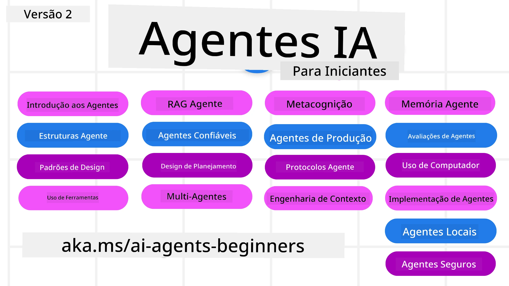

# Agentes de IA para Iniciantes - Um Curso



## Um curso que ensina tudo o que precisa de saber para começar a construir Agentes de IA

[](https://github.com/microsoft/ai-agents-for-beginners/blob/master/LICENSE?WT.mc_id=academic-105485-koreyst)
[](https://GitHub.com/microsoft/ai-agents-for-beginners/graphs/contributors/?WT.mc_id=academic-105485-koreyst)
[](https://GitHub.com/microsoft/ai-agents-for-beginners/issues/?WT.mc_id=academic-105485-koreyst)
[](https://GitHub.com/microsoft/ai-agents-for-beginners/pulls/?WT.mc_id=academic-105485-koreyst)
[](http://makeapullrequest.com?WT.mc_id=academic-105485-koreyst)

### 🌐 Suporte Multilíngue

#### Suportado via GitHub Action (Automatizado e Sempre Atualizado)

<!-- CO-OP TRANSLATOR LANGUAGES TABLE START -->
[Árabe](../ar/README.md) | [Bengalês](../bn/README.md) | [Búlgaro](../bg/README.md) | [Birmanês (Myanmar)](../my/README.md) | [Chinês (Simplificado)](../zh-CN/README.md) | [Chinês (Tradicional, Hong Kong)](../zh-HK/README.md) | [Chinês (Tradicional, Macau)](../zh-MO/README.md) | [Chinês (Tradicional, Taiwan)](../zh-TW/README.md) | [Croata](../hr/README.md) | [Checo](../cs/README.md) | [Dinamarquês](../da/README.md) | [Holandês](../nl/README.md) | [Estónio](../et/README.md) | [Finlandês](../fi/README.md) | [Francês](../fr/README.md) | [Alemão](../de/README.md) | [Grego](../el/README.md) | [Hebraico](../he/README.md) | [Hindi](../hi/README.md) | [Húngaro](../hu/README.md) | [Indonésio](../id/README.md) | [Italiano](../it/README.md) | [Japonês](../ja/README.md) | [Canarês (Kannada)](../kn/README.md) | [Coreano](../ko/README.md) | [Lituano](../lt/README.md) | [Malaio](../ms/README.md) | [Malayalam](../ml/README.md) | [Marathi](../mr/README.md) | [Nepalês](../ne/README.md) | [Pidgin Nigeriano](../pcm/README.md) | [Norueguês](../no/README.md) | [Persa (Farsi)](../fa/README.md) | [Polaco](../pl/README.md) | [Português (Brasil)](../pt-BR/README.md) | [Português (Portugal)](./README.md) | [Punjabi (Gurmukhi)](../pa/README.md) | [Romeno](../ro/README.md) | [Russo](../ru/README.md) | [Sérvio (Cirílico)](../sr/README.md) | [Eslovaco](../sk/README.md) | [Esloveno](../sl/README.md) | [Espanhol](../es/README.md) | [Suaíli](../sw/README.md) | [Sueco](../sv/README.md) | [Tagalog (Filipino)](../tl/README.md) | [Tâmil](../ta/README.md) | [Telugu](../te/README.md) | [Tailandês](../th/README.md) | [Turco](../tr/README.md) | [Ucraniano](../uk/README.md) | [Urdu](../ur/README.md) | [Vietnamita](../vi/README.md)

> **Prefere clonar localmente?**
>
> Este repositório inclui mais de 50 traduções, o que aumenta significativamente o tamanho do download. Para clonar sem traduções, use checkout esparso:
>
> **Bash / macOS / Linux:**
> ```bash
> git clone --filter=blob:none --sparse https://github.com/microsoft/ai-agents-for-beginners.git
> cd ai-agents-for-beginners
> git sparse-checkout set --no-cone '/*' '!translations' '!translated_images'
> ```
>
> **CMD (Windows):**
> ```cmd
> git clone --filter=blob:none --sparse https://github.com/microsoft/ai-agents-for-beginners.git
> cd ai-agents-for-beginners
> git sparse-checkout set --no-cone "/*" "!translations" "!translated_images"
> ```
>
> Isto dá-lhe tudo o que precisa para completar o curso com um download muito mais rápido.
<!-- CO-OP TRANSLATOR LANGUAGES TABLE END -->

**Se desejar ter traduções adicionais, as línguas suportadas estão listadas [aqui](https://github.com/Azure/co-op-translator/blob/main/getting_started/supported-languages.md)**

[](https://GitHub.com/microsoft/ai-agents-for-beginners/watchers/?WT.mc_id=academic-105485-koreyst)
[](https://GitHub.com/microsoft/ai-agents-for-beginners/network/?WT.mc_id=academic-105485-koreyst)
[](https://GitHub.com/microsoft/ai-agents-for-beginners/stargazers/?WT.mc_id=academic-105485-koreyst)

[](https://discord.gg/nTYy5BXMWG)


## 🌱 Primeiros Passos

Este curso tem lições que cobrem os fundamentos da construção de Agentes de IA. Cada lição aborda o seu próprio tópico, por isso comece onde quiser!

Existe suporte multilíngue para este curso. Consulte as [línguas disponíveis aqui](../..). 

Se esta for a sua primeira vez a construir com modelos de IA Generativa, veja o nosso curso [IA Generativa para Iniciantes](https://aka.ms/genai-beginners), que inclui 21 lições sobre construção com GenAI.

Não se esqueça de [estrelar (🌟) este repositório](https://docs.github.com/en/get-started/exploring-projects-on-github/saving-repositories-with-stars?WT.mc_id=academic-105485-koreyst) e [criar um fork deste repositório](https://github.com/microsoft/ai-agents-for-beginners/fork) para executar o código.

### Conheça Outros Alunos, Obtenha Respostas às Suas Perguntas

Se ficar bloqueado ou tiver alguma dúvida sobre a construção de Agentes de IA, junte-se ao nosso canal dedicado no Discord em [Microsoft Foundry Discord](https://aka.ms/ai-agents/discord).

### O Que Precisa

Cada lição deste curso inclui exemplos de código, que podem ser encontrados na pasta code_samples. Pode [criar um fork deste repositório](https://github.com/microsoft/ai-agents-for-beginners/fork) para criar a sua própria cópia.  

Os exemplos de código nestes exercícios utilizam o Microsoft Agent Framework com o Azure AI Foundry Agent Service V2:

- [Microsoft Foundry](https://aka.ms/ai-agents-beginners/ai-foundry) - Conta Azure Necessária

Este curso utiliza os seguintes frameworks e serviços de Agentes de IA da Microsoft:

- [Microsoft Agent Framework (MAF)](https://aka.ms/ai-agents-beginners/agent-framewrok)
- [Azure AI Foundry Agent Service V2](https://aka.ms/ai-agents-beginners/ai-agent-service)


Para mais informações sobre como executar o código deste curso, consulte o [Course Setup](./00-course-setup/README.md).

## 🙏 Quer ajudar?

Tem sugestões ou encontrou erros ortográficos ou de código? [Abra uma issue](https://github.com/microsoft/ai-agents-for-beginners/issues?WT.mc_id=academic-105485-koreyst) ou [crie um pull request](https://github.com/microsoft/ai-agents-for-beginners/pulls?WT.mc_id=academic-105485-koreyst)


## 📂 Cada lição inclui

- Uma lição escrita localizada no README e um vídeo curto
- Exemplos de código em Python usando o Microsoft Agent Framework com Azure AI Foundry
- Ligações para recursos extra para continuar a sua aprendizagem


## 🗃️ Lições

| **Lição**                                   | **Texto e Código**                                | **Vídeo**                                                  | **Recursos Adicionais**                                                                 |
|----------------------------------------------|----------------------------------------------------|------------------------------------------------------------|----------------------------------------------------------------------------------------|
| Introdução a Agentes de IA e Casos de Uso    | [Ligação](./01-intro-to-ai-agents/README.md)       | [Vídeo](https://youtu.be/3zgm60bXmQk?si=z8QygFvYQv-9WtO1)  | [Ligação](https://aka.ms/ai-agents-beginners/collection?WT.mc_id=academic-105485-koreyst) |
| Explorar Frameworks Agênticos                | [Ligação](./02-explore-agentic-frameworks/README.md) | [Vídeo](https://youtu.be/ODwF-EZo_O8?si=Vawth4hzVaHv-u0H)  | [Ligação](https://aka.ms/ai-agents-beginners/collection?WT.mc_id=academic-105485-koreyst) |
| Compreender Padrões de Design Agêntico       | [Ligação](./03-agentic-design-patterns/README.md)  | [Vídeo](https://youtu.be/m9lM8qqoOEA?si=BIzHwzstTPL8o9GF)  | [Ligação](https://aka.ms/ai-agents-beginners/collection?WT.mc_id=academic-105485-koreyst) |
| Padrão de Design de Uso de Ferramentas       | [Ligação](./04-tool-use/README.md)                 | [Vídeo](https://youtu.be/vieRiPRx-gI?si=2z6O2Xu2cu_Jz46N)  | [Ligação](https://aka.ms/ai-agents-beginners/collection?WT.mc_id=academic-105485-koreyst) |
| RAG Agêntico                                  | [Ligação](./05-agentic-rag/README.md)              | [Vídeo](https://youtu.be/WcjAARvdL7I?si=gKPWsQpKiIlDH9A3)  | [Ligação](https://aka.ms/ai-agents-beginners/collection?WT.mc_id=academic-105485-koreyst) |
| Construir Agentes de IA Confiáveis           | [Ligação](./06-building-trustworthy-agents/README.md) | [Vídeo](https://youtu.be/iZKkMEGBCUQ?si=jZjpiMnGFOE9L8OK ) | [Ligação](https://aka.ms/ai-agents-beginners/collection?WT.mc_id=academic-105485-koreyst) |
| Padrão de Design de Planeamento              | [Ligação](./07-planning-design/README.md)          | [Vídeo](https://youtu.be/kPfJ2BrBCMY?si=6SC_iv_E5-mzucnC)  | [Ligação](https://aka.ms/ai-agents-beginners/collection?WT.mc_id=academic-105485-koreyst) |
| Padrão de Design Multi-Agente                | [Ligação](./08-multi-agent/README.md)              | [Vídeo](https://youtu.be/V6HpE9hZEx0?si=rMgDhEu7wXo2uo6g)  | [Ligação](https://aka.ms/ai-agents-beginners/collection?WT.mc_id=academic-105485-koreyst) |
| Padrão de Design de Metacognição             | [Ligação](./09-metacognition/README.md)            | [Vídeo](https://youtu.be/His9R6gw6Ec?si=8gck6vvdSNCt6OcF)  | [Ligação](https://aka.ms/ai-agents-beginners/collection?WT.mc_id=academic-105485-koreyst) |
| Agentes de IA em Produção                      | [Ligação](./10-ai-agents-production/README.md)        | [Vídeo](https://youtu.be/l4TP6IyJxmQ?si=31dnhexRo6yLRJDl)  | [Ligação](https://aka.ms/ai-agents-beginners/collection?WT.mc_id=academic-105485-koreyst) |
| Utilizando Protocolos entre Agentes (MCP, A2A and NLWeb) | [Ligação](./11-agentic-protocols/README.md)           | [Vídeo](https://youtu.be/X-Dh9R3Opn8)                                 | [Ligação](https://aka.ms/ai-agents-beginners/collection?WT.mc_id=academic-105485-koreyst) |
| Engenharia de Contexto para Agentes de IA            | [Ligação](./12-context-engineering/README.md)         | [Vídeo](https://youtu.be/F5zqRV7gEag)                                 | [Ligação](https://aka.ms/ai-agents-beginners/collection?WT.mc_id=academic-105485-koreyst) |
| Gerir a Memória de Agentes                      | [Ligação](./13-agent-memory/README.md)     |      [Vídeo](https://youtu.be/QrYbHesIxpw?si=vZkVwKrQ4ieCcIPx)                                                      |                                                                                        |
| Explorar o Microsoft Agent Framework                         | [Ligação](./14-microsoft-agent-framework/README.md)                            |                                                            |                                                                                        |
| Construir Agentes de Utilização de Computador (CUA)           | Em Breve                            |                                                            |                                                                                        |
| Implementar Agentes Escaláveis                    | Em Breve                            |                                                            |                                                                                        |
| Criar Agentes de IA Locais                     | Em Breve                               |                                                            |                                                                                        |
| Proteger Agentes de IA                           | Em Breve                               |                                                            |                                                                                        |

## 🎒 Outros Cursos

A nossa equipa produz outros cursos! Veja:

<!-- CO-OP TRANSLATOR OTHER COURSES START -->
### LangChain
[](https://aka.ms/langchain4j-for-beginners)
[](https://aka.ms/langchainjs-for-beginners?WT.mc_id=m365-94501-dwahlin)
[](https://github.com/microsoft/langchain-for-beginners?WT.mc_id=m365-94501-dwahlin)
---

### Azure / Edge / MCP / Agentes
[](https://github.com/microsoft/AZD-for-beginners?WT.mc_id=academic-105485-koreyst)
[](https://github.com/microsoft/edgeai-for-beginners?WT.mc_id=academic-105485-koreyst)
[](https://github.com/microsoft/mcp-for-beginners?WT.mc_id=academic-105485-koreyst)
[](https://github.com/microsoft/ai-agents-for-beginners?WT.mc_id=academic-105485-koreyst)

---
 
### Série de IA Generativa
[](https://github.com/microsoft/generative-ai-for-beginners?WT.mc_id=academic-105485-koreyst)
[-9333EA?style=for-the-badge&labelColor=E5E7EB&color=9333EA)](https://github.com/microsoft/Generative-AI-for-beginners-dotnet?WT.mc_id=academic-105485-koreyst)
[-C084FC?style=for-the-badge&labelColor=E5E7EB&color=C084FC)](https://github.com/microsoft/generative-ai-for-beginners-java?WT.mc_id=academic-105485-koreyst)
[-E879F9?style=for-the-badge&labelColor=E5E7EB&color=E879F9)](https://github.com/microsoft/generative-ai-with-javascript?WT.mc_id=academic-105485-koreyst)

---
 
### Aprendizagem Fundamental
[](https://aka.ms/ml-beginners?WT.mc_id=academic-105485-koreyst)
[](https://aka.ms/datascience-beginners?WT.mc_id=academic-105485-koreyst)
[](https://aka.ms/ai-beginners?WT.mc_id=academic-105485-koreyst)
[](https://github.com/microsoft/Security-101?WT.mc_id=academic-96948-sayoung)
[](https://aka.ms/webdev-beginners?WT.mc_id=academic-105485-koreyst)
[](https://aka.ms/iot-beginners?WT.mc_id=academic-105485-koreyst)
[](https://github.com/microsoft/xr-development-for-beginners?WT.mc_id=academic-105485-koreyst)

---
 
### Série Copilot
[](https://aka.ms/GitHubCopilotAI?WT.mc_id=academic-105485-koreyst)
[](https://github.com/microsoft/mastering-github-copilot-for-dotnet-csharp-developers?WT.mc_id=academic-105485-koreyst)
[](https://github.com/microsoft/CopilotAdventures?WT.mc_id=academic-105485-koreyst)
<!-- CO-OP TRANSLATOR OTHER COURSES END -->

## 🌟 Agradecimentos à Comunidade

Agradecemos a [Shivam Goyal](https://www.linkedin.com/in/shivam2003/) por ter contribuído com exemplos de código importantes que demonstram Agentic RAG. 

## Contribuições

Este projeto acolhe contribuições e sugestões. A maioria das contribuições exige que concorde com um
Contributor License Agreement (CLA) declarando que tem o direito de, e de facto nos concede,
os direitos para usar a sua contribuição. Para detalhes, visite <https://cla.opensource.microsoft.com>.

Quando submeter um pull request, um bot de CLA determinará automaticamente se precisa de fornecer
um CLA e assinalará o PR adequadamente (por exemplo, verificação de estado, comentário). Siga simplesmente as instruções
fornecidas pelo bot. Só terá de o fazer uma vez para todos os repositórios que usam o nosso CLA.

Este projeto adotou o [Microsoft Open Source Code of Conduct](https://opensource.microsoft.com/codeofconduct/).
Para mais informação veja o [Code of Conduct FAQ](https://opensource.microsoft.com/codeofconduct/faq/) ou
contacte [opencode@microsoft.com](mailto:opencode@microsoft.com) para quaisquer perguntas ou comentários adicionais.

## Marcas Comerciais

Este projeto pode conter marcas comerciais ou logótipos de projetos, produtos ou serviços. O uso autorizado de marcas ou
logótipos da Microsoft está sujeito e deve seguir as
[Microsoft's Trademark & Brand Guidelines](https://www.microsoft.com/legal/intellectualproperty/trademarks/usage/general).
O uso de marcas ou logótipos da Microsoft em versões modificadas deste projeto não deve causar confusão nem implicar patrocínio pela Microsoft.
Qualquer uso de marcas ou logótipos de terceiros está sujeito às políticas desses terceiros.

## Obter Ajuda


Se ficar bloqueado ou tiver perguntas sobre a criação de aplicações de IA, junte-se:

[](https://aka.ms/foundry/discord)

Se tiver feedback sobre o produto ou erros durante a construção, visite:

[](https://aka.ms/foundry/forum)

---

<!-- CO-OP TRANSLATOR DISCLAIMER START -->
Isenção de responsabilidade:
Este documento foi traduzido utilizando o serviço de tradução automática por IA Co-op Translator (https://github.com/Azure/co-op-translator). Embora nos esforcemos por garantir a precisão, por favor, tenha em atenção que as traduções automáticas podem conter erros ou imprecisões. O documento original, na sua língua nativa, deve ser considerado a fonte fidedigna. Para informação crítica, recomenda-se uma tradução profissional realizada por um tradutor humano. Não nos responsabilizamos por quaisquer mal-entendidos ou interpretações erradas resultantes da utilização desta tradução.
<!-- CO-OP TRANSLATOR DISCLAIMER END -->