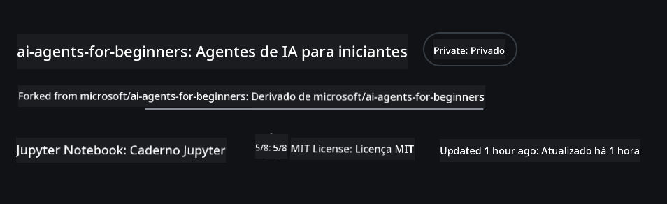
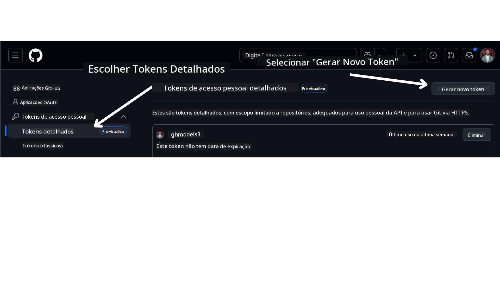
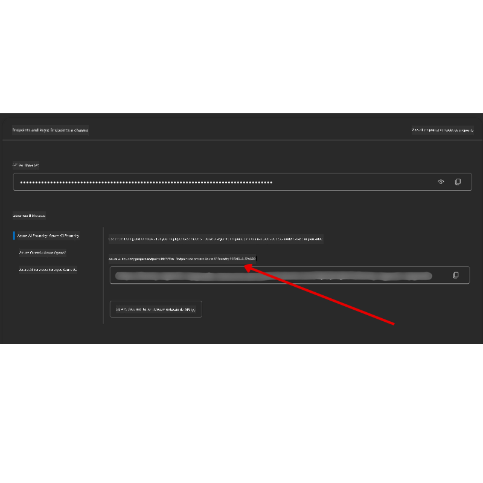

<!--
CO_OP_TRANSLATOR_METADATA:
{
  "original_hash": "76945069b52a49cd0432ae3e0b0ba22e",
  "translation_date": "2025-07-12T07:48:25+00:00",
  "source_file": "00-course-setup/README.md",
  "language_code": "pt"
}
-->
Deve agora ter a sua própria versão forkada deste curso no seguinte link:



## Executando o Código

Este curso oferece uma série de Jupyter Notebooks que você pode executar para obter experiência prática na construção de Agentes de IA.

Os exemplos de código utilizam uma das seguintes opções:

**Requer Conta GitHub - Gratuita**:

1) Semantic Kernel Agent Framework + GitHub Models Marketplace. Identificado como (semantic-kernel.ipynb)  
2) AutoGen Framework + GitHub Models Marketplace. Identificado como (autogen.ipynb)

**Requer Subscrição Azure**:  
3) Azure AI Foundry + Azure AI Agent Service. Identificado como (azureaiagent.ipynb)  

Encorajamos a experimentar os três tipos de exemplos para ver qual funciona melhor para si.

A opção que escolher determinará os passos de configuração que deverá seguir abaixo:

## Requisitos

- Python 3.12+  
  - **NOTA**: Se não tiver o Python 3.12 instalado, certifique-se de instalá-lo. Depois crie o seu ambiente virtual usando python3.12 para garantir que as versões corretas são instaladas a partir do ficheiro requirements.txt.  
- Conta GitHub - Para acesso ao GitHub Models Marketplace  
- Subscrição Azure - Para acesso ao Azure AI Foundry  
- Conta Azure AI Foundry - Para acesso ao Azure AI Agent Service  

Incluímos um ficheiro `requirements.txt` na raiz deste repositório que contém todos os pacotes Python necessários para executar os exemplos de código.

Pode instalá-los executando o seguinte comando no terminal na raiz do repositório:

```bash
pip install -r requirements.txt
```

Recomendamos criar um ambiente virtual Python para evitar conflitos e problemas.

## Configurar VSCode  
Certifique-se de que está a usar a versão correta do Python no VSCode.


## Configuração para Exemplos usando GitHub Models

### Passo 1: Obter o Seu Token de Acesso Pessoal (PAT) do GitHub

Atualmente, este curso utiliza o GitHub Models Marketplace para oferecer acesso gratuito a Large Language Models (LLMs) que serão usados para criar Agentes de IA.

Para aceder a este serviço, precisará de criar um Token de Acesso Pessoal no GitHub.

Isto pode ser feito acedendo à sua conta GitHub.

Selecione a opção `Fine-grained tokens` no lado esquerdo do ecrã.

Depois selecione `Generate new token`.



Será solicitado que insira um nome para o seu token, selecione a data de expiração (Recomendado: 30 Dias) e selecione os escopos para o seu token (Repositórios Públicos).

É também necessário editar as permissões deste token: Permissions -> Models -> Permite acesso aos GitHub Models

Copie o seu novo token que acabou de criar. Agora irá adicioná-lo ao seu ficheiro `.env` incluído neste curso.

### Passo 2: Criar o seu ficheiro `.env`

Para criar o seu ficheiro `.env` execute o seguinte comando no terminal.

```bash
cp .env.example .env
```

Isto copiará o ficheiro de exemplo e criará um `.env` no seu diretório, onde preencherá os valores das variáveis de ambiente.

Com o token copiado, abra o ficheiro `.env` no seu editor de texto favorito e cole o token no campo `GITHUB_TOKEN`.

Deverá agora conseguir executar os exemplos de código deste curso.

## Configuração para Exemplos usando Azure AI Foundry e Azure AI Agent Service

### Passo 1: Obter o Endpoint do seu Projeto Azure

Siga os passos para criar um hub e projeto no Azure AI Foundry descritos aqui: [Hub resources overview](https://learn.microsoft.com/en-us/azure/ai-foundry/concepts/ai-resources)

Depois de criar o seu projeto, precisará de obter a string de ligação do seu projeto.

Isto pode ser feito acedendo à página **Overview** do seu projeto no portal Azure AI Foundry.



### Passo 2: Criar o seu ficheiro `.env`

Para criar o seu ficheiro `.env` execute o seguinte comando no terminal.

```bash
cp .env.example .env
```

Isto copiará o ficheiro de exemplo e criará um `.env` no seu diretório, onde preencherá os valores das variáveis de ambiente.

Com o token copiado, abra o ficheiro `.env` no seu editor de texto favorito e cole o token no campo `PROJECT_ENDPOINT`.

### Passo 3: Iniciar sessão no Azure

Como boa prática de segurança, vamos usar [autenticação sem chave](https://learn.microsoft.com/azure/developer/ai/keyless-connections?tabs=csharp%2Cazure-cli?WT.mc_id=academic-105485-koreyst) para autenticar no Azure OpenAI com Microsoft Entra ID. Antes de o fazer, precisará de instalar a **Azure CLI** conforme as [instruções de instalação](https://learn.microsoft.com/cli/azure/install-azure-cli?WT.mc_id=academic-105485-koreyst) para o seu sistema operativo.

Em seguida, abra um terminal e execute `az login --use-device-code` para iniciar sessão na sua conta Azure.

Depois de iniciar sessão, selecione a sua subscrição no terminal.

## Variáveis de Ambiente Adicionais - Azure Search e Azure OpenAI

Para a lição Agentic RAG - Lição 5 - existem exemplos que utilizam Azure Search e Azure OpenAI.

Se quiser executar estes exemplos, terá de adicionar as seguintes variáveis de ambiente ao seu ficheiro `.env`:

### Página de Resumo (Projeto)

- `AZURE_SUBSCRIPTION_ID` - Verifique **Project details** na página **Overview** do seu projeto.

- `AZURE_AI_PROJECT_NAME` - Consulte o topo da página **Overview** do seu projeto.

- `AZURE_OPENAI_SERVICE` - Encontre isto no separador **Included capabilities** para **Azure OpenAI Service** na página **Overview**.

### Centro de Gestão

- `AZURE_OPENAI_RESOURCE_GROUP` - Aceda a **Project properties** na página **Overview** do **Management Center**.

- `GLOBAL_LLM_SERVICE` - Em **Connected resources**, encontre o nome da conexão **Azure AI Services**. Se não estiver listado, verifique o **Azure portal** no seu grupo de recursos para o nome do recurso AI Services.

### Página de Modelos + Endpoints

- `AZURE_OPENAI_EMBEDDING_DEPLOYMENT_NAME` - Selecione o seu modelo de embedding (por exemplo, `text-embedding-ada-002`) e anote o **Deployment name** nos detalhes do modelo.

- `AZURE_OPENAI_CHAT_DEPLOYMENT_NAME` - Selecione o seu modelo de chat (por exemplo, `gpt-4o-mini`) e anote o **Deployment name** nos detalhes do modelo.

### Portal Azure

- `AZURE_OPENAI_ENDPOINT` - Procure por **Azure AI services**, clique, depois vá a **Gestão de Recursos**, **Chaves e Endpoint**, desça até aos "Azure OpenAI endpoints" e copie o que diz "Language APIs".

- `AZURE_OPENAI_API_KEY` - Na mesma tela, copie a CHAVE 1 ou CHAVE 2.

- `AZURE_SEARCH_SERVICE_ENDPOINT` - Encontre o seu recurso **Azure AI Search**, clique nele e veja **Overview**.

- `AZURE_SEARCH_API_KEY` - Depois vá para **Settings** e depois **Keys** para copiar a chave de administrador primária ou secundária.

### Página Externa

- `AZURE_OPENAI_API_VERSION` - Visite a página [API version lifecycle](https://learn.microsoft.com/en-us/azure/ai-services/openai/api-version-deprecation#latest-ga-api-release) em **Latest GA API release**.

### Configurar autenticação sem chave

Em vez de codificar as suas credenciais, utilizaremos uma conexão sem chave com o Azure OpenAI. Para isso, importaremos `DefaultAzureCredential` e mais tarde chamaremos a função `DefaultAzureCredential` para obter a credencial.

```python
from azure.identity import DefaultAzureCredential, InteractiveBrowserCredential
```

## Está Preso em Algum Lado?

Se tiver algum problema a executar esta configuração, entre no nosso

ou

.

## Próxima Aula

Está agora pronto para executar o código deste curso. Divirta-se a aprender mais sobre o mundo dos Agentes de IA!

[Introdução aos Agentes de IA e Casos de Uso de Agentes](../01-intro-to-ai-agents/README.md)

**Aviso Legal**:  
Este documento foi traduzido utilizando o serviço de tradução automática [Co-op Translator](https://github.com/Azure/co-op-translator). Embora nos esforcemos pela precisão, por favor tenha em conta que traduções automáticas podem conter erros ou imprecisões. O documento original na sua língua nativa deve ser considerado a fonte autorizada. Para informações críticas, recomenda-se tradução profissional humana. Não nos responsabilizamos por quaisquer mal-entendidos ou interpretações incorretas decorrentes da utilização desta tradução.