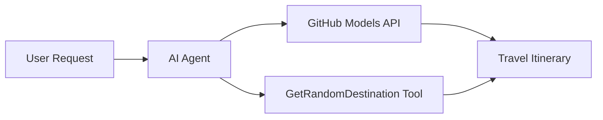

# 🌍 Agente de Viagens com Microsoft Agent Framework (.NET)

## 📋 Visão Geral do Cenário

Este notebook demonstra como criar um agente inteligente de planeamento de viagens utilizando o Microsoft Agent Framework para .NET. O agente pode gerar automaticamente itinerários personalizados para viagens de um dia em destinos aleatórios ao redor do mundo.

**Principais Capacidades:**
- 🎲 **Seleção Aleatória de Destinos**: Utiliza uma ferramenta personalizada para escolher locais de férias
- 🗺️ **Planeamento Inteligente de Viagens**: Cria itinerários detalhados dia a dia
- 🔄 **Streaming em Tempo Real**: Suporta respostas imediatas e em fluxo contínuo
- 🛠️ **Integração de Ferramentas Personalizadas**: Demonstra como expandir as capacidades do agente

## 🔧 Arquitetura Técnica

### Tecnologias Principais
- **Microsoft Agent Framework**: Implementação mais recente em .NET para desenvolvimento de agentes de IA
- **Integração com Modelos do GitHub**: Utiliza o serviço de inferência de modelos de IA do GitHub
- **Compatibilidade com API OpenAI**: Aproveita as bibliotecas cliente da OpenAI com endpoints personalizados
- **Configuração Segura**: Gestão de chaves API baseada em variáveis de ambiente

### Componentes Principais
1. **AIAgent**: O orquestrador principal do agente que gere o fluxo de conversação
2. **Ferramentas Personalizadas**: Função `GetRandomDestination()` disponível para o agente
3. **Cliente de Chat**: Interface de conversação suportada por modelos do GitHub
4. **Suporte a Streaming**: Capacidades de geração de respostas em tempo real

### Padrão de Integração


## 🚀 Primeiros Passos

**Pré-requisitos:**
- .NET 9.0 ou superior
- Token de acesso à API de Modelos do GitHub
- Variáveis de ambiente configuradas no ficheiro `.env`

**Variáveis de Ambiente Necessárias:**
```env
GITHUB_TOKEN=your_github_token
GITHUB_ENDPOINT=https://models.inference.ai.azure.com
GITHUB_MODEL_ID=gpt-4o-mini
```

Execute as células abaixo em sequência para ver o agente de viagens em ação!

---

## .NET Single File App: AI Travel Agent Example

See `01-dotnet-agent-framework.cs` for the complete runnable code sample.

Execute o exemplo de código abaixo:

```bash
dotnet run 01-dotnet-agent-framework.cs
```

### Sample Code

```csharp
static string GetRandomDestination()
{
    var destinations = new List<string>
    {
        "Paris, France",
        "Tokyo, Japan",
        "New York City, USA",
        "Sydney, Australia",
        "Rome, Italy",
        "Barcelona, Spain",
        "Cape Town, South Africa",
        "Rio de Janeiro, Brazil",
        "Bangkok, Thailand",
        "Vancouver, Canada"
    };
    var random = new Random();
    int index = random.Next(destinations.Count);
    return destinations[index];
}

// Extract configuration from environment variables
var github_endpoint = Environment.GetEnvironmentVariable("GITHUB_ENDPOINT") ?? throw new InvalidOperationException("GITHUB_ENDPOINT is not set.");
var github_model_id = Environment.GetEnvironmentVariable("GITHUB_MODEL_ID") ?? "gpt-4o-mini";
var github_token = Environment.GetEnvironmentVariable("GITHUB_TOKEN") ?? throw new InvalidOperationException("GITHUB_TOKEN is not set.");

// Configure OpenAI Client Options
var openAIOptions = new OpenAIClientOptions()
{
    Endpoint = new Uri(github_endpoint)
};

// Initialize OpenAI Client with GitHub Models Configuration
var openAIClient = new OpenAIClient(new ApiKeyCredential(github_token), openAIOptions);

// Create AI Agent with Travel Planning Capabilities
AIAgent agent = openAIClient
    .GetChatClient(github_model_id)
    .CreateAIAgent(
        instructions: "You are a helpful AI Agent that can help plan vacations for customers at random destinations",
        tools: [AIFunctionFactory.Create(GetRandomDestination)]
    );

// Execute Agent: Plan a Day Trip (Non-Streaming)
Console.WriteLine(await agent.RunAsync("Plan me a day trip"));

// Execute Agent: Plan a Day Trip (Streaming Response)
await foreach (var update in agent.RunStreamingAsync("Plan me a day trip"))
{
    Console.Write(update);
}
```
