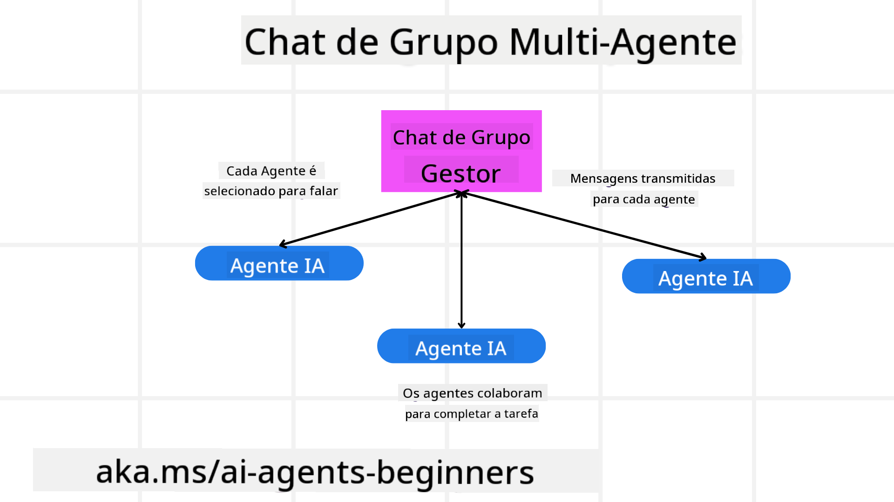
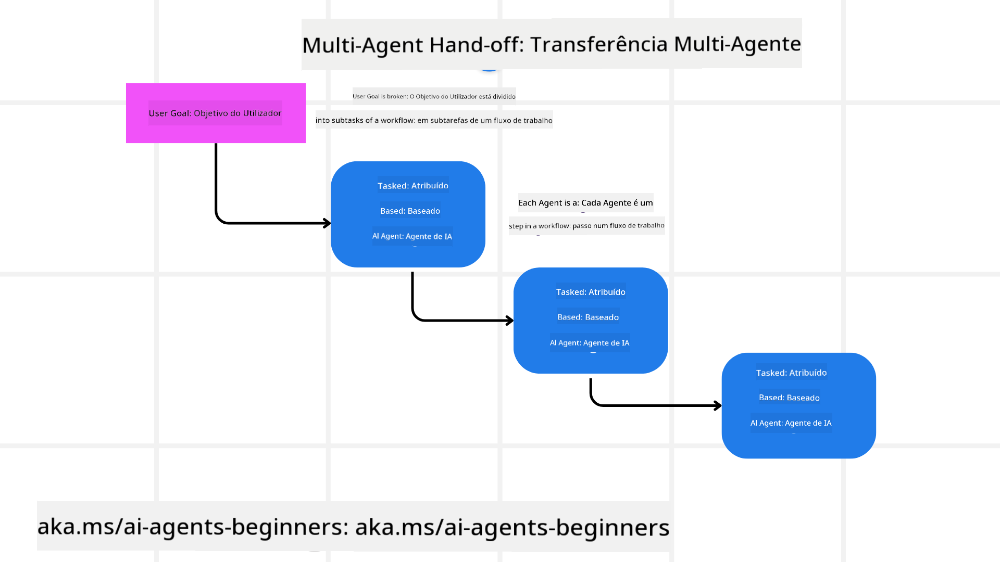
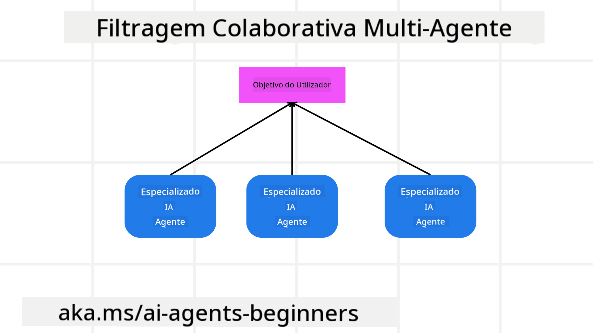

<!--
CO_OP_TRANSLATOR_METADATA:
{
  "original_hash": "1a008c204051cba8d0e253b75f261c41",
  "translation_date": "2025-08-30T08:27:43+00:00",
  "source_file": "08-multi-agent/README.md",
  "language_code": "pt"
}
-->

> _(Clique na imagem acima para assistir ao vídeo desta lição)_

# Padrões de design de multi-agentes

Assim que começar a trabalhar num projeto que envolva múltiplos agentes, será necessário considerar o padrão de design de multi-agentes. No entanto, pode não ser imediatamente claro quando mudar para multi-agentes e quais são as vantagens.

## Introdução

Nesta lição, procuramos responder às seguintes perguntas:

- Quais são os cenários em que os multi-agentes são aplicáveis?
- Quais são as vantagens de usar multi-agentes em vez de um único agente a realizar várias tarefas?
- Quais são os blocos de construção para implementar o padrão de design de multi-agentes?
- Como podemos ter visibilidade sobre como os múltiplos agentes estão a interagir entre si?

## Objetivos de Aprendizagem

Após esta lição, deverá ser capaz de:

- Identificar cenários em que os multi-agentes são aplicáveis.
- Reconhecer as vantagens de usar multi-agentes em vez de um único agente.
- Compreender os blocos de construção para implementar o padrão de design de multi-agentes.

Qual é o panorama geral?

*Multi-agentes são um padrão de design que permite que múltiplos agentes trabalhem em conjunto para alcançar um objetivo comum*.

Este padrão é amplamente utilizado em várias áreas, incluindo robótica, sistemas autónomos e computação distribuída.

## Cenários em que os Multi-Agentes São Aplicáveis

Então, quais cenários são bons casos de uso para multi-agentes? A resposta é que existem muitos cenários em que empregar múltiplos agentes é benéfico, especialmente nos seguintes casos:

- **Grandes volumes de trabalho**: Grandes volumes de trabalho podem ser divididos em tarefas menores e atribuídos a diferentes agentes, permitindo processamento paralelo e conclusão mais rápida. Um exemplo disso é no caso de uma tarefa de processamento de dados em larga escala.
- **Tarefas complexas**: Tarefas complexas, assim como grandes volumes de trabalho, podem ser divididas em subtarefas menores e atribuídas a diferentes agentes, cada um especializado num aspeto específico da tarefa. Um bom exemplo disso é no caso de veículos autónomos, onde diferentes agentes gerem navegação, deteção de obstáculos e comunicação com outros veículos.
- **Diversidade de competências**: Diferentes agentes podem ter competências diversas, permitindo-lhes lidar com diferentes aspetos de uma tarefa de forma mais eficaz do que um único agente. Para este caso, um bom exemplo é na área da saúde, onde agentes podem gerir diagnósticos, planos de tratamento e monitorização de pacientes.

## Vantagens de Usar Multi-Agentes em Relação a um Único Agente

Um sistema com um único agente pode funcionar bem para tarefas simples, mas para tarefas mais complexas, usar múltiplos agentes pode oferecer várias vantagens:

- **Especialização**: Cada agente pode ser especializado numa tarefa específica. A falta de especialização num único agente significa que terá um agente que pode fazer tudo, mas que pode ficar confuso sobre o que fazer quando confrontado com uma tarefa complexa. Por exemplo, pode acabar por realizar uma tarefa para a qual não está melhor preparado.
- **Escalabilidade**: É mais fácil escalar sistemas adicionando mais agentes do que sobrecarregando um único agente.
- **Tolerância a falhas**: Se um agente falhar, outros podem continuar a funcionar, garantindo a fiabilidade do sistema.

Vamos a um exemplo: reservar uma viagem para um utilizador. Um sistema com um único agente teria de lidar com todos os aspetos do processo de reserva, desde encontrar voos até reservar hotéis e carros de aluguer. Para alcançar isso com um único agente, este teria de ter ferramentas para lidar com todas essas tarefas. Isso poderia levar a um sistema complexo e monolítico, difícil de manter e escalar. Um sistema de multi-agentes, por outro lado, poderia ter diferentes agentes especializados em encontrar voos, reservar hotéis e carros de aluguer. Isso tornaria o sistema mais modular, mais fácil de manter e escalável.

Compare isso com uma agência de viagens gerida como um pequeno negócio familiar versus uma agência de viagens gerida como uma franquia. O pequeno negócio familiar teria um único agente a lidar com todos os aspetos do processo de reserva, enquanto a franquia teria diferentes agentes a lidar com diferentes aspetos do processo.

## Blocos de Construção para Implementar o Padrão de Design de Multi-Agentes

Antes de implementar o padrão de design de multi-agentes, é necessário compreender os blocos de construção que compõem o padrão.

Vamos tornar isso mais concreto, olhando novamente para o exemplo de reservar uma viagem para um utilizador. Neste caso, os blocos de construção incluiriam:

- **Comunicação entre agentes**: Agentes para encontrar voos, reservar hotéis e carros de aluguer precisam de comunicar e partilhar informações sobre as preferências e restrições do utilizador. É necessário decidir os protocolos e métodos para essa comunicação. Concretamente, isso significa que o agente para encontrar voos precisa de comunicar com o agente para reservar hotéis para garantir que o hotel é reservado para as mesmas datas do voo. Isso significa que os agentes precisam de partilhar informações sobre as datas de viagem do utilizador, ou seja, é necessário decidir *quais agentes estão a partilhar informações e como estão a partilhá-las*.
- **Mecanismos de coordenação**: Os agentes precisam de coordenar as suas ações para garantir que as preferências e restrições do utilizador são atendidas. Uma preferência do utilizador poderia ser que ele queira um hotel próximo do aeroporto, enquanto uma restrição poderia ser que os carros de aluguer estão disponíveis apenas no aeroporto. Isso significa que o agente para reservar hotéis precisa de coordenar com o agente para reservar carros de aluguer para garantir que as preferências e restrições do utilizador são atendidas. Isso significa que é necessário decidir *como os agentes estão a coordenar as suas ações*.
- **Arquitetura do agente**: Os agentes precisam de ter uma estrutura interna para tomar decisões e aprender com as suas interações com o utilizador. Isso significa que o agente para encontrar voos precisa de ter uma estrutura interna para tomar decisões sobre quais voos recomendar ao utilizador. Isso significa que é necessário decidir *como os agentes estão a tomar decisões e a aprender com as suas interações com o utilizador*. Exemplos de como um agente aprende e melhora poderiam ser que o agente para encontrar voos poderia usar um modelo de aprendizagem automática para recomendar voos ao utilizador com base nas suas preferências anteriores.
- **Visibilidade nas interações entre agentes**: É necessário ter visibilidade sobre como os múltiplos agentes estão a interagir entre si. Isso significa que é necessário ter ferramentas e técnicas para rastrear as atividades e interações dos agentes. Isso poderia ser na forma de ferramentas de registo e monitorização, ferramentas de visualização e métricas de desempenho.
- **Padrões de Multi-Agentes**: Existem diferentes padrões para implementar sistemas de multi-agentes, como arquiteturas centralizadas, descentralizadas e híbridas. É necessário decidir o padrão que melhor se adapta ao seu caso de uso.
- **Humano no circuito**: Na maioria dos casos, haverá um humano no circuito e é necessário instruir os agentes sobre quando pedir intervenção humana. Isso poderia ser na forma de um utilizador a pedir um hotel ou voo específico que os agentes não recomendaram ou a pedir confirmação antes de reservar um voo ou hotel.

## Visibilidade nas Interações entre Multi-Agentes

É importante ter visibilidade sobre como os múltiplos agentes estão a interagir entre si. Essa visibilidade é essencial para depuração, otimização e garantia da eficácia geral do sistema. Para alcançar isso, é necessário ter ferramentas e técnicas para rastrear as atividades e interações dos agentes. Isso poderia ser na forma de ferramentas de registo e monitorização, ferramentas de visualização e métricas de desempenho.

Por exemplo, no caso de reservar uma viagem para um utilizador, poderia haver um painel que mostra o estado de cada agente, as preferências e restrições do utilizador e as interações entre os agentes. Este painel poderia mostrar as datas de viagem do utilizador, os voos recomendados pelo agente de voos, os hotéis recomendados pelo agente de hotéis e os carros de aluguer recomendados pelo agente de carros de aluguer. Isso daria uma visão clara de como os agentes estão a interagir entre si e se as preferências e restrições do utilizador estão a ser atendidas.

Vamos analisar cada um destes aspetos com mais detalhe.

- **Ferramentas de Registo e Monitorização**: É importante registar cada ação realizada por um agente. Uma entrada de registo poderia armazenar informações sobre o agente que realizou a ação, a ação realizada, o momento em que a ação foi realizada e o resultado da ação. Estas informações podem ser usadas para depuração, otimização e mais.
- **Ferramentas de Visualização**: Ferramentas de visualização podem ajudar a ver as interações entre agentes de uma forma mais intuitiva. Por exemplo, poderia haver um gráfico que mostra o fluxo de informações entre agentes. Isso poderia ajudar a identificar gargalos, ineficiências e outros problemas no sistema.
- **Métricas de Desempenho**: Métricas de desempenho podem ajudar a acompanhar a eficácia do sistema de multi-agentes. Por exemplo, poderia acompanhar o tempo necessário para concluir uma tarefa, o número de tarefas concluídas por unidade de tempo e a precisão das recomendações feitas pelos agentes. Estas informações podem ajudar a identificar áreas para melhoria e otimizar o sistema.

## Padrões de Multi-Agentes

Vamos explorar alguns padrões concretos que podemos usar para criar aplicações de multi-agentes. Aqui estão alguns padrões interessantes a considerar:

### Chat em grupo

Este padrão é útil quando se pretende criar uma aplicação de chat em grupo onde múltiplos agentes podem comunicar entre si. Casos de uso típicos para este padrão incluem colaboração em equipa, suporte ao cliente e redes sociais.

Neste padrão, cada agente representa um utilizador no chat em grupo, e as mensagens são trocadas entre agentes usando um protocolo de mensagens. Os agentes podem enviar mensagens para o chat em grupo, receber mensagens do chat em grupo e responder a mensagens de outros agentes.

Este padrão pode ser implementado usando uma arquitetura centralizada, onde todas as mensagens são encaminhadas através de um servidor central, ou uma arquitetura descentralizada, onde as mensagens são trocadas diretamente.

### Transferência de tarefas

Este padrão é útil quando se pretende criar uma aplicação onde múltiplos agentes podem transferir tarefas entre si.

Casos de uso típicos para este padrão incluem suporte ao cliente, gestão de tarefas e automação de fluxos de trabalho.

Neste padrão, cada agente representa uma tarefa ou um passo num fluxo de trabalho, e os agentes podem transferir tarefas para outros agentes com base em regras predefinidas.

### Filtragem colaborativa

Este padrão é útil quando se pretende criar uma aplicação onde múltiplos agentes podem colaborar para fazer recomendações aos utilizadores.

A razão para querer múltiplos agentes a colaborar é que cada agente pode ter competências diferentes e contribuir para o processo de recomendação de formas distintas.

Vamos a um exemplo onde um utilizador quer uma recomendação sobre a melhor ação para comprar no mercado de ações.

- **Especialista na indústria**: Um agente poderia ser especialista numa indústria específica.
- **Análise técnica**: Outro agente poderia ser especialista em análise técnica.
- **Análise fundamental**: E outro agente poderia ser especialista em análise fundamental. Ao colaborar, estes agentes podem fornecer uma recomendação mais abrangente ao utilizador.

## Cenário: Processo de Reembolso

Considere um cenário onde um cliente está a tentar obter um reembolso por um produto. Podem estar envolvidos vários agentes neste processo, mas vamos dividi-los entre agentes específicos para este processo e agentes gerais que podem ser usados noutros processos.

**Agentes específicos para o processo de reembolso**:

Os seguintes são alguns agentes que poderiam estar envolvidos no processo de reembolso:

- **Agente do cliente**: Este agente representa o cliente e é responsável por iniciar o processo de reembolso.
- **Agente do vendedor**: Este agente representa o vendedor e é responsável por processar o reembolso.
- **Agente de pagamento**: Este agente representa o processo de pagamento e é responsável por reembolsar o pagamento do cliente.
- **Agente de resolução**: Este agente representa o processo de resolução e é responsável por resolver quaisquer problemas que surjam durante o processo de reembolso.
- **Agente de conformidade**: Este agente representa o processo de conformidade e é responsável por garantir que o processo de reembolso cumpre os regulamentos e políticas.

**Agentes gerais**:

Estes agentes podem ser usados noutras partes do seu negócio.

- **Agente de envio**: Este agente representa o processo de envio e é responsável por enviar o produto de volta ao vendedor. Este agente pode ser usado tanto para o processo de reembolso como para o envio geral de um produto, por exemplo, numa compra.
- **Agente de feedback**: Este agente representa o processo de feedback e é responsável por recolher feedback do cliente. O feedback pode ser recolhido a qualquer momento e não apenas durante o processo de reembolso.
- **Agente de escalonamento**: Este agente representa o processo de escalonamento e é responsável por escalar problemas para um nível superior de suporte. Pode usar este tipo de agente para qualquer processo onde seja necessário escalar um problema.
- **Agente de notificações**: Este agente representa o processo de notificações e é responsável por enviar notificações ao cliente em várias etapas do processo de reembolso.
- **Agente de análise**: Este agente representa o processo de análise e é responsável por analisar dados relacionados com o processo de reembolso.
- **Agente de auditoria**: Este agente representa o processo de auditoria e é responsável por auditar o processo de reembolso para garantir que está a ser realizado corretamente.
- **Agente de relatórios**: Este agente representa o processo de relatórios e é responsável por gerar relatórios sobre o processo de reembolso.
- **Agente de conhecimento**: Este agente representa o processo de conhecimento e é responsável por manter uma base de conhecimento com informações relacionadas com o processo de reembolso. Este agente pode ser conhecedor tanto de reembolsos como de outras partes do seu negócio.
- **Agente de segurança**: Este agente representa o processo de segurança e é responsável por garantir a segurança do processo de reembolso.
- **Agente de qualidade**: Este agente representa o processo de qualidade e é responsável por garantir a qualidade do processo de reembolso.

Há bastantes agentes listados anteriormente, tanto para o processo específico de reembolso como para os agentes gerais que podem ser usados noutras partes do seu negócio. Esperemos que isso lhe dê uma ideia de como pode decidir quais agentes usar no seu sistema de multi-agentes.

## Tarefa
Desenhar um sistema multi-agente para um processo de suporte ao cliente. Identificar os agentes envolvidos no processo, os seus papéis e responsabilidades, e como interagem uns com os outros. Considere tanto agentes específicos para o processo de suporte ao cliente como agentes gerais que podem ser usados noutras partes do seu negócio.

> Pense bem antes de ler a solução abaixo, pode precisar de mais agentes do que imagina.

> DICA: Pense nas diferentes etapas do processo de suporte ao cliente e também nos agentes necessários para qualquer sistema.

## Solução

[Solução](./solution/solution.md)

## Verificação de conhecimento

Pergunta: Quando deve considerar usar multi-agentes?

- [ ] A1: Quando tem uma carga de trabalho pequena e uma tarefa simples.
- [ ] A2: Quando tem uma grande carga de trabalho.
- [ ] A3: Quando tem uma tarefa simples.

[Quiz de solução](./solution/solution-quiz.md)

## Resumo

Nesta lição, analisámos o padrão de design multi-agente, incluindo os cenários onde os multi-agentes são aplicáveis, as vantagens de usar multi-agentes em vez de um agente singular, os blocos de construção para implementar o padrão de design multi-agente, e como ter visibilidade sobre como os múltiplos agentes interagem entre si.

### Tem mais perguntas sobre o padrão de design multi-agente?

Junte-se ao [Discord do Azure AI Foundry](https://aka.ms/ai-agents/discord) para conhecer outros aprendizes, participar em horas de atendimento e obter respostas às suas perguntas sobre Agentes de IA.

## Recursos adicionais

- 

## Lição anterior

[Design de Planeamento](../07-planning-design/README.md)

## Próxima lição

[Metacognição em Agentes de IA](../09-metacognition/README.md)

---

**Aviso Legal**:  
Este documento foi traduzido utilizando o serviço de tradução por IA [Co-op Translator](https://github.com/Azure/co-op-translator). Embora nos esforcemos para garantir a precisão, esteja ciente de que traduções automáticas podem conter erros ou imprecisões. O documento original na sua língua nativa deve ser considerado a fonte oficial. Para informações críticas, recomenda-se uma tradução profissional realizada por humanos. Não nos responsabilizamos por quaisquer mal-entendidos ou interpretações incorretas resultantes do uso desta tradução.