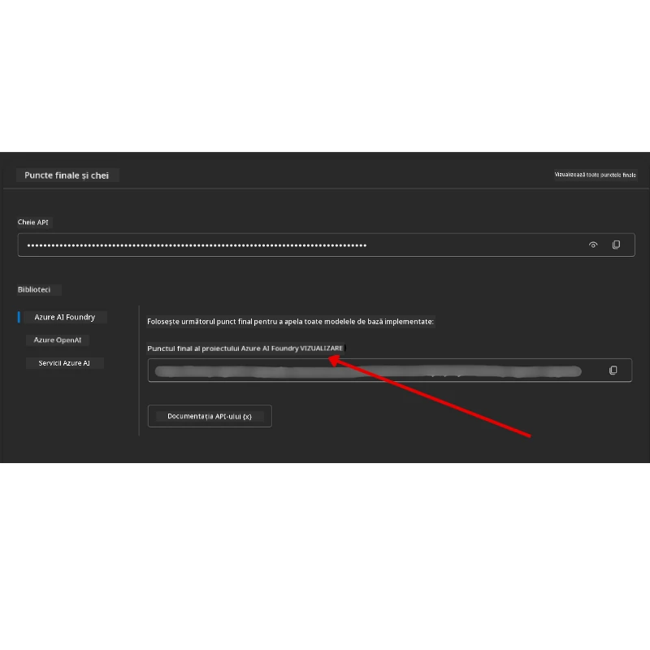

# Configurarea cursului

## Introducere

Această lecție va acoperi cum să rulezi exemplele de cod ale acestui curs.

## Alătură-te altor cursanți și primește ajutor

Înainte de a începe să clonezi depozitul tău, alătură-te canalului [AI Agents For Beginners Discord](https://aka.ms/ai-agents/discord) pentru a primi ajutor cu configurarea, întrebări despre curs sau pentru a te conecta cu alți cursanți.

## Clonează sau fork-uiește acest depozit

Pentru a începe, te rugăm să clonezi sau să fork-uiești depozitul GitHub. Acest lucru îți va crea propria versiune a materialului cursului astfel încât să poți rula, testa și modifica codul!

Aceasta poate fi făcută făcând clic pe linkul către <a href="https://github.com/microsoft/ai-agents-for-beginners/fork" target="_blank">fork-uiește depozitul</a>

Acum ar trebui să ai propria ta versiune fork-uită a acestui curs la următorul link:


### Shallow Clone (recomandat pentru workshop / Codespaces)

  >Depozitul complet poate fi mare (~3 GB) când descarci istoricul complet și toate fișierele. Dacă participi doar la workshop sau ai nevoie doar de câteva foldere de lecții, o clonare superficială (sau clonare parțială) evită majoritatea acestei descărcări prin trunchierea istoricului și/sau omiterea bloburilor.

#### Clonare superficială rapidă — istoric minim, toate fișierele

Înlocuiește `<your-username>` în comenzile de mai jos cu URL-ul fork-ului tău (sau URL-ul upstream dacă preferi).

Pentru a clona doar istoricult ultimei comiteri (descărcare mică):

```bash|powershell
git clone --depth 1 https://github.com/<your-username>/ai-agents-for-beginners.git
```

Pentru a clona un branch specific:

```bash|powershell
git clone --depth 1 --branch <branch-name> https://github.com/<your-username>/ai-agents-for-beginners.git
```

#### Clonare parțială (sparse) — bloburi minime + doar foldere selectate

Aceasta folosește clonarea parțială și sparse-checkout (necesită Git 2.25+ și recomandat Git modern cu suport pentru clonare parțială):

```bash|powershell
git clone --depth 1 --filter=blob:none --sparse https://github.com/<your-username>/ai-agents-for-beginners.git
```

Accesează folderul repo:

```bash|powershell
cd ai-agents-for-beginners
```

Apoi specifică ce foldere dorești (exemplul de mai jos arată două foldere):

```bash|powershell
git sparse-checkout set 00-course-setup 01-intro-to-ai-agents
```

După clonare și verificarea fișierelor, dacă ai nevoie doar de fișiere și vrei să eliberezi spațiu (fără istoricul git), te rugăm să ștergi metadatele depozitului (💀 ireversibil — vei pierde toată funcționalitatea Git: fără commit-uri, pull-uri, push-uri sau acces la istoric).

```bash
# zsh/bash
rm -rf .git
```

```powershell
# PowerShell
Remove-Item -Recurse -Force .git
```

#### Folosind GitHub Codespaces (recomandat pentru a evita descărcări mari locale)

- Creează un Codespace nou pentru acest repo prin [interfața GitHub UI](https://github.com/codespaces).

- În terminalul Codespace-ului nou creat, rulează una dintre comenzile shallow/sparse clone de mai sus pentru a aduce doar folderele de lecție de care ai nevoie în spațiul de lucru al Codespace-ului.
- Opțional: după clonare în Codespaces, elimină folderul .git pentru a recupera spațiu suplimentar (vezi comenzile de ștergere de mai sus).
- Notă: Dacă preferi să deschizi repo-ul direct în Codespaces (fără clonare suplimentară), reține că Codespaces va construi mediul devcontainer și s-ar putea să pregătească mai multe lucruri decât ai nevoie. Clonarea unei copii shallow într-un Codespace proaspăt îți oferă mai mult control asupra utilizării discului.

#### Sfaturi

- Înlocuiește întotdeauna URL-ul de clonare cu fork-ul tău dacă dorești să editezi/comiți.
- Dacă mai târziu ai nevoie de mai mult istoric sau fișiere, le poți aduce prin fetch sau ajustând sparse-checkout pentru a include foldere suplimentare.

## Rularea codului

Acest curs oferă o serie de Jupyter Notebooks pe care le poți rula pentru a obține experiență practică în construirea de agenți AI.

Exemplele de cod folosesc **Microsoft Agent Framework (MAF)** cu `AzureAIProjectAgentProvider`, care se conectează la **Azure AI Agent Service V2** (API-ul Responses) prin **Microsoft Foundry**.

Toate notebook-urile Python sunt etichetate cu `*-python-agent-framework.ipynb`.

## Cerințe

- Python 3.12+
  - **NOTĂ**: Dacă nu ai instalat Python 3.12, asigură-te că îl instalezi. Creează apoi mediul virtual folosind python3.12 pentru a asigura instalarea versiunilor corecte din fișierul requirements.txt.
  
    >Exemplu

    Crează directorul pentru mediul virtual Python:

    ```bash|powershell
    python -m venv venv
    ```

    Apoi activează mediul venv pentru:

    ```bash
    # zsh/bash
    source venv/bin/activate
    ```
  
    ```dos
    # Command Prompt for Windows
    venv\Scripts\activate
    ```

- .NET 10+: Pentru codurile exemplu folosind .NET, asigură-te că instalezi [.NET 10 SDK](https://dotnet.microsoft.com/download/dotnet/10.0) sau o versiune mai nouă. Apoi verifică versiunea SDK instalată:

    ```bash|powershell
    dotnet --list-sdks
    ```

- **Azure CLI** — necesar pentru autentificare. Instalează-l de la [aka.ms/installazurecli](https://aka.ms/installazurecli).
- **Abonament Azure** — pentru acces la Microsoft Foundry și Azure AI Agent Service.
- **Proiect Microsoft Foundry** — un proiect cu un model implementat (de exemplu, `gpt-4o`). Vezi [Pasul 1](../../../00-course-setup) mai jos.

Am inclus un fișier `requirements.txt` în rădăcina acestui depozit care conține toate pachetele Python necesare pentru rularea exemplelor de cod.

Le poți instala rulând următoarea comandă în terminal, în rădăcina depozitului:

```bash|powershell
pip install -r requirements.txt
```

Recomandăm crearea unui mediu virtual Python pentru a evita conflicte și probleme.

## Configurarea VSCode

Asigură-te că folosești versiunea corectă de Python în VSCode.


## Configurarea Microsoft Foundry și Azure AI Agent Service

### Pasul 1: Creează un proiect Microsoft Foundry

Ai nevoie de un **hub** Microsoft Foundry Azure AI și de un **proiect** cu un model implementat ca să rulezi notebook-urile.

1. Mergi la [ai.azure.com](https://ai.azure.com) și autentifică-te cu contul tău Azure.
2. Creează un **hub** (sau folosește unul existent). Vezi: [Prezentare resurse Hub](https://learn.microsoft.com/azure/ai-foundry/concepts/ai-resources).
3. În interiorul hub-ului, creează un **proiect**.
4. Implementează un model (de ex., `gpt-4o`) din **Models + Endpoints** → **Deploy model**.

### Pasul 2: Obține endpoint-ul proiectului și numele implementării modelului

Din proiectul tău în portalul Microsoft Foundry:

- **Project Endpoint** — Mergi la pagina **Overview** și copiază URL-ul endpoint-ului.



- **Model Deployment Name** — Mergi la **Models + Endpoints**, selectează modelul tău implementat, și notează **Deployment name** (de exemplu, `gpt-4o`).

### Pasul 3: Autentifică-te în Azure cu `az login`

Toate notebook-urile folosesc **`AzureCliCredential`** pentru autentificare — nu trebuie să gestionezi chei API. Acest lucru necesită să fii autentificat prin Azure CLI.

1. **Instalează Azure CLI** dacă nu l-ai instalat deja: [aka.ms/installazurecli](https://aka.ms/installazurecli)

2. **Autentifică-te** rulând:

    ```bash|powershell
    az login
    ```

    Sau dacă ești într-un mediu remote/Codespace fără browser:

    ```bash|powershell
    az login --use-device-code
    ```

3. **Selectează abonamentul** dacă ți se cere — alege-l pe cel care conține proiectul Foundry.

4. **Verifică** că ești autentificat:

    ```bash|powershell
    az account show
    ```

> **De ce `az login`?** Notebook-urile se autentifică folosind `AzureCliCredential` din pachetul `azure-identity`. Asta înseamnă că sesiunea ta Azure CLI oferă credențialele — nu sunt chei API sau secrete în fișierul tău `.env`. Aceasta este o [bună practică de securitate](https://learn.microsoft.com/azure/developer/ai/keyless-connections).

### Pasul 4: Crează fișierul tău `.env`

Copiază fișierul exemplu:

```bash
# zsh/bash
cp .env.example .env
```

```powershell
# PowerShell
Copy-Item .env.example .env
```

Deschide `.env` și completează aceste două valori:

```env
AZURE_AI_PROJECT_ENDPOINT=https://<your-project>.services.ai.azure.com/api/projects/<your-project-id>
AZURE_AI_MODEL_DEPLOYMENT_NAME=gpt-4o
```

| Variabilă | Unde să o găsești |
|----------|-----------------|
| `AZURE_AI_PROJECT_ENDPOINT` | Portal Foundry → proiectul tău → pagina **Overview** |
| `AZURE_AI_MODEL_DEPLOYMENT_NAME` | Portal Foundry → **Models + Endpoints** → numele modelului tău implementat |

Asta e tot pentru majoritatea lecțiilor! Notebook-urile se vor autentifica automat prin sesiunea ta `az login`.

### Pasul 5: Instalează dependențele Python

```bash|powershell
pip install -r requirements.txt
```

Recomandăm să rulezi aceasta în mediul virtual pe care l-ai creat anterior.

## Configurare suplimentară pentru lecția 5 (Agentic RAG)

Lecția 5 folosește **Azure AI Search** pentru generare augmentată cu recuperare. Dacă intenționezi să rulezi acea lecție, adaugă aceste variabile în fișierul tău `.env`:

| Variabilă | Unde să o găsești |
|----------|-----------------|
| `AZURE_SEARCH_SERVICE_ENDPOINT` | Portal Azure → resursa ta **Azure AI Search** → **Overview** → URL |
| `AZURE_SEARCH_API_KEY` | Portal Azure → resursa ta **Azure AI Search** → **Settings** → **Keys** → cheia principală de administrator |

## Configurare suplimentară pentru lecțiile 6 și 8 (GitHub Models)

Unele notebook-uri din lecțiile 6 și 8 folosesc **GitHub Models** în loc de Azure AI Foundry. Dacă intenționezi să rulezi acele exemple, adaugă aceste variabile în fișierul tău `.env`:

| Variabilă | Unde să o găsești |
|----------|-----------------|
| `GITHUB_TOKEN` | GitHub → **Settings** → **Developer settings** → **Personal access tokens** |
| `GITHUB_ENDPOINT` | Folosește `https://models.inference.ai.azure.com` (valoare implicită) |
| `GITHUB_MODEL_ID` | Numele modelului de folosit (de ex. `gpt-4o-mini`) |

## Configurare suplimentară pentru lecția 8 (Flux de lucru Bing Grounding)

Notebook-ul de workflow condițional din lecția 8 folosește **Bing grounding** prin Azure AI Foundry. Dacă vrei să rulezi acel exemplu, adaugă această variabilă în fișierul tău `.env`:

| Variabilă | Unde să o găsești |
|----------|-----------------|
| `BING_CONNECTION_ID` | Portal Azure AI Foundry → proiectul tău → **Management** → **Connected resources** → conexiunea ta Bing → copiază ID-ul conexiunii |

## Depanare

### Erori de verificare certificat SSL pe macOS

Dacă ești pe macOS și întâmpini o eroare de genul:

```plaintext
ssl.SSLCertVerificationError: [SSL: CERTIFICATE_VERIFY_FAILED] certificate verify failed: self-signed certificate in certificate chain
```

Aceasta este o problemă cunoscută cu Python pe macOS, unde certificatele SSL ale sistemului nu sunt automat încredințate. Încearcă următoarele soluții în ordine:

**Opțiunea 1: Rulează scriptul Install Certificates al Python (recomandat)**

```bash
# Înlocuiește 3.XX cu versiunea Python instalată (de exemplu, 3.12 sau 3.13):
/Applications/Python\ 3.XX/Install\ Certificates.command
```

**Opțiunea 2: Folosește `connection_verify=False` în notebook-ul tău (doar pentru notebook-urile GitHub Models)**

În notebook-ul lecției 6 (`06-building-trustworthy-agents/code_samples/06-system-message-framework.ipynb`) este deja inclus un workaround comentat. Deblochează `connection_verify=False` când creezi clientul:

```python
client = ChatCompletionsClient(
    endpoint=endpoint,
    credential=AzureKeyCredential(token),
    connection_verify=False,  # Dezactivează verificarea SSL dacă întâmpini erori de certificat
)
```

> **⚠️ Atenție:** Dezactivarea verificării SSL (`connection_verify=False`) reduce securitatea prin sărirea validării certificatului. Folosește-l doar ca soluție temporară în medii de dezvoltare, niciodată în producție.

**Opțiunea 3: Instalează și folosește `truststore`**

```bash
pip install truststore
```

Apoi adaugă următorul cod în partea de sus a notebook-ului sau scriptului înainte de a face orice apeluri de rețea:

```python
import truststore
truststore.inject_into_ssl()
```

## Ai blocaje undeva?

Dacă ai orice probleme cu rularea acestei configurații, intră în <a href="https://discord.gg/kzRShWzttr" target="_blank">Azure AI Community Discord</a> sau <a href="https://github.com/microsoft/ai-agents-for-beginners/issues?WT.mc_id=academic-105485-koreyst" target="_blank">creează un issue</a>.

## Lecția următoare

Acum ești gata să rulezi codul pentru acest curs. Spor la învățat mai multe despre lumea Agenților AI!

[Introducere în Agenții AI și cazuri de utilizare Agent](../01-intro-to-ai-agents/README.md)

---

<!-- CO-OP TRANSLATOR DISCLAIMER START -->
**Declinare de responsabilitate**:  
Acest document a fost tradus folosind serviciul de traducere AI [Co-op Translator](https://github.com/Azure/co-op-translator). Deși ne străduim să oferim o traducere corectă, vă rugăm să rețineți că traducerile automate pot conține erori sau inexactități. Documentul original în limba sa nativă trebuie considerat sursa autoritară. Pentru informații critice, se recomandă traducerea profesională realizată de un specialist uman. Nu ne asumăm responsabilitatea pentru eventualele neînțelegeri sau interpretări greșite rezultate din utilizarea acestei traduceri.
<!-- CO-OP TRANSLATOR DISCLAIMER END -->