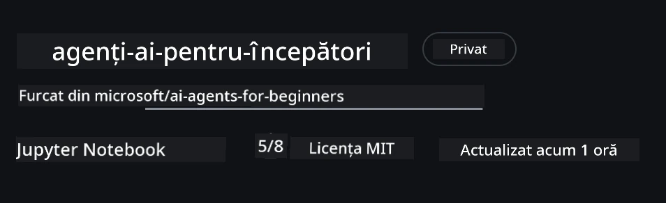
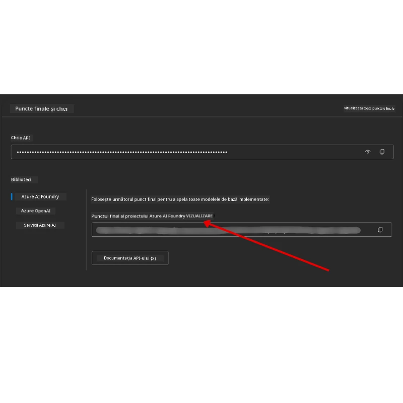

# Configurarea Cursului

## Introducere

Această lecție va acoperi modul de rulare a exemplelor de cod din acest curs.

## Alăturați-vă Altora și Solicitați Ajutor

Înainte de a începe să clonați depozitul vostru, alăturați-vă canalului [AI Agents For Beginners Discord](https://aka.ms/ai-agents/discord) pentru a primi ajutor cu configurarea, orice întrebări despre curs sau pentru a vă conecta cu alți cursanți.

## Clonați sau Faceți Fork la acest Repo

Pentru a începe, vă rugăm să clonați sau să faceți fork la Repository-ul GitHub. Aceasta vă va crea propria versiune a materialului cursului astfel încât să puteți rula, testa și ajusta codul!

Aceasta se poate face făcând click pe linkul pentru <a href="https://github.com/microsoft/ai-agents-for-beginners/fork" target="_blank">a face fork repo-ului</a>

Acum ar trebui să aveți propria versiune fork-uită a acestui curs la următorul link:



### Shallow Clone (recomandat pentru workshop / Codespaces)

  >Depozitul complet poate fi mare (~3 GB) când descărcați istoricul complet și toate fișierele. Dacă participați doar la workshop sau aveți nevoie doar de câteva foldere de lecții, un shallow clone (sau un sparse clone) evită majoritatea acestei descărcări prin trunchierea istoricului și/sau sărind peste blobs.

#### Shallow clone rapid — istoric minim, toate fișierele

Înlocuiți `<your-username>` în comenzile de mai jos cu URL-ul vostru de fork (sau URL-ul upstream dacă preferați).

Pentru a clona doar istoricul ultimului commit (descărcare mică):

```bash|powershell
git clone --depth 1 https://github.com/<your-username>/ai-agents-for-beginners.git
```

Pentru a clona un branch specific:

```bash|powershell
git clone --depth 1 --branch <branch-name> https://github.com/<your-username>/ai-agents-for-beginners.git
```

#### Clonare parțială (sparse) — blob-uri minime + doar foldere selectate

Aceasta utilizează clonarea parțială și sparse-checkout (necesită Git 2.25+ și recomandat Git modern cu suport pentru clonare parțială):

```bash|powershell
git clone --depth 1 --filter=blob:none --sparse https://github.com/<your-username>/ai-agents-for-beginners.git
```

Intrați în folderul repo:

```bash|powershell
cd ai-agents-for-beginners
```

Apoi specificați care foldere le doriți (exemplul de mai jos arată două foldere):

```bash|powershell
git sparse-checkout set 00-course-setup 01-intro-to-ai-agents
```

După ce ați clonat și verificat fișierele, dacă aveți nevoie doar de fișiere și doriți să eliberați spațiu (fără istoric git), vă rugăm să ștergeți metadatele repository-ului (💀 ireversibil — veți pierde toată funcționalitatea Git: fără commit-uri, pull-uri, push-uri sau acces la istoric).

```bash
# zsh/bash
rm -rf .git
```

```powershell
# PowerShell
Remove-Item -Recurse -Force .git
```

#### Utilizarea GitHub Codespaces (recomandat pentru a evita descărcările mari locale)

- Creați un Codespace nou pentru acest repo prin [GitHub UI](https://github.com/codespaces).

- În terminalul noului codespace, rulați una dintre comenzile shallow/sparse clone de mai sus pentru a aduce doar folderele de lecții de care aveți nevoie în workspace-ul Codespace.
- Opțional: după clonare în Codespaces, eliminați .git pentru a recupera spațiu suplimentar (vedeți comenzile de eliminare de mai sus).
- Notă: Dacă preferați să deschideți repo-ul direct în Codespaces (fără o clonare suplimentară), fiți conștienți că Codespaces va construi mediul devcontainer și poate provisiona totuși mai mult decât aveți nevoie. Clonarea unei copii shallow în interiorul unui Codespace nou vă oferă mai mult control asupra utilizării discului.

#### Sfaturi

- Înlocuiți întotdeauna URL-ul clonei cu fork-ul vostru dacă doriți să editați/faceți commit.
- Dacă ulterior aveți nevoie de mai mult istoric sau fișiere, le puteți aduce (fetch) sau ajusta sparse-checkout pentru a include foldere suplimentare.

## Rularea Codului

Acest curs oferă o serie de Jupyter Notebooks pe care le puteți rula pentru a dobândi experiență practică construind Agenți AI.

Exemplele de cod folosesc **Microsoft Agent Framework (MAF)** împreună cu `AzureAIProjectAgentProvider`, care se conectează la **Azure AI Agent Service V2** (API-ul de Răspunsuri) prin **Microsoft Foundry**.

Toate notebook-urile Python sunt denumite `*-python-agent-framework.ipynb`.

## Cerințe

- Python 3.12+
  - **NOTĂ**: Dacă nu aveți Python3.12 instalat, asigurați-vă că îl instalați. Apoi creați-vă mediul virtual folosind python3.12 pentru a vă asigura că versiunile corecte sunt instalate din fișierul requirements.txt.
  
    >Exemplu

    Creați directorul pentru mediul Python virtual:

    ```bash|powershell
    python -m venv venv
    ```

    Apoi activați mediul virtual pentru:

    ```bash
    # zsh/bash
    source venv/bin/activate
    ```
  
    ```dos
    # Command Prompt for Windows
    venv\Scripts\activate
    ```

- .NET 10+: Pentru codurile sample care folosesc .NET, asigurați-vă că instalați [.NET 10 SDK](https://dotnet.microsoft.com/download/dotnet/10.0) sau o versiune mai recentă. Apoi verificați versiunea SDK instalată:

    ```bash|powershell
    dotnet --list-sdks
    ```

- **Azure CLI** — Necesară pentru autentificare. Instalați de la [aka.ms/installazurecli](https://aka.ms/installazurecli).
- **Abonament Azure** — Pentru acces la Microsoft Foundry și Azure AI Agent Service.
- **Proiect Microsoft Foundry** — Un proiect cu un model implementat (ex. `gpt-4o`). Vedeți [Pasul 1](#pasul-1-creați-un-proiect-microsoft-foundry) mai jos.

Am inclus un fișier `requirements.txt` în rădăcina acestui repo care conține toate pachetele Python necesare pentru rularea exemplelor de cod.

Le puteți instala rulând următoarea comandă în terminal în rădăcina repo-ului:

```bash|powershell
pip install -r requirements.txt
```

Recomandăm crearea unui mediu virtual Python pentru a evita conflictele și problemele.

## Configurarea VSCode

Asigurați-vă că folosiți versiunea corectă de Python în VSCode.


## Configurarea Microsoft Foundry și Azure AI Agent Service

### Pasul 1: Creați un Proiect Microsoft Foundry

Aveți nevoie de un **hub** și un **proiect** Azure AI Foundry cu un model implementat pentru a rula notebook-urile.

1. Accesați [ai.azure.com](https://ai.azure.com) și conectați-vă cu contul vostru Azure.
2. Creați un **hub** (sau folosiți unul existent). Vedeți: [Previzualizare resurse hub](https://learn.microsoft.com/azure/ai-foundry/concepts/ai-resources).
3. În interiorul hub-ului, creați un **proiect**.
4. Implementați un model (ex. `gpt-4o`) din **Models + Endpoints** → **Deploy model**.

### Pasul 2: Obțineți Endpoint-ul Proiectului și Numele Implementării Modelului

Din proiectul vostru în portalul Microsoft Foundry:

- **Project Endpoint** — Accesați pagina **Overview** și copiați URL-ul endpoint-ului.



- **Model Deployment Name** — Accesați **Models + Endpoints**, selectați modelul implementat și notați **Deployment name** (ex. `gpt-4o`).

### Pasul 3: Conectați-vă la Azure cu `az login`

Toate notebook-urile folosesc **`AzureCliCredential`** pentru autentificare — nu trebuie să gestionați chei API. Aceasta necesită să fiți conectați prin Azure CLI.

1. **Instalați Azure CLI** dacă nu aveți deja: [aka.ms/installazurecli](https://aka.ms/installazurecli)

2. **Conectați-vă** rulând:

    ```bash|powershell
    az login
    ```

    Sau dacă sunteți într-un mediu remote/Codespace fără browser:

    ```bash|powershell
    az login --use-device-code
    ```

3. **Selectați abonamentul** dacă vi se solicită — alegeți cel care conține proiectul Foundry.

4. **Verificați** că sunteți conectat:

    ```bash|powershell
    az account show
    ```

> **De ce `az login`?** Notebook-urile autentifică cu `AzureCliCredential` din pachetul `azure-identity`. Aceasta înseamnă că sesiunea voastră Azure CLI oferă credențialele — nu sunt chei API sau secrete în fișierul `.env`. Acesta este un [bun practică de securitate](https://learn.microsoft.com/azure/developer/ai/keyless-connections).

### Pasul 4: Creați Fișierul `.env`

Copiați fișierul exemplu:

```bash
# zsh/bash
cp .env.example .env
```

```powershell
# PowerShell
Copy-Item .env.example .env
```

Deschideți `.env` și completați aceste două valori:

```env
AZURE_AI_PROJECT_ENDPOINT=https://<your-project>.services.ai.azure.com/api/projects/<your-project-id>
AZURE_AI_MODEL_DEPLOYMENT_NAME=gpt-4o
```

| Variabilă | Unde o găsiți |
|----------|-----------------|
| `AZURE_AI_PROJECT_ENDPOINT` | Portalul Foundry → proiectul vostru → pagina **Overview** |
| `AZURE_AI_MODEL_DEPLOYMENT_NAME` | Portalul Foundry → **Models + Endpoints** → numele modelului implementat |

Asta e tot pentru majoritatea lecțiilor! Notebook-urile se vor autentifica automat prin sesiunea voastră `az login`.

### Pasul 5: Instalați Dependențele Python

```bash|powershell
pip install -r requirements.txt
```

Recomandăm să rulați aceasta în mediul virtual creat anterior.

## Configurare suplimentară pentru Lecția 5 (Agentic RAG)

Lecția 5 folosește **Azure AI Search** pentru generare augmentată prin căutare. Dacă intenționați să rulați această lecție, adăugați aceste variabile în fișierul `.env`:

| Variabilă | Unde o găsiți |
|----------|-----------------|
| `AZURE_SEARCH_SERVICE_ENDPOINT` | Portalul Azure → resursa voastră **Azure AI Search** → **Overview** → URL |
| `AZURE_SEARCH_API_KEY` | Portalul Azure → resursa voastră **Azure AI Search** → **Settings** → **Keys** → cheia principală de admin |

## Configurare suplimentară pentru Lecțiile 6 și 8 (Modele GitHub)

Unele notebook-uri din lecțiile 6 și 8 folosesc **GitHub Models** în loc de Azure AI Foundry. Dacă intenționați să rulați aceste exemple, adăugați aceste variabile în fișierul `.env`:

| Variabilă | Unde o găsiți |
|----------|-----------------|
| `GITHUB_TOKEN` | GitHub → **Settings** → **Developer settings** → **Personal access tokens** |
| `GITHUB_ENDPOINT` | Folosiți `https://models.inference.ai.azure.com` (valoarea implicită) |
| `GITHUB_MODEL_ID` | Numele modelului pe care să-l folosiți (ex. `gpt-4o-mini`) |

## Furnizor alternativ: MiniMax (compatibil OpenAI)

[MiniMax](https://platform.minimaxi.com/) oferă modele cu context mare (până la 204K de tokeni) printr-un API compatibil OpenAI. Deoarece `OpenAIChatClient` din Microsoft Agent Framework funcționează cu orice endpoint compatibil OpenAI, puteți folosi MiniMax ca alternativă directă la GitHub Models sau OpenAI.

Adăugați aceste variabile în fișierul `.env`:

| Variabilă | Unde o găsiți |
|----------|-----------------|
| `MINIMAX_API_KEY` | [MiniMax Platform](https://platform.minimaxi.com/) → API Keys |
| `MINIMAX_BASE_URL` | Folosiți `https://api.minimax.io/v1` (valoarea implicită) |
| `MINIMAX_MODEL_ID` | Numele modelului (ex., `MiniMax-M3`) |

**Modele exemplu**: `MiniMax-M3` (recomandat), `MiniMax-M2.7`, `MiniMax-M2.7-highspeed` (răspunsuri mai rapide). Numele și disponibilitatea modelelor pot varia în timp, iar accesul la un model dat poate depinde de contul sau regiunea voastră — verificați lista curentă pe [MiniMax Platform](https://platform.minimaxi.com/). Dacă `MiniMax-M3` nu este disponibil în contul vostru, setați `MINIMAX_MODEL_ID` la un model la care aveți acces (de ex. `MiniMax-M2.7`).

Exemplele de cod care folosesc `OpenAIChatClient` (ex., fluxul de lucru din lecția 14 pentru rezervări hotel) vor detecta și folosi automat configurația MiniMax când `MINIMAX_API_KEY` este setat.

## Configurare suplimentară pentru Lecția 8 (Flux de lucru Bing Grounding)

Notebook-ul cu flux condiționat din lecția 8 folosește **Bing grounding** prin Azure AI Foundry. Dacă intenționați să rulați acest exemplu, adăugați această variabilă în fișierul `.env`:

| Variabilă | Unde o găsiți |
|----------|-----------------|
| `BING_CONNECTION_ID` | Portalul Azure AI Foundry → proiectul vostru → **Management** → **Connected resources** → conexiunea Bing → copiați ID-ul conexiunii |

## Depanare

### Erori de Verificare Certificat SSL pe macOS

Dacă sunteți pe macOS și întâmpinați o eroare de genul:

```plaintext
ssl.SSLCertVerificationError: [SSL: CERTIFICATE_VERIFY_FAILED] certificate verify failed: self-signed certificate in certificate chain
```

Aceasta este o problemă cunoscută cu Python pe macOS, unde certificatele SSL ale sistemului nu sunt automat recunoscute ca de încredere. Încercați următoarele soluții în ordine:

**Opțiunea 1: Rulați scriptul Install Certificates al Python (recomandat)**

```bash
# Înlocuiți 3.XX cu versiunea dvs. instalată de Python (de ex., 3.12 sau 3.13):
/Applications/Python\ 3.XX/Install\ Certificates.command
```

**Opțiunea 2: Folosiți `connection_verify=False` în notebookul vostru (doar pentru notebook-urile GitHub Models)**

În notebook-ul Lecției 6 (`06-building-trustworthy-agents/code_samples/06-system-message-framework.ipynb`), este deja inclusă o soluție alternativă comentată. Deblocați `connection_verify=False` când creați clientul:

```python
client = ChatCompletionsClient(
    endpoint=endpoint,
    credential=AzureKeyCredential(token),
    connection_verify=False,  # Dezactivează verificarea SSL dacă întâmpini erori de certificat
)
```

> **⚠️ Atenție:** Dezactivarea verificării SSL (`connection_verify=False`) reduce securitatea prin sărirea validării certificatului. Folosiți această opțiune doar temporar în medii de dezvoltare, niciodată în producție.

**Opțiunea 3: Instalați și folosiți `truststore`**

```bash
pip install truststore
```

Apoi adăugați următoarea linie în partea de sus a notebook-ului sau scriptului vostru înainte de a face orice apeluri de rețea:

```python
import truststore
truststore.inject_into_ssl()
```

## Blocare undeva?

Dacă aveți probleme cu această configurare, intrați în <a href="https://discord.gg/kzRShWzttr" target="_blank">Azure AI Community Discord</a> sau <a href="https://github.com/microsoft/ai-agents-for-beginners/issues?WT.mc_id=academic-105485-koreyst" target="_blank">creați un issue</a>.
## Următoarea lecție

Acum ești gata să rulezi codul pentru acest curs. Spor la învățat mai multe despre lumea Agenților AI!

[Introducere în Agenții AI și Cazurile de utilizare ale Agenților](../01-intro-to-ai-agents/README.md)

---

<!-- CO-OP TRANSLATOR DISCLAIMER START -->
**Declinare a responsabilității**:
Acest document a fost tradus folosind serviciul de traducere AI [Co-op Translator](https://github.com/Azure/co-op-translator). În timp ce ne străduim pentru acuratețe, vă rugăm să rețineți că traducerile automate pot conține erori sau inexactități. Documentul original în limba sa nativă trebuie considerat sursa autorizată. Pentru informații critice, se recomandă traducerea profesională realizată de un om. Nu ne asumăm responsabilitatea pentru eventualele neînțelegeri sau interpretări greșite care decurg din utilizarea acestei traduceri.
<!-- CO-OP TRANSLATOR DISCLAIMER END -->