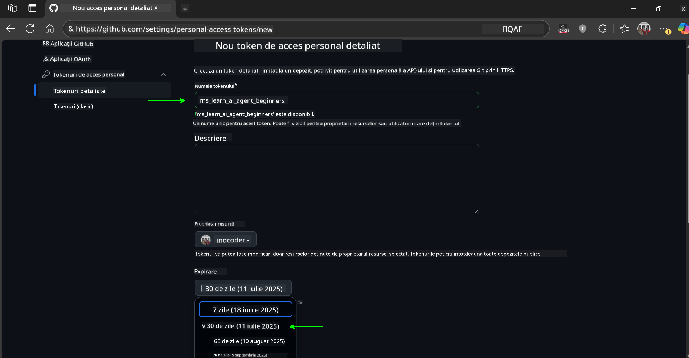
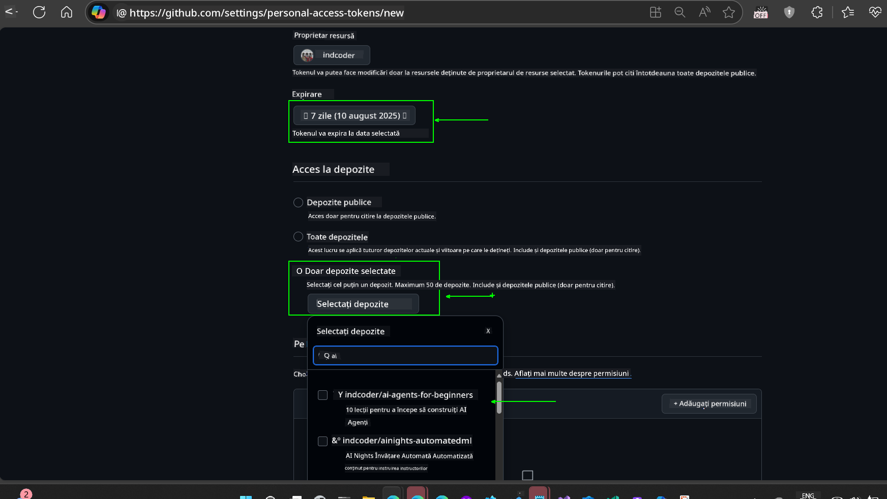
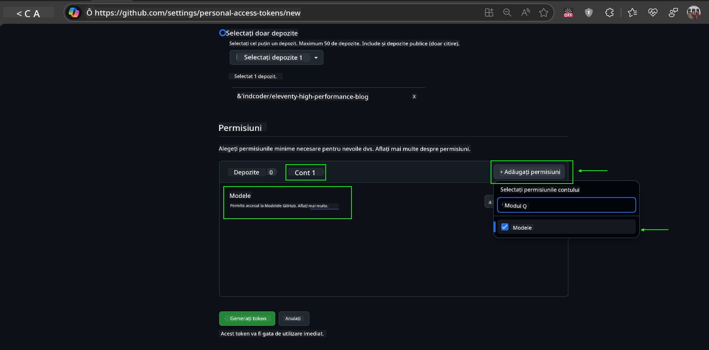
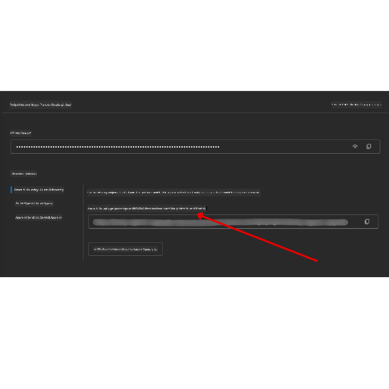

<!--
CO_OP_TRANSLATOR_METADATA:
{
  "original_hash": "96eb7f95375daa3e91778ca0295a55d9",
  "translation_date": "2025-10-15T08:47:35+00:00",
  "source_file": "00-course-setup/README.md",
  "language_code": "ro"
}
-->
# Configurarea Cursului

## Introducere

Această lecție va acoperi modul de rulare a exemplelor de cod din acest curs.

## Alătură-te altor cursanți și obține ajutor

Înainte de a începe clonarea depozitului, alătură-te canalului [AI Agents For Beginners Discord](https://aka.ms/ai-agents/discord) pentru a primi ajutor cu configurarea, pentru orice întrebări legate de curs sau pentru a te conecta cu alți cursanți.

## Clonează sau Fork-uiește acest depozit

Pentru a începe, te rugăm să clonezi sau să fork-uiești depozitul GitHub. Acest lucru va crea propria ta versiune a materialului cursului, astfel încât să poți rula, testa și ajusta codul!

Acest lucru poate fi realizat făcând clic pe linkul pentru <a href="https://github.com/microsoft/ai-agents-for-beginners/fork" target="_blank">a fork-ui depozitul</a>

Ar trebui să ai acum propria ta versiune fork-uită a acestui curs la următorul link:


### Clonare superficială (recomandată pentru workshop-uri / Codespaces)

  >Depozitul complet poate fi mare (~3 GB) atunci când descarci istoricul complet și toate fișierele. Dacă participi doar la workshop sau ai nevoie doar de câteva foldere de lecții, o clonare superficială (sau o clonare parțială) evită cea mai mare parte a descărcării prin trunchierea istoricului și/sau sărirea fișierelor.

#### Clonare superficială rapidă — istoric minim, toate fișierele

Înlocuiește `<your-username>` în comenzile de mai jos cu URL-ul fork-ului tău (sau URL-ul original dacă preferi).

Pentru a clona doar istoricul ultimului commit (descărcare mică):

```bash|powershell
git clone --depth 1 https://github.com/<your-username>/ai-agents-for-beginners.git
```

Pentru a clona o ramură specifică:

```bash|powershell
git clone --depth 1 --branch <branch-name> https://github.com/<your-username>/ai-agents-for-beginners.git
```

#### Clonare parțială (sparse) — fișiere minime + doar folderele selectate

Aceasta folosește clonarea parțială și sparse-checkout (necesită Git 2.25+ și este recomandată o versiune modernă de Git cu suport pentru clonare parțială):

```bash|powershell
git clone --depth 1 --filter=blob:none --sparse https://github.com/<your-username>/ai-agents-for-beginners.git
```

Accesează folderul depozitului:

Pentru bash:

```bash
cd ai-agents-for-beginners
```

Pentru Powershell:

```powershell
Set-Location ai-agents-for-beginners
```

Apoi specifică ce foldere dorești (exemplul de mai jos arată două foldere):

```bash|powershell
git sparse-checkout set 00-course-setup 01-intro-to-ai-agents
```

După ce ai clonat și verificat fișierele, dacă ai nevoie doar de fișiere și vrei să eliberezi spațiu (fără istoric git), te rugăm să ștergi metadatele depozitului (💀ireversibil — vei pierde toate funcționalitățile Git: fără commit-uri, pull-uri, push-uri sau acces la istoric).

Pentru Linux/macOS:

```bash
rm -rf .git
```

Pentru Windows:

```powershell
Remove-Item -Recurse -Force .git
```

#### Utilizarea GitHub Codespaces (recomandat pentru a evita descărcările mari locale)

- Creează un nou Codespace pentru acest depozit prin [interfața GitHub](https://github.com/codespaces).  

- În terminalul Codespace-ului nou creat, rulează una dintre comenzile de clonare superficială/parțială de mai sus pentru a aduce doar folderele de lecții de care ai nevoie în spațiul de lucru Codespace.
- Opțional: după clonare în Codespaces, elimină .git pentru a recupera spațiu suplimentar (vezi comenzile de eliminare de mai sus).
- Notă: Dacă preferi să deschizi depozitul direct în Codespaces (fără o clonare suplimentară), reține că Codespaces va construi mediul devcontainer și poate totuși să aloce mai mult decât ai nevoie. Clonarea unei copii superficiale într-un Codespace proaspăt îți oferă mai mult control asupra utilizării discului.

#### Sfaturi

- Înlocuiește întotdeauna URL-ul de clonare cu fork-ul tău dacă dorești să editezi/commit.
- Dacă ulterior ai nevoie de mai mult istoric sau fișiere, le poți aduce sau ajusta sparse-checkout pentru a include foldere suplimentare.

## Rularea codului

Acest curs oferă o serie de Jupyter Notebooks pe care le poți rula pentru a obține experiență practică în construirea agenților AI.

Exemplele de cod folosesc fie:

**Necesită cont GitHub - Gratuit**:

1) Semantic Kernel Agent Framework + GitHub Models Marketplace. Etichetat ca (semantic-kernel.ipynb)
2) AutoGen Framework + GitHub Models Marketplace. Etichetat ca (autogen.ipynb)

**Necesită abonament Azure**:
3) Azure AI Foundry + Azure AI Agent Service. Etichetat ca (azureaiagent.ipynb)

Te încurajăm să încerci toate cele trei tipuri de exemple pentru a vedea care funcționează cel mai bine pentru tine.

Oricare opțiune alegi, aceasta va determina ce pași de configurare trebuie să urmezi mai jos:

## Cerințe

- Python 3.12+
  - **NOTĂ**: Dacă nu ai instalat Python3.12, asigură-te că îl instalezi. Apoi creează-ți venv-ul folosind python3.12 pentru a te asigura că versiunile corecte sunt instalate din fișierul requirements.txt.
  
    >Exemplu

    Creează un director venv Python:

    ``` bash
    python3 -m venv venv
    ```

    Apoi activează mediul venv pentru:

    macOS și Linux

    ```bash
    source venv/bin/activate
    ```
  
    Windows

    ```bash
    venv\Scripts\activate
    ```

- Un cont GitHub - Pentru acces la GitHub Models Marketplace
- Abonament Azure - Pentru acces la Azure AI Foundry
- Cont Azure AI Foundry - Pentru acces la Azure AI Agent Service

Am inclus un fișier `requirements.txt` în rădăcina acestui depozit care conține toate pachetele Python necesare pentru a rula exemplele de cod.

Le poți instala rulând următoarea comandă în terminalul tău, la rădăcina depozitului:

```bash
pip install -r requirements.txt
```
Recomandăm crearea unui mediu virtual Python pentru a evita conflictele și problemele.

## Configurarea VSCode
Asigură-te că folosești versiunea corectă de Python în VSCode.


## Configurarea pentru exemplele care folosesc modelele GitHub 

### Pasul 1: Obține token-ul personal de acces GitHub (PAT)

Acest curs utilizează GitHub Models Marketplace, oferind acces gratuit la modele de limbaj extins (LLMs) pe care le vei folosi pentru a construi agenți AI.

Pentru a utiliza modelele GitHub, va trebui să creezi un [token personal de acces GitHub](https://docs.github.com/en/authentication/keeping-your-account-and-data-secure/managing-your-personal-access-tokens).

Acest lucru poate fi realizat accesând <a href="https://github.com/settings/personal-access-tokens" target="_blank">setările pentru token-uri personale de acces</a> din contul tău GitHub.

Te rugăm să urmezi [Principiul Privilegiului Minim](https://docs.github.com/en/get-started/learning-to-code/storing-your-secrets-safely) atunci când creezi token-ul. Acest lucru înseamnă că ar trebui să oferi token-ului doar permisiunile necesare pentru a rula exemplele de cod din acest curs.

1. Selectează opțiunea `Fine-grained tokens` din partea stângă a ecranului, accesând **Developer settings**.
   

    Apoi selectează `Generate new token`.

    

2. Introdu un nume descriptiv pentru token-ul tău care să reflecte scopul acestuia, astfel încât să fie ușor de identificat mai târziu.


    🔐 Recomandare pentru durata token-ului

    Durata recomandată: 30 de zile
    Pentru o securitate mai mare, poți opta pentru o perioadă mai scurtă—cum ar fi 7 zile 🛡️
    Este o modalitate excelentă de a-ți seta un obiectiv personal și de a finaliza cursul în timp ce ai un ritm bun de învățare 🚀.

    

3. Limitează domeniul de aplicare al token-ului la fork-ul acestui depozit.

    

4. Restricționează permisiunile token-ului: Sub **Permissions**, fă clic pe fila **Account** și apasă butonul "+ Add permissions". Va apărea un meniu derulant. Te rugăm să cauți **Models** și să bifezi caseta pentru aceasta.
    

5. Verifică permisiunile necesare înainte de a genera token-ul. 

6. Înainte de a genera token-ul, asigură-te că ești pregătit să stochezi token-ul într-un loc sigur, cum ar fi un seif de parole, deoarece nu va fi afișat din nou după ce îl creezi. 

Copiază noul token pe care tocmai l-ai creat. Acum îl vei adăuga în fișierul `.env` inclus în acest curs.


### Pasul 2: Creează fișierul `.env`

Pentru a crea fișierul `.env`, rulează următoarea comandă în terminalul tău.

```bash
cp .env.example .env
```

Aceasta va copia fișierul exemplu și va crea un `.env` în directorul tău, unde vei completa valorile pentru variabilele de mediu.

Cu token-ul copiat, deschide fișierul `.env` în editorul tău preferat de text și lipește token-ul în câmpul `GITHUB_TOKEN`.


Ar trebui să poți rula acum exemplele de cod din acest curs.

## Configurarea pentru exemplele care folosesc Azure AI Foundry și Azure AI Agent Service

### Pasul 1: Obține punctul de acces al proiectului Azure


Urmează pașii pentru crearea unui hub și a unui proiect în Azure AI Foundry, găsiți aici: [Prezentare generală a resurselor hub](https://learn.microsoft.com/en-us/azure/ai-foundry/concepts/ai-resources)


După ce ai creat proiectul, va trebui să obții șirul de conexiune pentru proiectul tău.

Acest lucru poate fi realizat accesând pagina **Overview** a proiectului tău în portalul Azure AI Foundry.



### Pasul 2: Creează fișierul `.env`

Pentru a crea fișierul `.env`, rulează următoarea comandă în terminalul tău.

```bash
cp .env.example .env
```

Aceasta va copia fișierul exemplu și va crea un `.env` în directorul tău, unde vei completa valorile pentru variabilele de mediu.

Cu token-ul copiat, deschide fișierul `.env` în editorul tău preferat de text și lipește token-ul în câmpul `PROJECT_ENDPOINT`.

### Pasul 3: Autentificare în Azure

Ca o bună practică de securitate, vom folosi [autentificarea fără cheie](https://learn.microsoft.com/azure/developer/ai/keyless-connections?tabs=csharp%2Cazure-cli?WT.mc_id=academic-105485-koreyst) pentru a ne autentifica în Azure OpenAI cu Microsoft Entra ID. 

Apoi, deschide un terminal și rulează `az login --use-device-code` pentru a te autentifica în contul tău Azure.

După ce te-ai autentificat, selectează abonamentul tău în terminal.


## Variabile suplimentare de mediu - Azure Search și Azure OpenAI 

Pentru lecția Agentic RAG - Lecția 5 - există exemple care folosesc Azure Search și Azure OpenAI.

Dacă dorești să rulezi aceste exemple, va trebui să adaugi următoarele variabile de mediu în fișierul `.env`:

### Pagina de prezentare generală (Proiect)

- `AZURE_SUBSCRIPTION_ID` - Verifică **Detaliile proiectului** pe pagina **Overview** a proiectului tău.

- `AZURE_AI_PROJECT_NAME` - Uită-te în partea de sus a paginii **Overview** pentru proiectul tău.

- `AZURE_OPENAI_SERVICE` - Găsește acest lucru în fila **Included capabilities** pentru **Azure OpenAI Service** pe pagina **Overview**.

### Centrul de management

- `AZURE_OPENAI_RESOURCE_GROUP` - Accesează **Proprietățile proiectului** pe pagina **Overview** a **Centrului de management**.

- `GLOBAL_LLM_SERVICE` - Sub **Resurse conectate**, găsește numele conexiunii **Azure AI Services**. Dacă nu este listat, verifică **portalul Azure** sub grupul tău de resurse pentru numele resursei AI Services.

### Pagina de modele + puncte de acces

- `AZURE_OPENAI_EMBEDDING_DEPLOYMENT_NAME` - Selectează modelul tău de încorporare (de exemplu, `text-embedding-ada-002`) și notează **Numele implementării** din detaliile modelului.

- `AZURE_OPENAI_CHAT_DEPLOYMENT_NAME` - Selectează modelul tău de chat (de exemplu, `gpt-4o-mini`) și notează **Numele implementării** din detaliile modelului.

### Portalul Azure

- `AZURE_OPENAI_ENDPOINT` - Caută **Azure AI services**, fă clic pe el, apoi accesează **Resource Management**, **Keys and Endpoint**, derulează în jos la "Azure OpenAI endpoints" și copiază-l pe cel care spune "Language APIs".

- `AZURE_OPENAI_API_KEY` - Din același ecran, copiază KEY 1 sau KEY 2.

- `AZURE_SEARCH_SERVICE_ENDPOINT` - Găsește resursa ta **Azure AI Search**, fă clic pe ea și vezi **Overview**.

- `AZURE_SEARCH_API_KEY` - Apoi accesează **Settings** și apoi **Keys** pentru a copia cheia principală sau secundară de administrare.

### Pagină externă

- `AZURE_OPENAI_API_VERSION` - Vizitează pagina [Ciclul de viață al versiunii API](https://learn.microsoft.com/en-us/azure/ai-services/openai/api-version-deprecation#latest-ga-api-release) sub **Ultima versiune GA API**.

### Configurarea autentificării fără cheie

În loc să codificăm datele de autentificare, vom folosi o conexiune fără cheie cu Azure OpenAI. Pentru a face acest lucru, vom importa `DefaultAzureCredential` și ulterior vom apela funcția `DefaultAzureCredential` pentru a obține acreditarea.

```python
from azure.identity import DefaultAzureCredential, InteractiveBrowserCredential
```

## Te-ai blocat undeva?
Dacă întâmpinați probleme în utilizarea acestei configurații, intrați pe <a href="https://discord.gg/kzRShWzttr" target="_blank">Discord-ul Comunității Azure AI</a> sau <a href="https://github.com/microsoft/ai-agents-for-beginners/issues?WT.mc_id=academic-105485-koreyst" target="_blank">creați o problemă</a>.

## Lecția următoare

Acum sunteți pregătit să rulați codul pentru acest curs. Învățare plăcută despre lumea agenților AI!

[Introducere în Agenții AI și Cazuri de Utilizare ale Agenților](../01-intro-to-ai-agents/README.md)

---

**Declinare de responsabilitate**:  
Acest document a fost tradus folosind serviciul de traducere AI [Co-op Translator](https://github.com/Azure/co-op-translator). Deși ne străduim să asigurăm acuratețea, vă rugăm să fiți conștienți că traducerile automate pot conține erori sau inexactități. Documentul original în limba sa natală ar trebui considerat sursa autoritară. Pentru informații critice, se recomandă traducerea profesională realizată de oameni. Nu ne asumăm responsabilitatea pentru neînțelegerile sau interpretările greșite care pot apărea din utilizarea acestei traduceri.