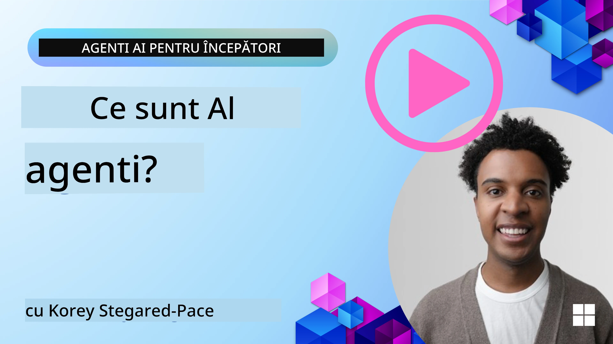
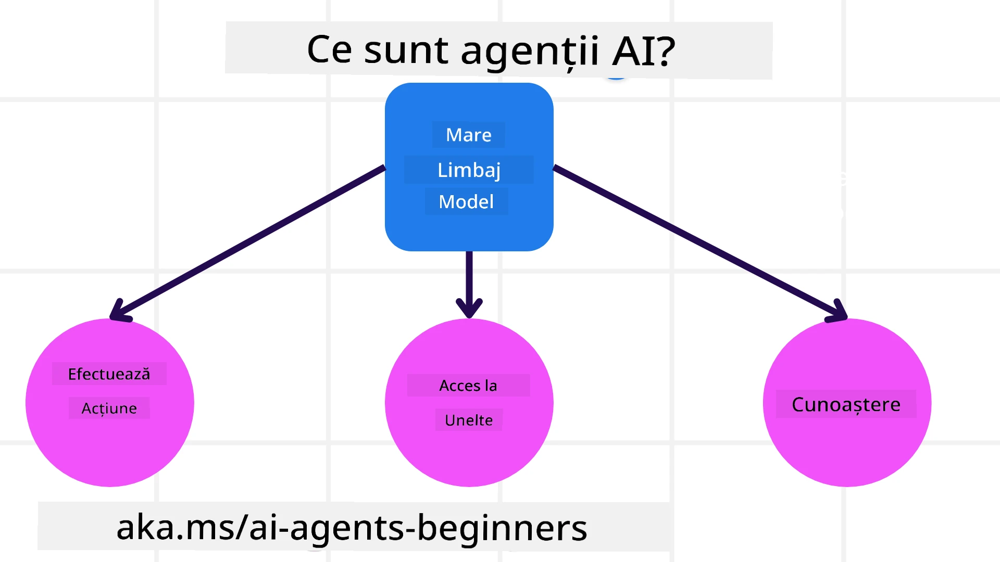
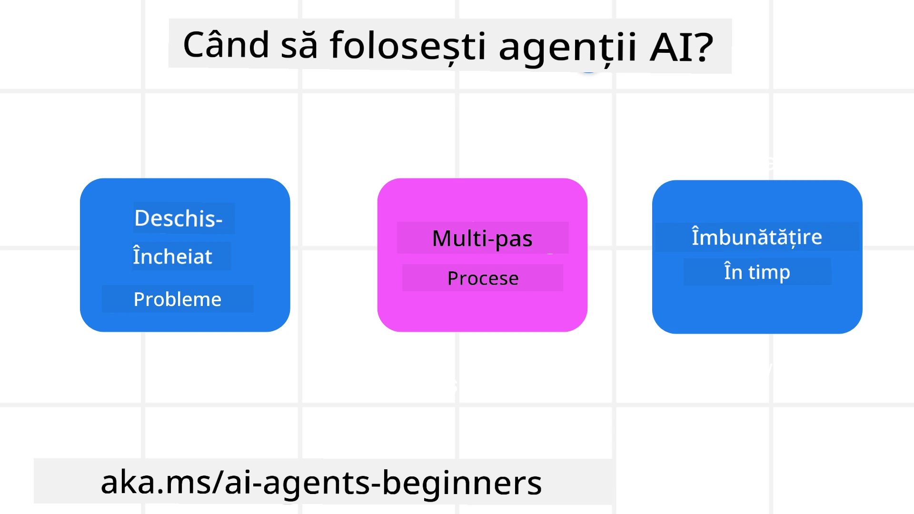

> _(Faceți clic pe imaginea de mai sus pentru a viziona videoclipul acestei lecții)_

# Introducere în Agenții AI și cazuri de utilizare a agenților

Bine ați venit la cursul „Agenți AI pentru începători”! Acest curs oferă cunoștințe fundamentale și exemple aplicate pentru construirea Agenților AI.

Alăturați-vă <a href="https://discord.gg/kzRShWzttr" target="_blank">Comunității Azure AI Discord</a> pentru a cunoaște alți cursanți și dezvoltatori de Agenți AI și pentru a adresa orice întrebări aveți despre acest curs.

Pentru a începe acest curs, începem prin a înțelege mai bine ce sunt Agenții AI și cum îi putem folosi în aplicațiile și fluxurile de lucru pe care le construim.

## Introducere

Această lecție acoperă:

- Ce sunt Agenții AI și care sunt diferitele tipuri de agenți?
- Pentru ce cazuri de utilizare sunt cei mai buni Agenții AI și cum ne pot ajuta?
- Care sunt unele dintre elementele de bază când proiectăm soluții agentice?

## Obiective de învățare
După finalizarea acestei lecții, ar trebui să puteți:

- Înțelege conceptele Agenților AI și cum diferă de alte soluții AI.
- Aplica Agenții AI în mod eficient.
- Proiecta soluții agentice productiv atât pentru utilizatori, cât și pentru clienți.

## Definirea Agenților AI și tipuri de Agenți AI

### Ce sunt Agenții AI?

Agenții AI sunt **sisteme** care permit **modelelor mari de limbaj (LLM-uri)** să **efectueze acțiuni** prin extinderea capacităților lor oferindu-le **acces la instrumente** și **cunoștințe**.

Să despărțim această definiție în părți mai mici:

- **Sistem** - Este important să gândim agenții nu ca pe un singur component, ci ca pe un sistem format din multe componente. La nivel de bază, componentele unui Agent AI sunt:
  - **Mediul** - Spațiul definit în care Agentul AI operează. De exemplu, dacă am avea un Agent AI pentru rezervări de călătorii, mediul ar putea fi sistemul de rezervări de călătorii pe care agentul îl utilizează pentru a finaliza sarcinile.
  - **Senzorii** - Mediile au informații și oferă feedback. Agenții AI folosesc senzori pentru a colecta și interpreta aceste informații despre starea curentă a mediului. În exemplul Agentului de rezervări, sistemul de rezervări poate oferi informații cum ar fi disponibilitatea hotelurilor sau prețurile zborurilor.
  - **Actuatori** - Odată ce Agentul AI primește starea curentă a mediului, pentru sarcina curentă agentul determină ce acțiune să execute pentru a schimba mediul. Pentru agentul de rezervări, aceasta poate fi rezervarea unei camere disponibile pentru utilizator.

**Modelele mari de limbaj** - Conceptul de agenți exista înainte de crearea LLM-urilor. Avantajul construirii Agenților AI cu LLM-uri este capacitatea lor de a interpreta limbajul uman și datele. Această abilitate permite LLM-urilor să interpreteze informațiile mediului și să definească un plan pentru a schimba mediul.

**Executarea acțiunilor** - În afara sistemelor de Agenți AI, LLM-urile sunt limitate la situații în care acțiunea este generarea de conținut sau informații pe baza unei solicitări a utilizatorului. În cadrul sistemelor de Agenți AI, LLM-urile pot îndeplini sarcini interpretând cererea utilizatorului și folosind instrumentele disponibile în mediul lor.

**Acces la instrumente** - La ce instrumente are acces LLM-ul este definit de 1) mediul în care operează și 2) dezvoltatorul Agentului AI. Pentru exemplul agentului de călătorie, instrumentele agentului sunt limitate de operațiunile disponibile în sistemul de rezervări și/sau dezvoltatorul poate restricționa accesul agentului la instrumente pentru zboruri.

**Memorie + Cunoștințe** - Memoria poate fi pe termen scurt în contextul conversației între utilizator și agent. Pe termen lung, în afara informațiilor furnizate de mediu, Agenții AI pot de asemenea să acceseze cunoștințe din alte sisteme, servicii, instrumente și chiar alți agenți. În exemplul agentului de călătorie, aceste cunoștințe ar putea fi informațiile despre preferințele de călătorie ale utilizatorului stocate într-o bază de date a clienților.

### Diferitele tipuri de agenți

Acum că avem o definiție generală a Agenților AI, să privim câteva tipuri specifice de agenți și cum ar fi aplicați în cazul unui agent AI pentru rezervări de călătorie.

| **Tip Agent**                 | **Descriere**                                                                                                                        | **Exemplu**                                                                                                                                                                                                                   |
| ---------------------------- | ---------------------------------------------------------------------------------------------------------------------------------- | ----------------------------------------------------------------------------------------------------------------------------------------------------------------------------------------------------------------------------- |
| **Agenți Reflex Simpli**      | Execută acțiuni imediate pe baza regulilor predefinite.                                                                             | Agentul de călătorie interpretează contextul unui e-mail și transmite reclamațiile legate de călătorie către serviciul clienți.                                                                                               |
| **Agenți Reflex Bazat pe Model** | Execută acțiuni bazate pe un model al lumii și modificări ale acelui model.                                                        | Agentul de călătorie prioritizează rutele cu schimbări semnificative de preț pe baza accesului la date istorice despre prețuri.                                                                                               |
| **Agenți Bazati pe Obiective**| Creează planuri pentru a atinge obiective specifice interpretând obiectivul și determinând acțiunile necesare pentru realizarea lui. | Agentul de călătorie rezervă o călătorie determinând aranjamentele necesare (mașină, transport public, zboruri) de la locația curentă până la destinație.                                                                     |
| **Agenți Bazati pe Utilitate**| Ia în considerare preferințele și cântărește compromisurile numeric pentru a determina cum să atingă obiectivele.                 | Agentul de călătorie maximizează utilitatea cântărind comoditatea versus costul la rezervarea călătoriei.                                                                                                                    |
| **Agenți cu Învățare**        | Se îmbunătățesc în timp răspunzând la feedback și ajustând acțiunile în consecință.                                                | Agentul de călătorie se îmbunătățește folosind feedback-ul clienților din sondaje post-călătorie pentru a ajusta rezervările viitoare.                                                                                        |
| **Agenți Ierarhici**          | Conțin mai mulți agenți într-un sistem stratificat, agenții de nivel superior descompun sarcini în sub-sarcini pentru agenții de nivel inferior. | Agentul de călătorie anulează o călătorie împărțind sarcina în sub-sarcini (de exemplu, anularea rezervărilor specifice) și având agenți de nivel inferior care le execută, raportând înapoi agentului de nivel superior.           |
| **Sisteme Multi-Agent (MAS)** | Agenții îndeplinesc sarcini independent, fie cooperativ, fie competitiv.                                                          | Cooperativ: Mai mulți agenți rezervă servicii de călătorie specifice cum ar fi hoteluri, zboruri și divertisment. Competitiv: Mai mulți agenți gestionează și concurează pentru un calendar comun de rezervări de hotel pentru a rezerva clienți. |

## Când să folosiți agenți AI

În secțiunea anterioară, am folosit cazul de utilizare al Agentului de călătorie pentru a explica cum tipurile diferite de agenți pot fi folosite în situații diferite de rezervare a călătoriei. Vom continua să folosim această aplicație pe parcursul cursului.

Să vedem tipurile de cazuri de utilizare pentru care Agenții AI sunt cel mai bine folosiți:

- **Probleme cu răspuns deschis** - permit LLM-ului să determine pașii necesari pentru a finaliza o sarcină deoarece nu poate fi întotdeauna hardcodat într-un flux de lucru.
- **Procese cu mai mulți pași** - sarcini care necesită un nivel de complexitate în care Agentul AI trebuie să utilizeze instrumente sau informații pe parcursul mai multor runde și nu doar o singură extragere.  
- **Îmbunătățire în timp** - sarcini în care agentul se poate îmbunătăți în timp primind feedback fie din mediul său, fie de la utilizatori pentru a oferi o utilitate mai bună.

Acoperim mai multe considerații privind utilizarea Agenților AI în lecția Construirea Agenților AI demni de încredere.

## Noțiuni de bază despre Soluții Agentice

### Dezvoltarea Agenților

Primul pas în proiectarea unui sistem Agent AI este definirea instrumentelor, acțiunilor și comportamentelor. În acest curs, ne concentrăm pe utilizarea **Azure AI Agent Service** pentru a defini Agenții noștri. Aceasta oferă caracteristici precum:

- Selecția modelelor Open cum ar fi OpenAI, Mistral și Llama
- Utilizarea datelor licențiate prin furnizori cum ar fi Tripadvisor
- Utilizarea instrumentelor standardizate OpenAPI 3.0

### Modele agentice

Comunicarea cu LLM-urile se face prin prompturi. Având în vedere natura semi-autonomă a Agenților AI, nu este întotdeauna posibil sau necesar să se reprompteze manual LLM-ul după o schimbare a mediului. Folosim **modele agentice** care ne permit să promptăm LLM-ul pe mai mulți pași într-un mod mai scalabil.

Acest curs este împărțit în unele dintre modelele agentice populare în prezent.

### Cadre Agentice

Cadrele agentice permit dezvoltatorilor să implementeze modele agentice prin cod. Aceste cadre oferă șabloane, pluginuri și instrumente pentru o colaborare mai bună între Agenții AI. Aceste beneficii oferă capabilități pentru observabilitate mai bună și depanare a sistemelor Agenților AI.

În acest curs, vom explora Microsoft Agent Framework (MAF) pentru construirea agenților AI pregătiți pentru producție.

## Coduri Exemple

- Python: [Agent Framework](./code_samples/01-python-agent-framework.ipynb)
- .NET: [Agent Framework](./code_samples/01-dotnet-agent-framework.md)

## Aveți mai multe întrebări despre Agenții AI?

Alăturați-vă [Microsoft Foundry Discord](https://aka.ms/ai-agents/discord) pentru a întâlni alți cursanți, a participa la sesiuni de birou și a primi răspunsuri la întrebările despre Agenții AI.

## Lecția Anterioară

[Configurarea cursului](../00-course-setup/README.md)

## Următoarea lecție

[Explorarea Cadrelor Agentice](../02-explore-agentic-frameworks/README.md)

---

<!-- CO-OP TRANSLATOR DISCLAIMER START -->
**Declinare de responsabilitate**:
Acest document a fost tradus folosind serviciul de traducere AI [Co-op Translator](https://github.com/Azure/co-op-translator). Deși ne străduim pentru acuratețe, vă rugăm să rețineți că traducerile automate pot conține erori sau inexactități. Documentul original în limba sa nativă trebuie considerat sursa autoritară. Pentru informații critice, se recomandă traducerea profesională realizată de un specialist uman. Nu ne asumăm nicio responsabilitate pentru eventualele neînțelegeri sau interpretări greșite rezultate din utilizarea acestei traduceri.
<!-- CO-OP TRANSLATOR DISCLAIMER END -->