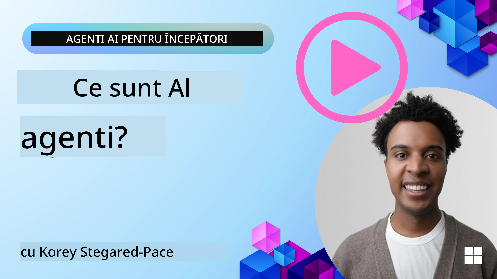
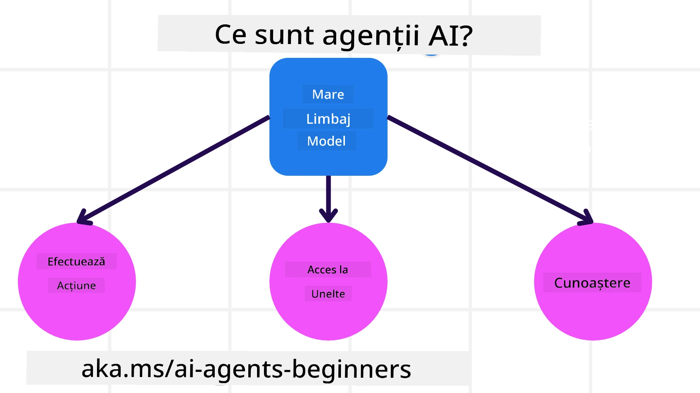
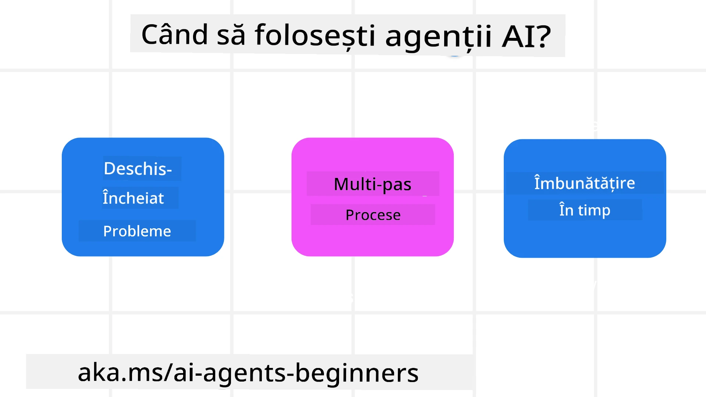

> _(Click pe imaginea de mai sus pentru a viziona videoclipul acestei lecții)_

# Introducere în agenții AI și cazurile de utilizare ale agenților

Bine ai venit la cursul **Agenți AI pentru începători**! Acest curs îți oferă cunoștințele de bază — și cod de lucru real — pentru a începe să construiești agenți AI de la zero.

Vino să spui salut în <a href="https://discord.gg/kzRShWzttr" target="_blank">Comunitatea Discord Azure AI</a> — este plină de cursanți și constructori AI care sunt bucuroși să răspundă întrebărilor.

Înainte să începem să construim, să ne asigurăm că înțelegem cu adevărat ce este un agent AI și când are sens să folosești unul.

---

## Introducere

Această lecție acoperă:

- Ce sunt agenții AI și tipurile diferite care există
- Pentru ce tipuri de sarcini sunt agenții AI cei mai potriviți
- Elementele de bază pe care le vei folosi când proiectezi o soluție agentică

## Obiective de învățare

Până la finalul acestei lecții, ar trebui să poți:

- Explica ce este un agent AI și cum diferă de o soluție AI obișnuită
- Să știi când să folosești un agent AI (și când nu)
- Să schițezi un design de bază pentru o soluție agentică pentru o problemă din lumea reală

---

## Definirea agenților AI și tipurile de agenți AI

### Ce sunt agenții AI?

Iată o modalitate simplă de a te gândi la asta:

> **Agenții AI sunt sisteme care permit modelelor mari de limbaj (LLM) să *facă lucruri* — oferindu-le unelte și cunoștințe pentru a acționa în lume, nu doar să răspundă la prompturi.**

Hai să detaliem puțin:

- **Sistem** — Un agent AI nu este doar un singur lucru. Este o colecție de părți care lucrează împreună. În esență, fiecare agent are trei componente:
  - **Mediu** — Spațiul în care agentul lucrează. Pentru un agent de rezervări de călătorii, aceasta ar fi platforma de rezervări în sine.
  - **Senzori** — Cum citește agentul starea curentă a mediului său. Agentul nostru de călătorii ar putea verifica disponibilitatea hotelurilor sau prețurile zborurilor.
  - **Actuatori** — Cum ia agentul măsuri. Agentul de călătorii ar putea rezerva o cameră, trimite o confirmare sau anula o rezervare.

- **Modele Mari de Limbaj** — Agenții existau înainte de LLM-uri, dar LLM-urile sunt ceea ce face agenții moderni atât de puternici. Ei pot înțelege limbajul natural, pot raționa în funcție de context și pot transforma o solicitare vagă a utilizatorului într-un plan concret de acțiune.

- **Execută Acțiuni** — Fără un sistem agent, un LLM doar generează text. În interiorul unui sistem agent, LLM-ul poate chiar *executa* pași — căutând într-o bază de date, apelând o API, trimițând un mesaj.

- **Acces la Unelte** — Ce unelte poate folosi agentul depinde de (1) mediul în care rulează și (2) ce a ales dezvoltatorul să îi ofere. Un agent de călătorii ar putea putea căuta zboruri, dar să nu modifice datele clienților — totul ține de ce conectezi.

- **Memorie + Cunoștințe** — Agenții pot avea memorie pe termen scurt (conversația curentă) și memorie pe termen lung (o bază de date cu clienți, interacțiuni anterioare). Agentul de călătorii ar putea „ține minte” că preferi locurile la geam.

---

### Diferitele tipuri de agenți AI

Nu toți agenții sunt construiți la fel. Iată o defalcare a principalelor tipuri, folosind un agent de rezervări de călătorii ca exemplu:

| **Tip Agent** | **Ce face** | **Exemplu Agent de Călătorii** |
|---|---|---|
| **Agenți Reflex Simpli** | Urmează reguli codificate — fără memorie, fără planificare. | Primește un email de reclamație → îl redirecționează către serviciul pentru clienți. Atât. |
| **Agenți Reflex pe Bază de Model** | Păstrează un model intern al lumii și îl actualizează pe măsură ce lucrurile se schimbă. | Monitorizează prețurile zborurilor istorice și semnalează rutele care devin brusc scumpe. |
| **Agenți pe Bază de Scop** | Are un scop în minte și găsește cum să îl atingă pas cu pas. | Rezervă o călătorie completă (zboruri, mașină, hotel) pornind de la locația ta curentă către destinație. |
| **Agenți pe Bază de Utilitate** | Nu doar găsește *o* soluție — găsește *cea mai bună* cântărind compromisurile. | Echilibrează costul versus confortul pentru a găsi călătoria care se potrivește cel mai bine preferințelor tale. |
| **Agenți care Învață** | Se îmbunătățesc în timp învățând din feedback. | Ajustează recomandările viitoare de rezervare în funcție de rezultatele chestionarelor post-călătorie. |
| **Agenți Ierarhici** | Un agent de nivel înalt împarte munca în sub-sarcini și le delegă agenților de nivel inferior. | O cerere de „anulare călătorie” este împărțită în: anulează zbor, anulează hotel, anulează închirierea mașinii — fiecare gestionat de un sub-agent. |
| **Sisteme Multi-Agent (MAS)** | Mai mulți agenți independenți lucrează împreună (sau concurează). | Cooperativ: agenți separați gestionează hoteluri, zboruri și divertisment. Competitiv: mai mulți agenți concurează să ocupe camerele de hotel la cel mai bun preț. |

---

## Când să folosești agenți AI

Doar pentru că *poți* folosi un agent AI nu înseamnă că întotdeauna *ar trebui*. Iată situațiile în care agenții strălucesc cu adevărat:

- **Probleme Deschise** — Când pașii pentru a rezolva o problemă nu pot fi pre-programați. Ai nevoie ca LLM-ul să descopere drumul dinamic.
- **Procese cu Mai Mulți Pași** — Sarcini care necesită folosirea uneltelor pe mai multe etape, nu doar o căutare sau generare singulară.
- **Îmbunătățire în Timp** — Când vrei ca sistemul să devină mai inteligent bazat pe feedback-ul utilizatorului sau semnale din mediu.

Vom aprofunda când (și când *nu*) să folosim agenți AI în lecția **Construirea agenților AI de încredere** care vine mai târziu în curs.

---

## Elemente de bază ale soluțiilor agentice

### Dezvoltarea agentului

Primul lucru pe care îl faci când construiești un agent este să definești *ce poate face* — uneltele, acțiunile și comportamentele sale.

În acest curs, folosim **Microsoft Foundry Agent Service** ca platformă principală. Aceasta suportă:

- Modele de la furnizori precum OpenAI, Mistral și Meta (Llama)
- Date licențiate de la furnizori precum Tripadvisor
- Definiții standardizate de unelte OpenAPI 3.0

### Tipare agentice

Comunici cu LLM-uri prin prompturi. Cu agenții, nu poți întotdeauna să creezi manual fiecare prompt — agentul trebuie să acționeze pe mai mulți pași. Aici intervin **Tiparele agentice**. Sunt strategii reutilizabile pentru a prompta și orchestra LLM-uri într-un mod mai scalabil și fiabil.

Acest curs este structurat în jurul celor mai comune și utile tipare agentice.

### Cadre agentice

Cadrele agentice oferă dezvoltatorilor șabloane, unelte și infrastructură gata făcute pentru a construi agenți. Fac mai ușor să:

- Conectezi unelte și capabilități
- Observi ce face agentul (și să depanezi când ceva nu merge)
- Colaborezi între mai mulți agenți

În acest curs, ne concentrăm pe **Microsoft Agent Framework (MAF)** pentru a construi agenți pregătiți pentru producție.

---

## Exemple de cod

Gata să vezi cum funcționează? Iată exemplele de cod pentru această lecție:

- 🐍 Python: [Agent Framework](./code_samples/01-python-agent-framework.ipynb)
- 🔷 .NET: [Agent Framework](./code_samples/01-dotnet-agent-framework.md)

---

## Ai întrebări?

Alătură-te [Microsoft Foundry Discord](https://discord.com/invite/ATgtXmAS5D) pentru a conecta cu alți cursanți, a participa la ore de consultații și a-ți rezolva întrebările despre agenții AI cu ajutorul comunității.

---

## Lecția anterioară

[Course Setup](../00-course-setup/README.md)

## Lecția următoare

[Exploring Agentic Frameworks](../02-explore-agentic-frameworks/README.md)

---

<!-- CO-OP TRANSLATOR DISCLAIMER START -->
**Declinare a responsabilității**:
Acest document a fost tradus folosind serviciul de traducere AI [Co-op Translator](https://github.com/Azure/co-op-translator). În timp ce ne străduim pentru acuratețe, vă rugăm să rețineți că traducerile automate pot conține erori sau inexactități. Documentul original în limba sa nativă trebuie considerat sursa autorizată. Pentru informații critice, se recomandă traducerea profesională realizată de un om. Nu ne asumăm responsabilitatea pentru eventualele neînțelegeri sau interpretări greșite care decurg din utilizarea acestei traduceri.
<!-- CO-OP TRANSLATOR DISCLAIMER END -->