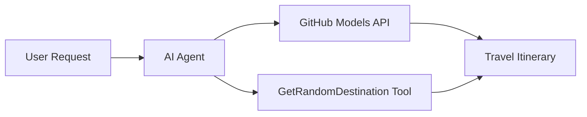

<!--
CO_OP_TRANSLATOR_METADATA:
{
  "original_hash": "23afd9be7b6ba5b69a44c3b6a78e07f6",
  "translation_date": "2025-11-06T10:06:30+00:00",
  "source_file": "01-intro-to-ai-agents/code_samples/01-dotnet-agent-framework.md",
  "language_code": "ro"
}
-->
# 🌍 Agent de Călătorii AI cu Microsoft Agent Framework (.NET)

## 📋 Prezentare Generală a Scenariului

Acest notebook demonstrează cum să construiești un agent inteligent pentru planificarea călătoriilor utilizând Microsoft Agent Framework pentru .NET. Agentul poate genera automat itinerarii personalizate pentru excursii de o zi către destinații aleatorii din întreaga lume.

**Capabilități Cheie:**
- 🎲 **Selecție Aleatorie a Destinației**: Folosește un instrument personalizat pentru a alege locuri de vacanță
- 🗺️ **Planificare Inteligentă a Călătoriilor**: Creează itinerarii detaliate zi cu zi
- 🔄 **Streaming în Timp Real**: Suportă răspunsuri imediate și în flux continuu
- 🛠️ **Integrare cu Instrumente Personalizate**: Demonstrează cum să extinzi capabilitățile agentului

## 🔧 Arhitectura Tehnică

### Tehnologii de Bază
- **Microsoft Agent Framework**: Cea mai recentă implementare .NET pentru dezvoltarea agenților AI
- **Integrare cu Modele GitHub**: Utilizează serviciul de inferență AI al GitHub
- **Compatibilitate cu API-ul OpenAI**: Folosește biblioteci client OpenAI cu puncte de acces personalizate
- **Configurare Securizată**: Gestionarea cheilor API bazată pe mediu

### Componente Cheie
1. **AIAgent**: Orchestratorul principal al agentului care gestionează fluxul conversației
2. **Instrumente Personalizate**: Funcția `GetRandomDestination()` disponibilă pentru agent
3. **Client de Chat**: Interfață de conversație susținută de Modelele GitHub
4. **Suport pentru Streaming**: Capacități de generare a răspunsurilor în timp real

### Model de Integrare


## 🚀 Începeți

**Prerechizite:**
- .NET 10.0 sau mai recent
- Token de acces API pentru Modelele GitHub
- Variabile de mediu configurate în fișierul `.env`

**Variabile de Mediu Necesare:**
```env
GITHUB_TOKEN=your_github_token
GITHUB_ENDPOINT=https://models.inference.ai.azure.com
GITHUB_MODEL_ID=gpt-4o-mini
```

Rulați exemplul de cod de mai jos în ordine pentru a vedea agentul de călătorii în acțiune!

---

## Aplicație .NET Single File: Exemplu de Agent de Călătorii AI

Consultați `01-dotnet-agent-framework.cs` pentru exemplul complet de cod executabil.

```bash
dotnet run 01-dotnet-agent-framework.cs
```

### Exemplu de Cod

```csharp
static string GetRandomDestination()
{
    var destinations = new List<string>
    {
        "Paris, France",
        "Tokyo, Japan",
        "New York City, USA",
        "Sydney, Australia",
        "Rome, Italy",
        "Barcelona, Spain",
        "Cape Town, South Africa",
        "Rio de Janeiro, Brazil",
        "Bangkok, Thailand",
        "Vancouver, Canada"
    };
    var random = new Random();
    int index = random.Next(destinations.Count);
    return destinations[index];
}

// Extract configuration from environment variables
var github_endpoint = Environment.GetEnvironmentVariable("GITHUB_ENDPOINT") ?? throw new InvalidOperationException("GITHUB_ENDPOINT is not set.");
var github_model_id = Environment.GetEnvironmentVariable("GITHUB_MODEL_ID") ?? "gpt-4o-mini";
var github_token = Environment.GetEnvironmentVariable("GITHUB_TOKEN") ?? throw new InvalidOperationException("GITHUB_TOKEN is not set.");

// Configure OpenAI Client Options
var openAIOptions = new OpenAIClientOptions()
{
    Endpoint = new Uri(github_endpoint)
};

// Initialize OpenAI Client with GitHub Models Configuration
var openAIClient = new OpenAIClient(new ApiKeyCredential(github_token), openAIOptions);

// Create AI Agent with Travel Planning Capabilities
AIAgent agent = openAIClient
    .GetChatClient(github_model_id)
    .CreateAIAgent(
        instructions: "You are a helpful AI Agent that can help plan vacations for customers at random destinations",
        tools: [AIFunctionFactory.Create(GetRandomDestination)]
    );

// Execute Agent: Plan a Day Trip (Non-Streaming)
Console.WriteLine(await agent.RunAsync("Plan me a day trip"));

// Execute Agent: Plan a Day Trip (Streaming Response)
await foreach (var update in agent.RunStreamingAsync("Plan me a day trip"))
{
    Console.Write(update);
}
```

---

**Declinare de responsabilitate**:  
Acest document a fost tradus folosind serviciul de traducere AI [Co-op Translator](https://github.com/Azure/co-op-translator). Deși ne străduim să asigurăm acuratețea, vă rugăm să fiți conștienți că traducerile automate pot conține erori sau inexactități. Documentul original în limba sa maternă ar trebui considerat sursa autoritară. Pentru informații critice, se recomandă traducerea profesională realizată de un specialist uman. Nu ne asumăm responsabilitatea pentru eventualele neînțelegeri sau interpretări greșite care pot apărea din utilizarea acestei traduceri.