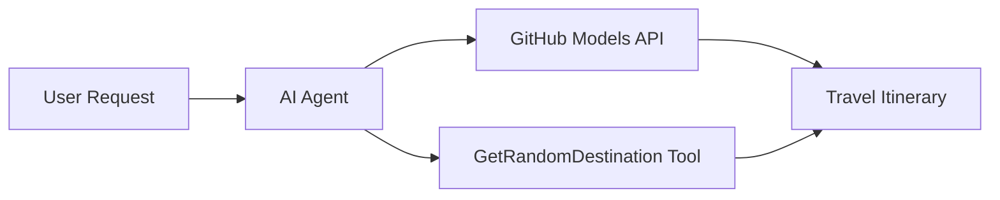

<!--
CO_OP_TRANSLATOR_METADATA:
{
  "original_hash": "e959fefef991a78e6eb72b5ce8ca58d4",
  "translation_date": "2025-11-11T11:38:17+00:00",
  "source_file": "01-intro-to-ai-agents/code_samples/01-dotnet-agent-framework.md",
  "language_code": "ro"
}
-->
# 🌍 Agent de Călătorii AI cu Microsoft Agent Framework (.NET)

## 📋 Prezentare Generală a Scenariului

Acest notebook demonstrează cum să construiești un agent inteligent pentru planificarea călătoriilor utilizând Microsoft Agent Framework pentru .NET. Agentul poate genera automat itinerarii personalizate pentru excursii de o zi către destinații aleatorii din întreaga lume.

### Capacități Cheie:

- 🎲 **Selecție Aleatorie a Destinației**: Folosește un instrument personalizat pentru a alege locuri de vacanță
- 🗺️ **Planificare Inteligentă a Excursiilor**: Creează itinerarii detaliate zi cu zi
- 🔄 **Streaming în Timp Real**: Suportă răspunsuri imediate și în flux
- 🛠️ **Integrare cu Instrumente Personalizate**: Demonstrează cum să extinzi capacitățile agentului

## 🔧 Arhitectura Tehnică

### Tehnologii de Bază

- **Microsoft Agent Framework**: Cea mai recentă implementare .NET pentru dezvoltarea agenților AI
- **Integrare cu Modelele GitHub**: Utilizează serviciul de inferență AI al GitHub
- **Compatibilitate cu API-ul OpenAI**: Folosește biblioteci client OpenAI cu puncte de acces personalizate
- **Configurare Securizată**: Gestionarea cheilor API bazată pe mediu

### Componente Cheie

1. **AIAgent**: Orchestratorul principal al agentului care gestionează fluxul conversației
2. **Instrumente Personalizate**: Funcția `GetRandomDestination()` disponibilă pentru agent
3. **Client de Chat**: Interfață de conversație susținută de Modelele GitHub
4. **Suport pentru Streaming**: Capacități de generare a răspunsurilor în timp real

### Model de Integrare



## 🚀 Începeți

### Cerințe Prealabile

- [.NET 10 SDK](https://dotnet.microsoft.com/download/dotnet/10.0) sau o versiune mai recentă
- [Token de acces API pentru Modelele GitHub](https://docs.github.com/github-models/github-models-at-scale/using-your-own-api-keys-in-github-models)

### Variabile de Mediu Necesare

```bash
# zsh/bash
export GH_TOKEN=<your_github_token>
export GH_ENDPOINT=https://models.github.ai/inference
export GH_MODEL_ID=openai/gpt-5-mini
```

```powershell
# PowerShell
$env:GH_TOKEN = "<your_github_token>"
$env:GH_ENDPOINT = "https://models.github.ai/inference"
$env:GH_MODEL_ID = "openai/gpt-5-mini"
```

### Cod Exemplu

Pentru a rula exemplul de cod,

```bash
# zsh/bash
chmod +x ./01-dotnet-agent-framework.cs
./01-dotnet-agent-framework.cs
```

Sau folosind CLI-ul dotnet:

```bash
dotnet run ./01-dotnet-agent-framework.cs
```

Consultați [`01-dotnet-agent-framework.cs`](../../../../01-intro-to-ai-agents/code_samples/01-dotnet-agent-framework.cs) pentru codul complet.

```csharp
#!/usr/bin/dotnet run

#:package Microsoft.Extensions.AI@9.*
#:package Microsoft.Agents.AI.OpenAI@1.*-*

using System.ClientModel;
using System.ComponentModel;

using Microsoft.Agents.AI;
using Microsoft.Extensions.AI;

using OpenAI;

// Tool Function: Random Destination Generator
// This static method will be available to the agent as a callable tool
// The [Description] attribute helps the AI understand when to use this function
// This demonstrates how to create custom tools for AI agents
[Description("Provides a random vacation destination.")]
static string GetRandomDestination()
{
    // List of popular vacation destinations around the world
    // The agent will randomly select from these options
    var destinations = new List<string>
    {
        "Paris, France",
        "Tokyo, Japan",
        "New York City, USA",
        "Sydney, Australia",
        "Rome, Italy",
        "Barcelona, Spain",
        "Cape Town, South Africa",
        "Rio de Janeiro, Brazil",
        "Bangkok, Thailand",
        "Vancouver, Canada"
    };

    // Generate random index and return selected destination
    // Uses System.Random for simple random selection
    var random = new Random();
    int index = random.Next(destinations.Count);
    return destinations[index];
}

// Extract configuration from environment variables
// Retrieve the GitHub Models API endpoint, defaults to https://models.github.ai/inference if not specified
// Retrieve the model ID, defaults to openai/gpt-5-mini if not specified
// Retrieve the GitHub token for authentication, throws exception if not specified
var github_endpoint = Environment.GetEnvironmentVariable("GH_ENDPOINT") ?? "https://models.github.ai/inference";
var github_model_id = Environment.GetEnvironmentVariable("GH_MODEL_ID") ?? "openai/gpt-5-mini";
var github_token = Environment.GetEnvironmentVariable("GH_TOKEN") ?? throw new InvalidOperationException("GH_TOKEN is not set.");

// Configure OpenAI Client Options
// Create configuration options to point to GitHub Models endpoint
// This redirects OpenAI client calls to GitHub's model inference service
var openAIOptions = new OpenAIClientOptions()
{
    Endpoint = new Uri(github_endpoint)
};

// Initialize OpenAI Client with GitHub Models Configuration
// Create OpenAI client using GitHub token for authentication
// Configure it to use GitHub Models endpoint instead of OpenAI directly
var openAIClient = new OpenAIClient(new ApiKeyCredential(github_token), openAIOptions);

// Create AI Agent with Travel Planning Capabilities
// Initialize OpenAI client, get chat client for specified model, and create AI agent
// Configure agent with travel planning instructions and random destination tool
// The agent can now plan trips using the GetRandomDestination function
AIAgent agent = openAIClient
    .GetChatClient(github_model_id)
    .CreateAIAgent(
        instructions: "You are a helpful AI Agent that can help plan vacations for customers at random destinations",
        tools: [AIFunctionFactory.Create(GetRandomDestination)]
    );

// Execute Agent: Plan a Day Trip
// Run the agent with streaming enabled for real-time response display
// Shows the agent's thinking and response as it generates the content
// Provides better user experience with immediate feedback
await foreach (var update in agent.RunStreamingAsync("Plan me a day trip"))
{
    await Task.Delay(10);
    Console.Write(update);
}
```

---

<!-- CO-OP TRANSLATOR DISCLAIMER START -->
**Declinare de responsabilitate**:  
Acest document a fost tradus folosind serviciul de traducere AI [Co-op Translator](https://github.com/Azure/co-op-translator). Deși ne străduim să asigurăm acuratețea, vă rugăm să fiți conștienți că traducerile automate pot conține erori sau inexactități. Documentul original în limba sa maternă ar trebui considerat sursa autoritară. Pentru informații critice, se recomandă traducerea profesională realizată de oameni. Nu ne asumăm responsabilitatea pentru neînțelegerile sau interpretările greșite care pot apărea din utilizarea acestei traduceri.
<!-- CO-OP TRANSLATOR DISCLAIMER END -->