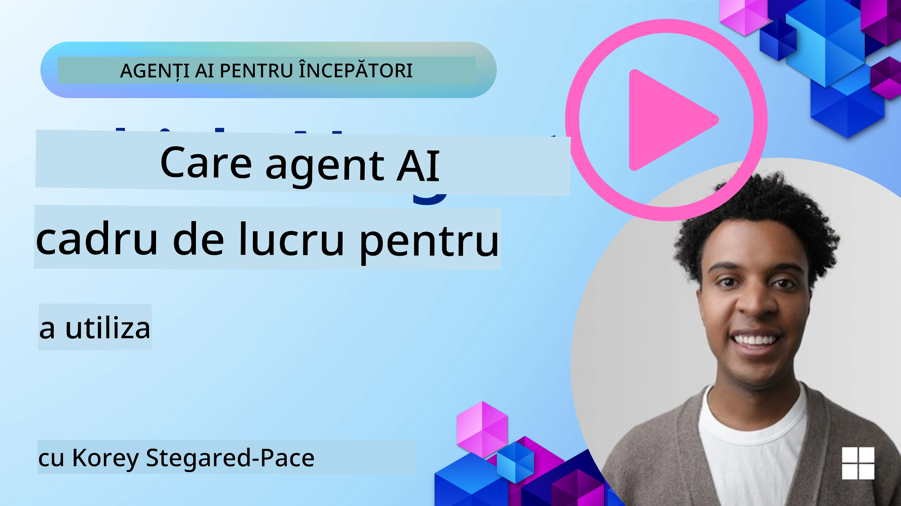

[](https://youtu.be/ODwF-EZo_O8?si=1xoy_B9RNQfrYdF7)

> _(Faceți clic pe imaginea de mai sus pentru a viziona videoclipul acestei lecții)_

# Explorarea Framework-urilor pentru Agenți AI

Framework-urile pentru agenți AI sunt platforme software concepute pentru a simplifica crearea, implementarea și gestionarea agenților AI. Aceste framework-uri oferă dezvoltatorilor componente, abstracții și unelte preconstruite care facilitează dezvoltarea sistemelor AI complexe.

Aceste framework-uri ajută dezvoltatorii să se concentreze pe aspectele unice ale aplicațiilor lor oferind abordări standardizate pentru provocările comune în dezvoltarea agenților AI. Ele măresc scalabilitatea, accesibilitatea și eficiența în construirea sistemelor AI.

## Introducere 

Această lecție va acoperi:

- Ce sunt Framework-urile pentru Agenți AI și ce permit dezvoltatorilor să realizeze?
- Cum pot echipele să folosească acestea pentru a prototipa rapid, itera și îmbunătăți capabilitățile agenților?
- Care sunt diferențele dintre framework-urile și uneltele create de Microsoft (<a href="https://aka.ms/ai-agents-beginners/ai-agent-service" target="_blank">Azure AI Agent Service</a> și <a href="https://learn.microsoft.com/azure/ai-services/openai/how-to/responses" target="_blank">Microsoft Agent Framework</a>)?
- Pot integra direct uneltele mele existente din ecosistemul Azure sau am nevoie de soluții independente?
- Ce este Azure AI Agents service și cum mă ajută acesta?

## Obiective de învățare

Obiectivele acestei lecții sunt să vă ajute să înțelegeți:

- Rolul Framework-urilor pentru Agenți AI în dezvoltarea AI.
- Cum să valorificați Framework-urile pentru Agenți AI pentru a construi agenți inteligenți.
- Capabilitățile cheie oferite de Framework-urile pentru Agenți AI.
- Diferențele dintre Microsoft Agent Framework și Azure AI Agent Service.

## Ce sunt Framework-urile pentru Agenți AI și ce permit dezvoltatorilor să facă?

Framework-urile AI tradiționale vă pot ajuta să integrați AI în aplicațiile dumneavoastră și să le îmbunătățiți în următoarele moduri:

- **Personalizare**: AI poate analiza comportamentul și preferințele utilizatorilor pentru a oferi recomandări, conținut și experiențe personalizate.  
Exemplu: Serviciile de streaming precum Netflix folosesc AI pentru a sugera filme și emisiuni pe baza istoricului de vizionare, sporind implicarea și satisfacția utilizatorului.  
- **Automatizare și Eficiență**: AI poate automatiza sarcinile repetitive, simplifica fluxurile de lucru și îmbunătăți eficiența operațională.  
Exemplu: Aplicațiile de servicii clienți folosesc chatboți alimentați de AI pentru a gestiona întrebările comune, reducând timpii de răspuns și eliberând agenții umani pentru probleme mai complexe.  
- **Îmbunătățirea Experienței Utilizatorului**: AI poate îmbunătăți experiența generală prin oferirea de funcții inteligente precum recunoașterea vocală, procesarea limbajului natural și text predictiv.  
Exemplu: Asistenții virtuali precum Siri și Google Assistant folosesc AI pentru a înțelege și a răspunde comenzilor vocale, ceea ce face mai ușor pentru utilizatori să interacționeze cu dispozitivele lor.

### Sună grozav, nu? Atunci de ce avem nevoie de Framework-ul pentru Agenți AI?

Framework-urile pentru agenți AI reprezintă ceva mai mult decât simple framework-uri AI. Ele sunt concepute pentru a permite crearea de agenți inteligenți care pot interacționa cu utilizatorii, alți agenți și mediul pentru a atinge obiective specifice. Acești agenți pot manifesta comportament autonom, pot lua decizii și se pot adapta la condiții în schimbare. Să analizăm câteva capabilități cheie oferite de Framework-urile pentru Agenți AI:

- **Colaborare și Coordonare între Agenți**: Permite crearea mai multor agenți AI care pot lucra împreună, comunica și coordona rezolvarea de sarcini complexe.
- **Automatizarea și Gestionarea Sarcinilor**: Oferă mecanisme pentru automatizarea fluxurilor de lucru în mai mulți pași, delegarea task-urilor și gestionarea dinamică a sarcinilor între agenți.
- **Înțelegere Contextuală și Adaptare**: Echiparea agenților cu capacitatea de a înțelege contextul, de a se adapta la mediile în schimbare și de a lua decizii bazate pe informații în timp real.

În concluzie, agenții vă permit să faceți mai multe, să duceți automatizarea la un nivel superior, să creați sisteme mai inteligente care se pot adapta și pot învăța din mediul lor.

## Cum să prototipați rapid, să iterați și să îmbunătățiți capabilitățile agentului?

Acesta este un peisaj în mișcare rapidă, dar există câteva elemente comune în majoritatea Framework-urilor pentru Agenți AI, care vă pot ajuta să prototipați rapid și să iterați, și anume componentele modulare, uneltele colaborative și învățarea în timp real. Haideți să le analizăm:

- **Folosiți Componente Modulare**: SDK-urile AI oferă componente predefinite precum conectori AI și de memorii, apeluri de funcții folosind limbaj natural sau pluginuri de cod, șabloane de prompturi și altele.
- **Valorificați Uneltele Colaborative**: Proiectați agenți cu roluri și sarcini specifice, permițându-le să testeze și să rafineze fluxuri de lucru colaborative.
- **Învățare în Timp Real**: Implementați bucle de feedback în care agenții învață din interacțiuni și își ajustează comportamentul dinamic.

### Folosiți Componente Modulare

SDK-uri precum Microsoft Agent Framework oferă componente preconstruite, cum ar fi conectori AI, definiții de unelte și gestionarea agenților.

**Cum pot folosi echipele aceste componente**: Echipele pot asambla rapid aceste componente pentru a crea un prototip funcțional fără a porni de la zero, permițând experimentare și iterare rapidă.

**Cum funcționează în practică**: Puteți folosi un parser preconstruit pentru a extrage informații din inputul utilizatorului, un modul de memorie pentru a stoca și recupera date și un generator de prompturi pentru a interacționa cu utilizatorii, toate fără să construți aceste componente de la zero.

**Exemplu de cod**. Haideți să vedem un exemplu de cum puteți folosi Microsoft Agent Framework cu `AzureAIProjectAgentProvider` pentru a face modelul să răspundă la input-ul utilizatorului cu apeluri de unelte:

``` python
# Exemplu Python pentru Microsoft Agent Framework

import asyncio
import os
from typing import Annotated

from agent_framework.azure import AzureAIProjectAgentProvider
from azure.identity import AzureCliCredential


# Definește o funcție exemplu a unui instrument pentru rezervarea călătoriilor
def book_flight(date: str, location: str) -> str:
    """Book travel given location and date."""
    return f"Travel was booked to {location} on {date}"


async def main():
    provider = AzureAIProjectAgentProvider(credential=AzureCliCredential())
    agent = await provider.create_agent(
        name="travel_agent",
        instructions="Help the user book travel. Use the book_flight tool when ready.",
        tools=[book_flight],
    )

    response = await agent.run("I'd like to go to New York on January 1, 2025")
    print(response)
    # Exemplu de ieșire: Zborul dumneavoastră către New York din 1 ianuarie 2025 a fost rezervat cu succes. Călătorie plăcută! ✈️🗽


if __name__ == "__main__":
    asyncio.run(main())
```

Ceea ce puteți vedea din acest exemplu este cum puteți valorifica un parser preconstruit pentru a extrage informații cheie din input-ul utilizatorului, cum ar fi originea, destinația și data unei cereri de rezervare zbor. Această abordare modulară vă permite să vă concentrați pe logica la nivel înalt.

### Valorificați Uneltele Colaborative

Framework-uri precum Microsoft Agent Framework facilitează crearea mai multor agenți care pot lucra împreună.

**Cum pot folosi echipele aceste unelte**: Echipele pot proiecta agenți cu roluri și sarcini specifice, permițându-le să testeze și să rafineze fluxuri de lucru colaborative și să îmbunătățească eficiența sistemului în ansamblu.

**Cum funcționează în practică**: Puteți crea o echipă de agenți, fiecare având o funcție specializată, precum recuperarea de date, analiza sau luarea deciziilor. Acești agenți pot comunica și împărtăși informații pentru a atinge un scop comun, cum ar fi răspunsul la o întrebare a utilizatorului sau finalizarea unei sarcini.

**Exemplu de cod (Microsoft Agent Framework)**:

```python
# Crearea mai multor agenți care lucrează împreună folosind Microsoft Agent Framework

import os
from agent_framework.azure import AzureAIProjectAgentProvider
from azure.identity import AzureCliCredential

provider = AzureAIProjectAgentProvider(credential=AzureCliCredential())

# Agent de preluare a datelor
agent_retrieve = await provider.create_agent(
    name="dataretrieval",
    instructions="Retrieve relevant data using available tools.",
    tools=[retrieve_tool],
)

# Agent de analiză a datelor
agent_analyze = await provider.create_agent(
    name="dataanalysis",
    instructions="Analyze the retrieved data and provide insights.",
    tools=[analyze_tool],
)

# Rulați agenții în secvență pentru o sarcină
retrieval_result = await agent_retrieve.run("Retrieve sales data for Q4")
analysis_result = await agent_analyze.run(f"Analyze this data: {retrieval_result}")
print(analysis_result)
```

Ce vedeți în codul anterior este cum puteți crea o sarcină care implică mai mulți agenți care lucrează împreună pentru a analiza date. Fiecărui agent îi revine o funcție specifică, iar sarcina este executată prin coordonarea agenților pentru a obține rezultatul dorit. Creând agenți dedicați cu roluri specializate, puteți îmbunătăți eficiența și performanța sarcinii.

### Învățare în Timp Real

Framework-urile avansate oferă capabilități pentru înțelegerea contextului și adaptare în timp real.

**Cum pot folosi echipele aceste capabilități**: Echipele pot implementa bucle de feedback unde agenții învață din interacțiuni și își ajustează comportamentul dinamic, conducând la îmbunătățirea continuă și rafinarea capabilităților.

**Cum funcționează în practică**: Agenții pot analiza feedback-ul utilizatorilor, datele de mediu și rezultatele sarcinilor pentru a-și actualiza baza de cunoștințe, ajusta algoritmii de luare a deciziilor și îmbunătăți performanța în timp. Acest proces iterativ de învățare permite agenților să se adapteze la condiții și preferințe în schimbare, sporind eficacitatea sistemului în ansamblu.

## Care sunt diferențele dintre Microsoft Agent Framework și Azure AI Agent Service?

Există multe moduri de a compara aceste abordări, dar să vedem câteva diferențe cheie în termeni de design, capabilități și cazuri țintă de utilizare:

## Microsoft Agent Framework (MAF)

Microsoft Agent Framework oferă un SDK simplificat pentru construirea de agenți AI folosind `AzureAIProjectAgentProvider`. Permite dezvoltatorilor să creeze agenți care valorifică modelele Azure OpenAI cu apeluri de unelte încorporate, gestionare a conversației și securitate la nivel enterprise prin identitate Azure.

**Cazuri de utilizare**: Construirea de agenți AI gata pentru producție cu utilizare de unelte, fluxuri de lucru în mai mulți pași și scenarii de integrare enterprise.

Iată câteva concepte centrale importante ale Microsoft Agent Framework:

- **Agenți**. Un agent este creat prin `AzureAIProjectAgentProvider` și configurat cu un nume, instrucțiuni și unelte. Agentul poate:  
  - **Procesa mesaje de la utilizator** și genera răspunsuri folosind modelele Azure OpenAI.  
  - **Apela unelte** automat bazat pe contextul conversației.  
  - **Menține starea conversației** pe parcursul mai multor interacțiuni.

  Iată un fragment de cod care arată cum să creați un agent:

    ```python
    import os
    from agent_framework.azure import AzureAIProjectAgentProvider
    from azure.identity import AzureCliCredential

    provider = AzureAIProjectAgentProvider(credential=AzureCliCredential())
    agent = await provider.create_agent(
        name="my_agent",
        instructions="You are a helpful assistant.",
    )

    response = await agent.run("Hello, World!")
    print(response)
    ```

- **Unelte**. Framework-ul suportă definirea uneltelor ca funcții Python pe care agentul le poate invoca automat. Uneltele sunt înregistrate la crearea agentului:

    ```python
    def get_weather(location: str) -> str:
        """Get the current weather for a location."""
        return f"The weather in {location} is sunny, 72\u00b0F."

    agent = await provider.create_agent(
        name="weather_agent",
        instructions="Help users check the weather.",
        tools=[get_weather],
    )
    ```

- **Coordonarea Multi-Agent**. Puteți crea mai mulți agenți cu specializări diferite și să coordonați activitatea lor:

    ```python
    planner = await provider.create_agent(
        name="planner",
        instructions="Break down complex tasks into steps.",
    )

    executor = await provider.create_agent(
        name="executor",
        instructions="Execute the planned steps using available tools.",
        tools=[execute_tool],
    )

    plan = await planner.run("Plan a trip to Paris")
    result = await executor.run(f"Execute this plan: {plan}")
    ```

- **Integrare cu Azure Identity**. Framework-ul folosește `AzureCliCredential` (sau `DefaultAzureCredential`) pentru autentificare securizată fără chei, eliminând necesitatea gestionării directe a cheilor API.

## Azure AI Agent Service

Azure AI Agent Service este o adiție mai recentă, introdusă la Microsoft Ignite 2024. Permite dezvoltarea și implementarea agenților AI cu modele mai flexibile, cum ar fi apelarea directă a LLM-urilor open-source precum Llama 3, Mistral și Cohere.

Azure AI Agent Service oferă mecanisme de securitate enterprise mai puternice și metode de stocare a datelor, fiind potrivit pentru aplicații enterprise.

Funcționează out-of-the-box cu Microsoft Agent Framework pentru construirea și implementarea agenților.

Acest serviciu este în prezent în Public Preview și suportă Python și C# pentru construirea agenților.

Folosind SDK-ul Python Azure AI Agent Service, putem crea un agent cu o unealtă definită de utilizator:

```python
import asyncio
from azure.identity import DefaultAzureCredential
from azure.ai.projects import AIProjectClient

# Defineți funcțiile instrumentelor
def get_specials() -> str:
    """Provides a list of specials from the menu."""
    return """
    Special Soup: Clam Chowder
    Special Salad: Cobb Salad
    Special Drink: Chai Tea
    """

def get_item_price(menu_item: str) -> str:
    """Provides the price of the requested menu item."""
    return "$9.99"


async def main() -> None:
    credential = DefaultAzureCredential()
    project_client = AIProjectClient.from_connection_string(
        credential=credential,
        conn_str="your-connection-string",
    )

    agent = project_client.agents.create_agent(
        model="gpt-4o-mini",
        name="Host",
        instructions="Answer questions about the menu.",
        tools=[get_specials, get_item_price],
    )

    thread = project_client.agents.create_thread()

    user_inputs = [
        "Hello",
        "What is the special soup?",
        "How much does that cost?",
        "Thank you",
    ]

    for user_input in user_inputs:
        print(f"# User: '{user_input}'")
        message = project_client.agents.create_message(
            thread_id=thread.id,
            role="user",
            content=user_input,
        )
        run = project_client.agents.create_and_process_run(
            thread_id=thread.id, agent_id=agent.id
        )
        messages = project_client.agents.list_messages(thread_id=thread.id)
        print(f"# Agent: {messages.data[0].content[0].text.value}")


if __name__ == "__main__":
    asyncio.run(main())
```

### Concepte centrale

Azure AI Agent Service are următoarele concepte centrale:

- **Agent**. Azure AI Agent Service se integrează cu Microsoft Foundry. În AI Foundry, un agent AI funcționează ca un microserviciu „inteligent” ce poate fi folosit pentru a răspunde la întrebări (RAG), a efectua acțiuni sau a automatiza complet fluxuri de lucru. Realizează acest lucru combinând puterea modelelor generative AI cu unelte care îi permit accesul la surse de date din lumea reală și interacțiunea cu acestea. Iată un exemplu de agent:

    ```python
    agent = project_client.agents.create_agent(
        model="gpt-4o-mini",
        name="my-agent",
        instructions="You are helpful agent",
        tools=code_interpreter.definitions,
        tool_resources=code_interpreter.resources,
    )
    ```

    În acest exemplu, un agent este creat cu modelul `gpt-4o-mini`, cu numele `my-agent` și instrucțiunile `You are helpful agent`. Agentul este echipat cu unelte și resurse pentru a efectua sarcini de interpretare a codului.

- **Thread și mesaje**. Thread-ul este un alt concept important. Reprezintă o conversație sau interacțiune între un agent și un utilizator. Thread-urile pot fi folosite pentru a urmări progresul unei conversații, stoca informații contextuale și gestiona starea interacțiunii. Iată un exemplu de thread:

    ```python
    thread = project_client.agents.create_thread()
    message = project_client.agents.create_message(
        thread_id=thread.id,
        role="user",
        content="Could you please create a bar chart for the operating profit using the following data and provide the file to me? Company A: $1.2 million, Company B: $2.5 million, Company C: $3.0 million, Company D: $1.8 million",
    )
    
    # Ask the agent to perform work on the thread
    run = project_client.agents.create_and_process_run(thread_id=thread.id, agent_id=agent.id)
    
    # Fetch and log all messages to see the agent's response
    messages = project_client.agents.list_messages(thread_id=thread.id)
    print(f"Messages: {messages}")
    ```

    În codul anterior, un thread este creat. Ulterior, un mesaj este trimis către thread. Prin apelarea `create_and_process_run`, agentului i se cere să lucreze pe thread. În final, mesajele sunt preluate și înregistrate pentru a vedea răspunsul agentului. Mesajele indică progresul conversației dintre utilizator și agent. Este important de înțeles că mesajele pot fi de diferite tipuri, cum ar fi text, imagine sau fișier, adică munca agenților a generat, de exemplu, o imagine sau un răspuns text. Ca dezvoltator, puteți folosi aceste informații pentru a procesa mai departe răspunsul sau a-l prezenta utilizatorului.

- **Integrare cu Microsoft Agent Framework**. Azure AI Agent Service funcționează perfect cu Microsoft Agent Framework, ceea ce înseamnă că puteți construi agenți folosind `AzureAIProjectAgentProvider` și îi puteți implementa prin Agent Service pentru scenarii de producție.

**Cazuri de utilizare**: Azure AI Agent Service este proiectat pentru aplicații enterprise care necesită implementare securizată, scalabilă și flexibilă a agenților AI.

## Care este diferența dintre aceste abordări?
 
Există suprapuneri, dar câteva diferențe cheie în privința designului, capabilităților și cazurilor de utilizare țintă:
 
- **Microsoft Agent Framework (MAF)**: SDK gata de producție pentru construirea agenților AI. Oferă un API simplificat pentru crearea agenților cu apelare de unelte, gestionare a conversației și integrare cu identitatea Azure.  
- **Azure AI Agent Service**: Platformă și serviciu de implementare în Azure Foundry pentru agenți. Oferă conectivitate integrată la servicii precum Azure OpenAI, Azure AI Search, Bing Search și execuție de cod.
 
Încă nu sunteți sigur pe care să o alegeți?

### Cazuri de utilizare
 
Să vedem dacă vă putem ajuta parcurgând câteva cazuri comune:
 
> Q: Construiesc aplicații de agenți AI pentru producție și vreau să încep rapid  
>  
> A: Microsoft Agent Framework este o alegere excelentă. Oferă un API simplu, pythonic prin `AzureAIProjectAgentProvider` care vă permite să definiți agenți cu unelte și instrucțiuni în doar câteva linii de cod.  

> Q: Am nevoie de implementare enterprise cu integrări Azure precum Search și execuție de cod  
>  
> A: Azure AI Agent Service este alegerea potrivită. Este un serviciu platformă care oferă capabilități încorporate pentru modele multiple, Azure AI Search, Bing Search și Azure Functions. Vă permite să construiți agenții în Foundry Portal și să îi implementați la scară.  

> Q: Sunt încă confuz, dați-mi o singură opțiune  
>  
> A: Începeți cu Microsoft Agent Framework pentru a vă construi agenții, apoi folosiți Azure AI Agent Service când aveți nevoie să îi implementați și să îi scalați în producție. Această abordare vă permite să iterati rapid logica agentului, având în același timp un traseu clar către implementarea enterprise.  
 
Să rezumăm diferențele cheie într-un tabel:

| Framework | Fokus | Concepte Centrale | Cazuri de Utilizare |
| --- | --- | --- | --- |
| Microsoft Agent Framework | SDK simplificat pentru agenți cu apelare unelte | Agenți, Unelte, Identitate Azure | Construirea de agenți AI, utilizare unelte, fluxuri în mai mulți pași |
| Azure AI Agent Service | Modele flexibile, securitate enterprise, generare cod, apelare unelte | Modularitate, Colaborare, Orchestrare Procese | Implementare sigură, scalabilă și flexibilă a agenților AI |

## Pot integra direct uneltele mele existente din ecosistemul Azure sau am nevoie de soluții independente?
Răspunsul este da, puteți integra instrumentele existente din ecosistemul Azure direct cu Azure AI Agent Service în mod special, deoarece a fost creat pentru a funcționa fără probleme cu alte servicii Azure. De exemplu, ați putea integra Bing, Azure AI Search și Azure Functions. Există, de asemenea, o integrare profundă cu Microsoft Foundry.

Microsoft Agent Framework se integrează, de asemenea, cu serviciile Azure prin `AzureAIProjectAgentProvider` și identitatea Azure, permițându-vă să apelați serviciile Azure direct din instrumentele agentului dvs.

## Sample Codes

- Python: [Agent Framework](./code_samples/02-python-agent-framework.ipynb)
- .NET: [Agent Framework](./code_samples/02-dotnet-agent-framework.md)

## Aveți mai multe întrebări despre AI Agent Frameworks?

Alăturați-vă [Microsoft Foundry Discord](https://aka.ms/ai-agents/discord) pentru a întâlni alți cursanți, a participa la orele de consultații și a primi răspunsuri la întrebările despre AI Agents.

## Referințe

- <a href="https://techcommunity.microsoft.com/blog/azure-ai-services-blog/introducing-azure-ai-agent-service/4298357" target="_blank">Azure Agent Service</a>
- <a href="https://learn.microsoft.com/azure/ai-services/openai/how-to/responses" target="_blank">Microsoft Agent Framework - Azure OpenAI Responses</a>
- <a href="https://learn.microsoft.com/azure/ai-services/agents/overview" target="_blank">Azure AI Agent service</a>

## Lecția Anterioară

[Introducere în AI Agents și cazurile de utilizare ale agenților](../01-intro-to-ai-agents/README.md)

## Lecția Următoare

[Înțelegerea modelelor de design agentic](../03-agentic-design-patterns/README.md)

---

<!-- CO-OP TRANSLATOR DISCLAIMER START -->
**Declinare de responsabilitate**:
Acest document a fost tradus folosind serviciul de traducere automată AI [Co-op Translator](https://github.com/Azure/co-op-translator). Deși ne străduim pentru acuratețe, vă rugăm să rețineți că traducerile automate pot conține erori sau inexactități. Documentul original în limba sa nativă trebuie considerat sursa autoritară. Pentru informații critice, se recomandă traducerea profesională realizată de un traducător uman. Nu ne asumăm responsabilitatea pentru eventualele neînțelegeri sau interpretări eronate rezultate din utilizarea acestei traduceri.
<!-- CO-OP TRANSLATOR DISCLAIMER END -->