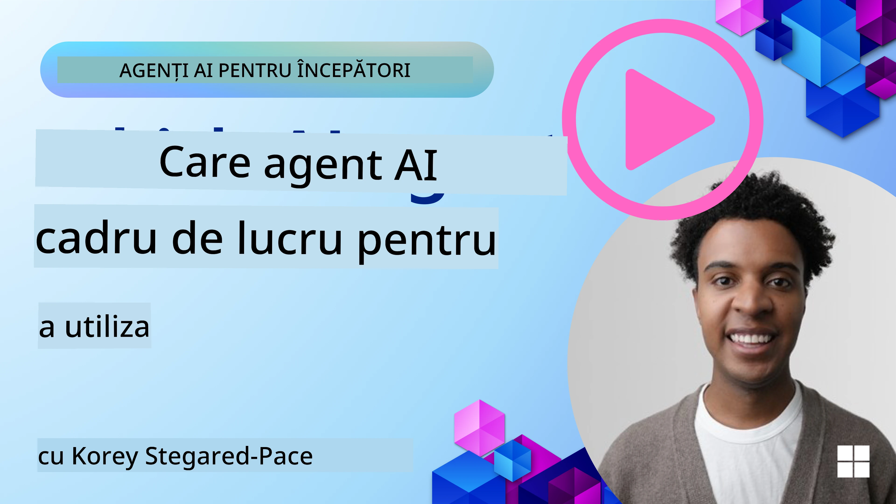

[](https://youtu.be/ODwF-EZo_O8?si=1xoy_B9RNQfrYdF7)

> _(Faceți clic pe imaginea de mai sus pentru a viziona videoclipul acestei lecții)_

# Explorează Cadrele pentru Agenți AI

Cadrele pentru agenți AI sunt platforme software concepute pentru a simplifica crearea, implementarea și gestionarea agenților AI. Aceste cadre oferă dezvoltatorilor componente predefinite, abstracții și instrumente care eficientizează dezvoltarea sistemelor AI complexe.

Aceste cadre ajută dezvoltatorii să se concentreze pe aspectele unice ale aplicațiilor lor, oferind abordări standardizate pentru provocările comune în dezvoltarea agenților AI. Ele îmbunătățesc scalabilitatea, accesibilitatea și eficiența în construirea sistemelor AI.

## Introducere

Această lecție va acoperi:

- Ce sunt Cadrele pentru Agenți AI și ce permit dezvoltatorilor să realizeze?
- Cum pot echipele să le utilizeze pentru a prototipa rapid, a itera și a îmbunătăți capacitățile agentului lor?
- Care sunt diferențele între cadrele și instrumentele create de Microsoft (<a href="https://aka.ms/ai-agents-beginners/ai-agent-service" target="_blank">Azure AI Agent Service</a> și <a href="https://learn.microsoft.com/azure/ai-services/openai/how-to/responses" target="_blank">Microsoft Agent Framework</a>)?
- Pot integra direct instrumentele existente din ecosistemul Azure sau am nevoie de soluții independente?
- Ce este serviciul Azure AI Agents și cum mă ajută acesta?

## Obiectivele învățării

Obiectivele acestei lecții sunt să te ajute să înțelegi:

- Rolul Cadrelor pentru Agenți AI în dezvoltarea AI.
- Cum să valorifici cadrul AI pentru a construi agenți inteligenți.
- Capacitățile cheie activate de cadrele pentru agenți AI.
- Diferențele dintre Microsoft Agent Framework și Azure AI Agent Service.

## Ce sunt Cadrele pentru Agenți AI și ce le permit dezvoltatorilor să facă?

Cadrele AI tradiționale te pot ajuta să integrezi AI în aplicațiile tale și să le îmbunătățești în următoarele moduri:

- **Personalizare**: AI poate analiza comportamentul și preferințele utilizatorului pentru a oferi recomandări, conținut și experiențe personalizate.  
Exemplu: Servicii de streaming precum Netflix folosesc AI pentru a sugera filme și emisiuni pe baza istoricului de vizionare, sporind angajamentul și satisfacția utilizatorilor.
- **Automatizare și eficiență**: AI poate automatiza sarcinile repetitive, optimiza fluxurile de lucru și îmbunătăți eficiența operațională.  
Exemplu: Aplicațiile de servicii clienți folosesc chatbots cu AI pentru a gestiona întrebările comune, reducând timpii de răspuns și eliberând agenții umani pentru probleme mai complexe.
- **Experiență utilizator îmbunătățită**: AI poate îmbunătăți experiența generală oferind funcții inteligente precum recunoașterea vocală, procesarea limbajului natural și text predictiv.  
Exemplu: Asistenți virtuali precum Siri și Google Assistant folosesc AI pentru a înțelege și răspunde comenzilor vocale, facilitând interacțiunea utilizatorilor cu dispozitivele lor.

### Sună toate grozav, nu-i așa? Atunci de ce avem nevoie de Cadre pentru Agenți AI?

Cadrele pentru agenți AI reprezintă mai mult decât cadre AI obișnuite. Ele sunt concepute pentru a permite crearea de agenți inteligenți care pot interacționa cu utilizatorii, alți agenți și mediul înconjurător pentru a atinge obiective specifice. Acești agenți pot manifesta comportament autonom, pot lua decizii și se pot adapta la condiții schimbătoare. Să analizăm unele capacități cheie activate de cadrele pentru agenți AI:

- **Colaborare și coordonare a agenților**: Permit crearea mai multor agenți AI care pot lucra împreună, comunica și coordona pentru a rezolva sarcini complexe.
- **Automatizarea și managementul sarcinilor**: Oferă mecanisme pentru automatizarea fluxurilor de lucru cu mai mulți pași, delegarea sarcinilor și gestionarea dinamică a acestora între agenți.
- **Înțelegerea contextuală și adaptarea**: Echiparea agenților cu abilitatea de a înțelege contextul, a se adapta la medii schimbătoare și a lua decizii bazate pe informații în timp real.

În rezumat, agenții îți permit să faci mai mult, să duci automatizarea la un nivel superior, să creezi sisteme mai inteligente capabile să se adapteze și să învețe din mediul înconjurător.

## Cum să prototipezi rapid, să iterezi și să îmbunătățești capacitățile agentului?

Este un domeniu în continuă mișcare, dar există câteva aspecte comune majorității Cadrelor pentru Agenți AI care te pot ajuta să prototipezi și să iterezi rapid, și anume componente modulare, instrumente colaborative și învățare în timp real. Să le explorăm:

- **Folosește componente modulare**: SDK-urile AI oferă componente predefinite precum conectori AI și de memorie, apelarea funcțiilor folosind limbaj natural sau plugin-uri de cod, șabloane de prompturi și altele.
- **Valorifică instrumentele colaborative**: Proiectează agenți cu roluri și sarcini specifice, permițând testarea și rafinarea fluxurilor colaborative.
- **Învață în timp real**: Implementează bucle de feedback în care agenții învață din interacțiuni și își ajustează comportamentul dinamic.

### Folosește componente modulare

SDK-uri precum Microsoft Agent Framework oferă componente predefinite, cum ar fi conectori AI, definiții de instrumente și managementul agenților.

**Cum pot folosi aceste componente echipele**: Echipele pot asambla rapid aceste componente pentru a crea un prototip funcțional fără a începe de la zero, permițând experimentare și iterare rapide.

**Cum funcționează în practică**: Poți folosi un parser predefinit pentru extragerea informațiilor din datele introduse de utilizator, un modul de memorie pentru a stoca și recupera date și un generator de prompturi pentru interacțiunea cu utilizatorii, toate fără să construiești aceste componente de la zero.

**Exemplu de cod**. Să analizăm un exemplu despre cum poți folosi Microsoft Agent Framework cu `AzureAIProjectAgentProvider` pentru ca modelul să răspundă la datele introduse de utilizator folosind apelarea de instrumente:

``` python
# Exemplu Microsoft Agent Framework în Python

import asyncio
import os
from typing import Annotated

from agent_framework.azure import AzureAIProjectAgentProvider
from azure.identity import AzureCliCredential


# Definirea unei funcții de instrument pentru rezervarea unei călătorii
def book_flight(date: str, location: str) -> str:
    """Book travel given location and date."""
    return f"Travel was booked to {location} on {date}"


async def main():
    provider = AzureAIProjectAgentProvider(credential=AzureCliCredential())
    agent = await provider.create_agent(
        name="travel_agent",
        instructions="Help the user book travel. Use the book_flight tool when ready.",
        tools=[book_flight],
    )

    response = await agent.run("I'd like to go to New York on January 1, 2025")
    print(response)
    # Exemplu de rezultat: Zborul dumneavoastră către New York pe 1 ianuarie 2025 a fost rezervat cu succes. Călătorie plăcută! ✈️🗽


if __name__ == "__main__":
    asyncio.run(main())
```
  
Din acest exemplu, poți observa cum poți valorifica un parser predefinit pentru a extrage informații cheie din datele introduse de utilizator, cum ar fi originea, destinația și data unei cereri de rezervare a unui zbor. Această abordare modulară te ajută să te concentrezi pe logica de nivel înalt.

### Valorifică instrumentele colaborative

Cadre precum Microsoft Agent Framework facilitează crearea a mai mulți agenți care pot colabora.

**Cum pot folosi aceste instrumente echipele**: Echipele pot proiecta agenți cu roluri și sarcini specifice, permițând testarea și rafinarea fluxurilor de lucru colaborative și îmbunătățind eficiența generală a sistemului.

**Cum funcționează în practică**: Poți crea o echipă de agenți, iar fiecare agent are o funcție specializată, cum ar fi colectarea datelor, analiza sau luarea deciziilor. Acești agenți pot comunica și partaja informații pentru a atinge un scop comun, precum răspunsul unei întrebări de utilizator sau finalizarea unei sarcini.

**Exemplu de cod (Microsoft Agent Framework)**:

```python
# Crearea mai multor agenți care lucrează împreună utilizând Microsoft Agent Framework

import os
from agent_framework.azure import AzureAIProjectAgentProvider
from azure.identity import AzureCliCredential

provider = AzureAIProjectAgentProvider(credential=AzureCliCredential())

# Agent de recuperare a datelor
agent_retrieve = await provider.create_agent(
    name="dataretrieval",
    instructions="Retrieve relevant data using available tools.",
    tools=[retrieve_tool],
)

# Agent de analiză a datelor
agent_analyze = await provider.create_agent(
    name="dataanalysis",
    instructions="Analyze the retrieved data and provide insights.",
    tools=[analyze_tool],
)

# Rulați agenții în secvență pentru o sarcină
retrieval_result = await agent_retrieve.run("Retrieve sales data for Q4")
analysis_result = await agent_analyze.run(f"Analyze this data: {retrieval_result}")
print(analysis_result)
```
  
În codul anterior vezi cum poți crea o sarcină ce implică mai mulți agenți colaborând pentru a analiza date. Fiecare agent îndeplinește o funcție specifică, iar sarcina este executată prin coordonarea agenților pentru a obține rezultatul dorit. Creând agenți dedicați cu roluri specializate, poți îmbunătăți eficiența și performanța sarcinii.

### Învață în timp real

Cadre avansate oferă capabilități pentru înțelegerea și adaptarea în timp real a contextului.

**Cum pot folosi aceste capabilități echipele**: Echipele pot implementa bucle de feedback în care agenții învață din interacțiuni și își ajustează comportamentul dinamic, conducând la îmbunătățiri continue și rafinamente ale capacităților.

**Cum funcționează în practică**: Agenții pot analiza feedback-ul utilizatorilor, datele de mediu și rezultatele sarcinilor pentru a-și actualiza baza de cunoștințe, a ajusta algoritmii de luare a deciziilor și a îmbunătăți performanța în timp. Acest proces iterativ de învățare le permite agenților să se adapteze la condiții și preferințe în schimbare, sporind eficacitatea sistemului.

## Care sunt diferențele între Microsoft Agent Framework și Azure AI Agent Service?

Există multe moduri de a compara aceste abordări, dar să vedem câteva diferențe cheie în termeni de design, capabilități și cazuri de utilizare țintă:

## Microsoft Agent Framework (MAF)

Microsoft Agent Framework oferă un SDK eficient pentru construirea agenților AI folosind `AzureAIProjectAgentProvider`. Permite dezvoltatorilor să creeze agenți care valorifică modelele Azure OpenAI, cu apelare integrată de instrumente, management al conversațiilor și securitate de nivel enterprise prin Azure identity.

**Cazuri de utilizare**: Construirea de agenți AI pregătiți pentru producție, cu utilizarea instrumentelor, fluxuri de lucru cu mai mulți pași și scenarii de integrare enterprise.

Iată câteva concepte importante în cadrul Microsoft Agent Framework:

- **Agenți**. Un agent este creat prin `AzureAIProjectAgentProvider` și configurat cu un nume, instrucțiuni și instrumente. Agentul poate:
  - **Procesa mesaje ale utilizatorilor** și genera răspunsuri folosind modele Azure OpenAI.
  - **Apela instrumente** automat în funcție de contextul conversației.
  - **Menține starea conversației** pe durata mai multor interacțiuni.

  Iată un fragment de cod care arată cum să creezi un agent:

    ```python
    import os
    from agent_framework.azure import AzureAIProjectAgentProvider
    from azure.identity import AzureCliCredential

    provider = AzureAIProjectAgentProvider(credential=AzureCliCredential())
    agent = await provider.create_agent(
        name="my_agent",
        instructions="You are a helpful assistant.",
    )

    response = await agent.run("Hello, World!")
    print(response)
    ```

- **Instrumente**. cadrul suportă definirea instrumentelor ca funcții Python pe care agentul le poate invoca automat. Instrumentele sunt înregistrate la crearea agentului:

    ```python
    def get_weather(location: str) -> str:
        """Get the current weather for a location."""
        return f"The weather in {location} is sunny, 72\u00b0F."

    agent = await provider.create_agent(
        name="weather_agent",
        instructions="Help users check the weather.",
        tools=[get_weather],
    )
    ```

- **Coordonare multi-agent**. Poți crea mai mulți agenți cu specializări diferite și să coordonezi activitatea lor:

    ```python
    planner = await provider.create_agent(
        name="planner",
        instructions="Break down complex tasks into steps.",
    )

    executor = await provider.create_agent(
        name="executor",
        instructions="Execute the planned steps using available tools.",
        tools=[execute_tool],
    )

    plan = await planner.run("Plan a trip to Paris")
    result = await executor.run(f"Execute this plan: {plan}")
    ```

- **Integrare Azure Identity**. cadrul folosește `AzureCliCredential` (sau `DefaultAzureCredential`) pentru autentificare sigură fără gestionarea directă a cheilor API.

## Azure AI Agent Service

Azure AI Agent Service este o adiție mai recentă, introdusă la Microsoft Ignite 2024. Permite dezvoltarea și implementarea agenților AI cu modele mai flexibile, cum ar fi apelarea directă a LLM-urilor open-source precum Llama 3, Mistral și Cohere.

Azure AI Agent Service oferă mecanisme de securitate enterprise mai puternice și metode de stocare a datelor, făcându-l potrivit pentru aplicații enterprise.

Funcționează din cutie cu Microsoft Agent Framework pentru construirea și implementarea agenților.

Acest serviciu este în prezent în Public Preview și suportă Python și C# pentru construirea agenților.

Folosind SDK-ul Python Azure AI Agent Service, putem crea un agent cu un instrument definit de utilizator:

```python
import asyncio
from azure.identity import DefaultAzureCredential
from azure.ai.projects import AIProjectClient

# Definirea funcțiilor de instrumente
def get_specials() -> str:
    """Provides a list of specials from the menu."""
    return """
    Special Soup: Clam Chowder
    Special Salad: Cobb Salad
    Special Drink: Chai Tea
    """

def get_item_price(menu_item: str) -> str:
    """Provides the price of the requested menu item."""
    return "$9.99"


async def main() -> None:
    credential = DefaultAzureCredential()
    project_client = AIProjectClient.from_connection_string(
        credential=credential,
        conn_str="your-connection-string",
    )

    agent = project_client.agents.create_agent(
        model="gpt-4o-mini",
        name="Host",
        instructions="Answer questions about the menu.",
        tools=[get_specials, get_item_price],
    )

    thread = project_client.agents.create_thread()

    user_inputs = [
        "Hello",
        "What is the special soup?",
        "How much does that cost?",
        "Thank you",
    ]

    for user_input in user_inputs:
        print(f"# User: '{user_input}'")
        message = project_client.agents.create_message(
            thread_id=thread.id,
            role="user",
            content=user_input,
        )
        run = project_client.agents.create_and_process_run(
            thread_id=thread.id, agent_id=agent.id
        )
        messages = project_client.agents.list_messages(thread_id=thread.id)
        print(f"# Agent: {messages.data[0].content[0].text.value}")


if __name__ == "__main__":
    asyncio.run(main())
```

### Concepte de bază

Azure AI Agent Service are următoarele concepte fundamentale:

- **Agent**. Azure AI Agent Service se integrează cu Microsoft Foundry. În cadrul AI Foundry, un agent AI acționează ca un microserviciu „inteligent” care poate răspunde la întrebări (RAG), executa acțiuni sau automatiza complet fluxuri de lucru. Realizează acest lucru prin combinarea puterii modelelor generative AI cu instrumente care îi permit să acceseze și să interacționeze cu surse de date reale. Iată un exemplu de agent:

    ```python
    agent = project_client.agents.create_agent(
        model="gpt-4o-mini",
        name="my-agent",
        instructions="You are helpful agent",
        tools=code_interpreter.definitions,
        tool_resources=code_interpreter.resources,
    )
    ```
  
    În acest exemplu, un agent este creat cu modelul `gpt-4o-mini`, numele `my-agent` și instrucțiunile `You are helpful agent`. Agentul este echipat cu instrumente și resurse pentru a efectua sarcini de interpretare a codului.

- **Thread și mesaje**. Thread-ul este un alt concept important. El reprezintă o conversație sau interacțiune între un agent și un utilizator. Thread-urile pot fi folosite pentru a urmări progresul unei conversații, a stoca informații contextuale și a gestiona starea interacțiunii. Iată un exemplu de thread:

    ```python
    thread = project_client.agents.create_thread()
    message = project_client.agents.create_message(
        thread_id=thread.id,
        role="user",
        content="Could you please create a bar chart for the operating profit using the following data and provide the file to me? Company A: $1.2 million, Company B: $2.5 million, Company C: $3.0 million, Company D: $1.8 million",
    )
    
    # Cere agentului să efectueze lucrul pe fir
    run = project_client.agents.create_and_process_run(thread_id=thread.id, agent_id=agent.id)
    
    # Preia și înregistrează toate mesajele pentru a vedea răspunsul agentului
    messages = project_client.agents.list_messages(thread_id=thread.id)
    print(f"Messages: {messages}")
    ```
  
    În codul precedent, este creat un thread. Ulterior, un mesaj este trimis către thread. Prin apelarea funcției `create_and_process_run`, agentul este solicitat să lucreze pe thread. În final, mesajele sunt preluate și înregistrate pentru a vedea răspunsul agentului. Mesajele indică progresul conversației dintre utilizator și agent. Este important să înțelegem că mesajele pot fi de tipuri diferite, cum ar fi text, imagine sau fișier, adică munca agentului a rezultat, de exemplu, într-o imagine sau un răspuns textual. Ca dezvoltator, poți folosi aceste informații pentru a procesa mai departe răspunsul sau a-l prezenta utilizatorului.

- **Integrare cu Microsoft Agent Framework**. Azure AI Agent Service funcționează perfect cu Microsoft Agent Framework, ceea ce înseamnă că poți construi agenți folosind `AzureAIProjectAgentProvider` și să-i implementezi prin Agent Service pentru scenarii de producție.

**Cazuri de utilizare**: Azure AI Agent Service este conceput pentru aplicații enterprise care necesită implementare sigură, scalabilă și flexibilă a agenților AI.

## Care este diferența între aceste abordări?

Se poate observa o oarecare suprapunere, dar există diferențe cheie în design, capabilități și cazuri de utilizare:

- **Microsoft Agent Framework (MAF)**: SDK gata de producție pentru a construi agenți AI. Oferă o API simplificată pentru crearea agenților cu apelare de instrumente, management de conversații și integrare Azure identity.
- **Azure AI Agent Service**: Platformă și serviciu de implementare în Azure Foundry pentru agenți. Oferă conectivitate integrată la servicii precum Azure OpenAI, Azure AI Search, Bing Search și execuția codului.

Încă nu ești sigur ce să alegi?

### Cazuri de utilizare

Să vedem dacă te putem ajuta parcurgând câteva cazuri comune de utilizare:

> Î: Construiesc aplicații de agenți AI pentru producție și vreau să încep rapid  
>
> R: Microsoft Agent Framework este o alegere excelentă. Oferă o API simplă, pythonică, prin `AzureAIProjectAgentProvider`, care îți permite să definești agenți cu instrumente și instrucțiuni în câteva linii de cod.

> Î: Am nevoie de implementare enterprise cu integrare Azure precum Search și execuție de cod  
>  
> R: Azure AI Agent Service este cea mai bună opțiune. Este un serviciu de platformă care oferă capacități integrate pentru multiple modele, Azure AI Search, Bing Search și Azure Functions. Îți permite să construiești agenții în Foundry Portal și să-i implementezi la scară mare.

> Î: Sunt încă confuz, dă-mi o singură opțiune  
>  
> R: Începe cu Microsoft Agent Framework pentru a-ți construi agenții, apoi folosește Azure AI Agent Service când trebuie să-i implementezi și să-i scalezi în producție. Această abordare îți permite să iterezi rapid asupra logicii agentului, având totodată o cale clară către implementarea enterprise.

Să rezumăm diferențele cheie într-un tabel:

| Cadrul | Focalizare | Concepte de bază | Cazuri de utilizare |
| --- | --- | --- | --- |
| Microsoft Agent Framework | SDK eficient pentru agenți cu apelare instrumente | Agenți, Instrumente, Azure Identity | Construirea agenților AI, utilizarea instrumentelor, fluxuri multi-pas |
| Azure AI Agent Service | Modele flexibile, securitate enterprise, generare cod, apelare instrumente | Modularitate, Colaborare, Orchestrarea proceselor | Implementare sigură, scalabilă și flexibilă a agenților AI |

## Pot integra direct instrumentele existente din ecosistemul Azure, sau am nevoie de soluții independente?
Răspunsul este da, puteți integra instrumentele existente din ecosistemul Azure direct cu Azure AI Agent Service, mai ales că a fost creat pentru a funcționa perfect cu alte servicii Azure. De exemplu, ați putea integra Bing, Azure AI Search și Azure Functions. Există, de asemenea, o integrare profundă cu Microsoft Foundry.

Microsoft Agent Framework se integrează, de asemenea, cu serviciile Azure prin `AzureAIProjectAgentProvider` și identitatea Azure, permițându-vă să apelați serviciile Azure direct din instrumentele agentului dumneavoastră.

## Sample Codes

- Python: [Agent Framework](./code_samples/02-python-agent-framework.ipynb)
- .NET: [Agent Framework](./code_samples/02-dotnet-agent-framework.md)

## Got More Questions about AI Agent Frameworks?

Join the [Microsoft Foundry Discord](https://discord.com/invite/ATgtXmAS5D) to meet with other learners, attend office hours and get your AI Agents questions answered.

## References

- <a href="https://techcommunity.microsoft.com/blog/azure-ai-services-blog/introducing-azure-ai-agent-service/4298357" target="_blank">Azure Agent Service</a>
- <a href="https://learn.microsoft.com/azure/ai-services/openai/how-to/responses" target="_blank">Microsoft Agent Framework - Azure OpenAI Responses</a>
- <a href="https://learn.microsoft.com/azure/ai-services/agents/overview" target="_blank">Azure AI Agent service</a>

## Previous Lesson

[Introduction to AI Agents and Agent Use Cases](../01-intro-to-ai-agents/README.md)

## Next Lesson

[Understanding Agentic Design Patterns](../03-agentic-design-patterns/README.md)

---

<!-- CO-OP TRANSLATOR DISCLAIMER START -->
**Declinare a responsabilității**:
Acest document a fost tradus folosind serviciul de traducere AI [Co-op Translator](https://github.com/Azure/co-op-translator). În timp ce ne străduim pentru acuratețe, vă rugăm să rețineți că traducerile automate pot conține erori sau inexactități. Documentul original în limba sa nativă trebuie considerat sursa autorizată. Pentru informații critice, se recomandă traducerea profesională realizată de un om. Nu ne asumăm responsabilitatea pentru eventualele neînțelegeri sau interpretări greșite care decurg din utilizarea acestei traduceri.
<!-- CO-OP TRANSLATOR DISCLAIMER END -->