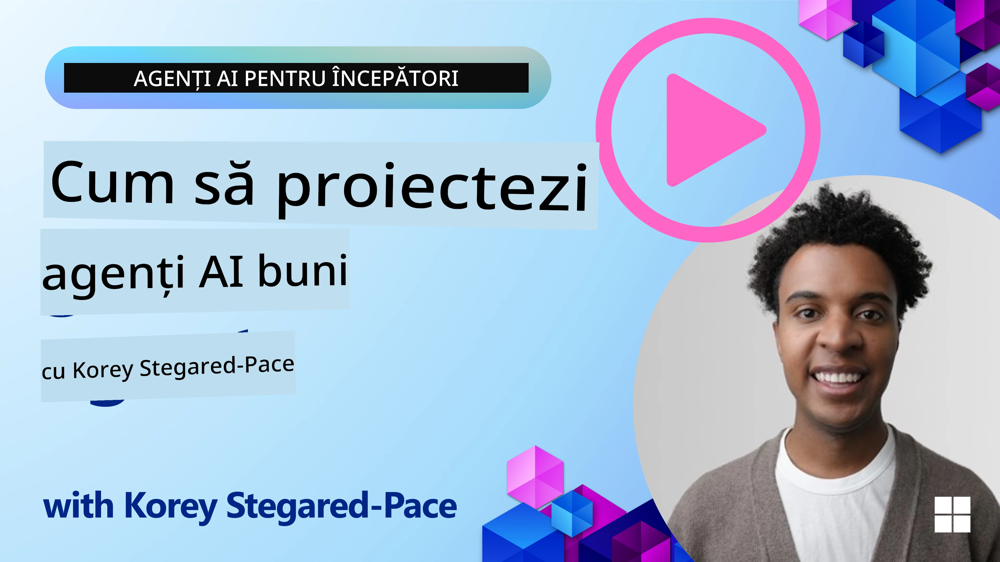
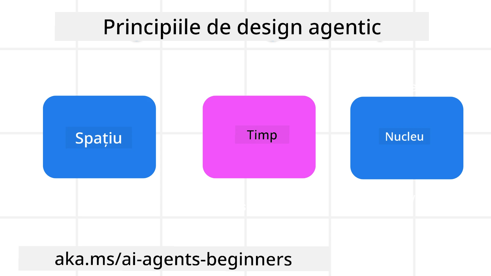

> _(Faceți clic pe imaginea de mai sus pentru a viziona videoclipul acestei lecții)_
# Principiile Designului Agenților AI

## Introducere

Există multe moduri de a aborda construirea sistemelor agentice AI. Având în vedere că ambiguitatea este o caracteristică și nu o eroare în designul AI generativ, este uneori dificil pentru ingineri să decidă de unde să înceapă. Am creat un set de principii de design UX centrate pe om pentru a permite dezvoltatorilor să construiască sisteme agentice centrate pe client pentru a rezolva nevoile lor de afaceri. Aceste principii de design nu reprezintă o arhitectură prescrisă, ci mai degrabă un punct de plecare pentru echipele care definesc și dezvoltă experiențe agentice.

În general, agenții ar trebui:

- Să lărgească și să extindă capacitățile umane (brainstorming, rezolvarea problemelor, automatizare etc.)
- Să umple golurile de cunoștințe (să mă pună la curent cu domenii de cunoștințe, traduceri etc.)
- Să faciliteze și să susțină colaborarea în modurile în care noi, ca indivizi, preferăm să lucrăm cu alții
- Să ne facă versiuni mai bune ale noastre înșine (de exemplu, antrenor de viață/maestru de sarcini, ajutându-ne să învățăm reglarea emoțională și abilități de mindfulness, să construim reziliență etc.)

## Această lecție va acoperi

- Care sunt principiile de design agentic
- Care sunt unele ghiduri de urmat în implementarea acestor principii de design
- Care sunt câteva exemple de utilizare a principiilor de design

## Obiective de învățare

După ce veți finaliza această lecție, veți putea să:

1. Explicați ce sunt principiile de design agentic
2. Explicați ghidurile pentru utilizarea principiilor de design agentic
3. Înțelegeți cum să construiți un agent folosind principiile de design agentic

## Principiile de Design Agentic

### Agent (Spațiu)

Acesta este mediul în care agentul operează. Aceste principii informează modul în care proiectăm agenții pentru a se angaja în lumi fizice și digitale.

- **Conectare, nu colapsare** – ajută la conectarea oamenilor cu alți oameni, evenimente și cunoștințe acționabile pentru a facilita colaborarea și conexiunea.
- Agenții ajută la conectarea evenimentelor, cunoștințelor și oamenilor.
- Agenții aduc oamenii mai aproape unii de alții. Nu sunt proiectați să înlocuiască sau să minimalizeze oamenii.
- **Ușor accesibil, dar ocazional invizibil** – agentul operează în mare parte în fundal și ne atenționează doar atunci când este relevant și potrivit.
  - Agentul este ușor de descoperit și accesibil pentru utilizatorii autorizați pe orice dispozitiv sau platformă.
  - Agentul suportă intrări și ieșiri multimodale (sunet, voce, text etc.).
  - Agentul poate tranziționa fluent între prim-plan și fundal; între proactiv și reactiv, în funcție de percepția nevoilor utilizatorului.
  - Agentul poate opera într-o formă invizibilă, totuși traseul său de procesare în fundal și colaborarea cu alți agenți este transparentă și controlabilă de către utilizator.

### Agent (Timp)

Aceasta este modul în care agentul operează în timp. Aceste principii informează modul în care proiectăm agenții care interacționează cu trecutul, prezentul și viitorul.

- **Trecut**: Reflectarea asupra istoriei care include atât starea, cât și contextul.
  - Agentul oferă rezultate mai relevante bazate pe analiza unor date istorice mai bogate, nu doar asupra evenimentului, oamenilor sau stărilor.
  - Agentul creează conexiuni din evenimentele trecute și reflectă activ asupra memoriei pentru a se angaja în situații curente.
- **Acum**: Atenționând mai mult decât doar notificând.
  - Agentul întruchipează o abordare cuprinzătoare pentru interacțiunea cu oamenii. Când se întâmplă un eveniment, agentul depășește notificarea statică sau altă formalitate statică. Agentul poate simplifica fluxurile sau genera dinamic indicii pentru a direcționa atenția utilizatorului în momentul potrivit.
  - Agentul transmite informații bazate pe mediul contextual, schimbările sociale și culturale și adaptate intenției utilizatorului.
  - Interacțiunea cu agentul poate fi graduală, evoluând/creșterea în complexitate pentru a împuternici utilizatorii pe termen lung.
- **Viitor**: Adaptare și evoluție.
  - Agentul se adaptează la diverse dispozitive, platforme și modalități.
  - Agentul se adaptează la comportamentul utilizatorului, nevoile de accesibilitate și este liber personalizabil.
  - Agentul este modelat și evoluează prin interacțiuni continue cu utilizatorul.

### Agent (Nucleu)

Acestea sunt elementele cheie din nucleul designului unui agent.

- **Îmbrățișați incertitudinea, dar stabiliți încredere**.
  - Un anumit nivel de incertitudine a agentului este de așteptat. Incertitudinea este un element cheie al designului agentului.
  - Încrederea și transparența sunt straturi fundamentale ale designului agentului.
  - Oamenii controlează când agentul este pornit/oprit și starea agentului este vizibilă clar în orice moment.

## Ghidurile pentru implementarea acestor principii

Când utilizați principiile de design de mai sus, folosiți următoarele ghiduri:

1. **Transparență**: Informați utilizatorul că AI este implicat, cum funcționează (inclusiv acțiunile trecute) și cum să ofere feedback și să modifice sistemul.
2. **Control**: Permiteți utilizatorului să personalizeze, să specifice preferințe și să personalizeze, și să aibă control asupra sistemului și a atributelor sale (inclusiv posibilitatea de a uita).
3. **Consistență**: Țintiți experiențe consistente, multimodale, pe dispozitive și puncte finale. Folosiți elemente UI/UX familiare unde este posibil (de ex., pictograma microfonului pentru interacțiunea vocală) și reduceți pe cât posibil sarcina cognitivă a clientului (de ex., răspunsuri concise, ajutoare vizuale și conținut „Află mai multe”).

## Cum să proiectați un agent de călătorii folosind aceste principii și ghiduri

Imaginați-vă că proiectați un agent de călătorii, iată cum ați putea gândi utilizarea principiilor și ghidurilor de design:

1. **Transparență** – Permiteți utilizatorului să știe că agentul de călătorii este un agent activat AI. Oferiți niște instrucțiuni de bază pentru a începe (de ex., un mesaj „Bună”, prompturi exemplu). Documentați clar acest lucru pe pagina produsului. Arătați lista prompturilor puse anterior de utilizator. Faceți clar cum se oferă feedback (aprecieri pozitive și negative, buton de trimitere feedback etc.). Menționați clar dacă agentul are restricții de utilizare sau teme.
2. **Control** – Asigurați-vă că este clar cum utilizatorul poate modifica agentul după ce a fost creat cu elemente precum System Prompt. Permiteți utilizatorului să aleagă cât de detaliat este agentul, stilul său de scriere și orice avertismente despre ceea ce agentul nu ar trebui să discute. Permiteți utilizatorului să vizualizeze și să șteargă orice fișiere, date, prompturi și conversații anterioare asociate.
3. **Consistență** – Asigurați-vă că pictogramele pentru Share Prompt, adăugarea unui fișier sau fotografii și etichetarea cuiva sau ceva sunt standard și recunoscute. Folosiți pictograma agrafă de hârtie pentru a indica încărcarea/partajarea fișierelor cu agentul și o pictogramă imaginii pentru încărcarea graficelor.

## Coduri Exemplu

- Python: [Agent Framework](./code_samples/03-python-agent-framework.ipynb)
- .NET: [Agent Framework](./code_samples/03-dotnet-agent-framework.md)

## Aveți mai multe întrebări despre modele agentice AI?

Alăturați-vă [Microsoft Foundry Discord](https://discord.com/invite/ATgtXmAS5D) pentru a întâlni alți cursanți, a participa la orele de consultații și a primi răspunsuri la întrebările legate de agenții AI.

## Resurse suplimentare

- <a href="https://openai.com" target="_blank">Practici pentru guvernarea sistemelor AI agentice | OpenAI</a>
- <a href="https://microsoft.com" target="_blank">Proiectul HAX Toolkit - Microsoft Research</a>
- <a href="https://responsibleaitoolbox.ai" target="_blank">Cutia de unelte Responsible AI</a>

## Lecția anterioară

[Explorarea Framework-urilor Agentice](../02-explore-agentic-frameworks/README.md)

## Lecția următoare

[Modelul de Design Tool Use](../04-tool-use/README.md)

---

<!-- CO-OP TRANSLATOR DISCLAIMER START -->
**Declinare a responsabilității**:
Acest document a fost tradus folosind serviciul de traducere AI [Co-op Translator](https://github.com/Azure/co-op-translator). În timp ce ne străduim pentru acuratețe, vă rugăm să rețineți că traducerile automate pot conține erori sau inexactități. Documentul original în limba sa nativă trebuie considerat sursa autorizată. Pentru informații critice, se recomandă traducerea profesională realizată de un om. Nu ne asumăm responsabilitatea pentru eventualele neînțelegeri sau interpretări greșite care decurg din utilizarea acestei traduceri.
<!-- CO-OP TRANSLATOR DISCLAIMER END -->