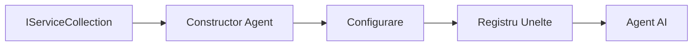

# 🎨 Modele Agentice de Proiectare cu Azure OpenAI (Responses API) (.NET)

## 📋 Obiective de Învațare

Acest exemplu demonstrează modele de proiectare de nivel enterprise pentru construirea agenților inteligenți folosind Microsoft Agent Framework în .NET cu integrarea Azure OpenAI (Responses API). Veți învăța modele profesionale și abordări arhitecturale care fac agenții gata pentru producție, ușor de întreținut și scalabili.

### Modele de Proiectare Enterprise

- 🏭 **Modelul Factory**: Crearea standardizată a agenților cu injecție de dependență
- 🔧 **Modelul Builder**: Configurare și setare fluentă a agenților
- 🧵 **Modele Thread-Safe**: Gestionarea conversațiilor concurente
- 📋 **Modelul Repository**: Gestionarea organizată a uneltelor și capabilităților

## 🎯 Beneficii Arhitecturale Specifice .NET

### Funcționalități Enterprise

- **Tipare stricte**: Validare la compilare și suport IntelliSense
- **Injecție de Dependență**: Integrare container DI încorporat
- **Gestionarea Configurațiilor**: Modele IConfiguration și Options
- **Async/Await**: Suport de programare asincronă de prima clasă

### Modele Gata pentru Producție

- **Integrare Logging**: Suport ILogger și logare structurată
- **Verificări de Sănătate**: Monitorizare și diagnoză încorporată
- **Validarea Configurației**: Tipare stricte cu anotații de date
- **Gestionarea Erorilor**: Management structurat al excepțiilor

## 🔧 Arhitectură Tehnică

### Componente de Bază .NET

- **Microsoft.Extensions.AI**: Abstracții unificate pentru servicii AI
- **Microsoft.Agents.AI**: Framework de orchestrare a agenților enterprise
- **Azure OpenAI (Responses API)**: Modele de client API performante
- **Sistem de Configurație**: appsettings.json și integrare de mediu

### Implementarea Modelului de Proiectare



## 🏗️ Modele Enterprise Demonstrate

### 1. **Modele Creationale**

- **Agent Factory**: Crearea centralizată a agenților cu configurație consistentă
- **Modelul Builder**: API fluent pentru configurarea complexă a agenților
- **Modelul Singleton**: Resurse partajate și gestionarea configurației
- **Injecția de Dependență**: Cuplare redusă și testabilitate

### 2. **Modele Behavioral**

- **Modelul Strategy**: Strategii intercambiabile de execuție a uneltelor
- **Modelul Command**: Operațiuni ale agentului încapsulate cu undo/redo
- **Modelul Observer**: Management orientat pe evenimente al ciclului de viață al agentului
- **Modelul Template Method**: Fluxuri de execuție standardizate ale agenților

### 3. **Modele Structurale**

- **Modelul Adapter**: Strat de integrare Azure OpenAI (Responses API)
- **Modelul Decorator**: Îmbunătățirea capabilităților agentului
- **Modelul Facade**: Interfețe simplificate pentru interacțiunea agentului
- **Modelul Proxy**: Încărcare lazy și caching pentru performanță

## 📚 Principii de Proiectare .NET

### Principiile SOLID

- **Responsabilitate Unică**: Fiecare componentă are un scop clar
- **Deschis/Închis**: Extensibil fără modificări
- **Substituția Liskov**: Implementări de unealtă bazate pe interfețe
- **Segregarea Interfeței**: Interfețe focalizate și coezive
- **Inversiunea Dependențelor**: Dependență de abstracții, nu de concreții

### Arhitectură Curată

- **Strat Domeniu**: Abstracții de bază pentru agenți și unelte
- **Strat Aplicație**: Orchestrare agenți și fluxuri de lucru
- **Strat Infrastructură**: Integrare Azure OpenAI (Responses API) și servicii externe
- **Strat Prezentare**: Interacțiunea utilizatorului și formatarea răspunsului

## 🔒 Considerații Enterprise

### Securitate

- **Gestionarea Credencialelor**: Manipulare sigură a cheilor API cu IConfiguration
- **Validarea Inputului**: Tipare stricte și validare cu anotații de date
- **Sanitizarea Outputului**: Procesare și filtrare securizată a răspunsurilor
- **Audit Logging**: Urmărire completă a operațiunilor

### Performanță

- **Modele Async**: Operațiuni I/O non-blocante
- **Pooling de Conexiuni**: Gestionarea eficientă a clientului HTTP
- **Caching**: Stocare în cache a răspunsurilor pentru performanță crescută
- **Gestionarea Resurselor**: Modele corecte de eliberare și curățare

### Scalabilitate

- **Siguranța pe Thread**: Suport pentru execuție concurentă a agenților
- **Pooling-ul Resurselor**: Utilizare eficientă a resurselor
- **Gestionarea Sarcinii**: Limitarea ratei și gestionarea presiunii înapoi
- **Monitorizare**: Măsurarea performanței și verificări de sănătate

## 🚀 Implementare în Producție

- **Gestionarea Configurației**: Setări specifice mediului
- **Strategia de Logging**: Logare structurată cu ID-uri de corelare
- **Gestionarea Erorilor**: Tratare globală a excepțiilor cu recuperare adecvată
- **Monitorizare**: Application insights și contoare de performanță
- **Testare**: Teste unitare, teste de integrare și modele de testare la încărcare

Pregătit să construiești agenți inteligenți de nivel enterprise cu .NET? Să proiectăm ceva robust! 🏢✨

## 🚀 Începutul

### Cerințe Prealabile

- [SDK .NET 10](https://dotnet.microsoft.com/download/dotnet/10.0) sau versiune superioară
- Un [abonament Azure](https://azure.microsoft.com/free/) cu o resursă Azure OpenAI și o implementare model
- [Azure CLI](https://learn.microsoft.com/cli/azure/install-azure-cli) — autentificare cu `az login`

### Variabile de Mediu Necesare

```bash
# zsh/bash
export AZURE_OPENAI_ENDPOINT=https://<your-resource>.openai.azure.com
export AZURE_OPENAI_DEPLOYMENT=gpt-4o-mini
# Apoi autentifică-te pentru ca AzureCliCredential să poată obține un token
az login
```

```powershell
# PowerShell
$env:AZURE_OPENAI_ENDPOINT = "https://<your-resource>.openai.azure.com"
$env:AZURE_OPENAI_DEPLOYMENT = "gpt-4o-mini"
# Apoi autentificați-vă pentru ca AzureCliCredential să poată obține un token
az login
```

### Cod Exemplu

Pentru a rula exemplul de cod,

```bash
# zsh/bash
chmod +x ./03-dotnet-agent-framework.cs
./03-dotnet-agent-framework.cs
```

Sau folosind CLI dotnet:

```bash
dotnet run ./03-dotnet-agent-framework.cs
```

Vezi [`03-dotnet-agent-framework.cs`](../../../../03-agentic-design-patterns/code_samples/03-dotnet-agent-framework.cs) pentru codul complet.

```csharp
#!/usr/bin/dotnet run

#:package Microsoft.Extensions.AI@10.*
#:package Microsoft.Agents.AI.OpenAI@1.*-*
#:package Azure.AI.OpenAI@2.1.0
#:package Azure.Identity@1.13.1

using System.ComponentModel;

using Microsoft.Agents.AI;
using Microsoft.Extensions.AI;

using Azure.AI.OpenAI;
using Azure.Identity;

// Tool Function: Random Destination Generator
// This static method will be available to the agent as a callable tool
// The [Description] attribute helps the AI understand when to use this function
// This demonstrates how to create custom tools for AI agents
[Description("Provides a random vacation destination.")]
static string GetRandomDestination()
{
    // List of popular vacation destinations around the world
    // The agent will randomly select from these options
    var destinations = new List<string>
    {
        "Paris, France",
        "Tokyo, Japan",
        "New York City, USA",
        "Sydney, Australia",
        "Rome, Italy",
        "Barcelona, Spain",
        "Cape Town, South Africa",
        "Rio de Janeiro, Brazil",
        "Bangkok, Thailand",
        "Vancouver, Canada"
    };

    // Generate random index and return selected destination
    // Uses System.Random for simple random selection
    var random = new Random();
    int index = random.Next(destinations.Count);
    return destinations[index];
}

// Azure OpenAI with the Responses API (stable v1 endpoint). Sign in with `az login`.
var azureEndpoint = Environment.GetEnvironmentVariable("AZURE_OPENAI_ENDPOINT")
    ?? throw new InvalidOperationException("AZURE_OPENAI_ENDPOINT is not set.");
var deployment = Environment.GetEnvironmentVariable("AZURE_OPENAI_DEPLOYMENT") ?? "gpt-4o-mini";

var azureClient = new AzureOpenAIClient(new Uri(azureEndpoint), new AzureCliCredential());

// Define Agent Identity and Comprehensive Instructions
// Agent name for identification and logging purposes
var AGENT_NAME = "TravelAgent";

// Detailed instructions that define the agent's personality, capabilities, and behavior
// This system prompt shapes how the agent responds and interacts with users
var AGENT_INSTRUCTIONS = """
You are a helpful AI Agent that can help plan vacations for customers.

Important: When users specify a destination, always plan for that location. Only suggest random destinations when the user hasn't specified a preference.

When the conversation begins, introduce yourself with this message:
"Hello! I'm your TravelAgent assistant. I can help plan vacations and suggest interesting destinations for you. Here are some things you can ask me:
1. Plan a day trip to a specific location
2. Suggest a random vacation destination
3. Find destinations with specific features (beaches, mountains, historical sites, etc.)
4. Plan an alternative trip if you don't like my first suggestion

What kind of trip would you like me to help you plan today?"

Always prioritize user preferences. If they mention a specific destination like "Bali" or "Paris," focus your planning on that location rather than suggesting alternatives.
""";

// Create AI Agent with Advanced Travel Planning Capabilities
// Get the Responses client for the deployment and create the AI agent
// Configure agent with name, detailed instructions, and available tools
// This demonstrates the .NET agent creation pattern with full configuration
AIAgent agent = azureClient
    .GetOpenAIResponseClient(deployment)
    .CreateAIAgent(
        name: AGENT_NAME,
        instructions: AGENT_INSTRUCTIONS,
        tools: [AIFunctionFactory.Create(GetRandomDestination)]
    );

// Create New Conversation Thread for Context Management
// Initialize a new conversation thread to maintain context across multiple interactions
// Threads enable the agent to remember previous exchanges and maintain conversational state
// This is essential for multi-turn conversations and contextual understanding
AgentThread thread = agent.GetNewThread();

// Execute Agent: First Travel Planning Request
// Run the agent with an initial request that will likely trigger the random destination tool
// The agent will analyze the request, use the GetRandomDestination tool, and create an itinerary
// Using the thread parameter maintains conversation context for subsequent interactions
await foreach (var update in agent.RunStreamingAsync("Plan me a day trip", thread))
{
    await Task.Delay(10);
    Console.Write(update);
}

Console.WriteLine();

// Execute Agent: Follow-up Request with Context Awareness
// Demonstrate contextual conversation by referencing the previous response
// The agent remembers the previous destination suggestion and will provide an alternative
// This showcases the power of conversation threads and contextual understanding in .NET agents
await foreach (var update in agent.RunStreamingAsync("I don't like that destination. Plan me another vacation.", thread))
{
    await Task.Delay(10);
    Console.Write(update);
}
```

---

<!-- CO-OP TRANSLATOR DISCLAIMER START -->
**Declinare a responsabilității**:
Acest document a fost tradus folosind serviciul de traducere AI [Co-op Translator](https://github.com/Azure/co-op-translator). În timp ce ne străduim pentru acuratețe, vă rugăm să rețineți că traducerile automate pot conține erori sau inexactități. Documentul original în limba sa nativă trebuie considerat sursa autorizată. Pentru informații critice, se recomandă traducerea profesională realizată de un om. Nu ne asumăm responsabilitatea pentru eventualele neînțelegeri sau interpretări greșite care decurg din utilizarea acestei traduceri.
<!-- CO-OP TRANSLATOR DISCLAIMER END -->