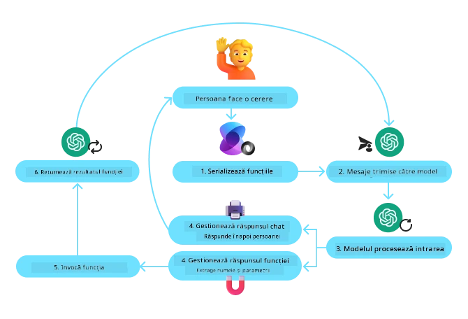
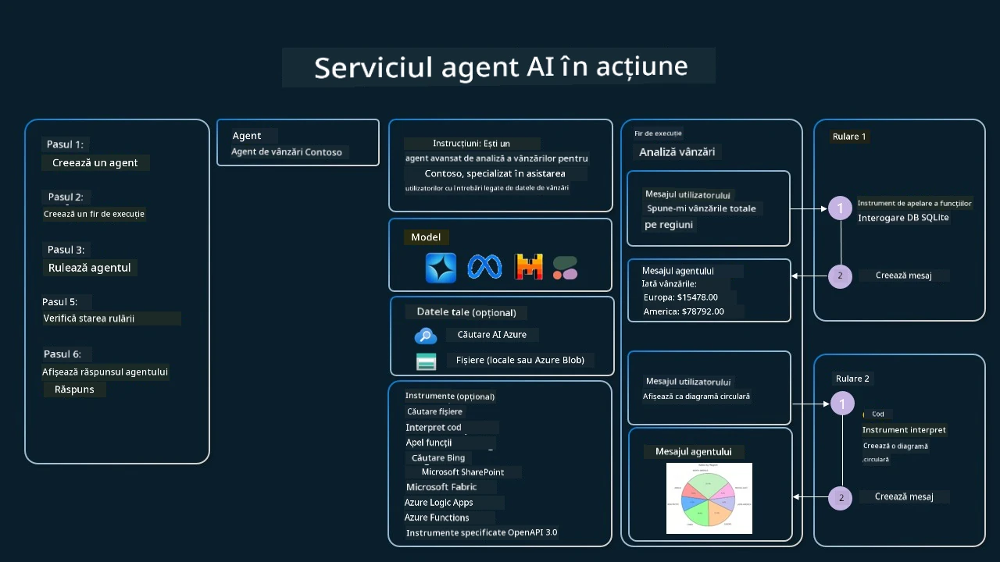

[](https://youtu.be/vieRiPRx-gI?si=cEZ8ApnT6Sus9rhn)

> _(Faceți clic pe imaginea de mai sus pentru a viziona videoclipul acestei lecții)_

# Tiparul de utilizare a uneltelor

Uneltele sunt interesante deoarece permit agenților AI să aibă un set mai larg de capabilități. În loc ca agentul să aibă un set limitat de acțiuni pe care le poate executa, prin adăugarea unei unelte, agentul poate acum să execute o gamă largă de acțiuni. În acest capitol, vom analiza Tiparul de utilizare a uneltelor, care descrie modul în care agenții AI pot folosi unelte specifice pentru a-și atinge obiectivele.

## Introducere

În această lecție, încercăm să răspundem la următoarele întrebări:

- Ce este tiparul de utilizare a uneltelor?
- Pentru ce cazuri de utilizare poate fi aplicat?
- Care sunt elementele/blocurile de construcție necesare pentru a implementa tiparul de proiectare?
- Care sunt considerațiile speciale pentru utilizarea Tiparului de utilizare a uneltelor pentru a construi agenți AI de încredere?

## Obiective de învățare

După finalizarea acestei lecții, veți putea:

- Defini Tiparul de utilizare a uneltelor și scopul său.
- Identifica cazuri de utilizare în care Tiparul de utilizare a uneltelor este aplicabil.
- Înțelege elementele cheie necesare pentru a implementa tiparul de proiectare.
- Recunoaște considerațiile pentru asigurarea încrederii în agenții AI care folosesc acest tipar de proiectare.

## Ce este Tiparul de utilizare a uneltelor?

Tiparul de utilizare a uneltelor se concentrează pe oferirea LLM-urilor a capacității de a interacționa cu unelte externe pentru a atinge obiective specifice. Uneltele sunt cod care poate fi executat de un agent pentru a efectua acțiuni. O unealtă poate fi o funcție simplă, precum un calculator, sau un apel de API către un serviciu terț, cum ar fi consultarea prețului acțiunilor sau prognoza meteo. În contextul agenților AI, uneltele sunt concepute pentru a fi executate de agenți ca răspuns la **apeluri de funcții generate de model**.

## La ce cazuri de utilizare poate fi aplicat?

Agenții AI pot folosi unelte pentru a îndeplini sarcini complexe, a recupera informații sau a lua decizii. Tiparul de utilizare a uneltelor este folosit adesea în scenarii care necesită interacțiune dinamică cu sisteme externe, cum ar fi baze de date, servicii web sau interpretoare de cod. Această capacitate este utilă pentru o serie de cazuri de utilizare diferite, inclusiv:

- **Recuperare dinamică a informațiilor:** Agenții pot interoga API-uri externe sau baze de date pentru a obține date actualizate (de ex., interogarea unei baze de date SQLite pentru analiză de date, consultarea prețurilor acțiunilor sau a informațiilor meteo).
- **Executarea și interpretarea codului:** Agenții pot executa cod sau scripturi pentru a rezolva probleme matematice, a genera rapoarte sau a efectua simulări.
- **Automatizarea fluxurilor de lucru:** Automatizarea sarcinilor repetitive sau a fluxurilor de lucru în mai mulți pași prin integrarea uneltelor precum programe de planificare a sarcinilor, servicii de e-mail sau pipeline-uri de date.
- **Asistență pentru clienți:** Agenții pot interacționa cu sisteme CRM, platforme de ticketing sau baze de cunoștințe pentru a rezolva cererile utilizatorilor.
- **Generare și editare de conținut:** Agenții pot folosi unelte precum verificatoare gramaticale, rezumatoare de text sau evaluatori de siguranță a conținutului pentru a asista la sarcinile de creare a conținutului.

## Care sunt elementele/blocurile de construcție necesare pentru a implementa tiparul de utilizare a uneltelor?

Aceste blocuri de construcție permit agentului AI să execute o gamă largă de sarcini. Să analizăm elementele cheie necesare pentru a implementa Tiparul de utilizare a uneltelor:

- **Scheme de Functii/Unelte**: Definiții detaliate ale uneltelor disponibile, incluzând numele funcției, scopul, parametrii necesari și rezultatele așteptate. Aceste scheme permit LLM-ului să înțeleagă ce unelte sunt disponibile și cum să construiască cereri valide.

- **Logică de execuție a funcțiilor**: Guvernează modul și momentul în care uneltele sunt invocate în funcție de intenția utilizatorului și de contextul conversației. Aceasta poate include module de planificare, mecanisme de rutare sau fluxuri condiționale care determină utilizarea uneltelor dinamic.

- **Sistem de gestionare a mesajelor**: Componente care gestionează fluxul conversațional între intrările utilizatorului, răspunsurile LLM, apelurile către unelte și rezultatele uneltelor.

- **Cadru de integrare a uneltelor**: Infrastructura care conectează agentul la diverse unelte, fie că sunt funcții simple sau servicii externe complexe.

- **Gestionarea erorilor și validarea**: Mecanisme pentru a gestiona eșecurile în execuția uneltelor, a valida parametrii și a gestiona răspunsurile neașteptate.

- **Gestionarea stării**: Urmărește contextul conversației, interacțiunile anterioare cu uneltele și datele persistente pentru a asigura consistența pe parcursul interacțiunilor multi-turn.

În continuare, să analizăm Apelarea Funțiilor/Uneltelor în mai multă detaliu.
 
### Apelarea funcțiilor/uneltelor

Apelarea funcțiilor este modalitatea principală prin care permitem Modelelor Lingvistice Mari (LLM) să interacționeze cu uneltele. Veți vedea adesea termenii 'Funcție' și 'Unealtă' folosiți interschimbabil deoarece 'funcțiile' (blocuri de cod reutilizabile) sunt 'uneltele' pe care agenții le folosesc pentru a îndeplini sarcini. Pentru ca codul unei funcții să fie invocat, un LLM trebuie să compare solicitarea utilizatorului cu descrierea funcțiilor. Pentru a face acest lucru, se trimite către LLM o schemă care conține descrierile tuturor funcțiilor disponibile. LLM-ul selectează apoi funcția cea mai potrivită pentru sarcină și returnează numele și argumentele acesteia. Funcția selectată este invocată, răspunsul său este trimis înapoi la LLM, care folosește informația pentru a răspunde cererii utilizatorului.

Pentru ca dezvoltatorii să implementeze apelarea funcțiilor pentru agenți, veți avea nevoie de:

1. Un model LLM care suportă apelarea funcțiilor
2. O schemă care conține descrierile funcțiilor
3. Codul pentru fiecare funcție descrisă

Să folosim exemplul obținerii orei curente într-un oraș pentru a ilustra:

1. **Inițializați un LLM care suportă apelarea funcțiilor:**

    Nu toate modelele suportă apelarea funcțiilor, așa că este important să verificați dacă LLM-ul pe care îl utilizați o suportă.     <a href="https://learn.microsoft.com/azure/ai-services/openai/how-to/function-calling" target="_blank">Azure OpenAI</a> suportă apelarea funcțiilor. Putem începe prin a iniția clientul Azure OpenAI. 

    ```python
    # Inițializează clientul Azure OpenAI
    client = AzureOpenAI(
        azure_endpoint = os.getenv("AZURE_AI_PROJECT_ENDPOINT"), 
        api_key=os.getenv("AZURE_OPENAI_API_KEY"),  
        api_version="2024-05-01-preview"
    )
    ```

1. **Creați o schemă de funcție**:

    Următorul pas este să definim o schemă JSON care conține numele funcției, descrierea a ceea ce face funcția și numele și descrierile parametrilor funcției.
    Apoi vom lua această schemă și o vom transmite clientului creat anterior, împreună cu solicitarea utilizatorului de a afla ora în San Francisco. Ceea ce este important de remarcat este că un **apel către o unealtă** este ceea ce este returnat, **nu** răspunsul final la întrebare. După cum s-a menționat mai devreme, LLM-ul returnează numele funcției pe care a selectat-o pentru sarcină și argumentele care îi vor fi transmise.

    ```python
    # Descrierea funcției pentru ca modelul să o citească
    tools = [
        {
            "type": "function",
            "function": {
                "name": "get_current_time",
                "description": "Get the current time in a given location",
                "parameters": {
                    "type": "object",
                    "properties": {
                        "location": {
                            "type": "string",
                            "description": "The city name, e.g. San Francisco",
                        },
                    },
                    "required": ["location"],
                },
            }
        }
    ]
    ```
   
    ```python
  
    # Mesaj inițial al utilizatorului
    messages = [{"role": "user", "content": "What's the current time in San Francisco"}] 
  
    # Primul apel API: Cere modelului să folosească funcția
      response = client.chat.completions.create(
          model=deployment_name,
          messages=messages,
          tools=tools,
          tool_choice="auto",
      )
  
      # Procesează răspunsul modelului
      response_message = response.choices[0].message
      messages.append(response_message)
  
      print("Model's response:")  

      print(response_message)
  
    ```

    ```bash
    Model's response:
    ChatCompletionMessage(content=None, role='assistant', function_call=None, tool_calls=[ChatCompletionMessageToolCall(id='call_pOsKdUlqvdyttYB67MOj434b', function=Function(arguments='{"location":"San Francisco"}', name='get_current_time'), type='function')])
    ```
  
1. **Codul funcției necesar pentru îndeplinirea sarcinii:**

    Acum că LLM-ul a ales ce funcție trebuie rulate, codul care îndeplinește sarcina trebuie implementat și executat.
    Putem implementa codul pentru a obține ora curentă în Python. De asemenea, va trebui să scriem codul pentru a extrage numele și argumentele din response_message pentru a obține rezultatul final.

    ```python
      def get_current_time(location):
        """Get the current time for a given location"""
        print(f"get_current_time called with location: {location}")  
        location_lower = location.lower()
        
        for key, timezone in TIMEZONE_DATA.items():
            if key in location_lower:
                print(f"Timezone found for {key}")  
                current_time = datetime.now(ZoneInfo(timezone)).strftime("%I:%M %p")
                return json.dumps({
                    "location": location,
                    "current_time": current_time
                })
      
        print(f"No timezone data found for {location_lower}")  
        return json.dumps({"location": location, "current_time": "unknown"})
    ```

     ```python
     # Gestionarea apelurilor de funcții
      if response_message.tool_calls:
          for tool_call in response_message.tool_calls:
              if tool_call.function.name == "get_current_time":
     
                  function_args = json.loads(tool_call.function.arguments)
     
                  time_response = get_current_time(
                      location=function_args.get("location")
                  )
     
                  messages.append({
                      "tool_call_id": tool_call.id,
                      "role": "tool",
                      "name": "get_current_time",
                      "content": time_response,
                  })
      else:
          print("No tool calls were made by the model.")  
  
      # Al doilea apel API: Obțineți răspunsul final de la model
      final_response = client.chat.completions.create(
          model=deployment_name,
          messages=messages,
      )
  
      return final_response.choices[0].message.content
     ```

     ```bash
      get_current_time called with location: San Francisco
      Timezone found for san francisco
      The current time in San Francisco is 09:24 AM.
     ```

Apelarea funcțiilor este în centrul majorității, dacă nu al tuturor, proiectărilor de utilizare a uneltelor pentru agenți, însă implementarea acesteia de la zero poate fi uneori provocatoare.
Așa cum am învățat în [Lecția 2](../../../02-explore-agentic-frameworks), cadrele agentice ne oferă blocuri de construcție predefinite pentru a implementa utilizarea uneltelor.
 
## Exemple de utilizare a uneltelor cu cadre agentice

Iată câteva exemple despre cum puteți implementa Tiparul de utilizare a uneltelor folosind diferite cadre agentice:

### Microsoft Agent Framework

<a href="https://learn.microsoft.com/azure/ai-services/agents/overview" target="_blank">Microsoft Agent Framework</a> este un cadru AI open-source pentru construirea agenților AI. Simplifică procesul de utilizare a apelării funcțiilor permițându-vă să definiți uneltele ca funcții Python cu decoratorul `@tool`. Cadrul gestionează comunicarea dus-întors dintre model și codul dvs. De asemenea, oferă acces la unelte predefinite precum File Search și Code Interpreter prin `AzureAIProjectAgentProvider`.

Diagrama următoare ilustrează procesul de apelare a funcțiilor cu Microsoft Agent Framework:



În Microsoft Agent Framework, uneltele sunt definite ca funcții decorate. Putem converti funcția `get_current_time` pe care am văzut-o mai devreme într-o unealtă folosind decoratorul `@tool`. Cadrul va serializa automat funcția și parametrii acesteia, creând schema care va fi trimisă către LLM.

```python
from agent_framework import tool
from agent_framework.azure import AzureAIProjectAgentProvider
from azure.identity import AzureCliCredential

@tool
def get_current_time(location: str) -> str:
    """Get the current time for a given location"""
    ...

# Creează clientul
provider = AzureAIProjectAgentProvider(credential=AzureCliCredential())

# Creează un agent și rulează-l cu instrumentul
agent = await provider.create_agent(name="TimeAgent", instructions="Use available tools to answer questions.", tools=get_current_time)
response = await agent.run("What time is it?")
```
  
### Azure AI Agent Service

<a href="https://learn.microsoft.com/azure/ai-services/agents/overview" target="_blank">Azure AI Agent Service</a> este un cadru agentic mai nou, conceput pentru a permite dezvoltatorilor să construiască, să implementeze și să scaleze în mod sigur agenți AI extensibili și de înaltă calitate fără a trebui să gestioneze resursele de calcul și stocare subiacente. Este deosebit de util pentru aplicațiile enterprise, deoarece este un serviciu complet gestionat, cu securitate la nivel enterprise.

În comparație cu dezvoltarea directă cu API-ul LLM, Azure AI Agent Service oferă unele avantaje, inclusiv:

- Apelare automată a uneltelor – nu este nevoie să analizați un apel către o unealtă, să invocați unealta și să gestionați răspunsul; toate acestea sunt acum realizate server-side
- Date gestionate în siguranță – în loc să vă gestionați propria stare a conversației, vă puteți baza pe threads pentru a stoca toate informațiile de care aveți nevoie
- Unelte gata de utilizare – unelte pe care le puteți folosi pentru a interacționa cu sursele dvs. de date, cum ar fi Bing, Azure AI Search și Azure Functions.

Uneltele disponibile în Azure AI Agent Service pot fi împărțite în două categorii:

1. Unelte de cunoaștere:
    - <a href="https://learn.microsoft.com/azure/ai-services/agents/how-to/tools/bing-grounding?tabs=python&pivots=overview" target="_blank">Grounding with Bing Search</a>
    - <a href="https://learn.microsoft.com/azure/ai-services/agents/how-to/tools/file-search?tabs=python&pivots=overview" target="_blank">File Search</a>
    - <a href="https://learn.microsoft.com/azure/ai-services/agents/how-to/tools/azure-ai-search?tabs=azurecli%2Cpython&pivots=overview-azure-ai-search" target="_blank">Azure AI Search</a>

2. Unelte de acțiune:
    - <a href="https://learn.microsoft.com/azure/ai-services/agents/how-to/tools/function-calling?tabs=python&pivots=overview" target="_blank">Function Calling</a>
    - <a href="https://learn.microsoft.com/azure/ai-services/agents/how-to/tools/code-interpreter?tabs=python&pivots=overview" target="_blank">Code Interpreter</a>
    - <a href="https://learn.microsoft.com/azure/ai-services/agents/how-to/tools/openapi-spec?tabs=python&pivots=overview" target="_blank">OpenAPI defined tools</a>
    - <a href="https://learn.microsoft.com/azure/ai-services/agents/how-to/tools/azure-functions?pivots=overview" target="_blank">Azure Functions</a>

Agent Service ne permite să folosim aceste unelte împreună ca un `toolset`. De asemenea, utilizează `threads` care păstrează istoricul mesajelor dintr-o conversație particulară.

Imaginați-vă că sunteți un agent de vânzări într-o companie numită Contoso. Doriți să dezvoltați un agent conversațional care poate răspunde la întrebări despre datele dvs. de vânzări.

Imaginea următoare ilustrează cum ați putea folosi Azure AI Agent Service pentru a analiza datele de vânzări:



Pentru a folosi oricare dintre aceste unelte cu serviciul, putem crea un client și defini o unealtă sau un toolset. Pentru a implementa aceasta practic, putem folosi următorul cod Python. LLM-ul va putea să examineze toolset-ul și să decidă dacă să folosească funcția creată de utilizator, `fetch_sales_data_using_sqlite_query`, sau Code Interpreter-ul predefinit în funcție de solicitarea utilizatorului.

```python 
import os
from azure.ai.projects import AIProjectClient
from azure.identity import DefaultAzureCredential
from fetch_sales_data_functions import fetch_sales_data_using_sqlite_query # funcția fetch_sales_data_using_sqlite_query care poate fi găsită într-un fișier fetch_sales_data_functions.py.
from azure.ai.projects.models import ToolSet, FunctionTool, CodeInterpreterTool

project_client = AIProjectClient.from_connection_string(
    credential=DefaultAzureCredential(),
    conn_str=os.environ["PROJECT_CONNECTION_STRING"],
)

# Inițializează setul de instrumente
toolset = ToolSet()

# Inițializează agentul de apelare a funcțiilor cu funcția fetch_sales_data_using_sqlite_query și îl adaugă în setul de instrumente
fetch_data_function = FunctionTool(fetch_sales_data_using_sqlite_query)
toolset.add(fetch_data_function)

# Inițializează instrumentul Code Interpreter și îl adaugă în setul de instrumente.
code_interpreter = code_interpreter = CodeInterpreterTool()
toolset.add(code_interpreter)

agent = project_client.agents.create_agent(
    model="gpt-4o-mini", name="my-agent", instructions="You are helpful agent", 
    toolset=toolset
)
```

## Care sunt considerațiile speciale pentru utilizarea Tiparului de utilizare a uneltelor pentru a construi agenți AI de încredere?

O preocupare comună legată de SQL generat dinamic de LLM-uri este securitatea, în special riscul de SQL injection sau acțiuni malițioase, cum ar fi ștergerea sau manipularea bazei de date. Deși aceste preocupări sunt valabile, ele pot fi atenuate eficient prin configurarea corectă a permisiunilor de acces la baza de date. Pentru majoritatea bazelor de date, acest lucru implică configurarea bazei de date ca read-only. Pentru servicii de baze de date precum PostgreSQL sau Azure SQL, aplicației ar trebui să i se atribuie un rol read-only (SELECT).

Executarea aplicației într-un mediu securizat îmbunătățește în continuare protecția. În scenariile enterprise, datele sunt, de obicei, extrase și transformate din sistemele operaționale într-o bază de date read-only sau într-un depozit de date cu un schemă prietenoasă pentru utilizator. Această abordare asigură că datele sunt securizate, optimizate pentru performanță și accesibilitate și că aplicația are acces restricționat, doar în citire.

## Exemple de cod

- Python: [Agent Framework](./code_samples/04-python-agent-framework.ipynb)
- .NET: [Agent Framework](./code_samples/04-dotnet-agent-framework.md)

## Aveți mai multe întrebări despre Tiparele de utilizare a uneltelor?

Alăturați-vă [Microsoft Foundry Discord](https://aka.ms/ai-agents/discord) pentru a întâlni alți cursanți, a participa la ore de consultanță și a obține răspunsuri la întrebările dvs. despre agenți AI.

## Resurse suplimentare

- <a href="https://microsoft.github.io/build-your-first-agent-with-azure-ai-agent-service-workshop/" target="_blank">Azure AI Agents Service Workshop</a>
- <a href="https://github.com/Azure-Samples/contoso-creative-writer/tree/main/docs/workshop" target="_blank">Contoso Creative Writer Multi-Agent Workshop</a>
- <a href="https://learn.microsoft.com/azure/ai-services/agents/overview" target="_blank">Microsoft Agent Framework Overview</a>

## Lecția anterioară

[Înțelegerea tiparelor de proiectare agentică](../03-agentic-design-patterns/README.md)

## Lecția următoare
[Agențial RAG](../05-agentic-rag/README.md)

---

<!-- CO-OP TRANSLATOR DISCLAIMER START -->
Declinare de responsabilitate:
Acest document a fost tradus folosind serviciul de traducere AI Co-op Translator (https://github.com/Azure/co-op-translator). Deși ne străduim pentru acuratețe, vă rugăm să aveți în vedere că traducerile automate pot conține erori sau inexactități. Documentul original, în limba sa nativă, trebuie considerat sursa autorizată. Pentru informații critice se recomandă o traducere profesională realizată de un traducător uman. Nu ne asumăm răspunderea pentru eventuale neînțelegeri sau interpretări greșite care rezultă din utilizarea acestei traduceri.
<!-- CO-OP TRANSLATOR DISCLAIMER END -->