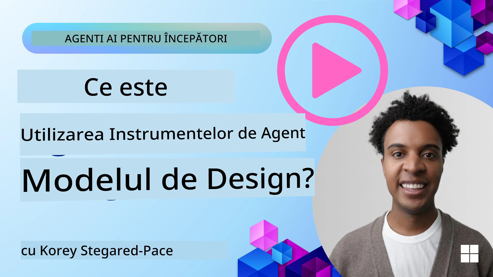
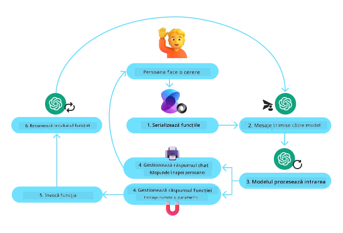
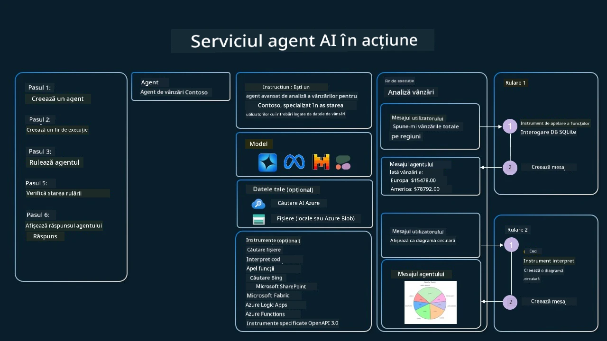

[](https://youtu.be/vieRiPRx-gI?si=cEZ8ApnT6Sus9rhn)

> _(Faceți clic pe imaginea de mai sus pentru a viziona video-ul acestei lecții)_

# Pattern-ul de Design pentru Utilizarea Uneltelor

Uneltele sunt interesante deoarece permit agenților AI să aibă o gamă mai largă de capacități. În loc ca agentul să aibă un set limitat de acțiuni pe care le poate executa, prin adăugarea unei unelte, agentul poate acum să efectueze o gamă largă de acțiuni. În acest capitol, vom analiza Pattern-ul de Design pentru Utilizarea Uneltelor, care descrie cum agenții AI pot folosi unelte specifice pentru a-și atinge scopurile.

## Introducere

În această lecție, ne propunem să răspundem următoarelor întrebări:

- Ce este pattern-ul de design pentru utilizarea uneltelor?
- Care sunt cazurile de utilizare în care se poate aplica?
- Care sunt elementele/blocurile de bază necesare pentru implementarea pattern-ului de design?
- Care sunt considerațiile speciale pentru utilizarea Pattern-ului de Design al Utilizării Uneltelor în construirea agenților AI de încredere?

## Obiective de Învățare

După ce finalizați această lecție, veți putea:

- Definiți Pattern-ul de Design pentru Utilizarea Uneltelor și scopul său.
- Identificați cazuri de utilizare în care pattern-ul este aplicabil.
- Să înțelegeți elementele cheie necesare pentru implementarea pattern-ului de design.
- Recunoașteți considerațiile pentru asigurarea încrederii în agenții AI care folosesc acest pattern de design.

## Ce este Pattern-ul de Design pentru Utilizarea Uneltelor?

**Pattern-ul de Design pentru Utilizarea Uneltelor** se concentrează pe oferirea modelelor lingvistice mari (LLM) a capacității de a interacționa cu unelte externe pentru a atinge scopuri specifice. Uneltele sunt cod care poate fi executat de un agent pentru a efectua acțiuni. O unealtă poate fi o funcție simplă, cum ar fi un calculator, sau un apel API către un serviciu terț, cum ar fi verificarea prețului acțiunilor sau prognoza meteo. În contextul agenților AI, uneltele sunt proiectate să fie executate de agenți ca răspuns la **apeluri de funcție generate de model**.

## Care sunt cazurile de utilizare în care se poate aplica?

Agenții AI pot folosi unelte pentru a îndeplini sarcini complexe, a recupera informații sau a lua decizii. Pattern-ul de design al utilizării uneltelor este adesea folosit în scenarii care necesită interacțiune dinamică cu sisteme externe, cum ar fi baze de date, servicii web sau interpretoare de cod. Această abilitate este utilă pentru o serie de cazuri de utilizare diferite, inclusiv:

- **Recuperare Dinamică a Informațiilor:** Agenții pot interoga API-uri externe sau baze de date pentru a obține date actualizate (de exemplu, interogarea unei baze de date SQLite pentru analiza datelor, obținerea prețurilor acțiunilor sau informații meteo).
- **Executarea și Interpretarea Codului:** Agenții pot executa cod sau scripturi pentru a rezolva probleme matematice, genera rapoarte sau efectua simulări.
- **Automatizarea Fluxurilor de Lucru:** Automatizarea fluxurilor repetitive sau cu mai mulți pași prin integrarea unor unelte precum planificatoare de sarcini, servicii de email sau fluxuri de date.
- **Suport pentru Clienți:** Agenții pot interacționa cu sisteme CRM, platforme de ticketing sau baze de cunoștințe pentru a rezolva întrebările utilizatorilor.
- **Generare și Editare Conținut:** Agenții pot folosi unelte precum verificatoare gramaticale, sumarizatoare de text sau evaluatori de siguranță a conținutului pentru a ajuta în sarcinile de creare a conținutului.

## Care sunt elementele/blocurile de bază necesare pentru implementarea pattern-ului de design pentru utilizarea uneltelor?

Aceste blocuri de bază permit agentului AI să realizeze o gamă largă de sarcini. Haideți să examinăm elementele cheie necesare pentru implementarea Pattern-ului de Design pentru Utilizarea Uneltelor:

- **Schemele Funcțiilor/Uneltelor:** Definiții detaliate ale uneltelor disponibile, inclusiv numele funcției, scopul, parametrii necesari și rezultatele așteptate. Aceste scheme permit LLM-ului să înțeleagă ce unelte sunt disponibile și cum să construiască cereri valide.

- **Logica Executării Funcțiilor:** Guvernează cum și când sunt invocate uneltele pe baza intenției utilizatorului și contextului conversației. Aceasta poate include module de planificare, mecanisme de rutare sau fluxuri condiționale care determină dinamica utilizării uneltelor.

- **Sistemul de Gestionare a Mesajelor:** Componente care gestionează fluxul conversațional între intrările utilizatorului, răspunsurile LLM, apelurile funcțiilor și rezultatele uneltelor.

- **Cadru de Integrare a Uneltelor:** Infrastructura care conectează agentul la diverse unelte, fie că sunt funcții simple sau servicii externe complexe.

- **Gestionarea Erorilor și Validarea:** Mecanisme pentru a gestiona eșecurile în execuția uneltelor, a valida parametrii și a gestiona răspunsuri neașteptate.

- **Gestionarea Stării:** Urmărește contextul conversației, interacțiunile anterioare cu uneltele și datele persistente pentru a asigura consistența în interacțiunile pe mai multe tururi.

Următorul pas este să analizăm în detaliu Apelarea Funcțiilor/Uneltelor.
 
### Apelarea Funcțiilor/Uneltelor

Apelarea funcțiilor este modalitatea principală prin care facem posibilă interacțiunea modelelor lingvistice mari (LLM) cu uneltele. De multe ori veți vedea termenii 'Funcție' și 'Unealtă' folosiți interschimbabil deoarece 'funcțiile' (blocuri de cod reutilizabile) sunt 'uneltele' pe care agenții le folosesc pentru a îndeplini sarcini. Pentru ca codul unei funcții să fie invocat, un LLM trebuie să compare cererea utilizatorului cu descrierea funcției. Pentru aceasta, se trimite către LLM o schemă care conține descrierile tuturor funcțiilor disponibile. LLM-ul selectează apoi cea mai potrivită funcție pentru sarcină și returnează numele și argumentele acesteia. Funcția selectată este invocată, răspunsul său este trimis înapoi către LLM, care folosește informația pentru a răspunde cererii utilizatorului.

Dezvoltatorii care doresc să implementeze apelarea funcțiilor pentru agenți vor avea nevoie de:

1. Un model LLM care suportă apelarea funcțiilor
2. O schemă care conține descrierile funcțiilor
3. Codul pentru fiecare funcție descrisă

Să folosim exemplul obținerii orei curente într-un oraș pentru a ilustra:

1. **Inițializați un LLM care suportă apelarea funcțiilor:**

    Nu toate modelele suportă apelarea funcțiilor, deci este important să verificați dacă LLM-ul pe care îl folosiți face acest lucru. <a href="https://learn.microsoft.com/azure/ai-services/openai/how-to/function-calling" target="_blank">Azure OpenAI</a> suportă apelarea funcțiilor. Putem începe prin inițializarea clientului OpenAI împotriva API-ului **Responses** Azure OpenAI (endpoint-ul stabil `/openai/v1/` — nu este nevoie de `api_version`).

    ```python
    # Inițializează clientul OpenAI pentru Azure OpenAI (API Răspunsuri, endpoint v1)
    client = OpenAI(
        base_url=f"{os.environ['AZURE_OPENAI_ENDPOINT'].rstrip('/')}/openai/v1/",
        api_key=os.environ["AZURE_OPENAI_API_KEY"],
    )
    deployment_name = os.environ["AZURE_OPENAI_DEPLOYMENT"]
    ```

1. **Creați o schemă pentru funcție:**

    Următorul pas este să definim o schemă JSON care conține numele funcției, descrierea a ceea ce face funcția și numele și descrierile parametrilor funcției.
    Apoi vom transmite această schemă clientului creat anterior, împreună cu cererea utilizatorului de a afla ora în San Francisco. Ce este important de remarcat este că **un apel de unealtă** este ceea ce se întoarce, **nu** răspunsul final la întrebare. După cum am menționat, LLM-ul întoarce numele funcției pe care a selectat-o pentru sarcină și argumentele care vor fi transmise acesteia.

    ```python
    # Descrierea funcției pentru ca modelul să citească (format instrument plat API Răspunsuri)
    tools = [
        {
            "type": "function",
            "name": "get_current_time",
            "description": "Get the current time in a given location",
            "parameters": {
                "type": "object",
                "properties": {
                    "location": {
                        "type": "string",
                        "description": "The city name, e.g. San Francisco",
                    },
                },
                "required": ["location"],
            },
        }
    ]
    ```
   
    ```python
  
    # Mesajul inițial al utilizatorului
    messages = [{"role": "user", "content": "What's the current time in San Francisco"}]

    # Prima apelare API: Cere modelului să utilizeze funcția
    response = client.responses.create(
        model=deployment_name,
        input=messages,
        tools=tools,
        tool_choice="auto",
        store=False,
    )

    # API-ul Responses returnează apeluri ale instrumentelor ca elemente function_call în response.output.
    # Adaugă-le la conversație pentru ca modelul să aibă context complet la următorul pas.
    messages += response.output

    print("Model's response:")
    print(response.output)
  
    ```

    ```bash
    Model's response:
    [ResponseFunctionToolCall(arguments='{"location":"San Francisco"}', call_id='call_pOsKdUlqvdyttYB67MOj434b', name='get_current_time', type='function_call')]
    ```
  
1. **Codul funcției necesar pentru a îndeplini sarcina:**

    Acum că LLM a ales ce funcție trebuie să ruleze, codul care execută sarcina trebuie implementat și executat.
    Putem implementa codul în Python pentru a obține ora curentă. De asemenea, va fi necesar să scriem codul pentru a extrage numele și argumentele din response_message pentru a obține rezultatul final.

    ```python
      def get_current_time(location):
        """Get the current time for a given location"""
        print(f"get_current_time called with location: {location}")  
        location_lower = location.lower()
        
        for key, timezone in TIMEZONE_DATA.items():
            if key in location_lower:
                print(f"Timezone found for {key}")  
                current_time = datetime.now(ZoneInfo(timezone)).strftime("%I:%M %p")
                return json.dumps({
                    "location": location,
                    "current_time": current_time
                })
      
        print(f"No timezone data found for {location_lower}")  
        return json.dumps({"location": location, "current_time": "unknown"})
    ```

     ```python
    # Gestionează apelurile funcției
    tool_calls = [item for item in response.output if item.type == "function_call"]
    if tool_calls:
        for tool_call in tool_calls:
            if tool_call.name == "get_current_time":

                function_args = json.loads(tool_call.arguments)

                time_response = get_current_time(
                    location=function_args.get("location")
                )

                # Returnează rezultatul instrumentului ca un element function_call_output
                messages.append({
                    "type": "function_call_output",
                    "call_id": tool_call.call_id,
                    "output": time_response,
                })
    else:
        print("No tool calls were made by the model.")

    # Al doilea apel API: Obține răspunsul final de la model
    final_response = client.responses.create(
        model=deployment_name,
        input=messages,
        tools=tools,
        store=False,
    )

    return final_response.output_text
     ```

     ```bash
      get_current_time called with location: San Francisco
      Timezone found for san francisco
      The current time in San Francisco is 09:24 AM.
     ```

Apelarea funcțiilor este inima majorității, dacă nu a tuturor, design-urilor pentru utilizarea uneltelor de către agenți, însă implementarea acesteia de la zero poate fi uneori provocatoare.
După cum am învățat în [Lecția 2](../../../02-explore-agentic-frameworks), cadrele agentice ne oferă blocuri de construcție predefinite pentru a implementa utilizarea uneltelor.
 
## Exemple de utilizare a uneltelor cu cadre agentice

Iată câteva exemple de cum puteți implementa Pattern-ul de Design pentru Utilizarea Uneltelor folosind diferite cadre agentice:

### Microsoft Agent Framework

<a href="https://learn.microsoft.com/azure/ai-services/agents/overview" target="_blank">Microsoft Agent Framework</a> este un cadru AI open-source pentru construirea de agenți AI. Simplifică procesul de utilizare a apelării funcțiilor permițându-vă să definiți uneltele ca funcții Python cu decorarea `@tool`. Cadrul gestionează comunicația dus-întors dintre model și codul dvs. De asemenea, oferă acces la unelte pre-construite, precum Căutare de Fișiere și Interpreter de Cod prin `FoundryChatClient`.

Diagrama următoare ilustrează procesul de apelare a funcțiilor cu Microsoft Agent Framework:



În Microsoft Agent Framework, uneltele sunt definite ca funcții decorate. Putem converti funcția `get_current_time` pe care am văzut-o anterior într-o unealtă folosind decoratorul `@tool`. Cadrul va serializa automat funcția și parametrii săi, creând schema pentru a fi trimisă la LLM.

```python
import os
from agent_framework import tool
from agent_framework.foundry import FoundryChatClient
from azure.identity import AzureCliCredential

@tool(approval_mode="never_require")
def get_current_time(location: str) -> str:
    """Get the current time for a given location"""
    ...

# Creează clientul
provider = FoundryChatClient(
    project_endpoint=os.environ["AZURE_AI_PROJECT_ENDPOINT"],
    model=os.environ["AZURE_AI_MODEL_DEPLOYMENT_NAME"],
    credential=AzureCliCredential(),
)

# Creează un agent și rulează cu instrumentul
agent = provider.as_agent(name="TimeAgent", instructions="Use available tools to answer questions.", tools=get_current_time)
response = await agent.run("What time is it?")
```
  
### Microsoft Foundry Agent Service

<a href="https://learn.microsoft.com/azure/ai-services/agents/overview" target="_blank">Microsoft Foundry Agent Service</a> este un cadru agentic mai nou, conceput să ofere dezvoltatorilor puterea de a crea, implementa și scala agenți AI de înaltă calitate și extensibili în mod sigur, fără a fi nevoie să gestioneze resursele de calcul și stocare subiacente. Este util în mod special pentru aplicații enterprise deoarece este un serviciu complet gestionat cu securitate de nivel enterprise.

Comparativ cu dezvoltarea directă folosind API-ul LLM, Microsoft Foundry Agent Service oferă câteva avantaje, inclusiv:

- Apelarea automată a uneltelor – nu este nevoie să parsezi un apel de unealtă, să invoci unealta și să gestionezi răspunsul; toate acestea se fac acum pe server
- Gestionarea securizată a datelor – în loc să gestionezi propria stare a conversației, poți să te bazezi pe threads pentru a stoca toate informațiile necesare
- Unelte gata de utilizare – Unelte pe care le poți folosi pentru a interacționa cu sursele tale de date, cum ar fi Bing, Azure AI Search și Azure Functions.

Uneltele disponibile în Microsoft Foundry Agent Service pot fi împărțite în două categorii:

1. Unelte de Cunoaștere:
    - <a href="https://learn.microsoft.com/azure/ai-services/agents/how-to/tools/bing-grounding?tabs=python&pivots=overview" target="_blank">Integrare cu Bing Search</a>
    - <a href="https://learn.microsoft.com/azure/ai-services/agents/how-to/tools/file-search?tabs=python&pivots=overview" target="_blank">Căutare de Fișiere</a>
    - <a href="https://learn.microsoft.com/azure/ai-services/agents/how-to/tools/azure-ai-search?tabs=azurecli%2Cpython&pivots=overview-azure-ai-search" target="_blank">Azure AI Search</a>

2. Unelte de Acțiune:
    - <a href="https://learn.microsoft.com/azure/ai-services/agents/how-to/tools/function-calling?tabs=python&pivots=overview" target="_blank">Apelare Funcții</a>
    - <a href="https://learn.microsoft.com/azure/ai-services/agents/how-to/tools/code-interpreter?tabs=python&pivots=overview" target="_blank">Interpreter de Cod</a>
    - <a href="https://learn.microsoft.com/azure/ai-services/agents/how-to/tools/openapi-spec?tabs=python&pivots=overview" target="_blank">Unelte definite prin OpenAPI</a>
    - <a href="https://learn.microsoft.com/azure/ai-services/agents/how-to/tools/azure-functions?pivots=overview" target="_blank">Azure Functions</a>

Agent Service ne permite să folosim aceste unelte împreună ca un `toolset`. De asemenea, utilizează `threads` care păstrează istoricul mesajelor dintr-o conversație anume.

Imaginați-vă că sunteți un agent de vânzări la o companie numită Contoso. Doriți să dezvoltați un agent conversațional care poate răspunde la întrebări despre datele de vânzări.

Imaginea următoare ilustrează cum ați putea folosi Microsoft Foundry Agent Service pentru a analiza datele de vânzări:



Pentru a folosi oricare dintre aceste unelte cu serviciul, putem crea un client și defini o unealtă sau un set de unelte. Pentru a implementa practic, putem folosi următorul cod Python. LLM-ul va putea analiza setul de unelte și decide dacă să folosească funcția creată de utilizator, `fetch_sales_data_using_sqlite_query`, sau Interpreterul de Cod predefinit, în funcție de cererea utilizatorului.

```python 
import os
from azure.ai.projects import AIProjectClient
from azure.identity import DefaultAzureCredential
from fetch_sales_data_functions import fetch_sales_data_using_sqlite_query # funcția fetch_sales_data_using_sqlite_query care poate fi găsită în fișierul fetch_sales_data_functions.py.
from azure.ai.projects.models import ToolSet, FunctionTool, CodeInterpreterTool

project_client = AIProjectClient.from_connection_string(
    credential=DefaultAzureCredential(),
    conn_str=os.environ["PROJECT_CONNECTION_STRING"],
)

# Inițializează setul de unelte
toolset = ToolSet()

# Inițializează agentul de apelare a funcției cu funcția fetch_sales_data_using_sqlite_query și o adaugă la setul de unelte
fetch_data_function = FunctionTool(fetch_sales_data_using_sqlite_query)
toolset.add(fetch_data_function)

# Inițializează unealta Code Interpreter și o adaugă la setul de unelte.
code_interpreter = CodeInterpreterTool()toolset.add(code_interpreter)

agent = project_client.agents.create_agent(
    model="gpt-4o-mini", name="my-agent", instructions="You are helpful agent", 
    toolset=toolset
)
```

## Care sunt considerațiile speciale pentru utilizarea Pattern-ului de Design al Utilizării Uneltelor în construirea agenților AI de încredere?

O preocupare comună legată de SQL-ul generat dinamic de către LLM este securitatea, în special riscul de injecție SQL sau acțiuni rău intenționate, cum ar fi ștergerea sau manipularea bazei de date. Deși aceste preocupări sunt valide, ele pot fi gestionate eficient prin configurarea adecvată a permisiunilor de acces la baza de date. Pentru majoritatea bazelor de date, aceasta implică configurarea bazei de date ca fiind doar în modul de citire (read-only). Pentru servicii de baze de date precum PostgreSQL sau Azure SQL, aplicația ar trebui să primească un rol de citire (SELECT).

Executarea aplicației într-un mediu securizat crește și mai mult protecția. În scenarii enterprise, datele sunt tipic extrase și transformate din sistemele operaționale într-o bază de date în modul de citire sau într-un depozit de date cu o schemă prietenoasă pentru utilizatori. Această abordare asigură că datele sunt securizate, optimizate pentru performanță și accesibilitate, iar aplicația are acces restricționat doar pentru citire.

## Exemple de Cod

- Python: [Agent Framework](./code_samples/04-python-agent-framework.ipynb)
- .NET: [Agent Framework](./code_samples/04-dotnet-agent-framework.md)

## Mai aveți întrebări despre Pattern-ul de Design al Utilizării Uneltelor?

Alăturați-vă [Microsoft Foundry Discord](https://discord.com/invite/ATgtXmAS5D) pentru a vă întâlni cu alți cursanți, a participa la ore de consultanță și a obține răspunsuri la întrebările despre Agenții AI.

## Resurse Suplimentare

- <a href="https://microsoft.github.io/build-your-first-agent-with-azure-ai-agent-service-workshop/" target="_blank">Atelier Azure AI Agents Service</a>
- <a href="https://github.com/Azure-Samples/contoso-creative-writer/tree/main/docs/workshop" target="_blank">Atelier Contoso Creative Writer Multi-Agent</a>
- <a href="https://learn.microsoft.com/azure/ai-services/agents/overview" target="_blank">Prezentare Generală Microsoft Agent Framework</a>


## Lecția Anterioară

[Înțelegerea șabloanelor de design agentice](../03-agentic-design-patterns/README.md)

## Lecția Următoare

[Agentic RAG](../05-agentic-rag/README.md)

---

<!-- CO-OP TRANSLATOR DISCLAIMER START -->
**Declinare a responsabilității**:
Acest document a fost tradus folosind serviciul de traducere AI [Co-op Translator](https://github.com/Azure/co-op-translator). În timp ce ne străduim pentru acuratețe, vă rugăm să rețineți că traducerile automate pot conține erori sau inexactități. Documentul original în limba sa nativă trebuie considerat sursa autorizată. Pentru informații critice, se recomandă traducerea profesională realizată de un om. Nu ne asumăm responsabilitatea pentru eventualele neînțelegeri sau interpretări greșite care decurg din utilizarea acestei traduceri.
<!-- CO-OP TRANSLATOR DISCLAIMER END -->