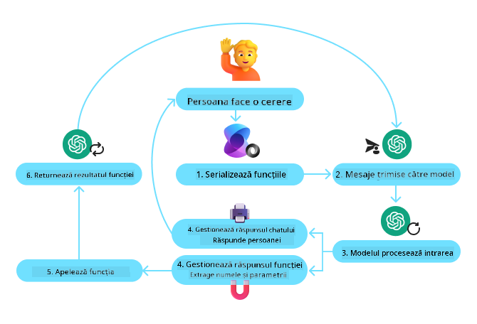
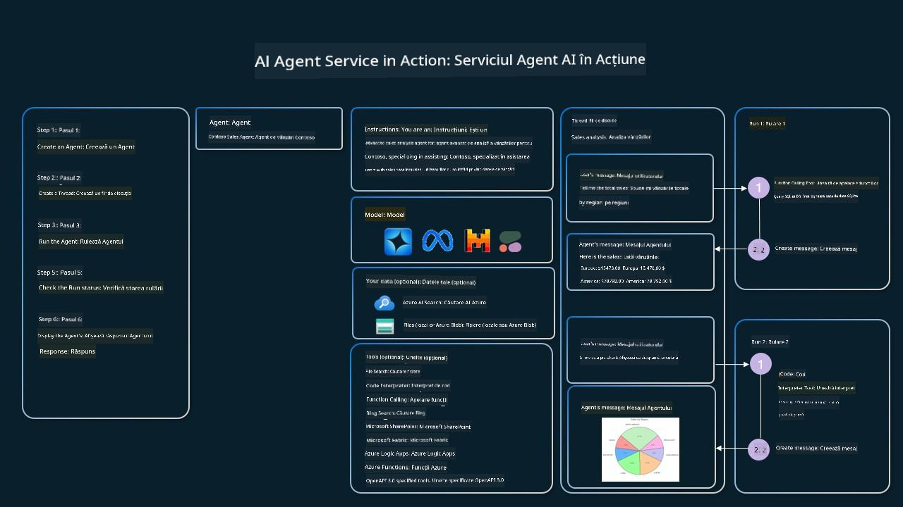

<!--
CO_OP_TRANSLATOR_METADATA:
{
  "original_hash": "e056335d729ba6e49571db7a6533825d",
  "translation_date": "2025-09-30T07:46:47+00:00",
  "source_file": "04-tool-use/README.md",
  "language_code": "ro"
}
-->
[](https://youtu.be/vieRiPRx-gI?si=cEZ8ApnT6Sus9rhn)

> _(Faceți clic pe imaginea de mai sus pentru a viziona videoclipul acestei lecții)_

# Modelul de proiectare pentru utilizarea instrumentelor

Instrumentele sunt interesante deoarece permit agenților AI să aibă o gamă mai largă de capabilități. În loc ca agentul să aibă un set limitat de acțiuni pe care le poate efectua, prin adăugarea unui instrument, agentul poate acum să realizeze o gamă variată de acțiuni. În acest capitol, vom analiza modelul de proiectare pentru utilizarea instrumentelor, care descrie modul în care agenții AI pot utiliza instrumente specifice pentru a-și atinge obiectivele.

## Introducere

În această lecție, ne propunem să răspundem la următoarele întrebări:

- Ce este modelul de proiectare pentru utilizarea instrumentelor?
- La ce cazuri de utilizare poate fi aplicat?
- Care sunt elementele/blocurile de construcție necesare pentru implementarea modelului de proiectare?
- Care sunt considerațiile speciale pentru utilizarea modelului de proiectare pentru utilizarea instrumentelor în construirea agenților AI de încredere?

## Obiective de învățare

După finalizarea acestei lecții, veți putea:

- Defini modelul de proiectare pentru utilizarea instrumentelor și scopul acestuia.
- Identifica cazurile de utilizare în care modelul de proiectare pentru utilizarea instrumentelor este aplicabil.
- Înțelege elementele cheie necesare pentru implementarea modelului de proiectare.
- Recunoaște considerațiile pentru asigurarea încrederii în agenții AI care utilizează acest model de proiectare.

## Ce este modelul de proiectare pentru utilizarea instrumentelor?

**Modelul de proiectare pentru utilizarea instrumentelor** se concentrează pe oferirea LLM-urilor (Modele de Limbaj de Mari Dimensiuni) capacitatea de a interacționa cu instrumente externe pentru a atinge obiective specifice. Instrumentele sunt coduri care pot fi executate de un agent pentru a efectua acțiuni. Un instrument poate fi o funcție simplă, cum ar fi un calculator, sau un apel API către un serviciu terț, cum ar fi verificarea prețurilor acțiunilor sau prognoza meteo. În contextul agenților AI, instrumentele sunt concepute pentru a fi executate de agenți ca răspuns la **apeluri de funcții generate de model**.

## La ce cazuri de utilizare poate fi aplicat?

Agenții AI pot utiliza instrumente pentru a finaliza sarcini complexe, a recupera informații sau a lua decizii. Modelul de proiectare pentru utilizarea instrumentelor este adesea utilizat în scenarii care necesită interacțiuni dinamice cu sisteme externe, cum ar fi baze de date, servicii web sau interpreți de cod. Această abilitate este utilă pentru o serie de cazuri de utilizare, inclusiv:

- **Recuperarea dinamică a informațiilor:** Agenții pot interoga API-uri externe sau baze de date pentru a obține date actualizate (de exemplu, interogarea unei baze de date SQLite pentru analiza datelor, obținerea prețurilor acțiunilor sau informațiilor meteo).
- **Executarea și interpretarea codului:** Agenții pot executa cod sau scripturi pentru a rezolva probleme matematice, a genera rapoarte sau a efectua simulări.
- **Automatizarea fluxurilor de lucru:** Automatizarea fluxurilor de lucru repetitive sau în mai mulți pași prin integrarea instrumentelor precum planificatoare de sarcini, servicii de e-mail sau fluxuri de date.
- **Asistență pentru clienți:** Agenții pot interacționa cu sisteme CRM, platforme de ticketing sau baze de cunoștințe pentru a rezolva întrebările utilizatorilor.
- **Generarea și editarea conținutului:** Agenții pot utiliza instrumente precum verificatoare gramaticale, rezumatoare de texte sau evaluatori de siguranță a conținutului pentru a asista la sarcini de creare a conținutului.

## Care sunt elementele/blocurile de construcție necesare pentru implementarea modelului de proiectare pentru utilizarea instrumentelor?

Aceste blocuri de construcție permit agentului AI să realizeze o gamă largă de sarcini. Să analizăm elementele cheie necesare pentru implementarea modelului de proiectare pentru utilizarea instrumentelor:

- **Scheme de funcții/instrumente:** Definiții detaliate ale instrumentelor disponibile, inclusiv numele funcției, scopul, parametrii necesari și rezultatele așteptate. Aceste scheme permit LLM-ului să înțeleagă ce instrumente sunt disponibile și cum să construiască cereri valide.

- **Logica de execuție a funcțiilor:** Reglementează modul și momentul în care instrumentele sunt invocate pe baza intenției utilizatorului și contextului conversației. Acest lucru poate include module de planificare, mecanisme de rutare sau fluxuri condiționale care determină utilizarea instrumentelor în mod dinamic.

- **Sistem de gestionare a mesajelor:** Componente care gestionează fluxul conversațional între intrările utilizatorului, răspunsurile LLM, apelurile instrumentelor și rezultatele instrumentelor.

- **Cadru de integrare a instrumentelor:** Infrastructură care conectează agentul la diverse instrumente, fie că sunt funcții simple sau servicii externe complexe.

- **Gestionarea erorilor și validarea:** Mecanisme pentru gestionarea eșecurilor în execuția instrumentelor, validarea parametrilor și gestionarea răspunsurilor neașteptate.

- **Gestionarea stării:** Urmărește contextul conversației, interacțiunile anterioare cu instrumentele și datele persistente pentru a asigura consistența în interacțiunile pe mai multe runde.

În continuare, să analizăm în detaliu apelarea funcțiilor/instrumentelor.

### Apelarea funcțiilor/instrumentelor

Apelarea funcțiilor este modalitatea principală prin care permitem LLM-urilor să interacționeze cu instrumentele. Veți vedea adesea termenii „Funcție” și „Instrument” utilizați interschimbabil, deoarece „funcțiile” (blocuri de cod reutilizabil) sunt „instrumentele” pe care agenții le folosesc pentru a îndeplini sarcini. Pentru ca codul unei funcții să fie invocat, un LLM trebuie să compare cererea utilizatorului cu descrierea funcției. Pentru aceasta, o schemă care conține descrierile tuturor funcțiilor disponibile este trimisă către LLM. LLM-ul selectează funcția cea mai potrivită pentru sarcină și returnează numele și argumentele acesteia. Funcția selectată este invocată, răspunsul acesteia este trimis înapoi către LLM, care folosește informațiile pentru a răspunde cererii utilizatorului.

Pentru ca dezvoltatorii să implementeze apelarea funcțiilor pentru agenți, veți avea nevoie de:

1. Un model LLM care suportă apelarea funcțiilor
2. O schemă care conține descrierile funcțiilor
3. Codul pentru fiecare funcție descrisă

Să folosim exemplul obținerii orei curente într-un oraș pentru a ilustra:

1. **Inițializați un LLM care suportă apelarea funcțiilor:**

    Nu toate modelele suportă apelarea funcțiilor, așa că este important să verificați dacă LLM-ul pe care îl utilizați o face. <a href="https://learn.microsoft.com/azure/ai-services/openai/how-to/function-calling" target="_blank">Azure OpenAI</a> suportă apelarea funcțiilor. Putem începe prin inițializarea clientului Azure OpenAI.

    ```python
    # Initialize the Azure OpenAI client
    client = AzureOpenAI(
        azure_endpoint = os.getenv("AZURE_OPENAI_ENDPOINT"), 
        api_key=os.getenv("AZURE_OPENAI_API_KEY"),  
        api_version="2024-05-01-preview"
    )
    ```

1. **Creați o schemă de funcții:**

    Următorul pas este definirea unei scheme JSON care conține numele funcției, descrierea a ceea ce face funcția și numele și descrierile parametrilor funcției. Vom lua apoi această schemă și o vom transmite clientului creat anterior, împreună cu cererea utilizatorului de a găsi ora în San Francisco. Este important de menționat că ceea ce se returnează este un **apel de instrument**, **nu** răspunsul final la întrebare. După cum am menționat anterior, LLM-ul returnează numele funcției pe care a selectat-o pentru sarcină și argumentele care vor fi transmise acesteia.

    ```python
    # Function description for the model to read
    tools = [
        {
            "type": "function",
            "function": {
                "name": "get_current_time",
                "description": "Get the current time in a given location",
                "parameters": {
                    "type": "object",
                    "properties": {
                        "location": {
                            "type": "string",
                            "description": "The city name, e.g. San Francisco",
                        },
                    },
                    "required": ["location"],
                },
            }
        }
    ]
    ```
   
    ```python
  
    # Initial user message
    messages = [{"role": "user", "content": "What's the current time in San Francisco"}] 
  
    # First API call: Ask the model to use the function
      response = client.chat.completions.create(
          model=deployment_name,
          messages=messages,
          tools=tools,
          tool_choice="auto",
      )
  
      # Process the model's response
      response_message = response.choices[0].message
      messages.append(response_message)
  
      print("Model's response:")  

      print(response_message)
  
    ```

    ```bash
    Model's response:
    ChatCompletionMessage(content=None, role='assistant', function_call=None, tool_calls=[ChatCompletionMessageToolCall(id='call_pOsKdUlqvdyttYB67MOj434b', function=Function(arguments='{"location":"San Francisco"}', name='get_current_time'), type='function')])
    ```
  
1. **Codul funcției necesar pentru realizarea sarcinii:**

    Acum că LLM-ul a ales ce funcție trebuie să fie rulată, codul care realizează sarcina trebuie să fie implementat și executat. Putem implementa codul pentru a obține ora curentă în Python. De asemenea, va trebui să scriem codul pentru a extrage numele și argumentele din `response_message` pentru a obține rezultatul final.

    ```python
      def get_current_time(location):
        """Get the current time for a given location"""
        print(f"get_current_time called with location: {location}")  
        location_lower = location.lower()
        
        for key, timezone in TIMEZONE_DATA.items():
            if key in location_lower:
                print(f"Timezone found for {key}")  
                current_time = datetime.now(ZoneInfo(timezone)).strftime("%I:%M %p")
                return json.dumps({
                    "location": location,
                    "current_time": current_time
                })
      
        print(f"No timezone data found for {location_lower}")  
        return json.dumps({"location": location, "current_time": "unknown"})
    ```

     ```python
     # Handle function calls
      if response_message.tool_calls:
          for tool_call in response_message.tool_calls:
              if tool_call.function.name == "get_current_time":
     
                  function_args = json.loads(tool_call.function.arguments)
     
                  time_response = get_current_time(
                      location=function_args.get("location")
                  )
     
                  messages.append({
                      "tool_call_id": tool_call.id,
                      "role": "tool",
                      "name": "get_current_time",
                      "content": time_response,
                  })
      else:
          print("No tool calls were made by the model.")  
  
      # Second API call: Get the final response from the model
      final_response = client.chat.completions.create(
          model=deployment_name,
          messages=messages,
      )
  
      return final_response.choices[0].message.content
     ```

     ```bash
      get_current_time called with location: San Francisco
      Timezone found for san francisco
      The current time in San Francisco is 09:24 AM.
     ```

Apelarea funcțiilor este esențială pentru majoritatea, dacă nu toate, designurile de utilizare a instrumentelor de către agenți, însă implementarea acesteia de la zero poate fi uneori provocatoare. Așa cum am învățat în [Lecția 2](../../../02-explore-agentic-frameworks), cadrele agentice ne oferă blocuri de construcție predefinite pentru implementarea utilizării instrumentelor.

## Exemple de utilizare a instrumentelor cu cadre agentice

Iată câteva exemple despre cum puteți implementa modelul de proiectare pentru utilizarea instrumentelor folosind diferite cadre agentice:

### Semantic Kernel

<a href="https://learn.microsoft.com/azure/ai-services/agents/overview" target="_blank">Semantic Kernel</a> este un cadru AI open-source pentru dezvoltatorii .NET, Python și Java care lucrează cu LLM-uri. Simplifică procesul de utilizare a apelării funcțiilor prin descrierea automată a funcțiilor și a parametrilor acestora către model printr-un proces numit <a href="https://learn.microsoft.com/semantic-kernel/concepts/ai-services/chat-completion/function-calling/?pivots=programming-language-python#1-serializing-the-functions" target="_blank">serializare</a>. De asemenea, gestionează comunicarea între model și codul dvs. Un alt avantaj al utilizării unui cadru agentic precum Semantic Kernel este că vă permite să accesați instrumente predefinite, cum ar fi <a href="https://github.com/microsoft/semantic-kernel/blob/main/python/samples/getting_started_with_agents/openai_assistant/step4_assistant_tool_file_search.py" target="_blank">Căutarea fișierelor</a> și <a href="https://github.com/microsoft/semantic-kernel/blob/main/python/samples/getting_started_with_agents/openai_assistant/step3_assistant_tool_code_interpreter.py" target="_blank">Interpretul de cod</a>.

Diagrama următoare ilustrează procesul de apelare a funcțiilor cu Semantic Kernel:



În Semantic Kernel, funcțiile/instrumentele sunt numite <a href="https://learn.microsoft.com/semantic-kernel/concepts/plugins/?pivots=programming-language-python" target="_blank">Pluginuri</a>. Putem converti funcția `get_current_time` pe care am văzut-o mai devreme într-un plugin transformând-o într-o clasă care conține funcția. De asemenea, putem importa decoratorul `kernel_function`, care preia descrierea funcției. Când creați un kernel cu `GetCurrentTimePlugin`, kernelul va serializa automat funcția și parametrii acesteia, creând schema care va fi trimisă către LLM în proces.

```python
from semantic_kernel.functions import kernel_function

class GetCurrentTimePlugin:
    async def __init__(self, location):
        self.location = location

    @kernel_function(
        description="Get the current time for a given location"
    )
    def get_current_time(location: str = ""):
        ...

```

```python 
from semantic_kernel import Kernel

# Create the kernel
kernel = Kernel()

# Create the plugin
get_current_time_plugin = GetCurrentTimePlugin(location)

# Add the plugin to the kernel
kernel.add_plugin(get_current_time_plugin)
```
  
### Serviciul Azure AI Agent

<a href="https://learn.microsoft.com/azure/ai-services/agents/overview" target="_blank">Serviciul Azure AI Agent</a> este un cadru agentic mai nou, conceput pentru a permite dezvoltatorilor să construiască, să implementeze și să scaleze agenți AI de înaltă calitate și extensibili, fără a fi nevoie să gestioneze resursele de calcul și stocare subiacente. Este deosebit de util pentru aplicațiile enterprise, deoarece este un serviciu complet gestionat cu securitate de nivel enterprise.

Comparativ cu dezvoltarea directă cu API-ul LLM, Serviciul Azure AI Agent oferă câteva avantaje, inclusiv:

- Apelarea automată a instrumentelor – nu este nevoie să analizați un apel de instrument, să invocați instrumentul și să gestionați răspunsul; toate acestea sunt acum realizate pe server.
- Gestionarea securizată a datelor – în loc să gestionați propriul context conversațional, puteți utiliza firele pentru a stoca toate informațiile de care aveți nevoie.
- Instrumente predefinite – Instrumente pe care le puteți utiliza pentru a interacționa cu sursele dvs. de date, cum ar fi Bing, Azure AI Search și Azure Functions.

Instrumentele disponibile în Serviciul Azure AI Agent pot fi împărțite în două categorii:

1. Instrumente de cunoștințe:
    - <a href="https://learn.microsoft.com/azure/ai-services/agents/how-to/tools/bing-grounding?tabs=python&pivots=overview" target="_blank">Fundamentare cu Bing Search</a>
    - <a href="https://learn.microsoft.com/azure/ai-services/agents/how-to/tools/file-search?tabs=python&pivots=overview" target="_blank">Căutarea fișierelor</a>
    - <a href="https://learn.microsoft.com/azure/ai-services/agents/how-to/tools/azure-ai-search?tabs=azurecli%2Cpython&pivots=overview-azure-ai-search" target="_blank">Azure AI Search</a>

2. Instrumente de acțiune:
    - <a href="https://learn.microsoft.com/azure/ai-services/agents/how-to/tools/function-calling?tabs=python&pivots=overview" target="_blank">Apelarea funcțiilor</a>
    - <a href="https://learn.microsoft.com/azure/ai-services/agents/how-to/tools/code-interpreter?tabs=python&pivots=overview" target="_blank">Interpretul de cod</a>
    - <a href="https://learn.microsoft.com/azure/ai-services/agents/how-to/tools/openapi-spec?tabs=python&pivots=overview" target="_blank">Instrumente definite prin OpenAPI</a>
    - <a href="https://learn.microsoft.com/azure/ai-services/agents/how-to/tools/azure-functions?pivots=overview" target="_blank">Azure Functions</a>

Serviciul Agent permite utilizarea acestor instrumente împreună ca un `toolset`. De asemenea, utilizează `threads`, care păstrează istoricul mesajelor dintr-o conversație specifică.

Imaginați-vă că sunteți un agent de vânzări la o companie numită Contoso. Doriți să dezvoltați un agent conversațional care să poată răspunde la întrebări despre datele dvs. de vânzări.

Imaginea următoare ilustrează cum ați putea utiliza Serviciul Azure AI Agent pentru a analiza datele dvs. de vânzări:



Pentru a utiliza oricare dintre aceste instrumente cu serviciul, putem crea un client și defini un instrument sau un set de instrumente. Pentru a implementa acest lucru practic, putem utiliza următorul cod Python. LLM-ul va putea analiza setul de instrumente și decide dacă să utilizeze funcția creată de utilizator, `fetch_sales_data_using_sqlite_query`, sau interpretul de cod predefinit, în funcție de cererea utilizatorului.

```python 
import os
from azure.ai.projects import AIProjectClient
from azure.identity import DefaultAzureCredential
from fetch_sales_data_functions import fetch_sales_data_using_sqlite_query # fetch_sales_data_using_sqlite_query function which can be found in a fetch_sales_data_functions.py file.
from azure.ai.projects.models import ToolSet, FunctionTool, CodeInterpreterTool

project_client = AIProjectClient.from_connection_string(
    credential=DefaultAzureCredential(),
    conn_str=os.environ["PROJECT_CONNECTION_STRING"],
)

# Initialize function calling agent with the fetch_sales_data_using_sqlite_query function and adding it to the toolset
fetch_data_function = FunctionTool(fetch_sales_data_using_sqlite_query)
toolset = ToolSet()
toolset.add(fetch_data_function)

# Initialize Code Interpreter tool and adding it to the toolset. 
code_interpreter = code_interpreter = CodeInterpreterTool()
toolset = ToolSet()
toolset.add(code_interpreter)

agent = project_client.agents.create_agent(
    model="gpt-4o-mini", name="my-agent", instructions="You are helpful agent", 
    toolset=toolset
)
```

## Care sunt considerațiile speciale pentru utilizarea modelului de proiectare pentru utilizarea instrumentelor în construirea agenților AI de încredere?

O preocupare comună cu SQL generat dinamic de LLM-uri este securitatea, în special riscul de injecție SQL sau acțiuni malițioase, cum ar fi ștergerea sau modificarea bazei de date. Deși aceste preocupări sunt valide, ele pot fi gestionate eficient prin configurarea corespunzătoare a permisiunilor de acces la baza de date. Pentru majoritatea bazelor de date, acest lucru implică configurarea bazei de date ca fiind doar pentru citire. Pentru servicii de baze de date precum PostgreSQL sau Azure SQL, aplicația ar trebui să fie atribuită unui rol doar pentru citire (SELECT).
Rularea aplicației într-un mediu securizat sporește și mai mult protecția. În scenarii de tip enterprise, datele sunt de obicei extrase și transformate din sistemele operaționale într-o bază de date sau un depozit de date doar pentru citire, cu o schemă ușor de utilizat. Această abordare asigură că datele sunt securizate, optimizate pentru performanță și accesibilitate, iar aplicația are acces restricționat, doar pentru citire.

### Ai mai multe întrebări despre utilizarea modelelor de design pentru instrumente?

Alătură-te [Discordului Azure AI Foundry](https://aka.ms/ai-agents/discord) pentru a întâlni alți cursanți, a participa la ore de consultanță și a obține răspunsuri la întrebările tale despre AI Agents.

## Resurse suplimentare

- <a href="https://microsoft.github.io/build-your-first-agent-with-azure-ai-agent-service-workshop/" target="_blank">Workshop Azure AI Agents Service</a>
- <a href="https://github.com/Azure-Samples/contoso-creative-writer/tree/main/docs/workshop" target="_blank">Workshop Multi-Agent Contoso Creative Writer</a>
- <a href="https://learn.microsoft.com/semantic-kernel/concepts/ai-services/chat-completion/function-calling/?pivots=programming-language-python#1-serializing-the-functions" target="_blank">Tutorial despre apelarea funcțiilor în Semantic Kernel</a>
- <a href="https://github.com/microsoft/semantic-kernel/blob/main/python/samples/getting_started_with_agents/openai_assistant/step3_assistant_tool_code_interpreter.py" target="_blank">Interpreter de cod Semantic Kernel</a>
- <a href="https://microsoft.github.io/autogen/dev/user-guide/core-user-guide/components/tools.html" target="_blank">Instrumente Autogen</a>

## Lecția anterioară

[Înțelegerea modelelor de design agentic](../03-agentic-design-patterns/README.md)

## Lecția următoare

[Agentic RAG](../05-agentic-rag/README.md)

---

**Declinare de responsabilitate**:  
Acest document a fost tradus folosind serviciul de traducere AI [Co-op Translator](https://github.com/Azure/co-op-translator). Deși ne străduim să asigurăm acuratețea, vă rugăm să fiți conștienți că traducerile automate pot conține erori sau inexactități. Documentul original în limba sa natală trebuie considerat sursa autoritară. Pentru informații critice, se recomandă traducerea profesională realizată de un specialist uman. Nu ne asumăm responsabilitatea pentru eventualele neînțelegeri sau interpretări greșite care pot apărea din utilizarea acestei traduceri.