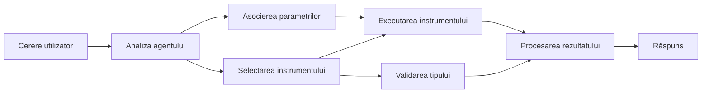

# 🛠️ Utilizare Avansată a Instrumentelor cu Azure OpenAI (Responses API) (.NET)

## 📋 Obiective de Învățare

Acest notebook demonstrează modele de integrare a instrumentelor de nivel enterprise utilizând Microsoft Agent Framework în .NET cu Azure OpenAI (Responses API). Vei învăța să construiești agenți sofisticați cu multiple instrumente specializate, valorificând tiparea puternică a C# și facilitățile enterprise ale .NET.

### Capacități Avansate ale Instrumentelor pe care le vei Stăpâni

- 🔧 **Arhitectură Multi-Instrument**: Construirea de agenți cu multiple capacități specializate
- 🎯 **Execuție de Instrumente Tip-Sigure**: Valorificarea validării la compilare în C#
- 📊 **Modele Enterprise pentru Instrumente**: Design de instrumente pregătite pentru producție și gestionarea erorilor
- 🔗 **Compoziția Instrumentelor**: Combinarea instrumentelor pentru fluxuri de lucru complexe de business

## 🎯 Beneficiile Arhitecturii Instrumentelor în .NET

### Funcționalități Enterprise ale Instrumentelor

- **Validare la Timp de Compilare**: Tiparea puternică asigură corectitudinea parametrilor instrumentului
- **Injecție de Dependențe**: Integrare cu containerul IoC pentru gestionarea instrumentelor
- **Modele Async/Await**: Execuție neblocantă a instrumentelor cu gestionare adecvată a resurselor
- **Jurnalizare Structurată**: Integrare încorporată pentru monitorizarea execuției instrumentelor

### Modele Pregătite pentru Producție

- **Gestionarea Excepțiilor**: Management cuprinzător al erorilor cu excepții tipate
- **Gestionarea Resurselor**: Modele corecte de eliminare și gestionare a memoriei
- **Monitorizarea Performanței**: Metrici și contoare de performanță integrate
- **Gestionarea Configurației**: Configurare tip-sigură cu validare

## 🔧 Arhitectură Tehnică

### Componente de Bază ale Instrumentelor în .NET

- **Microsoft.Extensions.AI**: Strat unificat de abstracție pentru instrumente
- **Microsoft.Agents.AI**: Orchestrare de instrumente de nivel enterprise
- **Azure OpenAI (Responses API)**: Client API de înaltă performanță cu pooling de conexiuni

### Pipeline de Execuție a Instrumentelor



## 🛠️ Categorii & Modele de Instrumente

### 1. **Instrumente de Procesare a Datelor**

- **Validarea Intrărilor**: Tipare puternice cu adnotări de date
- **Operații de Transformare**: Conversie și formatare a datelor tip-sigură
- **Logică de Business**: Instrumente de calcul și analiză specifice domeniului
- **Formatarea Ieșirilor**: Generarea răspunsurilor structurate

### 2. **Instrumente de Integrare**

- **Conectoare API**: Integrare servicii RESTful cu HttpClient
- **Instrumente pentru Baze de Date**: Integrare Entity Framework pentru acces la date
- **Operații cu Fișiere**: Operații securizate pe sistemul de fișiere cu validare
- **Servicii Externe**: Modele de integrare a serviciilor terțe

### 3. **Instrumente Utility**

- **Procesare Text**: Utilitare pentru manipulare și formatare de șiruri
- **Operații Data/Oră**: Calculări sensibile la cultură pentru dată/oră
- **Instrumente Matematice**: Calcule de precizie și operații statistice
- **Instrumente de Validare**: Validarea regulilor de business și verificarea datelor

Gata să construiești agenți de nivel enterprise cu capabilități puternice, tip-sigure în .NET? Hai să arhitecturăm soluții profesionale! 🏢⚡

## 🚀 Începutul Lucrului

### Precondiții

- [SDK .NET 10](https://dotnet.microsoft.com/download/dotnet/10.0) sau versiune superioară
- Un [abonament Azure](https://azure.microsoft.com/free/) cu o resursă Azure OpenAI și un deployment de model
- [CLI Azure](https://learn.microsoft.com/cli/azure/install-azure-cli) — autentificare cu `az login`

### Variabile de Mediu Necesare

```bash
# zsh/bash
export AZURE_OPENAI_ENDPOINT=https://<your-resource>.openai.azure.com
export AZURE_OPENAI_DEPLOYMENT=gpt-4o-mini
# Apoi autentificați-vă pentru ca AzureCliCredential să poată obține un token
az login
```

```powershell
# PowerShell
$env:AZURE_OPENAI_ENDPOINT = "https://<your-resource>.openai.azure.com"
$env:AZURE_OPENAI_DEPLOYMENT = "gpt-4o-mini"
# Apoi autentificați-vă pentru ca AzureCliCredential să poată obține un token
az login
```

### Exemplu de Cod

Pentru a rula exemplul de cod,

```bash
# zsh/bash
chmod +x ./04-dotnet-agent-framework.cs
./04-dotnet-agent-framework.cs
```

Sau folosind CLI dotnet:

```bash
dotnet run ./04-dotnet-agent-framework.cs
```

Vezi [`04-dotnet-agent-framework.cs`](../../../../04-tool-use/code_samples/04-dotnet-agent-framework.cs) pentru codul complet.

```csharp
#!/usr/bin/dotnet run

#:package Microsoft.Extensions.AI@10.*
#:package Microsoft.Agents.AI.OpenAI@1.*-*
#:package Azure.AI.OpenAI@2.1.0
#:package Azure.Identity@1.13.1

using System.ComponentModel;

using Microsoft.Agents.AI;
using Microsoft.Extensions.AI;

using Azure.AI.OpenAI;
using Azure.Identity;

// Tool Function: Random Destination Generator
// This static method will be available to the agent as a callable tool
// The [Description] attribute helps the AI understand when to use this function
// This demonstrates how to create custom tools for AI agents
[Description("Provides a random vacation destination.")]
static string GetRandomDestination()
{
    // List of popular vacation destinations around the world
    // The agent will randomly select from these options
    var destinations = new List<string>
    {
        "Paris, France",
        "Tokyo, Japan",
        "New York City, USA",
        "Sydney, Australia",
        "Rome, Italy",
        "Barcelona, Spain",
        "Cape Town, South Africa",
        "Rio de Janeiro, Brazil",
        "Bangkok, Thailand",
        "Vancouver, Canada"
    };

    // Generate random index and return selected destination
    // Uses System.Random for simple random selection
    var random = new Random();
    int index = random.Next(destinations.Count);
    return destinations[index];
}

// Azure OpenAI with the Responses API (stable v1 endpoint). Sign in with `az login`.
var azureEndpoint = Environment.GetEnvironmentVariable("AZURE_OPENAI_ENDPOINT")
    ?? throw new InvalidOperationException("AZURE_OPENAI_ENDPOINT is not set.");
var deployment = Environment.GetEnvironmentVariable("AZURE_OPENAI_DEPLOYMENT") ?? "gpt-4o-mini";

var azureClient = new AzureOpenAIClient(new Uri(azureEndpoint), new AzureCliCredential());

// Define Agent Identity and Comprehensive Instructions
// Agent name for identification and logging purposes
var AGENT_NAME = "TravelAgent";

// Detailed instructions that define the agent's personality, capabilities, and behavior
// This system prompt shapes how the agent responds and interacts with users
var AGENT_INSTRUCTIONS = """
You are a helpful AI Agent that can help plan vacations for customers.

Important: When users specify a destination, always plan for that location. Only suggest random destinations when the user hasn't specified a preference.

When the conversation begins, introduce yourself with this message:
"Hello! I'm your TravelAgent assistant. I can help plan vacations and suggest interesting destinations for you. Here are some things you can ask me:
1. Plan a day trip to a specific location
2. Suggest a random vacation destination
3. Find destinations with specific features (beaches, mountains, historical sites, etc.)
4. Plan an alternative trip if you don't like my first suggestion

What kind of trip would you like me to help you plan today?"

Always prioritize user preferences. If they mention a specific destination like "Bali" or "Paris," focus your planning on that location rather than suggesting alternatives.
""";

// Create AI Agent with Advanced Travel Planning Capabilities
// Get the Responses client for the deployment and create the AI agent
// Configure agent with name, detailed instructions, and available tools
// This demonstrates the .NET agent creation pattern with full configuration
AIAgent agent = azureClient
    .GetOpenAIResponseClient(deployment)
    .CreateAIAgent(
        name: AGENT_NAME,
        instructions: AGENT_INSTRUCTIONS,
        tools: [AIFunctionFactory.Create(GetRandomDestination)]
    );

// Create New Conversation Thread for Context Management
// Initialize a new conversation thread to maintain context across multiple interactions
// Threads enable the agent to remember previous exchanges and maintain conversational state
// This is essential for multi-turn conversations and contextual understanding
AgentThread thread = agent.GetNewThread();

// Execute Agent: First Travel Planning Request
// Run the agent with an initial request that will likely trigger the random destination tool
// The agent will analyze the request, use the GetRandomDestination tool, and create an itinerary
// Using the thread parameter maintains conversation context for subsequent interactions
await foreach (var update in agent.RunStreamingAsync("Plan me a day trip", thread))
{
    await Task.Delay(10);
    Console.Write(update);
}

Console.WriteLine();

// Execute Agent: Follow-up Request with Context Awareness
// Demonstrate contextual conversation by referencing the previous response
// The agent remembers the previous destination suggestion and will provide an alternative
// This showcases the power of conversation threads and contextual understanding in .NET agents
await foreach (var update in agent.RunStreamingAsync("I don't like that destination. Plan me another vacation.", thread))
{
    await Task.Delay(10);
    Console.Write(update);
}
```

---

<!-- CO-OP TRANSLATOR DISCLAIMER START -->
**Declinare a responsabilității**:
Acest document a fost tradus folosind serviciul de traducere AI [Co-op Translator](https://github.com/Azure/co-op-translator). În timp ce ne străduim pentru acuratețe, vă rugăm să rețineți că traducerile automate pot conține erori sau inexactități. Documentul original în limba sa nativă trebuie considerat sursa autorizată. Pentru informații critice, se recomandă traducerea profesională realizată de un om. Nu ne asumăm responsabilitatea pentru eventualele neînțelegeri sau interpretări greșite care decurg din utilizarea acestei traduceri.
<!-- CO-OP TRANSLATOR DISCLAIMER END -->