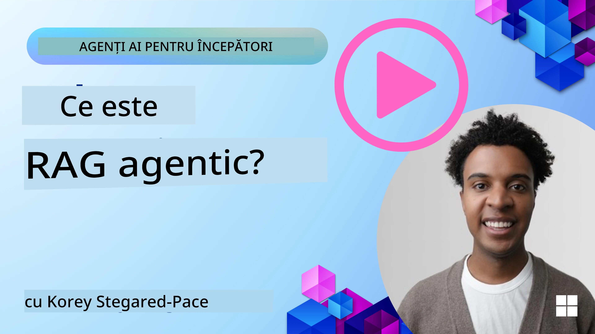
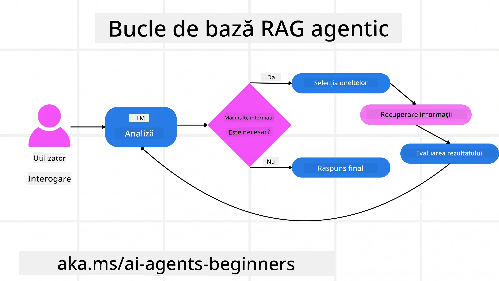
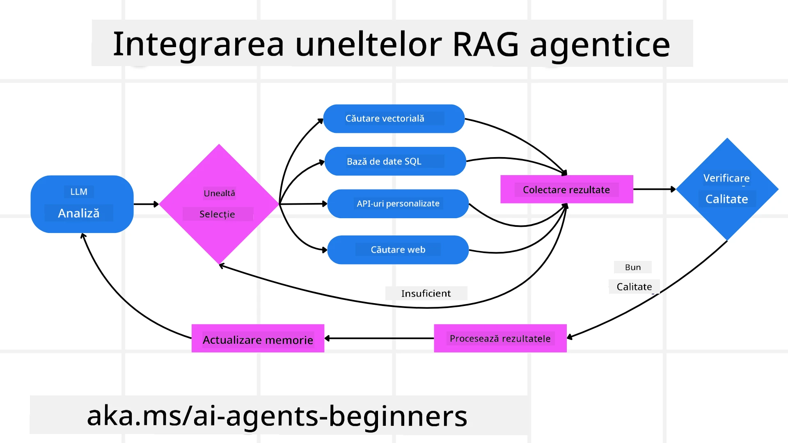
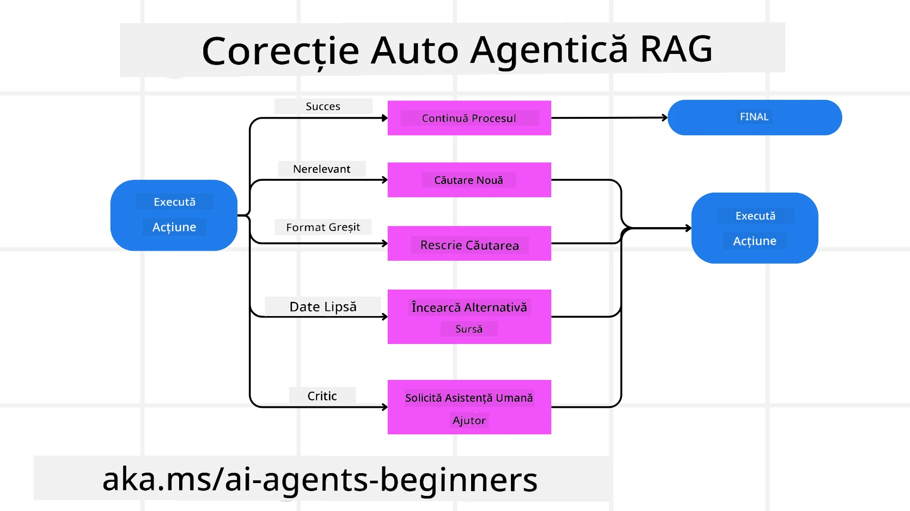
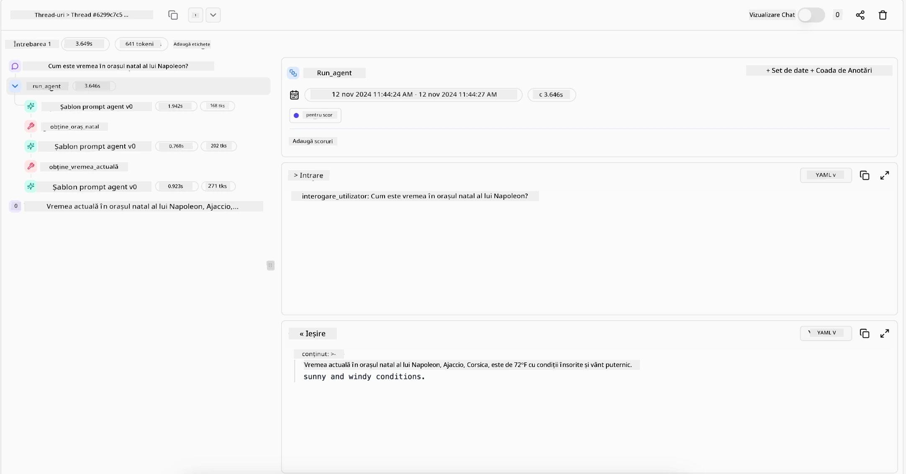

> _(Faceți clic pe imaginea de mai sus pentru a viziona videoclipul acestei lecții)_

# Agentic RAG

Această lecție oferă o prezentare cuprinzătoare a Agentic Retrieval-Augmented Generation (Agentic RAG), un paradigme emergent în AI în care modelele mari de limbaj (LLM) își planifică în mod autonom pașii următori, în timp ce preiau informații din surse externe. Spre deosebire de modele statice de tip preluare-și-apoi-citire, Agentic RAG implică apeluri iterative către LLM, alternate cu apeluri către unelte sau funcții și output-uri structurate. Sistemul evaluează rezultatele, rafinează interogările, invocă unelte suplimentare dacă este necesar și continuă acest ciclu până când se obține o soluție satisfăcătoare.

## Introducere

Această lecție va acoperi

- **Înțelegerea Agentic RAG:** Aflați despre paradigma emergentă în AI în care modelele mari de limbaj (LLM) își planifică în mod autonom pașii următori, în timp ce extrag informații din surse externe de date.
- **Captarea stilului iterativ Maker-Checker:** Înțelegeți bucla apelurilor iterative către LLM, alternate cu apeluri către unelte sau funcții și output-uri structurate, concepute pentru a îmbunătăți corectitudinea și a gestiona interogări eronate.
- **Explorarea aplicațiilor practice:** Identificați scenarii în care Agentic RAG excelează, cum ar fi mediile care prioritizează corectitudinea, interacțiunile complexe cu baze de date și fluxurile de lucru extinse.

## Obiective de învățare

După finalizarea acestei lecții, veți ști cum să/veți înțelege:

- **Înțelegerea Agentic RAG:** Aflați despre paradigma emergentă în AI în care modelele mari de limbaj (LLM) își planifică autonom pașii următori în timp ce preiau informații din surse de date externe.
- **Stil iterativ Maker-Checker:** Captarea conceptului de buclă a apelurilor iterative către LLM, alternate cu apeluri către unelte sau funcții și output-uri structurate, concepute pentru a îmbunătăți corectitudinea și a gestiona interogări eronate.
- **Deținerea procesului de raționament:** Înțelegerea capacității sistemului de a-și asuma procesul de raționament, luând decizii privind abordarea problemelor fără a se baza pe căi predefinite.
- **Fluxul de lucru:** Înțelegerea modului în care un model agentic decide independent să recupereze rapoarte despre tendințele pieței, să identifice date despre concurenți, să coreleze metrici interne de vânzări, să sintetizeze constatările și să evalueze strategia.
- **Bucle iterative, integrarea uneltelor și memorie:** Aflați despre dependența sistemului de un tipar de interacțiune în buclă, menținând starea și memoria pe pași pentru a evita bucle repetitive și pentru a lua decizii informate.
- **Gestionarea modurilor de eșec și autocorecția:** Explorați mecanismele robuste de autocorecție ale sistemului, inclusiv repetarea și reinterogarea, folosirea uneltelor de diagnostic și apelarea la supervizarea umană.
- **Limitările agenției:** Înțelegerea limitărilor Agentic RAG, axate pe autonomia specifică domeniului, dependența de infrastructură și respectul pentru constrângeri.
- **Cazuri de utilizare practice și valoare:** Identificarea scenariilor în care Agentic RAG se remarcă, cum ar fi mediile care prioritizează corectitudinea, interacțiunile complexe cu baze de date și fluxurile extinse de lucru.
- **Guvernanță, transparență și încredere:** Aflați despre importanța guvernanței și transparenței, inclusiv raționamentul explicabil, controlul prejudecăților și supervizarea umană.

## Ce este Agentic RAG?

Agentic Retrieval-Augmented Generation (Agentic RAG) este un paradigme emergent în AI în care modelele mari de limbaj (LLM) își planifică în mod autonom pașii următori, în timp ce extrag informații din surse externe. Spre deosebire de modelele statice de tip preluare-și-apoi-citire, Agentic RAG implică apeluri iterative către LLM, alternate cu apeluri către unelte sau funcții și output-uri structurate. Sistemul evaluează rezultatele, rafinează interogările, invocă unelte suplimentare dacă este necesar și continuă acest ciclu până când se obține o soluție satisfăcătoare. Acest stil iterativ de tip „maker-checker” îmbunătățește corectitudinea, gestionează interogările eronate și asigură rezultate de înaltă calitate.

Sistemul își asumă activ procesul de raționament, rescriind interogările eșuate, alegând metode diferite de preluare și integrând multiple unelte—cum ar fi căutarea vectorială în Azure AI Search, baze de date SQL sau API-uri personalizate—înainte de a-și finaliza răspunsul. Calitatea definitorie a unui sistem agentic este abilitatea sa de a-și asuma procesul de raționament. Implementările tradiționale RAG se bazează pe căi predefinite, dar un sistem agentic determină autonom secvența pașilor în funcție de calitatea informației găsite.

## Definirea Agentic Retrieval-Augmented Generation (Agentic RAG)

Agentic Retrieval-Augmented Generation (Agentic RAG) este un paradigme emergent în dezvoltarea AI în care LLM-urile nu doar extrag informații din surse externe de date, ci și își planifică autonom pașii următori. Spre deosebire de modelele statice de tip preluare-și-apoi-citire sau de secvențe atent scenariate de prompturi, Agentic RAG implică o buclă de apeluri iterative către LLM, alternate cu apeluri către unelte sau funcții și output-uri structurate. La fiecare pas, sistemul evaluează rezultatele obținute, decide dacă trebuie să-și rafineze interogările, invocă unelte suplimentare dacă este necesar și continuă acest ciclu până când ajunge la o soluție satisfăcătoare.

Acest stil iterativ de funcționare „maker-checker” este conceput pentru a îmbunătăți corectitudinea, a gestiona interogările eronate către baze de date structurate (de ex. NL2SQL) și a asigura rezultate echilibrate și de înaltă calitate. În loc să se bazeze exclusiv pe lanțuri de prompturi atent proiectate, sistemul își asumă activ procesul de raționament. Poate rescrie interogările care eșuează, alege metode diferite de preluare și integrează multiple unelte—cum ar fi căutarea vectorială în Azure AI Search, baze de date SQL sau API-uri personalizate—înainte de a-și finaliza răspunsul. Aceasta elimină nevoia unor cadre de orchestrare excesiv de complexe. În schimb, o buclă relativ simplă de tip „apel LLM → folosire unealtă → apel LLM → …” poate genera output-uri sofisticate și bine fundamentate.

## Deținerea procesului de raționament

Calitatea definitorie care face un sistem „agentic” este capacitatea sa de a-și asuma procesul de raționament. Implementările tradiționale RAG depind adesea de oameni care predefinește un parcurs pentru model: un lanț de gândire care detaliază ce să preia și când.
Dar când un sistem este cu adevărat agentic, decide intern cum să abordeze problema. Nu execută doar un script; determină autonom secvența pașilor în funcție de calitatea informației pe care o găsește.
De exemplu, dacă i se cere să creeze o strategie de lansare a unui produs, nu se bazează exclusiv pe un prompt care descrie întregul flux de lucru de cercetare și luare a deciziilor. În schimb, modelul agentic decide independent să:

1. Recupereze rapoarte curente despre tendințele pieței folosind Bing Web Grounding
2. Identifice date relevante despre concurenți folosind Azure AI Search.
3. Coreleze metrici interne de vânzări istorice folosind Azure SQL Database.
4. Sintetizeze constatările într-o strategie coerentă orchestratӑ prin Azure OpenAI Service.
5. Evalueze strategia pentru lacune sau inconsistențe, solicitând o altă rundă de preluare dacă este nevoie.
Toți acești pași—rafinarea interogărilor, alegerea surselor, iterarea până când este „mulțumit” de răspuns—sunt deciși de model, nu pre-scriptat de un om.

## Bucle iterative, integrarea uneltelor și memorie

Un sistem agentic se bazează pe un tipar de interacțiune în buclă:

- **Apel inițial:** Scopul utilizatorului (aka promptul) este prezentat LLM-ului.
- **Invocarea uneltei:** Dacă modelul identifică informații lipsă sau instrucțiuni ambigue, selectează o unealtă sau o metodă de preluare—cum ar fi o interogare într-o bază de date vectorială (de ex. căutarea hibridă Azure AI Search peste date private) sau o interogare SQL structurată—pentru a aduna mai mult context.
- **Evaluare și rafinare:** După revizuirea datelor returnate, modelul decide dacă informațiile sunt suficiente. Dacă nu, rafinează interogarea, încearcă o unealtă diferită sau ajustează abordarea.
- **Repetă până este mulțumit:** Acest ciclu continuă până când modelul determină că are suficientă claritate și dovezi pentru a oferi un răspuns final bine argumentat.
- **Memorie și stare:** Deoarece sistemul păstrează starea și memoria pe parcursul pașilor, poate reaminti încercările și rezultatele anterioare, evitând bucle repetitive și luând decizii mai bine informate pe măsură ce avansează.

În timp, aceasta creează o senzație de înțelegere evolutivă, permițând modelului să navigheze în sarcini complexe, în mai mulți pași, fără a necesita intervenția constantă a unui om pentru a remodela promptul.

## Gestionarea modurilor de eșec și autocorecția

Autonomia Agentic RAG implică și mecanisme robuste de autocorecție. Când sistemul întâmpină blocaje—cum ar fi recuperarea documentelor irelevante sau interogările eronate—poate:

- **Itera și reinteroga:** În loc să returneze răspunsuri cu valoare scăzută, modelul încearcă strategii noi de căutare, rescrie interogările bazei de date sau analizează seturi de date alternative.
- **Folosi unelte de diagnosticare:** Sistemul poate invoca funcții suplimentare concepute să îl ajute să depaneze pașii de raționament sau să confirme corectitudinea datelor recuperate. Unelte precum Azure AI Tracing vor fi importante pentru a permite observabilitate și monitorizare robuste.
- **Apela la supervizarea umană:** Pentru scenarii cu mize ridicate sau care eșuează repetat, modelul poate semnala incertitudine și solicita ghidaj uman. Odată ce omul oferă feedback corectiv, modelul poate încorpora acea lecție pentru viitor.

Această abordare iterativă și dinamică permite modelului să se îmbunătățească continuu, asigurând că nu este doar un sistem de tip one-shot, ci unul care învață din greșelile sale într-o sesiune dată.

## Limitările agenției

În ciuda autonomiei sale în cadrul unei sarcini, Agentic RAG nu este analog cu Inteligența Artificială Generală. Capacitățile sale „agentice” sunt limitate la uneltele, sursele de date și politicile furnizate de dezvoltatorii umani. Nu poate inventa propriile unelte sau să iasă din limitele domeniului stabilite. Mai degrabă, excela în orchestrarea dinamică a resurselor disponibile.
Diferențele cheie față de formele AI mai avansate includ:

1. **Autonomie specifică domeniului:** Sistemele Agentic RAG sunt concentrate pe realizarea obiectivelor definite de utilizatori în cadrul unui domeniu cunoscut, folosind strategii precum rescrierea interogărilor sau selectarea uneltelor pentru a îmbunătăți rezultatele.
2. **Dependente de infrastructură:** Capacitățile sistemului depind de uneltele și datele integrate de către dezvoltatori. Nu poate depăși aceste limite fără intervenția umană.
3. **Respect pentru constrângeri:** Ghiduri etice, reguli de conformitate și politici de afaceri rămân foarte importante. Libertatea agentului este întotdeauna restricționată de măsuri de siguranță și mecanisme de supraveghere (sperăm?).

## Cazuri de utilizare practice și valoare

Agentic RAG se remarcă în scenarii care necesită rafinare iterativă și precizie:

1. **Mediile care prioritizează corectitudinea:** În verificări de conformitate, analize reglementare sau cercetare juridică, modelul agentic poate verifica repetat faptele, consulta multiple surse și rescrie interogările până când produce un răspuns riguros verificat.
2. **Interacțiuni complexe cu baze de date:** Atunci când se lucrează cu date structurate unde interogările pot eșua frecvent sau necesita ajustări, sistemul poate rafina autonom interogările folosind Azure SQL sau Microsoft Fabric OneLake, asigurând că preluarea finală se aliniază cu intenția utilizatorului.
3. **Fluxuri de lucru extinse:** Sesiunile de durată mai lungă pot evolua pe măsură ce apar informații noi. Agentic RAG poate integra continuu date noi, schimbând strategiile pe măsură ce învață mai multe despre spațiul problemelor.

## Guvernanță, transparență și încredere

Pe măsură ce aceste sisteme devin mai autonome în procesul de raționament, guvernanța și transparența sunt cruciale:

- **Raționament explicabil:** Modelul poate furniza un traseu de audit al interogărilor realizate, al surselor consultate și al pașilor de raționament parcurși pentru a ajunge la concluzie. Unelte precum Azure AI Content Safety și Azure AI Tracing / GenAIOps pot ajuta la menținerea transparenței și la reducerea riscurilor.
- **Controlul prejudecăților și preluarea echilibrată:** Dezvoltatorii pot ajusta strategiile de preluare pentru a asigura că sunt considerate surse de date echilibrate și reprezentative și pot audita periodic output-urile pentru a detecta prejudecăți sau modele distorsionate folosind modele personalizate pentru organizații avansate de știință a datelor folosind Azure Machine Learning.
- **Supravegherea umană și conformitatea:** Pentru sarcini sensibile, revizuirea umană rămâne esențială. Agentic RAG nu înlocuiește judecata umană în deciziile cu mize ridicate — o completează prin furnizarea unor opțiuni verificate mai riguros.

Există necesitatea uneltelor care oferă un istoric clar al acțiunilor. Fără ele, depanarea unui proces în mai mulți pași poate fi foarte dificilă. Vedeți următorul exemplu de la Literal AI (compania din spatele Chainlit) pentru o rulare Agent:

## Concluzie

Agentic RAG reprezintă o evoluție naturală a modului în care sistemele AI gestionează sarcini complexe și intensive în date. Prin adoptarea unui tipar de interacțiune în buclă, selectarea autonomă a uneltelor și rafinarea interogărilor până obține un rezultat de înaltă calitate, sistemul depășește urmarea statică a prompturilor, devenind un factor de decizie mai adaptiv și conștient de context. Deși rămâne încadrat în infrastructuri și ghiduri etice definite de oameni, aceste capabilități agentice permit interacțiuni AI mai bogate, mai dinamice și, în final, mai utile atât pentru companii, cât și pentru utilizatori finali.

### Aveți mai multe întrebări despre Agentic RAG?

Alăturați-vă la [Microsoft Foundry Discord](https://discord.com/invite/ATgtXmAS5D) pentru a întâlni alți cursanți, a participa la sesiuni de întrebări și a vă rezolva întrebările despre agenții AI.

## Resurse suplimentare

- <a href="https://learn.microsoft.com/training/modules/use-own-data-azure-openai" target="_blank">Implementarea Retrieval Augmented Generation (RAG) cu Azure OpenAI Service: Aflați cum să folosiți propriile date cu Azure OpenAI Service. Acest modul Microsoft Learn oferă un ghid cuprinzător despre implementarea RAG</a>
- <a href="https://learn.microsoft.com/azure/ai-studio/concepts/evaluation-approach-gen-ai" target="_blank">Evaluarea aplicațiilor AI generative cu Microsoft Foundry: Acest articol acoperă evaluarea și compararea modelelor pe seturi de date publice, inclusiv aplicații Agentic AI și arhitecturi RAG</a>
- <a href="https://weaviate.io/blog/what-is-agentic-rag" target="_blank">Ce este Agentic RAG | Weaviate</a>
- <a href="https://ragaboutit.com/agentic-rag-a-complete-guide-to-agent-based-retrieval-augmented-generation/" target="_blank">Agentic RAG: Un ghid complet pentru Retrieval Augmented Generation bazată pe agenți – Știri din generația RAG</a>
- <a href="https://huggingface.co/learn/cookbook/agent_rag" target="_blank">Agentic RAG: accelerează-ți RAG-ul cu reformularea întrebărilor și auto-interogarea! Hugging Face Open-Source AI Cookbook</a>
- <a href="https://youtu.be/aQ4yQXeB1Ss?si=2HUqBzHoeB5tR04U" target="_blank">Adăugarea straturilor agentice la RAG</a>
- <a href="https://www.youtube.com/watch?v=zeAyuLc_f3Q&t=244s" target="_blank">Viitorul asistenților de cunoștințe: Jerry Liu</a>
- <a href="https://www.youtube.com/watch?v=AOSjiXP1jmQ" target="_blank">Cum să construiești sisteme Agentic RAG</a>
- <a href="https://ignite.microsoft.com/sessions/BRK102?source=sessions" target="_blank">Utilizarea Microsoft Foundry Agent Service pentru a scala agenții tăi AI</a>

### Lucrări academice

- <a href="https://arxiv.org/abs/2303.17651" target="_blank">2303.17651 Self-Refine: rafinare iterativă cu auto-feedback</a>
- <a href="https://arxiv.org/abs/2303.11366" target="_blank">2303.11366 Reflexion: Agenți lingvistici cu învățare prin întărire verbală</a>
- <a href="https://arxiv.org/abs/2305.11738" target="_blank">2305.11738 CRITIC: Modelele lingvistice mari se pot autocorecta cu critică interactivă cu unelte</a>
- <a href="https://arxiv.org/abs/2501.09136" target="_blank">2501.09136 Agentic Retrieval-Augmented Generation: un studiu despre Agentic RAG</a>

## Lecția anterioară

[Tiparul de design pentru utilizarea uneltelor](../04-tool-use/README.md)

## Lecția următoare

[Construirea agenților AI de încredere](../06-building-trustworthy-agents/README.md)

---

<!-- CO-OP TRANSLATOR DISCLAIMER START -->
**Declinare a responsabilității**:
Acest document a fost tradus folosind serviciul de traducere AI [Co-op Translator](https://github.com/Azure/co-op-translator). În timp ce ne străduim pentru acuratețe, vă rugăm să rețineți că traducerile automate pot conține erori sau inexactități. Documentul original în limba sa nativă trebuie considerat sursa autorizată. Pentru informații critice, se recomandă traducerea profesională realizată de un om. Nu ne asumăm responsabilitatea pentru eventualele neînțelegeri sau interpretări greșite care decurg din utilizarea acestei traduceri.
<!-- CO-OP TRANSLATOR DISCLAIMER END -->