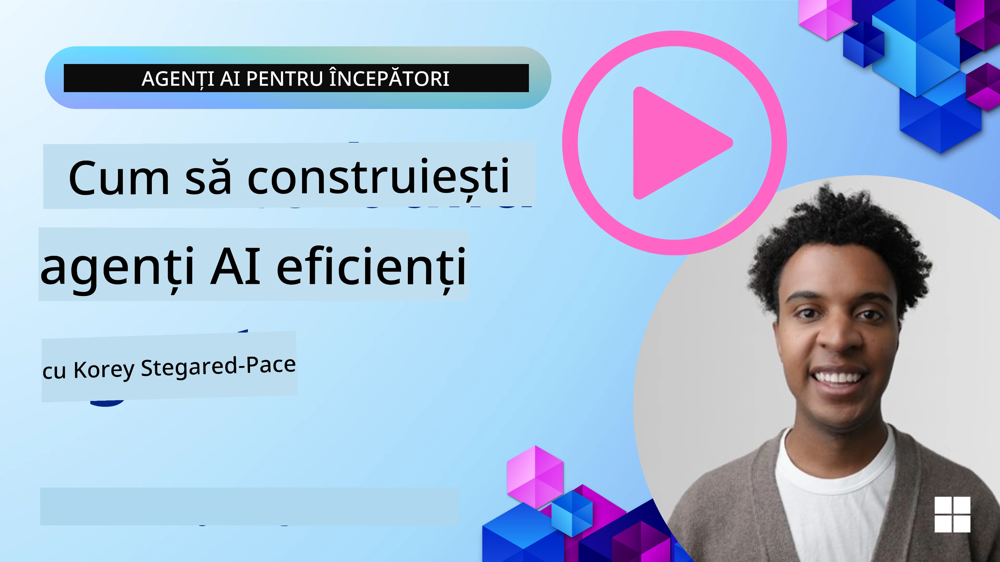
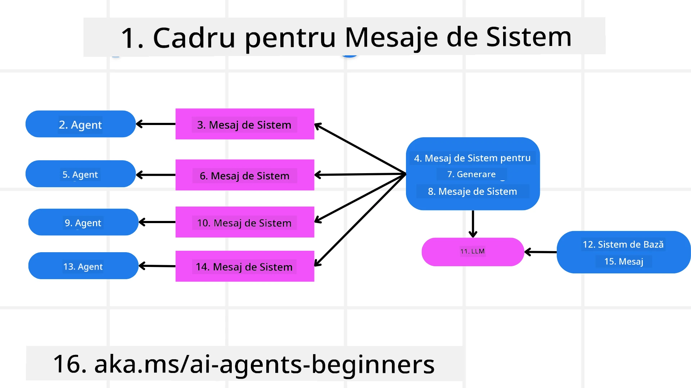
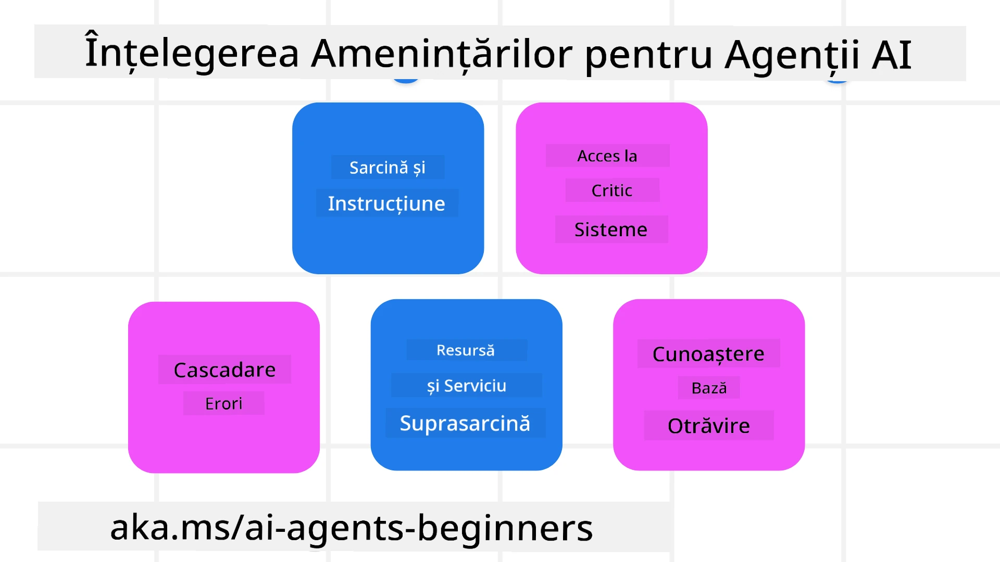
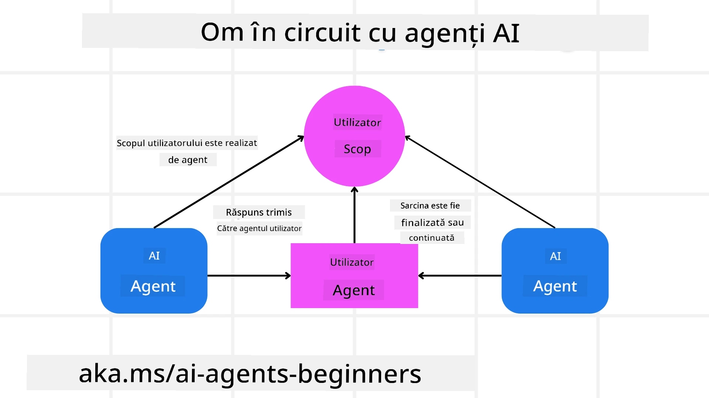

[](https://youtu.be/iZKkMEGBCUQ?si=Q-kEbcyHUMPoHp8L)

> _(Faceți clic pe imaginea de mai sus pentru a viziona videoclipul acestei lecții)_

# Construirea agenților AI de încredere

## Introducere

Această lecție va acoperi:

- Cum să construim și să implementăm agenți AI siguri și eficienți
- Considerații importante de securitate în dezvoltarea agenților AI.
- Cum să menținem confidențialitatea datelor și a utilizatorilor în dezvoltarea agenților AI.

## Obiectivele de învățare

După finalizarea acestei lecții, veți ști cum să:

- Identificați și să atenuați riscurile la crearea agenților AI.
- Implementați măsuri de securitate pentru a asigura gestionarea corectă a datelor și accesului.
- Creați agenți AI care mențin confidențialitatea datelor și oferă o experiență de utilizare de calitate.

## Siguranță

Să începem prin a analiza construirea aplicațiilor agentice sigure. Siguranța înseamnă că agentul AI funcționează conform proiectului. Ca dezvoltatori de aplicații agentice, avem metode și instrumente pentru a maximiza siguranța:

### Construirea unui Cadru pentru Mesaje de Sistem

Dacă ați construit vreodată o aplicație AI folosind Modele Mari de Limbaj (LLM-uri), știți cât de important este să proiectați un prompt robust de sistem sau un mesaj de sistem. Aceste prompturi stabilesc regulile meta, instrucțiunile și ghidurile privind modul în care LLM-ul va interacționa cu utilizatorul și datele.

Pentru Agenții AI, promptul de sistem este și mai important deoarece agenții AI vor avea nevoie de instrucțiuni foarte specifice pentru a îndeplini sarcinile pe care le-am proiectat pentru ei.

Pentru a crea prompturi de sistem scalabile, putem folosi un cadru de mesaje de sistem pentru construirea unuia sau mai multor agenți în aplicația noastră:



#### Pasul 1: Crearea unui Mesaj Meta de Sistem 

Promptul meta va fi utilizat de un LLM pentru a genera prompturile de sistem pentru agenții pe care îi creăm. Îl proiectăm ca un șablon pentru a putea crea eficient mai mulți agenți, dacă este necesar.

Iată un exemplu de mesaj meta de sistem pe care l-am oferi LLM-ului:

```plaintext
You are an expert at creating AI agent assistants. 
You will be provided a company name, role, responsibilities and other
information that you will use to provide a system prompt for.
To create the system prompt, be descriptive as possible and provide a structure that a system using an LLM can better understand the role and responsibilities of the AI assistant. 
```

#### Pasul 2: Crearea unui prompt de bază

Următorul pas este să creați un prompt de bază pentru a descrie agentul AI. Trebuie să includeți rolul agentului, sarcinile pe care le va îndeplini agentul și orice alte responsabilități ale acestuia.

Iată un exemplu:

```plaintext
You are a travel agent for Contoso Travel that is great at booking flights for customers. To help customers you can perform the following tasks: lookup available flights, book flights, ask for preferences in seating and times for flights, cancel any previously booked flights and alert customers on any delays or cancellations of flights.  
```

#### Pasul 3: Furnizarea mesajului de sistem de bază către LLM

Acum putem optimiza acest mesaj de sistem oferind mesajul meta de sistem ca mesaj de sistem și mesajul nostru de sistem de bază.

Aceasta va genera un mesaj de sistem mai bine conceput pentru a ghida agenții AI:

```markdown
**Company Name:** Contoso Travel  
**Role:** Travel Agent Assistant

**Objective:**  
You are an AI-powered travel agent assistant for Contoso Travel, specializing in booking flights and providing exceptional customer service. Your main goal is to assist customers in finding, booking, and managing their flights, all while ensuring that their preferences and needs are met efficiently.

**Key Responsibilities:**

1. **Flight Lookup:**
    
    - Assist customers in searching for available flights based on their specified destination, dates, and any other relevant preferences.
    - Provide a list of options, including flight times, airlines, layovers, and pricing.
2. **Flight Booking:**
    
    - Facilitate the booking of flights for customers, ensuring that all details are correctly entered into the system.
    - Confirm bookings and provide customers with their itinerary, including confirmation numbers and any other pertinent information.
3. **Customer Preference Inquiry:**
    
    - Actively ask customers for their preferences regarding seating (e.g., aisle, window, extra legroom) and preferred times for flights (e.g., morning, afternoon, evening).
    - Record these preferences for future reference and tailor suggestions accordingly.
4. **Flight Cancellation:**
    
    - Assist customers in canceling previously booked flights if needed, following company policies and procedures.
    - Notify customers of any necessary refunds or additional steps that may be required for cancellations.
5. **Flight Monitoring:**
    
    - Monitor the status of booked flights and alert customers in real-time about any delays, cancellations, or changes to their flight schedule.
    - Provide updates through preferred communication channels (e.g., email, SMS) as needed.

**Tone and Style:**

- Maintain a friendly, professional, and approachable demeanor in all interactions with customers.
- Ensure that all communication is clear, informative, and tailored to the customer's specific needs and inquiries.

**User Interaction Instructions:**

- Respond to customer queries promptly and accurately.
- Use a conversational style while ensuring professionalism.
- Prioritize customer satisfaction by being attentive, empathetic, and proactive in all assistance provided.

**Additional Notes:**

- Stay updated on any changes to airline policies, travel restrictions, and other relevant information that could impact flight bookings and customer experience.
- Use clear and concise language to explain options and processes, avoiding jargon where possible for better customer understanding.

This AI assistant is designed to streamline the flight booking process for customers of Contoso Travel, ensuring that all their travel needs are met efficiently and effectively.

```

#### Pasul 4: Iterare și îmbunătățire

Valoarea acestui cadru de mesaje de sistem este posibilitatea de a scala mai ușor crearea mesajelor de sistem pentru mai mulți agenți, precum și de a vă îmbunătăți mesajele de sistem în timp. Este rar să aveți un mesaj de sistem care să funcționeze perfect din prima pentru cazul complet de utilizare. Posibilitatea de a face mici ajustări și îmbunătățiri schimbând mesajul de bază și rulându-l prin sistem vă va permite să comparați și să evaluați rezultatele.

## Înțelegerea amenințărilor

Pentru a construi agenți AI de încredere, este important să înțelegeți și să atenuați riscurile și amenințările la adresa agentului AI. Să analizăm doar câteva dintre diferitele amenințări pentru agenții AI și cum vă puteți planifica și pregăti mai bine pentru ele.



### Sarcină și Instrucțiune

**Descriere:** Atacanții încearcă să modifice instrucțiunile sau obiectivele agentului AI prin prompting sau manipularea intrărilor.

**Atenuare**: Efectuați verificări de validare și filtre de intrare pentru a detecta prompturi potențial periculoase înainte ca acestea să fie procesate de agentul AI. Deoarece aceste atacuri implică, de obicei, interacțiuni frecvente cu agentul, limitarea numărului de schimburi într-o conversație este o altă modalitate de a preveni acest tip de atacuri.

### Acces la Sisteme Critice

**Descriere:** Dacă un agent AI are acces la sisteme și servicii care stochează date sensibile, atacatorii pot compromite comunicația dintre agent și aceste servicii. Acestea pot fi atacuri directe sau încercări indirecte de a obține informații despre aceste sisteme prin agent.

**Atenuare:** Agenții AI ar trebui să aibă acces la sisteme doar pe bază de necesitate pentru a preveni acest tip de atacuri. Comunicația dintre agent și sistem trebuie să fie, de asemenea, securizată. Implementarea autentificării și controlului accesului este o altă metodă de a proteja aceste informații.

### Supraîncărcarea Resurselor și Serviciilor

**Descriere:** Agenții AI pot accesa diverse instrumente și servicii pentru a îndeplini sarcini. Atacatorii pot utiliza această abilitate pentru a ataca aceste servicii prin trimiterea unui volum mare de cereri prin agentul AI, ceea ce poate duce la defectarea sistemului sau costuri ridicate.

**Atenuare:** Implementați politici pentru a limita numărul de cereri pe care un agent AI le poate face către un serviciu. Limitarea numărului de schimburi în conversație și a cererilor către agentul AI este o altă modalitate de a preveni acest tip de atacuri.

### Otrăvirea bazei de cunoștințe

**Descriere:** Acest tip de atac nu vizează direct agentul AI, ci țintește baza de cunoștințe și alte servicii pe care agentul AI le va utiliza. Acesta poate implica coruperea datelor sau informațiilor pe care agentul AI le va folosi pentru a îndeplini o sarcină, conducând la răspunsuri părtinitoare sau neintenționate către utilizator.

**Atenuare:** Efectuați verificări regulate ale datelor pe care agentul AI le va utiliza în fluxurile de lucru. Asigurați-vă că accesul la aceste date este securizat și modificat doar de persoane de încredere pentru a evita acest tip de atacuri.

### Erori în cascadă

**Descriere:** Agenții AI accesează diverse instrumente și servicii pentru a finaliza sarcini. Erorile cauzate de atacatori pot duce la defectarea altor sisteme la care agentul AI este conectat, făcând atacul mai răspândit și mai dificil de diagnosticat.

**Atenuare**: O metodă de a evita acest lucru este ca agentul AI să opereze într-un mediu limitat, cum ar fi executarea sarcinilor într-un container Docker, pentru a preveni atacurile directe asupra sistemului. Crearea unor mecanisme de rezervă și logică de reîncercare atunci când anumite sisteme răspund cu o eroare reprezintă o altă modalitate de a preveni defecțiuni mai mari ale sistemului.

## Omul în buclă

O altă modalitate eficientă de a construi sisteme de agenți AI de încredere este folosirea unui Om în buclă (Human-in-the-loop). Aceasta creează un flux unde utilizatorii pot oferi feedback agenților în timpul execuției. Utilizatorii acționează practic ca agenți într-un sistem multi-agent, oferind aprobări sau întreruperea procesului în derulare.



Iată un fragment de cod folosind Microsoft Agent Framework pentru a arăta cum este implementat acest concept:

```python
import os
from agent_framework.azure import AzureAIProjectAgentProvider
from azure.identity import AzureCliCredential

# Creați furnizorul cu aprobare umană în buclă
provider = AzureAIProjectAgentProvider(
    credential=AzureCliCredential(),
)

# Creați agentul cu un pas de aprobare umană
response = provider.create_response(
    input="Write a 4-line poem about the ocean.",
    instructions="You are a helpful assistant. Ask for user approval before finalizing.",
)

# Utilizatorul poate revizui și aproba răspunsul
print(response.output_text)
user_input = input("Do you approve? (APPROVE/REJECT): ")
if user_input == "APPROVE":
    print("Response approved.")
else:
    print("Response rejected. Revising...")
```

## Concluzie

Construirea agenților AI de încredere necesită un design atent, măsuri robuste de securitate și iterații continue. Prin implementarea sistemelor structurate de meta prompting, înțelegerea amenințărilor potențiale și aplicarea strategiilor de atenuare, dezvoltatorii pot crea agenți AI care sunt atât siguri, cât și eficienți. În plus, încorporarea unei abordări cu omul în buclă asigură că agenții AI rămân aliniați la nevoile utilizatorilor, minimizând în același timp riscurile. Pe măsură ce AI-ul continuă să evolueze, menținerea unei poziții proactive privind securitatea, confidențialitatea și considerentele etice va fi cheia pentru a promova încrederea și fiabilitatea sistemelor bazate pe AI.

## Exemple de cod

- [`code_samples/06-system-message-framework.ipynb`](code_samples/06-system-message-framework.ipynb): Demonstrație pas cu pas a cadrului sistemului de mesaje meta-prompt.
- [`code_samples/06-human-in-the-loop.ipynb`](code_samples/06-human-in-the-loop.ipynb): Porți de aprobare pre-acțiune, clasificarea riscurilor și înregistrarea auditurilor pentru agenți de încredere.

### Aveți mai multe întrebări despre construirea agenților AI de încredere?

Alăturați-vă [Microsoft Foundry Discord](https://aka.ms/ai-agents/discord) pentru a întâlni alți participanți, a participa la ore de consultanță și a primi răspunsuri la întrebările despre agenții AI.

## Resurse suplimentare

- <a href="https://learn.microsoft.com/azure/ai-studio/responsible-use-of-ai-overview" target="_blank">Prezentare generală AI responsabil</a>
- <a href="https://learn.microsoft.com/azure/ai-studio/concepts/evaluation-approach-gen-ai" target="_blank">Evaluarea modelelor și aplicațiilor AI generative</a>
- <a href="https://learn.microsoft.com/azure/ai-services/openai/concepts/system-message?context=%2Fazure%2Fai-studio%2Fcontext%2Fcontext&tabs=top-techniques" target="_blank">Mesaje de sistem pentru siguranță</a>
- <a href="https://blogs.microsoft.com/wp-content/uploads/prod/sites/5/2022/06/Microsoft-RAI-Impact-Assessment-Template.pdf?culture=en-us&country=us" target="_blank">Șablon de evaluare a riscurilor</a>

## Lecția anterioară

[Agentic RAG](../05-agentic-rag/README.md)

## Lecția următoare

[Modelul de proiectare Planning](../07-planning-design/README.md)

---

<!-- CO-OP TRANSLATOR DISCLAIMER START -->
**Declinare a responsabilității**:
Acest document a fost tradus folosind serviciul de traducere AI [Co-op Translator](https://github.com/Azure/co-op-translator). În timp ce ne străduim pentru acuratețe, vă rugăm să rețineți că traducerile automate pot conține erori sau inexactități. Documentul original în limba sa nativă trebuie considerat sursa autorizată. Pentru informații critice, se recomandă traducerea profesională realizată de un om. Nu ne asumăm responsabilitatea pentru eventualele neînțelegeri sau interpretări greșite care decurg din utilizarea acestei traduceri.
<!-- CO-OP TRANSLATOR DISCLAIMER END -->