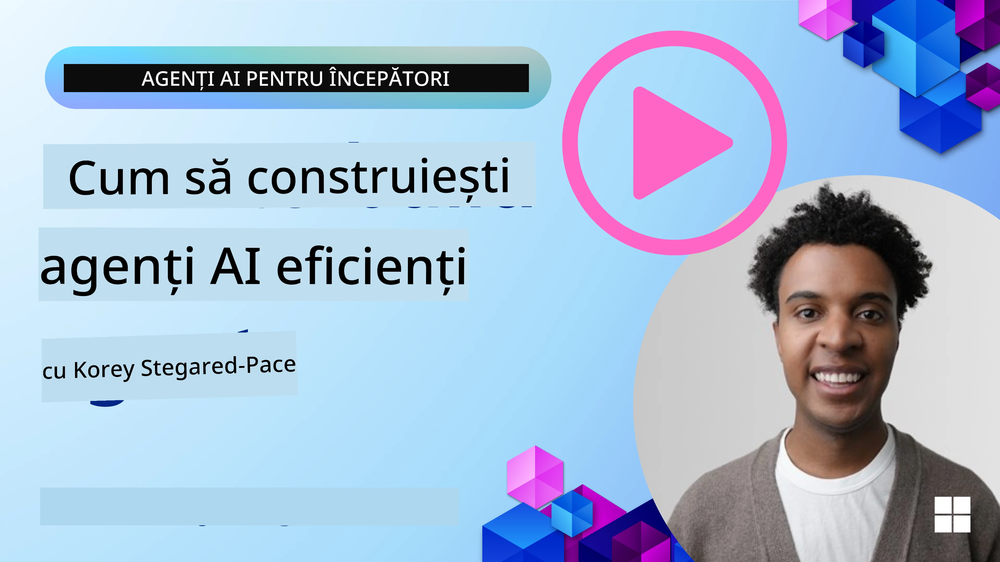
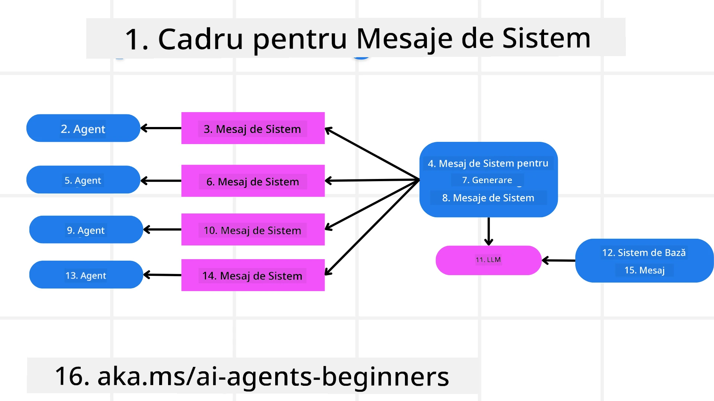
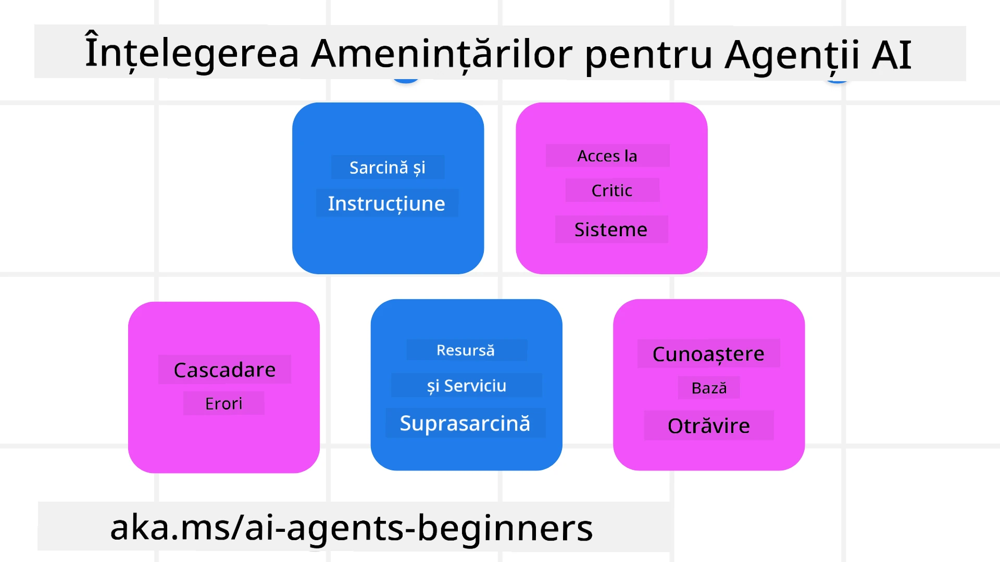
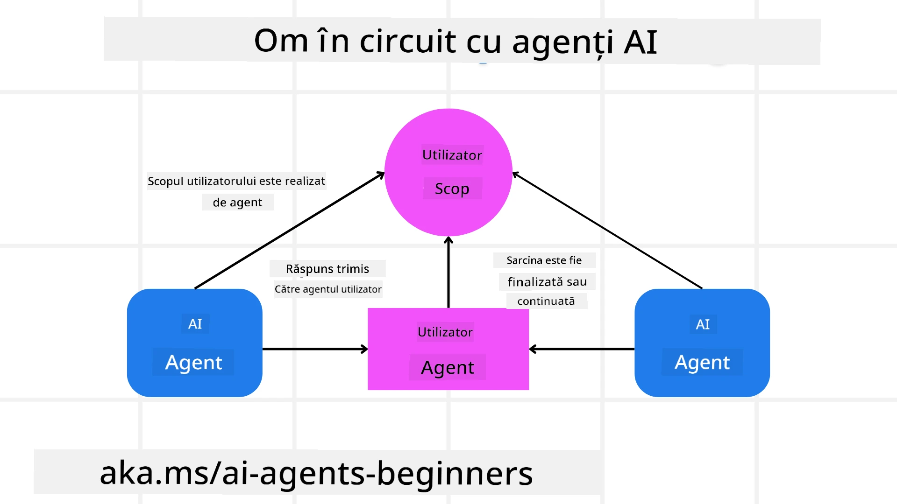

[](https://youtu.be/iZKkMEGBCUQ?si=Q-kEbcyHUMPoHp8L)

> _(Faceți clic pe imaginea de mai sus pentru a viziona videoclipul acestei lecții)_

# Construirea Agenților AI de Încredere

## Introducere

Această lecție va acoperi:

- Cum să construiești și să implementezi agenți AI siguri și eficienți
- Considerații importante de securitate în dezvoltarea agenților AI.
- Cum să menții confidențialitatea datelor și a utilizatorilor în dezvoltarea agenților AI.

## Obiective de Învățare

După finalizarea acestei lecții, vei ști cum să:

- Identifici și să atenuezi riscurile când creezi agenți AI.
- Implementezi măsuri de securitate pentru a asigura gestionarea corectă a datelor și accesului.
- Creezi agenți AI care să mențină confidențialitatea datelor și să ofere o experiență calitativă utilizatorului.

## Siguranță

Mai întâi să ne uităm la construirea aplicațiilor agentice sigure. Siguranța înseamnă că agentul AI funcționează conform designului. Ca dezvoltatori ai aplicațiilor agentice, avem metode și instrumente pentru a maximiza siguranța:

### Construirea unui Cadru pentru Mesaje de Sistem

Dacă ai construit vreodată o aplicație AI folosind Modele Mari de Limbaj (LLM), știi importanța proiectării unui prompt sau mesaj de sistem robust. Aceste prompturi stabilesc regulile meta, instrucțiunile și ghidurile pentru modul în care LLM va interacționa cu utilizatorul și datele.

Pentru agenții AI, promptul de sistem este și mai important deoarece agenții AI vor avea nevoie de instrucțiuni extrem de specifice pentru a îndeplini sarcinile pe care le-am conceput pentru ei.

Pentru a crea prompturi de sistem scalabile, putem utiliza un cadru de mesaje de sistem pentru construirea unuia sau mai mulți agenți în aplicația noastră:



#### Pasul 1: Creează un Mesaj Meta de Sistem

Promptul meta va fi folosit de un LLM pentru a genera prompturile de sistem pentru agenții pe care îi creăm. Îl proiectăm ca un șablon astfel încât să putem crea eficient mai mulți agenți dacă este nevoie.

Iată un exemplu de mesaj meta de sistem pe care l-am da LLM-ului:

```plaintext
You are an expert at creating AI agent assistants. 
You will be provided a company name, role, responsibilities and other
information that you will use to provide a system prompt for.
To create the system prompt, be descriptive as possible and provide a structure that a system using an LLM can better understand the role and responsibilities of the AI assistant. 
```

#### Pasul 2: Creează un prompt de bază

Următorul pas este să creezi un prompt de bază pentru a descrie agentul AI. Ar trebui să incluzi rolul agentului, sarcinile pe care agentul le va îndeplini și orice alte responsabilități ale agentului.

Iată un exemplu:

```plaintext
You are a travel agent for Contoso Travel that is great at booking flights for customers. To help customers you can perform the following tasks: lookup available flights, book flights, ask for preferences in seating and times for flights, cancel any previously booked flights and alert customers on any delays or cancellations of flights.  
```

#### Pasul 3: Furnizează Mesajul de Sistem de Bază către LLM

Acum putem optimiza acest mesaj de sistem oferind mesajul meta ca mesaj de sistem și mesajul nostru de sistem de bază.

Aceasta va produce un mesaj de sistem mai bine conceput pentru a ghida agenții noștri AI:

```markdown
**Company Name:** Contoso Travel  
**Role:** Travel Agent Assistant

**Objective:**  
You are an AI-powered travel agent assistant for Contoso Travel, specializing in booking flights and providing exceptional customer service. Your main goal is to assist customers in finding, booking, and managing their flights, all while ensuring that their preferences and needs are met efficiently.

**Key Responsibilities:**

1. **Flight Lookup:**
    
    - Assist customers in searching for available flights based on their specified destination, dates, and any other relevant preferences.
    - Provide a list of options, including flight times, airlines, layovers, and pricing.
2. **Flight Booking:**
    
    - Facilitate the booking of flights for customers, ensuring that all details are correctly entered into the system.
    - Confirm bookings and provide customers with their itinerary, including confirmation numbers and any other pertinent information.
3. **Customer Preference Inquiry:**
    
    - Actively ask customers for their preferences regarding seating (e.g., aisle, window, extra legroom) and preferred times for flights (e.g., morning, afternoon, evening).
    - Record these preferences for future reference and tailor suggestions accordingly.
4. **Flight Cancellation:**
    
    - Assist customers in canceling previously booked flights if needed, following company policies and procedures.
    - Notify customers of any necessary refunds or additional steps that may be required for cancellations.
5. **Flight Monitoring:**
    
    - Monitor the status of booked flights and alert customers in real-time about any delays, cancellations, or changes to their flight schedule.
    - Provide updates through preferred communication channels (e.g., email, SMS) as needed.

**Tone and Style:**

- Maintain a friendly, professional, and approachable demeanor in all interactions with customers.
- Ensure that all communication is clear, informative, and tailored to the customer's specific needs and inquiries.

**User Interaction Instructions:**

- Respond to customer queries promptly and accurately.
- Use a conversational style while ensuring professionalism.
- Prioritize customer satisfaction by being attentive, empathetic, and proactive in all assistance provided.

**Additional Notes:**

- Stay updated on any changes to airline policies, travel restrictions, and other relevant information that could impact flight bookings and customer experience.
- Use clear and concise language to explain options and processes, avoiding jargon where possible for better customer understanding.

This AI assistant is designed to streamline the flight booking process for customers of Contoso Travel, ensuring that all their travel needs are met efficiently and effectively.

```

#### Pasul 4: Iterează și îmbunătățește

Valoarea acestui cadru de mesaje de sistem este să putem scala crearea mesajelor de sistem pentru mai mulți agenți mai ușor, precum și să ne îmbunătățim mesajele de sistem în timp. Este rar ca un mesaj de sistem să funcționeze perfect de prima dată pentru cazul tău complet de utilizare. Posibilitatea de a face ajustări mici și îmbunătățiri schimbând mesajul de sistem de bază și rulându-l prin sistem îți va permite să compari și să evaluezi rezultatele.

## Înțelegerea Amenințărilor

Pentru a construi agenți AI de încredere, este important să înțelegem și să atenuăm riscurile și amenințările față de agentul AI. Să vedem doar câteva dintre diferitele amenințări la adresa agenților AI și cum poți planifica și pregăti mai bine pentru ele.



### Sarcină și Instrucțiuni

**Descriere:** Atacatorii încearcă să schimbe instrucțiunile sau obiectivele agentului AI prin prompturi sau manipularea intrărilor.

**Atenuare:** Efectuarea verificărilor de validare și a filtrelor de intrare pentru a detecta prompturi potențial periculoase înainte ca acestea să fie procesate de agentul AI. Deoarece astfel de atacuri necesită de obicei interacțiune frecventă cu agentul, limitarea numărului de ture într-o conversație este o altă metodă de a preveni acest tip de atacuri.

### Acces la Sisteme Critice

**Descriere:** Dacă un agent AI are acces la sisteme și servicii care stochează date sensibile, atacatorii pot compromite comunicația dintre agent și aceste servicii. Acestea pot fi atacuri directe sau tentative indirecte de a obține informații despre aceste sisteme prin agent.

**Atenuare:** Agenții AI ar trebui să aibă acces la sisteme doar pe bază de necesitate pentru a preveni astfel de atacuri. De asemenea, comunicația dintre agent și sistem ar trebui să fie securizată. Implementarea autentificării și controlului accesului este o altă modalitate de a proteja aceste informații.

### Supraîncărcarea Resurselor și Serviciilor

**Descriere:** Agenții AI pot accesa diferite unelte și servicii pentru a îndeplini sarcini. Atacatorii pot folosi această capacitate pentru a ataca aceste servicii prin trimiterea unui volum mare de solicitări prin agentul AI, ceea ce poate duce la întreruperi de sistem sau costuri ridicate.

**Atenuare:** Implementarea politicilor pentru a limita numărul de solicitări pe care un agent AI le poate face unui serviciu. Limitarea numărului de ture de conversație și cereri către agentul AI este o altă metodă de a preveni astfel de atacuri.

### Otravirea Bazei de Cunoștințe

**Descriere:** Acest tip de atac nu vizează direct agentul AI, ci baza de cunoștințe și alte servicii pe care agentul AI le va utiliza. Aceasta poate implica coruperea datelor sau informațiilor cu care agentul AI va lucra pentru a îndeplini o sarcină, conducând la răspunsuri părtinitoare sau neintenționate către utilizator.

**Atenuare:** Efectuează verificări regulate ale datelor pe care agentul AI le folosește în fluxurile de lucru. Asigură-te că accesul la aceste date este securizat și că poate fi modificat doar de persoane de încredere pentru a evita acest tip de atac.

### Erori în Cascadă

**Descriere:** Agenții AI accesează diverse unelte și servicii pentru a îndeplini sarcini. Erorile cauzate de atacatori pot conduce la defecțiuni a altor sisteme la care agentul AI este conectat, făcând ca atacul să se extindă și să fie mai greu de diagnosticat.

**Atenuare:** Un mod de a evita acest lucru este ca agentul AI să opereze într-un mediu limitat, cum ar fi efectuarea sarcinilor într-un container Docker, pentru a preveni atacurile directe asupra sistemului. Crearea mecanismelor de fallback și a logicii de retry când anumite sisteme răspund cu eroare este o altă metodă de prevenire a defecțiunilor majore.

## Om în Buclă (Human-in-the-Loop)

O altă metodă eficientă de a construi sisteme de agenți AI de încredere este utilizarea unui sistem cu om în buclă. Aceasta creează un flux în care utilizatorii pot oferi feedback agenților în timpul desfășurării procesului. Utilizatorii acționează practic ca agenți într-un sistem multi-agent, oferind aprobare sau întreruperea procesului în curs.



Iată un fragment de cod folosind Microsoft Agent Framework pentru a arăta cum este implementat acest concept:

```python
import os
from agent_framework.azure import AzureAIProjectAgentProvider
from azure.identity import AzureCliCredential

# Creează furnizorul cu aprobare umană interactivă
provider = AzureAIProjectAgentProvider(
    credential=AzureCliCredential(),
)

# Creează agentul cu o etapă de aprobare umană
response = provider.create_response(
    input="Write a 4-line poem about the ocean.",
    instructions="You are a helpful assistant. Ask for user approval before finalizing.",
)

# Utilizatorul poate revizui și aproba răspunsul
print(response.output_text)
user_input = input("Do you approve? (APPROVE/REJECT): ")
if user_input == "APPROVE":
    print("Response approved.")
else:
    print("Response rejected. Revising...")
```

## Concluzie

Construirea agenților AI de încredere necesită o proiectare atentă, măsuri robuste de securitate și iterații continue. Prin implementarea sistemelor structurate de meta-prompturi, înțelegerea amenințărilor potențiale și aplicarea strategiilor de atenuare, dezvoltatorii pot crea agenți AI care sunt atât siguri, cât și eficienți. În plus, încorporarea unei abordări cu om în buclă asigură că agenții AI rămân aliniați la nevoile utilizatorilor, reducând riscurile. Pe măsură ce AI continuă să evolueze, menținerea unei poziții proactive în ceea ce privește securitatea, confidențialitatea și considerațiile etice va fi cheia pentru a cultiva încredere și fiabilitate în sistemele bazate pe AI.

## Exemple de Cod

- [`code_samples/06-system-message-framework.ipynb`](code_samples/06-system-message-framework.ipynb): Demonstrație pas cu pas a cadrului de mesaje de sistem meta-prompt.
- [`code_samples/06-human-in-the-loop.ipynb`](code_samples/06-human-in-the-loop.ipynb): Porți de aprobare pre-acțiune, ierarhizarea riscurilor și auditul log-urilor pentru agenți de încredere.

### Mai Ai Întrebări despre Construirea Agenților AI de Încredere?

Alătură-te [Microsoft Foundry Discord](https://discord.com/invite/ATgtXmAS5D) pentru a întâlni alți cursanți, a participa la ore de birou și a primi răspunsuri la întrebările tale despre Agenții AI.

## Resurse Suplimentare

- <a href="https://learn.microsoft.com/azure/ai-studio/responsible-use-of-ai-overview" target="_blank">Prezentare generală AI responsabil</a>
- <a href="https://learn.microsoft.com/azure/ai-studio/concepts/evaluation-approach-gen-ai" target="_blank">Evaluarea modelelor generative AI și aplicațiilor AI</a>
- <a href="https://learn.microsoft.com/azure/ai-services/openai/concepts/system-message?context=%2Fazure%2Fai-studio%2Fcontext%2Fcontext&tabs=top-techniques" target="_blank">Mesaje de sistem pentru siguranță</a>
- <a href="https://blogs.microsoft.com/wp-content/uploads/prod/sites/5/2022/06/Microsoft-RAI-Impact-Assessment-Template.pdf?culture=en-us&country=us" target="_blank">Șablon de evaluare a riscurilor</a>

## Lecția Anterioară

[Agentic RAG](../05-agentic-rag/README.md)

## Lecția Următoare

[Design Pattern pentru Planificare](../07-planning-design/README.md)

---

<!-- CO-OP TRANSLATOR DISCLAIMER START -->
**Declinare a responsabilității**:
Acest document a fost tradus folosind serviciul de traducere AI [Co-op Translator](https://github.com/Azure/co-op-translator). În timp ce ne străduim pentru acuratețe, vă rugăm să rețineți că traducerile automate pot conține erori sau inexactități. Documentul original în limba sa nativă trebuie considerat sursa autorizată. Pentru informații critice, se recomandă traducerea profesională realizată de un om. Nu ne asumăm responsabilitatea pentru eventualele neînțelegeri sau interpretări greșite care decurg din utilizarea acestei traduceri.
<!-- CO-OP TRANSLATOR DISCLAIMER END -->