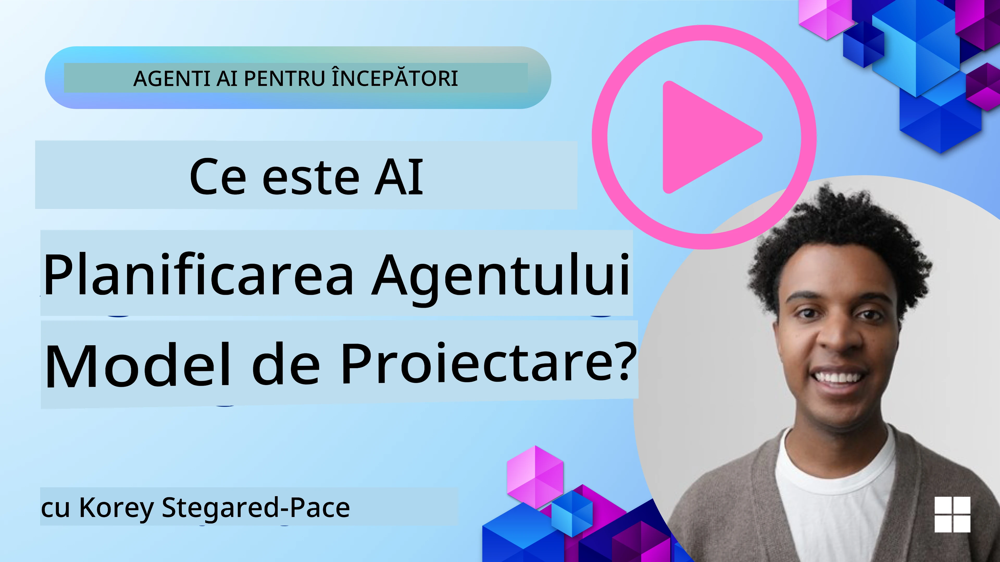
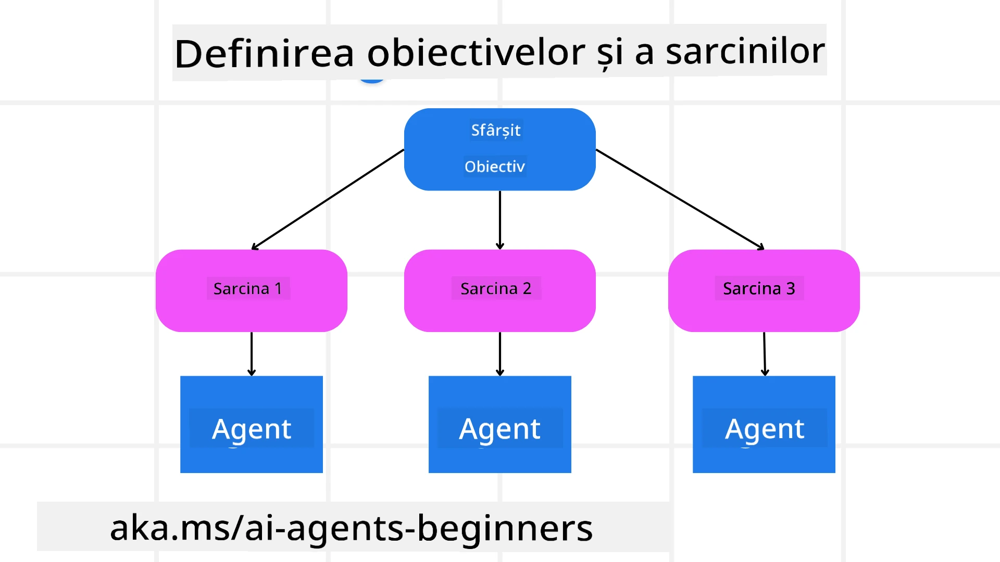

[](https://youtu.be/kPfJ2BrBCMY?si=9pYpPXp0sSbK91Dr)

> _(Faceți clic pe imaginea de mai sus pentru a vizualiza videoclipul acestei lecții)_

# Modelul de planificare

## Introducere

Această lecție va acoperi

* Definirea unui obiectiv general clar și descompunerea unei sarcini complexe în sarcini gestionabile.
* Valorificarea unei ieșiri structurate pentru răspunsuri mai fiabile și mai ușor de procesat de mașini.
* Aplicarea unei abordări orientate pe evenimente pentru a gestiona sarcini dinamice și intrări neașteptate.

## Obiective de învățare

După finalizarea acestei lecții, veți înțelege:

* Identificarea și stabilirea unui obiectiv general pentru un agent AI, asigurându-vă că acesta știe clar ce trebuie realizat.
* Decompozarea unei sarcini complexe în subtasks gestionabile și organizarea lor într-o secvență logică.
* Echiparea agenților cu instrumentele potrivite (de ex., instrumente de căutare sau instrumente de analiză a datelor), deciderea când și cum sunt utilizate și gestionarea situațiilor neașteptate care apar.
* Evaluarea rezultatelor subtask-urilor, măsurarea performanței și iterarea acțiunilor pentru a îmbunătăți rezultatul final.

## Definirea obiectivului general și descompunerea unei sarcini



Majoritatea sarcinilor din lumea reală sunt prea complexe pentru a fi abordate într-un singur pas. Un agent AI are nevoie de un obiectiv concis pentru a-i ghida planificarea și acțiunile. De exemplu, luați în considerare obiectivul:

    "Generați un itinerar de călătorie pentru 3 zile."

Deși este simplu de enunțat, încă necesită rafinare. Cu cât obiectivul este mai clar, cu atât agentul (și orice colaboratori umani) se pot concentra mai bine pe realizarea rezultatului corect, cum ar fi crearea unui itinerar cuprinzător cu opțiuni de zbor, recomandări de hoteluri și sugestii de activități.

### Decompozarea sarcinii

Sarcinile mari sau complexe devin mai gestionabile atunci când sunt împărțite în subtasks mai mici, orientate pe obiective.
Pentru exemplul itinerarului de călătorie, ați putea decomprima obiectivul în:

* Rezervare zboruri
* Rezervare hotel
* Închiriere mașină
* Personalizare

Fiecare subtask poate fi abordat apoi de agenți sau procese dedicate. Un agent s-ar putea specializa în căutarea celor mai bune oferte la zboruri, altul se concentrează pe rezervări de hoteluri și așa mai departe. Un agent de coordonare sau „downstream” poate apoi să compileze aceste rezultate într-un itinerar coerent pentru utilizatorul final.

Această abordare modulară permite, de asemenea, îmbunătățiri incrementale. De exemplu, ați putea adăuga agenți specializați pentru Recomandări de mâncare sau Sugestii de activități locale și să rafinați itinerarul în timp.

### Ieșire structurată

Modelele mari de limbaj (LLMs) pot genera ieșiri structurate (de ex. JSON) care sunt mai ușor de analizat și procesat de agenți sau servicii downstream. Acest lucru este deosebit de util într-un context multi-agent, unde putem executa aceste sarcini după primirea ieșirii de planificare.

Fragmentul Python următor demonstrează un agent simplu de planificare care descompune un obiectiv în subtasks și generează un plan structurat:

```python
from pydantic import BaseModel
from enum import Enum
from typing import List, Optional, Union
import json
import os
from typing import Optional
from pprint import pprint
from agent_framework.azure import AzureAIProjectAgentProvider
from azure.identity import AzureCliCredential

class AgentEnum(str, Enum):
    FlightBooking = "flight_booking"
    HotelBooking = "hotel_booking"
    CarRental = "car_rental"
    ActivitiesBooking = "activities_booking"
    DestinationInfo = "destination_info"
    DefaultAgent = "default_agent"
    GroupChatManager = "group_chat_manager"

# Model de sub-sarcină de călătorie
class TravelSubTask(BaseModel):
    task_details: str
    assigned_agent: AgentEnum  # dorim să atribuim sarcina agentului

class TravelPlan(BaseModel):
    main_task: str
    subtasks: List[TravelSubTask]
    is_greeting: bool

provider = AzureAIProjectAgentProvider(credential=AzureCliCredential())

# Definiți mesajul utilizatorului
system_prompt = """You are a planner agent.
    Your job is to decide which agents to run based on the user's request.
    Provide your response in JSON format with the following structure:
{'main_task': 'Plan a family trip from Singapore to Melbourne.',
 'subtasks': [{'assigned_agent': 'flight_booking',
               'task_details': 'Book round-trip flights from Singapore to '
                               'Melbourne.'}
    Below are the available agents specialised in different tasks:
    - FlightBooking: For booking flights and providing flight information
    - HotelBooking: For booking hotels and providing hotel information
    - CarRental: For booking cars and providing car rental information
    - ActivitiesBooking: For booking activities and providing activity information
    - DestinationInfo: For providing information about destinations
    - DefaultAgent: For handling general requests"""

user_message = "Create a travel plan for a family of 2 kids from Singapore to Melbourne"

response = client.create_response(input=user_message, instructions=system_prompt)

response_content = response.output_text
pprint(json.loads(response_content))
```

### Agent de planificare cu orchestrare multi-agent

În acest exemplu, un Agent de rutare semantică primește o solicitare a utilizatorului (de ex., "Am nevoie de un plan de hotel pentru călătoria mea.").

Planner-ul apoi:

* Primește Planul de Hotel: Planner-ul preia mesajul utilizatorului și, pe baza unui prompt de sistem (inclusiv detalii despre agenții disponibili), generează un plan de călătorie structurat.
* Listează agenții și instrumentele lor: Registrul de agenți conține o listă de agenți (de ex., pentru zboruri, hoteluri, închiriere mașini și activități) împreună cu funcțiile sau instrumentele pe care le oferă.
* Direcționează planul către agenții respectivi: În funcție de numărul de subtasks, planner-ul fie trimite mesajul direct către un agent dedicat (pentru scenarii cu o singură sarcină), fie coordonează printr-un manager de chat de tip grup pentru colaborare multi-agent.
* Rezumă rezultatul: În final, planner-ul rezumă planul generat pentru claritate.
Următorul exemplu de cod Python ilustrează acești pași:

```python

from pydantic import BaseModel

from enum import Enum
from typing import List, Optional, Union

class AgentEnum(str, Enum):
    FlightBooking = "flight_booking"
    HotelBooking = "hotel_booking"
    CarRental = "car_rental"
    ActivitiesBooking = "activities_booking"
    DestinationInfo = "destination_info"
    DefaultAgent = "default_agent"
    GroupChatManager = "group_chat_manager"

# Model sub-sarcină pentru călătorie

class TravelSubTask(BaseModel):
    task_details: str
    assigned_agent: AgentEnum # vrem să atribuim sarcina agentului

class TravelPlan(BaseModel):
    main_task: str
    subtasks: List[TravelSubTask]
    is_greeting: bool
import json
import os
from typing import Optional

from agent_framework.azure import AzureAIProjectAgentProvider
from azure.identity import AzureCliCredential

# Creează clientul

provider = AzureAIProjectAgentProvider(credential=AzureCliCredential())

from pprint import pprint

# Definește mesajul utilizatorului

system_prompt = """You are a planner agent.
    Your job is to decide which agents to run based on the user's request.
    Below are the available agents specialized in different tasks:
    - FlightBooking: For booking flights and providing flight information
    - HotelBooking: For booking hotels and providing hotel information
    - CarRental: For booking cars and providing car rental information
    - ActivitiesBooking: For booking activities and providing activity information
    - DestinationInfo: For providing information about destinations
    - DefaultAgent: For handling general requests"""

user_message = "Create a travel plan for a family of 2 kids from Singapore to Melbourne"

response = client.create_response(input=user_message, instructions=system_prompt)

response_content = response.output_text

# Afișează conținutul răspunsului după ce este încărcat ca JSON

pprint(json.loads(response_content))
```

Ce urmează este ieșirea din codul precedent și puteți folosi apoi această ieșire structurată pentru a rula la `assigned_agent` și pentru a rezuma planul de călătorie pentru utilizatorul final.

```json
{
    "is_greeting": "False",
    "main_task": "Plan a family trip from Singapore to Melbourne.",
    "subtasks": [
        {
            "assigned_agent": "flight_booking",
            "task_details": "Book round-trip flights from Singapore to Melbourne."
        },
        {
            "assigned_agent": "hotel_booking",
            "task_details": "Find family-friendly hotels in Melbourne."
        },
        {
            "assigned_agent": "car_rental",
            "task_details": "Arrange a car rental suitable for a family of four in Melbourne."
        },
        {
            "assigned_agent": "activities_booking",
            "task_details": "List family-friendly activities in Melbourne."
        },
        {
            "assigned_agent": "destination_info",
            "task_details": "Provide information about Melbourne as a travel destination."
        }
    ]
}
```

Un exemplu de notebook cu codul anterior este disponibil [here](07-python-agent-framework.ipynb).

### Planificare iterativă

Unele sarcini necesită un schimb de informații înapoi și înainte sau o replanificare, unde rezultatul unui subtask influențează următorul. De exemplu, dacă agentul descoperă un format de date neașteptat în timp ce rezervă zboruri, ar putea fi necesar să își adapteze strategia înainte de a trece la rezervările de hotel.

În plus, feedback-ul utilizatorului (de ex., o persoană care decide că preferă un zbor mai devreme) poate declanșa o replanificare parțială. Această abordare dinamică și iterativă asigură că soluția finală se aliniază cu constrângerile din lumea reală și cu preferințele utilizatorilor în schimbare.

e.g sample code

```python
from agent_framework.azure import AzureAIProjectAgentProvider
from azure.identity import AzureCliCredential
#.. la fel ca codul anterior și transmite istoricul utilizatorului, planul curent

system_prompt = """You are a planner agent to optimize the
    Your job is to decide which agents to run based on the user's request.
    Below are the available agents specialized in different tasks:
    - FlightBooking: For booking flights and providing flight information
    - HotelBooking: For booking hotels and providing hotel information
    - CarRental: For booking cars and providing car rental information
    - ActivitiesBooking: For booking activities and providing activity information
    - DestinationInfo: For providing information about destinations
    - DefaultAgent: For handling general requests"""

user_message = "Create a travel plan for a family of 2 kids from Singapore to Melbourne"

response = client.create_response(
    input=user_message,
    instructions=system_prompt,
    context=f"Previous travel plan - {TravelPlan}",
)
# .. replanifică și trimite sarcinile agenților corespunzători
```

For more comprehensive planning do checkout Magnetic One <a href="https://www.microsoft.com/research/articles/magentic-one-a-generalist-multi-agent-system-for-solving-complex-tasks" target="_blank">Articol pe blog</a> for solving complex tasks.

## Rezumat

În acest articol am analizat un exemplu despre cum putem crea un planner care poate selecta dinamic agenții disponibili definiți. Ieșirea Planner-ului descompune sarcinile și atribuie agenții astfel încât acestea să poată fi executate. Se presupune că agenții au acces la funcțiile/instrumentele necesare pentru a îndeplini sarcina. În plus față de agenți, puteți include alte modele precum reflecția, sumarizatorul și chat-ul round robin pentru a personaliza în continuare.

## Resurse suplimentare

Magentic One - Un sistem multi-agent generalist pentru rezolvarea sarcinilor complexe care a obținut rezultate impresionante pe multiple benchmark-uri agentice provocatoare. Referință: <a href="https://www.microsoft.com/research/articles/magentic-one-a-generalist-multi-agent-system-for-solving-complex-tasks" target="_blank">Magentic One</a>. În această implementare, orchestratorul creează planuri specifice sarcinilor și delegă aceste sarcini agenților disponibili. Pe lângă planificare, orchestratorul folosește și un mecanism de monitorizare pentru a urmări progresul sarcinii și replanifică după cum este necesar.

### Ai mai multe întrebări despre tiparul de proiectare pentru planificare?

Alătură-te [Discord Microsoft Foundry](https://aka.ms/ai-agents/discord) pentru a întâlni alți cursanți, a participa la ore de consultanță și a primi răspunsuri la întrebările tale despre Agenții AI.

## Lecția anterioară

[Construirea agenților AI de încredere](../06-building-trustworthy-agents/README.md)

## Următoarea lecție

[Modelul de proiectare Multi-Agent](../08-multi-agent/README.md)

---

<!-- CO-OP TRANSLATOR DISCLAIMER START -->
Declinare de responsabilitate:
Acest document a fost tradus folosind serviciul de traducere AI Co-op Translator (https://github.com/Azure/co-op-translator). Deși ne străduim să asigurăm acuratețea, vă rugăm să rețineți că traducerile automate pot conține erori sau inexactități. Documentul original, în limba sa nativă, ar trebui considerat sursa autorizată. Pentru informații critice, se recomandă o traducere profesională realizată de un traducător uman. Nu ne asumăm responsabilitatea pentru eventualele neînțelegeri sau interpretări greșite rezultate din utilizarea acestei traduceri.
<!-- CO-OP TRANSLATOR DISCLAIMER END -->