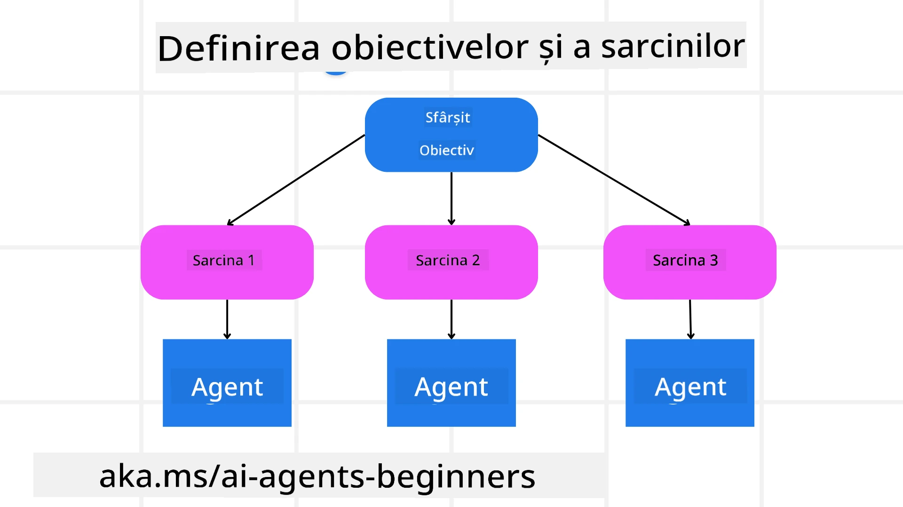

[](https://youtu.be/kPfJ2BrBCMY?si=9pYpPXp0sSbK91Dr)

> _(Faceți clic pe imaginea de mai sus pentru a viziona videoclipul acestei lecții)_

# Planificarea Designului

## Introducere

Această lecție va acoperi

* Definirea unui obiectiv clar general și împărțirea unei sarcini complexe în sarcini gestionabile.
* Valorificarea ieșirii structurate pentru răspunsuri mai fiabile și ușor de citit de către mașini.
* Aplicarea unei abordări bazate pe evenimente pentru a gestiona sarcini dinamice și intrări neașteptate.

## Obiective de învățare

După finalizarea acestei lecții, veți înțelege:

* Identificarea și stabilirea unui scop general pentru un agent AI, asigurându-vă că acesta știe clar ce trebuie realizat.
* Descompunerea unei sarcini complexe în sub-sarcini gestionabile și organizarea acestora într-o secvență logică.
* Echiparea agenților cu instrumentele potrivite (de exemplu, instrumente de căutare sau instrumente de analiză a datelor), decizia când și cum sunt folosite și gestionarea situațiilor neașteptate care apar.
* Evaluarea rezultatelor sub-sarcinilor, măsurarea performanței și iterarea acțiunilor pentru îmbunătățirea rezultatului final.

## Definirea Obiectivului General și Descompunerea unei Sarcini



Majoritatea sarcinilor din lumea reală sunt prea complexe pentru a fi abordate într-un singur pas. Un agent AI are nevoie de un obiectiv concis pentru a-i ghida planificarea și acțiunile. De exemplu, luați în considerare obiectivul:

    "Generați un itinerar de călătorie pentru 3 zile."

Deși este simplu de enunțat, el necesită totuși rafinare. Cu cât obiectivul este mai clar, cu atât agentul (și orice colaboratori umani) pot să se concentreze mai bine pe realizarea rezultatului corect, cum ar fi crearea unui itinerar cuprinzător cu opțiuni de zbor, recomandări de hoteluri și sugestii de activități.

### Descompunerea Sarcinii

Sarcinile mari sau complexe devin mai ușor de gestionat atunci când sunt împărțite în sub-sarcini mai mici, orientate spre obiective.
Pentru exemplul itinerarului de călătorie, puteți descompune obiectivul în:

* Rezervare Zboruri
* Rezervare Hotel
* Închiriere Mașină
* Personalizare

Fiecare sub-sarcină poate fi apoi abordată de agenți sau procese dedicate. Un agent ar putea să se specializeze în căutarea celor mai bune oferte la zboruri, altul să se ocupe de rezervările de hoteluri și așa mai departe. Un agent de coordonare sau „amonte” poate apoi să compileze aceste rezultate într-un singur itinerar coerent pentru utilizatorul final.

Această abordare modulară permite și îmbunătățiri incrementale. De exemplu, puteți adăuga agenți specializați pentru Recomandări de Mâncare sau Sugestii de Activități Locale și să rafinați itinerarul în timp.

### Ieșire Structurată

Modelele Mari de Limbaj (LLM-uri) pot genera ieșiri structurate (de exemplu, JSON) care sunt mai ușor de interpretat și procesat de agenți sau servicii ulterioare. Acest lucru este deosebit de util într-un context multi-agent, unde putem acționa asupra acestor sarcini după ce ieșirea planificatorului este primită.

Următorul fragment de cod Python demonstrează un agent simplu de planificare care descompune un obiectiv în sub-sarcini și generează un plan structurat:

```python
from pydantic import BaseModel
from enum import Enum
from typing import List, Optional, Union
import json
import os
from typing import Optional
from pprint import pprint
from agent_framework.azure import AzureAIProjectAgentProvider
from azure.identity import AzureCliCredential

class AgentEnum(str, Enum):
    FlightBooking = "flight_booking"
    HotelBooking = "hotel_booking"
    CarRental = "car_rental"
    ActivitiesBooking = "activities_booking"
    DestinationInfo = "destination_info"
    DefaultAgent = "default_agent"
    GroupChatManager = "group_chat_manager"

# Model SubSarcină de Călătorie
class TravelSubTask(BaseModel):
    task_details: str
    assigned_agent: AgentEnum  # vrem să atribuim sarcina agentului

class TravelPlan(BaseModel):
    main_task: str
    subtasks: List[TravelSubTask]
    is_greeting: bool

provider = AzureAIProjectAgentProvider(credential=AzureCliCredential())

# Definește mesajul utilizatorului
system_prompt = """You are a planner agent.
    Your job is to decide which agents to run based on the user's request.
    Provide your response in JSON format with the following structure:
{'main_task': 'Plan a family trip from Singapore to Melbourne.',
 'subtasks': [{'assigned_agent': 'flight_booking',
               'task_details': 'Book round-trip flights from Singapore to '
                               'Melbourne.'}
    Below are the available agents specialised in different tasks:
    - FlightBooking: For booking flights and providing flight information
    - HotelBooking: For booking hotels and providing hotel information
    - CarRental: For booking cars and providing car rental information
    - ActivitiesBooking: For booking activities and providing activity information
    - DestinationInfo: For providing information about destinations
    - DefaultAgent: For handling general requests"""

user_message = "Create a travel plan for a family of 2 kids from Singapore to Melbourne"

response = client.create_response(input=user_message, instructions=system_prompt)

response_content = response.output_text
pprint(json.loads(response_content))
```

### Agent de Planificare cu Orchestrare Multi-Agent

În acest exemplu, un Agent Router Semantic primește o solicitare a utilizatorului (de exemplu, „Am nevoie de un plan de hotel pentru călătoria mea.”).

Planificatorul apoi:

* Primește Planul Hotelului: Planificatorul preia mesajul utilizatorului și, pe baza unui prompt de sistem (inclusiv detalii despre agenții disponibili), generează un plan de călătorie structurat.
* Listează Agenții și Uneltele Lor: Registrul agenților deține o listă de agenți (de ex. pentru zbor, hotel, închiriere mașină și activități) împreună cu funcțiile sau uneltele pe care le oferă.
* Direcționează Planul către Agenții Relevanți: În funcție de numărul de sub-sarcini, planificatorul trimite mesajul direct unui agent dedicat (pentru scenarii cu o singură sarcină) sau coordonează printr-un manager de chat de grup pentru colaborare multi-agent.
* Rezumă Rezultatul: În final, planificatorul rezumă planul generat pentru claritate.
Următorul exemplu de cod Python ilustrează acești pași:

```python

from pydantic import BaseModel

from enum import Enum
from typing import List, Optional, Union

class AgentEnum(str, Enum):
    FlightBooking = "flight_booking"
    HotelBooking = "hotel_booking"
    CarRental = "car_rental"
    ActivitiesBooking = "activities_booking"
    DestinationInfo = "destination_info"
    DefaultAgent = "default_agent"
    GroupChatManager = "group_chat_manager"

# Model Subtask Călătorie

class TravelSubTask(BaseModel):
    task_details: str
    assigned_agent: AgentEnum # vrem să atribuim sarcina agentului

class TravelPlan(BaseModel):
    main_task: str
    subtasks: List[TravelSubTask]
    is_greeting: bool
import json
import os
from typing import Optional

from agent_framework.azure import AzureAIProjectAgentProvider
from azure.identity import AzureCliCredential

# Creează clientul

provider = AzureAIProjectAgentProvider(credential=AzureCliCredential())

from pprint import pprint

# Defineste mesajul utilizatorului

system_prompt = """You are a planner agent.
    Your job is to decide which agents to run based on the user's request.
    Below are the available agents specialized in different tasks:
    - FlightBooking: For booking flights and providing flight information
    - HotelBooking: For booking hotels and providing hotel information
    - CarRental: For booking cars and providing car rental information
    - ActivitiesBooking: For booking activities and providing activity information
    - DestinationInfo: For providing information about destinations
    - DefaultAgent: For handling general requests"""

user_message = "Create a travel plan for a family of 2 kids from Singapore to Melbourne"

response = client.create_response(input=user_message, instructions=system_prompt)

response_content = response.output_text

# Afișează conținutul răspunsului după ce este încărcat ca JSON

pprint(json.loads(response_content))
```

Ce urmează este ieșirea din codul precedent și apoi puteți folosi această ieșire structurată pentru a direcționa către `assigned_agent` și pentru a rezuma planul de călătorie către utilizatorul final.

```json
{
    "is_greeting": "False",
    "main_task": "Plan a family trip from Singapore to Melbourne.",
    "subtasks": [
        {
            "assigned_agent": "flight_booking",
            "task_details": "Book round-trip flights from Singapore to Melbourne."
        },
        {
            "assigned_agent": "hotel_booking",
            "task_details": "Find family-friendly hotels in Melbourne."
        },
        {
            "assigned_agent": "car_rental",
            "task_details": "Arrange a car rental suitable for a family of four in Melbourne."
        },
        {
            "assigned_agent": "activities_booking",
            "task_details": "List family-friendly activities in Melbourne."
        },
        {
            "assigned_agent": "destination_info",
            "task_details": "Provide information about Melbourne as a travel destination."
        }
    ]
}
```

Un notebook exemplu cu fragmentul de cod anterior este disponibil [aici](07-python-agent-framework.ipynb).

### Planificare Iterativă

Unele sarcini necesită un schimb repetat sau o replanificare, unde rezultatul unei sub-sarcini influențează pe cea următoare. De exemplu, dacă agentul descoperă un format de date neașteptat în timpul rezervării zborurilor, ar putea fi necesar să-și adapteze strategia înainte de a continua cu rezervările la hotel.

În plus, feedback-ul utilizatorului (de ex. un om care decide că preferă un zbor mai devreme) poate declanșa o replanificare parțială. Această abordare dinamică și iterativă asigură că soluția finală se aliniază cu constrângerile din lumea reală și preferințele utilizatorului în evoluție.

exemplu de cod

```python
from agent_framework.azure import AzureAIProjectAgentProvider
from azure.identity import AzureCliCredential
#.. la fel ca și codul anterior și transmite istoricul utilizatorului, planul curent

system_prompt = """You are a planner agent to optimize the
    Your job is to decide which agents to run based on the user's request.
    Below are the available agents specialized in different tasks:
    - FlightBooking: For booking flights and providing flight information
    - HotelBooking: For booking hotels and providing hotel information
    - CarRental: For booking cars and providing car rental information
    - ActivitiesBooking: For booking activities and providing activity information
    - DestinationInfo: For providing information about destinations
    - DefaultAgent: For handling general requests"""

user_message = "Create a travel plan for a family of 2 kids from Singapore to Melbourne"

response = client.create_response(
    input=user_message,
    instructions=system_prompt,
    context=f"Previous travel plan - {TravelPlan}",
)
# .. replanifică și trimite sarcinile către agenții respectivi
```

Pentru o planificare mai cuprinzătoare, consultați Magnetic One <a href="https://www.microsoft.com/research/articles/magentic-one-a-generalist-multi-agent-system-for-solving-complex-tasks" target="_blank">Blogpost</a> pentru rezolvarea sarcinilor complexe.

## Rezumat

În acest articol am examinat un exemplu despre cum putem crea un planificator care poate selecta dinamic agenții disponibili definiți. Ieșirea planificatorului descompune sarcinile și atribuie agenții astfel încât aceste sarcini să poată fi executate. Se presupune că agenții au acces la funcțiile/uneltele necesare pentru a îndeplini sarcina. Pe lângă agenți puteți include și alte tipare precum reflecția, rezumatorul și chat-ul round robin pentru o personalizare suplimentară.

## Resurse suplimentare

Magentic One - Un sistem multi-agent generalist pentru rezolvarea sarcinilor complexe și care a obținut rezultate impresionante în multiple benchmark-uri agentice provocatoare. Referință: <a href="https://www.microsoft.com/research/articles/magentic-one-a-generalist-multi-agent-system-for-solving-complex-tasks" target="_blank">Magentic One</a>. În această implementare, orchestratorul creează planuri specifice sarcinilor și delegă aceste sarcini agenților disponibili. Pe lângă planificare, orchestratorul folosește și un mecanism de monitorizare pentru a urmări progresul sarcinii și a replanifica după necesitate.

### Ai Mai Multe Întrebări despre Planificarea Designului?

Alăturați-vă [Microsoft Foundry Discord](https://discord.com/invite/ATgtXmAS5D) pentru a întâlni alți cursanți, a participa la orele de consiliere și a primi răspunsuri la întrebările despre Agenții AI.

## Lecția Anterioară

[Construirea Agenților AI de Încredere](../06-building-trustworthy-agents/README.md)

## Lecția Următoare

[Designul Multi-Agent](../08-multi-agent/README.md)

---

<!-- CO-OP TRANSLATOR DISCLAIMER START -->
**Declinare a responsabilității**:
Acest document a fost tradus folosind serviciul de traducere AI [Co-op Translator](https://github.com/Azure/co-op-translator). În timp ce ne străduim pentru acuratețe, vă rugăm să rețineți că traducerile automate pot conține erori sau inexactități. Documentul original în limba sa nativă trebuie considerat sursa autorizată. Pentru informații critice, se recomandă traducerea profesională realizată de un om. Nu ne asumăm responsabilitatea pentru eventualele neînțelegeri sau interpretări greșite care decurg din utilizarea acestei traduceri.
<!-- CO-OP TRANSLATOR DISCLAIMER END -->