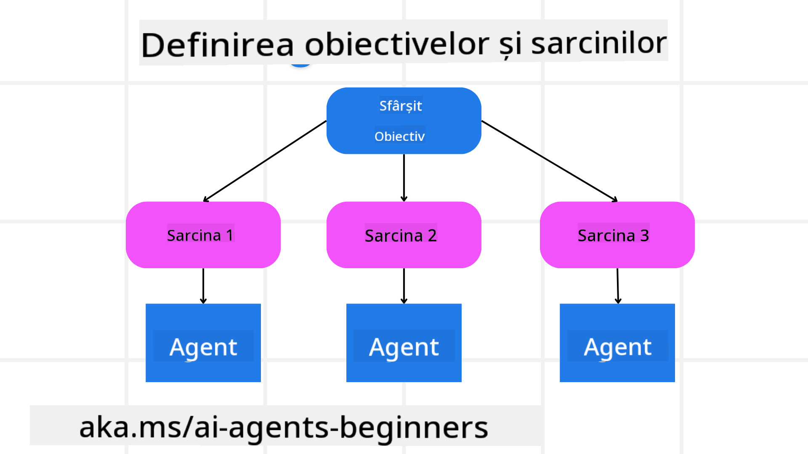

<!--
CO_OP_TRANSLATOR_METADATA:
{
  "original_hash": "43069833a0412210ad5c3cc93d9c2146",
  "translation_date": "2025-09-18T15:36:34+00:00",
  "source_file": "07-planning-design/README.md",
  "language_code": "ro"
}
-->
[](https://youtu.be/kPfJ2BrBCMY?si=9pYpPXp0sSbK91Dr)

> _(Click pe imaginea de mai sus pentru a viziona videoclipul acestei lecții)_

# Planificarea Designului

## Introducere

Această lecție va acoperi:

* Definirea unui obiectiv general clar și împărțirea unei sarcini complexe în sarcini gestionabile.
* Utilizarea unui output structurat pentru răspunsuri mai fiabile și ușor de citit de către mașini.
* Aplicarea unei abordări bazate pe evenimente pentru a gestiona sarcini dinamice și intrări neașteptate.

## Obiective de Învățare

După finalizarea acestei lecții, vei înțelege:

* Cum să identifici și să stabilești un obiectiv general pentru un agent AI, asigurându-te că știe clar ce trebuie să realizeze.
* Cum să descompui o sarcină complexă în subtasks gestionabile și să le organizezi într-o secvență logică.
* Cum să echipezi agenții cu instrumentele potrivite (de exemplu, instrumente de căutare sau analiză de date), să decizi când și cum să le folosești și să gestionezi situațiile neașteptate care apar.
* Cum să evaluezi rezultatele subtasks, să măsori performanța și să iterezi acțiunile pentru a îmbunătăți rezultatul final.

## Definirea Obiectivului General și Descompunerea Sarcinii



Majoritatea sarcinilor din lumea reală sunt prea complexe pentru a fi abordate într-un singur pas. Un agent AI are nevoie de un obiectiv concis pentru a-și ghida planificarea și acțiunile. De exemplu, consideră obiectivul:

    "Generează un itinerar de călătorie pentru 3 zile."

Deși este simplu de formulat, necesită totuși rafinare. Cu cât obiectivul este mai clar, cu atât agentul (și orice colaboratori umani) se pot concentra mai bine pe obținerea rezultatului dorit, cum ar fi crearea unui itinerar complet cu opțiuni de zbor, recomandări de hoteluri și sugestii de activități.

### Descompunerea Sarcinii

Sarcinile mari sau complexe devin mai ușor de gestionat atunci când sunt împărțite în subtasks mai mici, orientate spre obiectiv.
Pentru exemplul itinerarului de călătorie, ai putea descompune obiectivul în:

* Rezervarea Zborului
* Rezervarea Hotelului
* Închirierea Mașinii
* Personalizare

Fiecare subtask poate fi abordat de agenți sau procese dedicate. Un agent ar putea fi specializat în căutarea celor mai bune oferte de zboruri, altul în rezervarea hotelurilor și așa mai departe. Un agent coordonator sau „downstream” poate apoi compila aceste rezultate într-un itinerar coerent pentru utilizatorul final.

Această abordare modulară permite, de asemenea, îmbunătățiri incrementale. De exemplu, ai putea adăuga agenți specializați pentru Recomandări de Mâncare sau Sugestii de Activități Locale și să rafinezi itinerarul în timp.

### Output Structurat

Modelele de Limbaj Mare (LLMs) pot genera output structurat (de exemplu, JSON) care este mai ușor de analizat și procesat de agenți sau servicii „downstream”. Acest lucru este deosebit de util într-un context multi-agent, unde putem acționa aceste sarcini după ce output-ul de planificare este primit. Consultă aceasta pentru o privire rapidă.

Următorul fragment de cod Python demonstrează un agent de planificare simplu care descompune un obiectiv în subtasks și generează un plan structurat:

```python
from pydantic import BaseModel
from enum import Enum
from typing import List, Optional, Union
import json
import os
from typing import Optional
from pprint import pprint
from autogen_core.models import UserMessage, SystemMessage, AssistantMessage
from autogen_ext.models.azure import AzureAIChatCompletionClient
from azure.core.credentials import AzureKeyCredential

class AgentEnum(str, Enum):
    FlightBooking = "flight_booking"
    HotelBooking = "hotel_booking"
    CarRental = "car_rental"
    ActivitiesBooking = "activities_booking"
    DestinationInfo = "destination_info"
    DefaultAgent = "default_agent"
    GroupChatManager = "group_chat_manager"

# Travel SubTask Model
class TravelSubTask(BaseModel):
    task_details: str
    assigned_agent: AgentEnum  # we want to assign the task to the agent

class TravelPlan(BaseModel):
    main_task: str
    subtasks: List[TravelSubTask]
    is_greeting: bool

client = AzureAIChatCompletionClient(
    model="gpt-4o-mini",
    endpoint="https://models.inference.ai.azure.com",
    # To authenticate with the model you will need to generate a personal access token (PAT) in your GitHub settings.
    # Create your PAT token by following instructions here: https://docs.github.com/en/authentication/keeping-your-account-and-data-secure/managing-your-personal-access-tokens
    credential=AzureKeyCredential(os.environ["GITHUB_TOKEN"]),
    model_info={
        "json_output": False,
        "function_calling": True,
        "vision": True,
        "family": "unknown",
    },
)

# Define the user message
messages = [
    SystemMessage(content="""You are an planner agent.
    Your job is to decide which agents to run based on the user's request.
                      Provide your response in JSON format with the following structure:
{'main_task': 'Plan a family trip from Singapore to Melbourne.',
 'subtasks': [{'assigned_agent': 'flight_booking',
               'task_details': 'Book round-trip flights from Singapore to '
                               'Melbourne.'}
    Below are the available agents specialised in different tasks:
    - FlightBooking: For booking flights and providing flight information
    - HotelBooking: For booking hotels and providing hotel information
    - CarRental: For booking cars and providing car rental information
    - ActivitiesBooking: For booking activities and providing activity information
    - DestinationInfo: For providing information about destinations
    - DefaultAgent: For handling general requests""", source="system"),
    UserMessage(
        content="Create a travel plan for a family of 2 kids from Singapore to Melboune", source="user"),
]

response = await client.create(messages=messages, extra_create_args={"response_format": 'json_object'})

response_content: Optional[str] = response.content if isinstance(
    response.content, str) else None
if response_content is None:
    raise ValueError("Response content is not a valid JSON string" )

pprint(json.loads(response_content))

# # Ensure the response content is a valid JSON string before loading it
# response_content: Optional[str] = response.content if isinstance(
#     response.content, str) else None
# if response_content is None:
#     raise ValueError("Response content is not a valid JSON string")

# # Print the response content after loading it as JSON
# pprint(json.loads(response_content))

# Validate the response content with the MathReasoning model
# TravelPlan.model_validate(json.loads(response_content))
```

### Agent de Planificare cu Orchestrare Multi-Agent

În acest exemplu, un Agent Router Semantic primește o cerere de la utilizator (de exemplu, "Am nevoie de un plan de hotel pentru călătoria mea.").

Planificatorul apoi:

* Primește Planul Hotelului: Planificatorul preia mesajul utilizatorului și, pe baza unui prompt de sistem (inclusiv detalii despre agenții disponibili), generează un plan structurat de călătorie.
* Listează Agenții și Instrumentele Lor: Registrul de agenți deține o listă de agenți (de exemplu, pentru zboruri, hoteluri, închirieri de mașini și activități) împreună cu funcțiile sau instrumentele pe care le oferă.
* Direcționează Planul către Agenții Respectivi: În funcție de numărul de subtasks, planificatorul trimite fie mesajul direct unui agent dedicat (pentru scenarii cu o singură sarcină), fie coordonează printr-un manager de chat de grup pentru colaborare multi-agent.
* Rezumă Rezultatul: În final, planificatorul rezumă planul generat pentru claritate.
Următorul exemplu de cod Python ilustrează acești pași:

```python

from pydantic import BaseModel

from enum import Enum
from typing import List, Optional, Union

class AgentEnum(str, Enum):
    FlightBooking = "flight_booking"
    HotelBooking = "hotel_booking"
    CarRental = "car_rental"
    ActivitiesBooking = "activities_booking"
    DestinationInfo = "destination_info"
    DefaultAgent = "default_agent"
    GroupChatManager = "group_chat_manager"

# Travel SubTask Model

class TravelSubTask(BaseModel):
    task_details: str
    assigned_agent: AgentEnum # we want to assign the task to the agent

class TravelPlan(BaseModel):
    main_task: str
    subtasks: List[TravelSubTask]
    is_greeting: bool
import json
import os
from typing import Optional

from autogen_core.models import UserMessage, SystemMessage, AssistantMessage
from autogen_ext.models.openai import AzureOpenAIChatCompletionClient

# Create the client with type-checked environment variables

client = AzureOpenAIChatCompletionClient(
    azure_deployment=os.getenv("AZURE_OPENAI_DEPLOYMENT_NAME"),
    model=os.getenv("AZURE_OPENAI_DEPLOYMENT_NAME"),
    api_version=os.getenv("AZURE_OPENAI_API_VERSION"),
    azure_endpoint=os.getenv("AZURE_OPENAI_ENDPOINT"),
    api_key=os.getenv("AZURE_OPENAI_API_KEY"),
)

from pprint import pprint

# Define the user message

messages = [
    SystemMessage(content="""You are an planner agent.
    Your job is to decide which agents to run based on the user's request.
    Below are the available agents specialized in different tasks:
    - FlightBooking: For booking flights and providing flight information
    - HotelBooking: For booking hotels and providing hotel information
    - CarRental: For booking cars and providing car rental information
    - ActivitiesBooking: For booking activities and providing activity information
    - DestinationInfo: For providing information about destinations
    - DefaultAgent: For handling general requests""", source="system"),
    UserMessage(content="Create a travel plan for a family of 2 kids from Singapore to Melbourne", source="user"),
]

response = await client.create(messages=messages, extra_create_args={"response_format": TravelPlan})

# Ensure the response content is a valid JSON string before loading it

response_content: Optional[str] = response.content if isinstance(response.content, str) else None
if response_content is None:
    raise ValueError("Response content is not a valid JSON string")

# Print the response content after loading it as JSON

pprint(json.loads(response_content))
```

Ce urmează este output-ul din codul anterior și poți folosi acest output structurat pentru a direcționa către `assigned_agent` și a rezuma planul de călătorie pentru utilizatorul final.

```json
{
    "is_greeting": "False",
    "main_task": "Plan a family trip from Singapore to Melbourne.",
    "subtasks": [
        {
            "assigned_agent": "flight_booking",
            "task_details": "Book round-trip flights from Singapore to Melbourne."
        },
        {
            "assigned_agent": "hotel_booking",
            "task_details": "Find family-friendly hotels in Melbourne."
        },
        {
            "assigned_agent": "car_rental",
            "task_details": "Arrange a car rental suitable for a family of four in Melbourne."
        },
        {
            "assigned_agent": "activities_booking",
            "task_details": "List family-friendly activities in Melbourne."
        },
        {
            "assigned_agent": "destination_info",
            "task_details": "Provide information about Melbourne as a travel destination."
        }
    ]
}
```

Un notebook exemplu cu codul anterior este disponibil [aici](07-autogen.ipynb).

### Planificare Iterativă

Unele sarcini necesită un proces de încercare și eroare sau re-planificare, unde rezultatul unui subtask influențează următorul. De exemplu, dacă agentul descoperă un format de date neașteptat în timp ce rezervă zboruri, ar putea fi necesar să își adapteze strategia înainte de a trece la rezervarea hotelurilor.

În plus, feedback-ul utilizatorului (de exemplu, un utilizator care decide că preferă un zbor mai devreme) poate declanșa o re-planificare parțială. Această abordare dinamică, iterativă, asigură că soluția finală se aliniază cu constrângerile din lumea reală și preferințele utilizatorului în evoluție.

Exemplu de cod:

```python
from autogen_core.models import UserMessage, SystemMessage, AssistantMessage
#.. same as previous code and pass on the user history, current plan
messages = [
    SystemMessage(content="""You are a planner agent to optimize the
    Your job is to decide which agents to run based on the user's request.
    Below are the available agents specialized in different tasks:
    - FlightBooking: For booking flights and providing flight information
    - HotelBooking: For booking hotels and providing hotel information
    - CarRental: For booking cars and providing car rental information
    - ActivitiesBooking: For booking activities and providing activity information
    - DestinationInfo: For providing information about destinations
    - DefaultAgent: For handling general requests""", source="system"),
    UserMessage(content="Create a travel plan for a family of 2 kids from Singapore to Melbourne", source="user"),
    AssistantMessage(content=f"Previous travel plan - {TravelPlan}", source="assistant")
]
# .. re-plan and send the tasks to respective agents
```

Pentru o planificare mai cuprinzătoare, consultă Magnetic One pentru rezolvarea sarcinilor complexe.

## Rezumat

În acest articol, am analizat un exemplu despre cum putem crea un planificator care poate selecta dinamic agenții disponibili definiți. Output-ul Planificatorului descompune sarcinile și atribuie agenții astfel încât acestea să poată fi executate. Se presupune că agenții au acces la funcțiile/instrumentele necesare pentru a îndeplini sarcina. În plus față de agenți, poți include alte modele precum reflecția, sumarizarea și chat-ul round robin pentru personalizare suplimentară.

## Resurse Suplimentare

AutoGen Magnetic One - Un sistem multi-agent generalist pentru rezolvarea sarcinilor complexe care a obținut rezultate impresionante pe mai multe benchmark-uri agentice provocatoare. Referință:

. În această implementare, orchestratorul creează un plan specific sarcinii și deleagă aceste sarcini agenților disponibili. Pe lângă planificare, orchestratorul utilizează și un mecanism de urmărire pentru a monitoriza progresul sarcinii și a re-planifica, dacă este necesar.

### Ai Mai Multe Întrebări despre Modelul de Design pentru Planificare?

Alătură-te [Discordului Azure AI Foundry](https://aka.ms/ai-agents/discord) pentru a te întâlni cu alți cursanți, a participa la ore de consultanță și a obține răspunsuri la întrebările tale despre AI Agents.

## Lecția Anterioară

[Construirea Agenților AI de Încredere](../06-building-trustworthy-agents/README.md)

## Lecția Următoare

[Modelul de Design Multi-Agent](../08-multi-agent/README.md)

---

**Declinare de responsabilitate**:  
Acest document a fost tradus folosind serviciul de traducere AI [Co-op Translator](https://github.com/Azure/co-op-translator). Deși ne străduim să asigurăm acuratețea, vă rugăm să rețineți că traducerile automate pot conține erori sau inexactități. Documentul original în limba sa natală ar trebui considerat sursa autoritară. Pentru informații critice, se recomandă traducerea profesională realizată de un specialist uman. Nu ne asumăm responsabilitatea pentru eventualele neînțelegeri sau interpretări greșite care pot apărea din utilizarea acestei traduceri.