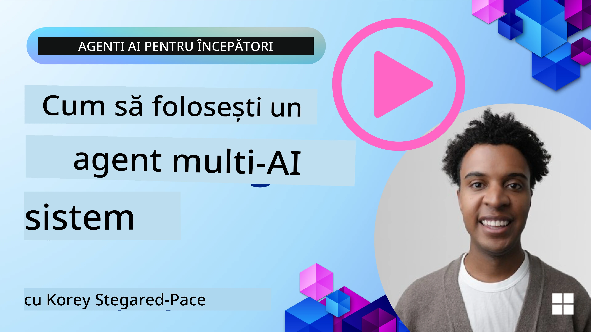
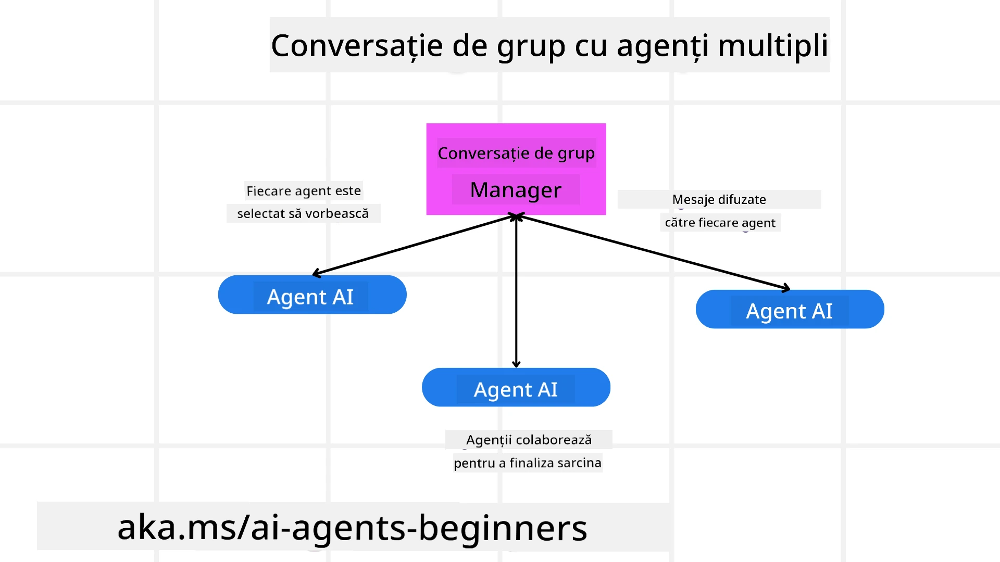
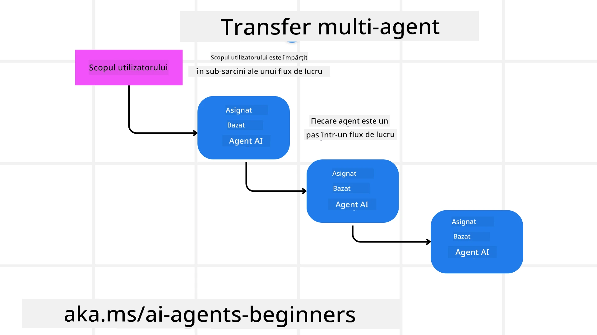
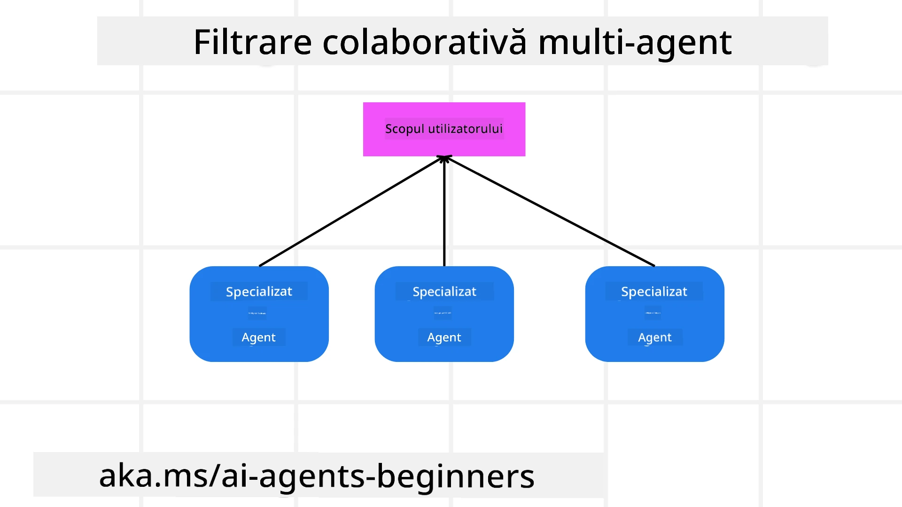

> _(Faceți clic pe imaginea de mai sus pentru a viziona videoclipul acestei lecții)_

# Modele de proiectare multi-agent

De îndată ce începeți să lucrați la un proiect care implică mai mulți agenți, va trebui să luați în considerare modelul de proiectare multi-agent. Totuși, s-ar putea să nu fie imediat clar când să treceți la agenți multipli și care sunt avantajele.

## Introducere

În această lecție, încercăm să răspundem la următoarele întrebări:

- Care sunt scenariile în care agenții multipli sunt aplicabili?
- Care sunt avantajele utilizării agenților multipli față de un singur agent care face mai multe sarcini?
- Care sunt componentele de bază pentru implementarea modelului de proiectare multi-agent?
- Cum avem vizibilitate asupra modului în care agenții multipli interacționează între ei?

## Obiective de învățare

După această lecție, ar trebui să puteți:

- Identifica scenariile în care agenții multipli sunt aplicabili
- Recunoaște avantajele utilizării agenților multipli față de un agent singular.
- Înțelege componentele de bază pentru implementarea modelului de proiectare multi-agent.

Care este imaginea de ansamblu?

*Agenții multipli sunt un model de proiectare care permite mai multor agenți să lucreze împreună pentru a atinge un scop comun*.

Acest model este folosit pe scară largă în diverse domenii, inclusiv robotică, sisteme autonome și calcul distribuit.

## Scenarii în care sunt aplicabile sistemele multi-agent

Deci, în ce scenarii este recomandat să folosiți agenți multipli? Răspunsul este că există multe scenarii în care utilizarea mai multor agenți este benefică, în special în următoarele cazuri:

- **Sarcini cu volum mare de lucru**: Volumele mari de lucru pot fi împărțite în sarcini mai mici și atribuite unor agenți diferiți, permițând procesarea paralelă și finalizarea mai rapidă. Un exemplu ar fi în cazul unei sarcini mari de procesare a datelor.
- **Sarcini complexe**: Sarcinile complexe, la fel ca volumele mari de lucru, pot fi descompuse în subtasks mai mici și atribuite unor agenți diferiți, fiecare specializat într-un anumit aspect al sarcinii. Un bun exemplu este în cazul vehiculelor autonome, unde diferiți agenți gestionează navigația, detectarea obstacolelor și comunicarea cu alte vehicule.
- **Expertiză diversă**: Agenții diferiți pot avea expertize diverse, permițându-le să gestioneze diferite aspecte ale unei sarcini mai eficient decât un singur agent. Pentru acest caz, un bun exemplu este în domeniul sănătății, unde agenții pot gestiona diagnosticarea, planurile de tratament și monitorizarea pacienților.

## Avantajele utilizării agenților multipli față de un agent singular

Un sistem cu un singur agent ar putea funcționa bine pentru sarcini simple, dar pentru sarcini mai complexe, utilizarea mai multor agenți poate oferi mai multe avantaje:

- **Specializare**: Fiecare agent poate fi specializat pentru o sarcină specifică. Lipsa specializării într-un singur agent înseamnă că aveți un agent care poate face totul, dar care s-ar putea confunda când se confruntă cu o sarcină complexă. De exemplu, ar putea ajunge să facă o sarcină pentru care nu este cel mai bine pregătit.
- **Scalabilitate**: Este mai ușor să scalați sistemele prin adăugarea mai multor agenți decât prin supraîncărcarea unui singur agent.
- **Toleranță la erori**: Dacă un agent eșuează, alții pot continua să funcționeze, asigurând fiabilitatea sistemului.

Să luăm un exemplu: să rezervăm o călătorie pentru un utilizator. Un sistem cu un singur agent ar trebui să gestioneze toate aspectele procesului de rezervare, de la găsirea zborurilor până la rezervarea hotelurilor și a mașinilor de închiriat. Pentru a realiza acest lucru cu un singur agent, agentul ar trebui să aibă instrumente pentru gestionarea tuturor acestor sarcini. Acest lucru ar putea duce la un sistem complex și monolitic, dificil de întreținut și de scalat. Un sistem multi-agent, pe de altă parte, ar putea avea agenți diferiți specializați în găsirea zborurilor, rezervarea hotelurilor și a mașinilor de închiriat. Acest lucru ar face sistemul mai modular, mai ușor de întreținut și scalabil.

Comparați asta cu o agenție de turism condusă ca o mică afacere de familie versus o agenție de turism condusă ca o franciză. Agenția mică ar avea un singur agent care gestionează toate aspectele procesului de rezervare, în timp ce franciza ar avea agenți diferiți care se ocupă de aspecte diferite ale procesului de rezervare.

## Componentele de bază pentru implementarea modelului de proiectare multi-agent

Înainte de a putea implementa modelul de proiectare multi-agent, trebuie să înțelegeți componentele de bază care alcătuiesc modelul.

Să facem acest lucru mai concret, analizând din nou exemplul rezervării unei călătorii pentru un utilizator. În acest caz, componentele de bază ar include:

- **Comunicarea între agenți**: Agenții pentru găsirea zborurilor, rezervarea hotelurilor și a mașinilor de închiriat trebuie să comunice și să partajeze informații despre preferințele și constrângerile utilizatorului. Trebuie să decideți protocoalele și metodele pentru această comunicare. Concret, asta înseamnă că agentul pentru găsirea zborurilor trebuie să comunice cu agentul pentru rezervarea hotelurilor pentru a se asigura că hotelul este rezervat pentru aceleași date ca zborul. Asta înseamnă că agenții trebuie să partajeze informații despre datele de călătorie ale utilizatorului, deci trebuie să decideți *care agenți partajează informații și cum partajează informațiile*.
- **Mecanisme de coordonare**: Agenții trebuie să-și coordoneze acțiunile pentru a se asigura că preferințele și constrângerile utilizatorului sunt respectate. O preferință a utilizatorului ar putea fi că dorește un hotel aproape de aeroport, în timp ce o constrângere ar putea fi că mașinile de închiriat sunt disponibile numai la aeroport. Asta înseamnă că agentul pentru rezervarea hotelurilor trebuie să se coordoneze cu agentul pentru rezervarea mașinilor de închiriat pentru a se asigura că preferințele și constrângerile utilizatorului sunt respectate. Asta înseamnă că trebuie să decideți *cum își coordonează agenții acțiunile*.
- **Arhitectura agentului**: Agenții trebuie să aibă o structură internă pentru a lua decizii și a învăța din interacțiunile cu utilizatorul. Asta înseamnă că agentul pentru găsirea zborurilor trebuie să aibă o structură internă pentru a lua decizii privind zborurile pe care să le recomande utilizatorului. Asta înseamnă că trebuie să decideți *cum iau agenții decizii și cum învață din interacțiunile cu utilizatorul*. Exemple de moduri în care un agent învață și se îmbunătățește ar putea fi că agentul pentru găsirea zborurilor ar putea folosi un model de machine learning pentru a recomanda zboruri utilizatorului pe baza preferințelor anterioare.
- **Vizibilitate în interacțiunile multi-agent**: Trebuie să aveți vizibilitate asupra modului în care agenții multipli interacționează între ei. Asta înseamnă că trebuie să aveți unelte și tehnici pentru urmărirea activităților și a interacțiunilor agenților. Acest lucru ar putea fi sub forma unor instrumente de înregistrare și monitorizare, instrumente de vizualizare și metrici de performanță.
- **Tipare multi-agent**: Există diferite modele pentru implementarea sistemelor multi-agent, cum ar fi arhitecturi centralizate, descentralizate și hibride. Trebuie să decideți modelul care se potrivește cel mai bine cazului dvs. de utilizare.
- **Omul în buclă**: În majoritatea cazurilor, veți avea un om în buclă și trebuie să indicați agenților când să ceară intervenția umană. Acest lucru ar putea fi sub forma unui utilizator care solicită un anumit hotel sau zbor pe care agenții nu l-au recomandat sau care cere confirmare înainte de a rezerva un zbor sau un hotel.

## Vizibilitate în interacțiunile multi-agent

Este important să aveți vizibilitate asupra modului în care agenții multipli interacționează între ei. Această vizibilitate este esențială pentru depanare, optimizare și asigurarea eficacității generale a sistemului. Pentru a realiza acest lucru, trebuie să aveți unelte și tehnici pentru urmărirea activităților și interacțiunilor agenților. Acest lucru ar putea fi sub forma unor instrumente de înregistrare și monitorizare, instrumente de vizualizare și metrici de performanță.

De exemplu, în cazul rezervării unei călătorii pentru un utilizator, ați putea avea un tablou de bord care afișează starea fiecărui agent, preferințele și constrângerile utilizatorului și interacțiunile dintre agenți. Acest tablou de bord ar putea afișa datele de călătorie ale utilizatorului, zborurile recomandate de agentul de zbor, hotelurile recomandate de agentul de hotel și mașinile de închiriat recomandate de agentul de închirieri auto. Acest lucru v-ar oferi o imagine clară a modului în care agenții interacționează între ei și dacă preferințele și constrângerile utilizatorului sunt respectate.

Să analizăm fiecare dintre aceste aspecte în mai mult detaliu.

- **Instrumente de înregistrare și monitorizare**: Doriți să înregistrați fiecare acțiune întreprinsă de un agent. O intrare de jurnal ar putea stoca informații despre agentul care a întreprins acțiunea, acțiunea în sine, momentul în care a fost efectuata și rezultatul acțiunii. Aceste informații pot fi folosite ulterior pentru depanare, optimizare și altele.
- **Instrumente de vizualizare**: Instrumentele de vizualizare vă pot ajuta să vedeți interacțiunile dintre agenți într-un mod mai intuitiv. De exemplu, ați putea avea un grafic care arată fluxul de informații între agenți. Acest lucru vă poate ajuta să identificați blocaje, ineficiențe și alte probleme din sistem.
- **Metrici de performanță**: Metricile de performanță vă pot ajuta să urmăriți eficacitatea sistemului multi-agent. De exemplu, ați putea urmări timpul necesar pentru finalizarea unei sarcini, numărul de sarcini finalizate pe unitate de timp și acuratețea recomandărilor făcute de agenți. Aceste informații vă pot ajuta să identificați zonele care necesită îmbunătățiri și să optimizați sistemul.

## Modele multi-agent

Să explorăm câteva modele concrete pe care le putem folosi pentru a crea aplicații multi-agent. Iată câteva modele interesante de luat în considerare:

### Chat de grup

Acest model este util când doriți să creați o aplicație de chat de grup în care mai mulți agenți pot comunica între ei. Cazurile tipice de utilizare pentru acest model includ colaborarea în echipă, suportul pentru clienți și rețelele sociale.

În acest model, fiecare agent reprezintă un utilizator din chat-ul de grup, iar mesajele sunt schimbate între agenți folosind un protocol de mesagerie. Agenții pot trimite mesaje în chat-ul de grup, pot primi mesaje din chat-ul de grup și pot răspunde la mesajele altor agenți.

Acest model poate fi implementat folosind o arhitectură centralizată, în care toate mesajele sunt rutate printr-un server central, sau o arhitectură descentralizată, în care mesajele sunt schimbate direct.

### Transfer de sarcină

Acest model este util când doriți să creați o aplicație în care mai mulți agenți își pot preda sarcini unul altuia.

Cazurile tipice de utilizare pentru acest model includ suportul pentru clienți, managementul sarcinilor și automatizarea fluxurilor de lucru.

În acest model, fiecare agent reprezintă o sarcină sau un pas într-un flux de lucru, iar agenții pot transmite sarcini altor agenți pe baza unor reguli predefinite.

### Filtrare colaborativă

Acest model este util când doriți să creați o aplicație în care mai mulți agenți pot colabora pentru a face recomandări utilizatorilor.

De ce ați dori ca mai mulți agenți să colaboreze? Pentru că fiecare agent poate avea expertiză diferită și poate contribui în moduri diferite la procesul de recomandare.

Să luăm un exemplu în care un utilizator dorește o recomandare pentru cea mai bună acțiune de cumpărat pe piața de capital.

- **Expert în industrie**: Un agent ar putea fi expert într-o industrie specifică.
- **Analiză tehnică**: Un alt agent ar putea fi expert în analiza tehnică.
- **Analiză fundamentală**: iar alt agent ar putea fi expert în analiza fundamentală. Prin colaborare, acești agenți pot oferi o recomandare mai cuprinzătoare utilizatorului.

## Scenariu: Proces de rambursare

Luați în considerare un scenariu în care un client încearcă să obțină o rambursare pentru un produs; pot fi implicați destul de mulți agenți în acest proces, dar să îi împărțim între agenți specifici acestui proces și agenți generali care pot fi folosiți în alte procese.

**Agenți specifici pentru procesul de rambursare**:

Următorii agenți ar putea fi implicați în procesul de rambursare:

- **Agentul clientului**: Acest agent reprezintă clientul și este responsabil pentru inițierea procesului de rambursare.
- **Agentul vânzătorului**: Acest agent reprezintă vânzătorul și este responsabil pentru procesarea rambursării.
- **Agentul de plată**: Acest agent reprezintă procesul de plată și este responsabil pentru returnarea banilor către client.
- **Agentul de rezoluție**: Acest agent reprezintă procesul de rezoluție și este responsabil pentru rezolvarea oricăror probleme care apar în timpul procesului de rambursare.
- **Agentul de conformitate**: Acest agent reprezintă procesul de conformitate și este responsabil pentru asigurarea că procesul de rambursare respectă reglementările și politicile.

**Agenți generali**:

Acești agenți pot fi folosiți în alte părți ale afacerii dvs.

- **Agentul de expediere**: Acest agent reprezintă procesul de expediere și este responsabil pentru trimiterea produsului înapoi către vânzător. Acest agent poate fi utilizat atât pentru procesul de rambursare, cât și pentru expedierea generală a unui produs într-o achiziție, de exemplu.
- **Agentul de feedback**: Acest agent reprezintă procesul de colectare a feedback-ului și este responsabil pentru colectarea feedback-ului de la client. Feedback-ul poate fi solicitat în orice moment și nu doar în timpul procesului de rambursare.
- **Agentul de escaladare**: Acest agent reprezintă procesul de escaladare și este responsabil pentru escaladarea problemelor către un nivel superior de suport. Puteți folosi acest tip de agent pentru orice proces în care este nevoie să escaladați o problemă.
- **Agentul de notificări**: Acest agent reprezintă procesul de notificare și este responsabil pentru trimiterea notificărilor către client în diverse etape ale procesului de rambursare.
- **Agentul de analiză**: Acest agent reprezintă procesul de analiză și este responsabil pentru analizarea datelor legate de procesul de rambursare.
- **Agentul de audit**: Acest agent reprezintă procesul de audit și este responsabil pentru auditarea procesului de rambursare pentru a se asigura că acesta se desfășoară corect.
- **Agentul de raportare**: Acest agent reprezintă procesul de raportare și este responsabil pentru generarea rapoartelor privind procesul de rambursare.
- **Agentul de cunoștințe**: Acest agent reprezintă procesul de gestionare a cunoștințelor și este responsabil pentru menținerea unei baze de cunoștințe legate de procesul de rambursare. Acest agent ar putea fi informat atât despre rambursări, cât și despre alte părți ale afacerii dvs.
- **Agentul de securitate**: Acest agent reprezintă procesul de securitate și este responsabil pentru asigurarea securității procesului de rambursare.
- **Agentul de calitate**: Acest agent reprezintă procesul de control al calității și este responsabil pentru asigurarea calității procesului de rambursare.

Există destul de mulți agenți enumerați anterior, atât pentru procesul specific de rambursare, cât și pentru agenții generali care pot fi utilizați în alte părți ale afacerii dvs. Sperăm că acest lucru vă oferă o idee despre cum puteți decide ce agenți să folosiți în sistemul dvs. multi-agent.

## Sarcină

Proiectați un sistem multi-agent pentru un proces de suport pentru clienți. Identificați agenții implicați în proces, rolurile și responsabilitățile lor și modul în care interacționează între ei. Luați în considerare atât agenții specifici procesului de suport pentru clienți, cât și agenții generali care pot fi folosiți în alte părți ale afacerii dvs.
> Gândește-te înainte de a citi soluția de mai jos; s-ar putea să ai nevoie de mai mulți agenți decât crezi.

> SUGESTIE: Gândește-te la diferitele etape ale procesului de suport pentru clienți și ia în considerare și agenții necesari pentru orice sistem.

## Soluție

[Soluție](./solution/solution.md)

## Verificări de cunoștințe

Întrebare: Când ar trebui să iei în considerare utilizarea mai multor agenți?

- [ ] A1: Când ai un volum mic de lucru și o sarcină simplă.
- [ ] A2: Când ai un volum mare de lucru
- [ ] A3: Când ai o sarcină simplă.

[Chestionar soluție](./solution/solution-quiz.md)

## Rezumat

În această lecție, am analizat tiparul de proiectare multi-agent, incluzând scenariile în care se aplică mai mulți agenți, avantajele utilizării mai multor agenți în locul unui singur agent, elementele de bază pentru implementarea tiparului multi-agent și modul de a avea vizibilitate asupra modului în care agenții multipli interacționează între ei.

### Ai mai multe întrebări despre tiparul de proiectare multi-agent?

Alătură-te [Microsoft Foundry Discord](https://aka.ms/ai-agents/discord) pentru a întâlni alți cursanți, pentru a participa la ore de consultanță și pentru a obține răspunsuri la întrebările tale despre agenți AI.

## Resurse suplimentare

- <a href="https://learn.microsoft.com/azure/ai-services/agents/overview" target="_blank">Documentația Microsoft Agent Framework</a>
- <a href="https://www.analyticsvidhya.com/blog/2024/10/agentic-design-patterns/" target="_blank">Modele de design agentic</a>

## Lecția anterioară

[Planificare Design](../07-planning-design/README.md)

## Lecția următoare

[Metacogniție în agenți AI](../09-metacognition/README.md)

---

<!-- CO-OP TRANSLATOR DISCLAIMER START -->
Declinare de responsabilitate:
Acest document a fost tradus folosind serviciul de traducere AI Co-op Translator (https://github.com/Azure/co-op-translator). Deși ne străduim pentru acuratețe, vă rugăm să rețineți că traducerile automate pot conține erori sau inexactități. Documentul original, în limba sa nativă, trebuie considerat sursa autorizată. Pentru informații critice, se recomandă o traducere profesională realizată de un traducător uman. Nu ne asumăm nicio răspundere pentru eventualele neînțelegeri sau interpretări eronate care rezultă din utilizarea acestei traduceri.
<!-- CO-OP TRANSLATOR DISCLAIMER END -->