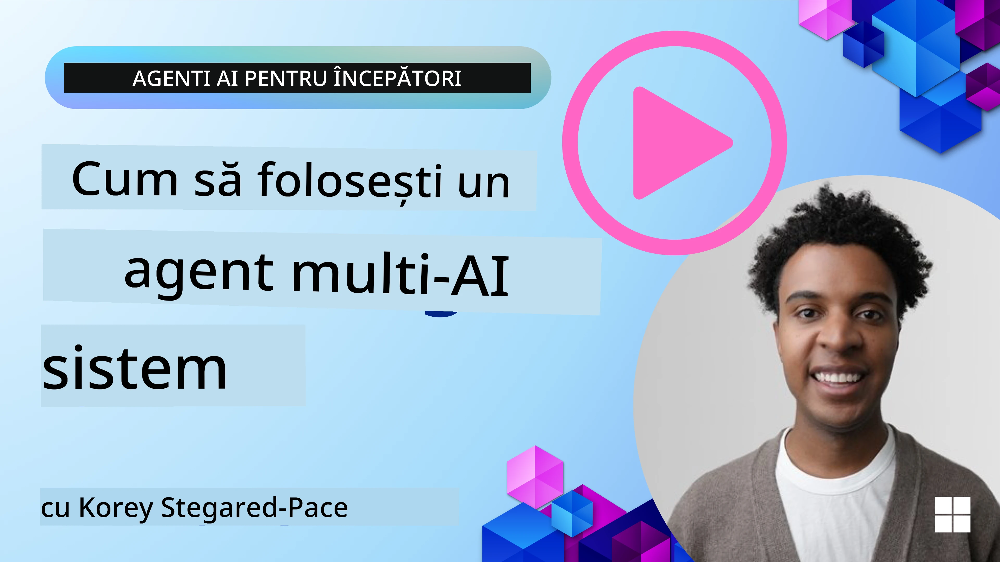
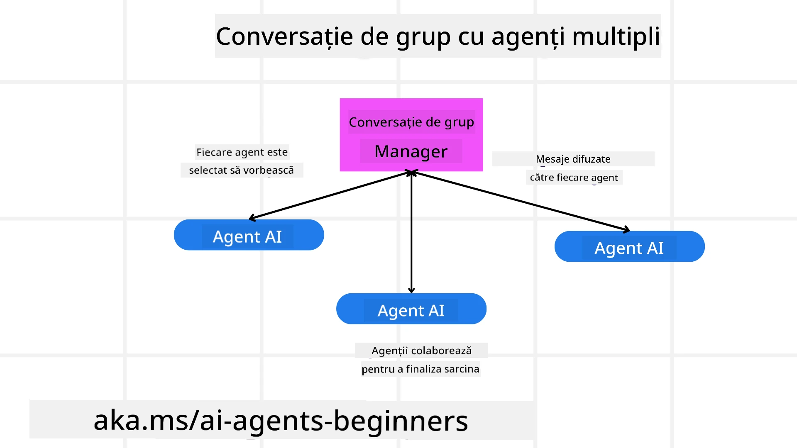
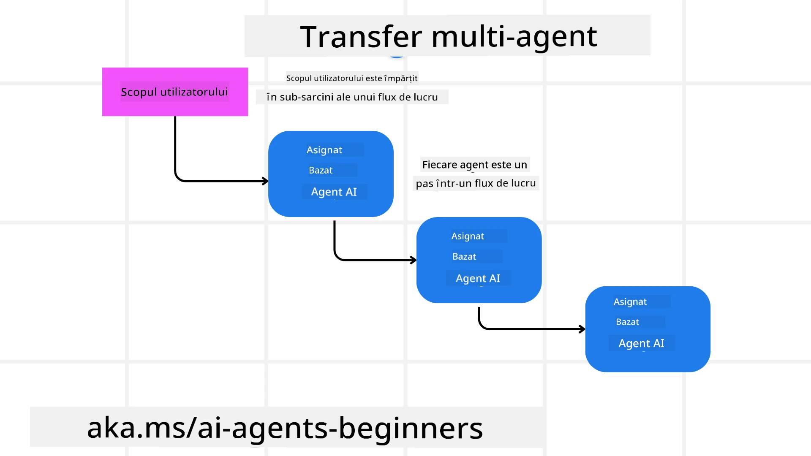
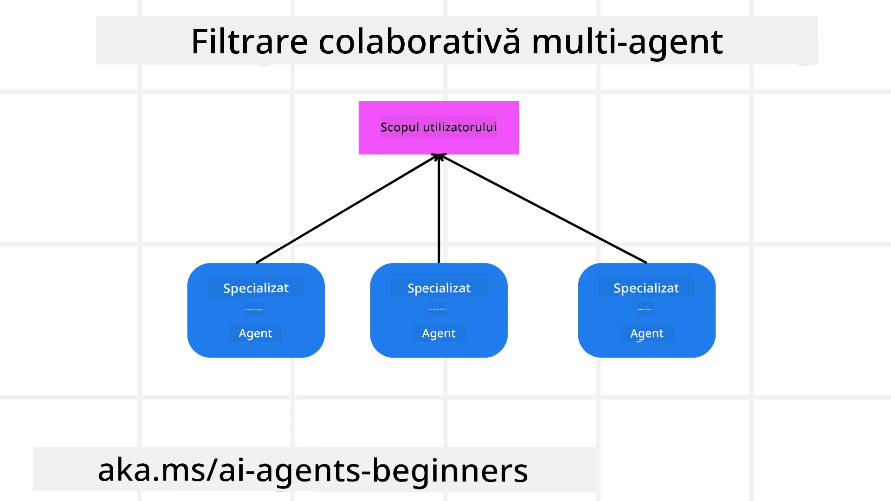

> _(Fă clic pe imaginea de mai sus pentru a viziona videoclipul acestei lecții)_

# Modele de design multi-agent

De îndată ce începi să lucrezi la un proiect care implică mai mulți agenți, va trebui să iei în considerare modelul de design multi-agent. Totuși, s-ar putea să nu fie imediat clar când să treci la multi-agenti și care sunt avantajele acestui lucru.

## Introducere

În această lecție, căutăm să răspundem la următoarele întrebări:

- Care sunt scenariile în care se aplică multi-agentele?
- Care sunt avantajele folosirii multi-agente față de un singur agent care face mai multe sarcini?
- Care sunt elementele constitutive pentru implementarea modelului de design multi-agent?
- Cum putem avea vizibilitate asupra modului în care mai mulți agenți interacționează între ei?

## Obiectivele învățării

După această lecție, ar trebui să poți:

- Identifica scenarii în care se aplică multi-agente
- Recunoaște avantajele folosirii multi-agente față de un agent singular.
- Înțelege elementele constitutive ale implementării modelului de design multi-agent.

Care este imaginea de ansamblu?

*Multi-agentele sunt un model de design care permite mai multor agenți să lucreze împreună pentru a atinge un scop comun*.

Acest model este utilizat pe scară largă în diverse domenii, inclusiv robotică, sisteme autonome și calcul distribuit.

## Scenarii în care se aplică multi-agentele

Deci, ce scenarii sunt cazuri bune de utilizare pentru multi-agente? Răspunsul este că există multe scenarii în care folosirea mai multor agenți este benefică, în special în următoarele cazuri:

- **Sarcini mari de lucru**: Sarcinile mari de lucru pot fi împărțite în sarcini mai mici și atribuite diferiților agenți, permițând procesarea paralelă și finalizarea mai rapidă. Un exemplu este cazul unei sarcini mari de procesare a datelor.
- **Sarcini complexe**: Sarcinile complexe, la fel ca cele mari, pot fi descompuse în subtask-uri mai mici și atribuite agenților diferiți, fiecare specializându-se într-un aspect specific al sarcinii. Un exemplu bun este în cazul vehiculelor autonome, unde diferiți agenți gestionează navigația, detectarea obstacolelor și comunicarea cu alte vehicule.
- **Expertiză diversă**: Agenții diferiți pot avea expertize diverse, permițându-le să gestioneze diferite aspecte ale unei sarcini mai eficient decât un singur agent. Pentru acest caz, un exemplu bun este în domeniul sănătății, unde agenții pot gestiona diagnosticul, planurile de tratament și monitorizarea pacientului.

## Avantajele folosirii multi-agente față de un agent singular

Un sistem cu un singur agent ar putea funcționa bine pentru sarcini simple, dar pentru sarcini mai complexe, utilizarea mai multor agenți poate oferi câteva avantaje:

- **Specializare**: Fiecare agent poate fi specializat pentru o sarcină specifică. Lipsa specializării într-un agent singular înseamnă că ai un agent care poate face totul, dar s-ar putea să se confunde ce trebuie să facă când se confruntă cu o sarcină complexă. De exemplu, s-ar putea să ajungă să facă o sarcină pentru care nu este cel mai potrivit.
- **Scalabilitate**: Este mai ușor să scalezi sistemele adăugând mai mulți agenți decât supraîncărcând un singur agent.
- **Toleranță la erori**: Dacă un agent eșuează, alții pot continua să funcționeze, asigurând fiabilitatea sistemului.

Să luăm un exemplu, să rezervăm o călătorie pentru un utilizator. Un sistem cu un singur agent ar trebui să gestioneze toate aspectele procesului de rezervare a călătoriei, de la găsirea zborurilor la rezervarea hotelurilor și mașinilor de închiriat. Pentru a realiza acest lucru cu un singur agent, acesta ar trebui să aibă uneltele necesare pentru toate aceste sarcini. Aceasta ar putea duce la un sistem complex și monolitic, dificil de întreținut și scalat. Un sistem multi-agent, pe de altă parte, ar putea avea agenți diferiți specializați în găsirea zborurilor, rezervarea hotelurilor și mașinilor de închiriat. Acest lucru ar face sistemul mai modular, mai ușor de întreținut și scalabil.

Compară asta cu o agenție de turism condusă ca un magazin de familie versus o agenție de turism condusă ca o franciză. Magazinul de familie ar avea un singur agent care gestionează toate aspectele procesului de rezervare a călătoriei, în timp ce franciza ar avea agenți diferiți care gestionează diferite aspecte ale procesului.

## Elementele constitutive ale implementării modelului de design multi-agent

Înainte să poți implementa modelul de design multi-agent, trebuie să înțelegi elementele constitutive care alcătuiesc modelul.

Să facem asta mai concret, uitându-ne din nou la exemplul rezervării unei călătorii pentru un utilizator. În acest caz, elementele constitutive ar include:

- **Comunicarea între agenți**: Agenții pentru găsirea zborurilor, rezervarea hotelurilor și a mașinilor de închiriat trebuie să comunice și să partajeze informații despre preferințele și constrângerile utilizatorului. Trebuie să decizi asupra protocoalelor și metodelor pentru această comunicare. Ceea ce înseamnă concret este că agentul care găsește zboruri trebuie să comunice cu agentul care rezervă hoteluri pentru a se asigura că hotelul este rezervat pentru aceleași date ca zborul. Asta înseamnă că agenții trebuie să partajeze informații despre datele de călătorie ale utilizatorului, ceea ce înseamnă că trebuie să decizi *care agenți partajează informații și cum le partajează*.
- **Mecanisme de coordonare**: Agenții trebuie să își coordoneze acțiunile pentru a se asigura că preferințele și constrângerile utilizatorului sunt respectate. O preferință a utilizatorului ar putea fi ca acesta să dorească un hotel aproape de aeroport, iar o constrângere ar putea fi că mașinile de închiriat sunt disponibile doar la aeroport. Asta înseamnă că agentul care rezervă hotelurile trebuie să se coordoneze cu agentul pentru rezervarea mașinilor pentru a se asigura că preferințele și constrângerile utilizatorului sunt respectate. Aceasta înseamnă că trebuie să decizi *cum își coordonează agenții acțiunile*.
- **Arhitectura agentului**: Agenții trebuie să aibă structura internă necesară pentru a lua decizii și a învăța din interacțiunile cu utilizatorul. Asta înseamnă că agentul pentru găsirea zborurilor trebuie să aibă structura internă pentru a lua decizii despre ce zboruri să recomande utilizatorului. Aceasta înseamnă că trebuie să decizi *cum iau agenții decizii și învață din interacțiunile lor cu utilizatorul*. Exemple de cum un agent învață și se îmbunătățește pot fi că agentul pentru găsirea zborurilor ar putea folosi un model de învățare automată pentru a recomanda zboruri utilizatorului bazat pe preferințele acestuia din trecut.
- **Vizibilitatea interacțiunilor multi-agent**: Trebuie să ai vizibilitate asupra modului în care mai mulți agenți interacționează între ei. Aceasta înseamnă că ai nevoie de unelte și metode pentru a urmări activitățile și interacțiunile agenților. Acest lucru poate fi sub forma uneltelor de logare și monitorizare, uneltelor de vizualizare și a metricilor de performanță.
- **Modele multi-agent**: Există modele diferite pentru implementarea sistemelor multi-agent, cum ar fi arhitecturi centralizate, descentralizate și hibride. Trebuie să decizi asupra modelului care se potrivește cel mai bine cazului tău de utilizare.
- **Omul în buclă**: În majoritatea cazurilor, vei avea un om în buclă și trebuie să instruiești agenții când să ceară intervenția umană. Acest lucru peut fi sub forma unui utilizator care solicită un hotel sau zbor specific pe care agenții nu l-au recomandat sau cere confirmare înainte de a efectua rezervarea unui zbor sau hotel.

## Vizibilitatea interacțiunilor multi-agent

Este important să ai vizibilitate asupra modului în care mai mulți agenți interacționează între ei. Această vizibilitate este esențială pentru depanare, optimizare și asigurarea eficienței generale a sistemului. Pentru a realiza acest lucru, ai nevoie de unelte și metode pentru urmărirea activităților și interacțiunilor agenților. Acest lucru poate fi sub forma uneltelor de logare și monitorizare, uneltelor de vizualizare și a metricilor de performanță.

De exemplu, în cazul rezervării unei călătorii pentru un utilizator, ai putea avea un panou de control care arată starea fiecărui agent, preferințele și constrângerile utilizatorului și interacțiunile dintre agenți. Acest panou ar putea afișa datele de călătorie ale utilizatorului, zborurile recomandate de agentul pentru zboruri, hotelurile recomandate de agentul pentru hoteluri și mașinile de închiriat recomandate de agentul pentru mașini. Acesta ți-ar oferi o imagine clară despre cum interacționează agenții între ei și dacă preferințele și constrângerile utilizatorului sunt respectate.

Să analizăm fiecare dintre aceste aspecte mai în detaliu.

- **Unelte de logare și monitorizare**: Vrei să ai logări pentru fiecare acțiune întreprinsă de un agent. O intrare în jurnal ar putea stoca informații despre agentul care a luat acțiunea, acțiunea în sine, timpul la care a fost făcută și rezultatul acțiunii. Aceste informații pot fi apoi folosite pentru depanare, optimizare și altele.
- **Unelte de vizualizare**: Uneltele de vizualizare te pot ajuta să vezi interacțiunile dintre agenți într-un mod mai intuitiv. De exemplu, ai putea avea un grafic care arată fluxul informației între agenți. Acest lucru te poate ajuta să identifici punctele de blocaj, ineficiențele și alte probleme în sistem.
- **Metrici de performanță**: Metricile de performanță te pot ajuta să urmărești eficacitatea sistemului multi-agent. De exemplu, ai putea urmări timpul necesar pentru finalizarea unei sarcini, numărul de sarcini finalizate pe unitatea de timp și acuratețea recomandărilor făcute de agenți. Aceste informații te pot ajuta să identifici zone de îmbunătățire și să optimizezi sistemul.

## Modele multi-agent

Să explorăm câteva modele concrete pe care le putem folosi pentru a crea aplicații multi-agent. Iată câteva modele interesante de luat în considerare:

### Chat de grup

Acest model este util atunci când dorești să creezi o aplicație de chat de grup unde mai mulți agenți pot comunica între ei. Cazuri tipice de utilizare pentru acest model includ colaborarea în echipă, suportul clienți și rețelele sociale.

În acest model, fiecare agent reprezintă un utilizator în chat-ul de grup, iar mesajele sunt schimbate între agenți utilizând un protocol de mesagerie. Agenții pot trimite mesaje către chat-ul de grup, pot primi mesaje de la chat și pot răspunde mesajelor altor agenți.

Acest model poate fi implementat folosind o arhitectură centralizată în care toate mesajele sunt rutate printr-un server central sau o arhitectură descentralizată în care mesajele sunt schimbate direct.

### Transfer de sarcini

Acest model este util când vrei să creezi o aplicație unde mai mulți agenți pot transfera sarcini unul altuia.

Cazuri tipice de utilizare includ suportul clienți, gestionarea sarcinilor și automatizarea fluxului de lucru.

În acest model, fiecare agent reprezintă o sarcină sau un pas într-un flux de lucru, iar agenții pot transfera sarcini altor agenți pe baza unor reguli predefinite.

### Filtrare colaborativă

Acest model este util când dorești să creezi o aplicație în care mai mulți agenți pot colabora pentru a face recomandări utilizatorilor.

Motivul pentru care ai dori ca mai mulți agenți să colaboreze este că fiecare agent poate avea expertiză diferită și poate contribui la procesul de recomandare în moduri diferite.

Să luăm un exemplu în care un utilizator dorește o recomandare privind cel mai bun stoc de cumpărat pe piața bursieră.

- **Expert în industrie**: Un agent ar putea fi expert într-o industrie specifică.
- **Analiză tehnică**: Alt agent ar putea fi expert în analiza tehnică.
- **Analiză fundamentală**: și alt agent ar putea fi expert în analiza fundamentală. Prin colaborare, acești agenți pot oferi o recomandare mai cuprinzătoare utilizatorului.

## Scenariu: Procesul de rambursare

Ia în considerare un scenariu în care un client încearcă să obțină o rambursare pentru un produs, pot fi implicați destui agenți în acest proces, dar să îi împărțim între agenți specifici pentru acest proces și agenți generali care pot fi folosiți în alte procese.

**Agenți specifici pentru procesul de rambursare**:

Următorii sunt agenți care ar putea fi implicați în procesul de rambursare:

- **Agentul clientului**: Acest agent reprezintă clientul și este responsabil pentru inițierea procesului de rambursare.
- **Agentul vânzătorului**: Acest agent reprezintă vânzătorul și este responsabil pentru procesarea rambursării.
- **Agentul plății**: Acest agent reprezintă procesul de plată și este responsabil pentru returnarea banilor clientului.
- **Agentul de rezoluție**: Acest agent reprezintă procesul de rezoluție și este responsabil pentru soluționarea eventualelor probleme apărute în timpul procesului de rambursare.
- **Agentul de conformitate**: Acest agent reprezintă procesul de conformitate și este responsabil pentru asigurarea că procesul de rambursare respectă reglementările și politicile.

**Agenți generali**:

Acești agenți pot fi folosiți în alte părți ale afacerii tale.

- **Agentul de transport**: Acest agent reprezintă procesul de transport și este responsabil pentru expedierea produsului înapoi către vânzător. Acest agent poate fi folosit atât pentru procesul de rambursare, cât și pentru transportul general al unui produs obținut prin cumpărare, de exemplu.
- **Agentul de feedback**: Acest agent reprezintă procesul de feedback și este responsabil pentru colectarea feedback-ului de la client. Feedback-ul poate fi colectat în orice moment, nu doar în timpul procesului de rambursare.
- **Agentul de escaladare**: Acest agent reprezintă procesul de escaladare și este responsabil pentru escaladarea problemelor la un nivel superior de suport. Poți folosi acest tip de agent pentru orice proces în care trebuie să escaladezi o problemă.
- **Agentul de notificări**: Acest agent reprezintă procesul de notificare și este responsabil pentru trimiterea notificărilor către client în diferite stadii ale procesului de rambursare.
- **Agentul de analiză**: Acest agent reprezintă procesul de analiză și este responsabil pentru analiza datelor legate de procesul de rambursare.
- **Agentul de audit**: Acest agent reprezintă procesul de audit și este responsabil pentru auditarea procesului de rambursare pentru a se asigura că se desfășoară corect.
- **Agentul de rapoarte**: Acest agent reprezintă procesul de raportare și este responsabil pentru generarea rapoartelor privind procesul de rambursare.
- **Agentul de cunoștințe**: Acest agent reprezintă procesul de gestionare a cunoștințelor și este responsabil pentru menținerea unei baze de cunoștințe legate de procesul de rambursare. Acest agent ar putea avea cunoștințe atât despre rambursări, cât și despre alte părți ale afacerii tale.
- **Agentul de securitate**: Acest agent reprezintă procesul de securitate și este responsabil pentru asigurarea securității procesului de rambursare.
- **Agentul de calitate**: Acest agent reprezintă procesul de calitate și este responsabil pentru asigurarea calității procesului de rambursare.

Există destui agenți enumerați mai sus, atât pentru procesul specific de rambursare, cât și pentru agenții generali care pot fi utilizați în alte părți ale afacerii tale. Sperăm că acest lucru îți oferă o idee despre cum poți decide asupra agenților pe care să îi folosești în sistemul tău multi-agent.

## Tema

Proiectează un sistem multi-agent pentru un proces de suport clienți. Identifică agenții implicați în proces, rolurile și responsabilitățile lor și cum interacționează între ei. Ia în considerare atât agenții specifici procesului de suport clienți, cât și agenții generali care pot fi utilizați în alte părți ale afacerii tale.
> Gândește-te bine înainte să citești soluția următoare, este posibil să ai nevoie de mai mulți agenți decât crezi.

> TIP: Gândește-te la diferitele etape ale procesului de suport pentru clienți și ia în considerare și agenții necesari pentru orice sistem.

## Soluție

[Solution](./solution/solution.md)

## Verificări de cunoștințe

Întrebare: Când ar trebui să iei în considerare utilizarea mai multor agenți?

- [ ] A1: Când ai un volum mic de muncă și o sarcină simplă.
- [ ] A2: Când ai un volum mare de muncă
- [ ] A3: Când ai o sarcină simplă.

[Solution quiz](./solution/solution-quiz.md)

## Rezumat

În această lecție, am analizat modelul de proiectare multi-agent, inclusiv scenariile în care se aplică multi-agenti, avantajele utilizării mai multor agenți față de un agent singular, elementele de bază pentru implementarea modelului multi-agent și cum să ai vizibilitate asupra modului în care diverși agenți interacționează între ei.

### Ai mai multe întrebări despre Modelul de Proiectare Multi-Agent?

Alătură-te [Microsoft Foundry Discord](https://discord.com/invite/ATgtXmAS5D) pentru a întâlni alți cursanți, a participa la orele de consultanță și a primi răspunsuri la întrebările tale despre Agenții AI.

## Resurse suplimentare

- <a href="https://learn.microsoft.com/azure/ai-services/agents/overview" target="_blank">Documentația Microsoft Agent Framework</a>
- <a href="https://www.analyticsvidhya.com/blog/2024/10/agentic-design-patterns/" target="_blank">Modele de design agentic</a>

## Lecția precedentă

[Planning Design](../07-planning-design/README.md)

## Lecția următoare

[Metacognition in AI Agents](../09-metacognition/README.md)

---

<!-- CO-OP TRANSLATOR DISCLAIMER START -->
**Declinare a responsabilității**:
Acest document a fost tradus folosind serviciul de traducere AI [Co-op Translator](https://github.com/Azure/co-op-translator). În timp ce ne străduim pentru acuratețe, vă rugăm să rețineți că traducerile automate pot conține erori sau inexactități. Documentul original în limba sa nativă trebuie considerat sursa autorizată. Pentru informații critice, se recomandă traducerea profesională realizată de un om. Nu ne asumăm responsabilitatea pentru eventualele neînțelegeri sau interpretări greșite care decurg din utilizarea acestei traduceri.
<!-- CO-OP TRANSLATOR DISCLAIMER END -->