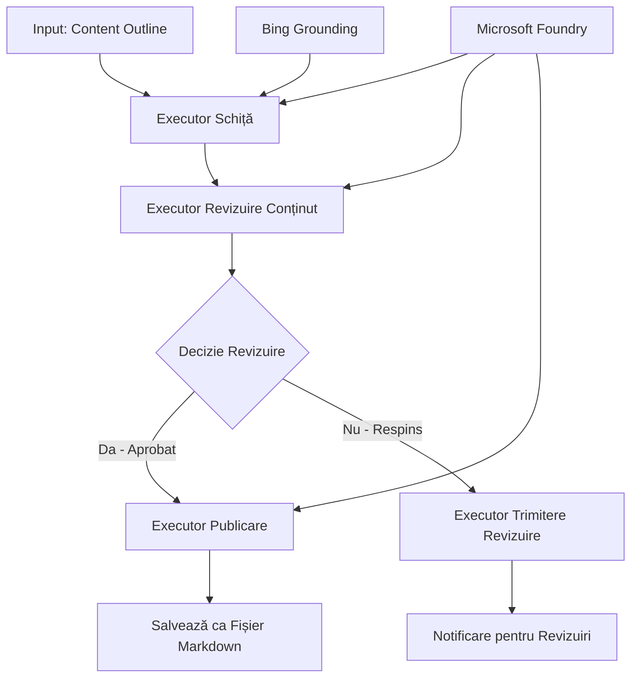

# 🔀 Fluxuri de lucru condiționale pentru agenți cu Microsoft Foundry (.NET)

## 📋 Tutorial Flux de lucru bazat pe decizii inteligente

Acest notebook demonstrează **modele condiționale de flux de lucru** folosind Microsoft Foundry și Microsoft Agent Framework pentru .NET. Veți învăța cum să construiți fluxuri de lucru sofisticate, conduse de decizii, care direcționează inteligent procesarea bazată pe analiza AI, reguli de afaceri și condiții dinamice pentru automatizare la nivel enterprise.

## 🎯 Obiective de învățare

### 🧠 **Arhitectura decizională inteligentă**
- **Implementare Logică Condițională**: Construiește arbori decizionali complecși cu multiple ramuri
- **Direcționare cu Inteligență Artificială**: Folosește modele Microsoft Foundry pentru a lua decizii inteligente de direcționare
- **Adaptare Dinamică a Fluxului de lucru**: Modifică comportamentul fluxului pe baza analizei și condițiilor la runtime
- **Integrarea Regulilor Enterprise**: Încorporează logica de afaceri și cerințele de conformitate în fluxuri de lucru

### 🔀 **Modele Avansate Condiționale**
- **Luarea Deciziilor pe Baze Multiple**: Evaluează mai mulți factori pentru deciziile de direcționare
- **Procesare Context-Aware**: Ia decizii bazate pe contextul acumulat și istoricul fluxului de lucru
- **Modificare Adaptivă a Fluxului**: Ajustează dinamic căile de procesare în funcție de condiții în timp real
- **Integrarea Motorului de Reguli**: Implementează motoare sofisticate pentru reguli de afaceri în fluxuri de lucru

### 🏢 **Aplicații Condiționale Enterprise**
- **Clasificarea și Direcționarea Documentelor**: Clasifică și direcționează automat documentele către fluxurile potrivite
- **Trierea Serviciilor pentru Clienți**: Direcționare inteligentă a solicitărilor clienților către echipe specializate
- **Procesare pentru Conformitate și Risc**: Aplică procese diferite de validare și revizuire în funcție de evaluarea riscului
- **Fluxuri de lucru pentru Asigurarea Calității**: Direcționează conținutul prin procese adecvate de revizuire bazate pe metrici de calitate

## ⚙️ Precondiții & Configurare

### 📦 **Pachete NuGet Necesare**

Pachete avansate pentru procesarea fluxurilor condiționale:

```xml
<!-- Core AI Framework -->
<PackageReference Include="Microsoft.Extensions.AI" Version="9.9.0" />

<!-- Azure AI Agents with Persistent State -->
<PackageReference Include="Azure.AI.Agents.Persistent" Version="1.2.0-beta.5" />

<!-- Azure Identity and Utilities -->
<PackageReference Include="Azure.Identity" Version="1.15.0" />
<PackageReference Include="System.Linq.Async" Version="6.0.3" />
<PackageReference Include="DotNetEnv" Version="3.1.1" />

<!-- Local Workflow Framework References -->
<!-- Microsoft.Agents.Workflows.dll - Advanced workflow orchestration -->
<!-- Microsoft.Agents.AI.AzureAI.dll - Microsoft Foundry integration -->
<!-- Microsoft.Agents.AI.dll - Core agent abstractions -->
```

### 🔑 **Configurarea Microsoft Foundry**

**Resurse Azure Necesare:**
- Workspace Microsoft Foundry cu modele de procesare condiționale
- Subscripție Azure cu cote și permisiuni corespunzătoare pentru compute
- Modele AI implementate pentru luarea deciziilor și analiza conținutului
- (Opțional) Conexiune API Bing Search pentru capabilități de fundamentare

**Configurare Mediu (.env):**
```env
# Microsoft Foundry Configuration
AZURE_AI_PROJECT_ENDPOINT=https://your-project.cognitiveservices.azure.com/
BING_CONNECTION_ID=your-bing-connection-id
```

**Setare Autentificare:**
```csharp
// Azure CLI or Managed Identity authentication
using Azure.Identity;
var credential = new AzureCliCredential();

// Load environment configuration
DotNetEnv.Env.Load("../../../.env");
```

### 🏗️ **Arhitectura fluxului condițional**



**Componente cheie:**
- **Executor Draft**: Agent AI care creează schițe inițiale din contururi
- **Executor Revizuire Conținut**: Agent AI care evaluează calitatea și conformitatea schiței
- **Direcționare Condițională**: Logică decizională care direcționează în funcție de rezultatele revizuirii
- **Căi Publicare/Revizuire**: Căi de procesare separate pentru conținut aprobat versus respins
- **Management Stare**: Menține contextul conținutului și al revizuirii pe durata fluxului

## 🎨 **Modele de Design pentru Fluxuri Condiționale**

### 📋 **Producție de conținut cu porți de calitate**
```
Outline → Draft Creation → Quality Review → {Approve: Publish | Reject: Revise}
```

### 🎯 **Procesare documente bazată pe risc**
```
Document → Risk Assessment → {Low: Standard | High: Enhanced Review}
```

### 🔍 **Direcționare inteligentă a serviciului pentru clienți**
```
Customer Query → Analysis → {Simple: FAQ Bot | Complex: Human Agent}
```

### 💼 **Fluxuri de lucru orientate spre conformitate**
```
Content → Compliance Check → {Pass: Publish | Fail: Legal Review}
```

## 🏢 **Beneficii condiționale la nivel enterprise**

### 🎯 **Automatizare inteligentă**
- **Luare inteligentă a deciziilor**: Decizii de routing bazate pe analiza conținutului și context
- **Procesare adaptivă**: Fluxuri care se ajustează automat conform schimbărilor de condiții
- **Aplicarea regulilor de afaceri**: Aplicarea automată a logicii și politicilor complexe de afaceri
- **Direcționare context-aware**: Decizii bazate pe istoricul complet al fluxului de lucru și context acumulat

### 📈 **Excelență operațională**
- **Alocare optimizată a resurselor**: Direcționează munca către specialiști și procese cele mai potrivite
- **Intervenție manuală redusă**: Deciziile automatizate minimizează necesitatea direcționării umane
- **Timp de rezolvare mai rapid**: Direcționare directă către expertiza și capacitățile necesare
- **Aplicare consecventă**: Aplicare uniformă a regulilor și criteriilor decizionale de afaceri

### 🛡️ **Gestionarea riscurilor & conformitate**
- **Evaluare automată a riscurilor**: Evaluare AI a nivelurilor de risc pentru conținut și situații
- **Aplicare conformitate**: Direcționare automată prin procesele reglementare necesare
- **Aplicarea protocoalelor de securitate**: Măsuri de securitate sporite bazate pe evaluarea riscului
- **Menținerea traseului de audit**: Documentație completă a deciziilor de direcționare și a motivațiilor

### 📊 **Analiză & Îmbunătățire continuă**
- **Analiză decizională**: Urmărește eficacitatea și acuratețea deciziilor de direcționare
- **Recunoașterea modelelor**: Identifică tendințe și tipare în deciziile de direcționare în timp
- **Optimizarea performanței**: Îmbunătățire continuă a criteriilor decizionale și a eficienței de routing
- **Inteligență de afaceri**: Informații despre caracteristicile conținutului și cerințele de procesare

### 🔧 **Excelență tehnică**
- **Management persistent al stării**: Menține stări complexe pe durata executării fluxului de lucru
- **Arhitectură scalabilă**: Suportă cerințe de procesare condiționată la volum mare
- **Capabilități de integrare**: Integrare fără probleme cu sistemele și procesele existente de afaceri
- **Monitorizare & Observabilitate**: Urmărire cuprinzătoare a performanței și deciziilor fluxului de lucru

Să construim fluxuri de lucru enterprise inteligente și conduse de decizii cu .NET! 🚀

## 💻 Rularea codului

Implementarea completă este disponibilă în `04.dotnet-agent-framework-workflow-aifoundry-condition.cs`. Aceasta demonstrează un **flux de lucru pentru producția de conținut cu porți de calitate**:

### 🏗️ **Arhitectura fluxului de lucru**

```
Content Outline → Draft Creation → Quality Review → Conditional Routing:
                                                      ├─ Approved (>200 words) → Publish
                                                      └─ Rejected (<200 words) → Review Notification
```

**Agenți în fluxul de lucru:**
1. **Agentul Evanghelist**: Creează schițe tutoriale din contururi cu fundamentare Bing
2. **Agentul Revizor de Conținut**: Evaluează calitatea schiței (număr de cuvinte, completitudine)
3. **Agentul Editor**: Salvează conținutul aprobat ca fișiere Markdown cu timestamp

**Executori personalizați:**
1. **DraftExecutor**: Orchestrază crearea schițelor
2. **ContentReviewExecutor**: Realizează evaluarea calității
3. **PublishExecutor**: Se ocupă de publicarea conținutului aprobat
4. **SendReviewExecutor**: Gestionează notificările pentru conținutul respins

### 🚀 Rularea exemplului

**Precondiții:**
- Workspace Microsoft Foundry configurat
- Autentificare Azure CLI (`az login`)
- (Opțional) Conexiune Bing Search pentru fundamentare

```bash
# Fă scriptul executabil (Unix/Linux/macOS)
chmod +x 04.dotnet-agent-framework-workflow-aifoundry-condition.cs

# Rulează fluxul de lucru condiționat
./04.dotnet-agent-framework-workflow-aifoundry-condition.cs
```

Sau pe Windows:
```powershell
dotnet run 04.dotnet-agent-framework-workflow-aifoundry-condition.cs
```

### 📝 Ieșire așteptată

Fluxul de lucru va:
1. **Crea agenți**: Inițializează trei agenți Microsoft Foundry specializați
2. **Generează schița**: Agentul Evanghelist creează schița tutorială din contur
3. **Revizuiește conținutul**: Agentul Revizor evaluează calitatea schiței
4. **Direcționare condițională**:
   - **Dacă aprobată (>200 cuvinte)**: Executorul de publicare salvează ca fișier Markdown
   - **Dacă respinsă (<200 cuvinte)**: Trimite notificare de revizuire
5. **Afișează rezultate**: Arată rezultatul final al fluxului de lucru

### 🔧 Opțiuni de personalizare

**Modifică criteriile de revizuire:**
```csharp
const string ContentReviewerInstructions = @"
You are a content reviewer...
1. Check if content is more than 500 words (instead of 200)
2. Verify technical accuracy
3. Ensure proper formatting
...";
```

**Adaugă mai multe căi condiționale:**
```csharp
var workflow = new WorkflowBuilder(draftExecutor)
    .AddEdge(draftExecutor, contentReviewerExecutor)
    .AddEdge(contentReviewerExecutor, publishExecutor, condition: GetCondition("Excellent"))
    .AddEdge(contentReviewerExecutor, editExecutor, condition: GetCondition("Good"))
    .AddEdge(contentReviewerExecutor, sendReviewerExecutor, condition: GetCondition("Poor"))
    .Build();
```

**Schimbă cerințele pentru conținut:**
```csharp
string OUTLINE_Content = @"
# Your Custom Topic
## Section 1
https://your-reference-url
## Section 2
...
";
```

### 🎯 Aplicații din lumea reală

Acest model de flux condițional este ideal pentru:
- **Sisteme de gestionare a conținutului**: Fluxuri editoriale automatizate cu porți de calitate
- **Procesare documente**: Direcționează documentele pe baza clasificării și conformității
- **Suport Clienți**: Dirijare inteligentă a tichetelor bazată pe complexitate și urgență
- **Revizuire juridică**: Direcționare a contractelor pe baza evaluării riscului și valorii
- **Procese HR**: Direcționează cererile prin fluxuri adecvate de screening

### 🔍 Înțelegerea logicii condiționale

**Funcția de condiție:**
```csharp
public Func<object?, bool> GetCondition(string expectedResult) =>
    reviewResult => reviewResult is ReviewResult review && review.Result == expectedResult;
```

Această funcție creează un predicat care:
1. Verifică dacă rezultatul este de tip `ReviewResult`
2. Compară proprietatea `Result` cu valoarea așteptată
3. Returnează true/false pentru a determina direcționarea

**Muchii de flux cu condiții:**
```csharp
.AddEdge(contentReviewerExecutor, publishExecutor, condition: GetCondition("Yes"))
.AddEdge(contentReviewerExecutor, sendReviewerExecutor, condition: GetCondition("No"))
```

### 📊 Caracteristici avansate

**Validarea schema JSON:**
Fluxul folosește scheme JSON pentru a asigura răspunsuri structurate:

```csharp
// Define response structure
public class ReviewResult
{
    [JsonPropertyName("review_result")]
    public string Result { get; set; } = string.Empty;
    
    [JsonPropertyName("reason")]
    public string Reason { get; set; } = string.Empty;
    
    [JsonPropertyName("draft_content")]
    public string DraftContent { get; set; } = string.Empty;
}

// Apply to agent
ResponseFormat = ChatResponseFormat.ForJsonSchema(
    AIJsonUtilities.CreateJsonSchema(typeof(ReviewResult)), 
    "ReviewResult", 
    "Review Result From DraftContent"
)
```

**Integrare fundamentare Bing:**
Agentul Evanghelist folosește fundamentarea Bing pentru a accesa informații în timp real:

```csharp
var bingGroundingConfig = new BingGroundingSearchConfiguration(bing_conn_id);
BingGroundingToolDefinition bingGroundingTool = new(
    new BingGroundingSearchToolParameters([bingGroundingConfig])
);
```

Aceasta îi permite agentului să urmeze URL-uri din contur și să extragă informații actualizate.

### 🛡️ Gestionarea erorilor

Fluxul include gestionare robustă a erorilor pentru conținutul respins:
- Eșecurile la revizuire declanșează calea alternativă
- Notificările oferă motive clare pentru respingere
- Conținutul este păstrat pentru revizuire

### 🔄 Extinderea fluxului de lucru

**Adaugă buclă de revizuire:**
Creează un ciclu de feedback care reface automat conținutul:

```csharp
.AddEdge(contentReviewerExecutor, publishExecutor, condition: GetCondition("Yes"))
.AddEdge(contentReviewerExecutor, draftExecutor, condition: GetCondition("No")) // Loop back
```

**Implementează revizuire multi-nivel:**
Adaugă mai multe etape de revizuire cu criterii diferite:

```csharp
.AddEdge(draftExecutor, technicalReviewer)
.AddEdge(technicalReviewer, editorialReviewer, condition: GetCondition("TechPass"))
.AddEdge(editorialReviewer, publishExecutor, condition: GetCondition("EditPass"))
```

Acest model de flux condițional oferă fundația pentru construirea unor sisteme sofisticate, inteligente de automatizare enterprise! 🚀

---

<!-- CO-OP TRANSLATOR DISCLAIMER START -->
**Declinare a responsabilității**:
Acest document a fost tradus folosind serviciul de traducere AI [Co-op Translator](https://github.com/Azure/co-op-translator). În timp ce ne străduim pentru acuratețe, vă rugăm să rețineți că traducerile automate pot conține erori sau inexactități. Documentul original în limba sa nativă trebuie considerat sursa autorizată. Pentru informații critice, se recomandă traducerea profesională realizată de un om. Nu ne asumăm responsabilitatea pentru eventualele neînțelegeri sau interpretări greșite care decurg din utilizarea acestei traduceri.
<!-- CO-OP TRANSLATOR DISCLAIMER END -->