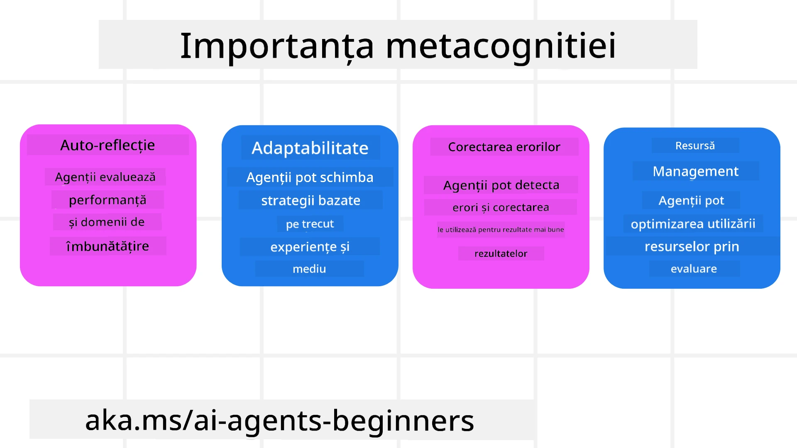
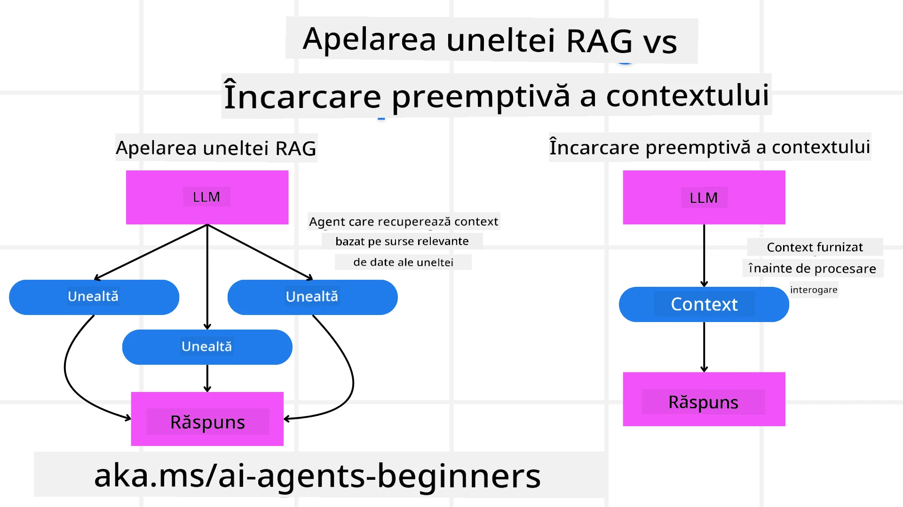

[](https://youtu.be/His9R6gw6Ec?si=3_RMb8VprNvdLRhX)

> _(Dă click pe imaginea de mai sus pentru a vizualiza videoclipul lecției)_
# Metacogniție în Agenții AI

## Introducere

Bine ai venit la lecția despre metacogniție în agenții AI! Acest capitol este destinat începătorilor curioși să afle cum agenții AI pot reflecta asupra propriilor lor procese de gândire. La finalul acestei lecții, vei înțelege conceptele cheie și vei fi echipat cu exemple practice pentru a aplica metacogniția în designul agenților AI.

## Obiective de Învățare

După încheierea acestei lecții, vei putea:

1. Să înțelegi implicațiile ciclurilor de raționament în definițiile agenților.
2. Să folosești tehnici de planificare și evaluare pentru a ajuta agenții autocorectivi.
3. Să creezi proprii agenți capabili să manipuleze cod pentru a îndeplini sarcini.

## Introducere în Metacogniție

Metacogniția se referă la procesele cognitive de ordin superior care implică gândirea despre propria gândire. Pentru agenții AI, aceasta înseamnă să fie capabili să evalueze și să ajusteze acțiunile bazate pe conștientizarea de sine și pe experiențele trecute. Metacogniția, sau „gândirea despre gândire,” este un concept important în dezvoltarea sistemelor agentice AI. Implică faptul că sistemele AI sunt conștiente de propriile lor procese interne și pot monitoriza, regla și adapta comportamentul în consecință. La fel cum facem noi când analizăm situația sau privim o problemă. Această conștientizare de sine poate ajuta sistemele AI să ia decizii mai bune, să identifice erorile și să își îmbunătățească performanța în timp - revenind astfel la testul lui Turing și la dezbaterea dacă AI va prelua controlul.

În contextul sistemelor agentice AI, metacogniția poate ajuta la rezolvarea mai multor provocări, cum ar fi:
- Transparență: Asigurarea că sistemele AI pot explica raționamentul și deciziile lor.
- Raționament: Sporirea capacității sistemelor AI de a sintetiza informații și de a lua decizii corecte.
- Adaptare: Permiterea sistemelor AI să se adapteze la medii noi și condiții schimbătoare.
- Percepție: Îmbunătățirea acurateței sistemelor AI în recunoașterea și interpretarea datelor din mediul înconjurător.

### Ce este Metacogniția?

Metacogniția, sau „gândirea despre gândire,” este un proces cognitiv de ordin superior care implică conștientizarea de sine și autoreglarea propriilor procese cognitive. În domeniul AI, metacogniția dă putere agenților să evalueze și să adapteze strategiile și acțiunile lor, conducând la capabilități îmbunătățite de rezolvare a problemelor și luare a deciziilor. Prin înțelegerea metacogniției, poți proiecta agenți AI care nu sunt doar mai inteligenți, ci și mai adaptabili și eficienți. În metacogniția adevărată, ai vedea AI-ul raționând explicit despre propriul său raționament.

Exemplu: „Am prioritizat zborurile mai ieftine pentru că... S-ar putea să ratez zboruri directe, așa că o să verific din nou.”.
Ține evidența modului sau motivului pentru care a ales o anumită rută.
- Observând că a făcut greșeli pentru că s-a bazat prea mult pe preferințele utilizatorului din ultima dată, astfel își modifică strategia de luare a deciziilor, nu doar recomandarea finală.
- Diagnosticând tipare precum: „Ori de câte ori aud utilizatorul menționând ’prea aglomerat,’ nu doar că ar trebui să îndepărtez anumite atracții, dar și să reflectez că metoda mea de a alege „principalele atracții” este defectuoasă dacă întotdeauna le clasific după popularitate.”

### Importanța Metacogniției în Agenții AI

Metacogniția joacă un rol crucial în designul agenților AI din mai multe motive:



- Auto-reflecție: Agenții își pot evalua performanța și pot identifica ariile care necesită îmbunătățiri.
- Adaptabilitate: Agenții își pot modifica strategiile bazate pe experiențele trecute și mediile în schimbare.
- Corectarea erorilor: Agenții pot detecta și corecta erori în mod autonom, conducând la rezultate mai precise.
- Gestionarea resurselor: Agenții pot optimiza utilizarea resurselor, precum timpul și puterea de calcul, prin planificarea și evaluarea acțiunilor.

## Componentele unui Agent AI

Înainte de a aprofunda procesele metacognitive, este esențial să înțelegi componentele de bază ale unui agent AI. Un agent AI constă de obicei din:

- Persona: Personalitatea și caracteristicile agentului, care definesc modul în care interacționează cu utilizatorii.
- Unelte: Capacitățile și funcțiile pe care le poate îndeplini agentul.
- Abilități: Cunoștințele și expertiza pe care le posedă agentul.

Aceste componente lucrează împreună pentru a crea o „unitate de expertiză” care poate îndeplini sarcini specifice.

**Exemplu**:
Gândește-te la un agent de turism, servicii ale agentului care nu doar îți planifică vacanța, ci își ajustează și traseul bazat pe date în timp real și pe experiențele trecute ale clienților.

### Exemplu: Metacogniție într-un Serviciu de Agent de Turism

Imaginează-ți că proiectezi un serviciu de agent de turism alimentat de AI. Acest agent, „Agent de Turism,” asistă utilizatorii în planificarea vacanțelor. Pentru a incorpora metacogniția, Agentul de Turism trebuie să-și evalueze și să-și ajusteze acțiunile pe baza conștientizării de sine și a experiențelor trecute. Iată cum metacogniția ar putea juca un rol:

#### Sarcina Curentă

Sarcina curentă este să ajuți un utilizator să planifice o călătorie la Paris.

#### Pași pentru Îndeplinirea Sarcinii

1. **Colectarea Preferințelor Utilizatorului**: Întreabă utilizatorul despre datele de călătorie, buget, interese (de exemplu, muzee, bucătărie, cumpărături) și orice cerințe specifice.
2. **Recuperarea Informațiilor**: Caută opțiuni de zbor, cazare, atracții și restaurante care să corespundă preferințelor utilizatorului.
3. **Generarea Recomandărilor**: Oferă un itinerar personalizat cu detalii despre zboruri, rezervări la hotel și activități sugerate.
4. **Ajustarea Bazată pe Feedback**: Cere utilizatorului păreri despre recomandări și fă ajustările necesare.

#### Resurse Necesare

- Acces la baze de date pentru rezervări de zboruri și hoteluri.
- Informații despre atracții și restaurante din Paris.
- Date de feedback de la utilizatori din interacțiuni anterioare.

#### Experiență și Auto-reflecție

Agentul de Turism folosește metacogniția pentru a-și evalua performanța și a învăța din experiențele trecute. De exemplu:

1. **Analiza Feedback-ului Utilizatorului**: Agentul de Turism revizuiește feedback-ul pentru a determina care recomandări au fost bine primite și care nu, ajustând sugestiile viitoare în consecință.
2. **Adaptabilitate**: Dacă un utilizator a menționat anterior că nu-i plac locurile aglomerate, Agentul de Turism va evita să recomande punctele turistice populare în orele de vârf.
3. **Corectarea Erorilor**: Dacă Agentul de Turism a făcut o greșeală în rezervarea anterioară, cum ar fi recomandarea unui hotel complet rezervat, învață să verifice disponibilitatea mai riguros înainte de a face recomandări.

#### Exemplu Practic pentru Dezvoltatori

Iată un exemplu simplificat de cod pentru Agentul de Turism care încorporează metacogniția:

```python
class Travel_Agent:
    def __init__(self):
        self.user_preferences = {}
        self.experience_data = []

    def gather_preferences(self, preferences):
        self.user_preferences = preferences

    def retrieve_information(self):
        # Caută zboruri, hoteluri și atracții în funcție de preferințe
        flights = search_flights(self.user_preferences)
        hotels = search_hotels(self.user_preferences)
        attractions = search_attractions(self.user_preferences)
        return flights, hotels, attractions

    def generate_recommendations(self):
        flights, hotels, attractions = self.retrieve_information()
        itinerary = create_itinerary(flights, hotels, attractions)
        return itinerary

    def adjust_based_on_feedback(self, feedback):
        self.experience_data.append(feedback)
        # Analizează feedback-ul și ajustează recomandările viitoare
        self.user_preferences = adjust_preferences(self.user_preferences, feedback)

# Exemplu de utilizare
travel_agent = Travel_Agent()
preferences = {
    "destination": "Paris",
    "dates": "2025-04-01 to 2025-04-10",
    "budget": "moderate",
    "interests": ["museums", "cuisine"]
}
travel_agent.gather_preferences(preferences)
itinerary = travel_agent.generate_recommendations()
print("Suggested Itinerary:", itinerary)
feedback = {"liked": ["Louvre Museum"], "disliked": ["Eiffel Tower (too crowded)"]}
travel_agent.adjust_based_on_feedback(feedback)
```

#### De ce Contează Metacogniția

- **Auto-reflecție**: Agenții pot analiza performanța și identifica zonele pentru îmbunătățire.
- **Adaptabilitate**: Agenții pot modifica strategiile bazat pe feedback și condiții schimbătoare.
- **Corectarea Erorilor**: Agenții pot detecta și corecta greșelile în mod autonom.
- **Gestionarea Resurselor**: Agenții pot optimiza utilizarea resurselor, precum timpul și puterea de calcul.

Prin incorporarea metacogniției, Agentul de Turism poate oferi recomandări de călătorie mai personalizate și precise, îmbunătățind experiența generală a utilizatorului.

---

## 2. Planificarea în Agenți

Planificarea este o componentă critică a comportamentului agenților AI. Implică conturarea pașilor necesari pentru atingerea unui obiectiv, luând în considerare starea curentă, resursele și eventualele obstacole.

### Elemente ale Planificării

- **Sarcina Curentă**: Definește clar sarcina.
- **Pași pentru Îndeplinirea Sarcinii**: Fragmentarea sarcinii în pași gestionabili.
- **Resurse Necesare**: Identifică resursele necesare.
- **Experiență**: Folosește experiențele anterioare pentru a informa planificarea.

**Exemplu**:
Iată pașii pe care Agentul de Turism trebuie să îi urmeze pentru a ajuta eficient un utilizator să-și planifice călătoria:

### Pași pentru Agentul de Turism

1. **Colectarea Preferințelor Utilizatorului**
   - Întreabă utilizatorul detalii despre datele de călătorie, buget, interese și eventuale cerințe specifice.
   - Exemple: „Când plănuiești să călătorești?”, „Care este intervalul tău de buget?”, „Ce activități îți plac în vacanțe?”

2. **Recuperarea Informațiilor**
   - Caută opțiuni relevante de călătorie bazate pe preferințele utilizatorului.
   - **Zboruri**: Caută zboruri disponibile în bugetul și datele preferate ale utilizatorului.
   - **Cazări**: Găsește hoteluri sau proprietăți de închiriat care se potrivesc preferințelor privind locația, prețul și facilitățile.
   - **Atracții și Restaurante**: Identifică atracții populare, activități și opțiuni de luat masa care se aliniază intereselor utilizatorului.

3. **Generarea Recomandărilor**
   - Compune informațiile recuperate într-un itinerar personalizat.
   - Oferă detalii precum opțiuni de zbor, rezervări la hotel și activități sugerate, asigurând personalizarea recomandărilor conform preferințelor utilizatorului.

4. **Prezentarea Itinerariului Utilizatorului**
   - Împărtășește itinerariul propus utilizatorului pentru a-l analiza.
   - Exemplu: „Iată un itinerar sugerat pentru călătoria ta la Paris. Include detalii despre zbor, rezervări la hotel și o listă cu activități și restaurante recomandate. Aștept să-mi spui ce părere ai!”

5. **Colectarea Feedback-ului**
   - Cere utilizatorului păreri despre itinerariul propus.
   - Exemple: „Îți plac opțiunile de zbor?”, „Hotelul este potrivit pentru nevoile tale?”, „Există activități pe care vrei să le adaugi sau elimini?”

6. **Ajustarea Bazată pe Feedback**
   - Modifică itinerariul în funcție de feedback-ul utilizatorului.
   - Fă schimbările necesare la recomandările privind zborul, cazarea și activitățile pentru a corespunde mai bine preferințelor utilizatorului.

7. **Confirmarea Finală**
   - Prezintă itinerariul actualizat pentru confirmarea finală a utilizatorului.
   - Exemplu: „Am făcut ajustările conform feedback-ului tău. Iată itinerarul actualizat. E totul în regulă pentru tine?”

8. **Rezervarea și Confirmarea Rezervărilor**
   - După aprobarea itinerariului de către utilizator, continuă cu rezervarea zborurilor, cazării și a activităților planificate.
   - Trimite detaliile de confirmare utilizatorului.

9. **Oferirea Suportului Continu**
   - Rămâi disponibil pentru a ajuta utilizatorul cu orice modificări sau cereri suplimentare înainte și pe durata călătoriei.
   - Exemplu: „Dacă ai nevoie de ajutor suplimentar pe parcursul călătoriei, nu ezita să mă contactezi oricând!”

### Exemplu de Interacțiune

```python
class Travel_Agent:
    def __init__(self):
        self.user_preferences = {}
        self.experience_data = []

    def gather_preferences(self, preferences):
        self.user_preferences = preferences

    def retrieve_information(self):
        flights = search_flights(self.user_preferences)
        hotels = search_hotels(self.user_preferences)
        attractions = search_attractions(self.user_preferences)
        return flights, hotels, attractions

    def generate_recommendations(self):
        flights, hotels, attractions = self.retrieve_information()
        itinerary = create_itinerary(flights, hotels, attractions)
        return itinerary

    def adjust_based_on_feedback(self, feedback):
        self.experience_data.append(feedback)
        self.user_preferences = adjust_preferences(self.user_preferences, feedback)

# Exemplu de utilizare într-o cerere de rezervare
travel_agent = Travel_Agent()
preferences = {
    "destination": "Paris",
    "dates": "2025-04-01 to 2025-04-10",
    "budget": "moderate",
    "interests": ["museums", "cuisine"]
}
travel_agent.gather_preferences(preferences)
itinerary = travel_agent.generate_recommendations()
print("Suggested Itinerary:", itinerary)
feedback = {"liked": ["Louvre Museum"], "disliked": ["Eiffel Tower (too crowded)"]}
travel_agent.adjust_based_on_feedback(feedback)
```

## 3. Sistemul Corectiv RAG

Să începem mai întâi prin înțelegerea diferenței dintre Instrumentul RAG și Încărcarea Preemptivă a Contextului.



### Generarea Augmentată cu Recuperare (RAG)

RAG combină un sistem de recuperare cu un model generativ. Când se face o interogare, sistemul de recuperare aduce documente sau date relevante dintr-o sursă externă, iar informația recuperată este folosită pentru a amplifica intrarea către modelul generativ. Acest lucru îl ajută pe model să genereze răspunsuri mai precise și contextuale.

Într-un sistem RAG, agentul recuperează informații relevante dintr-o bază de cunoștințe și le folosește pentru a genera răspunsuri sau acțiuni adecvate.

### Abordarea Corectivă RAG

Abordarea Corectivă RAG se concentrează pe folosirea tehnicilor RAG pentru corectarea erorilor și îmbunătățirea preciziei agenților AI. Aceasta implică:

1. **Tehnica de Promptare**: Folosirea unor prompturi specifice pentru a ghida agentul în recuperarea de informații relevante.
2. **Instrument**: Implementarea algoritmilor și mecanismelor care permit agentului să evalueze relevanța informațiilor recuperate și să genereze răspunsuri precise.
3. **Evaluare**: Evaluarea continuă a performanței agentului și ajustarea pentru îmbunătățirea acurateței și eficienței.

#### Exemplu: RAG Corectiv într-un Agent de Căutare

Ia în considerare un agent de căutare care recuperează informații de pe web pentru a răspunde interogărilor utilizatorului. Abordarea Corectivă RAG ar putea implica:

1. **Tehnica de Promptare**: Formularea de interogări de căutare bazate pe input-ul utilizatorului.
2. **Instrument**: Folosirea procesării limbajului natural și a algoritmilor de învățare automată pentru a clasifica și filtra rezultatele căutării.
3. **Evaluare**: Analiza feedback-ului utilizatorului pentru identificarea și corectarea inexactităților în informațiile recuperate.

### RAG Corectiv în Agentul de Turism

RAG Corectiv (Generare Augmentată cu Recuperare) îmbunătățește capacitatea AI de a recupera și genera informații, corectând orice inexactități. Să vedem cum Agentul de Turism poate folosi abordarea Corectivă RAG pentru a oferi recomandări de călătorie mai precise și relevante.

Aceasta implică:

- **Tehnica de Promptare:** Folosirea unor prompturi specifice pentru a ghida agentul în recuperarea de informații relevante.
- **Instrument:** Implementarea algoritmilor și mecanismelor care permit agentului să evalueze relevanța informațiilor recuperate și să genereze răspunsuri precise.
- **Evaluare:** Evaluarea continuă a performanței agentului și ajustarea pentru îmbunătățirea acurateței și eficienței.

#### Pași pentru Implementarea RAG Corectiv în Agentul de Turism

1. **Interacțiunea Inițială cu Utilizatorul**
   - Agentul de Turism colectează preferințele inițiale ale utilizatorului, precum destinație, date de călătorie, buget și interese.
   - Exemplu:

     ```python
     preferences = {
         "destination": "Paris",
         "dates": "2025-04-01 to 2025-04-10",
         "budget": "moderate",
         "interests": ["museums", "cuisine"]
     }
     ```

2. **Recuperarea Informațiilor**
   - Agentul de Turism recuperează informații despre zboruri, cazări, atracții și restaurante bazate pe preferințele utilizatorului.
   - Exemplu:

     ```python
     flights = search_flights(preferences)
     hotels = search_hotels(preferences)
     attractions = search_attractions(preferences)
     ```

3. **Generarea Recomandărilor Inițiale**
   - Agentul de Turism folosește informațiile recuperate pentru a genera un itinerar personalizat.
   - Exemplu:

     ```python
     itinerary = create_itinerary(flights, hotels, attractions)
     print("Suggested Itinerary:", itinerary)
     ```

4. **Colectarea Feedback-ului Utilizatorului**
   - Agentul de Turism solicită utilizatorului să ofere feedback despre recomandările inițiale.
   - Exemplu:

     ```python
     feedback = {
         "liked": ["Louvre Museum"],
         "disliked": ["Eiffel Tower (too crowded)"]
     }
     ```

5. **Procesul RAG Corectiv**
   - **Tehnica de Promptare**: Agentul de Turism formulează noi interogări de căutare bazate pe feedback-ul utilizatorului.
     - Exemplu:

       ```python
       if "disliked" in feedback:
           preferences["avoid"] = feedback["disliked"]
       ```

   - **Instrument**: Agentul de Turism folosește algoritmi pentru a clasifica și filtra noile rezultate de căutare, punând accent pe relevanța bazată pe feedback-ul utilizatorului.
     - Exemplu:

       ```python
       new_attractions = search_attractions(preferences)
       new_itinerary = create_itinerary(flights, hotels, new_attractions)
       print("Updated Itinerary:", new_itinerary)
       ```

   - **Evaluare**: Agentul de Turism evaluează continuu relevanța și acuratețea recomandărilor sale prin analizarea feedback-ului utilizatorului și face ajustările necesare.
     - Exemplu:

       ```python
       def adjust_preferences(preferences, feedback):
           if "liked" in feedback:
               preferences["favorites"] = feedback["liked"]
           if "disliked" in feedback:
               preferences["avoid"] = feedback["disliked"]
           return preferences

       preferences = adjust_preferences(preferences, feedback)
       ```

#### Exemplu Practic

Iată un exemplu simplificat de cod Python care încorporează abordarea Corectivă RAG în Agentul de Turism:

```python
class Travel_Agent:
    def __init__(self):
        self.user_preferences = {}
        self.experience_data = []

    def gather_preferences(self, preferences):
        self.user_preferences = preferences

    def retrieve_information(self):
        flights = search_flights(self.user_preferences)
        hotels = search_hotels(self.user_preferences)
        attractions = search_attractions(self.user_preferences)
        return flights, hotels, attractions

    def generate_recommendations(self):
        flights, hotels, attractions = self.retrieve_information()
        itinerary = create_itinerary(flights, hotels, attractions)
        return itinerary

    def adjust_based_on_feedback(self, feedback):
        self.experience_data.append(feedback)
        self.user_preferences = adjust_preferences(self.user_preferences, feedback)
        new_itinerary = self.generate_recommendations()
        return new_itinerary

# Exemplu de utilizare
travel_agent = Travel_Agent()
preferences = {
    "destination": "Paris",
    "dates": "2025-04-01 to 2025-04-10",
    "budget": "moderate",
    "interests": ["museums", "cuisine"]
}
travel_agent.gather_preferences(preferences)
itinerary = travel_agent.generate_recommendations()
print("Suggested Itinerary:", itinerary)
feedback = {"liked": ["Louvre Museum"], "disliked": ["Eiffel Tower (too crowded)"]}
new_itinerary = travel_agent.adjust_based_on_feedback(feedback)
print("Updated Itinerary:", new_itinerary)
```

### Încărcarea Preemptivă a Contextului


Încărcarea Contextului în Mod Preventiv implică încărcarea în model a contextului relevant sau a informațiilor de fundal înainte de procesarea unei interogări. Aceasta înseamnă că modelul are acces la aceste informații încă de la început, ceea ce îl poate ajuta să genereze răspunsuri mai bine informate fără a fi nevoie să recupereze date suplimentare în timpul procesului.

Iată un exemplu simplificat despre cum ar putea arăta o încărcare preventivă a contextului pentru o aplicație de agenție de turism în Python:

```python
class TravelAgent:
    def __init__(self):
        # Preîncărcați destinațiile populare și informațiile lor
        self.context = {
            "Paris": {"country": "France", "currency": "Euro", "language": "French", "attractions": ["Eiffel Tower", "Louvre Museum"]},
            "Tokyo": {"country": "Japan", "currency": "Yen", "language": "Japanese", "attractions": ["Tokyo Tower", "Shibuya Crossing"]},
            "New York": {"country": "USA", "currency": "Dollar", "language": "English", "attractions": ["Statue of Liberty", "Times Square"]},
            "Sydney": {"country": "Australia", "currency": "Dollar", "language": "English", "attractions": ["Sydney Opera House", "Bondi Beach"]}
        }

    def get_destination_info(self, destination):
        # Preluați informațiile despre destinații din contextul preîncărcat
        info = self.context.get(destination)
        if info:
            return f"{destination}:\nCountry: {info['country']}\nCurrency: {info['currency']}\nLanguage: {info['language']}\nAttractions: {', '.join(info['attractions'])}"
        else:
            return f"Sorry, we don't have information on {destination}."

# Exemplu de utilizare
travel_agent = TravelAgent()
print(travel_agent.get_destination_info("Paris"))
print(travel_agent.get_destination_info("Tokyo"))
```

#### Explicație

1. **Inițializare (metoda `__init__`)**: Clasa `TravelAgent` preîncarcă un dicționar care conține informații despre destinații populare precum Paris, Tokyo, New York și Sydney. Acest dicționar include detalii precum țara, moneda, limba și principalele atracții pentru fiecare destinație.

2. **Recuperarea informațiilor (metoda `get_destination_info`)**: Atunci când un utilizator întreabă despre o destinație specifică, metoda `get_destination_info` preia informațiile relevante din dicționarul preîncărcat de context.

Prin preîncărcarea contextului, aplicația agenției de turism poate răspunde rapid la întrebările utilizatorilor fără a trebui să recupereze aceste informații dintr-o sursă externă în timp real. Acest lucru face aplicația mai eficientă și mai receptivă.

### Inițializarea unui Plan cu un Scop Înainte de Iterare

Inițializarea unui plan cu un scop implică pornirea cu un obiectiv clar sau un rezultat țintă în minte. Prin definirea acestui scop dinainte, modelul îl poate folosi ca principiu călăuzitor pe tot parcursul procesului iterativ. Aceasta ajută la asigurarea că fiecare iterație se apropie mai mult de atingerea rezultatului dorit, făcând procesul mai eficient și concentrat.

Iată un exemplu despre cum ați putea iniția un plan de călătorie cu un scop înainte de iterație pentru un agent de turism în Python:

### Scenariu

Un agent de turism dorește să planifice o vacanță personalizată pentru un client. Scopul este de a crea un itinerar de călătorie care maximizează satisfacția clientului pe baza preferințelor și bugetului acestuia.

### Pași

1. Definirea preferințelor și bugetului clientului.
2. Inițializarea planului inițial bazat pe aceste preferințe.
3. Iterarea pentru a rafina planul, optimizând pentru satisfacția clientului.

#### Cod Python

```python
class TravelAgent:
    def __init__(self, destinations):
        self.destinations = destinations

    def bootstrap_plan(self, preferences, budget):
        plan = []
        total_cost = 0

        for destination in self.destinations:
            if total_cost + destination['cost'] <= budget and self.match_preferences(destination, preferences):
                plan.append(destination)
                total_cost += destination['cost']

        return plan

    def match_preferences(self, destination, preferences):
        for key, value in preferences.items():
            if destination.get(key) != value:
                return False
        return True

    def iterate_plan(self, plan, preferences, budget):
        for i in range(len(plan)):
            for destination in self.destinations:
                if destination not in plan and self.match_preferences(destination, preferences) and self.calculate_cost(plan, destination) <= budget:
                    plan[i] = destination
                    break
        return plan

    def calculate_cost(self, plan, new_destination):
        return sum(destination['cost'] for destination in plan) + new_destination['cost']

# Exemplu de utilizare
destinations = [
    {"name": "Paris", "cost": 1000, "activity": "sightseeing"},
    {"name": "Tokyo", "cost": 1200, "activity": "shopping"},
    {"name": "New York", "cost": 900, "activity": "sightseeing"},
    {"name": "Sydney", "cost": 1100, "activity": "beach"},
]

preferences = {"activity": "sightseeing"}
budget = 2000

travel_agent = TravelAgent(destinations)
initial_plan = travel_agent.bootstrap_plan(preferences, budget)
print("Initial Plan:", initial_plan)

refined_plan = travel_agent.iterate_plan(initial_plan, preferences, budget)
print("Refined Plan:", refined_plan)
```

#### Explicația Codului

1. **Inițializare (metoda `__init__`)**: Clasa `TravelAgent` este inițializată cu o listă de destinații potențiale, fiecare având atribute precum nume, cost și tip de activitate.

2. **Inițializarea Planului (metoda `bootstrap_plan`)**: Această metodă creează un plan inițial de călătorie bazat pe preferințele și bugetul clientului. Parcurge lista de destinații și le adaugă în plan dacă corespund preferințelor clientului și se încadrează în buget.

3. **Potrivirea Preferințelor (metoda `match_preferences`)**: Această metodă verifică dacă o destinație corespunde preferințelor clientului.

4. **Iterarea Planului (metoda `iterate_plan`)**: Această metodă rafinează planul inițial încercând să înlocuiască fiecare destinație din plan cu o potrivire mai bună, ținând cont de preferințele clientului și constrângerile de buget.

5. **Calcularea Costului (metoda `calculate_cost`)**: Această metodă calculează costul total al planului curent, inclusiv o eventuală nouă destinație.

#### Exemplu de Utilizare

- **Plan Inițial**: Agentul de turism creează un plan inițial bazat pe preferințele clientului pentru vizitarea obiectivelor turistice și cu un buget de 2000$.
- **Plan Rafinat**: Agentul de turism iterează planul, optimizând pentru preferințele și bugetul clientului.

Prin inițializarea planului cu un scop clar (de exemplu, maximizarea satisfacției clientului) și iterarea pentru a rafina planul, agentul de turism poate crea un itinerar personalizat și optimizat pentru client. Această abordare asigură că planul de călătorie se aliniază cu preferințele și bugetul clientului încă de la început și se îmbunătățește cu fiecare iterație.

### Folosirea LLM pentru Reordonare și Scorare

Modelele Mari de Limbaj (LLM) pot fi folosite pentru reordonarea și scorarea documentelor sau răspunsurilor generate, evaluând relevanța și calitatea acestora. Iată cum funcționează:

**Recuperare:** Pasul inițial de recuperare obține un set de documente sau răspunsuri candidate bazate pe interogare.

**Reordonare:** LLM evaluează acești candidați și îi reordonează pe baza relevanței și calității. Acest pas asigură că informațiile cele mai relevante și de înaltă calitate sunt prezentate primele.

**Scorare:** LLM atribuie scoruri fiecărui candidat, reflectând relevanța și calitatea acestuia. Acest lucru ajută la selectarea celui mai bun răspuns sau document pentru utilizator.

Prin valorificarea LLM pentru reordonare și scorare, sistemul poate oferi informații mai precise și contextual relevante, îmbunătățind experiența generală a utilizatorului.

Iată un exemplu despre cum ar putea folosi un agent de turism un Model Mare de Limbaj (LLM) pentru reordonarea și scorarea destinațiilor de călătorie în funcție de preferințele utilizatorului în Python:

#### Scenariu - Călătorie bazată pe Preferințe

Un agent de turism dorește să recomande cele mai bune destinații de călătorie unui client în funcție de preferințele acestuia. LLM ajută la reordonarea și scorarea destinațiilor astfel încât să fie prezentate cele mai relevante opțiuni.

#### Pași:

1. Colectarea preferințelor utilizatorului.
2. Recuperarea listei de destinații potențiale.
3. Folosirea LLM pentru reordonarea și scorarea destinațiilor în funcție de preferințele utilizatorului.

Iată cum puteți actualiza exemplul anterior pentru a folosi serviciile Azure OpenAI:

#### Cerințe

1. Trebuie să aveți un abonament Azure.
2. Creați o resursă Azure OpenAI și obțineți cheia API.

#### Exemplu Cod Python

```python
import requests
import json

class TravelAgent:
    def __init__(self, destinations):
        self.destinations = destinations

    def get_recommendations(self, preferences, api_key, endpoint):
        # Generează un prompt pentru Azure OpenAI
        prompt = self.generate_prompt(preferences)
        
        # Definește antetele și conținutul cererii
        headers = {
            'Content-Type': 'application/json',
            'Authorization': f'Bearer {api_key}'
        }
        payload = {
            "prompt": prompt,
            "max_tokens": 150,
            "temperature": 0.7
        }
        
        # Apelează API-ul Azure OpenAI pentru a obține destinațiile reordonate și evaluate
        response = requests.post(endpoint, headers=headers, json=payload)
        response_data = response.json()
        
        # Extrage și returnează recomandările
        recommendations = response_data['choices'][0]['text'].strip().split('\n')
        return recommendations

    def generate_prompt(self, preferences):
        prompt = "Here are the travel destinations ranked and scored based on the following user preferences:\n"
        for key, value in preferences.items():
            prompt += f"{key}: {value}\n"
        prompt += "\nDestinations:\n"
        for destination in self.destinations:
            prompt += f"- {destination['name']}: {destination['description']}\n"
        return prompt

# Exemplu de utilizare
destinations = [
    {"name": "Paris", "description": "City of lights, known for its art, fashion, and culture."},
    {"name": "Tokyo", "description": "Vibrant city, famous for its modernity and traditional temples."},
    {"name": "New York", "description": "The city that never sleeps, with iconic landmarks and diverse culture."},
    {"name": "Sydney", "description": "Beautiful harbour city, known for its opera house and stunning beaches."},
]

preferences = {"activity": "sightseeing", "culture": "diverse"}
api_key = 'your_azure_openai_api_key'
endpoint = 'https://your-endpoint.com/openai/deployments/your-deployment-name/completions?api-version=2022-12-01'

travel_agent = TravelAgent(destinations)
recommendations = travel_agent.get_recommendations(preferences, api_key, endpoint)
print("Recommended Destinations:")
for rec in recommendations:
    print(rec)
```

#### Explicația Codului - Booking Preferințe

1. **Inițializare**: Clasa `TravelAgent` este inițializată cu o listă de destinații de călătorie potențiale, fiecare având atribute precum nume și descriere.

2. **Obținerea Recomandărilor (metoda `get_recommendations`)**: Această metodă generează un prompt pentru serviciul Azure OpenAI pe baza preferințelor utilizatorului și face o cerere HTTP POST către API-ul Azure OpenAI pentru a obține destinații reordonate și notate.

3. **Generarea Promptului (metoda `generate_prompt`)**: Această metodă construiește un prompt pentru Azure OpenAI, inclusiv preferințele utilizatorului și lista de destinații. Promptul ghidează modelul să reordoneze și să noteze destinațiile pe baza preferințelor furnizate.

4. **Apel API**: Biblioteca `requests` este folosită pentru a face o cerere HTTP POST către endpoint-ul API Azure OpenAI. Răspunsul conține destinațiile reordonate și notate.

5. **Exemplu de Utilizare**: Agentul de turism colectează preferințele utilizatorului (de exemplu, interes pentru turism cultural și diversitate) și folosește serviciul Azure OpenAI pentru a obține recomandări reordonate și notate pentru destinații de călătorie.

Asigurați-vă că înlocuiți `your_azure_openai_api_key` cu cheia API Azure OpenAI reală și `https://your-endpoint.com/...` cu adresa reală a endpoint-ului deployment-ului Azure OpenAI.

Prin valorificarea LLM pentru reordonare și scorare, agentul de turism poate furniza recomandări de călătorie mai personalizate și relevante clienților, îmbunătățindu-le experiența generală.

### RAG: Tehnică de Promptare vs Instrument

Retrieval-Augmented Generation (RAG) poate fi atât o tehnică de promptare, cât și un instrument în dezvoltarea agenților AI. Înțelegerea diferenței dintre cele două vă poate ajuta să valorificați RAG mai eficient în proiectele dumneavoastră.

#### RAG ca Tehnică de Promptare

**Ce este?**

- Ca tehnică de promptare, RAG implică formularea unor interogări sau prompturi specifice pentru a ghida recuperarea informațiilor relevante dintr-un corpus sau o bază de date mare. Aceste informații sunt apoi folosite pentru a genera răspunsuri sau acțiuni.

**Cum funcționează:**

1. **Formularea Prompturilor**: Crearea de prompturi sau interogări bine structurate bazate pe sarcina în cauză sau pe input-ul utilizatorului.
2. **Recuperarea Informațiilor**: Folosirea prompturilor pentru a căuta date relevante dintr-o bază de cunoștințe preexistentă sau set de date.
3. **Generarea Răspunsului**: Combinarea informațiilor recuperate cu modele generative AI pentru a produce un răspuns cuprinzător și coerent.

**Exemplu în Agenția de Turism**:

- Input Utilizator: "Vreau să vizitez muzee în Paris."
- Prompt: "Găsește cele mai bune muzee din Paris."
- Informații Recuperate: Detalii despre Muzeul Louvre, Musée d'Orsay etc.
- Răspuns Generat: "Iată câteva muzee de top din Paris: Muzeul Louvre, Musée d'Orsay și Centre Pompidou."

#### RAG ca Instrument

**Ce este?**

- Ca instrument, RAG este un sistem integrat care automatizează procesul de recuperare și generare, facilitând dezvoltatorilor implementarea de funcționalități AI complexe fără a formula manual prompturi pentru fiecare interogare.

**Cum funcționează:**

1. **Integrare**: Integrarea RAG în arhitectura agentului AI, permițându-i să gestioneze automat sarcinile de recuperare și generare.
2. **Automatizare**: Instrumentul gestionează întregul proces, de la primirea inputului utilizatorului până la generarea răspunsului final, fără a necesita prompturi explicite pentru fiecare pas.
3. **Eficiență**: Îmbunătățește performanțele agentului prin simplificarea procesului de recuperare și generare, facilitând răspunsuri rapide și mai precise.

**Exemplu în Agenția de Turism**:

- Input Utilizator: "Vreau să vizitez muzee în Paris."
- Instrument RAG: Recuperează automat informații despre muzee și generează un răspuns.
- Răspuns Generat: "Iată câteva muzee de top din Paris: Muzeul Louvre, Musée d'Orsay și Centre Pompidou."

### Comparație

| Aspect                 | Tehnică de Promptare                                     | Instrument                                            |
|------------------------|----------------------------------------------------------|-------------------------------------------------------|
| **Manual vs Automat**   | Formulare manuală a prompturilor pentru fiecare interogare.| Proces automatizat pentru recuperare și generare.    |
| **Control**             | Oferă mai mult control asupra procesului de recuperare.   | Simplifică și automatizează procesul de recuperare și generare.|
| **Flexibilitate**       | Permite prompturi personalizate bazate pe nevoi specifice.| Mai eficient pentru implementări la scară largă.      |
| **Complexitate**        | Necesită crearea și ajustarea prompturilor.               | Mai ușor de integrat în arhitectura unui agent AI.    |

### Exemple practice

**Exemplu Tehnică de Promptare:**

```python
def search_museums_in_paris():
    prompt = "Find top museums in Paris"
    search_results = search_web(prompt)
    return search_results

museums = search_museums_in_paris()
print("Top Museums in Paris:", museums)
```

**Exemplu Instrument:**

```python
class Travel_Agent:
    def __init__(self):
        self.rag_tool = RAGTool()

    def get_museums_in_paris(self):
        user_input = "I want to visit museums in Paris."
        response = self.rag_tool.retrieve_and_generate(user_input)
        return response

travel_agent = Travel_Agent()
museums = travel_agent.get_museums_in_paris()
print("Top Museums in Paris:", museums)
```

### Evaluarea Relevanței

Evaluarea relevanței este un aspect crucial al performanței agenților AI. Ea asigură că informațiile recuperate și generate de agent sunt adecvate, corecte și utile pentru utilizator. Să explorăm cum să evaluăm relevanța în agenții AI, inclusiv exemple și tehnici practice.

#### Concepte cheie în evaluarea relevanței

1. **Conștientizarea Contextului**:
   - Agentul trebuie să înțeleagă contextul interogării utilizatorului pentru a recupera și genera informații relevante.
   - Exemplu: Dacă un utilizator cere „cele mai bune restaurante din Paris”, agentul ar trebui să țină cont de preferințele utilizatorului, cum ar fi tipul de bucătărie și bugetul.

2. **Acuratețe**:
   - Informațiile furnizate de agent trebuie să fie factual corecte și actualizate.
   - Exemplu: Recomandarea restaurantelor care sunt în prezent deschise și au recenzii bune, în locul unor opțiuni închise sau învechite.

3. **Intenția Utilizatorului**:
   - Agentul trebuie să deducă intenția utilizatorului din spatele interogării pentru a oferi cele mai relevante informații.
   - Exemplu: Dacă un utilizator caută „hoteluri economice”, agentul ar trebui să prioritizeze opțiunile accesibile.

4. **Bucla de Feedback**:
   - Colectarea și analiza continuă a feedback-ului utilizatorului ajută agentul să rafineze procesul de evaluare a relevanței.
   - Exemplu: Încorporarea evaluărilor și feedback-ului utilizatorilor privind recomandările anterioare pentru a îmbunătăți răspunsurile viitoare.

#### Tehnici practice pentru evaluarea relevanței

1. **Scorarea Relevanței**:
   - Atribuirea unui scor de relevanță fiecărui element recuperat în funcție de cât de bine corespunde interogării și preferințelor utilizatorului.
   - Exemplu:

     ```python
     def relevance_score(item, query):
         score = 0
         if item['category'] in query['interests']:
             score += 1
         if item['price'] <= query['budget']:
             score += 1
         if item['location'] == query['destination']:
             score += 1
         return score
     ```

2. **Filtrare și Clasare**:
   - Filtrarea elementelor irelevante și clasarea celor rămase bazat pe scorurile de relevanță.
   - Exemplu:

     ```python
     def filter_and_rank(items, query):
         ranked_items = sorted(items, key=lambda item: relevance_score(item, query), reverse=True)
         return ranked_items[:10]  # Returnează primele 10 articole relevante
     ```

3. **Procesarea Limbajului Natural (NLP)**:
   - Folosirea tehnicilor NLP pentru a înțelege interogarea utilizatorului și a recupera informații relevante.
   - Exemplu:

     ```python
     def process_query(query):
         # Folosește NLP pentru a extrage informații cheie din interogarea utilizatorului
         processed_query = nlp(query)
         return processed_query
     ```

4. **Integrarea Feedback-ului Utilizatorului**:
   - Colectarea feedback-ului utilizatorului asupra recomandărilor furnizate și folosirea acestuia pentru ajustarea evaluărilor viitoare de relevanță.
   - Exemplu:

     ```python
     def adjust_based_on_feedback(feedback, items):
         for item in items:
             if item['name'] in feedback['liked']:
                 item['relevance'] += 1
             if item['name'] in feedback['disliked']:
                 item['relevance'] -= 1
         return items
     ```

#### Exemplu: Evaluarea relevanței în Travel Agent

Iată un exemplu practic despre cum Travel Agent poate evalua relevanța recomandărilor de călătorie:

```python
class Travel_Agent:
    def __init__(self):
        self.user_preferences = {}
        self.experience_data = []

    def gather_preferences(self, preferences):
        self.user_preferences = preferences

    def retrieve_information(self):
        flights = search_flights(self.user_preferences)
        hotels = search_hotels(self.user_preferences)
        attractions = search_attractions(self.user_preferences)
        return flights, hotels, attractions

    def generate_recommendations(self):
        flights, hotels, attractions = self.retrieve_information()
        ranked_hotels = self.filter_and_rank(hotels, self.user_preferences)
        itinerary = create_itinerary(flights, ranked_hotels, attractions)
        return itinerary

    def filter_and_rank(self, items, query):
        ranked_items = sorted(items, key=lambda item: self.relevance_score(item, query), reverse=True)
        return ranked_items[:10]  # Returnează primele 10 elemente relevante

    def relevance_score(self, item, query):
        score = 0
        if item['category'] in query['interests']:
            score += 1
        if item['price'] <= query['budget']:
            score += 1
        if item['location'] == query['destination']:
            score += 1
        return score

    def adjust_based_on_feedback(self, feedback, items):
        for item in items:
            if item['name'] in feedback['liked']:
                item['relevance'] += 1
            if item['name'] in feedback['disliked']:
                item['relevance'] -= 1
        return items

# Exemplu de utilizare
travel_agent = Travel_Agent()
preferences = {
    "destination": "Paris",
    "dates": "2025-04-01 to 2025-04-10",
    "budget": "moderate",
    "interests": ["museums", "cuisine"]
}
travel_agent.gather_preferences(preferences)
itinerary = travel_agent.generate_recommendations()
print("Suggested Itinerary:", itinerary)
feedback = {"liked": ["Louvre Museum"], "disliked": ["Eiffel Tower (too crowded)"]}
updated_items = travel_agent.adjust_based_on_feedback(feedback, itinerary['hotels'])
print("Updated Itinerary with Feedback:", updated_items)
```

### Căutare cu Intenție

Căutarea cu intenție implică înțelegerea și interpretarea scopului sau obiectivului din spatele interogării unui utilizator pentru a recupera și genera cele mai relevante și utile informații. Această abordare depășește simpla potrivire a cuvintelor cheie și se concentrează pe înțelegerea nevoilor reale și contextului utilizatorului.

#### Concepte cheie în căutarea cu intenție

1. **Înțelegerea Intenției Utilizatorului**:
   - Intenția utilizatorului poate fi clasificată în trei tipuri principale: informațională, navigațională și tranzacțională.
     - **Intenție Informațională**: Utilizatorul caută informații despre un subiect (ex: "Care sunt cele mai bune muzee din Paris?").
     - **Intenție Navigațională**: Utilizatorul dorește să acceseze un site sau o pagină specifică (ex: "Site oficial Muzeul Louvre").
     - **Intenție Tranzacțională**: Utilizatorul dorește să efectueze o tranzacție, cum ar fi rezervarea unui zbor sau efectuarea unei achiziții (ex: "Rezervă un zbor către Paris").

2. **Conștientizarea Contextului**:
   - Analiza contextului interogării utilizatorului ajută la identificarea corectă a intenției. Aceasta include luarea în considerare a interacțiunilor anterioare, a preferințelor utilizatorului și a detaliilor specifice ale interogării curente.

3. **Procesarea Limbajului Natural (NLP)**:
   - Tehnicile NLP sunt folosite pentru a înțelege și interpreta interogările în limbaj natural oferite de utilizatori. Aceasta include recunoașterea entităților, analiza sentimentului și parsarea interogărilor.

4. **Personalizare**:
   - Personalizarea rezultatelor căutării bazate pe istoricul, preferințele și feedback-ul utilizatorului îmbunătățește relevanța informațiilor recuperate.

#### Exemplu practic: Căutarea cu intenție în Travel Agent

Să luăm Travel Agent ca exemplu pentru a vedea cum poate fi implementată căutarea cu intenție.

1. **Colectarea Preferințelor Utilizatorului**

   ```python
   class Travel_Agent:
       def __init__(self):
           self.user_preferences = {}

       def gather_preferences(self, preferences):
           self.user_preferences = preferences
   ```

2. **Înțelegerea Intenției Utilizatorului**

   ```python
   def identify_intent(query):
       if "book" in query or "purchase" in query:
           return "transactional"
       elif "website" in query or "official" in query:
           return "navigational"
       else:
           return "informational"
   ```

3. **Conștientizarea Contextului**


   ```python
   def analyze_context(query, user_history):
       # Combină interogarea curentă cu istoricul utilizatorului pentru a înțelege contextul
       context = {
           "current_query": query,
           "user_history": user_history
       }
       return context
   ```

4. **Căutare și personalizare a rezultatelor**

   ```python
   def search_with_intent(query, preferences, user_history):
       intent = identify_intent(query)
       context = analyze_context(query, user_history)
       if intent == "informational":
           search_results = search_information(query, preferences)
       elif intent == "navigational":
           search_results = search_navigation(query)
       elif intent == "transactional":
           search_results = search_transaction(query, preferences)
       personalized_results = personalize_results(search_results, user_history)
       return personalized_results

   def search_information(query, preferences):
       # Exemplu de logică de căutare pentru intenție informațională
       results = search_web(f"best {preferences['interests']} in {preferences['destination']}")
       return results

   def search_navigation(query):
       # Exemplu de logică de căutare pentru intenție navigațională
       results = search_web(query)
       return results

   def search_transaction(query, preferences):
       # Exemplu de logică de căutare pentru intenție tranzacțională
       results = search_web(f"book {query} to {preferences['destination']}")
       return results

   def personalize_results(results, user_history):
       # Exemplu de logică de personalizare
       personalized = [result for result in results if result not in user_history]
       return personalized[:10]  # Returnează primele 10 rezultate personalizate
   ```

5. **Exemplu de utilizare**

   ```python
   travel_agent = Travel_Agent()
   preferences = {
       "destination": "Paris",
       "interests": ["museums", "cuisine"]
   }
   travel_agent.gather_preferences(preferences)
   user_history = ["Louvre Museum website", "Book flight to Paris"]
   query = "best museums in Paris"
   results = search_with_intent(query, preferences, user_history)
   print("Search Results:", results)
   ```

---

## 4. Generarea codului ca un instrument

Agenții de generare a codului folosesc modele AI pentru a scrie și executa cod, rezolvând probleme complexe și automatizând sarcini.

### Agenți de generare a codului

Agenții de generare a codului utilizează modele AI generative pentru a scrie și executa cod. Acești agenți pot rezolva probleme complexe, automatiza sarcini și oferi informații valoroase prin generarea și rularea codului în diverse limbaje de programare.

#### Aplicații practice

1. **Generare automată de cod**: Generați fragmente de cod pentru sarcini specifice, cum ar fi analiza datelor, extragerea web sau învățarea automată.
2. **SQL ca RAG**: Utilizați interogări SQL pentru a prelua și manipula date din baze de date.
3. **Rezolvarea problemelor**: Creați și executați cod pentru a rezolva probleme specifice, cum ar fi optimizarea algoritmilor sau analiza datelor.

#### Exemplu: Agent de generare a codului pentru analiza datelor

Imaginați-vă că proiectați un agent de generare a codului. Iată cum ar putea funcționa:

1. **Sarcină**: Analizați un set de date pentru a identifica tendințe și modele.
2. **Pași**:
   - Încărcați setul de date într-un instrument de analiză a datelor.
   - Generați interogări SQL pentru a filtra și agrega datele.
   - Executați interogările și preluați rezultatele.
   - Folosiți rezultatele pentru a genera vizualizări și informații.
3. **Resurse necesare**: Acces la setul de date, instrumente de analiză a datelor și capabilități SQL.
4. **Experiență**: Folosiți rezultatele analizelor anterioare pentru a îmbunătăți acuratețea și relevanța analizelor viitoare.

### Exemplu: Agent de generare a codului pentru agent de turism

În acest exemplu, vom proiecta un agent de generare a codului, Travel Agent, pentru a ajuta utilizatorii să își planifice călătoriile prin generarea și executarea de cod. Acest agent poate gestiona sarcini precum preluarea opțiunilor de călătorie, filtrarea rezultatelor și compilarea unui itinerariu folosind AI generativ.

#### Prezentare generală a agentului de generare a codului

1. **Colectarea preferințelor utilizatorului**: Colectează input-ul utilizatorului, cum ar fi destinația, datele călătoriei, bugetul și interesele.
2. **Generarea codului pentru preluarea datelor**: Generează fragmente de cod pentru a prelua date despre zboruri, hoteluri și atracții.
3. **Executarea codului generat**: Rulează codul generat pentru a prelua informații în timp real.
4. **Generarea itinerariului**: Compilarea datelor preluate într-un plan de călătorie personalizat.
5. **Ajustarea pe baza feedback-ului**: Primește feedback de la utilizator și regenerează codul dacă este necesar pentru a rafina rezultatele.

#### Implementare pas cu pas

1. **Colectarea preferințelor utilizatorului**

   ```python
   class Travel_Agent:
       def __init__(self):
           self.user_preferences = {}

       def gather_preferences(self, preferences):
           self.user_preferences = preferences
   ```

2. **Generarea codului pentru preluarea datelor**

   ```python
   def generate_code_to_fetch_data(preferences):
       # Exemplu: Generează cod pentru a căuta zboruri bazate pe preferințele utilizatorului
       code = f"""
       def search_flights():
           import requests
           response = requests.get('https://api.example.com/flights', params={preferences})
           return response.json()
       """
       return code

   def generate_code_to_fetch_hotels(preferences):
       # Exemplu: Generează cod pentru a căuta hoteluri
       code = f"""
       def search_hotels():
           import requests
           response = requests.get('https://api.example.com/hotels', params={preferences})
           return response.json()
       """
       return code
   ```

3. **Executarea codului generat**

   ```python
   def execute_code(code):
       # Execută codul generat folosind exec
       exec(code)
       result = locals()
       return result

   travel_agent = Travel_Agent()
   preferences = {
       "destination": "Paris",
       "dates": "2025-04-01 to 2025-04-10",
       "budget": "moderate",
       "interests": ["museums", "cuisine"]
   }
   travel_agent.gather_preferences(preferences)
   
   flight_code = generate_code_to_fetch_data(preferences)
   hotel_code = generate_code_to_fetch_hotels(preferences)
   
   flights = execute_code(flight_code)
   hotels = execute_code(hotel_code)

   print("Flight Options:", flights)
   print("Hotel Options:", hotels)
   ```

4. **Generarea itinerariului**

   ```python
   def generate_itinerary(flights, hotels, attractions):
       itinerary = {
           "flights": flights,
           "hotels": hotels,
           "attractions": attractions
       }
       return itinerary

   attractions = search_attractions(preferences)
   itinerary = generate_itinerary(flights, hotels, attractions)
   print("Suggested Itinerary:", itinerary)
   ```

5. **Ajustarea pe baza feedback-ului**

   ```python
   def adjust_based_on_feedback(feedback, preferences):
       # Ajustați preferințele în funcție de feedback-ul utilizatorului
       if "liked" in feedback:
           preferences["favorites"] = feedback["liked"]
       if "disliked" in feedback:
           preferences["avoid"] = feedback["disliked"]
       return preferences

   feedback = {"liked": ["Louvre Museum"], "disliked": ["Eiffel Tower (too crowded)"]}
   updated_preferences = adjust_based_on_feedback(feedback, preferences)
   
   # Regenerați și executați codul cu preferințele actualizate
   updated_flight_code = generate_code_to_fetch_data(updated_preferences)
   updated_hotel_code = generate_code_to_fetch_hotels(updated_preferences)
   
   updated_flights = execute_code(updated_flight_code)
   updated_hotels = execute_code(updated_hotel_code)
   
   updated_itinerary = generate_itinerary(updated_flights, updated_hotels, attractions)
   print("Updated Itinerary:", updated_itinerary)
   ```

### Valorificarea conștientizării mediului și a raționamentului

Bazarea pe schema tabelului poate îmbunătăți într-adevăr procesul de generare a interogărilor prin valorificarea conștientizării mediului și a raționamentului.

Iată un exemplu despre cum se poate face acest lucru:

1. **Înțelegerea schemei**: Sistemul va înțelege schema tabelului și va folosi această informație pentru a fundamenta generarea interogărilor.
2. **Ajustarea pe baza feedback-ului**: Sistemul va ajusta preferințele utilizatorului în baza feedback-ului și va raționa asupra câmpurilor din schema care trebuie actualizate.
3. **Generarea și executarea interogărilor**: Sistemul va genera și executa interogări pentru a prelua date actualizate despre zboruri și hoteluri în funcție de noile preferințe.

Iată un exemplu actualizat de cod Python care încorporează aceste concepte:

```python
def adjust_based_on_feedback(feedback, preferences, schema):
    # Ajustează preferințele pe baza feedback-ului utilizatorului
    if "liked" in feedback:
        preferences["favorites"] = feedback["liked"]
    if "disliked" in feedback:
        preferences["avoid"] = feedback["disliked"]
    # Raționament bazat pe schemă pentru a ajusta alte preferințe conexe
    for field in schema:
        if field in preferences:
            preferences[field] = adjust_based_on_environment(feedback, field, schema)
    return preferences

def adjust_based_on_environment(feedback, field, schema):
    # Logică personalizată pentru a ajusta preferințele pe baza schemei și feedback-ului
    if field in feedback["liked"]:
        return schema[field]["positive_adjustment"]
    elif field in feedback["disliked"]:
        return schema[field]["negative_adjustment"]
    return schema[field]["default"]

def generate_code_to_fetch_data(preferences):
    # Generează cod pentru a prelua datele despre zboruri pe baza preferințelor actualizate
    return f"fetch_flights(preferences={preferences})"

def generate_code_to_fetch_hotels(preferences):
    # Generează cod pentru a prelua datele despre hoteluri pe baza preferințelor actualizate
    return f"fetch_hotels(preferences={preferences})"

def execute_code(code):
    # Simulează executarea codului și returnează date simulate
    return {"data": f"Executed: {code}"}

def generate_itinerary(flights, hotels, attractions):
    # Generează itinerariu pe baza zborurilor, hotelurilor și atracțiilor
    return {"flights": flights, "hotels": hotels, "attractions": attractions}

# Exemplu de schemă
schema = {
    "favorites": {"positive_adjustment": "increase", "negative_adjustment": "decrease", "default": "neutral"},
    "avoid": {"positive_adjustment": "decrease", "negative_adjustment": "increase", "default": "neutral"}
}

# Exemplu de utilizare
preferences = {"favorites": "sightseeing", "avoid": "crowded places"}
feedback = {"liked": ["Louvre Museum"], "disliked": ["Eiffel Tower (too crowded)"]}
updated_preferences = adjust_based_on_feedback(feedback, preferences, schema)

# Regenerare și executare cod cu preferințe actualizate
updated_flight_code = generate_code_to_fetch_data(updated_preferences)
updated_hotel_code = generate_code_to_fetch_hotels(updated_preferences)

updated_flights = execute_code(updated_flight_code)
updated_hotels = execute_code(updated_hotel_code)

updated_itinerary = generate_itinerary(updated_flights, updated_hotels, feedback["liked"])
print("Updated Itinerary:", updated_itinerary)
```

#### Explicație - Rezervare bazată pe feedback

1. **Conștientizarea schemei**: Dicționarul `schema` definește cum ar trebui ajustate preferințele pe baza feedback-ului. Include câmpuri ca `favorites` și `avoid`, cu ajustările corespunzătoare.
2. **Ajustarea preferințelor (metoda `adjust_based_on_feedback`)**: Această metodă ajustează preferințele în baza feedback-ului utilizatorului și a schemei.
3. **Ajustări bazate pe mediu (metoda `adjust_based_on_environment`)**: Această metodă personalizează ajustările pe baza schemei și feedback-ului.
4. **Generarea și executarea interogărilor**: Sistemul generează cod pentru a prelua datele actualizate despre zboruri și hoteluri pe baza preferințelor ajustate și simulează executarea acestor interogări.
5. **Generarea itinerariului**: Sistemul creează un itinerariu actualizat bazat pe noile date despre zboruri, hoteluri și atracții.

Prin dotarea sistemului cu conștientizare a mediului și raționament bazat pe schema, acesta poate genera interogări mai precise și relevante, conducând la recomandări de călătorie mai bune și o experiență mai personalizată pentru utilizator.

### Utilizarea SQL ca tehnică Retrieval-Augmented Generation (RAG)

SQL (Structured Query Language) este un instrument puternic pentru interacțiunea cu bazele de date. Când este folosit ca parte a unei abordări Retrieval-Augmented Generation (RAG), SQL poate prelua date relevante din baze de date pentru a informa și genera răspunsuri sau acțiuni în agenții AI. Să explorăm cum poate fi utilizat SQL ca tehnică RAG în contextul Travel Agent.

#### Concepte cheie

1. **Interacțiunea cu baza de date**:
   - SQL este folosit pentru a interoga bazele de date, a prelua informații relevante și a manipula date.
   - Exemplu: Preluarea detaliilor zborurilor, informațiilor despre hoteluri și atracții dintr-o bază de date de călătorii.

2. **Integrarea cu RAG**:
   - Interogările SQL sunt generate pe baza input-ului și preferințelor utilizatorului.
   - Datele preluate sunt apoi folosite pentru a genera recomandări sau acțiuni personalizate.

3. **Generarea dinamică a interogărilor**:
   - Agentul AI generează interogări SQL dinamice bazate pe context și nevoile utilizatorului.
   - Exemplu: Personalizarea interogărilor SQL pentru a filtra rezultatele după buget, date și interese.

#### Aplicații

- **Generare automată de cod**: Generarea de fragmente de cod pentru sarcini specifice.
- **SQL ca RAG**: Utilizarea interogărilor SQL pentru manipularea datelor.
- **Rezolvarea problemelor**: Crearea și executarea codului pentru rezolvarea problemelor.

**Exemplu**:
Un agent de analiză a datelor:

1. **Sarcină**: Analiza unui set de date pentru a găsi tendințe.
2. **Pași**:
   - Încărcarea setului de date.
   - Generarea interogărilor SQL pentru filtrarea datelor.
   - Executarea interogărilor și preluarea rezultatelor.
   - Generarea vizualizărilor și a informațiilor.
3. **Resurse**: Acces la setul de date, capabilități SQL.
4. **Experiență**: Folosirea rezultatelor anterioare pentru a îmbunătăți analizele viitoare.

#### Exemplu practic: Utilizarea SQL în Travel Agent

1. **Colectarea preferințelor utilizatorului**

   ```python
   class Travel_Agent:
       def __init__(self):
           self.user_preferences = {}

       def gather_preferences(self, preferences):
           self.user_preferences = preferences
   ```

2. **Generarea interogărilor SQL**

   ```python
   def generate_sql_query(table, preferences):
       query = f"SELECT * FROM {table} WHERE "
       conditions = []
       for key, value in preferences.items():
           conditions.append(f"{key}='{value}'")
       query += " AND ".join(conditions)
       return query
   ```

3. **Executarea interogărilor SQL**

   ```python
   import sqlite3

   def execute_sql_query(query, database="travel.db"):
       connection = sqlite3.connect(database)
       cursor = connection.cursor()
       cursor.execute(query)
       results = cursor.fetchall()
       connection.close()
       return results
   ```

4. **Generarea recomandărilor**

   ```python
   def generate_recommendations(preferences):
       flight_query = generate_sql_query("flights", preferences)
       hotel_query = generate_sql_query("hotels", preferences)
       attraction_query = generate_sql_query("attractions", preferences)
       
       flights = execute_sql_query(flight_query)
       hotels = execute_sql_query(hotel_query)
       attractions = execute_sql_query(attraction_query)
       
       itinerary = {
           "flights": flights,
           "hotels": hotels,
           "attractions": attractions
       }
       return itinerary

   travel_agent = Travel_Agent()
   preferences = {
       "destination": "Paris",
       "dates": "2025-04-01 to 2025-04-10",
       "budget": "moderate",
       "interests": ["museums", "cuisine"]
   }
   travel_agent.gather_preferences(preferences)
   itinerary = generate_recommendations(preferences)
   print("Suggested Itinerary:", itinerary)
   ```

#### Exemple de interogări SQL

1. **Interogare zbor**

   ```sql
   SELECT * FROM flights WHERE destination='Paris' AND dates='2025-04-01 to 2025-04-10' AND budget='moderate';
   ```

2. **Interogare hotel**

   ```sql
   SELECT * FROM hotels WHERE destination='Paris' AND budget='moderate';
   ```

3. **Interogare atracții**

   ```sql
   SELECT * FROM attractions WHERE destination='Paris' AND interests='museums, cuisine';
   ```

Prin valorificarea SQL ca parte a tehnicii Retrieval-Augmented Generation (RAG), agenți AI precum Travel Agent pot prelua și utiliza dinamic date relevante pentru a oferi recomandări precise și personalizate.

### Exemplu de metacogniție

Pentru a demonstra o implementare a metacogniției, să creăm un agent simplu care *reflectă asupra procesului său decizional* în timp ce rezolvă o problemă. Pentru acest exemplu, vom construi un sistem în care un agent încearcă să optimizeze alegerea unui hotel, dar apoi evaluează propriul raționament și își ajustează strategia când face erori sau alegeri suboptime.

Vom simula acest lucru folosind un exemplu de bază în care agentul selectează hoteluri pe baza unei combinații de preț și calitate, dar „reflectă” asupra deciziilor sale și se ajustează corespunzător.

#### Cum ilustrează acest lucru metacogniția:

1. **Decizia inițială**: Agentul va alege hotelul cel mai ieftin, fără să înțeleagă impactul asupra calității.
2. **Reflecție și evaluare**: După alegerea inițială, agentul va verifica dacă hotelul este o alegere „rea” folosind feedback-ul utilizatorului. Dacă constată că calitatea hotelului a fost prea scăzută, reflectă asupra raționamentului său.
3. **Ajustarea strategiei**: Agentul își ajustează strategia pe baza reflecției, trecând de la „cel mai ieftin” la „cea mai bună calitate”, îmbunătățindu-și astfel procesul decizional în iterațiile viitoare.

Iată un exemplu:

```python
class HotelRecommendationAgent:
    def __init__(self):
        self.previous_choices = []  # Stochează hotelurile alese anterior
        self.corrected_choices = []  # Stochează alegerile corectate
        self.recommendation_strategies = ['cheapest', 'highest_quality']  # Strategii disponibile

    def recommend_hotel(self, hotels, strategy):
        """
        Recommend a hotel based on the chosen strategy.
        The strategy can either be 'cheapest' or 'highest_quality'.
        """
        if strategy == 'cheapest':
            recommended = min(hotels, key=lambda x: x['price'])
        elif strategy == 'highest_quality':
            recommended = max(hotels, key=lambda x: x['quality'])
        else:
            recommended = None
        self.previous_choices.append((strategy, recommended))
        return recommended

    def reflect_on_choice(self):
        """
        Reflect on the last choice made and decide if the agent should adjust its strategy.
        The agent considers if the previous choice led to a poor outcome.
        """
        if not self.previous_choices:
            return "No choices made yet."

        last_choice_strategy, last_choice = self.previous_choices[-1]
        # Să presupunem că avem un feedback de la utilizator care ne spune dacă ultima alegere a fost bună sau nu
        user_feedback = self.get_user_feedback(last_choice)

        if user_feedback == "bad":
            # Ajustează strategia dacă alegerea anterioară a fost nesatisfăcătoare
            new_strategy = 'highest_quality' if last_choice_strategy == 'cheapest' else 'cheapest'
            self.corrected_choices.append((new_strategy, last_choice))
            return f"Reflecting on choice. Adjusting strategy to {new_strategy}."
        else:
            return "The choice was good. No need to adjust."

    def get_user_feedback(self, hotel):
        """
        Simulate user feedback based on hotel attributes.
        For simplicity, assume if the hotel is too cheap, the feedback is "bad".
        If the hotel has quality less than 7, feedback is "bad".
        """
        if hotel['price'] < 100 or hotel['quality'] < 7:
            return "bad"
        return "good"

# Simulează o listă de hoteluri (preț și calitate)
hotels = [
    {'name': 'Budget Inn', 'price': 80, 'quality': 6},
    {'name': 'Comfort Suites', 'price': 120, 'quality': 8},
    {'name': 'Luxury Stay', 'price': 200, 'quality': 9}
]

# Creează un agent
agent = HotelRecommendationAgent()

# Pasul 1: Agentul recomandă un hotel folosind strategia „cel mai ieftin”
recommended_hotel = agent.recommend_hotel(hotels, 'cheapest')
print(f"Recommended hotel (cheapest): {recommended_hotel['name']}")

# Pasul 2: Agentul reflectă asupra alegerii și ajustează strategia dacă este necesar
reflection_result = agent.reflect_on_choice()
print(reflection_result)

# Pasul 3: Agentul recomandă din nou, de data aceasta folosind strategia ajustată
adjusted_recommendation = agent.recommend_hotel(hotels, 'highest_quality')
print(f"Adjusted hotel recommendation (highest_quality): {adjusted_recommendation['name']}")
```

#### Abilități de metacogniție ale agenților

Esențialul aici este abilitatea agentului de a:
- Evalua alegerile și procesul decizional anterior.
- Ajusta strategia pe baza acelei reflecții, adică metacogniție în acțiune.

Acesta este o formă simplă de metacogniție în care sistemul este capabil să-și ajusteze procesul de raționament bazându-se pe feedback intern.

### Concluzie

Metacogniția este un instrument puternic care poate îmbunătăți semnificativ capacitățile agenților AI. Prin încorporarea proceselor metacognitive, puteți proiecta agenți mai inteligenți, adaptabili și eficienți. Folosiți resursele suplimentare pentru a explora mai departe fascinanta lume a metacogniției în agenții AI.

### Aveți mai multe întrebări despre tiparul de design Metacognition?

Alăturați-vă [Microsoft Foundry Discord](https://discord.com/invite/ATgtXmAS5D) pentru a întâlni alți cursanți, a participa la sesiuni de tip office hours și a primi răspunsuri la întrebările despre agenții AI.

## Lecția anterioară

[Multi-Agent Design Pattern](../08-multi-agent/README.md)

## Lecția următoare

[AI Agents in Production](../10-ai-agents-production/README.md)

---

<!-- CO-OP TRANSLATOR DISCLAIMER START -->
**Declinare a responsabilității**:
Acest document a fost tradus folosind serviciul de traducere AI [Co-op Translator](https://github.com/Azure/co-op-translator). În timp ce ne străduim pentru acuratețe, vă rugăm să rețineți că traducerile automate pot conține erori sau inexactități. Documentul original în limba sa nativă trebuie considerat sursa autorizată. Pentru informații critice, se recomandă traducerea profesională realizată de un om. Nu ne asumăm responsabilitatea pentru eventualele neînțelegeri sau interpretări greșite care decurg din utilizarea acestei traduceri.
<!-- CO-OP TRANSLATOR DISCLAIMER END -->