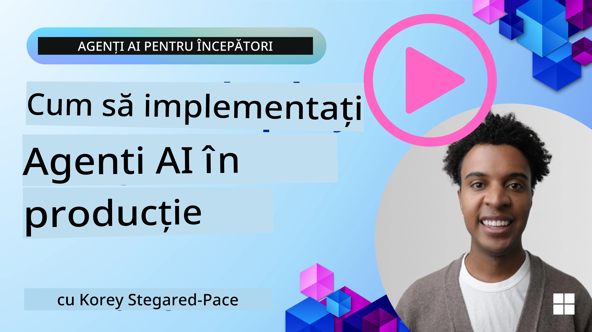

# Agenți AI în Producție: Observabilitate & Evaluare

[](https://youtu.be/l4TP6IyJxmQ?si=reGOyeqjxFevyDq9)

Pe măsură ce agenții AI trec de la prototipuri experimentale la aplicații reale, capacitatea de a înțelege comportamentul lor, de a monitoriza performanța și de a evalua sistematic rezultatele devine importantă.

## Obiective de învățare

După finalizarea acestei lecții, vei ști cum să/vei înțelege:
- Concepte de bază privind observabilitatea și evaluarea agenților
- Tehnici pentru îmbunătățirea performanței, costurilor și eficacității agenților
- Ce și cum să evaluezi agenții tăi AI în mod sistematic
- Cum să controlezi costurile atunci când implementezi agenți AI în producție
- Cum să instrumentezi agenți creați cu Microsoft Agent Framework

Scopul este să te echipăm cu cunoștințele necesare pentru a transforma agenții tăi „cutie neagră” în sisteme transparente, gestionabile și de încredere.

_**Notă:** Este important să implementezi agenți AI care sunt siguri și demni de încredere. Consultă și lecția [Building Trustworthy AI Agents](./06-building-trustworthy-agents/README.md)._

## Trasee și Spanuri

Instrumentele de observabilitate precum [Langfuse](https://langfuse.com/) sau [Microsoft Foundry](https://learn.microsoft.com/en-us/azure/ai-foundry/what-is-azure-ai-foundry) de obicei reprezintă rulările agenților ca trasee și spanuri.

- **Traseu** reprezintă o sarcină completă a agentului de la început până la sfârșit (de exemplu, gestionarea unei cereri de la utilizator).
- **Spanurile** sunt pașii individuali din cadrul traseului (de exemplu, apelarea unui model de limbaj sau recuperarea de date).


<!-- Image URL retained for illustration purposes -->

Fără observabilitate, un agent AI poate părea o „cutie neagră” – starea și raționamentul său intern sunt opace, ceea ce face dificilă diagnosticarea problemelor sau optimizarea performanței. Cu observabilitate, agenții devin „cutii de sticlă”, oferind transparență vitală pentru construirea încrederii și asigurarea funcționării așa cum este intenționat.

## De ce contează observabilitatea în mediile de producție

Trecerea agenților AI în mediile de producție introduce un nou set de provocări și cerințe. Observabilitatea nu mai este un „lucru de dorit” ci o capacitate critică:

*   **Depanare și Analiză a Cauzelor Fundamentale**: Când un agent eșuează sau produce un rezultat neașteptat, instrumentele de observabilitate oferă traseele necesare pentru identificarea sursei erorii. Acest lucru este foarte important în agenții complecși ce pot implica multiple apeluri LLM, interacțiuni cu unelte și logică condiționată.
*   **Gestionarea Latentei și Costurilor**: Agenții AI depind adesea de LLM-uri și alte API-uri externe facturate per token sau apel. Observabilitatea permite urmărirea precisă a acestor apeluri, ajutând la identificarea operațiunilor excesiv de lente sau costisitoare. Aceasta permite echipelor să optimizeze solicitările, să selecteze modele mai eficiente sau să redesign-eze fluxurile de lucru pentru a gestiona costurile operaționale și a asigura o experiență utilizator bună.
*   **Încredere, Siguranță și Conformitate**: În multe aplicații, este important să se asigure că agenții se comportă într-un mod sigur și etic. Observabilitatea oferă o cale de audit a acțiunilor și deciziilor agentului. Aceasta poate fi folosită pentru a detecta și atenua probleme precum injecția de prompturi, generarea de conținut dăunător sau manipularea greșită a informațiilor personale identificabile (PII). De exemplu, poți revizui traseele pentru a înțelege de ce un agent a oferit un anumit răspuns sau a folosit o anumită unealtă.
*   **Bucle de Îmbunătățire Continuă**: Datele din observabilitate sunt fundația unui proces iterativ de dezvoltare. Prin monitorizarea performanței agenților în lumea reală, echipele pot identifica zone de îmbunătățire, pot colecta date pentru ajustarea fină a modelelor și pot valida impactul modificărilor. Aceasta creează un ciclu de feedback unde informațiile din producție, obținute prin evaluarea online, informează experimentele și perfecționările offline, conducând la performanțe progresiv mai bune ale agenților.

## Metrii cheie de urmărit

Pentru a monitoriza și înțelege comportamentul agentului, un set variat de metrii și semnale trebuie urmăriți. Deși metrii specifici pot varia în funcție de scopul agentului, unii sunt universal importanți.

Iată câțiva dintre cei mai comuni metrii pe care instrumentele de observabilitate îi monitorizează:

**Latență:** Cât de repede răspunde agentul? Timpurile lungi de așteptare afectează negativ experiența utilizatorului. Ar trebui să măsori latența pentru sarcini și pași individuali prin trasarea rulărilor agentului. De exemplu, un agent care durează 20 de secunde pentru toate apelurile modelelor ar putea fi accelerat folosind un model mai rapid sau prin rularea paralelă a apelurilor modelelor.

**Costuri:** Care este cheltuiala per rulare a agentului? Agenții AI depind de apeluri LLM facturate per token sau API-uri externe. Utilizarea frecventă a uneltelor sau multiple prompturi pot crește rapid costurile. De exemplu, dacă un agent apelează un LLM de cinci ori pentru o îmbunătățire marginală a calității, trebuie să evaluezi dacă costul este justificat sau dacă poți reduce numărul apelurilor sau folosi un model mai ieftin. Monitorizarea în timp real poate de asemenea ajuta la identificarea vârfurilor neașteptate (ex: bug-uri ce cauzează cicluri excesive cu API-ul).

**Erori de Cerere:** Câte cereri a eșuat agentul? Aceasta poate include erori API sau apeluri ale uneltelor nereușite. Pentru a face agentul mai robust împotriva acestora în producție, poți apoi seta fallback-uri sau retrieri. Ex: dacă furnizorul LLM A este indisponibil, treci la furnizorul LLM B ca rezervă.

**Feedback din Partea Utilizatorilor:** Implementarea evaluărilor directe de la utilizatori oferă informații valoroase. Acesta poate include evaluări explicite (👍thumbs-up/👎down, ⭐1-5 stele) sau comentarii textuale. Feedback-ul negativ consecvent trebuie să te alerteze deoarece este un semn că agentul nu funcționează așa cum se așteaptă.

**Feedback Implicit din Partea Utilizatorilor:** Comportamentele utilizatorilor oferă feedback indirect chiar și fără evaluări explicite. Acesta poate include reformularea imediată a întrebărilor, cereri repetate sau apăsarea unui buton de retry. Ex: dacă observi că utilizatorii întreabă repetat aceeași întrebare, acesta este un semn că agentul nu funcționează corespunzător.

**Acuratețe:** Cât de frecvent produce agentul rezultate corecte sau dorite? Definirea acurateții variază (ex: corectitudinea rezolvării problemelor, acuratețea recuperării informației, satisfacția utilizatorului). Primul pas este să definești cum arată succesul pentru agentul tău. Poți urmări acuratețea prin verificări automate, scoruri de evaluare sau etichete de finalizare a sarcinii. De exemplu, marcarea traseelor ca „reusite” sau „nereușite”.

**Metrii de Evaluare Automată:** Poți de asemenea să configurezi evaluări automate. De exemplu, poți folosi un LLM pentru a nota ieșirea agentului dacă este utilă, precisă sau nu. Există și biblioteci open source care te ajută să evaluezi aspecte diferite ale agentului. Ex: [RAGAS](https://docs.ragas.io/) pentru agenți RAG sau [LLM Guard](https://llm-guard.com/) pentru detectarea limbajului dăunător sau a injecției de prompturi.

În practică, o combinație a acestor metrii oferă cea mai bună acoperire a sănătății unui agent AI. În [notebook-ul exemplu](./code_samples/10-expense_claim-demo.ipynb) din acest capitol, îți vom arăta cum arată acești metrii în exemple reale, dar mai întâi vom învăța cum arată un flux tipic de evaluare.

## Instrumentează-ți Agentul

Pentru a colecta date de trasare, va trebui să instrumentezi codul tău. Scopul este să instrumentezi codul agentului pentru a emite trasee și metrii care pot fi capturați, procesați și vizualizați de o platformă de observabilitate.

**OpenTelemetry (OTel):** [OpenTelemetry](https://opentelemetry.io/) a devenit un standard industrial pentru observabilitatea LLM-urilor. Oferă un set de API-uri, SDK-uri și unelte pentru generarea, colectarea și exportul datelor de telemetrie.

Există multe biblioteci de instrumentare care înfășoară framework-urile existente de agenți și fac ușor exportul span-urilor OpenTelemetry către un instrument de observabilitate. Microsoft Agent Framework se integrează nativ cu OpenTelemetry. Mai jos este un exemplu de instrumentare a unui agent MAF:

```python
from agent_framework.observability import get_tracer, get_meter

tracer = get_tracer()
meter = get_meter()

with tracer.start_as_current_span("agent_run"):
    # Executarea agentului este urmărită automat
    pass
```

[Notebook-ul exemplu](./code_samples/10-expense_claim-demo.ipynb) din acest capitol va demonstra cum să instrumentezi agentul tău MAF.

**Creare manuală de Span-uri:** În timp ce bibliotecile de instrumentare oferă o bază bună, există adesea cazuri în care este necesară o informație mai detaliată sau personalizată. Poți crea manual span-uri pentru a adăuga logică personalizată aplicației. Mai important, poți îmbogăți span-urile create automat sau manual cu atribute personalizate (cunoscute și ca tag-uri sau metadate). Aceste atribute pot include date specifice afacerii, calcule intermediare sau orice context util pentru depanare sau analiză, cum ar fi `user_id`, `session_id` sau `model_version`.

Exemplu de creare manuală de trasee și span-uri cu [SDK-ul Langfuse Python](https://langfuse.com/docs/sdk/python/sdk-v3):

```python
from langfuse import get_client
 
langfuse = get_client()
 
span = langfuse.start_span(name="my-span")
 
span.end()
```

## Evaluarea Agentului

Observabilitatea ne oferă metrii, dar evaluarea este procesul de analizare a datelor (și efectuare a testelor) pentru a stabili cât de bine funcționează un agent AI și cum poate fi îmbunătățit. Cu alte cuvinte, odată ce ai acele trasee și metrii, cum îi folosești pentru a judeca agentul și a lua decizii?

Evaluarea regulată este importantă deoarece agenții AI sunt adesea nedeterministici și pot evolua (prin actualizări sau schimbarea comportamentului modelului) – fără evaluare, nu ai ști dacă „agentul inteligent” funcționează bine sau dacă a regresat.

Există două categorii de evaluări pentru agenții AI: **evaluare online** și **evaluare offline**. Ambele sunt valoroase și se completează reciproc. De obicei începem cu evaluarea offline, deoarece acesta este pasul minim necesar înainte de a implementa orice agent.

### Evaluare offline


Aceasta presupune evaluarea agentului într-un mediu controlat, de obicei folosind seturi de date de testare, nu interogări live de utilizatori. Folosești seturi de date curatate unde știi ce rezultat așteptat sau comportament corect există, apoi rulezi agentul pe acele date.

De exemplu, dacă ai construit un agent pentru probleme de matematică cu enunțuri, ai putea avea un [set de date de test](https://huggingface.co/datasets/gsm8k) cu 100 de probleme cu răspunsuri cunoscute. Evaluarea offline se face adesea în timpul dezvoltării (și poate face parte din pipeline-urile CI/CD) pentru a verifica îmbunătățiri sau a evita regresiile. Avantajul este că este **replicabilă și poți obține metrii clari de acuratețe deoarece ai adevărul de bază**. De asemenea, poți simula interogări de utilizatori și măsura răspunsurile agentului față de răspunsuri ideale sau utiliza metrii automați așa cum s-a descris anterior.

Provocarea principală a evaluării offline este să te asiguri că setul tău de date de test este cuprinzător și rămâne relevant – agentul poate performa bine pe un set fix de teste, dar poate întâlni interogări foarte diferite în producție. Prin urmare, ar trebui să ții seturile de teste actualizate cu noi cazuri speciale și exemple care reflectă scenarii din lumea reală. Un amestec de cazuri mici de „testare la fum” și seturi mai mari de evaluare este util: seturi mici pentru verificări rapide și altele mai mari pentru metrii de performanță mai largi.

### Evaluare online


Aceasta se referă la evaluarea agentului într-un mediu live, real, adică în timpul utilizării efective în producție. Evaluarea online implică monitorizarea performanței agentului pe interacțiuni reale ale utilizatorilor și analizarea continuă a rezultatelor.

De exemplu, poți urmări ratele de succes, scorurile de satisfacție ale utilizatorilor sau alți metrii pe traficul live. Avantajul evaluării online este că **captează lucruri pe care s-ar putea să nu le anticipezi într-un mediu de laborator** – poți observa drift-ul modelului în timp (dacă eficiența agentului scade pe măsură ce tiparele de intrare se schimbă) și poți detecta interogări sau situații neașteptate care nu erau în datele tale de testare. Oferă o imagine reală a comportamentului agentului în mediul natural.

Evaluarea online implică de obicei colectarea feedback-ului implicit și explicit de la utilizatori, după cum am discutat, și posibil rularea testelor shadow sau A/B (unde o versiune nouă a agentului rulează paralel pentru a se compara cu cea veche). Provocarea este că poate fi dificil să obții etichete sau scoruri fiabile pentru interacțiunile live – s-ar putea să te bazezi pe feedback-ul utilizatorilor sau pe metrii din aval (ex: dacă utilizatorul a dat clic pe rezultat).

### Combinarea celor două

Evaluările online și offline nu sunt excluzive; ele sunt foarte complementare. Informațiile din monitorizarea online (ex: noi tipuri de interogări ale utilizatorilor unde agentul performează slab) pot fi folosite pentru a completa și îmbunătăți seturile de date de test offline. În schimb, agenții care performează bine în testele offline pot fi apoi implementați și monitorizați cu mai multă încredere online.

De fapt, multe echipe adoptă un ciclu:

_evaluează offline -> implementează -> monitorizează online -> colectează noi cazuri de eșec -> adaugă în setul offline -> rafinează agentul -> repetă_.

## Probleme Comune

Pe măsură ce implementezi agenți AI în producție, poți întâmpina diverse provocări. Iată câteva probleme comune și soluțiile potențiale:

| **Problemă**    | **Soluție Potențială**   |
| ------------- | ------------------ |
| Agentul AI nu execută sarcinile consecvent | - Ajustează promptul dat agentului AI; fii clar în obiective.<br>- Identifică dacă împărțirea sarcinilor în subtasks și gestionarea lor de către mai mulți agenți poate ajuta. |
| Agentul AI intră în bucle continue  | - Asigură-te că ai termeni și condiții clare de terminare astfel încât agentul să știe când să oprească procesul.<br>- Pentru sarcini complexe care necesită raționament și planificare, folosește un model mai mare specializat pentru astfel de sarcini. |
| Apelurile de unelte ale agentului AI nu funcționează bine   | - Testează și validează output-ul uneltelor în afara sistemului agentului.<br>- Ajustează parametrii definiți, prompturile și denumirile uneltelor.  |
| Sistem multi-agent nu performează consecvent | - Ajustează prompturile date fiecărui agent pentru a fi specifice și distincte unul de celălalt.<br>- Construiește un sistem ierarhic care să folosească un agent „de rutare” sau controler pentru a determina care agent este cel corect. |

Multe dintre aceste probleme pot fi identificate mult mai eficient cu ajutorul observabilității. Traseele și metrii menționați anterior ajută să localizezi exact unde în fluxul agentului apar probleme, făcând depanarea și optimizarea mult mai eficiente.

## Gestionarea Costurilor
Iată câteva strategii pentru a gestiona costurile de implementare a agenților AI în producție:

**Folosirea modelelor mai mici:** Modelele mici de limbaj (SLM) pot performa bine în anumite cazuri de utilizare agentice și vor reduce semnificativ costurile. Așa cum s-a menționat mai devreme, construirea unui sistem de evaluare pentru a determina și compara performanța față de modelele mai mari este cea mai bună metodă de a înțelege cât de bine va funcționa un SLM pentru cazul dvs. de utilizare. Luați în considerare folosirea SLM-urilor pentru sarcini mai simple, cum ar fi clasificarea intențiilor sau extragerea parametrilor, rezervând modelele mai mari pentru raționamente complexe.

**Folosirea unui model de rutare:** O strategie similară este să folosiți o diversitate de modele și dimensiuni. Puteți folosi un LLM/SLM sau o funcție serverless pentru a direcționa cererile în funcție de complexitate către modelele cele mai potrivite. Aceasta va ajuta, de asemenea, la reducerea costurilor, asigurând în același timp performanța pentru sarcinile potrivite. De exemplu, direcționați întrebările simple către modele mai mici și mai rapide și folosiți modelele mari și scumpe doar pentru sarcini de raționament complexe.

**Stocarea în cache a răspunsurilor:** Identificarea cererilor și sarcinilor comune și furnizarea răspunsurilor înainte ca acestea să treacă prin sistemul agentic este o metodă bună de a reduce volumul cererilor similare. Puteți chiar implementa un flux pentru a identifica cât de similară este o cerere cu cererile stocate în cache folosind modele AI mai simple. Această strategie poate reduce semnificativ costurile pentru întrebările frecvente sau fluxurile de lucru comune.

## Să vedem cum funcționează asta în practică

În [notebook-ul de exemplu din această secțiune](./code_samples/10-expense_claim-demo.ipynb), vom vedea exemple de cum putem folosi unelte de observabilitate pentru a monitoriza și evalua agentul nostru.


### Aveți mai multe întrebări despre agenții AI în producție?

Alăturați-vă [Microsoft Foundry Discord](https://discord.com/invite/ATgtXmAS5D) pentru a cunoaște alți cursanți, a participa la ore de consultații și a primi răspunsuri la întrebările despre agenții AI.

## Lecția precedentă

[Metacognition Design Pattern](../09-metacognition/README.md)

## Lecția următoare

[Agentic Protocols](../11-agentic-protocols/README.md)

---

<!-- CO-OP TRANSLATOR DISCLAIMER START -->
**Declinare a responsabilității**:
Acest document a fost tradus folosind serviciul de traducere AI [Co-op Translator](https://github.com/Azure/co-op-translator). În timp ce ne străduim pentru acuratețe, vă rugăm să rețineți că traducerile automate pot conține erori sau inexactități. Documentul original în limba sa nativă trebuie considerat sursa autorizată. Pentru informații critice, se recomandă traducerea profesională realizată de un om. Nu ne asumăm responsabilitatea pentru eventualele neînțelegeri sau interpretări greșite care decurg din utilizarea acestei traduceri.
<!-- CO-OP TRANSLATOR DISCLAIMER END -->