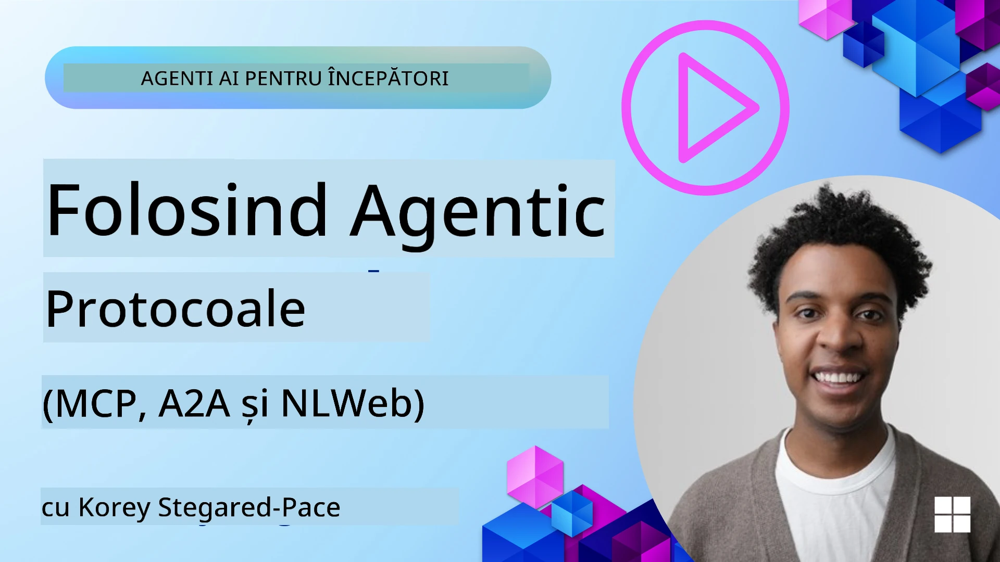
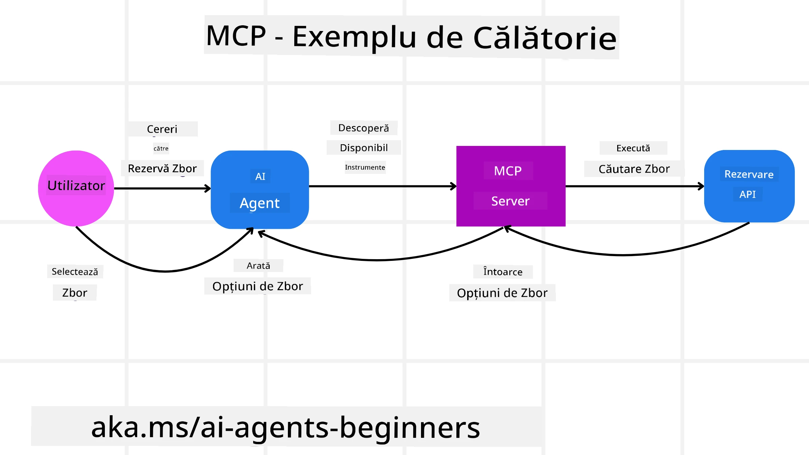
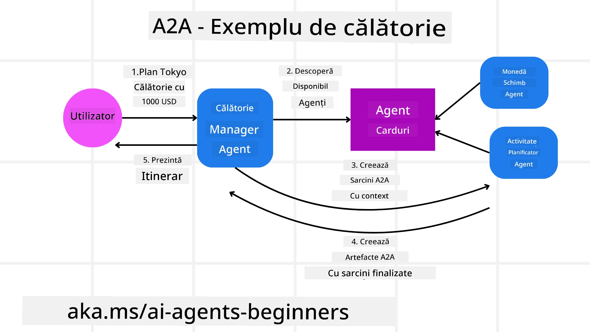
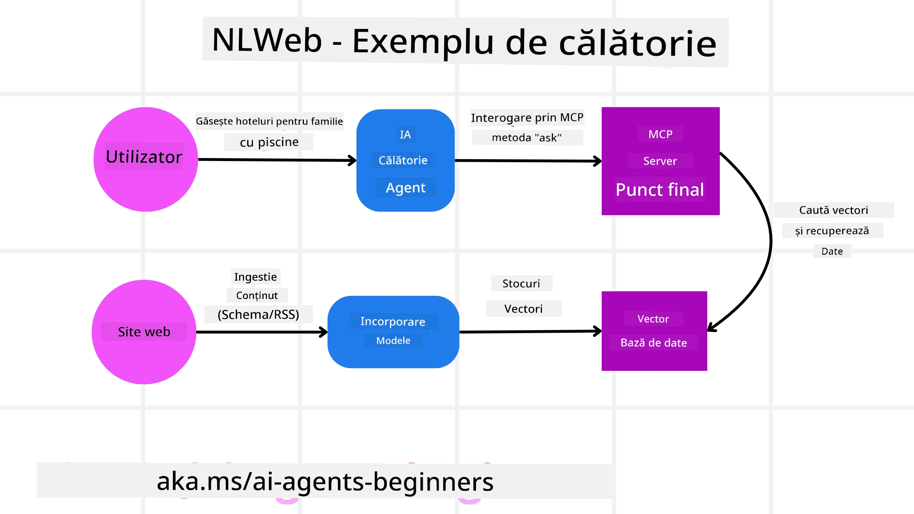

# Folosirea protocoalelor agentice (MCP, A2A și NLWeb)

> _(Faceți clic pe imaginea de mai sus pentru a viziona videoclipul acestei lecții)_

Pe măsură ce utilizarea agenților AI crește, crește și necesitatea unor protocoale care să asigure standardizare, securitate și să sprijine inovația deschisă. În această lecție, vom acoperi 3 protocoale care încearcă să răspundă acestei nevoi - Model Context Protocol (MCP), Agent to Agent (A2A) și Natural Language Web (NLWeb).

## Introducere

În această lecție vom acoperi:

• Cum **MCP** permite agenților AI să acceseze instrumente și date externe pentru a completa sarcinile utilizatorului.

• Cum **A2A** facilitează comunicarea și colaborarea între diferiți agenți AI.

• Cum **NLWeb** aduce interfețe în limbaj natural pe orice site web, permițând agenților AI să descopere și să interacționeze cu conținutul.

## Obiective de învățare

• **Identifică** scopul principal și beneficiile MCP, A2A și NLWeb în contextul agenților AI.

• **Explică** cum fiecare protocol facilitează comunicarea și interacțiunea între LLM-uri, instrumente și alți agenți.

• **Recunoaște** rolurile distincte pe care le joacă fiecare protocol în construirea sistemelor agentice complexe.

## Model Context Protocol

**Model Context Protocol (MCP)** este un standard deschis care oferă o modalitate standardizată prin care aplicațiile pot furniza context și unelte pentru LLM-uri. Acesta permite un „adaptor universal” către diferite surse de date și instrumente pe care agenții AI le pot conecta într-un mod consecvent.

Să analizăm componentele MCP, beneficiile față de utilizarea directă a API-urilor și un exemplu de cum ar putea agenții AI să folosească un server MCP.

### Componentele principale MCP

MCP funcționează pe o **arhitectură client-server** iar componentele principale sunt:

• **Hosturi** sunt aplicații LLM (de exemplu un editor de cod precum VSCode) care inițiază conexiunile către un server MCP.

• **Clienți** sunt componente din cadrul aplicației host care mențin conexiuni unu-la-unu cu serverele.

• **Servere** sunt programe ușoare care expun capacități specifice.

Protocolul include trei primitive de bază care reprezintă capabilitățile unui server MCP:

• **Unelte**: Acestea sunt acțiuni discrete sau funcții pe care un agent AI le poate apela pentru a efectua o acțiune. De exemplu, un serviciu meteo ar putea expune o unealtă „get weather” sau un server ecommerce o unealtă „purchase product”. Serverele MCP anunță numele uneltei, descrierea și schema de input/output în lista lor de capabilități.

• **Resurse**: Acestea sunt elemente de date sau documente numai pentru citire pe care un server MCP le poate furniza, iar clienții le pot prelua la cerere. Exemple includ conținutul fișierelor, înregistrări în baze de date sau fișiere de jurnal. Resursele pot fi text (de exemplu cod sau JSON) sau binare (de exemplu imagini sau PDF-uri).

• **Propuneri**: Acestea sunt șabloane predefinite care oferă sugestii de prompturi, permițând fluxuri de lucru mai complexe.

### Beneficiile MCP

MCP oferă avantaje semnificative pentru agenții AI:

• **Descoperire dinamică a uneltelor**: Agenții pot primi dinamic o listă a uneltelor disponibile de la un server, împreună cu descrierile acestora. Acest lucru contrastează cu API-urile tradiționale, care adesea necesită codare statică pentru integrări, ceea ce înseamnă că orice modificare a API-ului necesită actualizări ale codului. MCP oferă o abordare „integrează o singură dată”, conducând la o mai mare adaptabilitate.

• **Interoperabilitate între LLM-uri**: MCP funcționează peste diferite LLM-uri, oferind flexibilitate pentru a schimba modelele de bază pentru o performanță mai bună.

• **Securitate standardizată**: MCP include o metodă standard de autentificare, îmbunătățind scalabilitatea când se adaugă accesul la servere MCP suplimentare. Este mai simplu decât gestionarea diferitelor chei și tipuri de autentificare pentru numeroase API-uri tradiționale.

### Exemplu MCP

Imaginați-vă că un utilizator dorește să rezerve un zbor folosind un asistent AI alimentat de MCP.

1. **Conexiune**: Asistentul AI (clientul MCP) se conectează la un server MCP oferit de o companie aeriană.

2. **Descoperirea uneltelor**: Clientul întreabă serverul MCP al companiei aeriene: „Ce unelte aveți disponibile?” Serverul răspunde cu unelte precum „caută zboruri” și „rezervă zboruri”.

3. **Invocarea uneltei**: Utilizatorul îi cere asistentului AI: „Te rog, caută un zbor de la Portland la Honolulu.” Asistentul AI, folosind LLM-ul său, identifică necesitatea de a apela unealta „caută zboruri” și transmite parametrii relevanți (origine, destinație) serverului MCP.

4. **Execuție și răspuns**: Serverul MCP, acționând ca un înveliș, face apelul real către API-ul intern de rezervări al companiei aeriene. Apoi primește informațiile despre zbor (de exemplu, date JSON) și le trimite înapoi asistentului AI.

5. **Interacțiune ulterioară**: Asistentul AI prezintă opțiunile de zbor. Odată ce utilizatorul alege un zbor, asistentul poate invoca unealta „rezervă zbor” pe același server MCP, finalizând rezervarea.

## Protocol Agent-la-Agent (A2A)

În timp ce MCP se concentrează pe conectarea LLM-urilor la unelte, **protocolul Agent-to-Agent (A2A)** face un pas mai departe, permițând comunicarea și colaborarea între diferiți agenți AI. A2A conectează agenți AI din organizații, medii și tehnologii diferite pentru a îndeplini o sarcină comună.

Vom examina componentele și beneficiile A2A, împreună cu un exemplu despre cum ar putea fi aplicat în aplicația noastră de călătorii.

### Componente principale A2A

A2A se concentrează pe facilitarea comunicării între agenți și pe cooperarea lor pentru a îndeplini o sub-sarcină a utilizatorului. Fiecare componentă a protocolului contribuie la acest scop:

#### Cardul Agentului

Similar modului în care un server MCP partajează o listă de unelte, un Card al Agentului conține:
- Numele agentului.
- O **descriere a sarcinilor generale** pe care le realizează.
- O **listă de abilități specifice** cu descrieri pentru a ajuta alți agenți (sau chiar utilizatori umani) să înțeleagă când și de ce ar dori să apeleze agentul respectiv.
- **URL-ul Endpoint actual** al agentului.
- **versiunea** și **capabilitățile** agentului, cum ar fi răspunsuri în flux și notificări push.

#### Executorul Agentului

Executorul Agentului este responsabil pentru **transmiterea contextului chat-ului utilizatorului către agentul de la distanță**, agentul de la distanță având nevoie de acesta pentru a înțelege sarcina care trebuie îndeplinită. Într-un server A2A, un agent folosește propriul său Model de Limbaj Mare (LLM) pentru a interpreta cererile care vin și pentru a executa sarcinile folosind propriile instrumente interne.

#### Artefact

După ce un agent la distanță a terminat sarcina solicitată, produsul muncii sale este creat ca un artefact. Un artefact **conține rezultatul muncii agentului**, o **descriere a ceea ce a fost realizat** și **contextul textual** care este transmis prin protocol. După trimiterea artefactului, conexiunea cu agentul la distanță este închisă până când va fi nevoie din nou.

#### Coada de Evenimente

Această componentă este folosită pentru **gestionarea actualizărilor și transmiterea mesajelor**. Este deosebit de importantă în producție pentru sistemele agentice pentru a preveni închiderea conexiunii dintre agenți înainte ca sarcina să fie finalizată, mai ales când timpul de finalizare a sarcinii poate fi mai lung.

### Beneficii A2A

• **Colaborare îmbunătățită**: Permite agenților de la furnizori și platforme diferite să interacționeze, să partajeze context și să colaboreze, facilitând automatizarea continuă între sisteme tradițional separate.

• **Flexibilitate în alegerea modelului**: Fiecare agent A2A poate decide ce LLM folosește pentru a răspunde cererilor, permițând optimizarea sau ajustarea modelului pentru fiecare agent, spre deosebire de o singură conexiune LLM în unele scenarii MCP.

• **Autentificare integrată**: Autentificarea este integrată direct în protocolul A2A, oferind un cadru robust de securitate pentru interacțiunile între agenți.

### Exemplu A2A

Să extindem scenariul nostru de rezervare călătorii, dar de data aceasta folosind A2A.

1. **Cererea utilizatorului către multi-agent**: Un utilizator interacționează cu un client/agent A2A „Travel Agent”, poate spunând: „Te rog, rezervă o călătorie completă la Honolulu pentru săptămâna viitoare, inclusiv zboruri, hotel și închiriere mașină”.

2. **Orchestrarea agentului de călătorii**: Agentul de călătorii primește această cerere complexă. Folosindu-și LLM-ul, raționează asupra sarcinii și determină că trebuie să interacționeze cu alți agenți specializați.

3. **Comunicarea între agenți**: Agentul de călătorii folosește protocolul A2A pentru a se conecta la agenți de tip downstream, cum ar fi „Agentul Companiei Aeriene”, „Agentul Hotelului” și „Agentul Închirierii Mașinilor”, creați de companii diferite.

4. **Executarea sarcinilor delegate**: Agentul de călătorii trimite sarcini specifice acestor agenți specializați (de exemplu, „Găsește zboruri spre Honolulu”, „Rezervă hotel”, „Închiriază mașină”). Fiecare dintre acești agenți specializați, rulând LLM-ul propriu și folosind uneltele sale interne (care pot fi ele însele servere MCP), execută partea specifică din rezervare.

5. **Răspuns consolidat**: După ce toți agenții downstream își finalizează sarcinile, Agentul de călătorii compilează rezultatele (detalii zbor, confirmare hotel, rezervare mașină) și trimite un răspuns complex, în stil chat, înapoi utilizatorului.

## Natural Language Web (NLWeb)

Site-urile web au fost mult timp principalul mod prin care utilizatorii accesează informații și date pe internet.

Să analizăm componentele diferite ale NLWeb, beneficiile NLWeb și un exemplu despre cum funcționează NLWeb în aplicația noastră de călătorii.

### Componente ale NLWeb

- **Aplicația NLWeb (Cod Serviciu de Bază)**: Sistemul care procesează întrebările în limbaj natural. Leagă părțile diferite ale platformei pentru a crea răspunsuri. Putem să o considerăm ca **motorul care alimentează funcțiile în limbaj natural** ale unui site web.

- **Protocolul NLWeb**: Este un **set de reguli de bază pentru interacțiunea în limbaj natural** cu un site web. Returnează răspunsuri în format JSON (adesea folosind Schema.org). Scopul său este să creeze o fundație simplă pentru „Web-ul AI”, așa cum HTML a făcut posibilă împărțirea documentelor online.

- **Server MCP (Endpoint Model Context Protocol)**: Fiecare configurare NLWeb funcționează și ca un **server MCP**. Aceasta înseamnă că poate **partaja unelte (cum ar fi metoda „ask”) și date** cu alte sisteme AI. În practică, acest lucru face conținutul și capabilitățile site-ului utilizabile de agenți AI, permițând site-ului să devină parte a ecosistemului mai larg de agenți.

- **Modele de embedding**: Aceste modele sunt folosite pentru a **converti conținutul site-ului web în reprezentări numerice numite vectori** (embedding-uri). Acești vectori capturează sensul într-un mod în care calculatoarele pot compara și căuta. Sunt stocați într-o bază de date specială, iar utilizatorii pot alege modelul embedding pe care doresc să-l folosească.

- **Baza de date vectorială (mecanism de căutare)**: Această bază de date **stochează embedding-urile conținutului site-ului web**. Când cineva pune o întrebare, NLWeb verifică baza de date vectorială pentru a găsi rapid cele mai relevante informații. Oferă o listă rapidă de posibile răspunsuri, ordonate după similaritate. NLWeb funcționează cu diferite sisteme de stocare vectorială precum Qdrant, Snowflake, Milvus, Azure AI Search și Elasticsearch.

### NLWeb prin exemplu

Luați din nou în considerare site-ul nostru de rezervări de călătorii, dar de această dată, alimentat de NLWeb.

1. **Ingestia datelor**: Cataloagele de produse existente ale site-ului de călătorii (de exemplu, liste de zboruri, descrieri de hoteluri, pachete turistice) sunt formate folosind Schema.org sau încărcate prin feed-uri RSS. Uneltele NLWeb preiau aceste date structurate, creează embedding-uri și le stochează într-o bază de date vectorială locală sau la distanță.

2. **Interogare în limbaj natural (uman)**: Un utilizator vizitează site-ul și, în loc să navigheze prin meniuri, tastează într-o interfață de chat: „Găsește-mi un hotel prietenos cu familia în Honolulu cu piscină pentru săptămâna viitoare”.

3. **Procesarea NLWeb**: Aplicația NLWeb primește această interogare. O trimite spre înțelegere unui LLM și simultan caută în baza sa de date vectorială pentru listări relevante de hoteluri.

4. **Rezultate precise**: LLM-ul ajută la interpretarea rezultatelor căutării din baza de date, identifică cele mai bune potriviri bazate pe criteriile „prietenos cu familia”, „piscină” și „Honolulu”, apoi formatează un răspuns în limbaj natural. Esențial, răspunsul face referire la hoteluri reale din catalogul site-ului, evitând informații inventate.

5. **Interacțiunea agentului AI**: Deoarece NLWeb servește ca server MCP, un agent extern AI de călătorii se poate conecta și la această instanță NLWeb a site-ului. Agentul AI ar putea folosi metoda `ask` MCP pentru a interoga direct site-ul: `ask("Există restaurante vegane recomandate de hotel în zona Honolulu?")`. Instanța NLWeb ar procesa această solicitare, folosindu-se de baza sa de date cu informații despre restaurante (dacă este încărcată) și ar returna un răspuns JSON structurat.

### Aveți mai multe întrebări despre MCP/A2A/NLWeb?

Alăturați-vă [Microsoft Foundry Discord](https://aka.ms/ai-agents/discord) pentru a întâlni alți cursanți, a participa la sesiuni de birou și a primi răspunsuri la întrebările despre Agenți AI.

## Resurse

- [MCP pentru începători](https://aka.ms/mcp-for-beginners)  
- [Documentație MCP](https://learn.microsoft.com/python/api/overview/azure/ai-projects-readme)
- [Repo NLWeb](https://github.com/nlweb-ai/NLWeb)
- [Microsoft Agent Framework](https://aka.ms/ai-agents-beginners/agent-framewrok)

---

<!-- CO-OP TRANSLATOR DISCLAIMER START -->
**Declinarea responsabilității**:  
Acest document a fost tradus folosind serviciul de traducere AI [Co-op Translator](https://github.com/Azure/co-op-translator). Deși ne străduim pentru acuratețe, vă rugăm să rețineți că traducerile automate pot conține erori sau inexactități. Documentul original, în limba sa nativă, trebuie considerat sursa autoritară. Pentru informații critice, se recomandă traducerea profesională realizată de un specialist uman. Nu ne asumăm responsabilitatea pentru eventualele neînțelegeri sau interpretări greșite care pot apărea în urma utilizării acestei traduceri.
<!-- CO-OP TRANSLATOR DISCLAIMER END -->