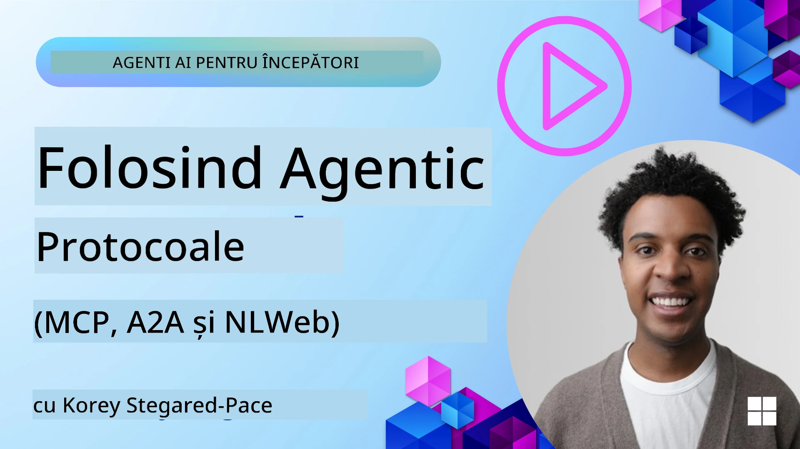
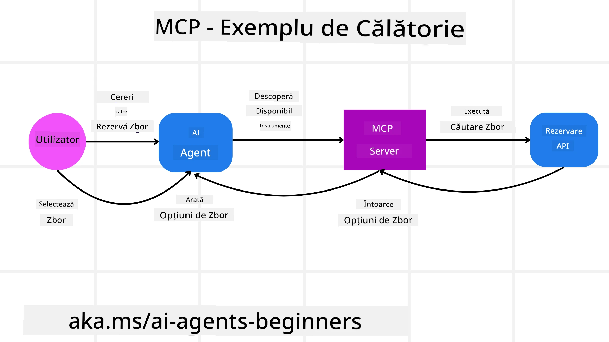
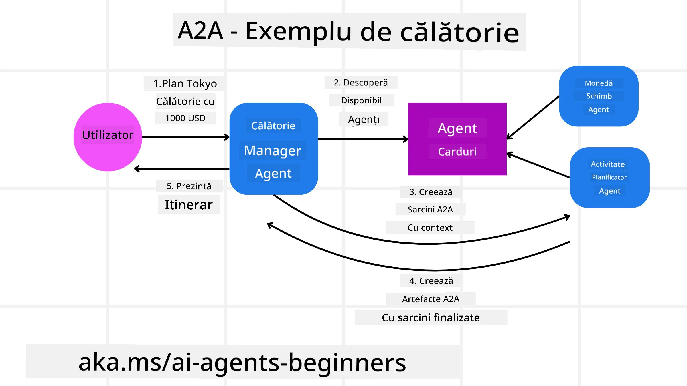
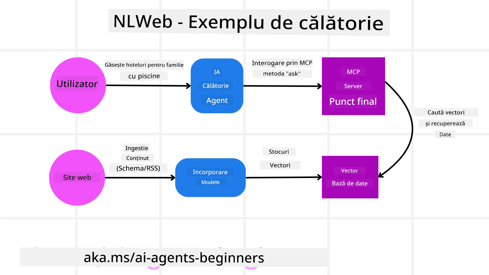

# Folosirea Protocoalelor Agentice (MCP, A2A și NLWeb)

> _(Apasă pe imaginea de mai sus pentru a vizualiza videoclipul lecției)_

Pe măsură ce utilizarea agenților AI crește, la fel crește și nevoia de protocoale care să asigure standardizarea, securitatea și să susțină inovarea deschisă. În această lecție, vom acoperi 3 protocoale care încearcă să răspundă acestei nevoi - Model Context Protocol (MCP), Agent to Agent (A2A) și Natural Language Web (NLWeb).

## Introducere

În această lecție, vom aborda:

• Cum **MCP** permite agenților AI să acceseze unelte și date externe pentru a îndeplini sarcini ale utilizatorilor.

• Cum **A2A** facilitează comunicarea și colaborarea între diferiți agenți AI.

• Cum **NLWeb** aduce interfețe în limbaj natural pe orice site web, permițând agenților AI să descopere și să interacționeze cu conținutul.

## Obiectivele de învățare

• **Identifică** scopul principal și beneficiile MCP, A2A și NLWeb în contextul agenților AI.

• **Explică** cum fiecare protocol facilitează comunicarea și interacțiunea între LLM-uri, unelte și alți agenți.

• **Recunoaște** rolurile distincte pe care le joacă fiecare protocol în construcția sistemelor agentice complexe.

## Model Context Protocol

**Model Context Protocol (MCP)** este un standard deschis care oferă o metodă standardizată pentru aplicații de a furniza context și unelte către LLM-uri. Aceasta permite un „adaptor universal” către surse de date și unelte diferite la care agenții AI se pot conecta într-un mod consistent.

Să analizăm componentele MCP, beneficiile față de utilizarea directă a API-urilor, și un exemplu despre cum agenții AI ar putea folosi un server MCP.

### Componente de bază MCP

MCP funcționează pe o **arhitectură client-server** iar componentele de bază sunt:

• **Hosts** sunt aplicații LLM (de exemplu un editor de cod precum VSCode) care inițiază conexiunile către un server MCP.

• **Clienții** sunt componente din cadrul aplicației host care mențin conexiuni unu-la-unu cu serverele.

• **Servere** sunt programe ușoare care expun capabilități specifice.

În protocol sunt incluse trei primitive principale care sunt capabilitățile unui server MCP:

• **Unelte**: Acestea sunt acțiuni discrete sau funcții pe care un agent AI le poate apela pentru a efectua o acțiune. De exemplu, un serviciu meteo ar putea expune o unealtă „get weather” sau un server de e-commerce o unealtă „purchase product”. Serverele MCP fac publice numele uneltei, descrierea și schema de intrare/ieșire în lista lor de capabilități.

• **Resurse**: Acestea sunt elemente sau documente de date în mod doar lectura pe care un server MCP le poate furniza, iar clienții le pot accesa la cerere. Exemple includ conținut de fișiere, înregistrări din baze de date sau fișiere jurnal. Resursele pot fi text (precum codul sau JSON) sau binare (precum imagini sau PDF-uri).

• **Prompturi**: Acestea sunt șabloane predefinite care oferă prompturi sugerate, permițând fluxuri de lucru mai complexe.

### Beneficiile MCP

MCP oferă avantaje semnificative pentru agenții AI:

• **Descoperirea Dinamică a Uneltelor**: Agenții pot primi dinamic o listă de unelte disponibile de la un server împreună cu descrieri ale scopului acestora. Acest lucru este diferit de API-urile tradiționale care deseori necesită codare statică pentru integrări, ceea ce înseamnă că orice schimbare de API necesită actualizări de cod. MCP oferă o abordare „integrează o singură dată”, conducând la o adaptabilitate mai mare.

• **Interoperabilitate între LLM-uri**: MCP funcționează între diferite LLM-uri, oferind flexibilitate pentru a schimba modelele de bază pentru a evalua o performanță mai bună.

• **Securitate Standardizată**: MCP include o metodă standard de autentificare, îmbunătățind scalabilitatea atunci când se adaugă acces la servere MCP suplimentare. Acest lucru este mai simplu decât gestionarea diferitelor chei și tipuri de autentificare pentru API-urile tradiționale multiple.

### Exemplu MCP

Imaginați-vă că un utilizator dorește să rezerve un zbor folosind un asistent AI alimentat de MCP.

1. **Conexiune**: Asistentul AI (clientul MCP) se conectează la un server MCP oferit de o companie aeriană.

2. **Descoperirea Uneltelor**: Clientul întreabă serverul MCP al companiei aeriene: „Ce unelte aveți disponibile?” Serverul răspunde cu unelte precum „search flights” și „book flights”.

3. **Invocarea Unealtei**: Utilizatorul spune asistentului AI: „Te rog să cauți un zbor de la Portland la Honolulu.” Asistentul AI, folosind LLM-ul său, identifică necesitatea apelării uneltei „search flights” și transmite parametrii relevanți (origine, destinație) către serverul MCP.

4. **Executare și Răspuns**: Serverul MCP, funcționând ca un înveliș, efectuează apelul real către API-ul intern al companiei aeriene pentru rezervări. Apoi primește informațiile despre zbor (de exemplu date JSON) și le trimite înapoi asistentului AI.

5. **Interacțiune Ulterioară**: Asistentul AI prezintă opțiunile de zbor. Odată ce utilizatorul selectează un zbor, asistentul poate invoca unealta „book flight” pe același server MCP, finalizând rezervarea.

## Protocolul Agent-la-Agent (A2A)

În timp ce MCP se concentrează pe conectarea LLM-urilor la unelte, **protocolul Agent-la-Agent (A2A)** face un pas mai departe, permițând comunicarea și colaborarea între diferiți agenți AI. A2A conectează agenți AI din organizații, medii și tehnologii diferite pentru a îndeplini o sarcină comună.

Vom examina componentele și beneficiile A2A, împreună cu un exemplu de aplicare într-o aplicație de călătorie.

### Componente de bază A2A

A2A se concentrează pe facilitarea comunicării între agenți și colaborarea pentru îndeplinirea unei sub-sarcini a utilizatorului. Fiecare componentă a protocolului contribuie la acest lucru:

#### Cardul Agentului

Similar cu modul în care un server MCP partajează o listă de unelte, un Card de Agent include:
- Numele Agentului.
- O **descriere a sarcinilor generale** pe care le îndeplinește.
- O **listă de abilități specifice** cu descrieri, pentru a ajuta alți agenți (sau chiar utilizatori umani) să înțeleagă când și de ce să apeleze acel agent.
- **URL-ul punctului final** curent al agentului.
- **Versiunea** și **capabilitățile** agentului, cum ar fi răspunsuri în streaming și notificări push.

#### Executorul Agentului

Executorul Agentului este responsabil pentru **transmiterea contextului conversației utilizatorului către agentul la distanță**, agentul la distanță având nevoie de acest lucru pentru a înțelege sarcina care trebuie îndeplinită. Într-un server A2A, un agent folosește propriul LLM pentru a interpreta solicitările primite și pentru a executa sarcinile folosind propriile unelte interne.

#### Artifactul

După ce un agent la distanță finalizează sarcina cerută, produsul muncii sale este creat ca un artifact. Un artifact **conține rezultatul muncii agentului**, o **descriere a ceea ce a fost realizat** și **contextul text** transmis prin protocol. După trimiterea artifactului, conexiunea cu agentul la distanță este închisă până când este nevoie din nou.

#### Coada de Evenimente

Această componentă este utilizată pentru **gestionarea actualizărilor și transmiterea mesajelor**. Este deosebit de importantă în producție pentru sistemele agentice, pentru a preveni închiderea conexiunii între agenți înainte ca o sarcină să fie finalizată, mai ales când timpul pentru finalizarea sarcinii poate fi mai lung.

### Beneficiile A2A

• **Colaborare Îmbunătățită**: Permite agenților din diferiți furnizori și platforme să interacționeze, să împărtășească context și să lucreze împreună, facilitând automatizarea fără probleme între sisteme tradițional deconectate.

• **Flexibilitate în Alegerea Modelului**: Fiecare agent A2A poate decide ce LLM folosește pentru a deservi solicitările sale, permițând modele optimizate sau ajustate fin pentru fiecare agent, spre deosebire de o singură conexiune LLM în unele scenarii MCP.

• **Autentificare Integrată**: Autentificarea este integrată direct în protocolul A2A, oferind un cadru solid de securitate pentru interacțiunile între agenți.

### Exemplu A2A

Să extindem scenariul nostru de rezervare de călătorii, de această dată folosind A2A.

1. **Solicitarea Utilizatorului către Multi-Agent**: Un utilizator interacționează cu un client/agent A2A „Travel Agent”, poate spunând: „Te rog să rezervi o călătorie completă la Honolulu pentru săptămâna viitoare, inclusiv zboruri, hotel și mașină de închiriat”.

2. **Orchestrarea de către Travel Agent**: Travel Agent primește această solicitare complexă. Folosește LLM-ul său pentru a raționa asupra sarcinii și determină că trebuie să interacționeze cu alți agenți specializați.

3. **Comunicare între Agenți**: Travel Agent utilizează apoi protocolul A2A pentru a se conecta cu agenți secundari, precum „Airline Agent,” „Hotel Agent,” și „Car Rental Agent,” creați de companii diferite.

4. **Executarea Sarcinilor Delegated**: Travel Agent trimite sarcini specifice acestor agenți specializați (de exemplu „Găsește zboruri către Honolulu,” „Rezervă un hotel,” „Închiriază o mașină”). Fiecare agent specializat, rulând propriul său LLM și folosind propriile unelte (care ar putea fi servere MCP), își îndeplinește partea specifică a rezervării.

5. **Răspuns Consolidat**: După ce toți agenții secundari își finalizează sarcinile, Travel Agent compilează rezultatele (detalii zbor, confirmare hotel, rezervare mașină) și trimite un răspuns complet, în stil conversațional, către utilizator.

## Natural Language Web (NLWeb)

Site-urile web au fost mult timp modalitatea principală prin care utilizatorii accesează informații și date pe internet.

Să analizăm componentele diferite ale NLWeb, beneficiile NLWeb și un exemplu despre cum funcționează NLWeb-ul nostru privind aplicația de călătorii.

### Componentele NLWeb

- **Aplicația NLWeb (Codul serviciului de bază)**: Sistemul care procesează întrebările în limbaj natural. Conectează diferitele părți ale platformei pentru a crea răspunsuri. Poate fi considerat **motorul care alimentează funcțiile în limbaj natural** ale unui site web.

- **Protocolul NLWeb**: Acesta este un **set de reguli de bază pentru interacțiunea în limbaj natural** cu un site web. Trimite răspunsuri în format JSON (adesea folosind Schema.org). Scopul său este de a crea o fundație simplă pentru „AI Web,” în același mod în care HTML a făcut posibilă partajarea documentelor online.

- **Server MCP (Punct final Model Context Protocol)**: Fiecare configurație NLWeb funcționează și ca un **server MCP**. Aceasta înseamnă că poate **partaja unelte (cum ar fi metoda „ask”) și date** cu alte sisteme AI. În practică, face conținutul și capabilitățile site-ului utilizabile de către agenții AI, permițând site-ului să devină parte din ecosistemul mai larg de agenți.

- **Modele de embeddings**: Aceste modele sunt folosite pentru a **converti conținutul site-ului în reprezentări numerice numite vectori** (embeddings). Acești vectori capturează semnificația într-un mod pe care computerele îl pot compara și căuta. Ei sunt stocați într-o bază de date specială, iar utilizatorii pot alege ce model de embedding doresc să folosească.

- **Bază de date vectorială (mecanism de recuperare)**: Această bază de date **stochează embeddings ale conținutului site-ului**. Când cineva pune o întrebare, NLWeb verifică baza de date vectorială pentru a găsi rapid cele mai relevante informații. Oferă o listă rapidă de posibile răspunsuri, ordonate după similitudine. NLWeb funcționează cu diferite sisteme de stocare vectorială precum Qdrant, Snowflake, Milvus, Azure AI Search și Elasticsearch.

### NLWeb prin exemplu

Să ne gândim din nou la site-ul nostru de rezervări de călătorii, dar de această dată, alimentat de NLWeb.

1. **Ingestia datelor**: Cataloagele de produse existente ale site-ului de călătorii (de exemplu liste de zboruri, descrieri hoteluri, pachete turistice) sunt formate folosind Schema.org sau încărcate prin feed-uri RSS. Instrumentele NLWeb preiau aceste date structurate, creează embeddings și le stochează într-o bază de date vectorială locală sau la distanță.

2. **Întrebare în Limbaj Natural (Om)**: Un utilizator vizitează site-ul și, în loc să navigheze prin meniuri, tastează într-o interfață de chat: „Găsește-mi un hotel potrivit pentru familie în Honolulu cu piscină pentru săptămâna viitoare”.

3. **Procesarea NLWeb**: Aplicația NLWeb primește această întrebare. Trimite întrebarea către un LLM pentru înțelegere și simultan caută în baza sa vectorială pentru liste relevante de hoteluri.

4. **Rezultate precise**: LLM-ul ajută la interpretarea rezultatelor căutării din baza de date, identificând cele mai bune potriviri pe baza criteriilor „potrivit pentru familie”, „piscină” și „Honolulu”, apoi formulează un răspuns în limbaj natural. Esențial, răspunsul face referire la hoteluri reale din catalogul site-ului, evitând informații inventate.

5. **Interacțiunea cu Agentul AI**: Deoarece NLWeb servește ca un server MCP, un agent AI extern de călătorii ar putea, de asemenea, să se conecteze la instanța NLWeb a acestui site. Agentul AI ar putea folosi metoda `ask` MCP pentru a interoga direct site-ul: `ask("Există restaurante vegane recomandate de hotel în zona Honolulu?")`. Instanța NLWeb ar procesa aceasta, exploatând baza sa de date cu informații despre restaurante (dacă este încărcată), și ar returna un răspuns structurat în JSON.

### Ai întrebări despre MCP/A2A/NLWeb?

Alătură-te [Microsoft Foundry Discord](https://discord.com/invite/ATgtXmAS5D) pentru a întâlni alți cursanți, a participa la ore de discuții și a primi răspunsuri la întrebările tale despre Agenții AI.

## Resurse

- [MCP pentru Începători](https://aka.ms/mcp-for-beginners)  
- [Documentația MCP](https://learn.microsoft.com/python/api/overview/azure/ai-projects-readme)
- [Repo NLWeb](https://github.com/nlweb-ai/NLWeb)
- [Microsoft Agent Framework](https://learn.microsoft.com/en-us/agent-framework/overview/?wt.mc_id=youtube_26688_organicsocial_reactor&pivots=programming-language-python)

## Lecția precedentă

[AI Agents în Producție](../10-ai-agents-production/README.md)

## Lecția următoare

[Ingineria Contextuală pentru Agenți AI](../12-context-engineering/README.md)

---

<!-- CO-OP TRANSLATOR DISCLAIMER START -->
**Declinare a responsabilității**:
Acest document a fost tradus folosind serviciul de traducere AI [Co-op Translator](https://github.com/Azure/co-op-translator). În timp ce ne străduim pentru acuratețe, vă rugăm să rețineți că traducerile automate pot conține erori sau inexactități. Documentul original în limba sa nativă trebuie considerat sursa autorizată. Pentru informații critice, se recomandă traducerea profesională realizată de un om. Nu ne asumăm responsabilitatea pentru eventualele neînțelegeri sau interpretări greșite care decurg din utilizarea acestei traduceri.
<!-- CO-OP TRANSLATOR DISCLAIMER END -->