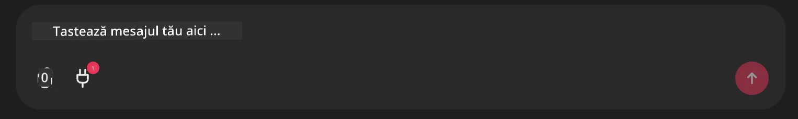

# Exemplu Server Github MCP

## Descriere

Acesta a fost un demo creat pentru AI Agents Hackathon găzduit prin Microsoft Reactor.

Instrumentul este folosit pentru a recomanda proiecte de hackathon bazate pe repo-urile Github ale unui utilizator.  
Acest lucru se realizează prin:

1. **Github Agent** - Folosind Github MCP Server pentru a prelua repo-uri și informații despre acele repo-uri.  
2. **Hackathon Agent** - Primește datele de la Github Agent și generează idei creative pentru proiecte de hackathon bazate pe proiectele, limbajele folosite de utilizator și temele proiectelor pentru AI Agents hackathon.  
3. **Events Agent** - Pe baza sugestiei agentului de hackathon, agentul de evenimente va recomanda evenimente relevante din seria AI Agent Hackathon.  

## Rularea codului

### Variabile de mediu

Acest demo utilizează Microsoft Agent Framework, Azure OpenAI Service, Github MCP Server și Azure AI Search.  

Asigură-te că ai setate corect variabilele de mediu pentru a folosi aceste unelte:

```python
AZURE_AI_PROJECT_ENDPOINT=""
AZURE_AI_MODEL_DEPLOYMENT_NAME=""
AZURE_SEARCH_SERVICE_ENDPOINT=""
AZURE_SEARCH_API_KEY=""
``` 
  
## Rularea Chainlit Server

Pentru a te conecta la MCP server, acest demo folosește Chainlit ca interfață de chat.

Pentru a porni serverul, folosește următoarea comandă în terminal:

```bash
chainlit run app.py -w
```
  
Aceasta ar trebui să pornească serverul Chainlit pe `localhost:8000` și totodată să populeze Indexul Azure AI Search cu conținutul din `event-descriptions.md`.  

## Conectarea la MCP Server

Pentru a te conecta la Github MCP Server, selectează iconița "plug" de sub caseta de chat "Type your message here..":



De acolo poți face click pe "Connect an MCP" pentru a adăuga comanda de conectare la Github MCP Server:

```bash
npx -y @modelcontextprotocol/server-github --env GITHUB_PERSONAL_ACCESS_TOKEN=[YOUR PERSONAL ACCESS TOKEN]
```
  
Înlocuiește "[YOUR PERSONAL ACCESS TOKEN]" cu token-ul tău personal de acces.

După conectare, ar trebui să vezi un (1) lângă iconița de plug pentru a confirma că este conectat. Dacă nu, încearcă să repornești serverul chainlit cu `chainlit run app.py -w`.  

## Utilizarea Demo-ului

Pentru a începe fluxul de lucru al agentului de recomandare de proiecte pentru hackathon, poți tasta un mesaj precum:

"Recommend hackathon projects for the Github user koreyspace"

Router Agent va analiza cererea ta și va determina ce combinație de agenți (GitHub, Hackathon și Events) este cea mai potrivită pentru a răspunde query-ului tău. Agenții lucrează împreună pentru a oferi recomandări complete bazate pe analiza repo-urilor GitHub, generarea de idei pentru proiecte și evenimente tech relevante.

---

<!-- CO-OP TRANSLATOR DISCLAIMER START -->
**Declinare de responsabilitate**:  
Acest document a fost tradus folosind serviciul de traducere AI [Co-op Translator](https://github.com/Azure/co-op-translator). Deși ne străduim pentru acuratețe, vă rugăm să rețineți că traducerile automate pot conține greșeli sau inexactități. Documentul original în limba sa nativă trebuie considerat sursa autorizată. Pentru informații critice, se recomandă traducerea profesională realizată de un traducător uman. Nu ne asumăm responsabilitatea pentru eventualele neînțelegeri sau interpretări greșite care pot apărea ca urmare a utilizării acestei traduceri.
<!-- CO-OP TRANSLATOR DISCLAIMER END -->