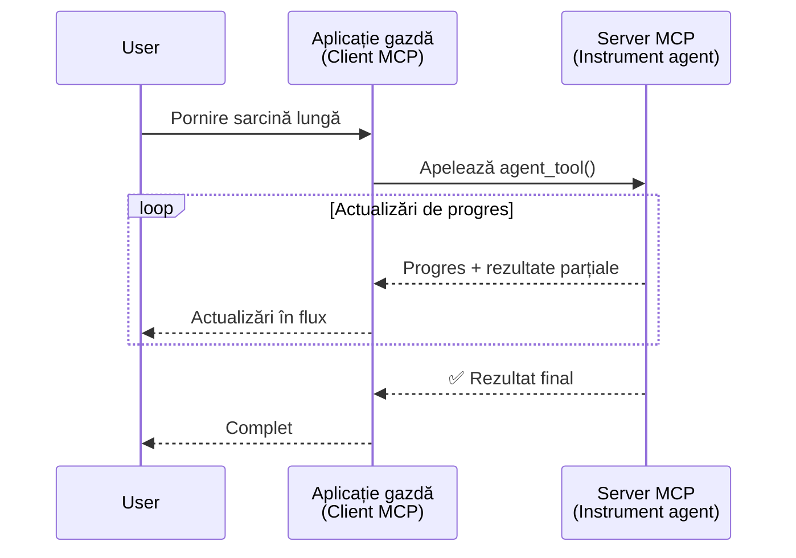
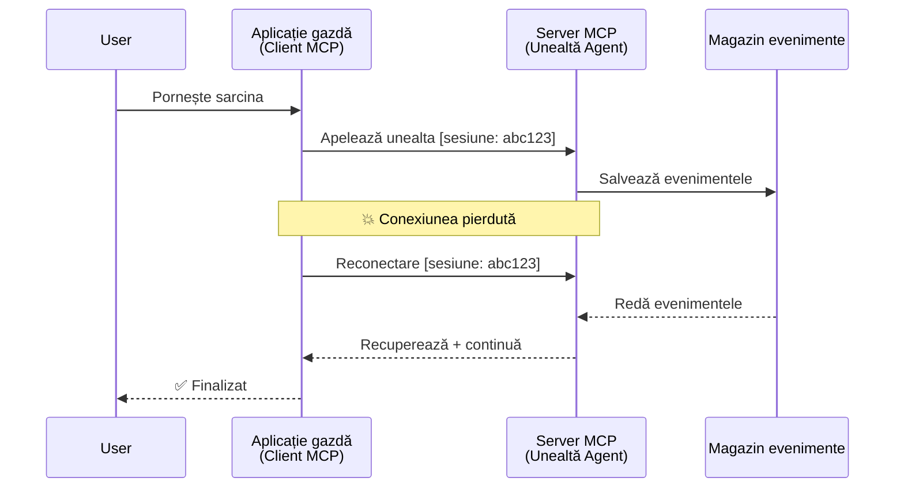
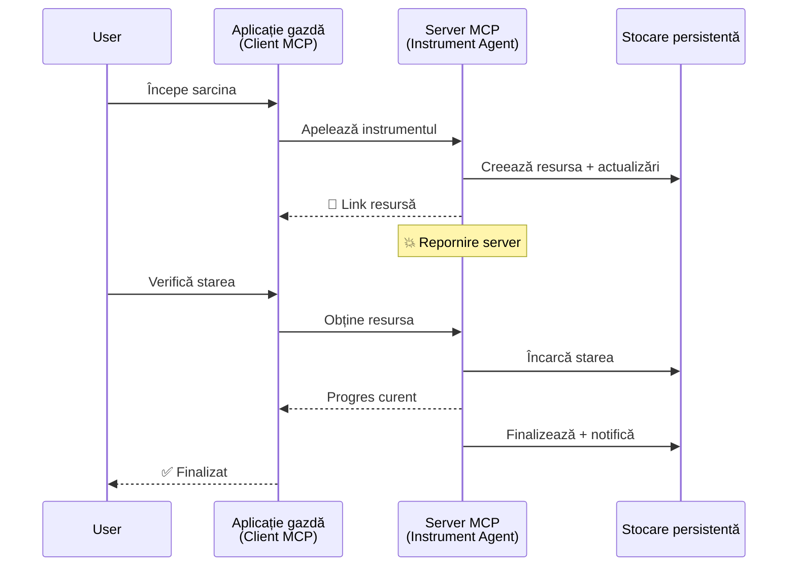
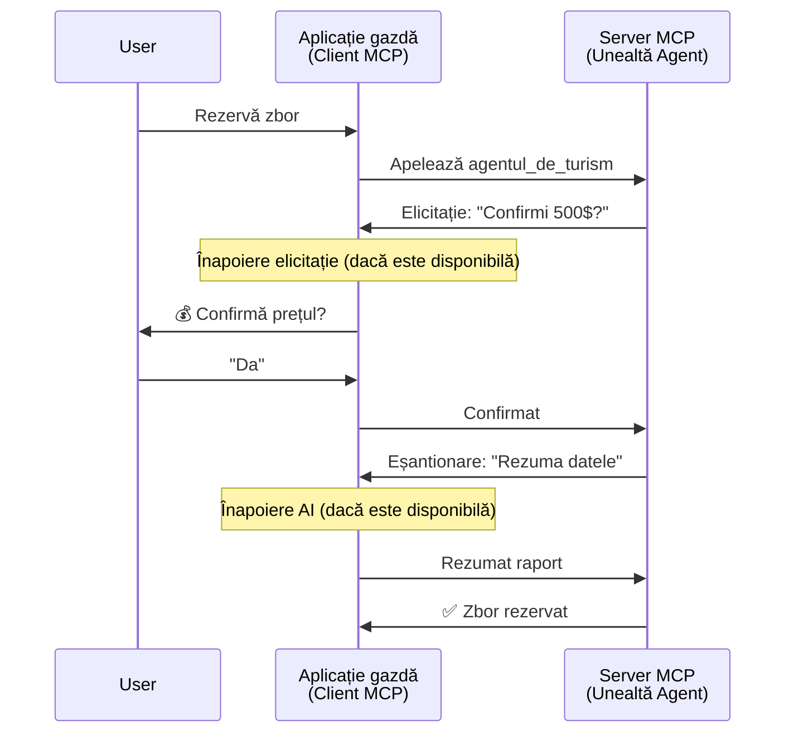
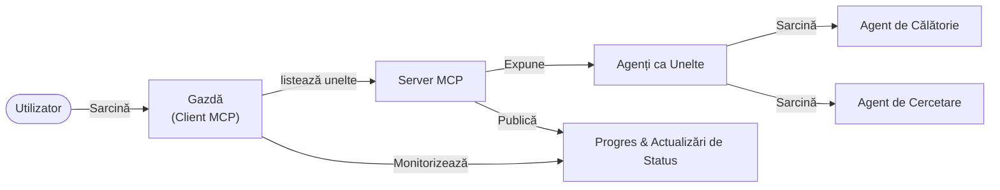

# Construirea sistemelor de comunicare agent-la-agent cu MCP

> TL;DR - Poți construi comunicare Agent2Agent pe MCP? Da!

MCP a evoluat semnificativ dincolo de scopul său inițial de „a furniza context pentru LLM-uri”. Cu îmbunătățiri recente, inclusiv [streamuri reluabile](https://modelcontextprotocol.io/docs/concepts/transports#resumability-and-redelivery), [elicitație](https://modelcontextprotocol.io/specification/2025-06-18/client/elicitation), [sampling](https://modelcontextprotocol.io/specification/2025-06-18/client/sampling) și notificări ([progres](https://modelcontextprotocol.io/specification/2025-06-18/basic/utilities/progress) și [resurse](https://modelcontextprotocol.io/specification/2025-06-18/schema#resourceupdatednotification)), MCP oferă acum o fundație solidă pentru construirea sistemelor complexe de comunicare agent-la-agent.

## Eroarea comună privind Agentul/Unealta

Pe măsură ce tot mai mulți dezvoltatori explorează unelte cu comportamente agentice (care rulează perioade lungi, pot necesita input suplimentar pe parcursul execuției etc.), o concepție greșită comună este că MCP nu este potrivit, în principal deoarece exemplele timpurii de unelte ale sale se concentrau pe modele simple cerere-răspuns.

Această percepție este depășită. Specificația MCP a fost îmbunătățită semnificativ în ultimele luni cu capabilități care reduc diferența pentru construirea comportamentelor agentice de durată lungă:

- **Streaming & Rezultate Parțiale**: Actualizări în timp real ale progresului în timpul execuției
- **Reluabilitate**: Clienții se pot reconecta și continua după deconectare
- **Durabilitate**: Rezultatele supraviețuiesc repornirilor serverului (de ex., prin linkuri către resurse)
- **Multi-turn**: Input interactiv pe parcursul execuției prin elicitație și sampling

Aceste caracteristici pot fi combinate pentru a permite aplicații agentice și multi-agent complexe, toate implementate pe protocolul MCP.

Pentru referință, vom numi agent o „unealtă” disponibilă pe un server MCP. Aceasta implică existența unei aplicații gazdă care implementează un client MCP ce stabilește o sesiune cu serverul MCP și poate apela agentul.

## Ce face o Unealtă MCP „Agentică”?

Înainte de a intra în detalii de implementare, să stabilim ce capabilități de infrastructură sunt necesare pentru a susține agenți care rulează pe termen lung.

> Vom defini un agent ca o entitate ce poate opera autonom pe perioade extinse, capabilă să gestioneze sarcini complexe care pot necesita multiple interacțiuni sau ajustări bazate pe feedback în timp real.

### 1. Streaming & Rezultate Parțiale

Modelele tradiționale cerere-răspuns nu funcționează pentru sarcini de durată lungă. Agenții trebuie să ofere:

- Actualizări în timp real ale progresului
- Rezultate intermediare

**Suport MCP**: Notificările de actualizare a resurselor permit streamingul rezultatelor parțiale, deși acest lucru necesită un design atent pentru a evita conflictele cu modelul 1:1 cerere/răspuns al JSON-RPC.

| Caracteristică              | Caz de utilizare                                                                                                                                                                | Suport MCP                                                                                |
| -------------------------- | ------------------------------------------------------------------------------------------------------------------------------------------------------------------------------ | ------------------------------------------------------------------------------------------ |
| Actualizări Progres Real-time | Utilizatorul solicită o sarcină de migrare cod. Agentul transmite progresul: „10% - Analiză dependențe... 25% - Conversie fișiere TypeScript... 50% - Actualizare importuri...”      | ✅ Notificări de progres                                                                   |
| Rezultate Parțiale          | Sarcina „Generează o carte” transmite rezultate parțiale, ex.: 1) Schema narațiunii, 2) Lista capitolelor, 3) Fiecare capitol pe măsură ce este finalizat. Gazda poate inspecta, anula sau redirecționa oricând. | ✅ Notificările pot fi „extinse” să includă rezultate parțiale; vezi propunerile din PR 383, 776 |

<div align="center" style="font-style: italic; font-size: 0.95em; margin-bottom: 0.5em;">
<strong>Figura 1:</strong> Diagrama ilustrează cum un agent MCP transmite actualizări ale progresului în timp real și rezultate parțiale către aplicația gazdă în timpul unei sarcini de durată lungă, permițând utilizatorului să monitorizeze execuția în timp real.
</div>



### 2. Reluabilitate

Agenții trebuie să gestioneze întreruperile de rețea cu grație:

- Reconectare după deconectarea clientului
- Continuare de unde au rămas (reluare mesaje)

**Suport MCP**: Transportul StreamableHTTP MCP suportă astăzi reluarea sesiunii și reluarea mesajelor prin ID-uri sesiune și ID-uri ultimelor evenimente. Nota importantă aici este că serverul trebuie să implementeze un EventStore care permite redarea evenimentelor la reconectarea clientului.  
Rețineți că există o propunere comunitară (PR #975) care explorează streamuri reluabile agnostice față de transport.

| Caracteristică  | Caz de utilizare                                                                                                                                                  | Suport MCP                                                                |
| -------------- | --------------------------------------------------------------------------------------------------------------------------------------------------------------- | -------------------------------------------------------------------------- |
| Reluabilitate  | Clientul se deconectează în timpul unei sarcini de durată lungă. La reconectare, sesiunea se reia cu redarea evenimentelor pierdute, continuând fără întreruperi. | ✅ Transport StreamableHTTP cu ID-uri sesiune, redare evenimente și EventStore |

<div align="center" style="font-style: italic; font-size: 0.95em; margin-bottom: 0.5em;">
<strong>Figura 2:</strong> Diagrama arată cum transportul StreamableHTTP și EventStore-ul MCP permit reluarea fără întreruperi a sesiunii: dacă clientul se deconectează, se poate reconecta și reda evenimentele pierdute, continuând taskul fără pierdere de progres.
</div>



### 3. Durabilitate

Agenții de durată lungă au nevoie de stare persistentă:

- Rezultatele supraviețuiesc repornirilor serverului
- Starea poate fi obținută ulterior
- Urmărirea progresului între sesiuni

**Suport MCP**: MCP suportă acum un tip de returnare link către resurse pentru apelurile uneltelor. Astăzi, un model posibil este să proiectezi o unealtă care creează o resursă și returnează imediat linkul resursei. Unealta poate continua să abordeze taskul în fundal și să actualizeze resursa. La rândul său, clientul poate alege să interogheze starea acestei resurse pentru a obține rezultate parțiale sau finale (în funcție de actualizările oferite de server) sau să se aboneze la resursa respectivă pentru notificări de actualizare.

O limitare aici este că interogarea resurselor sau abonarea pentru actualizări poate consuma resurse cu implicații la scară. Există o propunere comunitară deschisă (inclusiv #992) care explorează posibilitatea de a include webhooks sau triggere pe care serverul să le poată apela pentru a notifica clientul/aplicația gazdă despre actualizări.

| Caracteristică | Caz de utilizare                                                                                                                                        | Suport MCP                                                        |
| ------------- | ----------------------------------------------------------------------------------------------------------------------------------------------------- | ---------------------------------------------------------------- |
| Durabilitate  | Serverul se oprește brusc în timpul unei sarcini de migrare date. Rezultatele și progresul supraviețuiesc repornirea, clientul poate verifica starea și continua. | ✅ Linkuri resurse cu stocare persistentă și notificări de stare |

Astăzi, un model comun este să proiectezi o unealtă care creează o resursă și returnează imediat un link către aceasta. Unealta poate în fundal să abordeze sarcina, să emită notificări la resursă ce servesc ca actualizări de progres sau includ rezultate parțiale și să actualizeze conținutul din resursă după nevoie.

<div align="center" style="font-style: italic; font-size: 0.95em; margin-bottom: 0.5em;">
<strong>Figura 3:</strong> Diagrama demonstrează cum agenții MCP folosesc resurse persistente și notificări de stare pentru a asigura că sarcinile de durată lungă supraviețuiesc repornirilor serverului, permițând clienților să verifice progresul și să recupereze rezultatele chiar și după eșecuri.
</div>



### 4. Interacțiuni Multi-turn

Agenții au adesea nevoie de input suplimentar în timpul execuției:

- Clarificări sau aprobări umane
- Asistență AI pentru decizii complexe
- Ajustarea dinamică a parametrilor

**Suport MCP**: Complet suportat prin sampling (pentru input AI) și elicitație (pentru input uman).

| Caracteristică               | Caz de utilizare                                                                                                                               | Suport MCP                                           |
| --------------------------- | ---------------------------------------------------------------------------------------------------------------------------------------------- | ----------------------------------------------------- |
| Interacțiuni Multi-turn     | Agentul de rezervări cere confirmarea prețului de la utilizator, apoi solicită AI să rezume datele de călătorie înainte de finalizarea rezervării. | ✅ Elicitație pentru input uman, sampling pentru input AI |

<div align="center" style="font-style: italic; font-size: 0.95em; margin-bottom: 0.5em;">
<strong>Figura 4:</strong> Diagrama arată cum agenții MCP pot solicita interactiv input uman sau asistență AI pe parcursul execuției, susținând fluxuri de lucru complexe multi-turn cum ar fi confirmări și luarea deciziilor dinamice.
</div>



## Implementarea agenților pe termen lung pe MCP - Prezentare generală a codului

Ca parte a acestui articol, oferim un [repository de cod](https://github.com/victordibia/ai-tutorials/tree/main/MCP%20Agents) ce conține o implementare completă a agenților pe termen lung folosind SDK-ul Python MCP cu transport StreamableHTTP pentru reluarea sesiunii și reluarea mesajelor. Implementarea demonstrează cum capabilitățile MCP pot fi combinate pentru a permite comportamente sofisticate de tip agent.

În mod specific, implementăm un server cu două unelte principale de agent:

- **Agent de Călătorii** - Simulează un serviciu de rezervare de călătorii cu confirmare de preț prin elicitație
- **Agent de Cercetare** - Efectuează sarcini de cercetare cu rezumate asistate AI prin sampling

Ambele agenți demonstrează actualizări de progres în timp real, confirmări interactive și capacități complete de reluare a sesiunii.

### Concepte cheie de implementare

Secțiunile următoare arată implementarea agentului pe partea de server și gestionarea gazdei pe client pentru fiecare capabilitate:

#### Streaming & Actualizări de progres - Stare sarcină în timp real

Streamingul permite agenților să furnizeze actualizări în timp real ale progresului în timpul sarcinilor de durată lungă, ținând utilizatorii informați cu privire la starea sarcinii și rezultatele intermediare.

**Implementare server (agentul trimite notificări de progres):**

```python
# Din server/server.py - Agent de turism care trimite actualizări de progres
for i, step in enumerate(steps):
    await ctx.session.send_progress_notification(
        progress_token=ctx.request_id,
        progress=i * 25,
        total=100,
        message=step,
        related_request_id=str(ctx.request_id)
    )
    await anyio.sleep(2)  # Simulează lucrul

# Alternativ: Înregistrează mesaje pentru actualizări detaliate pas cu pas
await ctx.session.send_log_message(
    level="info",
    data=f"Processing step {current_step}/{steps} ({progress_percent}%)",
    logger="long_running_agent",
    related_request_id=ctx.request_id,
)
```

**Implementare client (gazda primește actualizări de progres):**

```python
# Din client/client.py - Client care gestionează notificările în timp real
async def message_handler(message) -> None:
    if isinstance(message, types.ServerNotification):
        if isinstance(message.root, types.LoggingMessageNotification):
            console.print(f"📡 [dim]{message.root.params.data}[/dim]")
        elif isinstance(message.root, types.ProgressNotification):
            progress = message.root.params
            console.print(f"🔄 [yellow]{progress.message} ({progress.progress}/{progress.total})[/yellow]")

# Înregistrează handlerul de mesaje la crearea sesiunii
async with ClientSession(
    read_stream, write_stream,
    message_handler=message_handler
) as session:
```

#### Elicitație - Cererea de input de la utilizator

Elicitația permite agenților să ceară input de la utilizator pe parcursul execuției. Este esențială pentru confirmări, clarificări sau aprobări în timpul sarcinilor de durată lungă.

**Implementare server (agentul solicită confirmare):**

```python
# Din server/server.py - Agent de turism solicitând confirmarea prețului
elicit_result = await ctx.session.elicit(
    message=f"Please confirm the estimated price of $1200 for your trip to {destination}",
    requestedSchema=PriceConfirmationSchema.model_json_schema(),
    related_request_id=ctx.request_id,
)

if elicit_result and elicit_result.action == "accept":
    # Continuați cu rezervarea
    logger.info(f"User confirmed price: {elicit_result.content}")
elif elicit_result and elicit_result.action == "decline":
    # Anulați rezervarea
    booking_cancelled = True
```

**Implementare client (gazda oferă callback de elicitație):**

```python
# Din client/client.py - Gestionarea cererilor de solicitare de la client
async def elicitation_callback(context, params):
    console.print(f"💬 Server is asking for confirmation:")
    console.print(f"   {params.message}")

    response = console.input("Do you accept? (y/n): ").strip().lower()

    if response in ['y', 'yes']:
        return types.ElicitResult(
            action="accept",
            content={"confirm": True, "notes": "Confirmed by user"}
        )
    else:
        return types.ElicitResult(
            action="decline",
            content={"confirm": False, "notes": "Declined by user"}
        )

# Înregistrați callback-ul la crearea sesiunii
async with ClientSession(
    read_stream, write_stream,
    elicitation_callback=elicitation_callback
) as session:
```

#### Sampling - Cererea de asistență AI

Samplingul permite agenților să solicite asistență LLM pentru decizii complexe sau generare de conținut în timpul execuției. Aceasta permite fluxuri hibride om-AI.

**Implementare server (agentul solicită asistență AI):**

```python
# Din server/server.py - Agent de cercetare solicitând rezumat AI
sampling_result = await ctx.session.create_message(
    messages=[
        SamplingMessage(
            role="user",
            content=TextContent(type="text", text=f"Please summarize the key findings for research on: {topic}")
        )
    ],
    max_tokens=100,
    related_request_id=ctx.request_id,
)

if sampling_result and sampling_result.content:
    if sampling_result.content.type == "text":
        sampling_summary = sampling_result.content.text
        logger.info(f"Received sampling summary: {sampling_summary}")
```

**Implementare client (gazda oferă callback de sampling):**

```python
# Din client/client.py - Gestionarea cererilor de eșantionare
async def sampling_callback(context, params):
    message_text = params.messages[0].content.text if params.messages else 'No message'
    console.print(f"🧠 Server requested sampling: {message_text}")

    # Într-o aplicație reală, aceasta ar putea apela un API LLM
    # Pentru scopuri de demonstrație, oferim un răspuns simulativ
    mock_response = "Based on current research, MCP has evolved significantly..."

    return types.CreateMessageResult(
        role="assistant",
        content=types.TextContent(type="text", text=mock_response),
        model="interactive-client",
        stopReason="endTurn"
    )

# Înregistrează callback-ul la crearea sesiunii
async with ClientSession(
    read_stream, write_stream,
    sampling_callback=sampling_callback,
    elicitation_callback=elicitation_callback
) as session:
```

#### Reluabilitate - Continuitatea sesiunii după deconectări

Reluabilitatea asigură că sarcinile agenților pe termen lung pot supraviețui deconectărilor clientului și pot continua fără întreruperi la reconectare. Aceasta este implementată prin stocarea evenimentelor și tokeni de reluare.

**Implementare Event Store (serverul reține starea sesiunii):**

```python
# Din server/event_store.py - Magazin de evenimente simplu în memorie
class SimpleEventStore(EventStore):
    def __init__(self):
        self._events: list[tuple[StreamId, EventId, JSONRPCMessage]] = []
        self._event_id_counter = 0

    async def store_event(self, stream_id: StreamId, message: JSONRPCMessage) -> EventId:
        """Store an event and return its ID."""
        self._event_id_counter += 1
        event_id = str(self._event_id_counter)
        self._events.append((stream_id, event_id, message))
        return event_id

    async def replay_events_after(self, last_event_id: EventId, send_callback: EventCallback) -> StreamId | None:
        """Replay events after the specified ID for resumption."""
        start_index = None
        stream_id = None
        for index, (event_stream_id, event_id, _) in enumerate(self._events):
            if event_id == last_event_id:
                start_index = index + 1
                stream_id = event_stream_id
                break

        if start_index is None:
            return None

        # Redă doar evenimentele ulterioare din fluxul original al sesiunii.
        for event_stream_id, event_id, message in self._events[start_index:]:
            if event_stream_id != stream_id:
                continue
            await send_callback(EventMessage(message, event_id))

        return stream_id

# Din server/server.py - Trecerea magazinului de evenimente către managerul de sesiune
def create_server_app(event_store: Optional[EventStore] = None) -> Starlette:
    server = ResumableServer()

    # Creează managerul de sesiuni cu magazinul de evenimente pentru reluare
    session_manager = StreamableHTTPSessionManager(
        app=server,
        event_store=event_store,  # Magazinul de evenimente permite reluarea sesiunii
        json_response=False,
        security_settings=security_settings,
    )

    return Starlette(routes=[Mount("/mcp", app=session_manager.handle_request)])

# Utilizare: Inițializează cu magazinul de evenimente
event_store = SimpleEventStore()
app = create_server_app(event_store)
```

**Metadate client cu token de reluare (clientul se reconectează folosind starea stocată):**

```python
# Din client/client.py - Reluarea clientului cu metadate
if existing_tokens and existing_tokens.get("resumption_token"):
    # Folosește tokenul de reluare existent pentru a continua de unde am rămas
    metadata = ClientMessageMetadata(
        resumption_token=existing_tokens["resumption_token"],
    )
else:
    # Creează un callback pentru a salva tokenul de reluare când este primit
    def enhanced_callback(token: str):
        protocol_version = getattr(session, 'protocol_version', None)
        token_manager.save_tokens(session_id, token, protocol_version, command, args)

    metadata = ClientMessageMetadata(
        on_resumption_token_update=enhanced_callback,
    )

# Trimite cererea cu metadate de reluare
result = await session.send_request(
    types.ClientRequest(
        types.CallToolRequest(
            method="tools/call",
            params=types.CallToolRequestParams(name=command, arguments=args)
        )
    ),
    types.CallToolResult,
    metadata=metadata,
)
```

Aplicația gazdă păstrează local ID-urile de sesiune și tokenii de reluare, permițând reconectarea la sesiunile existente fără a pierde progres sau stare.

### Organizarea codului

<div align="center" style="font-style: italic; font-size: 0.95em; margin-bottom: 0.5em;">
<strong>Figura 5:</strong> Arhitectura sistemului bazat pe agenți MCP
</div>



**Fișiere cheie:**

- **`server/server.py`** - Server MCP reluabil cu agenți de călătorii și cercetare care demonstrează elicitație, sampling și actualizări de progres
- **`client/client.py`** - Aplicație gazdă interactivă cu suport pentru reluare, handleri callback și gestionarea tokenilor
- **`server/event_store.py`** - Implementare Event Store ce permite reluarea sesiunii și reluarea mesajelor

## Extinderea la comunicare multi-agent pe MCP

Implementarea de mai sus poate fi extinsă la sisteme multi-agent prin sporirea inteligenței și ariei aplicației gazdă:

- **Decompozitia inteligentă a sarcinilor**: Gazda analizează cereri complexe și le împarte în sub-sarcini pentru agenți specializați diferiți
- **Coordonare multi-server**: Gazda menține conexiuni la mai mulți serveri MCP, fiecare expunând diferite capabilități ale agenților
- **Gestionarea stării sarcinilor**: Gazda urmărește progresul multor sarcini concurente ale agenților, gestionând dependențele și ordinarea
- **Reziliență & Reîncercări**: Gazda gestionează eșecurile, implementează logica de reîncercare și redirecționează sarcinile când agenții devin indisponibili
- **Sinergia rezultatelor**: Gazda combină outputuri de la mai mulți agenți în rezultate finale coerente

Gazda evoluează de la un client simplu la un orchestrator inteligent, coordonând capabilitățile distribuite ale agenților în timp ce menține aceeași fundație de protocol MCP.

## Concluzie

Capabilitățile îmbunătățite ale MCP - notificări de resurse, elicitație/sampling, streamuri reluabile și resurse persistente - permit interacțiuni complexe agent-la-agent menținând simplitatea protocolului.

## Începe acum

Pregătit să construiești propriul tău sistem agent2agent? Urmează acești pași:

### 1. Rulează demo-ul

```bash
# Porniți serverul cu magazin de evenimente pentru reluare
python -m server.server --port 8006

# Într-un alt terminal, rulați clientul interactiv
python -m client.client --url http://127.0.0.1:8006/mcp
```

**Comenzi disponibile în modul interactiv:**

- `travel_agent` - Rezervă călătorii cu confirmare preț prin elicitație
- `research_agent` - Cercetează subiecte cu rezumate asistate AI prin sampling
- `list` - Afișează toate uneltele disponibile
- `clean-tokens` - Curăță tokenii de reluare
- `help` - Afișează ajutor detaliat pentru comenzi
- `quit` - Ieși din client

### 2. Testează capacitățile de reluare

- Pornește un agent de durată lungă (ex.: `travel_agent`)
- Interpretează clientul în timpul execuției (Ctrl+C)
- Repornește clientul - acesta va relua automat de unde a rămas

### 3. Explorează și extinde

- **Explorează exemplele**: Vezi acest [mcp-agents](https://github.com/victordibia/ai-tutorials/tree/main/MCP%20Agents)
- **Alătură-te comunității**: Participă la discuțiile MCP pe GitHub
- **Experimentează**: Începe cu o sarcină simplă de durată lungă și adaugă treptat streaming, reluabilitate și coordonare multi-agent

Acesta demonstrează cum MCP permite comportamente inteligente de agenți menținând simplitatea bazată pe unelte.

În general, specificația protocolului MCP evoluează rapid; cititorul este încurajat să consulte site-ul oficial de documentație pentru cele mai recente actualizări - https://modelcontextprotocol.io/introduction

---

<!-- CO-OP TRANSLATOR DISCLAIMER START -->
**Declinare a responsabilității**:
Acest document a fost tradus folosind serviciul de traducere AI [Co-op Translator](https://github.com/Azure/co-op-translator). În timp ce ne străduim pentru acuratețe, vă rugăm să rețineți că traducerile automate pot conține erori sau inexactități. Documentul original în limba sa nativă trebuie considerat sursa autorizată. Pentru informații critice, se recomandă traducerea profesională realizată de un om. Nu ne asumăm responsabilitatea pentru eventualele neînțelegeri sau interpretări greșite care decurg din utilizarea acestei traduceri.
<!-- CO-OP TRANSLATOR DISCLAIMER END -->