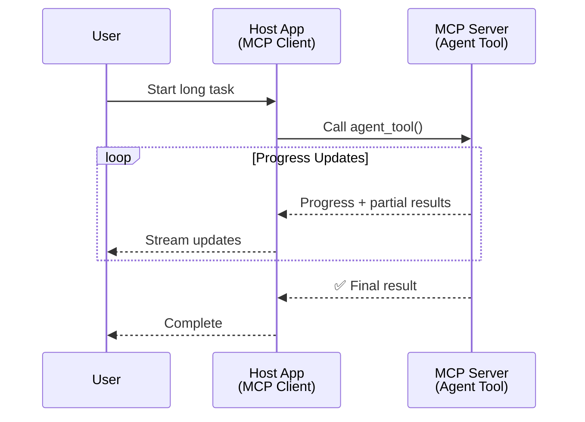
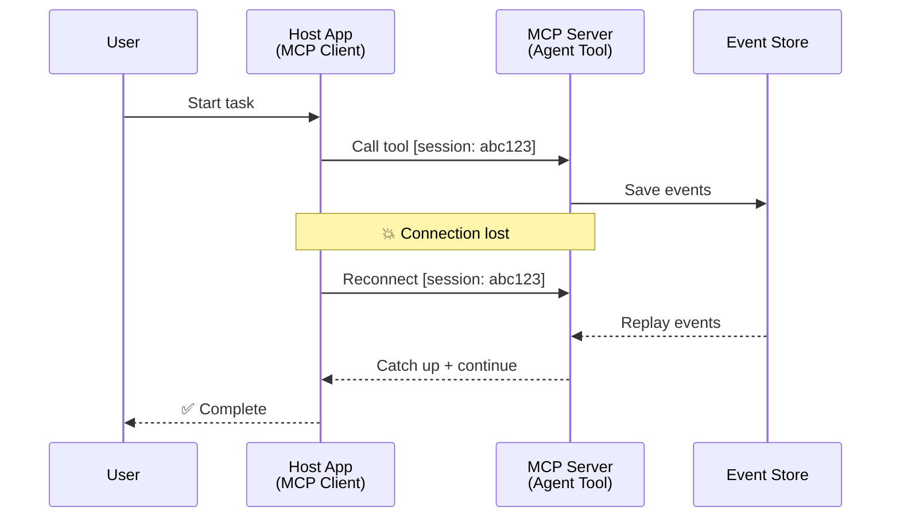
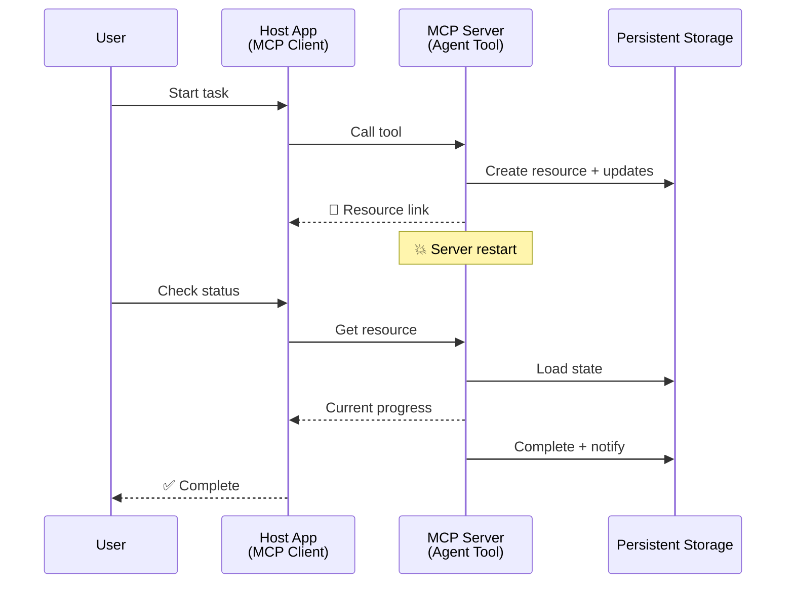
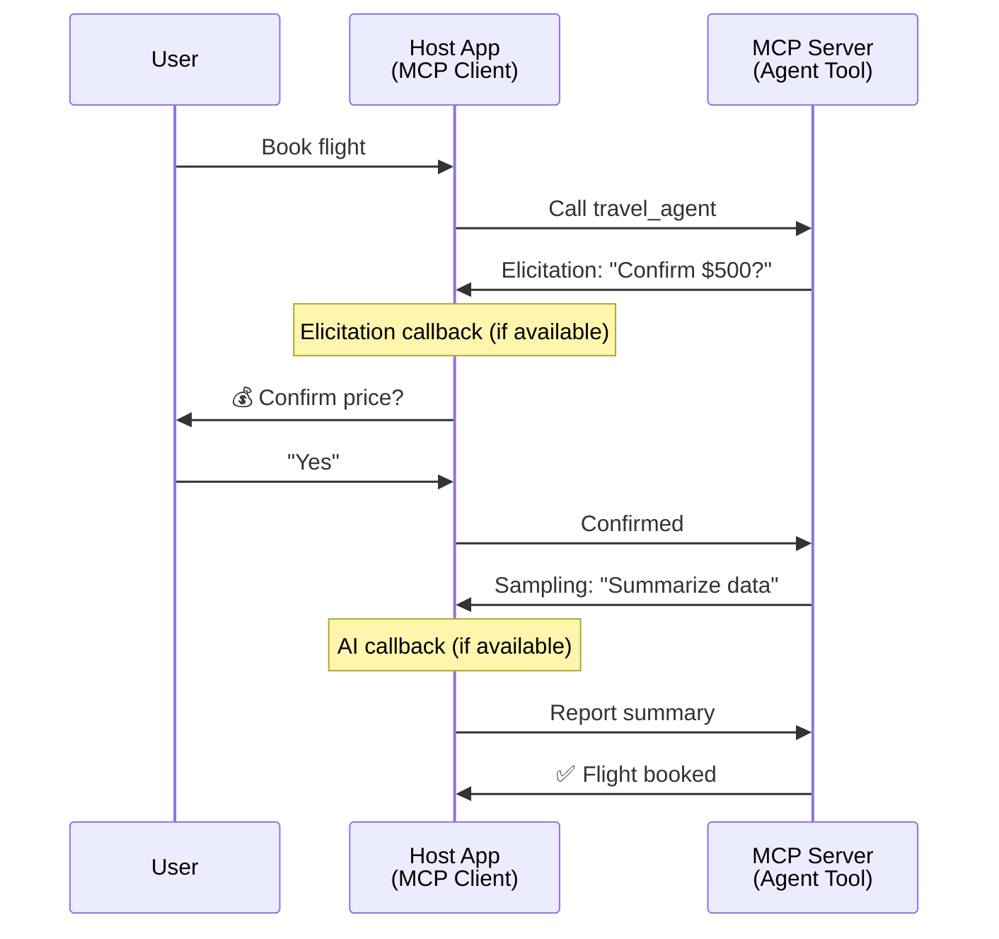

<!--
CO_OP_TRANSLATOR_METADATA:
{
  "original_hash": "5cc6836626047aa055e8960c8484a7d0",
  "translation_date": "2025-07-24T10:09:17+00:00",
  "source_file": "11-mcp/code_samples/mcp-agents/README.md",
  "language_code": "ro"
}
-->
# Construirea Sistemelor de Comunicare Agent-la-Agent cu MCP

> Pe scurt - Poți construi comunicare Agent2Agent pe MCP? Da!

MCP a evoluat semnificativ dincolo de scopul său inițial de "a oferi context pentru LLM-uri". Cu îmbunătățiri recente, inclusiv [fluxuri reluabile](https://modelcontextprotocol.io/docs/concepts/transports#resumability-and-redelivery), [elicitare](https://modelcontextprotocol.io/specification/2025-06-18/client/elicitation), [eșantionare](https://modelcontextprotocol.io/specification/2025-06-18/client/sampling) și notificări ([progres](https://modelcontextprotocol.io/specification/2025-06-18/basic/utilities/progress) și [resurse](https://modelcontextprotocol.io/specification/2025-06-18/schema#resourceupdatednotification)), MCP oferă acum o fundație robustă pentru construirea sistemelor complexe de comunicare agent-la-agent.

## Concepția Greșită despre Agent/Instrument

Pe măsură ce tot mai mulți dezvoltatori explorează instrumente cu comportamente agentice (care rulează pe perioade lungi, pot necesita intrări suplimentare în timpul execuției etc.), o concepție greșită comună este că MCP nu este potrivit, în principal pentru că exemplele timpurii ale primitivului său de instrumente s-au concentrat pe modele simple de cerere-răspuns.

Această percepție este depășită. Specificația MCP a fost semnificativ îmbunătățită în ultimele luni cu capabilități care închid decalajul pentru construirea comportamentelor agentice de lungă durată:

- **Streaming și Rezultate Parțiale**: Actualizări în timp real ale progresului în timpul execuției
- **Reluabilitate**: Clienții se pot reconecta și continua după o deconectare
- **Durabilitate**: Rezultatele supraviețuiesc repornirilor serverului (de exemplu, prin linkuri de resurse)
- **Multi-turn**: Intrări interactive în timpul execuției prin elicitare și eșantionare

Aceste caracteristici pot fi compuse pentru a permite aplicații complexe agentice și multi-agent, toate implementate pe protocolul MCP.

Pentru referință, vom numi un agent "instrument" disponibil pe un server MCP. Aceasta implică existența unei aplicații gazdă care implementează un client MCP ce stabilește o sesiune cu serverul MCP și poate apela agentul.

## Ce Face ca un Instrument MCP să Fie "Agentic"?

Înainte de a intra în implementare, să stabilim ce capabilități infrastructurale sunt necesare pentru a susține agenți de lungă durată.

> Vom defini un agent ca o entitate care poate opera autonom pe perioade extinse, capabilă să gestioneze sarcini complexe care pot necesita multiple interacțiuni sau ajustări bazate pe feedback în timp real.

### 1. Streaming și Rezultate Parțiale

Modelele tradiționale cerere-răspuns nu funcționează pentru sarcini de lungă durată. Agenții trebuie să ofere:

- Actualizări în timp real ale progresului
- Rezultate intermediare

**Suport MCP**: Notificările de actualizare a resurselor permit streamingul rezultatelor parțiale, deși acest lucru necesită un design atent pentru a evita conflictele cu modelul 1:1 cerere/răspuns al JSON-RPC.

| Caracteristică             | Caz de Utilizare                                                                                                                                                                       | Suport MCP                                                                                 |
| -------------------------- | ------------------------------------------------------------------------------------------------------------------------------------------------------------------------------------- | ------------------------------------------------------------------------------------------ |
| Actualizări în Timp Real   | Utilizatorul solicită o sarcină de migrare a codului. Agentul transmite progresul: "10% - Analizând dependențele... 25% - Convertind fișierele TypeScript... 50% - Actualizând importurile..." | ✅ Notificări de progres                                                                   |
| Rezultate Parțiale         | Sarcina "Generare carte" transmite rezultate parțiale, de ex., 1) Schița arcului narativ, 2) Lista capitolelor, 3) Fiecare capitol pe măsură ce este completat. Gazda poate inspecta, anula sau redirecționa în orice etapă. | ✅ Notificările pot fi "extinse" pentru a include rezultate parțiale, vezi propunerile PR 383, 776 |

<strong>Figura 1:</strong> Acest diagramă ilustrează cum un agent MCP transmite actualizări în timp real ale progresului și rezultate parțiale către aplicația gazdă în timpul unei sarcini de lungă durată, permițând utilizatorului să monitorizeze execuția în timp real.

### 2. Reluabilitate

Agenții trebuie să gestioneze întreruperile rețelei cu grație:

- Reconectare după deconectarea clientului
- Continuare de unde au rămas (reluarea mesajelor)

**Suport MCP**: Transportul MCP StreamableHTTP suportă astăzi reluarea sesiunilor și reluarea mesajelor cu ID-uri de sesiune și ultimele ID-uri de evenimente. Nota importantă aici este că serverul trebuie să implementeze un EventStore care permite redarea evenimentelor la reconectarea clientului.  
Rețineți că există o propunere comunitară (PR #975) care explorează fluxuri reluabile independente de transport.

| Caracteristică  | Caz de Utilizare                                                                                                                                                   | Suport MCP                                                                |
| ---------------- | ------------------------------------------------------------------------------------------------------------------------------------------------------------------ | -------------------------------------------------------------------------- |
| Reluabilitate    | Clientul se deconectează în timpul unei sarcini de lungă durată. La reconectare, sesiunea se reia cu evenimentele pierdute redate, continuând fără întreruperi.     | ✅ Transport StreamableHTTP cu ID-uri de sesiune, redare de evenimente și EventStore |

<strong>Figura 2:</strong> Acest diagramă arată cum transportul StreamableHTTP al MCP și EventStore permit reluarea fără întreruperi a sesiunilor: dacă clientul se deconectează, acesta se poate reconecta și reda evenimentele pierdute, continuând sarcina fără pierderi de progres.

### 3. Durabilitate

Agenții de lungă durată au nevoie de stări persistente:

- Rezultatele supraviețuiesc repornirilor serverului
- Starea poate fi recuperată în afara sesiunii
- Urmărirea progresului între sesiuni

**Suport MCP**: MCP suportă acum un tip de returnare Resource link pentru apelurile de instrumente. Astăzi, un model posibil este să proiectezi un instrument care creează o resursă și returnează imediat un link de resursă. Instrumentul poate continua să abordeze sarcina în fundal și să actualizeze resursa. La rândul său, clientul poate alege să interogheze starea acestei resurse pentru a obține rezultate parțiale sau complete (în funcție de actualizările resursei furnizate de server) sau să se aboneze la resursă pentru notificări de actualizare.

O limitare aici este că interogarea resurselor sau abonarea la actualizări poate consuma resurse cu implicații la scară. Există o propunere comunitară deschisă (inclusiv #992) care explorează posibilitatea includerii webhook-urilor sau a declanșatorilor pe care serverul le poate apela pentru a notifica aplicația client/gazdă despre actualizări.

| Caracteristică | Caz de Utilizare                                                                                                                                        | Suport MCP                                                        |
| -------------- | ------------------------------------------------------------------------------------------------------------------------------------------------------- | ------------------------------------------------------------------ |
| Durabilitate   | Serverul se prăbușește în timpul unei sarcini de migrare a datelor. Rezultatele și progresul supraviețuiesc repornirii, clientul poate verifica starea și continua din resursa persistentă. | ✅ Linkuri de resurse cu stocare persistentă și notificări de stare |

Astăzi, un model comun este să proiectezi un instrument care creează o resursă și returnează imediat un link de resursă. Instrumentul poate aborda sarcina în fundal, emite notificări de resurse care servesc drept actualizări de progres sau includ rezultate parțiale și actualizează conținutul în resursă după cum este necesar.

<strong>Figura 3:</strong> Acest diagramă demonstrează cum agenții MCP utilizează resurse persistente și notificări de stare pentru a asigura că sarcinile de lungă durată supraviețuiesc repornirilor serverului, permițând clienților să verifice progresul și să recupereze rezultatele chiar și după eșecuri.

### 4. Interacțiuni Multi-Turn

Agenții au adesea nevoie de intrări suplimentare în timpul execuției:

- Clarificări sau aprobări umane
- Asistență AI pentru decizii complexe
- Ajustarea dinamică a parametrilor

**Suport MCP**: Complet suportat prin eșantionare (pentru intrări AI) și elicitare (pentru intrări umane).

| Caracteristică             | Caz de Utilizare                                                                                                                                     | Suport MCP                                           |
| -------------------------- | ---------------------------------------------------------------------------------------------------------------------------------------------------- | ----------------------------------------------------- |
| Interacțiuni Multi-Turn    | Agentul de rezervări de călătorii solicită confirmarea prețului de la utilizator, apoi cere AI-ului să rezume datele de călătorie înainte de a finaliza tranzacția. | ✅ Elicitare pentru intrări umane, eșantionare pentru intrări AI |

<strong>Figura 4:</strong> Acest diagramă descrie cum agenții MCP pot solicita interactiv intrări umane sau asistență AI în timpul execuției, susținând fluxuri de lucru complexe, multi-turn, cum ar fi confirmările și luarea deciziilor dinamice.

## Implementarea Agenților de Lungă Durată pe MCP - Prezentare Generală a Codului

Ca parte a acestui articol, oferim un [repository de cod](https://github.com/victordibia/ai-tutorials/tree/main/MCP%20Agents) care conține o implementare completă a agenților de lungă durată utilizând MCP Python SDK cu transport StreamableHTTP pentru reluarea sesiunilor și redarea mesajelor. Implementarea demonstrează cum capabilitățile MCP pot fi compuse pentru a permite comportamente sofisticate de tip agent.

...

**Declinarea responsabilității**:  
Acest document a fost tradus folosind serviciul de traducere AI [Co-op Translator](https://github.com/Azure/co-op-translator). Deși depunem eforturi pentru a asigura acuratețea, vă rugăm să rețineți că traducerile automate pot conține erori sau inexactități. Documentul original în limba sa nativă ar trebui considerat sursa autoritară. Pentru informații critice, se recomandă traducerea umană realizată de profesioniști. Nu ne asumăm răspunderea pentru eventualele neînțelegeri sau interpretări greșite care pot apărea din utilizarea acestei traduceri.