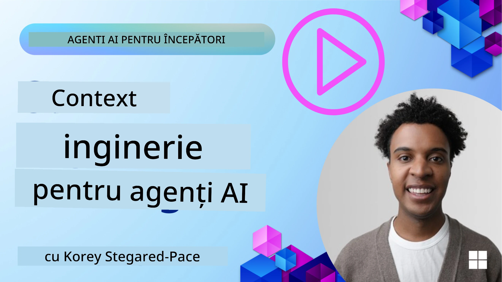
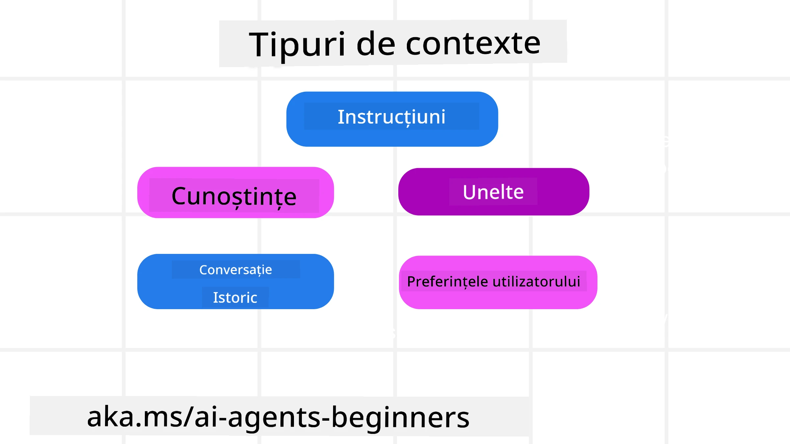
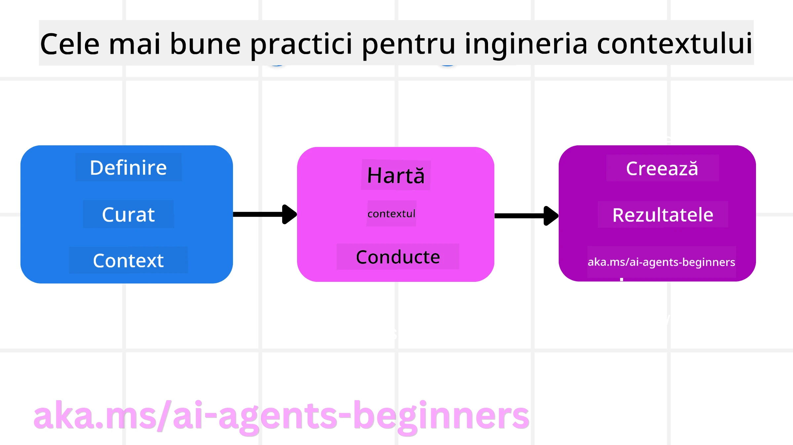

# Ingineria Contextului pentru Agenții AI

> _(Faceți clic pe imaginea de mai sus pentru a viziona videoclipul acestei lecții)_

Înțelegerea complexității aplicației pentru care construiți un agent AI este importantă pentru a crea unul fiabil. Trebuie să construim Agenți AI care să gestioneze eficient informațiile pentru a răspunde nevoilor complexe dincolo de ingineria prompturilor.

În această lecție, vom analiza ce este ingineria contextului și rolul său în construirea agenților AI.

## Introducere

Această lecție va acoperi:

• **Ce este Ingineria Contextului** și de ce este diferită de ingineria prompturilor.

• **Strategii pentru ingineria eficientă a contextului**, inclusiv cum să scriem, să selectăm, să comprimăm și să izolăm informațiile.

• **Eșecuri comune ale contextului** care pot deraia agentul AI și cum să le remediem.

## Obiectivele Învățării

După finalizarea acestei lecții, veți înțelege cum să:

• **Definiți ingineria contextului** și să o diferențiați de ingineria prompturilor.

• **Identificați componentele cheie ale contextului** în aplicațiile bazate pe modele mari de limbaj (LLM).

• **Aplicați strategii pentru scrierea, selectarea, comprimarea și izolarea contextului** pentru a îmbunătăți performanța agentului.

• **Recunoașteți eșecurile comune ale contextului** precum otrăvirea, distragerea, confuzia și conflictul și să implementați tehnici de atenuare.

## Ce este Ingineria Contextului?

Pentru Agenții AI, contextul este ceea ce determină planificarea unui agent AI de a lua anumite acțiuni. Ingineria Contextului este practica de a asigura că agentul AI are informația corectă pentru a finaliza următorul pas al sarcinii. Fereastra de context este limitată ca dimensiune, așa că, în calitate de constructori de agenți, trebuie să dezvoltăm sisteme și procese pentru a gestiona adăugarea, eliminarea și condensarea informațiilor din fereastra de context.

### Ingineria Prompturilor vs Ingineria Contextului

Ingineria prompturilor se concentrează pe un set unic de instrucțiuni statice pentru a ghida eficient agenții AI cu un set de reguli. Ingineria contextului este modul de a gestiona un set dinamic de informații, inclusiv promptul inițial, pentru a asigura că agentul AI are ceea ce îi trebuie de-a lungul timpului. Ideea principală din jurul ingineriei contextului este de a face acest proces repetabil și fiabil.

### Tipuri de Context

Este important să ne amintim că contextul nu este doar un singur lucru. Informațiile de care agentul AI are nevoie pot proveni dintr-o varietate de surse diferite și este responsabilitatea noastră să ne asigurăm că agentul are acces la aceste surse:

Tipurile de context pe care un agent AI ar putea trebui să le gestioneze includ:

• **Instrucțiuni:** Acestea sunt ca "regulile" agentului – prompturi, mesaje de sistem, exemple few-shot (care arată AI cum să facă ceva) și descrieri ale uneltelor pe care le poate folosi. Aici se combină concentrarea ingineriei prompturilor cu ingineria contextului.

• **Cunoștințe:** Asta acoperă fapte, informații preluate din baze de date sau memorii pe termen lung pe care agentul le-a acumulat. Include integrarea unui sistem Retrieval Augmented Generation (RAG) dacă agentul are nevoie de acces la diferite depozite de cunoștințe și baze de date.

• **Unelte:** Acestea sunt definițiile funcțiilor externe, API-urilor și serverelor MCP pe care agentul le poate apela, împreună cu feedback-ul (rezultatele) obținute în urma utilizării lor.

• **Istoricul conversației:** Dialogul continuu cu un utilizator. Pe măsură ce trece timpul, aceste conversații devin mai lungi și mai complexe, ceea ce înseamnă că ocupă spațiu în fereastra de context.

• **Preferințele utilizatorului:** Informații învățate despre preferințele sau antipatiile unui utilizator de-a lungul timpului. Acestea pot fi stocate și apelate în luarea deciziilor cheie pentru a ajuta utilizatorul.

## Strategii pentru Ingineria Eficientă a Contextului

### Strategii de Planificare

O inginerie bună a contextului începe cu o planificare bună. Iată o abordare care vă va ajuta să începeți să gândiți cum să aplicați conceptul de inginerie a contextului:

1. **Definiți Rezultate Clare** - Rezultatele sarcinilor pe care le vor primi agenții AI ar trebui să fie clar definite. Răspundeți la întrebarea – „Cum va arăta lumea când agentul AI își va termina sarcina?” Cu alte cuvinte, ce schimbare, informație sau răspuns ar trebui să aibă utilizatorul după interacțiunea cu agentul AI.
2. **Cartografiați Contextul** – Odată ce ați definit rezultatele agentului AI, trebuie să răspundeți la întrebarea „Ce informații are nevoie agentul AI pentru a finaliza această sarcină?”. Astfel puteți începe să cartografiați contextul, adică unde pot fi localizate aceste informații.
3. **Creați Conducte de Context** – Acum că știți unde se află informațiile, trebuie să răspundeți la întrebarea „Cum va obține agentul aceste informații?”. Acest lucru se poate face în diverse moduri, inclusiv RAG, utilizarea serverelor MCP și a altor unelte.

### Strategii Practice

Planificarea este importantă, dar odată ce informațiile încep să intre în fereastra de context a agentului nostru, trebuie să avem strategii practice pentru a le gestiona:

#### Gestionarea Contextului

Deși unele informații vor fi adăugate automat în fereastra de context, ingineria contextului înseamnă să avem un rol mai activ în gestionarea acestor informații, ceea ce se poate face prin câteva strategii:

 1. **Blocul de Notițe al Agentului (Agent Scratchpad)**  
 Permite agentului AI să ia notițe despre informații relevante legate de sarcinile curente și interacțiunile cu utilizatorul în timpul unei singure sesiuni. Acesta ar trebui să existe în afara ferestrei de context, într-un fișier sau obiect de runtime pe care agentul îl poate accesa ulterior în timpul acestei sesiuni dacă este nevoie.

 2. **Memorii**  
 Blocurile de notițe sunt bune pentru gestionarea informațiilor în afara ferestrei de context a unei singure sesiuni. Memorii permit agenților să stocheze și să recupereze informații relevante între mai multe sesiuni. Acestea pot include rezumate, preferințe ale utilizatorului și feedback pentru îmbunătățiri viitoare.

 3. **Compresia Contextului**  
 Odată ce fereastra de context crește și se apropie de limită, se pot folosi tehnici precum rezumarea și tăierea. Aceasta include păstrarea doar a celor mai relevante informații sau eliminarea mesajelor mai vechi.
  
 4. **Sisteme Multi-Agent**  
 Dezvoltarea unui sistem multi-agent este o formă de inginerie a contextului deoarece fiecare agent are propria fereastră de context. Cum este împărtășit și transmis acest context către diferiți agenți este alt aspect de planificat la construirea acestor sisteme.
  
 5. **Mediile Sandbox**  
 Dacă un agent trebuie să ruleze un cod sau să proceseze cantități mari de informații într-un document, acest lucru poate necesita un număr mare de tokeni pentru a procesa rezultatele. În loc să stocheze totul în fereastra de context, agentul poate folosi un mediu sandbox capabil să ruleze codul și să citească doar rezultatele și alte informații relevante.
  
 6. **Obiecte de Stare în Timpul Rularii (Runtime State Objects)**  
 Acest lucru se realizează prin crearea de containere de informații pentru a gestiona situațiile în care agentul trebuie să aibă acces la anumite informații. Pentru o sarcină complexă, acest lucru ar permite agentului să stocheze rezultatele fiecărui pas al subtask-ului, rând pe rând, permițând contextului să rămână legat doar de acel subtask specific.

#### Inspectarea Contextului

După ce aplicați una dintre aceste strategii, merită verificat ce a primit de fapt următorul apel al modelului. O întrebare utilă pentru depanare este:

> Agentul a încărcat prea mult context, contextul greșit sau a omis contextul necesar?

Nu trebuie să înregistrați prompturile brute, rezultatele uneltelor sau conținuturile memoriei pentru a răspunde la această întrebare. În producție, preferați înregistrări mici de inspecție a contextului care capturează conturi, id-uri, hash-uri și etichete de politică:

- **Selecție:** Urmăriți câte fragmente candidate, unelte sau memorii au fost luate în calcul, câte au fost selectate și care regulă sau scor a determinat filtrarea celorlalte.
- **Compresie:** Înregistrați intervalul sursă sau id-ul urmării, id-ul rezumatului, o estimare a numărului de tokeni înainte și după compresie și dacă conținutul brut a fost exclus de la următorul apel.
- **Izolare:** Notați ce subtask a rulat într-un agent separat, sesiune sau sandbox, ce rezumat închis a fost returnat și dacă un output mare al uneltelor a rămas în afara contextului agentului părinte.
- **Memorie și RAG:** Stocați id-urile documentelor extrase, id-urile memoriei, scorurile, id-urile selectate și starea de redactare în loc de textul complet extras.
- **Securitate și confidențialitate:** Preferati hash-uri, id-uri, token buckets și etichete de politică în locul textului sensibil al prompturilor, argumentelor uneltelor, rezultatelor uneltelor sau corpurilor memoriei utilizatorului.

Scopul nu este să păstrați mai mult context. Este să lăsați suficiente dovezi ca un dezvoltator să poată spune ce strategie de context a fost folosită și dacă a schimbat următorul apel al modelului în modul intenționat.

### Exemplu de Inginerie a Contextului

Să spunem că vrem ca un agent AI să **„Să-mi rezerve o călătorie la Paris.”**

• Un agent simplu folosind doar ingineria prompturilor ar putea răspunde doar: **„Bine, când doriți să mergeți la Paris?”**. El a procesat doar întrebarea directă de când utilizatorul a pus-o.

• Un agent folosind strategiile de inginerie a contextului prezentate ar face mult mai mult. Înainte să răspundă, sistemul său ar putea:

  ◦ **Verifica calendarul dvs.** pentru date disponibile (recuperând date în timp real).

 ◦ **Aminti preferințele anterioare de călătorie** (din memoria pe termen lung) precum compania aeriană preferată, bugetul sau dacă preferați zboruri directe.

 ◦ **Identifica uneltele disponibile** pentru rezervarea zborurilor și hotelurilor.

- Apoi, un răspuns exemplu ar putea fi: „Salut [Numele tău]! Văd că ești liber în prima săptămână din octombrie. Să caut zboruri directe spre Paris cu [Compania Aeriană Preferată] în limita bugetului tău obișnuit de [Buget]?” Acest răspuns mai bogat, conștient de context, demonstrează puterea ingineriei contextului.

## Eșecuri Comune ale Contextului

### Otrăvirea Contextului

**Ce este:** Când o halucinație (informație falsă generată de LLM) sau o eroare pătrunde în context și este referențiată repetat, determinând agentul să urmărească obiective imposibile sau să dezvolte strategii absurde.

**Ce se face:** Implementați **validarea contextului** și **carantina**. Validați informațiile înainte de a le adăuga în memoria pe termen lung. Dacă se detectează potențiala otrăvire, începeți fire noi de context pentru a preveni răspândirea informațiilor eronate.

**Exemplu Rezervare Călătorie:** Agentul dvs. halucinează un **zbor direct de la un aeroport local mic către un oraș internațional îndepărtat** care nu oferă de fapt zboruri internaționale. Acest detaliu de zbor inexistent este salvat în context. Mai târziu, când cereți agentului să rezerve, el încearcă continuu să găsească bilete pentru această rută imposibilă, ducând la erori repetate.

**Soluție:** Implementați un pas care **validă existența zborului și rutele cu un API în timp real** _înainte_ de a adăuga detaliul zborului în contextul de lucru al agentului. Dacă validarea eșuează, informația eronată este „pusă în carantină” și nu este folosită mai departe.

### Distragerea Contextului

**Ce este:** Când contextul devine atât de mare încât modelul se concentrează prea mult pe istoricul acumulat în loc să folosească ceea ce a învățat în timpul antrenamentului, generând acțiuni repetitive sau nefolositoare. Modelele pot începe să facă greșeli chiar înainte ca fereastra de context să fie plină.

**Ce se face:** Folosiți **rezumarea contextului**. Comprimați periodic informațiile acumulate în rezumate mai scurte, păstrând detaliile importante și eliminând istoricul redundant. Aceasta ajută la „resetarea” concentrării.

**Exemplu Rezervare Călătorie:** Ați discutat despre diverse destinații de vis timp îndelungat, inclusiv o relatare detaliată a călătoriei cu rucsacul de acum doi ani. Când în sfârșit întrebați **„găsește-mi un zbor ieftin pentru luna viitoare”**, agentul este împotmolit în detalii vechi, irelevante și continuă să întrebe despre echipamentul de rucsac sau itinerariile trecute, neglijând cererea actuală.

**Soluție:** După un anumit număr de interacțiuni sau când contextul devine prea mare, agentul ar trebui să **rezume cele mai recente și relevante părți ale conversației** – concentrându-se pe datele și destinația de călătorie actuală – și să folosească acest rezumat condensat pentru următorul apel LLM, eliminând istoricul mai puțin relevant.

### Confuzia Contextului

**Ce este:** Când contextul include informații inutile, deseori sub forma prea multor unelte disponibile, cauzând modelul să genereze răspunsuri proaste sau să apeleze unelte irelevante. Modelele mai mici sunt deosebit de predispuse la asta.

**Ce se face:** Implementați **gestionarea setului de unelte** folosind tehnici RAG. Stocați descrierile uneltelor într-o bază de date vectorială și selectați _doar_ cele mai relevante unelte pentru fiecare sarcină specifică. Cercetările arată că limitarea selecției uneltelor la mai puțin de 30 este eficientă.

**Exemplu Rezervare Călătorie:** Agentul dvs. are acces la zeci de unelte: `book_flight`, `book_hotel`, `rent_car`, `find_tours`, `currency_converter`, `weather_forecast`, `restaurant_reservations` etc. Întrebați: **„Care este cel mai bun mod să mă deplasez în Paris?”** Din cauza numărului mare de unelte, agentul se confuzează și încearcă să apeleze `book_flight` _în cadrul_ Parisului sau `rent_car` deși preferați transportul public, pentru că descrierile uneltelor se pot suprapune sau pur și simplu nu poate discrimina pe care să o aleagă.

**Soluție:** Folosiți **RAG peste descrierile uneltelor**. Când întrebați despre deplasarea în Paris, sistemul recuperează dinamic _doar_ uneltele cele mai relevante precum `rent_car` sau `public_transport_info` pe baza întrebării, prezentând un „set de unelte” concentrat pentru LLM.

### Conflictul Contextului

**Ce este:** Când există informații contradictorii în cadrul contextului, ducând la raționamente inconsistente sau răspunsuri finale proaste. Se întâmplă adesea când informațiile ajung în etape, iar presupunerile incorecte timpurii rămân în context.

**Ce se face:** Folosiți **tăierea contextului (context pruning)** și **descărcarea (offloading)**. Tăierea înseamnă eliminarea informațiilor învechite sau conflictuale pe măsură ce sosesc detalii noi. Descărcarea oferă modelului un spațiu de lucru separat „scratchpad” pentru a procesa informații fără a aglomera contextul principal.
**Exemplu de rezervare călătorie:** Inițial îi spui agentului tău, **„Vreau să zbor la clasa economică.”** Mai târziu, în timpul conversației, te răzgândești și spui, **„De fapt, pentru această călătorie, să mergem cu clasa business.”** Dacă ambele instrucțiuni rămân în context, agentul poate primi rezultate de căutare contradictorii sau se poate confunda cu privire la preferința pe care să o prioritizeze.

**Soluție:** Implementează **tăierea contextului**. Când o instrucțiune nouă contrazice pe cea veche, instrucțiunea mai veche este eliminată sau explicit suprascrisă în context. Alternativ, agentul poate folosi un **bloc de lucru** pentru a reconcila preferințele contradictorii înainte de a decide, asigurându-se că doar instrucțiunea finală, coerentă, îi ghidează acțiunile.

## Ai mai multe întrebări despre ingineria contextului?

Alătură-te [Microsoft Foundry Discord](https://aka.ms/ai-agents/discord) pentru a întâlni alți cursanți, a participa la ore de program și a primi răspunsuri la întrebările tale despre AI Agents.

---

<!-- CO-OP TRANSLATOR DISCLAIMER START -->
**Declinare a responsabilității**:
Acest document a fost tradus folosind serviciul de traducere AI [Co-op Translator](https://github.com/Azure/co-op-translator). În timp ce ne străduim pentru acuratețe, vă rugăm să rețineți că traducerile automate pot conține erori sau inexactități. Documentul original în limba sa nativă trebuie considerat sursa autorizată. Pentru informații critice, se recomandă traducerea profesională realizată de un om. Nu ne asumăm responsabilitatea pentru eventualele neînțelegeri sau interpretări greșite care decurg din utilizarea acestei traduceri.
<!-- CO-OP TRANSLATOR DISCLAIMER END -->