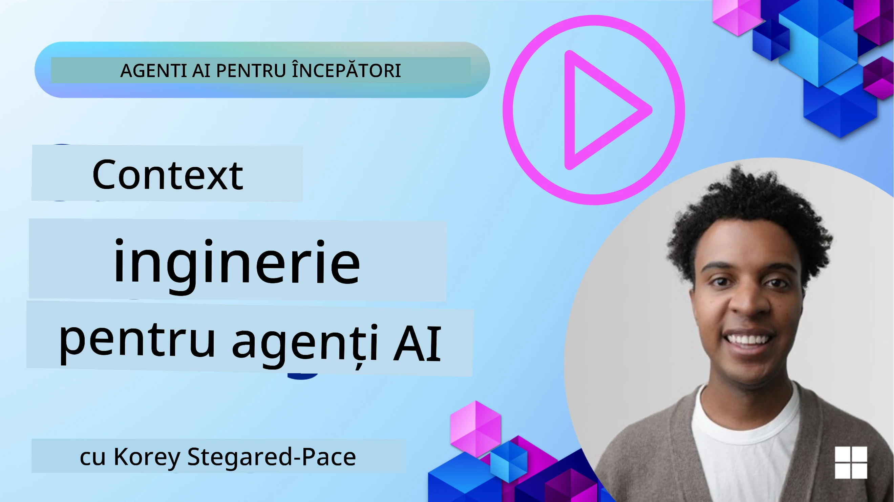
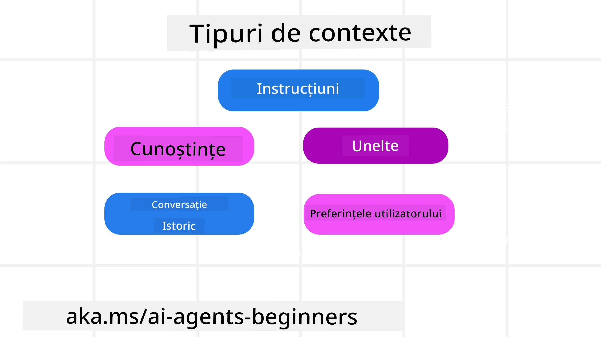
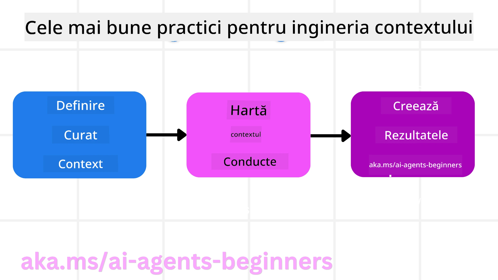

# Ingineria Contextului pentru Agenții AI

> _(Faceți clic pe imaginea de mai sus pentru a viziona videoclipul acestei lecții)_

Înțelegerea complexității aplicației pentru care construiți un agent AI este importantă pentru a crea unul de încredere. Trebuie să construim agenți AI care să gestioneze eficient informațiile pentru a răspunde nevoilor complexe dincolo de ingineria prompturilor.

În această lecție, vom analiza ce este ingineria contextului și rolul său în construirea agenților AI.

## Introducere

Această lecție va acoperi:

• **Ce este ingineria contextului** și de ce este diferită de ingineria prompturilor.

• **Strategii pentru ingineria eficientă a contextului**, inclusiv cum să scrii, selectezi, compresezi și izolezi informațiile.

• **Eșecuri comune ale contextului** care pot deraia agentul AI și cum să le remediezi.

## Obiective de Învățare

După finalizarea acestei lecții, vei înțelege cum să:

• **Definești ingineria contextului** și să o diferențiezi de ingineria prompturilor.

• **Identifici componentele cheie ale contextului** în aplicațiile cu modele de limbaj mari (LLM).

• **Aplici strategii pentru scrierea, selectarea, comprimarea și izolarea contextului** pentru a îmbunătăți performanța agentului.

• **Recunoști eșecurile comune ale contextului** precum otrăvirea, distragerea, confuzia și ciocnirea, și să implementezi tehnici de atenuare.

## Ce este Ingineria Contextului?

Pentru agenții AI, contextul este ceea ce conduce planificarea unui agent AI pentru a întreprinde anumite acțiuni. Ingineria contextului este practica de a te asigura că agentul AI are informația corectă pentru a finaliza pasul următor al sarcinii. Fereastra de context este limitată ca mărime, așadar, ca dezvoltatori de agenți, trebuie să construim sisteme și procese pentru a gestiona adăugarea, eliminarea și condensarea informațiilor din fereastra de context.

### Ingineria Prompturilor vs Ingineria Contextului

Ingineria prompturilor se concentrează pe un set unic de instrucțiuni statice pentru a ghida eficient agenții AI cu un set de reguli. Ingineria contextului este despre cum să gestionezi un set dinamic de informații, inclusiv promptul inițial, pentru a te asigura că agentul AI are ceea ce îi trebuie de-a lungul timpului. Ideea principală a ingineriei contextului este să faci acest proces repetabil și fiabil.

### Tipuri de Context

Este important să reținem că contextul nu este doar un singur lucru. Informațiile de care are nevoie agentul AI pot proveni dintr-o varietate de surse diferite și este responsabilitatea noastră să ne asigurăm că agentul are acces la aceste surse:

Tipurile de context pe care un agent AI ar putea să le gestioneze includ:

• **Instrucțiuni:** Acestea sunt ca „regulile” agentului – prompturi, mesaje de sistem, exemple few-shot (arată AI-ului cum să facă ceva) și descrieri ale uneltelor pe care le poate folosi. Aici se combină focalizarea ingineriei prompturilor cu ingineria contextului.

• **Cunoștințe:** Acoperă fapte, informații preluate din baze de date sau amintiri pe termen lung acumulate de agent. Aceasta include integrarea unui sistem Retrieval Augmented Generation (RAG) dacă agentul are nevoie de acces la diferite depozite de cunoștințe și baze de date.

• **Unelte:** Sunt definiții ale funcțiilor externe, API-uri și servere MCP pe care agentul le poate apela, împreună cu feedback-ul (rezultatele) pe care îl primește folosindu-le.

• **Istoricul Conversațiilor:** Dialogul în desfășurare cu un utilizator. Pe măsură ce trece timpul, aceste conversații devin mai lungi și mai complexe, ceea ce înseamnă că ocupă spațiu în fereastra de context.

• **Preferințele Utilizatorului:** Informații învățate despre gusturile sau antipatiile unui utilizator în timp. Acestea pot fi stocate și apelate atunci când se iau decizii cheie pentru a ajuta utilizatorul.

## Strategii pentru Ingineria Eficientă a Contextului

### Strategii de Planificare

O bună inginerie a contextului începe cu o bună planificare. Iată o abordare care te va ajuta să începi să gândești cum să aplici conceptul de inginerie a contextului:

1. **Definește Rezultate Clare** - Rezultatele sarcinilor ce vor fi atribuite agenților AI trebuie să fie clar definite. Răspunde la întrebarea - „Cum va arăta lumea când agentul AI își va încheia sarcina?” Cu alte cuvinte, ce schimbare, informație sau răspuns ar trebui să primească utilizatorul după interacțiunea cu agentul AI.

2. **Hărțuiește Contextul** - Odată ce ai definit rezultatele agentului AI, trebuie să răspunzi la întrebarea „Ce informații are nevoie agentul AI pentru a finaliza această sarcină?”. Astfel poți începe să mapezi contextul unde pot fi localizate aceste informații.

3. **Creează Pipeline-uri de Context** - Acum că știi unde sunt informațiile, trebuie să răspunzi la întrebarea „Cum va obține agentul aceste informații?”. Acest lucru poate fi realizat în diverse moduri, inclusiv RAG, utilizarea serverelor MCP și alte unelte.

### Strategii Practice

Planificarea este importantă, dar odată ce informațiile încep să curgă în fereastra de context a agentului nostru, avem nevoie de strategii practice pentru a le gestiona:

#### Gestionarea Contextului

În timp ce unele informații vor fi adăugate automat în fereastra de context, ingineria contextului înseamnă a prelua un rol mai activ asupra acestor informații, ceea ce poate fi realizat prin câteva strategii:

 1. **Agent Scratchpad**  
    Aceasta permite unui agent AI să ia notițe cu informații relevante despre sarcinile curente și interacțiunile cu utilizatorul în timpul unei sesiuni unice. Aceasta ar trebui să existe în afara ferestrei de context, într-un fișier sau obiect runtime pe care agentul îl poate recupera ulterior în timpul sesiunii dacă este necesar.

 2. **Memorii**  
    Scratchpad-urile sunt bune pentru gestionarea informațiilor în afara ferestrei de context dintr-o singură sesiune. Memorii permit agenților să stocheze și să recupereze informații relevante în mai multe sesiuni. Aceasta poate include rezumate, preferințe ale utilizatorilor și feedback pentru îmbunătățiri viitoare.

 3. **Comprimarea Contextului**  
    Odată ce fereastra de context crește și se apropie de limită, pot fi utilizate tehnici precum rezumarea și tăierea. Aceasta include fie păstrarea doar a celor mai relevante informații, fie eliminarea mesajelor mai vechi.

 4. **Sisteme Multi-Agenti**  
    Dezvoltarea unui sistem multi-agent este o formă de inginerie a contextului deoarece fiecare agent are propria fereastră de context. Modul în care acest context este partajat și transmis între agenți este un alt aspect de planificat la construirea acestor sisteme.

 5. **Mediile Sandbox**  
    Dacă un agent trebuie să ruleze cod sau să proceseze cantități mari de informații dintr-un document, acest lucru poate necesita un număr mare de tokeni pentru procesarea rezultatului. În loc să fie stocate toate acestea în fereastra de context, agentul poate utiliza un mediu sandbox care poate rula codul respectiv și să citească doar rezultatele și alte informații relevante.

 6. **Obiecte de Stare la Rulare**  
    Acest lucru se face prin crearea de containere de informații pentru a gestiona situațiile când agentul trebuie să aibă acces la anumite informații. Pentru o sarcină complexă, aceasta ar permite unui agent să stocheze rezultatele fiecărui subtask pas cu pas, permițând contextului să rămână conectat doar la acel subtask specific.

#### Inspectarea Contextului

După ce aplici una dintre aceste strategii, merită să verifici ce a primit de fapt următorul apel către model. O întrebare utilă pentru depanare este:

> Agentul a încărcat prea mult context, context greșit sau a omis contextul de care avea nevoie?

Nu trebuie să înregistrezi prompturi brute, rezultatele uneltelor sau conținutul memoriei pentru a răspunde acestei întrebări. În producție, preferă înregistrări mici de inspecție a contextului care capturează numere, id-uri, hash-uri și etichete de politică:

- **Selecție:** Urmărește câte fragmente candidate, unelte sau memorii au fost luate în considerare, câte au fost selectate și ce regulă sau scor a cauzat filtrarea celorlalte.
- **Compresie:** Înregistrează intervalul sursă sau id-ul de trasabilitate, id-ul rezumatului, o estimare a numărului de tokeni înainte și după comprimare și dacă conținutul brut a fost exclus de la următorul apel.
- **Izolare:** Notează care subtask a fost rulat într-un agent, sesiune sau sandbox separat, ce rezumat limitat a fost returnat și dacă un output mare de unealtă a rămas în afara contextului agentului părinte.
- **Memorie și RAG:** Stochează id-urile documentelor de recuperare, id-urile memoriei, scorurile, id-urile selectate și starea de redactare în locul textului complet recuperat.
- **Siguranță și confidențialitate:** Preferă hash-uri, id-uri, bucket-uri de tokeni și etichete de politică în locul textului sensibil din prompturi, argumentelor de unealtă, rezultatelor uneltei sau conținutului memoriei utilizatorului.

Scopul nu este să păstrezi mai mult context. Este să lași suficiente dovezi astfel încât un dezvoltator să poată determina ce strategie de context a fost aplicată și dacă aceasta a modificat următorul apel al modelului în modul intenționat.

### Exemplu de Inginerie a Contextului

Să zicem că vrem ca un agent AI să **„Îmi rezerve un sejur la Paris.”**

• Un agent simplu folosind doar ingineria prompturilor ar putea răspunde simplu: **„Bine, când doriți să mergeți la Paris?”**. Acesta a procesat doar întrebarea ta directă în momentul în care utilizatorul a întrebat.

• Un agent care utilizează strategiile de inginerie a contextului prezentate ar face mult mai mult. Înainte de a răspunde, sistemul său ar putea:

  ◦ **Verifica calendarul tău** pentru date disponibile (recuperând date în timp real).

 ◦ **Recupera preferințele anterioare de călătorie** (din memoria pe termen lung) precum compania aeriană preferată, bugetul sau dacă preferi zboruri directe.

 ◦ **Identifica uneltele disponibile** pentru rezervări de zbor și hotel.

- Apoi, un răspuns exemplu ar putea fi: „Salut [Numele Tău]! Văd că ești liber în prima săptămână din octombrie. Să caut zboruri directe către Paris cu [Compania Aeriană Preferată] în limita bugetului tău obișnuit de [Buget]?”. Acest răspuns mai bogat, conștient de context, demonstrează puterea ingineriei contextului.

## Eșecuri Comune ale Contextului

### Otrăvirea Contextului

**Ce este:** Când o halucinație (informație falsă generată de LLM) sau o eroare intră în context și este referențiată în mod repetat, determinând agentul să urmărească obiective imposibile sau să dezvolte strategii absurde.

**Ce trebuie făcut:** Implementează **validarea contextului** și **carantina**. Validează informațiile înainte de a fi adăugate în memoria pe termen lung. Dacă se detectează o potențială otrăvire, inițiază fire de context noi pentru a împiedica răspândirea informațiilor eronate.

**Exemplu Rezervare Călătorie:** Agentul tău halucinează un **zbor direct de la un aeroport local mic către un oraș internațional îndepărtat** care de fapt nu oferă zboruri internaționale. Acest detaliu de zbor inexistent este salvat în context. Mai târziu, când ceri agentului să rezerve, acesta încearcă în mod repetat să găsească bilete pentru această rută imposibilă, ducând la erori repetate.

**Soluție:** Implementează un pas care **validează existența zborului și rutele cu o API în timp real** _înainte_ de a adăuga detaliul zborului în contextul de lucru al agentului. Dacă validarea eșuează, informația eronată este „carantinată” și nu este folosită mai departe.

### Distragerea Contextului

**Ce este:** Când contextul devine atât de mare încât modelul se concentrează prea mult pe istoria acumulată în loc să folosească ceea ce a învățat în timpul instruirii, ducând la acțiuni repetitive sau nefolositoare. Modelele pot începe să greșească chiar înainte ca fereastra de context să fie plină.

**Ce trebuie făcut:** Folosește **rezumarea contextului**. Comprimă periodic informațiile acumulate în rezumate mai scurte, păstrând detaliile importante și eliminând istoria redundantă. Aceasta ajută la „resetarea” concentrării.

**Exemplu Rezervare Călătorie:** Ai discutat timp îndelungat despre diverse destinații de vis, inclusiv o relatare detaliată a excursiei tale cu rucsacul acum doi ani. Când în cele din urmă ceri să **„găsești un zbor ieftin pentru luna următoare”**, agentul se blochează în detaliile vechi, irelevante, și continuă să întrebe despre echipamentul de drumeție sau itinerariile trecute, ignorând cererea ta curentă.

**Soluție:** După un anumit număr de schimburi sau când contextul devine prea mare, agentul trebuie să **rezume cele mai recente și relevante părți ale conversației** – concentrându-se pe datele și destinația ta curentă – și să utilizeze acest rezumat comprimat pentru următorul apel LLM, eliminând conversația istorică mai puțin relevantă.

### Confuzia Contextului

**Ce este:** Când contextul inutil, adesea sub forma prea multor unelte disponibile, determină modelul să genereze răspunsuri greșite sau să apeleze unelte irelevante. Modelele mai mici sunt deosebit de predispuse la acest fenomen.

**Ce trebuie făcut:** Implementează **managementul încărcării uneltelor** folosind tehnici RAG. Stochează descrierile uneltelor într-o bază de date vectorială și selectează _doar_ cele mai relevante unelte pentru fiecare sarcină specifică. Cercetările arată că limitarea selecției uneltelor la mai puțin de 30 este eficientă.

**Exemplu Rezervare Călătorie:** Agentul tău are acces la zeci de unelte: `book_flight`, `book_hotel`, `rent_car`, `find_tours`, `currency_converter`, `weather_forecast`, `restaurant_reservations` etc. Întrebi, **„Care este cea mai bună cale de a mă deplasa prin Paris?”** Din cauza numărului mare de unelte, agentul se confundă și încearcă să apeleze `book_flight` _în Paris_, sau `rent_car` deși preferi transportul public, pentru că descrierile uneltelor se pot suprapune sau pur și simplu nu poate identifica cea mai bună unealtă.

**Soluție:** Folosește **RAG peste descrierile uneltelor**. Când întrebi despre deplasarea prin Paris, sistemul recuperează dinamic _doar_ uneltele cele mai relevante precum `rent_car` sau `public_transport_info` pe baza interogării tale, prezentând un „set” concentrat de unelte pentru LLM.

### Ciocnirea Contextului

**Ce este:** Când există informații contradictorii în cadrul contextului, ducând la raționamente inconsistente sau răspunsuri finale proaste. Acest lucru se întâmplă adesea când informațiile sosesc în etape, iar presupunerile eronate timpurii rămân în context.

**Ce trebuie făcut:** Folosește **tăierea contextului** și **descărcarea**. Tăierea înseamnă eliminarea informațiilor depășite sau contradictorii pe măsură ce sosesc noi detalii. Descărcarea oferă modelului un spațiu de lucru „scratchpad” separat pentru a procesa informațiile fără a aglomera contextul principal.
**Exemplu de rezervare pentru călătorii:** Inițial îi spui agentului tău, **„Vreau să zbor la clasa economic.”** Mai târziu, în conversație, te răzgândești și spui, **„De fapt, pentru această călătorie, să mergem la clasa business.”** Dacă ambele instrucțiuni rămân în context, agentul ar putea primi rezultate de căutare contradictorii sau s-ar putea confunda cu privire la preferința pe care să o prioritizeze.

**Soluție:** Implementează **curățarea contextului**. Când o instrucțiune nouă contrazice una veche, instrucțiunea mai veche este eliminată sau explicit anulată în context. Ca alternativă, agentul poate folosi un **scratchpad** pentru a reconcilia preferințele contradictorii înainte de a lua o decizie, asigurându-se că doar instrucțiunea finală și coerentă ghidează acțiunile sale.

## Ai mai multe întrebări despre ingineria contextului?

Alătură-te [Microsoft Foundry Discord](https://discord.com/invite/ATgtXmAS5D) pentru a întâlni alți cursanți, a participa la orele de consultanță și a-ți primi răspunsurile la întrebările despre agenții AI.

---

<!-- CO-OP TRANSLATOR DISCLAIMER START -->
**Declinare a responsabilității**:
Acest document a fost tradus folosind serviciul de traducere AI [Co-op Translator](https://github.com/Azure/co-op-translator). În timp ce ne străduim pentru acuratețe, vă rugăm să rețineți că traducerile automate pot conține erori sau inexactități. Documentul original în limba sa nativă trebuie considerat sursa autorizată. Pentru informații critice, se recomandă traducerea profesională realizată de un om. Nu ne asumăm responsabilitatea pentru eventualele neînțelegeri sau interpretări greșite care decurg din utilizarea acestei traduceri.
<!-- CO-OP TRANSLATOR DISCLAIMER END -->