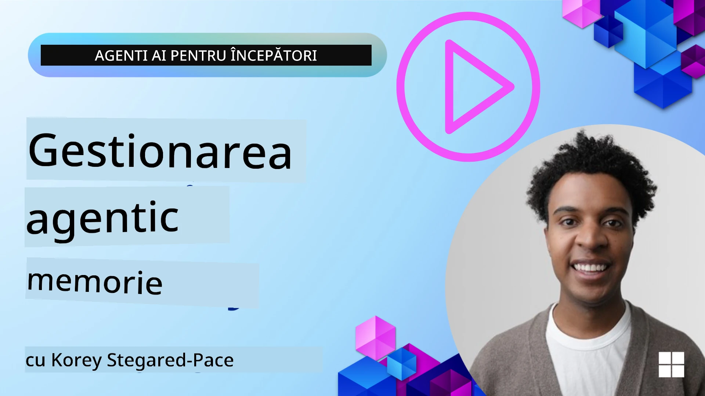

# Memoria pentru Agenții AI 

Când discutăm despre beneficiile unice ale creării Agenților AI, sunt abordate în principal două lucruri: capacitatea de a apela unelte pentru a îndeplini sarcini și capacitatea de a se îmbunătăți în timp. Memoria stă la baza creării unui agent care se autoîmbunătățește și poate crea experiențe mai bune pentru utilizatorii noștri.

În această lecție, vom analiza ce este memoria pentru Agenții AI și cum o putem gestiona și utiliza în beneficiul aplicațiilor noastre.

## Introducere

Această lecție va acoperi:

• **Înțelegerea Memoriei Agenților AI**: Ce este memoria și de ce este esențială pentru agenți.

• **Implementarea și Stocarea Memoriei**: Metode practice pentru adăugarea capabilităților de memorie agenților AI, concentrându-ne pe memoria pe termen scurt și pe termen lung.

• **Transformarea Agenților AI în Auto-îmbunătățitori**: Cum permite memoria agenților să învețe din interacțiunile trecute și să se îmbunătățească în timp.

## Implementări Disponibile

Această lecție include două tutoriale comprehensive în notebook:

• **[13-agent-memory.ipynb](./13-agent-memory.ipynb)**: Implementează memoria folosind Mem0 și Azure AI Search cu Microsoft Agent Framework

• **[13-agent-memory-cognee.ipynb](./13-agent-memory-cognee.ipynb)**: Implementează memoria structurată folosind Cognee, construind automat un grafic cunoștințe susținut de embeddings, vizualizând graficul și realizând recuperare inteligentă

## Obiectivele Învățării

După finalizarea acestei lecții, vei putea:

• **Diferentia tipurile variate de memorie ale agenților AI**, incluzând memoria de lucru, pe termen scurt și pe termen lung, precum și forme specializate precum memoria de persoană și episodică.

• **Implementa și gestiona memoria pe termen scurt și lung pentru agenții AI** folosind Microsoft Agent Framework, valorificând unelte precum Mem0, Cognee, memoria Whiteboard, și integrarea cu Azure AI Search.

• **Înțelege principiile din spatele agenților auto-îmbunătățitori** și cum sistemele robuste de gestionare a memoriei contribuie la învățare și adaptare continuă.

## Înțelegerea Memoriei pentru Agenții AI

În esență, **memoria pentru agenții AI se referă la mecanismele care le permit să rețină și să reamintească informații**. Aceste informații pot fi detalii specifice despre o conversație, preferințele utilizatorului, acțiuni din trecut sau chiar modele învățate.

Fără memorie, aplicațiile AI sunt adesea fără stare, ceea ce înseamnă că fiecare interacțiune începe de la zero. Acest lucru conduce la o experiență repetitivă și frustrantă pentru utilizator, unde agentul „uită” contextul sau preferințele anterioare.

### De ce este Importantă Memoria?

Inteligența unui agent este profund legată de capacitatea sa de a reaminti și utiliza informații din trecut. Memoria permite agenților să fie:

• **Reflectivi**: Să învețe din acțiunile și rezultatele anterioare.

• **Interactivi**: Să mențină contextul pe parcursul unei conversații în desfășurare.

• **Proactivi și Reactivi**: Să anticipeze nevoi sau să răspundă corespunzător bazat pe date istorice.

• **Autonomi**: Să funcționeze mai independent, folosind cunoștințe stocate.

Scopul implementării memoriei este de a face agenții mai **de încredere și capabili**.

### Tipuri de Memorie

#### Memoria de Lucru

Gândește-te la aceasta ca la o foaie de hârtie pe care un agent o folosește în timpul unei sarcini sau unui proces de gândire în desfășurare. Ea deține informații imediate necesare pentru a calcula pasul următor.

Pentru agenții AI, memoria de lucru capturează adesea cele mai relevante informații dintr-o conversație, chiar dacă istoricul complet al chatului este lung sau trunchiat. Se concentrează pe extragerea elementelor cheie precum cerințe, propuneri, decizii și acțiuni.

**Exemplu de Memorie de Lucru**

Într-un agent de rezervări de călătorie, memoria de lucru poate captura cererea curentă a utilizatorului, cum ar fi „Vreau să rezerv o călătorie la Paris”. Această cerință specifică este reținută în contextul imediat al agentului pentru a ghida interacțiunea curentă.

#### Memoria pe Termen Scurt

Acest tip de memorie reține informații pe durata unei singure conversații sau sesiuni. Este contextul chatului curent, permițând agentului să se refere înapoi la rundele anterioare din dialog.

**Exemplu de Memorie pe Termen Scurt**

Dacă un utilizator întreabă „Cât costă un zbor către Paris?” și apoi continuă cu „Dar cazarea acolo?”, memoria pe termen scurt asigură că agentul știe că „acolo” se referă la „Paris” în cadrul aceleiași conversații.

#### Memoria pe Termen Lung

Aceasta este informația care persistă pe parcursul mai multor conversații sau sesiuni. Permite agenților să își amintească preferințele utilizatorului, interacțiunile istorice sau cunoștințe generale pe perioade extinse. Este importantă pentru personalizare.

**Exemplu de Memorie pe Termen Lung**

O memorie pe termen lung ar putea reține că „Ben apreciază schiatul și activitățile în aer liber, îi place cafeaua cu vedere la munte și dorește să evite pârtiile avansate din cauza unei accidentări anterioare”. Aceste informații, învățate din interacțiunile anterioare, influențează recomandările în sesiunile viitoare de planificare a călătoriilor, făcându-le foarte personalizate.

#### Memoria de Persoană

Acest tip specializat de memorie ajută un agent să dezvolte o „personalitate” sau „persoană” consistentă. Permite agentului să își amintească detalii despre sine sau despre rolul său intenționat, făcând interacțiunile mai fluide și concentrate.

**Exemplu de Memorie de Persoană**  
Dacă agentul de călătorie este conceput să fie un „planificator expert de schi”, memoria de persoană poate întări acest rol, influențând răspunsurile sale să se alinieze cu tonul și cunoștințele unui expert.

#### Memoria de Flux de Lucru/Episodică

Această memorie stochează secvența de pași pe care un agent îi parcurge în timpul unei sarcini complexe, inclusiv succesele și eșecurile. Este ca și cum ar memora „episoade” specifice sau experiențe trecute pentru a învăța din ele.

**Exemplu de Memorie Episodică**

Dacă agentul a încercat să rezerve un anumit zbor, dar a eșuat din cauza lipsei disponibilității, memoria episodică poate înregistra acest eșec, permițând agentului să încerce zboruri alternative sau să informeze utilizatorul despre problemă într-un mod mai bine documentat în următoarea încercare.

#### Memoria de Entitate

Aceasta implică extragerea și amintirea unor entități specifice (cum ar fi persoane, locuri sau obiecte) și evenimente din conversații. Permite agentului să construiască o înțelegere structurată a elementelor cheie discutate.

**Exemplu de Memorie de Entitate**

Dintr-o conversație despre o călătorie trecută, agentul poate extrage „Paris”, „Turnul Eiffel” și „cina la restaurantul Le Chat Noir” ca entități. Într-o interacțiune viitoare, agentul ar putea să-și amintească „Le Chat Noir” și să ofere să facă o nouă rezervare acolo.

#### RAG Structurat (Retrieval Augmented Generation)

Deși RAG este o tehnică mai largă, „RAG Structurat” este evidențiată ca o tehnologie puternică a memoriei. Aceasta extrage informații dense și structurate din diverse surse (conversații, emailuri, imagini) și le folosește pentru a îmbunătăți precizia, rechemarea și viteza răspunsurilor. Spre deosebire de RAG clasic care se bazează doar pe similaritatea semantică, RAG Structurat funcționează cu structura inerentă a informației.

**Exemplu RAG Structurat**

În loc să se potrivească doar cuvinte-cheie, RAG Structurat ar putea analiza detaliile unui zbor (destinație, dată, oră, companie aeriană) dintr-un email și să le stocheze într-un mod structurat. Acest lucru permite interogări precise de tipul „Ce zbor am rezervat către Paris marți?”

## Implementarea și Stocarea Memoriei

Implementarea memoriei pentru agenții AI implică un proces sistematic de **gestionare a memoriei**, care include generarea, stocarea, recuperarea, integrarea, actualizarea și chiar „uitarea” (sau ștergerea) informațiilor. Recuperarea este un aspect deosebit de important.

### Unelte Specializate pentru Memorie

#### Mem0

Un mod de a stoca și gestiona memoria agentului este folosind unelte specializate precum Mem0. Mem0 funcționează ca un strat persistent de memorie, permițând agenților să reamintească interacțiuni relevante, să stocheze preferințele utilizatorului și contextul factual și să învețe din succese și eșecuri în timp. Ideea este că agenții fără stare devin agenți cu stare.

Funcționează printr-un **proces în două faze de memorie: extragere și actualizare**. Mai întâi, mesajele adăugate în firul conversației agentului sunt trimise la serviciul Mem0, care folosește un Model Mare de Limbaj (LLM) pentru a rezuma istoricul conversației și a extrage noi amintiri. Ulterior, o fază de actualizare condusă de LLM decide dacă să adauge, modifice sau șteargă aceste amintiri, stocându-le într-un depozit hibrid de date care poate include baze de date vectoriale, grafice și cheie-valoare. Acest sistem suportă, de asemenea, diverse tipuri de memorie și poate incorpora memoria grafică pentru gestionarea relațiilor dintre entități.

#### Cognee

O altă abordare puternică este utilizarea **Cognee**, o memorie semantică open-source pentru agenții AI care transformă datele structurate și nestructurate în grafice de cunoștințe interogabile susținute de embeddings. Cognee oferă o **arhitectură duală** care combină căutarea prin similaritate vectorială cu relațiile grafice, permițând agenților să înțeleagă nu doar ce informație este similară, ci și cum conceptele se relaționează între ele.

Excelează la **recuperarea hibridă** care combină similaritatea vectorială, structura graficului și raționamentul LLM - de la căutări simple pe bucăți de date până la răspunsuri la întrebări conștiente de graf. Sistemul menține o **memorie vie** care evoluează și crește păstrându-se interogabilă ca un grafic conectat, suportând atât contextul pe termen scurt al sesiunii, cât și memoria persistentă pe termen lung.

Tutorialul din notebook-ul Cognee ([13-agent-memory-cognee.ipynb](./13-agent-memory-cognee.ipynb)) demonstrează construirea acestui strat unificat de memorie, cu exemple practice de preluare a surselor diverse de date, vizualizarea graficului de cunoștințe și interogarea folosind strategii variate, adaptate nevoilor specifice ale agentului.

### Stocarea Memoriei cu RAG

Dincolo de unelte specializate de memorie precum mem0, poți valorifica servicii robuste de căutare precum **Azure AI Search ca backend pentru stocarea și recuperarea amintirilor**, în special pentru RAG structurat.

Acest lucru permite ancorarea răspunsurilor agentului cu propriile tale date, asigurând răspunsuri mai relevante și mai precise. Azure AI Search poate fi folosit pentru a stoca amintiri legate de călătoriile utilizatorului, cataloage de produse sau orice altă cunoaștere de domeniu specific.

Azure AI Search suportă capabilități precum **RAG Structurat**, care excelează în extragerea și recuperarea informațiilor dense și structurate din seturi mari de date precum istoricul conversațiilor, emailuri sau chiar imagini. Aceasta oferă „precizie și rechemare supra-umană” comparativ cu abordările tradiționale bazate pe segmentarea textului și embeddings.

## Transformarea Agenților AI în Auto-îmbunătățitori

Un tipar comun pentru agenții ce se auto-îmbunătățesc implică introducerea unui **„agent de cunoștințe”**. Acest agent separat observă conversația principală dintre utilizator și agentul primar. Rolul său este să:

1. **Identifice informații valoroase**: Să determine dacă vreo parte a conversației merită salvată ca cunoaștere generală sau preferință specifică a utilizatorului.

2. **Extragă și rezume**: Să distileze învățătura sau preferința esențială din conversație.

3. **Stocheze într-o bază de cunoștințe**: Să salveze această informație extrasă, adesea într-o bază de date vectorială, pentru a putea fi recuperată ulterior.

4. **Completeze interogările viitoare**: Când utilizatorul inițiază o nouă interogare, agentul de cunoștințe recuperează informații relevante stocate și le adaugă la promptul utilizatorului, oferind un context crucial agentului primar (similar cu RAG).

### Optimizări pentru Memorie

• **Gestionarea latenței**: Pentru a nu încetini interacțiunile utilizatorului, se poate folosi inițial un model mai ieftin și rapid pentru a verifica rapid dacă informația merită stocată sau recuperată, invocând procesul mai complex de extragere/recuperare doar când este necesar.

• **Întreținerea bazei de cunoștințe**: Pentru o bază de cunoștințe în creștere, informațiile utilizate mai rar pot fi mutate în „stocare rece” pentru a gestiona costurile.

## Ai Mai Multe Întrebări Despre Memoria Agenților?

Alătură-te [Microsoft Foundry Discord](https://aka.ms/ai-agents/discord) pentru a întâlni alți cursanți, a participa la orele de consultații și a primi răspunsuri la întrebările tale despre Agenții AI.

---

<!-- CO-OP TRANSLATOR DISCLAIMER START -->
**Declinarea răspunderii**:  
Acest document a fost tradus folosind serviciul de traducere AI [Co-op Translator](https://github.com/Azure/co-op-translator). Deși ne străduim pentru acuratețe, vă rugăm să rețineți că traducerile automate pot conține erori sau inexactități. Documentul original, în limba sa nativă, trebuie considerat sursa autorizată. Pentru informații critice, se recomandă traducerea profesională realizată de un specialist uman. Nu ne asumăm răspunderea pentru eventuale neînțelegeri sau interpretări greșite care pot rezulta din utilizarea acestei traduceri.
<!-- CO-OP TRANSLATOR DISCLAIMER END -->