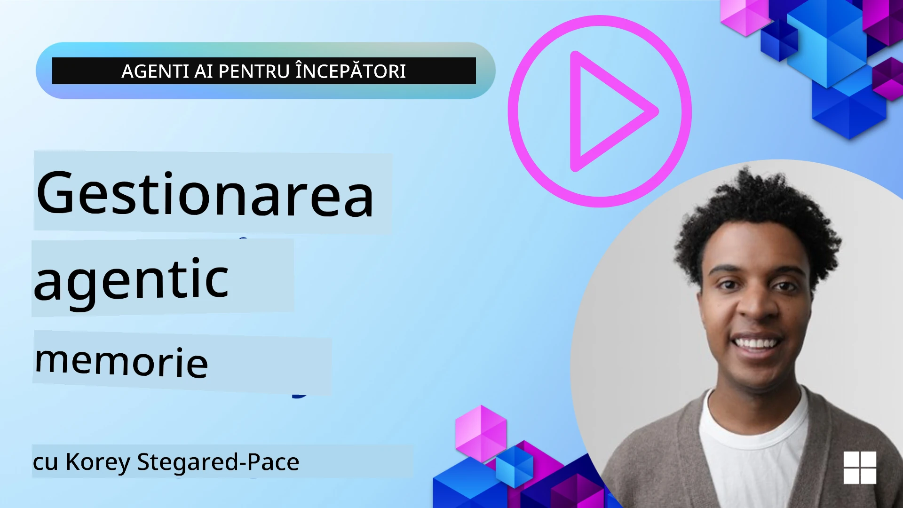

# Memorie pentru Agenții AI 

Când discutăm despre beneficiile unice ale creării Agenților AI, două aspecte sunt principale: capacitatea de a apela unelte pentru a îndeplini sarcini și capacitatea de a se îmbunătăți în timp. Memoria stă la baza creării unui agent care se poate auto-îmbunătăți și poate crea experiențe mai bune pentru utilizatorii noștri.

În această lecție, vom analiza ce este memoria pentru Agenții AI și cum o putem gestiona și folosi în beneficiul aplicațiilor noastre.

## Introducere

Această lecție va acoperi:

• **Înțelegerea Memoriei Agenților AI**: Ce este memoria și de ce este esențială pentru agenți.

• **Implementarea și Stocarea Memoriei**: Metode practice pentru adăugarea capacităților de memorie agenților AI, concentrându-ne pe memoria pe termen scurt și pe termen lung.

• **Cum să faci Agenții AI să se auto-îmbunătățească**: Cum memoria permite agenților să învețe din interacțiuni anterioare și să se îmbunătățească în timp.

## Implementări Disponibile

Această lecție include două tutoriale cu notebook-uri cuprinzătoare:

• **[13-agent-memory.ipynb](./13-agent-memory.ipynb)**: Implementează memoria folosind Mem0 și Azure AI Search cu Microsoft Agent Framework

• **[13-agent-memory-cognee.ipynb](./13-agent-memory-cognee.ipynb)**: Implementează memoria structurată folosind Cognee, construind automat un grafic de cunoștințe susținut de embeddings, vizualizând graficul și oferind recuperare inteligentă

## Obiectivele Învățării

După finalizarea acestei lecții, vei ști cum să:

• **Diferențiezi între diverse tipuri de memorie ale agentului AI**, inclusiv memoria de lucru, pe termen scurt și lung, precum și forme specializate precum memoria de persona și episodică.

• **Implementați și gestionați memoria pe termen scurt și lung pentru agenții AI** folosind Microsoft Agent Framework, valorificând unelte precum Mem0, Cognee, memoria Whiteboard și integrând cu Azure AI Search.

• **Înțelegeți principiile din spatele agenților AI care se auto-îmbunătățesc** și cum sistemele robuste de gestionare a memoriei contribuie la învățarea și adaptarea continuă.

## Înțelegerea Memoriei Agenților AI

În esență, **memoria pentru agenții AI se referă la mecanismele care le permit să rețină și să-și amintească informații**. Această informație poate fi detalii specifice despre o conversație, preferințele utilizatorului, acțiuni anterioare sau chiar pattern-uri învățate.

Fără memorie, aplicațiile AI sunt adesea fără stare, ceea ce înseamnă că fiecare interacțiune începe de la zero. Aceasta duce la o experiență repetitivă și frustrantă în care agentul "uită" contextul sau preferințele anterioare.

### De ce este importantă memoria?

Inteligența unui agent este profund legată de abilitatea sa de a-și aminti și utiliza informațiile din trecut. Memoria permite agenților să fie:

• **Reflectivi**: Învață din acțiunile și rezultatele anterioare.

• **Interactivi**: Mențin contextul pe durata unei conversații continue.

• **Proactivi și Reacționari**: Anticipează nevoile sau răspund corespunzător bazat pe date istorice.

• **Autonomi**: Funcționează mai independent bazându-se pe cunoștințele stocate.

Scopul implementării memoriei este de a face agenții mai **de încredere și capabili**.

### Tipuri de memorie

#### Memorie de Lucru

Gândește-te la aceasta ca la o foaie de hârtie pe care un agent o folosește în timpul unei singure sarcini sau procese de gândire. Ea reține informația imediată necesară pentru a calcula următorul pas.

Pentru agenții AI, memoria de lucru capturează adesea cele mai relevante informații dintr-o conversație, chiar dacă istoricul complet al conversației este lung sau trunchiat. Se concentrează pe extragerea elementelor cheie precum cerințe, propuneri, decizii și acțiuni.

**Exemplu Memorie de Lucru**

La un agent de rezervări de călătorie, memoria de lucru ar putea reține cererea curentă a utilizatorului, cum ar fi „Vreau să rezerv o excursie la Paris”. Această cerință specifică este păstrată în contextul imediat al agentului pentru a ghida interacțiunea actuală.

#### Memorie pe Termen Scurt

Acest tip de memorie reține informațiile pe durata unei singure conversații sau sesiuni. Este contextul conversației curente, permițând agentului să se refere la runde anterioare din dialog.

În mostrele SDK Python din [Microsoft Agent Framework](https://github.com/microsoft/agent-framework), aceasta corespunde cu `AgentSession`, creat cu `agent.create_session()`. Sesiunea este memoria pe termen scurt integrată în framework: păstrează contextul conversației disponibil cât timp sesiunea este reutilizată, dar contextul nu este păstrat când sesiunea se încheie sau aplicația se repornește. Folosește memoria pe termen lung pentru fapte și preferințe care trebuie să supraviețuiască peste sesiuni, de obicei printr-o bază de date, index vectorial sau alt magazin persistent.

**Exemplu Memorie pe Termen Scurt**

Dacă un utilizator întreabă „Cât costă un zbor spre Paris?” și apoi continuă cu „Dar cazarea acolo?”, memoria pe termen scurt asigură că agentul știe că „acolo” se referă la „Paris” în cadrul aceleiași conversații.

#### Memorie pe Termen Lung

Aceasta este informația care persistă peste mai multe conversații sau sesiuni. Permite agenților să-și amintească preferințele utilizatorilor, interacțiunile istorice sau cunoștințe generale pe perioade extinse. Acest lucru este important pentru personalizare.

**Exemplu Memorie pe Termen Lung**

O memorie pe termen lung ar putea stoca că „Ben apreciază schiatul și activitățile în aer liber, îi place cafeaua cu vedere la munte și dorește să evite pârtiile avansate din cauza unei leziuni anterioare”. Această informație, învățată din interacțiunile precedente, influențează recomandările în sesiunile viitoare de planificare a călătoriilor, făcându-le foarte personalizate.

#### Memorie de Persona

Acest tip specializat de memorie ajută agentul să dezvolte o „personalitate” sau „persona” consistentă. Permite agentului să rețină detalii despre sine sau rolul intenționat, făcând interacțiunile mai fluide și concentrate.

**Exemplu Memorie de Persona**
Dacă agentul de călătorii este conceput să fie un „expert în planificarea schiatului”, memoria de persona ar putea întări acest rol, influențând răspunsurile să se alinieze tonului și cunoștințelor unui expert.

#### Memorie de Flux de Lucru/Episodică

Această memorie stochează secvența de pași pe care agentul îi face în timpul unei sarcini complexe, incluzând succesele și eșecurile. Este ca și cum ar aminti „episoade” specifice sau experiențe trecute pentru a învăța din ele.

**Exemplu Memorie Episodică**

Dacă agentul a încercat să rezerve un zbor specific, dar a eșuat din cauza indisponibilității, memoria episodică ar putea înregistra acest eșec, permițând agentului să încerce zboruri alternative sau să informeze utilizatorul despre problemă într-un mod mai bine informat în tentativa următoare.

#### Memorie de Entități

Aceasta implică extragerea și memorarea unor entități specifice (precum persoane, locuri sau lucruri) și evenimente din conversații. Permite agentului să construiască o înțelegere structurată a elementelor cheie discutate.

**Exemplu Memorie de Entități**

Dintr-o conversație despre o excursie trecută, agentul ar putea extrage „Paris”, „Turnul Eiffel” și „cina la restaurantul Le Chat Noir” ca entități. Într-o interacțiune viitoare, agentul ar putea aminti „Le Chat Noir” și ar putea oferi să facă o nouă rezervare acolo.

#### RAG Structurat (Generare Îmbunătățită prin Recuperare)

Deși RAG este o tehnică mai largă, „RAG Structurat” este evidențiat ca o tehnologie puternică de memorare. Extrage informații dense și structurate din diverse surse (conversații, emailuri, imagini) și le folosește pentru a îmbunătăți precizia, acoperirea și viteza răspunsurilor. Spre deosebire de RAG clasic bazat exclusiv pe similaritate semantică, RAG Structurat funcționează cu structura inerentă a informației.

**Exemplu RAG Structurat**

În loc să potrivească doar cuvinte cheie, RAG Structurat ar putea analiza detaliile zborului (destinație, dată, oră, companie aeriană) dintr-un email și le stoca într-un mod structurat. Acest lucru permite interogări precise de genul „Ce zbor am rezervat spre Paris marți?”

## Implementarea și Stocarea Memoriei

Implementarea memoriei pentru agenții AI implică un proces sistematic de **gestionare a memoriei**, ce include generarea, stocarea, recuperarea, integrarea, actualizarea și chiar „uitarea” (sau ștergerea) informațiilor. Recuperarea este o parte deosebit de crucială.

### Unelte Specializate pentru Memorie

#### Mem0

O modalitate de a stoca și gestiona memoria agentului este folosirea uneltelor specializate precum Mem0. Mem0 funcționează ca un strat persistent de memorie, permițând agenților să-și amintească interacțiunile relevante, să stocheze preferințele utilizatorilor și contextul factual și să învețe din succese și eșecuri în timp. Ideea este că agenții fără stare devin agenți cu stare.

Funcționează printr-un **proces de memorie în două faze: extragere și actualizare**. Mai întâi, mesajele adăugate în firul agentului sunt trimise serviciului Mem0, care folosește un Model de Limbaj Mare (LLM) pentru a rezuma istoricul conversației și a extrage noi memorii. Ulterior, o fază de actualizare condusă de LLM decide dacă să adauge, modifice sau șteargă aceste memorii, stocându-le într-un magazin de date hibrid care poate include baze de date vectoriale, grafice și cheie-valoare. Acest sistem suportă diverse tipuri de memorie și poate incorpora memoria graf pentru gestionarea relațiilor între entități.

#### Cognee

O altă abordare puternică este folosirea **Cognee**, o memorie semantică open-source pentru agenții AI care transformă datele structurate și nestructurate în grafice de cunoștințe interogabile susținute de embeddings. Cognee oferă o **arhitectură dual-store** care combină căutarea based on similaritate vectorială cu relațiile grafice, permițând agenților să înțeleagă nu doar ce informație este similară, ci și cum conceptele se relaționează între ele.

Excelează la **recuperarea hibridă** care combină similaritatea vectorială, structura graficului și raționamentul LLM - de la căutarea brută de segmente la răspunsul la întrebări conștient de graf. Sistemul menține o **memorie vie** care evoluează și crește în timp ce rămâne interogabilă ca un singur graf conectat, suportând atât contextul de sesiune pe termen scurt cât și memoria persistentă pe termen lung.

Tutorialul din notebook-ul Cognee ([13-agent-memory-cognee.ipynb](./13-agent-memory-cognee.ipynb)) demonstrează construirea acestui strat unificat de memorie, cu exemple practice de ingestie a surselor diverse de date, vizualizarea graficului de cunoștințe și interogări cu diferite strategii de căutare adaptate nevoilor specifice ale agentului.

### Stocarea Memoriei cu RAG

Dincolo de uneltele specializate de memorie precum Mem0, poți folosi servicii robuste de căutare precum **Azure AI Search ca backend pentru stocarea și recuperarea memoriilor**, în special pentru RAG structurat.

Acesta îți permite să fundamentezi răspunsurile agentului tău cu propriile date, asigurând răspunsuri mai relevante și precise. Azure AI Search poate fi folosit pentru a stoca amintiri de călătorie specifice utilizatorului, cataloage de produse sau orice altă cunoaștere specifică domeniului.

Azure AI Search susține capabilități precum **RAG Structurat**, care excelează în extragerea și recuperarea informațiilor dense și structurate din seturi mari de date precum istoricul conversațiilor, emailuri sau chiar imagini. Acest lucru oferă „precizie și acoperire supra-umană” comparativ cu abordările tradiționale de segmentare a textului și embeddings.

## Cum să faci Agenții AI să se Auto-Îmbunătățească

Un tipar comun pentru agenții care se auto-îmbunătățesc implică introducerea unui **„agent de cunoaștere”**. Acest agent separat observă conversația principală dintre utilizator și agentul principal. Rolul său este să:

1. **Identifice informațiile valoroase**: Să determine dacă vreo parte a conversației merită salvată ca cunoaștere generală sau preferință specifică a utilizatorului.

2. **Extragă și rezume**: Să distileze învățătura esențială sau preferința din conversație.

3. **Stocheze într-o bază de cunoștințe**: Să persiste această informație extrasă, adesea într-o bază de date vectorială, pentru a fi recuperată ulterior.

4. **Îmbunătățească interogările viitoare**: Când utilizatorul inițiază o interogare nouă, agentul de cunoaștere recuperează informațiile stocate relevante și le adaugă la promptul utilizatorului, oferind un context crucial agentului principal (asemănător cu RAG).

### Optimizări pentru Memorie

• **Gestionarea latenței**: Pentru a evita încetinirea interacțiunilor cu utilizatorul, un model mai ieftin și mai rapid poate fi folosit inițial pentru a verifica rapid dacă informația merită stocată sau recuperată, invocând procesul complex de extragere/recuperare doar când este necesar.

• **Întreținerea bazei de cunoștințe**: Pentru o bază de cunoștințe în creștere, informațiile folosite mai rar pot fi mutate în „stocare rece” pentru managementul costurilor.

## Ai mai multe întrebări despre memoria agentului?

Alătură-te [Microsoft Foundry Discord](https://discord.com/invite/ATgtXmAS5D) pentru a întâlni alți cursanți, a participa la office hours și a primi răspunsuri la întrebările tale despre Agenții AI.

---

<!-- CO-OP TRANSLATOR DISCLAIMER START -->
**Declinare a responsabilității**:
Acest document a fost tradus folosind serviciul de traducere AI [Co-op Translator](https://github.com/Azure/co-op-translator). În timp ce ne străduim pentru acuratețe, vă rugăm să rețineți că traducerile automate pot conține erori sau inexactități. Documentul original în limba sa nativă trebuie considerat sursa autorizată. Pentru informații critice, se recomandă traducerea profesională realizată de un om. Nu ne asumăm responsabilitatea pentru eventualele neînțelegeri sau interpretări greșite care decurg din utilizarea acestei traduceri.
<!-- CO-OP TRANSLATOR DISCLAIMER END -->