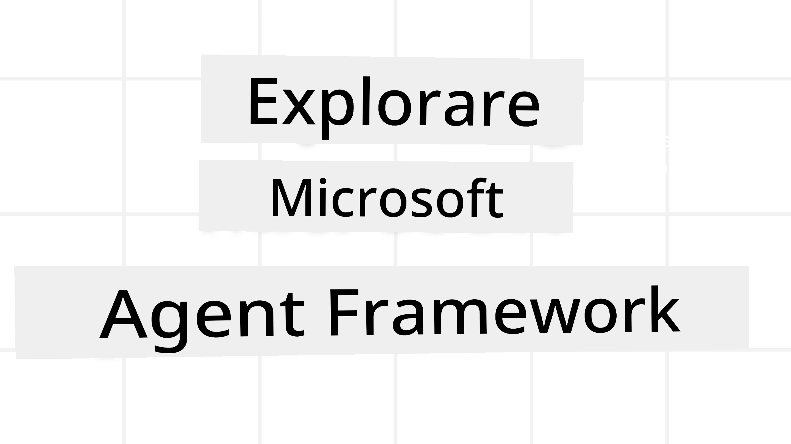

# Explorarea Microsoft Agent Framework



### Introducere

Această lecție va acoperi:

- Înțelegerea Microsoft Agent Framework: caracteristici cheie și valoare  
- Explorarea conceptelor cheie ale Microsoft Agent Framework
- Modele avansate MAF: fluxuri de lucru, middleware și memorie

## Obiective de învățare

După parcurgerea acestei lecții, veți ști cum să:

- Construiți agenți AI pregătiți pentru producție folosind Microsoft Agent Framework
- Aplicați funcționalitățile de bază ale Microsoft Agent Framework la cazurile de utilizare agentice
- Utilizați modele avansate, inclusiv fluxuri de lucru, middleware și observabilitate

## Exemple de cod 

Code samples for [Microsoft Agent Framework (MAF)](https://aka.ms/ai-agents-beginners/agent-framewrok) can be found in this repository under `xx-python-agent-framework` and `xx-dotnet-agent-framework` files.

## Înțelegerea Microsoft Agent Framework


[Microsoft Agent Framework (MAF)](https://aka.ms/ai-agents-beginners/agent-framewrok) este cadrul unificat al Microsoft pentru construirea de agenți AI. Oferă flexibilitatea de a aborda o gamă largă de cazuri de utilizare agentice întâlnite atât în producție, cât și în mediile de cercetare, inclusiv:

- **Orchestrare secvențială a agenților** în scenarii în care sunt necesare fluxuri de lucru pas cu pas.
- **Orchestrare concurrentă** în scenarii în care agenții trebuie să îndeplinească sarcini în același timp.
- **Orchestrare în chat de grup** în scenarii în care agenții pot colabora împreună la o sarcină.
- **Orchestrare a predării sarcinilor** în scenarii în care agenții își predau sarcina unul altuia pe măsură ce subtasks sunt finalizate.
- **Orchestrare magnetică** în scenarii în care un agent manager creează și modifică o listă de sarcini și gestionează coordonarea subagenților pentru a finaliza sarcina.

Pentru a livra agenți AI în producție, MAF include, de asemenea, funcționalități pentru:

- **Observabilitate** prin utilizarea OpenTelemetry, unde fiecare acțiune a agentului AI, inclusiv invocarea instrumentelor, pașii de orchestrare, fluxurile de raționament și monitorizarea performanței prin tablouri de bord Microsoft Foundry.
- **Securitate** prin găzduirea agenților nativ pe Microsoft Foundry, care include controale de securitate precum acces bazat pe rol, gestionarea datelor private și siguranță a conținutului integrată.
- **Durabilitate** deoarece firele și fluxurile de lucru ale agenților pot fi puse în pauză, reluate și recuperate după erori, ceea ce permite procese cu durată mai lungă.
- **Control** deoarece sunt acceptate fluxuri de lucru cu intervenție umană, în care sarcinile sunt marcate ca necesitând aprobarea umană.

Microsoft Agent Framework se concentrează, de asemenea, pe interoperabilitate prin:

- **Fiind agnostic față de cloud** - Agenții pot rula în containere, on-prem și pe mai multe clouduri diferite.
- **Fiind agnostic față de furnizor** - Agenții pot fi creați prin SDK-ul preferat, inclusiv Azure OpenAI și OpenAI
- **Integrarea standardelor deschise** - Agenții pot utiliza protocoale precum Agent-to-Agent(A2A) și Model Context Protocol (MCP) pentru a descoperi și folosi alți agenți și instrumente.
- **Pluginuri și conectori** - Se pot realiza conexiuni la servicii de date și memorie precum Microsoft Fabric, SharePoint, Pinecone și Qdrant.

Să vedem cum sunt aplicate aceste funcționalități unor dintre conceptele de bază ale Microsoft Agent Framework.

## Concepte cheie ale Microsoft Agent Framework

### Agenți


**Crearea agenților**

Crearea agenților se realizează prin definirea serviciului de inferență (LLM Provider), a unui set de instrucțiuni pe care agentul AI trebuie să le urmeze și a unui `name` atribuit:

```python
agent = AzureOpenAIChatClient(credential=AzureCliCredential()).create_agent( instructions="You are good at recommending trips to customers based on their preferences.", name="TripRecommender" )
```

Exemplul de mai sus folosește `Azure OpenAI`, dar agenții pot fi creați folosind o varietate de servicii, inclusiv `Microsoft Foundry Agent Service`:

```python
AzureAIAgentClient(async_credential=credential).create_agent( name="HelperAgent", instructions="You are a helpful assistant." ) as agent
```

OpenAI `Responses`, `ChatCompletion` APIs

```python
agent = OpenAIResponsesClient().create_agent( name="WeatherBot", instructions="You are a helpful weather assistant.", )
```

```python
agent = OpenAIChatClient().create_agent( name="HelpfulAssistant", instructions="You are a helpful assistant.", )
```

sau agenți la distanță folosind protocolul A2A:

```python
agent = A2AAgent( name=agent_card.name, description=agent_card.description, agent_card=agent_card, url="https://your-a2a-agent-host" )
```

**Rularea agenților**

Agenții sunt rulați folosind metodele `.run` sau `.run_stream` pentru răspunsuri non-streaming sau streaming.

```python
result = await agent.run("What are good places to visit in Amsterdam?")
print(result.text)
```

```python
async for update in agent.run_stream("What are the good places to visit in Amsterdam?"):
    if update.text:
        print(update.text, end="", flush=True)

```

Fiecare rulare a agentului poate avea, de asemenea, opțiuni pentru a personaliza parametri precum `max_tokens` folosiți de agent, `tools` pe care agentul le poate apela și chiar `model` folosit pentru agent.

Acest lucru este util în cazurile în care sunt necesare modele sau instrumente specifice pentru îndeplinirea unei sarcini a utilizatorului.

**Instrumente**

Instrumentele pot fi definite atât la definirea agentului:

```python
def get_attractions( location: Annotated[str, Field(description="The location to get the top tourist attractions for")], ) -> str: """Get the top tourist attractions for a given location.""" return f"The top attractions for {location} are." 


# Când creați un ChatAgent direct

agent = ChatAgent( chat_client=OpenAIChatClient(), instructions="You are a helpful assistant", tools=[get_attractions]

```

cât și la rularea agentului:

```python

result1 = await agent.run( "What's the best place to visit in Seattle?", tools=[get_attractions] # Unealtă furnizată doar pentru această rulare )
```

**Fire ale agentului**

Firele agentului sunt folosite pentru a gestiona conversații cu mai multe ture. Firele pot fi create fie prin:

- Folosind `get_new_thread()` care permite salvarea firului în timp
- Crearea automată a unui fir la rularea unui agent, fir care va dura doar pe durata rulării curente.

Pentru a crea un fir, codul arată astfel:

```python
# Creează un fir nou.
thread = agent.get_new_thread() # Rulează agentul folosind firul.
response = await agent.run("Hello, I am here to help you book travel. Where would you like to go?", thread=thread)

```

Puteți apoi serializa firul pentru a fi stocat pentru utilizare ulterioară:

```python
# Creați un nou fir de execuție.
thread = agent.get_new_thread() 

# Rulați agentul cu firul de execuție.

response = await agent.run("Hello, how are you?", thread=thread) 

# Serializați firul pentru stocare.

serialized_thread = await thread.serialize() 

# Deserializați starea firului după încărcarea din stocare.

resumed_thread = await agent.deserialize_thread(serialized_thread)
```

**Middleware-ul agentului**

Agenții interacționează cu instrumente și LLM-uri pentru a îndeplini sarcinile utilizatorilor. În anumite scenarii, dorim să executăm sau să urmărim aceste interacțiuni. Middleware-ul agentului ne permite să facem acest lucru prin:

*Middleware pentru funcții*

Acest middleware ne permite să executăm o acțiune între agent și o funcție/instrument pe care o va apela. Un exemplu de utilizare ar fi atunci când doriți să înregistrați apelul funcției (logging).

În codul de mai jos, `next` definește dacă ar trebui apelat următorul middleware sau funcția efectivă.

```python
async def logging_function_middleware(
    context: FunctionInvocationContext,
    next: Callable[[FunctionInvocationContext], Awaitable[None]],
) -> None:
    """Function middleware that logs function execution."""
    # Pre-procesare: Înregistrează în jurnal înainte de executarea funcției
    print(f"[Function] Calling {context.function.name}")

    # Continuă la următorul middleware sau la executarea funcției
    await next(context)

    # Post-procesare: Înregistrează în jurnal după executarea funcției
    print(f"[Function] {context.function.name} completed")
```

*Middleware pentru chat*

Acest middleware ne permite să executăm sau să înregistrăm o acțiune între agent și cererile către LLM.

Aceasta conține informații importante, cum ar fi `messages` care sunt trimise către serviciul AI.

```python
async def logging_chat_middleware(
    context: ChatContext,
    next: Callable[[ChatContext], Awaitable[None]],
) -> None:
    """Chat middleware that logs AI interactions."""
    # Preprocesare: Jurnalizează înainte de apelul către IA
    print(f"[Chat] Sending {len(context.messages)} messages to AI")

    # Continuă către următorul middleware sau serviciu IA
    await next(context)

    # Postprocesare: Jurnalizează după răspunsul IA
    print("[Chat] AI response received")

```

**Memoria agentului**

Așa cum s-a acoperit în lecția `Agentic Memory`, memoria este un element important pentru a permite agentului să funcționeze în contexte diferite. MAF oferă mai multe tipuri de memorii:

*Stocare în memorie*

Aceasta este memoria stocată în fire pe durata execuției aplicației.

```python
# Creează un fir nou.
thread = agent.get_new_thread() # Rulează agentul cu firul.
response = await agent.run("Hello, I am here to help you book travel. Where would you like to go?", thread=thread)
```

*Mesaje persistente*

Această memorie este folosită pentru stocarea istoricului conversațiilor între diferite sesiuni. Este definită folosind `chat_message_store_factory` :

```python
from agent_framework import ChatMessageStore

# Creează un magazin de mesaje personalizat
def create_message_store():
    return ChatMessageStore()

agent = ChatAgent(
    chat_client=OpenAIChatClient(),
    instructions="You are a Travel assistant.",
    chat_message_store_factory=create_message_store
)

```

*Memorie dinamică*

Această memorie este adăugată la context înainte ca agenții să fie rulați. Aceste memorii pot fi stocate în servicii externe precum mem0:

```python
from agent_framework.mem0 import Mem0Provider

# Folosirea Mem0 pentru capabilități avansate de memorie
memory_provider = Mem0Provider(
    api_key="your-mem0-api-key",
    user_id="user_123",
    application_id="my_app"
)

agent = ChatAgent(
    chat_client=OpenAIChatClient(),
    instructions="You are a helpful assistant with memory.",
    context_providers=memory_provider
)

```

**Observabilitatea agentului**

Observabilitatea este importantă pentru construirea unor sisteme agentice fiabile și ușor de întreținut. MAF se integrează cu OpenTelemetry pentru a furniza trasare (tracing) și contoare (meters) pentru o observabilitate mai bună.

```python
from agent_framework.observability import get_tracer, get_meter

tracer = get_tracer()
meter = get_meter()
with tracer.start_as_current_span("my_custom_span"):
    # fă ceva
    pass
counter = meter.create_counter("my_custom_counter")
counter.add(1, {"key": "value"})
```

### Fluxuri de lucru

MAF oferă fluxuri de lucru care sunt pași predefiniți pentru a îndeplini o sarcină și includ agenți AI ca componente în acei pași.

Fluxurile de lucru sunt compuse din diferite componente care permit un flux de control mai bun. Fluxurile de lucru permit, de asemenea, **orchestrare multi-agent** și **checkpointing** pentru a salva stările fluxului de lucru.

Componentele de bază ale unui flux de lucru sunt:

**Executori**

Executorii primesc mesaje de intrare, își execută sarcinile atribuite și apoi generează un mesaj de ieșire. Acest lucru împinge fluxul de lucru înainte către finalizarea sarcinii mai mari. Executorii pot fi fie agenți AI, fie logică personalizată.

**Muchii**

Muchiile sunt folosite pentru a defini fluxul mesajelor într-un flux de lucru. Acestea pot fi:

*Muchii directe* - conexiuni simple unu-la-unu între executori:

```python
from agent_framework import WorkflowBuilder

builder = WorkflowBuilder()
builder.add_edge(source_executor, target_executor)
builder.set_start_executor(source_executor)
workflow = builder.build()
```

*Muchii condiționate* - activate după ce o anumită condiție este îndeplinită. De exemplu, când camerele la hotel nu sunt disponibile, un executor poate sugera alte opțiuni.

*Muchii tip switch-case* - direcționează mesajele către diferiți executori pe baza condițiilor definite. De exemplu, dacă un client de travel are acces prioritar și sarcinile lor vor fi gestionate printr-un alt flux de lucru.

*Muchii de tip fan-out* - trimit un mesaj către multiple ținte.

*Muchii de tip fan-in* - colectează multiple mesaje de la diferiți executori și le trimit către o singură țintă.

**Evenimente**

Pentru a oferi o observabilitate mai bună asupra fluxurilor de lucru, MAF oferă evenimente încorporate pentru execuție, inclusiv:

- `WorkflowStartedEvent`  - Execuția fluxului de lucru începe
- `WorkflowOutputEvent` - Fluxul de lucru produce un rezultat
- `WorkflowErrorEvent` - Fluxul de lucru întâmpină o eroare
- `ExecutorInvokeEvent`  - Executorul începe procesarea
- `ExecutorCompleteEvent`  -  Executorul termină procesarea
- `RequestInfoEvent` - Se emite o cerere

## Modele MAF avansate

Secțiunile de mai sus acoperă conceptele cheie ale Microsoft Agent Framework. Pe măsură ce construiți agenți mai complecși, iată câteva modele avansate de luat în considerare:

- **Compoziția middleware**: legați mai mulți handleri de middleware (logging, auth, rate-limiting) folosind middleware pentru funcții și chat pentru un control detaliat al comportamentului agentului.
- **Checkpointing pentru fluxuri de lucru**: utilizați evenimentele fluxului de lucru și serializarea pentru a salva și relua procese ale agenților de durată lungă.
- **Selectarea dinamică a instrumentelor**: combinați RAG peste descrierile instrumentelor cu înregistrarea instrumentelor din MAF pentru a prezenta doar instrumentele relevante pentru fiecare interogare.
- **Predare multi-agent**: folosiți muchiile fluxului de lucru și rutare condiționată pentru a orchestra predările între agenți specializați.

## Exemple de cod 

Exemplele de cod pentru Microsoft Agent Framework pot fi găsite în acest depozit sub fișierele `xx-python-agent-framework` și `xx-dotnet-agent-framework`.

## Aveți mai multe întrebări despre Microsoft Agent Framework?

Alăturați-vă [Microsoft Foundry Discord](https://aka.ms/ai-agents/discord) pentru a întâlni alți cursanți, a participa la ore de consultanță și a primi răspunsuri la întrebările despre agenții AI.

---

<!-- CO-OP TRANSLATOR DISCLAIMER START -->
Declinare de responsabilitate:
Acest document a fost tradus folosind serviciul de traducere asistată de inteligență artificială [Co-op Translator](https://github.com/Azure/co-op-translator). Deși ne străduim pentru acuratețe, vă rugăm să rețineți că traducerile automate pot conține erori sau inexactități. Documentul original, în limba sa nativă, trebuie considerat sursa autorizată. Pentru informații critice, se recomandă o traducere profesională realizată de un traducător uman. Nu suntem răspunzători pentru eventualele neînțelegeri sau interpretări greșite care pot rezulta din utilizarea acestei traduceri.
<!-- CO-OP TRANSLATOR DISCLAIMER END -->