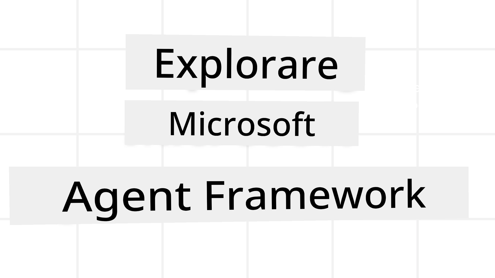
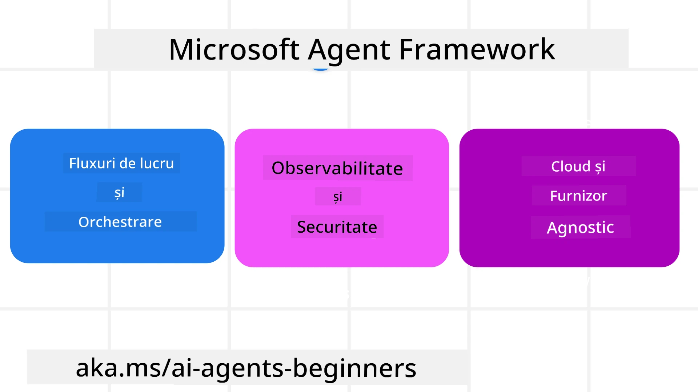
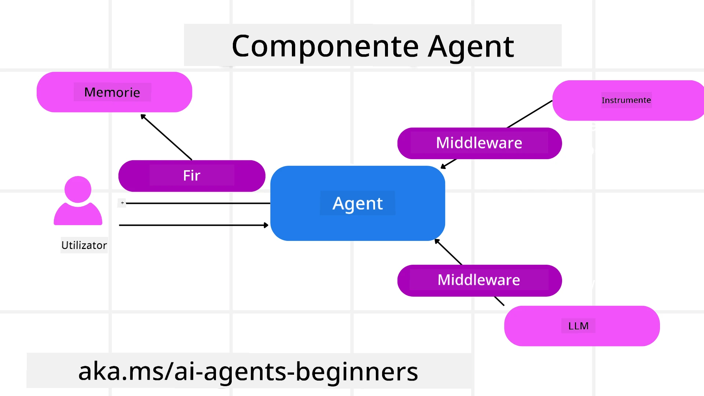

# Explorarea Microsoft Agent Framework



### Introducere

Această lecție va acoperi:

- Înțelegerea Microsoft Agent Framework: caracteristici cheie și valoare  
- Explorarea conceptelor cheie ale Microsoft Agent Framework
- Modele avansate MAF: fluxuri de lucru, middleware și memorie

## Obiectivele de învățare

După finalizarea acestei lecții, vei ști cum să:

- Construiești agenți AI gata pentru producție folosind Microsoft Agent Framework
- Aplici caracteristicile de bază ale Microsoft Agent Framework la cazurile tale de utilizare agentică
- Utilizezi modele avansate inclusiv fluxuri de lucru, middleware și observabilitate

## Exemple de cod 

Exemplele de cod pentru [Microsoft Agent Framework (MAF)](https://learn.microsoft.com/en-us/agent-framework/overview/?wt.mc_id=youtube_26688_organicsocial_reactor&pivots=programming-language-python) pot fi găsite în acest depozit în fișierele `xx-python-agent-framework` și `xx-dotnet-agent-framework`.

## Înțelegerea Microsoft Agent Framework



[Microsoft Agent Framework (MAF)](https://learn.microsoft.com/en-us/agent-framework/overview/?wt.mc_id=youtube_26688_organicsocial_reactor&pivots=programming-language-python) este cadrul unificat al Microsoft pentru construirea agenților AI. Oferă flexibilitatea de a aborda o varietate largă de cazuri de utilizare agentică văzute atât în medii de producție cât și în cercetare, inclusiv:

- **Orchestrare secvențială a agenților** în scenarii unde sunt necesare fluxuri de lucru pas cu pas.
- **Orchestrare concurentă** în scenarii în care agenții trebuie să finalizeze sarcini în același timp.
- **Orchestrare de chat în grup** în scenarii unde agenții pot colabora împreună la o singură sarcină.
- **Orchestrare Hand-off** în scenarii unde agenții predau sarcina unul altuia pe măsură ce sub-sarcinile sunt finalizate.
- **Orchestrare magnetică** în scenarii în care un agent manager creează și modifică o listă de sarcini și gestionează coordonarea subagenților pentru a finaliza sarcina.

Pentru a livra agenți AI în producție, MAF include și funcții pentru:

- **Observabilitate** prin utilizarea OpenTelemetry unde fiecare acțiune a Agentului AI, inclusiv invocarea uneltelor, pașii de orchestrare, fluxurile de raționament și monitorizarea performanței prin panourile Microsoft Foundry.
- **Securitate** prin găzduirea agenților nativ pe Microsoft Foundry care include controale de securitate precum acces bazat pe roluri, gestionarea datelor private și siguranța integrată a conținutului.
- **Durabilitate** deoarece firele și fluxurile Agentului pot suspenda, relua și recupera din erori, permițând procese de durată mai lungă.
- **Control** deoarece fluxurile de lucru cu actor uman implicat sunt suportate, unde sarcinile sunt marcate ca necesitând aprobare umană.

Microsoft Agent Framework este de asemenea concentrat pe interoperabilitate prin:

- **Faptul că este Cloud-agnostic** - Agenții pot rula în containere, local (on-prem) și pe multiple clouduri diferite.
- **Faptul că este Provider-agnostic** - Agenții pot fi creați prin SDK-ul preferat, inclusiv Azure OpenAI și OpenAI
- **Integrarea standardelor deschise** - Agenții pot utiliza protocoale precum Agent-to-Agent (A2A) și Model Context Protocol (MCP) pentru a descoperi și folosi alți agenți și unelte.
- **Pluginuri și Conectori** - Se pot face conexiuni la servicii de date și memorie precum Microsoft Fabric, SharePoint, Pinecone și Qdrant.

Hai să vedem cum aceste caracteristici se aplică unor concepte de bază ale Microsoft Agent Framework.

## Concepte cheie ale Microsoft Agent Framework

### Agenți



**Crearea Agenților**

Crearea agenților se face prin definirea serviciului de inferență (Furnizor LLM), un
set de instrucțiuni pentru Agentul AI de urmat și un `nume` atribuit:

```python
agent = AzureOpenAIChatClient(credential=AzureCliCredential()).create_agent( instructions="You are good at recommending trips to customers based on their preferences.", name="TripRecommender" )
```

Cea de mai sus folosește `Azure OpenAI` dar agenții pot fi creați folosind o varietate de servicii inclusiv `Microsoft Foundry Agent Service`:

```python
AzureAIAgentClient(async_credential=credential).create_agent( name="HelperAgent", instructions="You are a helpful assistant." ) as agent
```

OpenAI `Responses`, API-uri `ChatCompletion`

```python
agent = OpenAIResponsesClient().create_agent( name="WeatherBot", instructions="You are a helpful weather assistant.", )
```

```python
agent = OpenAIChatClient().create_agent( name="HelpfulAssistant", instructions="You are a helpful assistant.", )
```

sau [MiniMax](https://platform.minimaxi.com/), care oferă un API compatibil OpenAI cu ferestre de context mari (până la 204K token-uri):

```python
agent = OpenAIChatClient(base_url="https://api.minimax.io/v1", api_key=os.environ["MINIMAX_API_KEY"], model_id="MiniMax-M3").create_agent( name="HelpfulAssistant", instructions="You are a helpful assistant.", )
```

sau agenți la distanță folosind protocolul A2A:

```python
agent = A2AAgent( name=agent_card.name, description=agent_card.description, agent_card=agent_card, url="https://your-a2a-agent-host" )
```

**Rularea Agenților**

Agenții se rulează folosind metodele `.run` sau `.run_stream` pentru răspunsuri fără streaming sau streaming.

```python
result = await agent.run("What are good places to visit in Amsterdam?")
print(result.text)
```

```python
async for update in agent.run_stream("What are the good places to visit in Amsterdam?"):
    if update.text:
        print(update.text, end="", flush=True)

```

Fiecare rulare a agentului poate avea și opțiuni pentru personalizarea parametrilor precum `max_tokens` folosiți de agent, `tools` pe care agentul le poate apela și chiar `modelul` folosit pentru agent.

Acest lucru este util în cazurile unde sunt necesare modele sau unelte specifice pentru a finaliza sarcina utilizatorului.

**Unelte**

Uneltele pot fi definite atât la definirea agentului:

```python
def get_attractions( location: Annotated[str, Field(description="The location to get the top tourist attractions for")], ) -> str: """Get the top tourist attractions for a given location.""" return f"The top attractions for {location} are." 


# Când se creează un ChatAgent direct

agent = ChatAgent( chat_client=OpenAIChatClient(), instructions="You are a helpful assistant", tools=[get_attractions]

```

cât și la rularea agentului:

```python

result1 = await agent.run( "What's the best place to visit in Seattle?", tools=[get_attractions] # Instrument furnizat doar pentru această rulare )
```

**Firele Agenților**

Firele Agenților sunt folosite pentru a gestiona conversații cu mai multe schimburi. Firele pot fi create fie prin:

- Folosirea `get_new_thread()` care permite salvarea firului în timp
- Crearea automată a unui fir la rularea agentului care durează doar pentru rularea curentă.

Pentru a crea un fir, codul arată astfel:

```python
# Creează un fir nou.
thread = agent.get_new_thread() # Rulează agentul cu firul.
response = await agent.run("Hello, I am here to help you book travel. Where would you like to go?", thread=thread)

```

Poți apoi serializa firul pentru a fi stocat pentru utilizare ulterioară:

```python
# Creează un fir nou.
thread = agent.get_new_thread() 

# Rulează agentul cu firul.

response = await agent.run("Hello, how are you?", thread=thread) 

# Serializează firul pentru stocare.

serialized_thread = await thread.serialize() 

# Deserializează starea firului după încărcarea din stocare.

resumed_thread = await agent.deserialize_thread(serialized_thread)
```

**Middleware pentru Agenți**

Agenții interacționează cu uneltele și LLM-urile pentru a finaliza sarcinile utilizatorilor. În anumite scenarii dorim să executăm sau să urmărim interacțiunile dintre acestea. Middleware-ul pentru agenți ne permite să facem asta prin:

*Middleware pentru funcții*

Acest middleware ne permite să executăm o acțiune între agent și o funcție/uneltă pe care o va apela. Un exemplu când s-ar folosi este când vrei să faci logare asupra apelului funcției.

În codul de mai jos `next` definește dacă middleware-ul următor sau funcția reală trebuie apelată.

```python
async def logging_function_middleware(
    context: FunctionInvocationContext,
    next: Callable[[FunctionInvocationContext], Awaitable[None]],
) -> None:
    """Function middleware that logs function execution."""
    # Pre-procesare: Înregistrare înainte de execuția funcției
    print(f"[Function] Calling {context.function.name}")

    # Continuă la următorul middleware sau execuția funcției
    await next(context)

    # Post-procesare: Înregistrare după execuția funcției
    print(f"[Function] {context.function.name} completed")
```

*Middleware pentru chat*

Acest middleware ne permite să executăm sau să logăm o acțiune între agent și cererile către LLM.

Acesta conține informații importante cum ar fi `mesajele` care sunt trimise serviciului AI.

```python
async def logging_chat_middleware(
    context: ChatContext,
    next: Callable[[ChatContext], Awaitable[None]],
) -> None:
    """Chat middleware that logs AI interactions."""
    # Preprocesare: Înregistrare înainte de apelul AI
    print(f"[Chat] Sending {len(context.messages)} messages to AI")

    # Continuă către următorul middleware sau serviciu AI
    await next(context)

    # Postprocesare: Înregistrare după răspunsul AI
    print("[Chat] AI response received")

```

**Memoria Agentului**

Așa cum a fost acoperit în lecția `Agentic Memory`, memoria este un element important pentru a permite agentului să opereze în contexte diferite. MAF oferă mai multe tipuri de memorie:

*Memorie în memorie* (In-Memory Storage)

Aceasta este memoria stocată în fire pe durata rulării aplicației.

```python
# Creează un fir nou.
thread = agent.get_new_thread() # Rulează agentul cu firul.
response = await agent.run("Hello, I am here to help you book travel. Where would you like to go?", thread=thread)
```

*Mesaje persistente*

Această memorie este utilizată când se stochează istoricul conversațiilor între sesiuni diferite. Este definită folosind `chat_message_store_factory`:

```python
from agent_framework import ChatMessageStore

# Creează un depozit personalizat pentru mesaje
def create_message_store():
    return ChatMessageStore()

agent = ChatAgent(
    chat_client=OpenAIChatClient(),
    instructions="You are a Travel assistant.",
    chat_message_store_factory=create_message_store
)

```

*Memorie dinamică*


Această memorie este adăugată în context înainte ca agenții să fie rulați. Aceste memorii pot fi stocate în servicii externe, cum ar fi mem0:

```python
from agent_framework.mem0 import Mem0Provider

# Folosind Mem0 pentru capabilități avansate de memorie
memory_provider = Mem0Provider(
    api_key="your-mem0-api-key",
    user_id="user_123",
    application_id="my_app"
)

agent = ChatAgent(
    chat_client=OpenAIChatClient(),
    instructions="You are a helpful assistant with memory.",
    context_providers=memory_provider
)

```

**Observabilitatea agentului**

Observabilitatea este importantă pentru construirea unor sisteme agentice fiabile și ușor de întreținut. MAF se integrează cu OpenTelemetry pentru a oferi trasare și contoare pentru o observabilitate mai bună.

```python
from agent_framework.observability import get_tracer, get_meter

tracer = get_tracer()
meter = get_meter()
with tracer.start_as_current_span("my_custom_span"):
    # fă ceva
    pass
counter = meter.create_counter("my_custom_counter")
counter.add(1, {"key": "value"})
```

### Fluxuri de lucru

MAF oferă fluxuri de lucru care sunt pași predefiniți pentru a finaliza o sarcină și includ agenți AI ca componente în acei pași.

Fluxurile de lucru sunt compuse din diferite componente care permit un control mai bun al fluxului. Fluxurile de lucru permit, de asemenea, **orchestrarea multi-agent** și **crearea de puncte de control** pentru salvarea stărilor fluxului de lucru.

Componentele de bază ale unui flux de lucru sunt:

**Executorii**

Executorii primesc mesaje de intrare, îndeplinesc sarcinile atribuite și apoi produc un mesaj de ieșire. Acest lucru avansează fluxul de lucru spre finalizarea sarcinii mai mari. Executorii pot fi fie agenți AI, fie logică personalizată.

**Muchii**

Muchiile sunt folosite pentru a defini fluxul de mesaje într-un flux de lucru. Acestea pot fi:

*Muchii directe* - Conexiuni simple unu-la-unu între executori:

```python
from agent_framework import WorkflowBuilder

builder = WorkflowBuilder()
builder.add_edge(source_executor, target_executor)
builder.set_start_executor(source_executor)
workflow = builder.build()
```

*Muchii condiționale* - Activate după ce o anumită condiție este îndeplinită. De exemplu, când camerele de hotel nu sunt disponibile, un executor poate sugera alte opțiuni.

*Muchii tip switch-case* - Direcționează mesajele către executori diferiți în funcție de condiții definite. De exemplu, dacă un client de călătorie are acces prioritar, sarcinile lor vor fi gestionate printr-un alt flux de lucru.

*Muchii de tip fan-out* - Trimite un mesaj către mai multe ținte.

*Muchii de tip fan-in* - Colectează mai multe mesaje de la diferiți executori și le trimite către o singură țintă.

**Evenimente**

Pentru a oferi o mai bună observabilitate a fluxurilor de lucru, MAF oferă evenimente integrate pentru execuție, inclusiv:

- `WorkflowStartedEvent`  - Execuția fluxului de lucru începe
- `WorkflowOutputEvent` - Fluxul de lucru produce o ieșire
- `WorkflowErrorEvent` - Fluxul de lucru întâmpină o eroare
- `ExecutorInvokeEvent`  - Executorul începe procesarea
- `ExecutorCompleteEvent`  -  Executorul termină procesarea
- `RequestInfoEvent` - O cerere este emisă

## Modele avansate MAF

Secțiunile de mai sus acoperă conceptele cheie ale Microsoft Agent Framework. Pe măsură ce construiți agenți mai complexi, iată câteva modele avansate de luat în considerare:

- **Compoziția middleware-ului**: Înlănțuiți mai mulți handleri middleware (logare, autentificare, limitarea ratei) folosind middleware de funcție și de chat pentru control granular asupra comportamentului agenților.
- **Crearea de puncte de control în fluxul de lucru**: Folosiți evenimentele fluxului de lucru și serializarea pentru a salva și relua procesele agenților de lungă durată.
- **Selecția dinamică a instrumentelor**: Combinați RAG peste descrierile instrumentelor cu înregistrarea instrumentelor de la MAF pentru a prezenta doar instrumentele relevante pentru fiecare interogare.
- **Transferul multi-agent**: Folosiți muchiile fluxului de lucru și rutarea condițională pentru a orchestra preluările între agenți specializați.

## Găzduirea agenților LangChain / LangGraph pe Microsoft Foundry

Microsoft Agent Framework este **interoperabil cu alte framework-uri** — nu sunteți limitați la agenți construiți cu MAF. Dacă aveți deja un agent construit cu **LangChain** sau **LangGraph**, îl puteți rula ca **agent găzduit de Microsoft Foundry**, astfel încât Foundry să gestioneze runtime-ul, sesiunile, scalarea, identitatea și punctele finale ale protocolului pentru dumneavoastră, în timp ce logica agentului rămâne în LangGraph.

Acest lucru se realizează prin pachetul `langchain_azure_ai.agents.hosting`, care expune un grafic LangGraph compilat peste aceleași protocoale folosite de agenții găzduiți de Foundry.

**1. Instalați extra-ul de găzduire:**

```bash
pip install -U "langchain-azure-ai[hosting]>=1.2.4" azure-identity
```

Extra-ul `hosting` instalează bibliotecile de protocol Foundry: `azure-ai-agentserver-responses` (endpoint-ul `/responses` compatibil cu OpenAI) și `azure-ai-agentserver-invocations` (endpoint-ul generic `/invocations`).

**2. Alegeți un protocol de găzduire:**

| Protocol | Clasa găzduitoare | Endpoint | Utilizați când |
|----------|-------------------|----------|--------------|
| **Responses** | `ResponsesHostServer` | `/responses` | Doriți chat compatibil cu OpenAI, streaming, istoric de răspunsuri și structurarea conversației — recomandarea implicită pentru agenți conversaționali. |
| **Invocations** | `InvocationsHostServer` | `/invocations` | Aveți nevoie de un format JSON personalizat, un endpoint de tip webhook sau procesare non-conversațională. |

Deoarece **Responses API este API-ul principal pentru dezvoltarea agenților în Foundry**, începeți cu `ResponsesHostServer` pentru majoritatea agenților.

**3. Configurați variabilele de mediu** (`az login` mai întâi pentru ca `DefaultAzureCredential` să se poată autentifica):

```bash
export FOUNDRY_PROJECT_ENDPOINT="https://<resource>.services.ai.azure.com/api/projects/<project>"
export FOUNDRY_MODEL_NAME="gpt-5-mini"
```

Când agentul va funcționa ulterior ca agent găzduit în Foundry, platforma inserează automat `FOUNDRY_PROJECT_ENDPOINT`.

**4. Expuneți un agent LangGraph prin protocolul Responses:**

```python
import os

from azure.ai.projects import AIProjectClient
from azure.identity import DefaultAzureCredential, get_bearer_token_provider
from langchain.agents import create_agent
from langchain_openai import ChatOpenAI
from langchain_azure_ai.agents.hosting import ResponsesHostServer

_AZURE_AI_SCOPE = "https://ai.azure.com/.default"


def build_chat_model() -> ChatOpenAI:
    project_endpoint = os.environ["FOUNDRY_PROJECT_ENDPOINT"].rstrip("/")
    deployment = os.environ.get("FOUNDRY_MODEL_NAME", "gpt-5-mini")
    credential = DefaultAzureCredential()
    project = AIProjectClient(endpoint=project_endpoint, credential=credential)
    openai_client = project.get_openai_client()
    token_provider = get_bearer_token_provider(credential, _AZURE_AI_SCOPE)

    # ChatOpenAI aici țintește endpoint-ul compatibil OpenAI (Responses) al proiectului Foundry.
    return ChatOpenAI(
        model=deployment,
        base_url=str(openai_client.base_url),
        api_key=token_provider,
    )


def main() -> None:
    graph = create_agent(build_chat_model(), tools=[])
    port = int(os.environ.get("PORT", "8088"))
    ResponsesHostServer(graph).run(port=port)


if __name__ == "__main__":
    main()
```

Rulați-l local cu `python main.py`, apoi trimiteți o cerere Responses la `http://localhost:8088/responses`.

**Comportamente cheie:**

- **Conversații**: Clienții continuă o conversație prin transmiterea `previous_response_id` sau a unui ID de `conversation`. Dacă graficul este compilat cu un checkpointer LangGraph, Foundry leagă starea conversației de punctul de control (folosiți un checkpointer durabil în producție; `MemorySaver` este bine pentru testare locală).
- **Omul în buclă**: Dacă graficul folosește `interrupt()` din LangGraph, `ResponsesHostServer` expune întreruperea în așteptare ca element Responses `function_call` / `mcp_approval_request`, iar clienții reiau cu un răspuns corespondent `function_call_output` / `mcp_approval_response`.
- **Implementați în Foundry**: Folosiți Azure Developer CLI — `azd ext install azure.ai.agents`, `azd ai agent init -m <manifest>`, `azd ai agent run` (local, necesită Docker), apoi `azd provision` și `azd deploy`. Implementarea agentului găzduit necesită rolul **Foundry Project Manager**.

O versiune rulabilă a acestui exemplu este disponibilă în [code-samples/14-langchain-hosted-agent.py](../../../14-microsoft-agent-framework/code-samples/14-langchain-hosted-agent.py). Pentru ghidul complet (protocolul Invocations, scheme personalizate de cereri și depanare), consultați [Host LangGraph agents as Foundry hosted agents](https://learn.microsoft.com/azure/foundry/how-to/develop/langchain-hosted-agents).

## Exemple de cod 

Exemplele de cod pentru Microsoft Agent Framework pot fi găsite în acest depozit în fișierele `xx-python-agent-framework` și `xx-dotnet-agent-framework`.

## Aveți mai multe întrebări despre Microsoft Agent Framework?

Alăturați-vă [Microsoft Foundry Discord](https://discord.com/invite/ATgtXmAS5D) pentru a întâlni alți cursanți, a participa la orele de birou și a primi răspunsuri la întrebările despre AI Agents.
## Lecția precedentă

[Memorie pentru agenții AI](../13-agent-memory/README.md)

## Lecția următoare


[Construirea agenților de utilizare a computerului (CUA)](../15-browser-use/README.md)

---

<!-- CO-OP TRANSLATOR DISCLAIMER START -->
**Declinare a responsabilității**:
Acest document a fost tradus folosind serviciul de traducere AI [Co-op Translator](https://github.com/Azure/co-op-translator). În timp ce ne străduim pentru acuratețe, vă rugăm să rețineți că traducerile automate pot conține erori sau inexactități. Documentul original în limba sa nativă trebuie considerat sursa autorizată. Pentru informații critice, se recomandă traducerea profesională realizată de un om. Nu ne asumăm responsabilitatea pentru eventualele neînțelegeri sau interpretări greșite care decurg din utilizarea acestei traduceri.
<!-- CO-OP TRANSLATOR DISCLAIMER END -->