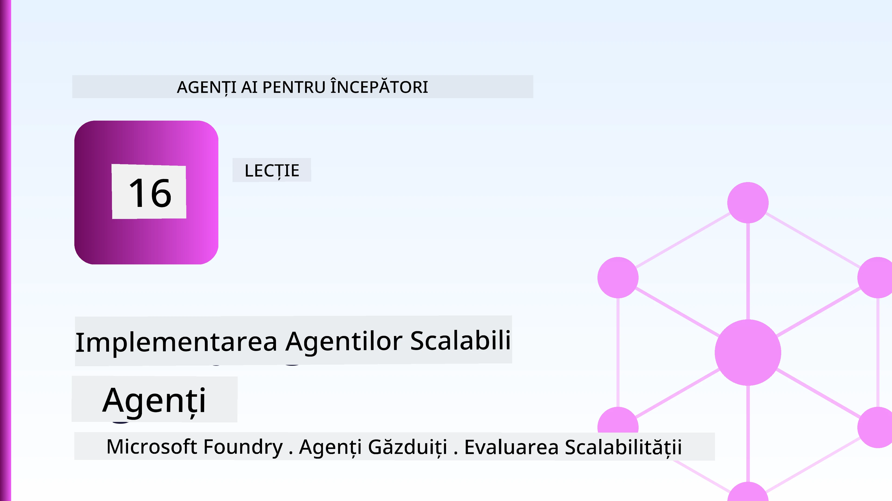
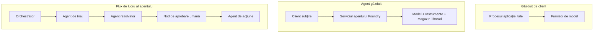
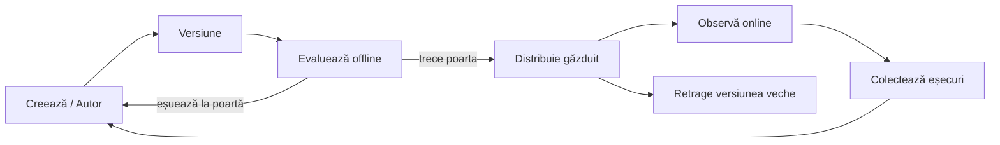
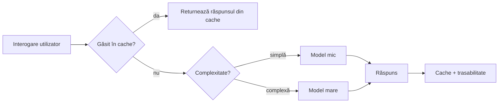
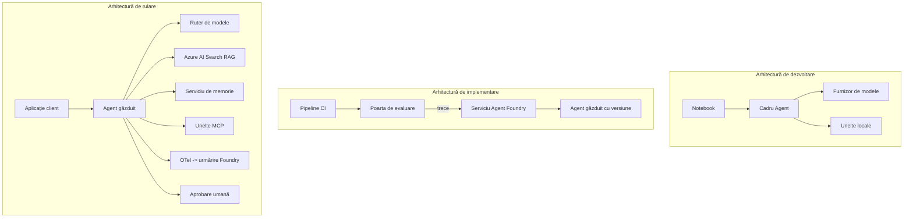

# Implementarea agenților scalabili cu Microsoft Foundry



Până în acest moment al cursului, ai construit agenți care rulează pe laptopul tău, într-un notebook, conduși de `az login` și câteva variabile de mediu. Aceasta este exact modalitatea corectă de a învăța. Nu este modul potrivit de a rula un agent de care mii de clienți depind la ora 3 dimineața.

Această lecție este despre decalajul dintre „funcționează pe mașina mea” și „funcționează fiabil și accesibil în producție.” Îl închidem folosind **Microsoft Foundry** și **Microsoft Foundry Agent Service**, și facem asta construind un agent real de suport pentru clienți care include instrumente, recuperare, memorie, evaluare și monitorizare.

## Introducere

Această lecție va acoperi:

- Diferența dintre un **agent prototip** și un **agent implementat**, și de ce tranziția este în mare parte despre tot ceea ce înconjoară modelul.
- **Modele de implementare** pentru agenți: găzduiți pe client, găzduiți ca serviciu (Hosted Agents) și orchestrate prin fluxuri de lucru.
- **Cycle-ul de viață al agentului** pe Microsoft Foundry — creare, versiune, implementare, evaluare, observare, retragere.
- **Strategii de scalare**: rutare model, caching, concurență și design fără stare.
- **Observabilitate** cu OpenTelemetry și trasarea Foundry.
- **Optimizarea costurilor** prin selecția modelului, rutare și porți de evaluare.
- **Considerații enterprise**: guvernanță, aprobare umană și rularea în siguranță a serverelor MCP în producție.

## Obiective de învățare

După ce vei finaliza această lecție, vei ști cum să:

- Alegi modelul de implementare potrivit pentru un anumit volum de lucru al agentului.
- Implementezi un agent în Microsoft Foundry Agent Service astfel încât să fie versionat, guvernat și observabil.
- Instrumentezi un agent pentru trasare și configurezi un pipeline de evaluare care rulează înainte de fiecare lansare.
- Aplici rutarea modelului și caching pentru a menține latența și costurile sub control la scară.
- Adaugi o poartă de aprobare umană pentru acțiuni cu risc ridicat și integrezi un server MCP în mod sigur pentru producție.

## Precondiții

Această lecție presupune că ai finalizat lecțiile anterioare și ești confortabil cu:

- Construirea agenților cu [Microsoft Agent Framework](../14-microsoft-agent-framework/README.md) (Lecția 14).
- [Utilizarea instrumentelor](../04-tool-use/README.md) (Lecția 4) și [Agentic RAG](../05-agentic-rag/README.md) (Lecția 5).
- [Memoria agentului](../13-agent-memory/README.md) (Lecția 13) și [Protocoale agentice / MCP](../11-agentic-protocols/README.md) (Lecția 11).
- [Observabilitate și evaluare](../10-ai-agents-production/README.md) (Lecția 10) — această lecție se bazează direct pe aceasta.

Vei mai avea nevoie de:

- Un **abonament Azure** și un **proiect Microsoft Foundry** cu cel puțin un model de chat implementat.
- Azure CLI autentificat (`az login`).
- Python 3.12+ și pachetele din depozitul [`requirements.txt`](../../../requirements.txt).

## De la prototip la producție: Ce se schimbă de fapt

Un agent prototip și un agent în producție împart același ciclu principal — raționament, apelare instrumente, răspuns. Schimbă tot ceea ce înconjoară acest ciclu. Modelul este poate 20% dintr-un agent de producție; restul de 80% este scheletul operațional.

| Aspect | Prototip | Producție |
| --- | --- | --- |
| **Găzduire** | Rulează în notebook-ul tău | Rulează ca serviciu găzduit, versionat și distribuit |
| **Identitate** | Tokenul tău `az login` | Identitate gestionată cu RBAC scoped |
| **Stare** | În memorie, pierdută la restart | Externalizată (thread store, serviciu de memorie) |
| **Eșec** | Vezi stack trace-ul | Retentative, fallback-uri, dead-letter, alerte |
| **Cost** | „Câteva cenți” | Urmărit pe cerere, rutat, cache-uit, bugetat |
| **Calitate** | Verifici vizual ieșirea | Evaluat automat înainte de fiecare lansare |
| **Încredere** | Aprobi fiecare acțiune | Politică + om în buclă pentru acțiuni riscante |

Amintește-ți acest tabel. Fiecare secțiune de mai jos se mapează la unul dintre aceste rânduri.

## Modele de implementare a agenților

Există trei modele pe care le vei folosi, adesea în combinație.

### 1. Agenți găzduiți de client

Obiectul agentului trăiește în interiorul procesului aplicației *tale*. Codul tău apelează direct furnizorul modelului; ciclul de raționament rulează în serviciul tău. Aceasta este ceea ce a făcut fiecare lecție anterioară.

- **Folosește-l când** ai nevoie de control complet asupra ciclului, middlewares personalizate, sau încorporezi agentul într-un backend existent.
- **Compromis**: te ocupi singur de scalare, stare și reziliență.

### 2. Agenți găzduiți (Foundry Agent Service)

Agentul este *înregistrat ca resursă* în Microsoft Foundry. Foundry găzduiește ciclul de raționament, stochează firele, aplică siguranța conținutului și RBAC, și face agentul vizibil în portalul Foundry. Aplicația ta devine un client subțire care creează fire și citește răspunsuri.

- **Folosește-l când** dorești durabilitate, observabilitate integrată, guvernanță și o suprafață operațională redusă.
- **Compromis**: mai puțin control detaliat în schimbul unui runtime gestionat.

### 3. Fluxuri de lucru ale agenților

Mai mulți agenți (și instrumente) sunt compuși într-un grafic cu flux de control explicit — pași secvențiali, ramificări, noduri de aprobare umană și puncte de control durabile care pot fi puse pe pauză și reluate. Aceasta este capabilitatea **Fluxurilor de lucru** din Microsoft Agent Framework aplicată la scară de implementare.

- **Folosește-l când** o singură sarcină implică mai mulți agenți specializați sau necesită un pas de aprobare pe parcurs.
- **Compromis**: mai multe componente mobile; necesită observabilitate la nivel de orchestrare.



## Cycle-ul de viață al agentului pe Microsoft Foundry

Implementarea unui agent nu este un `push` unic. Este un ciclu și arată mult ca un ciclu de lansare software pentru că exact asta este.



Ideea cheie, preluată din [Lecția 10](../10-ai-agents-production/README.md): **evaluarea offline este o poartă, nu o idee ulterioară.** O versiune nouă a agentului nu este livrată decât dacă trece pragurile tale de evaluare. Observabilitatea online apoi alimentează eșecurile din lumea reală în setul tău de teste offline. Acesta este întregul ciclu.

## Strategii de scalare

Scalarea unui agent este diferită de scalarea unei API web fără stare, deoarece fiecare cerere poate declanșa multiple apeluri costisitoare către modele și instrumente. Patru tehnici preiau cea mai mare parte a încărcării.

**Gestionarea cererilor fără stare.** Nu păstra stare per-utilizator în memoria procesului tău. Păstrează firele conversației în magazinul de fire Foundry sau într-un serviciu de memorie astfel încât orice instanță să poată gestiona orice cerere. Acesta este ceea ce permite scalarea orizontală — adăugarea de instanțe, fără sesiuni lipicioase.

**Rutare model.** Nu fiecare cerere are nevoie de cel mai capabil (și cel mai costisitor) model. Rutează cererile simple — clasificarea intențiilor, răspunsuri scurte și factuale — către un model mic și rapid, și rezervă modelul mare pentru raționamente autentice. **Model Router** de la Foundry poate face asta pentru tine sau poți implementa tu însuți un clasificator ușor. Vei construi versiunea DIY în laborator.

**Cache pentru răspunsuri.** Multe întrebări de suport sunt aproape duplicate („cum îmi resetez parola?”). Cache-uiește răspunsurile la întrebările comune și servește-le fără a apela deloc modelul. Chiar și o rată modestă de cache hit reduce semnificativ costul și latența.

**Concurență și backpressure.** Furnizorii de modele au limitări de rată. Limitează concurența, folosește retentative cu backoff exponențial și eșuează elegant (un răspuns coadă „lucrăm la asta” bate un 500).



## Observabilitatea în producție

Nu poți opera ceea ce nu poți vedea. Așa cum s-a acoperit în Lecția 10, Microsoft Agent Framework emite în mod nativ trace-uri **OpenTelemetry** — fiecare apel către model, invocare de instrument și pas de orchestrare devine un span. În producție, exporți aceste span-uri către Microsoft Foundry (sau orice backend compatibil OTel) astfel încât să poți:

- Urmări o singură reclamație de client end-to-end prin orice apel model și instrument.
- Monitoriza latența p50/p95 și costul per cerere în timp.
- Semnaliza creșterile erorilor și anomaliile de cost înainte ca utilizatorii (sau echipa ta financiară) să le sesizeze.

```python
from agent_framework.observability import get_tracer

tracer = get_tracer()

with tracer.start_as_current_span("support_request") as span:
    span.set_attribute("customer.tier", "enterprise")
    span.set_attribute("routed.model", "gpt-5-nano")
    # execuția agentului este urmărită automat în interiorul acestei perioade
```

Atribute ca `customer.tier` și `routed.model` transformă un zid de trace-uri în întrebări răspunzătoare („clienții enterprise sunt direcționați prea des către modelul mic?”).

## Optimizarea costurilor

Costul în agenții de producție este dominat de tokenuri. Trei manete, în ordinea impactului:

1. **Alege mărimea modelului potrivită.** Un model mic care trece poarta ta de evaluare este aproape întotdeauna mai ieftin decât unul mare care trece la fel. Folosește evaluarea pentru a *demonstra* că modelul mic este suficient bun în loc să alegi automat cel mai mare de teamă.
2. **Rutează după complexitate.** Ca mai sus — plătești prețul modelului mare doar pentru cererile care necesită raționament de model mare.
3. **Cache-uiește agresiv.** Cel mai ieftin apel către model este cel pe care nu îl faci niciodată.

Porțile de evaluare și controlul costurilor sunt aceeași disciplină privită din două unghiuri: evaluarea îți spune *plafonul calității*, iar rutarea și cachingul te mențin cât mai aproape de *costul* acestui plafon.

## Considerații pentru implementarea enterprise

**Guvernanță.** Agenții găzduiți moștenesc RBAC-ul, siguranța conținutului și jurnalizarea auditului de la Foundry. Dă fiecărui agent o identitate gestionată cu cele mai reduse privilegii necesare — acces doar în citire la baza de cunoștințe, acces scoped la API-ul de ticketing, nimic mai mult.

**Omul în buclă.** Unele acțiuni sunt prea importante pentru a fi automatizate direct — emiterea unei rambursări, ștergerea unui cont, escaladarea către o echipă juridică. Microsoft Agent Framework suportă instrumente **care necesită aprobare**: agentul propune acțiunea, execuția se pauzează, un om aprobă sau respinge, iar fluxul de lucru continuă. Ai văzut primitivul în [Lecția 6](../06-building-trustworthy-agents/README.md); aici îl implementezi.

**MCP în producție.** [MCP](../11-agentic-protocols/README.md) permite agentului tău să consume instrumente externe printr-o interfață standard. În producție, tratează fiecare server MCP ca o limită neîncrezătoare: fixează versiunea serverului, rulează-l cu o identitate scoped, validează ieșirile și nu expune niciodată secretele către el. Un server MCP este o dependență, iar dependențele sunt patchuite, auditate și limitate în rată.



Cele trei diagrame — dezvoltare, implementare, runtime — sunt același agent în trei etape ale vieții sale. Laboratorul care urmează te va ghida prin construirea lui.

## Laborator practic: Un agent de suport clienți gata de producție

Deschide [`code_samples/16-python-agent-framework.ipynb`](./code_samples/16-python-agent-framework.ipynb) și parcurge-l integral. Vei asambla un **agent de suport clienți Contoso** cu fiecare problemă de producție conectată:

1. **Apelarea instrumentelor** — verifică starea comenzilor și deschide tichete de suport.
2. **RAG** — răspunde la întrebări de politică dintr-o bază de cunoștințe (Azure AI Search, cu un fallback în memorie pentru ca notebook-ul să ruleze fără resursa Search).
3. **Memorie** — amintește-ți clientul pe parcursul conversației.
4. **Rutare model** — un clasificator de complexitate direcționează fiecare cerere către un model mic sau mare.
5. **Caching răspunsuri** — întrebările repetate sunt servite din cache.
6. **Aprobare umană** — rambursările peste un prag se opresc pentru semnătura umană.
7. **Pipeline de evaluare** — un set mic de teste offline evaluează agentul și acționează ca poartă de lansare.
8. **Observabilitate** — trasare OpenTelemetry în jurul fiecărei cereri.

### Parcurgere

Notebook-ul este organizat astfel încât fiecare preocupare de producție să fie o secțiune auto-conținută și rulabilă. Inima lui este handler-ul de cereri cu rutare plus caching:

```python
async def handle_support_request(query: str, customer_id: str) -> str:
    # 1. Serviți din cache când putem.
    cached = response_cache.get(normalize(query))
    if cached:
        return cached

    # 2. Rutează după complexitate pentru a controla costurile.
    model = "gpt-5-nano" if is_simple(query) else "gpt-5-mini"

    # 3. Rulează agentul într-un interval de urmărire pentru observabilitate.
    with tracer.start_as_current_span("support_request") as span:
        span.set_attribute("routed.model", model)
        span.set_attribute("customer.id", customer_id)
        response = await support_agent.run(query, model=model)

    # 4. Cache-uiește și returnează.
    response_cache.set(normalize(query), response.text)
    return response.text
```

Poarta de evaluare care protejează o lansare arată așa:

```python
async def evaluation_gate(agent, test_cases, threshold: float = 0.8) -> bool:
    passed = 0
    for case in test_cases:
        result = await agent.run(case["input"])
        if score_response(result.text, case["expected"]) >= 0.8:
            passed += 1
    pass_rate = passed / len(test_cases)
    print(f"Evaluation pass rate: {pass_rate:.0%} (gate: {threshold:.0%})")
    return pass_rate >= threshold  # se lansează doar dacă poarta este trecută
```

Citește fiecare linie — notebook-ul păstrează primitivele deliberat mici astfel încât nimic să nu fie ascuns după un apel de framework.

## Validarea unui agent implementat prin teste smoke

Poarta de evaluare de mai sus rulează *offline* împotriva obiectului agentului tău. Odată ce agentul este implementat ca Hosted Agent, ai nevoie de un control suplimentar, și mai ieftin: **endpointul implementat răspunde efectiv?**

Implementarea „cu succes” dovedește doar că planul de control a acceptat definiția — nu dovedește că agentul răspunde. O dependență lipsă, o rutare greșită a modelului sau o conexiune expirat poate lasa o implementare „verde” care nu returnează nimic. Un **test smoke** detectează asta în secunde, la fiecare implementare, fără costul unei evaluări complete.

Acest depozit livrează un pipeline gata de utilizat pentru testele smoke construit pe GitHub Action [AI Smoke Test](https://github.com/marketplace/actions/ai-smoke-test):

- **Catalog** — [`tests/lesson-16-smoke-tests.json`](../../../tests/lesson-16-smoke-tests.json) conține prompturi și aserțiuni pentru agentul de suport Contoso (răspunsuri ancorate în politică, verificare comenzi, menținerea subiectului și continuitatea firelor multi-turn). Cataloage pentru agenții celorlalte lecții trăiesc alături — vezi [`tests/README.md`](../tests/README.md).
- **Flux de lucru** — [`.github/workflows/smoke-test.yml`](../../../.github/workflows/smoke-test.yml) se autentifică cu Azure OIDC și POST-ează fiecare prompt către endpointul Responses al agentului, eșuând job-ul la orice assert nereușit.

```yaml
- name: Smoke-test hosted agent
  uses: JFolberth/ai-smoketest@v1
  with:
    project_endpoint: ${{ inputs.project_endpoint }}
    agent_name: ContosoSupportAgent
    tests_file: tests/lesson-16-smoke-tests.json
```


Rulează-l din fila **Actions** odată ce agentul tău este implementat, furnizând endpoint-ul proiectului Foundry și numele agentului. Identitatea federată are nevoie de rolul **Azure AI User** la nivelul proiectului Foundry. Gândește-te la straturi ca la o piramidă: testele de fum (este accesibil și răspunde?) rulează la fiecare implementare, evaluarea offline (este suficient de bun pentru livrare?) rulează înainte de promovare, iar evaluarea online (cum se descurcă în condiții reale?) rulează continuu.

## Verificare a cunoștințelor

Testează-ți înțelegerea înainte de a trece la temă.

**1. Aproximativ cât dintr-un agent de producție este „modelul” și ce reprezintă restul?**

<details>
<summary>Răspuns</summary>

Modelul este o minoritate a sistemului — adesea menționat ca fiind în jur de 20%. Restul este scheletul operațional: găzduire și versionare, identitate și RBAC, stare externalizată, gestionarea eșecurilor, urmărirea costurilor, evaluare și controale umane în buclă. Trecerea în producție este în mare parte despre construirea a totul *în jurul* buclei de raționament.
</details>

**2. Când ai alege un Hosted Agent în locul unui agent găzduit pe client?**

<details>
<summary>Răspuns</summary>

Când dorești un runtime gestionat cu durabilitate încorporată (fire de execuție persistente și care pot relua activitatea), observabilitate, siguranța conținutului și RBAC, și ești dispus să renunți la un anumit control la nivel scăzut asupra buclei de raționament pentru o suprafață operațională mai mică. Găzduirea pe client este preferabilă când ai nevoie de control complet asupra buclei sau încorporezi agentul într-un backend existent.
</details>

**3. De ce trebuie ca un agent scalabil să fie fără stare în memoria propriului proces?**

<details>
<summary>Răspuns</summary>

Astfel orice instanță poate prelua orice cerere, ceea ce permite scalarea orizontală fără sesiuni fixe. Starea conversației per utilizator este externalizată într-un magazin de fire de execuție sau serviciu de memorie. Dacă starea ar trăi în memoria procesului, ai pierde-o la repornire și nu ai putea distribui încărcătura liber.
</details>

**4. Ce problemă rezolvă rutarea modelului și cum se leagă de evaluare?**

<details>
<summary>Răspuns</summary>

Rutarea trimite cererile simple către un model mic, ieftin și rapid și rezervă modelul mare pentru raționamente autentice, controlând atât latența cât și costul. Este legată de evaluare pentru că evaluarea este ceea ce *dovedește* că modelul mic este suficient de bun pentru o clasă de cereri — rutarea fără evaluare este o presupunere.
</details>

**5. Ce este un „poartă de evaluare” și unde se situează în ciclul de viață?**

<details>
<summary>Răspuns</summary>

O poartă de evaluare rulează un set de teste offline împotriva unei noi versiuni a agentului și blochează implementarea dacă rata de trecere nu depășește un prag. Se află între „versiune” și „implementare” în ciclul de viață, făcând calitatea o condiție prealabilă pentru lansare, nu ceva ce verifici după livrare.
</details>

**6. De ce trebuie un server MCP tratat ca o graniță neîncredere în producție?**

<details>
<summary>Răspuns</summary>

Pentru că este o dependență externă către care agentul tău apelează. Trebuie să fixezi versiunea sa, să-l rulezi cu o identitate delimitată, să validezi ieșirile, să-i limitezi rata de acces și să nu expui niciodată secrete către el — aceeași disciplină ca pentru orice dependență terță. Ieșirile sale intră în raționamentul agentului tău, deci încrederea nevalidată este un risc de securitate.
</details>

**7. Care schimbare unică are de obicei cel mai mare impact asupra costului agentului de producție și de ce?**

<details>
<summary>Răspuns</summary>

Dimensiunea potrivită a modelului — folosirea celui mai mic model care încă trece poarta ta de evaluare. Costul este dominat de tokeni, iar un model mai mic care îndeplinește standardul de calitate este aproape întotdeauna mai ieftin decât unul mai mare. Caching-ul și rutarea reduc apoi costul și mai mult, dar alegerea modelului de bază potrivit are cel mai mare efect de ordin primar.
</details>

**8. Ce rol au atributele span ca `customer.tier` și `routed.model` în observabilitate?**

<details>
<summary>Răspuns</summary>

Ele transformă urmele brute în întrebări de afaceri la care se poate răspunde. Fără atribute ai un perete de span-uri; cu ele poți întreba „li se rutează prea des clienților enterprise modelul mic?” sau „care model gestionează cele mai lente cereri ale noastre?” Atributele sunt modul în care împarți telemetria după dimensiunile care contează pentru operațiunea ta.
</details>

## Temă

Ia agentul de suport pentru clienți din laborator și consolidă-l pentru un anumit scenariu: **un agent de suport pentru facturare abonamente pentru o companie SaaS.**

Trimiterea ta ar trebui să:

1. **Înlocuiască uneltele** cu unele relevante pentru facturare: `get_subscription_status`, `get_invoice` și `issue_credit` (creditele peste 50$ necesită aprobare umană).
2. **Adauge trei documente RAG** care acoperă politica de rambursare a companiei, ciclul de facturare și politica de anulare.
3. **Extindă setul de evaluare** la cel puțin opt cazuri, inclusiv cel puțin două care *ar trebui* să declanșeze calea cu aprobare umană, și confirmă dacă poarta de evaluare trece sau respinge corect.
4. **Adauge un raport de costuri**: după ce rulezi zece interogări mixte prin agent, afișează câte au fost trimise modelului mic, câte celui mare și câte au fost servite din cache.

Scrie un paragraf scurt (într-o celulă markdown) explicând ce regulă de rutare a modelului ai ales și cum ai valida-o cu trafic real. Nu există un răspuns corect unic — vei fi evaluat după coerența îmbinării preocupărilor de producție.

## Rezumat

În această lecție ai mutat un agent de la prototip la producție cu Microsoft Foundry:

- Saltul în producție este în mare parte despre **scheletul operațional** din jurul modelului — găzduire, identitate, stare, gestionarea eșecurilor, cost, calitate și încredere.
- Ai învățat cele trei **modele de implementare** — găzduit pe client, Hosted Agents și Agent Workflows — și când se folosesc.
- Ai parcurs **ciclul de viață al agentului**, unde evaluarea offline **acționează ca o poartă de lansare** iar observabilitatea online alimentează eșecurile înapoi în setul de teste.
- Ai aplicat **strategii de scalare** — design fără stare, rutare model, caching și concurență limitată — și le-ai conectat la **optimizarea costurilor**.
- Ai integrat **controale enterprise**: RBAC, aprobare umană în buclă și integrare MCP sigură pentru producție.
- Ai construit un **agent de suport clienți gata pentru producție** care leagă toate aceste preocupări în cod rulabil.

Lecția următoare face drumul invers: în loc să scalezi agenți în cloud, îi vei aduce *în jos* pe o singură mașină de dezvoltare și îi vei rula complet local.

## Resurse suplimentare

- <a href="https://learn.microsoft.com/azure/ai-foundry/what-is-azure-ai-foundry" target="_blank">Documentația Microsoft Foundry</a>
- <a href="https://learn.microsoft.com/azure/ai-foundry/agents/overview" target="_blank">Prezentare generală Microsoft Foundry Agent Service</a>
- <a href="https://learn.microsoft.com/en-us/agent-framework/overview/?wt.mc_id=youtube_26688_organicsocial_reactor&pivots=programming-language-python" target="_blank">Microsoft Agent Framework</a>
- <a href="https://learn.microsoft.com/azure/ai-foundry/concepts/model-router" target="_blank">Model Router în Microsoft Foundry</a>
- <a href="https://learn.microsoft.com/azure/search/search-what-is-azure-search" target="_blank">Azure AI Search</a>
- <a href="https://opentelemetry.io/" target="_blank">OpenTelemetry</a>
- <a href="https://github.com/marketplace/actions/ai-smoke-test" target="_blank">AI Smoke Test GitHub Action</a>
- <a href="https://modelcontextprotocol.io/" target="_blank">Model Context Protocol (MCP)</a>

## Lecția anterioară

[Crearea agenților de utilizare a calculatorului (CUA)](../15-browser-use/README.md)

## Lecția următoare

[Crearea agenților AI locali](../17-creating-local-ai-agents/README.md)

---

<!-- CO-OP TRANSLATOR DISCLAIMER START -->
**Declinare a responsabilității**:
Acest document a fost tradus folosind serviciul de traducere AI [Co-op Translator](https://github.com/Azure/co-op-translator). În timp ce ne străduim pentru acuratețe, vă rugăm să rețineți că traducerile automate pot conține erori sau inexactități. Documentul original în limba sa nativă trebuie considerat sursa autorizată. Pentru informații critice, se recomandă traducerea profesională realizată de un om. Nu ne asumăm responsabilitatea pentru eventualele neînțelegeri sau interpretări greșite care decurg din utilizarea acestei traduceri.
<!-- CO-OP TRANSLATOR DISCLAIMER END -->