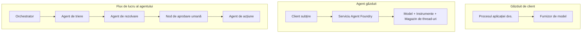
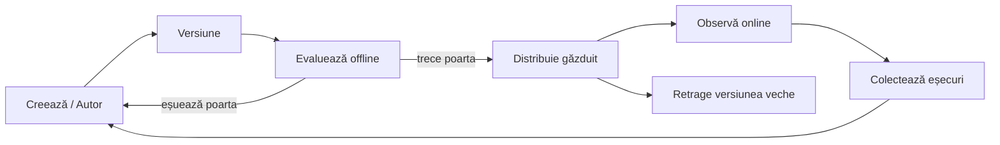
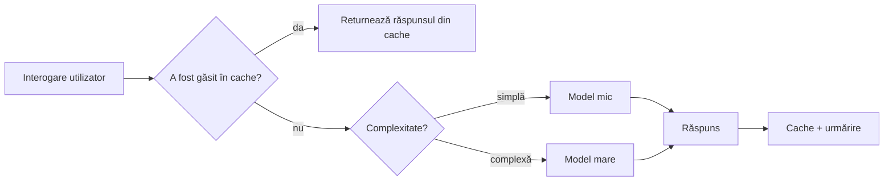
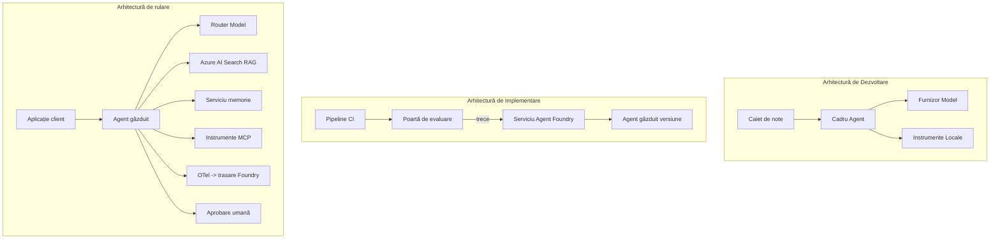

# Implementarea agenților scalabili cu Microsoft Foundry


Până în acest punct al cursului ai construit agenți care rulează pe laptopul tău, în interiorul unui notebook, controlați prin `az login` și câteva variabile de mediu. Aceasta este exact metoda corectă de a învăța. Nu este însă metoda corectă pentru a rula un agent de care mii de clienți depind la ora 3 dimineața.

Această lecție tratează decalajul dintre „funcționează pe mașina mea” și „funcționează, fiabil și accesibil, în producție”. Închidem acest decalaj folosind **Microsoft Foundry** și **Microsoft Foundry Agent Service**, construind un agent real de suport pentru clienți care include uneltele, recuperarea, memoria, evaluarea și monitorizarea.

## Introducere

Această lecție va acoperi:

- Diferența dintre un **agent prototip** și un **agent implementat**, și de ce tranziția ține în principal de tot ceea ce este *în jurul* modelului.
- **Modele de implementare** pentru agenți: găzduit de client, găzduit ca serviciu (Hosted Agents) și orchestrat prin fluxuri de lucru.
- **Ciclul de viață al agentului** pe Microsoft Foundry — creare, versiune, implementare, evaluare, observare, retragere.
- **Strategii de scalare**: rutarea modelului, caching, concureță și design fără stare.
- **Observabilitate** cu OpenTelemetry și urmărire Foundry.
- **Optimizarea costurilor** prin selecția modelului, rutare și porți de evaluare.
- **Considerații pentru întreprinderi**: guvernanță, aprobarea umană și executarea serverelor MCP în siguranță în producție.

## Obiective de învățare

După parcurgerea acestei lecții vei ști cum să:

- Alegi modelul de implementare potrivit pentru o sarcină dată a agentului.
- Implementezi un agent în Microsoft Foundry Agent Service astfel încât să fie versionat, guvernat și observabil.
- Instrumentezi un agent pentru urmărire și conectezi un flux de evaluare care rulează înainte de fiecare lansare.
- Aplici rutare și caching de model pentru a menține latența și costul sub control la scară.
- Adaugi o poartă de aprobare umană pentru acțiuni cu risc ridicat și integrezi un server MCP într-un mod sigur pentru producție.

## Precondiții

Această lecție presupune că ai parcurs lecțiile anterioare și ești confortabil cu:

- Construirea agenților cu [Microsoft Agent Framework](../14-microsoft-agent-framework/README.md) (Lecția 14).
- [Utilizarea uneltelor](../04-tool-use/README.md) (Lecția 4) și [Agentic RAG](../05-agentic-rag/README.md) (Lecția 5).
- [Memoria agentului](../13-agent-memory/README.md) (Lecția 13) și [Protocoalele agentice / MCP](../11-agentic-protocols/README.md) (Lecția 11).
- [Observabilitatea și evaluarea](../10-ai-agents-production/README.md) (Lecția 10) — această lecție construiește direct pe baza ei.

Vei avea nevoie și de:

- Un **abonament Azure** și un **proiect Microsoft Foundry** cu cel puțin un model de chat implementat.
- CLI-ul **Azure** autentificat (`az login`).
- Python 3.12+ și pachetele din fișierul [`requirements.txt`](../../../requirements.txt).

## Din prototip în producție: Ce se schimbă de fapt

Un agent prototip și unul de producție împart același ciclu principal — raționament, apelare unelte, răspuns. Se schimbă tot ce este în jurul acestui ciclu. Modelul constituie poate 20% dintr-un agent de producție; restul de 80% este scheletul operațional.

| Aspect | Prototip | Producție |
| --- | --- | --- |
| **Găzduire** | Rulează în notebook-ul tău | Rulează ca serviciu găzduit, versionat și implementat |
| **Identitate** | Tokenul tău `az login` | Identitate gestionată cu RBAC restrâns |
| **Stare** | În memorie, pierdută la restart | Externalizată (thread store, serviciu de memorie) |
| **Eșec** | Vezi traceback-ul | Reîncercări, fallback-uri, coadă pentru mesaje ratate, alerte |
| **Cost** | „Este câțiva cenți” | Urmărit pe cerere, rutat, cache-uit, bugetat |
| **Calitate** | Verifici manual ieșirea | Evaluată automat înainte de fiecare lansare |
| **Încredere** | Aprobi fiecare acțiune | Politică + uman în buclă pentru acțiuni riscante |

Reține acest tabel. Fiecare secțiune de mai jos corespunde uneia dintre aceste linii.

## Modele de implementare a agenților

Există trei modele pe care le vei folosi, adesea împreună.

### 1. Agenți găzduiți pe client

Obiectul agentului trăiește în procesul aplicației *tale*. Codul tău apelează direct furnizorul modelului; ciclul de raționament rulează în serviciul tău. Aceasta este ceea ce a făcut fiecare lecție anterioară.

- **Folosește-l când** ai nevoie de control total asupra ciclului, middleware personalizat, sau încorporezi agentul într-un backend existent.
- **Dezavantaj**: tu ești responsabil de scalare, stare și reziliență.

### 2. Agenți găzduiți (Foundry Agent Service)

Agentul este *înregistrat ca resursă* în Microsoft Foundry. Foundry găzduiește ciclul de raționament, stochează firele de conversație, impune siguranța conținutului și RBAC și face agentul vizibil în portalul Foundry. Aplicația ta devine un client subțire care creează fire și citește răspunsuri.

- **Folosește-l când** dorești durabilitate, observabilitate integrată, guvernanță și o suprafață operațională redusă.
- **Dezavantaj**: control mai redus la nivel scăzut în schimbul unui runtime gestionat.

### 3. Fluxuri de lucru pentru agenți

Mai mulți agenți (și unelte) sunt compuși într-un graf cu control explicit al fluxului — pași secvențiali, ramificări, noduri de aprobare umană și puncte durabile de control care permit pauză și reluare. Aceasta este capacitatea **Workflows** din Microsoft Agent Framework aplicată la scară de implementare.

- **Folosește-l când** o singură sarcină implică mai mulți agenți specializați sau necesită o etapă de aprobare la mijloc.
- **Dezavantaj**: mai multe componente în mișcare; necesită observabilitate la nivelul orchestration.



## Ciclul de viață al agentului pe Microsoft Foundry

Implementarea unui agent nu este un simplu `push`. Este un ciclu, asemănător cu un ciclu de lansare software pentru că exact asta este.



Ideea-cheie, preluată din [Lecția 10](../10-ai-agents-production/README.md): **evaluarea offline este o poartă, nu o reflecție tardivă.** O nouă versiune a agentului nu se lansează dacă nu trece pragurile tale de evaluare. Observabilitatea online aduce înapoi în setul tău de teste offline eșecurile din lumea reală. Acesta este întregul ciclu.

## Strategii de scalare

Scalarea unui agent este diferită de scalarea unui API web fără stare, deoarece fiecare cerere poate declanșa multiple apeluri costisitoare model și unelte. Patru tehnici suportă cea mai mare încărcare.

**Gestionarea cererilor fără stare.** Nu păstra stare per utilizator în memoria procesului tău. Persistă firele de conversație în depozitul de fire Foundry sau un serviciu de memorie astfel încât orice instanță poate deservi orice cerere. Aceasta este ceea ce permite scalarea orizontală — adaugă instanțe, fără sesiuni sticky.

**Rutararea modelului.** Nu fiecare cerere are nevoie de cel mai capabil (și costisitor) model al tău. Direcționează cererile simple — clasificarea intențiilor, răspunsuri factuale scurte — către un model mic, rapid, și păstrează modelul mare pentru raționamente reale. Foundry oferă un **Model Router** pentru asta, sau poți implementa un clasificator ușor singur. Vei construi versiunea DIY în laborator.

**Caching al răspunsurilor.** Multe întrebări de suport sunt aproape duplicate („cum îmi resetez parola?”). Cache-uiește răspunsurile la întrebările frecvente și serveste-le fără să apelezi modelul deloc. Chiar și o rată moderată de cache hit taie costurile și latența semnificativ.

**Concurența și presiunea înapoi.** Furnizorii de modele au limite de rată. Limitează-ți concurența, folosește reîncercări cu backoff exponențial și eșuează elegant (un răspuns în coadă „ocupat” bate un 500).



## Observabilitate în producție

Nu poți opera ce nu vezi. Așa cum s-a acoperit în Lecția 10, Microsoft Agent Framework emite urme **OpenTelemetry** nativ — fiecare apel de model, invocare unealtă și pas de orchestrare devine o span. În producție exporți aceste span-uri către Microsoft Foundry (sau orice backend compatibil OTel) astfel încât să poți:

- Urmări o singură reclamație a clientului cap-coadă prin fiecare apel de model și unealtă.
- Monitoriza latența p50/p95 și costul per cerere în timp.
- Trimite alerte la spike-uri de rată de eroare și anomalii de cost înainte ca utilizatorii tăi (sau echipa financiară) să observe.

```python
from agent_framework.observability import get_tracer

tracer = get_tracer()

with tracer.start_as_current_span("support_request") as span:
    span.set_attribute("customer.tier", "enterprise")
    span.set_attribute("routed.model", "gpt-5-nano")
    # execuția agentului este urmărită automat în interiorul acestei perioade
```

Atribute precum `customer.tier` și `routed.model` transformă un perete de urme într-un set de întrebări răspunzătoare („clienții enterprise sunt direcționați prea des către modelul mic?”).

## Optimizarea costurilor

Costul în agenții de producție este dominat de tokeni. Trei pârghii, în ordinea impactului:

1. **Dimensionează corect modelul.** Un model mic care trece poarta ta de evaluare este aproape întotdeauna mai ieftin decât unul mare care trece și el. Folosește evaluarea pentru a *dovedi* că modelul mic este suficient de bun, nu implicit să alegi modelul cel mai mare din precauție.
2. **Rutează după complexitate.** Ca mai sus — plătește prețul modelului mare doar pentru cererile ce necesită raționament cu modelul mare.
3. **Cache-uiește agresiv.** Cel mai ieftin apel de model este cel pe care nu îl faci niciodată.

Porțile de evaluare și controlul costurilor sunt aceeași disciplină văzută din două unghiuri: evaluarea îți spune *plafonul de calitate*, rutarea și caching-ul te mențin cât mai aproape de *costul* acestui plafon.

## Considerații pentru implementarea în întreprinderi

**Guvernanță.** Hosted Agents moștenesc RBAC-ul, siguranța conținutului și logarea auditului din Foundry. Oferă fiecărui agent o identitate gestionată cu privilegiul minim necesar — acces doar în citire la baza de cunoștințe, acces limitat la API-ul de ticketing, nimic mai mult.

**Uman în buclă.** Unele acțiuni sunt prea grave pentru a fi automatizate complet — emiterea unei rambursări, ștergerea unui cont, escaladarea către echipa juridică. Microsoft Agent Framework suportă unelte care necesită **aprobarea umană**: agentul propune acțiunea, execuția se oprește, un om aprobă sau respinge, apoi fluxul de lucru reia. Ai văzut această primitivă în [Lecția 6](../06-building-trustworthy-agents/README.md); aici o implementezi.

**MCP în producție.** [MCP](../11-agentic-protocols/README.md) permite agentului tău să consume unelte externe printr-o interfață standard. În producție, tratează fiecare server MCP ca o frontieră neîncredere: blochează versiunea serverului, rulează-l cu o identitate restrânsă, validează ieșirile, și nu expune niciodată secrete către el. Un server MCP este o dependență și dependențele sunt patchuite, auditate și limitate pe rată.



Acele trei diagrame — dezvoltare, implementare, runtime — sunt același agent în trei etape ale vieții sale. Laboratorul de mai jos te va ghida în construirea lui.

## Laborator practic: Agent de suport clienți gata pentru producție

Deschide [`code_samples/16-python-agent-framework.ipynb`](./code_samples/16-python-agent-framework.ipynb) și parcurge-l integral. Vei asambla un **agent de suport clienți Contoso** cu fiecare grijă de producție integrată:

1. **Apelarea uneltelor** — află starea comenzilor și deschide tichete de suport.
2. **RAG** — răspunde la întrebări de politică din baza de cunoștințe (Azure AI Search, cu o fallback în memorie astfel încât notebook-ul să ruleze și fără resursa Search).
3. **Memorie** — amintește-ți clientul în tururile conversației.
4. **Rutare model** — un clasificator de complexitate direcționează fiecare cerere către un model mic sau mare.
5. **Caching răspunsuri** — întrebările repetate sunt servite din cache.
6. **Aprobare umană** — rambursările peste un prag sunt oprite pentru semnătura umană.
7. **Flux de evaluare** — un set mic offline de teste evaluează agentul și funcționează ca poartă de lansare.
8. **Observabilitate** — urmărire OpenTelemetry pentru fiecare cerere.

### Parcurgere

Notebook-ul este organizat astfel încât fiecare grijă de producție să fie o secțiune separată, rulabilă. Inima lui este handler-ul de cereri cu rutare-plus-caching:

```python
async def handle_support_request(query: str, customer_id: str) -> str:
    # 1. Servește din cache când putem.
    cached = response_cache.get(normalize(query))
    if cached:
        return cached

    # 2. Rutează după complexitate pentru a controla costul.
    model = "gpt-5-nano" if is_simple(query) else "gpt-5-mini"

    # 3. Rulează agentul în interiorul unui span de trasare pentru observabilitate.
    with tracer.start_as_current_span("support_request") as span:
        span.set_attribute("routed.model", model)
        span.set_attribute("customer.id", customer_id)
        response = await support_agent.run(query, model=model)

    # 4. Cachează și returnează.
    response_cache.set(normalize(query), response.text)
    return response.text
```

Poarta de evaluare care păzește o lansare arată așa:

```python
async def evaluation_gate(agent, test_cases, threshold: float = 0.8) -> bool:
    passed = 0
    for case in test_cases:
        result = await agent.run(case["input"])
        if score_response(result.text, case["expected"]) >= 0.8:
            passed += 1
    pass_rate = passed / len(test_cases)
    print(f"Evaluation pass rate: {pass_rate:.0%} (gate: {threshold:.0%})")
    return pass_rate >= threshold  # implementează doar dacă poarta trece
```

Citește fiecare linie — notebook-ul păstrează primitivele deliberat mici astfel încât nimic să nu fie ascuns în spatele unui apel de framework.

## Validarea unui agent implementat cu teste de tip „smoke”

Poarta de evaluare de mai sus rulează *offline* pe obiectul tău agent. Odată ce agentul este implementat ca Hosted Agent, ai nevoie de o verificare suplimentară, chiar mai ieftină: **endpointul implementat răspunde efectiv?**

Implementarea „cu succes” dovedește doar că planul de control a acceptat definiția — nu dovedește că agentul răspunde. O dependență lipsă, o rutare greșită a modelului sau o conexiune expirată pot lăsa o implementare verde care nu returnează nimic. Un **test smoke** prinde asta în secunde, la fiecare implementare, fără costul unei evaluări complete.

Acest depozit furnizează un pipeline pregătit pentru teste smoke construit pe [AI Smoke Test](https://github.com/marketplace/actions/ai-smoke-test) GitHub Action:

- **Catalog** — [`tests/lesson-16-smoke-tests.json`](../../../tests/lesson-16-smoke-tests.json) conține prompturi și assert-uri pentru agentul de suport Contoso (răspunsuri de politică fundamentate, căutare comenzi, menținerea subiectului, continuitatea firelor multi-turn). Cataloagele pentru agenții altor lecții sunt alăturate — vezi [`tests/README.md`](../tests/README.md).
- **Flux** — [`.github/workflows/smoke-test.yml`](../../../.github/workflows/smoke-test.yml) se autentifică cu Azure OIDC și POST-ează fiecare prompt către endpointul Responses al agentului, eșuând jobul la orice assert nereușit.

```yaml
- name: Smoke-test hosted agent
  uses: JFolberth/ai-smoketest@v1
  with:
    project_endpoint: ${{ inputs.project_endpoint }}
    agent_name: ContosoSupportAgent
    tests_file: tests/lesson-16-smoke-tests.json
```


Rulează-l din fila **Actions** odată ce agentul tău este implementat, furnizând endpoint-ul proiectului Foundry și numele agentului. Identitatea federată are nevoie de rolul **Azure AI User** la nivelul proiectului Foundry. Gândește-te la straturi ca la o piramidă: teste rapide (este accesibil și răspunde?) rulează la fiecare implementare, evaluarea offline (este suficient de bun pentru a fi lansat?) rulează înainte de promovare, iar evaluarea online (cum se descurcă în condiții reale?) rulează continuu.

## Verificare a cunoștințelor

Testează-ți înțelegerea înainte de a trece la sarcină.

**1. Aproximativ cât dintr-un agent de producție este „modelul” și ce reprezintă restul?**

<details>
<summary>Răspuns</summary>

Modelul reprezintă o minoritate a sistemului – adesea menționat ca fiind în jur de 20%. Restul este scheletul operațional: găzduire și versionare, identitate și RBAC, stare externalizată, gestionarea erorilor, urmărirea costurilor, evaluarea și controale cu intervenție umană. Trecerea la producție este în mare parte despre construirea tuturor elementelor *în jurul* buclei de raționament.
</details>

**2. Când ai alege un Agent Găzduit în locul unui agent găzduit pe client?**

<details>
<summary>Răspuns</summary>

Când dorești un runtime gestionat cu durabilitate încorporată (fire de execuție care persistă și pot fi reluate), observabilitate, siguranța conținutului și RBAC, și ești dispus să renunți la un anumit control de nivel jos asupra buclei de raționament pentru o suprafață operațională mai mică. Găzduirea pe client este preferabilă când ai nevoie de control total asupra buclei sau încorporezi agentul într-un backend existent.
</details>

**3. De ce trebuie un agent scalabil să fie fără stare în memoria procesului său propriu?**

<details>
<summary>Răspuns</summary>

Astfel, orice instanță poate gestiona orice cerere, ceea ce permite scalarea orizontală fără sesiuni fixe (sticky sessions). Starea conversației per utilizator este externalizată într-un magazin de fire de execuție sau serviciu de memorie. Dacă starea ar trăi în memoria procesului, ai pierde-o la repornire și nu ai putea distribui încărcătura liber.
</details>

**4. Ce problemă rezolvă rutarea modelului și cum se leagă de evaluare?**

<details>
<summary>Răspuns</summary>

Rutarea trimite cererile simple către un model mic, ieftin și rapid și rezervă modelul mare pentru raționamentul autentic, controlând atât latența, cât și costul. Se leagă de evaluare pentru că evaluarea este ceea ce *dovedește* că modelul mic este suficient de bun pentru o clasă de cereri — rutarea fără evaluare este o presupunere.
</details>

**5. Ce este un „poartă de evaluare” și unde se află în ciclul de viață?**

<details>
<summary>Răspuns</summary>

O poartă de evaluare rulează un set de teste offline pe o versiune nouă a agentului și blochează implementarea dacă rata de trecere nu depășește un prag. Se află între „versiune” și „implementare” în ciclul de viață, făcând calitatea o condiție prealabilă pentru lansare în loc să fie ceva ce verifici după lansare.
</details>

**6. De ce trebuie un server MCP să fie tratat ca o frontieră neîncrezătoare în producție?**

<details>
<summary>Răspuns</summary>

Pentru că este o dependență externă către care agentul tău face apel. Ar trebui să fixezi versiunea lui, să îl rulezi cu o identitate restrânsă, să validezi ieșirile, să limitezi rata de acces și să nu expui niciodată secrete către el – aceeași disciplină pe care o aplici oricărei dependențe terțe. Ieșirile sale intră în raționamentul agentului tău, astfel că încrederea nevalidată este un risc de securitate.
</details>

**7. Care este singura schimbare care de obicei are cel mai mare impact asupra costului unui agent de producție și de ce?**

<details>
<summary>Răspuns</summary>

Ajustarea dimensiunii modelului — folosirea celui mai mic model care trece în continuare poarta ta de evaluare. Costul este dominat de tokeni, iar un model mai mic care îndeplinește criteriul de calitate este aproape întotdeauna mai ieftin decât unul mai mare. Caching-ul și rutarea reduc costul suplimentar, dar alegerea modelului de bază potrivit are cel mai mare efect de primă ordine.
</details>

**8. Ce rol joacă atributele span-ului precum `customer.tier` și `routed.model` în observabilitate?**

<details>
<summary>Răspuns</summary>

Ele transformă trace-urile brute în întrebări de afaceri la care se poate răspunde. Fără atribute ai un zid de span-uri; cu ele poți întreba „sunt clienții enterprise direcționați prea des către modelul mic?” sau „care model gestionează cele mai lente cereri ale noastre?” Atributele sunt modul în care împarți telemetria pe dimensiunile care contează pentru operațiunea ta.
</details>

## Sarcină

Ia agentul de suport clienți din laborator și întărește-l pentru un scenariu specific: **agent de suport facturare pentru un abonament pentru o companie SaaS.**

Livrarea ta trebuie să:

1. **Înlocuiască uneltele** cu altele relevante pentru facturare: `get_subscription_status`, `get_invoice` și `issue_credit` (creditele peste 50$ necesită aprobare umană).
2. **Adauge trei documente RAG** care acoperă politica de rambursare a companiei, ciclul de facturare și politica de anulare.
3. **Extindă setul de evaluare** la cel puțin opt cazuri, inclusiv cel puțin două care *ar trebui* să activeze calea cu aprobare umană, și să confirme că poarta ta de evaluare trece sau respinge corect.
4. **Adauge un raport de cost**: după ce rulezi zece interogări mixte prin agent, afișează câte au mers către modelul mic, câte către modelul mare și câte au fost servite din cache.

Scrie un paragraf scurt (într-o celulă markdown) explicând regula de rutare a modelului pe care ai ales-o și cum ai valida-o cu trafic real. Nu există un răspuns unic corect – ești evaluat pe coerența legăturii dintre preocupările de producție.

## Rezumat

În această lecție ai mutat un agent de la prototip la producție cu Microsoft Foundry:

- Saltul spre producție este în mare parte despre **scheletul operațional** din jurul modelului — găzduire, identitate, stare, gestionarea erorilor, cost, calitate și încredere.
- Ai învățat cele trei **modele de implementare** — găzduire pe client, Agenti găzduiți și Fluxuri de lucru Agent — și când se potrivesc fiecare.
- Ai parcurs **ciclul de viață al agentului**, în care evaluarea offline **acționează ca o poartă de lansare** iar observabilitatea online reintegrează eșecurile în setul de teste.
- Ai aplicat **strategii de scalare** — design fără stare, rutare a modelului, caching și concurență limitată — și le-ai conectat la **optimizarea costurilor**.
- Ai integrat **controale enterprise**: RBAC, aprobare cu intervenție umană și integrare sigură MCP în producție.
- Ai construit un **agent de suport clienți gata pentru producție** care leagă toate aceste preocupări în cod rulabil.

Următoarea lecție face călătoria inversă: în loc să scalezi agenții în cloud, îi vei aduce *în jos* pe o singură mașină de dezvoltare și îi vei rula complet local.

## Resurse suplimentare

- <a href="https://learn.microsoft.com/azure/ai-foundry/what-is-azure-ai-foundry" target="_blank">Documentația Microsoft Foundry</a>
- <a href="https://learn.microsoft.com/azure/ai-foundry/agents/overview" target="_blank">Prezentare generală a serviciului Agent Microsoft Foundry</a>

- <a href="https://learn.microsoft.com/en-us/agent-framework/overview/?wt.mc_id=youtube_26688_organicsocial_reactor&pivots=programming-language-python" target="_blank">Microsoft Agent Framework</a>
- <a href="https://learn.microsoft.com/azure/ai-foundry/concepts/model-router" target="_blank">Model Router în Microsoft Foundry</a>
- <a href="https://learn.microsoft.com/azure/search/search-what-is-azure-search" target="_blank">Căutare AI Azure</a>
- <a href="https://opentelemetry.io/" target="_blank">OpenTelemetry</a>
- <a href="https://github.com/marketplace/actions/ai-smoke-test" target="_blank">Acțiune GitHub AI Smoke Test</a>
- <a href="https://modelcontextprotocol.io/" target="_blank">Model Context Protocol (MCP)</a>

## Lecția Anterioară

[Construirea Agenților de Utilizare a Calculatorului (CUA)](../15-browser-use/README.md)

## Lecția Următoare

[Crearea Agenților AI Locali](../17-creating-local-ai-agents/README.md)

---

<!-- CO-OP TRANSLATOR DISCLAIMER START -->
**Declinare a responsabilității**:
Acest document a fost tradus folosind serviciul de traducere AI [Co-op Translator](https://github.com/Azure/co-op-translator). În timp ce ne străduim pentru acuratețe, vă rugăm să rețineți că traducerile automate pot conține erori sau inexactități. Documentul original în limba sa nativă trebuie considerat sursa autorizată. Pentru informații critice, se recomandă traducerea profesională realizată de un om. Nu ne asumăm responsabilitatea pentru eventualele neînțelegeri sau interpretări greșite care decurg din utilizarea acestei traduceri.
<!-- CO-OP TRANSLATOR DISCLAIMER END -->