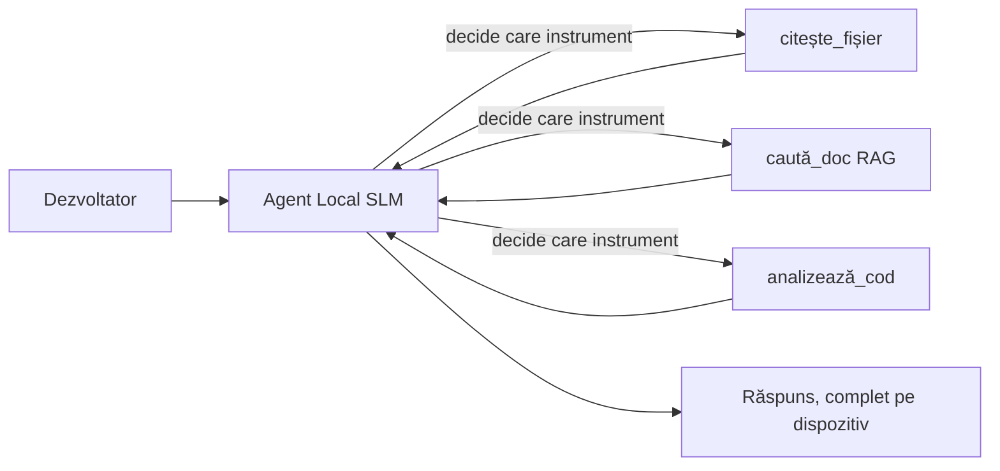
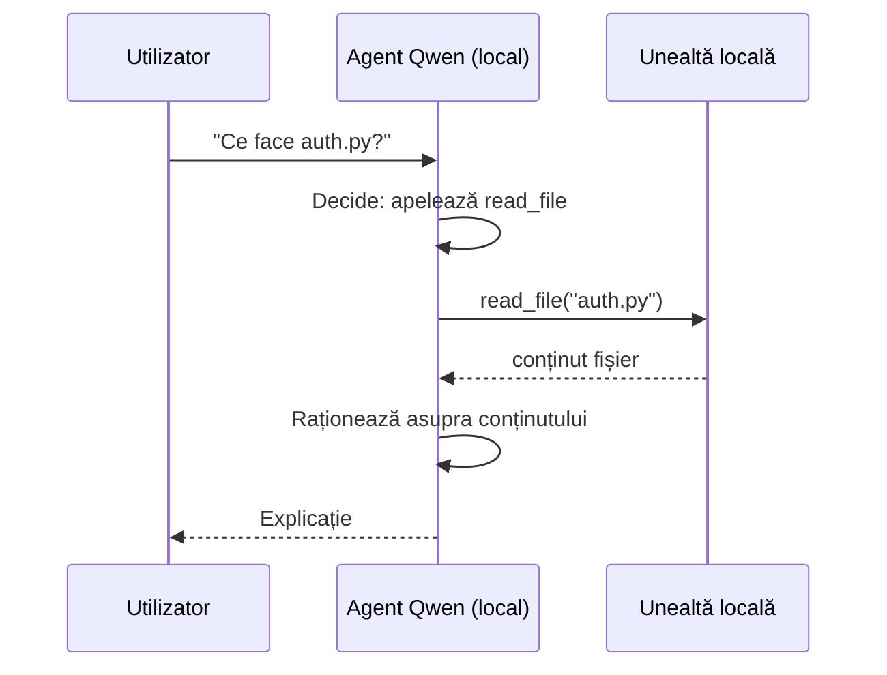
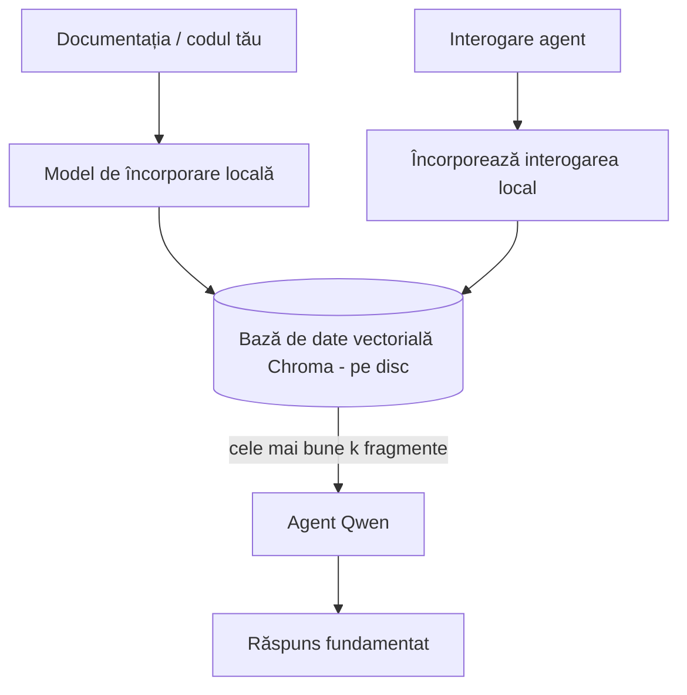
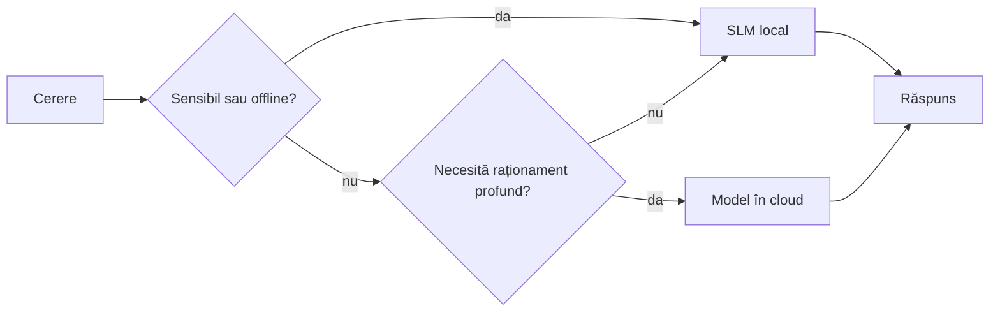

# Crearea Agenților AI Locali folosind Microsoft Foundry Local și Qwen


Lecția anterioară a scalat agenții *sus* în cloud. Aceasta îi aduce *jos* pe o singură mașină. La final veți avea un asistent de inginerie funcțional care raționează, apelează instrumente, citește fișierele dvs. și caută în documentația dvs. — **fără niciun apel de inferență în cloud.**

De ce ați vrea asta? Trei motive care apar constant în munca reală de inginerie:

- **Confidențialitate.** Codul și documentele nu părăsesc niciodată mașina. Niciun prompt, niciun fragment, niciun date de client nu trece de limita rețelei.
- **Cost.** Inferența locală nu are facturare pe token. Puteți itera toată ziua pentru prețul electricității.
- **Offline.** În avion, într-o instalație securizată sau în timpul unei pene de curent, agentul funcționează în continuare.

Dezavantajul este că faceți un schimb între un model de ultimă oră în cloud și un **Model de Limbaj Mic (SLM)** care rulează pe CPU-ul, GPU-ul sau NPU-ul dvs. Această lecție este despre construirea de agenți care sunt *buni* în acest context, mai degrabă decât să pretindem că nu există această limitare.

## Introducere

Această lecție va acoperi:

- **Modele de Limbaj Mici (SLM)** — ce sunt, unde excelează și unde nu.
- **Microsoft Foundry Local** — un runtime care descarcă și servește modele pe dispozitiv printr-un **API compatibil OpenAI**.
- **Modele Qwen pentru apelarea funcțiilor** — SLM-uri care produc constant apeluri către unelte, ceea ce face posibilă existența agenților locali (nu doar chat local).
- **Unelte locale, RAG local și MCP local** — oferind agentului capacități fără cloud.
- **Tipare hibride** — când să păstrați lucrurile locale și când să apelați cloud-ul.

## Obiective de învățare

După finalizarea acestei lecții, veți ști să:

- Explicați compensările SLM-urilor și să alegeți cazuri de utilizare potrivite pentru agenți locali.
- Serviți un model Qwen local cu Foundry Local și să vă conectați la el prin endpoint-ul compatibil OpenAI.
- Construiți un agent care apelează unelte și rulează integral pe stația dvs. de lucru.
- Adăugați RAG local peste propriile documente folosind o bază de date vectorială locală (Chroma).
- Conectați agentul la un server MCP local și să raționați despre designuri hibride local/cloud.

## Precondiții

Această lecție presupune că ați finalizat lecțiile anterioare și sunteți confortabil cu:

- [Utilizarea Uneltelor](../04-tool-use/README.md) (Lecția 4) și [Agentic RAG](../05-agentic-rag/README.md) (Lecția 5).
- [Protocoalele Agentice / MCP](../11-agentic-protocols/README.md) (Lecția 11).
- [Microsoft Agent Framework](../14-microsoft-agent-framework/README.md) (Lecția 14).

De asemenea, veți avea nevoie de:

- O stație de lucru pentru dezvoltatori. **8 GB RAM este un minim realist**; 16 GB+ este confortabil. Un GPU sau NPU ajută, dar nu este obligatoriu.
- **Microsoft Foundry Local** instalat (vedeți secțiunea de instalare mai jos).
- Python 3.12+ și pachetele din fișierul `requirements.txt` al repozitoriului, plus `foundry-local-sdk`, `openai` și `chromadb` pentru această lecție.

## Modele de Limbaj Mici: Instrumentul Potrivit pentru Munca Locală

Un model de ultimă generație în cloud are sute de miliarde de parametri și un centru de date în spate. Un SLM are câteva miliarde de parametri și trebuie să încapă în RAM-ul laptopului dvs. Această diferență setează așteptări clare.

**SLM-urile sunt bune la:**

- Sarcini structurate și limitate — clasificare, extragere, sumarizare a unui document cunoscut.
- **Apelarea uneltelor** — decizia cui funcție să apeleze și cu ce argumente.
- Iterare rapidă, ieftină și privată pe datele proprii.

**SLM-urile sunt mai slabe la:**

- Raționament deschis, multi-hop, pe un context mare.
- Cunoștințe largi despre lume (au văzut mai puțin și uită mai mult).

Strategia câștigătoare pentru agenții locali este deci: **lăsați SLM-ul să orchestreze și lăsați uneltele să facă treaba grea.** Modelul nu trebuie să *știe* codul dvs. — trebuie să știe când să apeleze `read_file` și `search_docs`. Asta exploatează direct punctele forte ale unui SLM.



## Microsoft Foundry Local

**Microsoft Foundry Local** este un runtime ușor care descarcă, gestionează și servește modele integral pe mașina dvs. Cele mai importante caracteristici pentru noi sunt că expune un **endpoint HTTP compatibil OpenAI** — ceea ce înseamnă că SDK-ul OpenAI și clientul OpenAI din Microsoft Agent Framework funcționează cu el schimbând doar `base_url`-ul. Tot ce ați învățat despre construirea agenților se aplică direct; doar endpoint-ul se mută din cloud în `localhost`.

Foundry Local alege automat cea mai bună construcție a modelului pentru hardware-ul dvs. — o construcție CPU, CUDA/GPU sau NPU — deci nu trebuie să optimizați manual per mașină.

### Instalare

Instalați Foundry Local (vedeți [documentația](https://learn.microsoft.com/azure/ai-foundry/foundry-local/) pentru sistemul dvs. de operare), apoi confirmați că funcționează:

```bash
# Instalați (exemplu; urmați documentația pentru platforma dvs.)
winget install Microsoft.FoundryLocal      # Windows
# brew install microsoft/foundrylocal/foundrylocal   # macOS

# Descărcați și rulați un model Qwen, apoi porniți serviciul local
foundry model run qwen2.5-7b-instruct
foundry service status
```

Odată ce serviciul rulează, aveți un endpoint local compatibil OpenAI (de obicei `http://localhost:PORT/v1`). Notebook-ul folosește `foundry-local-sdk` pentru a descoperi automat endpoint-ul, astfel încât să nu fie nevoie să fixați portul manual.

## Apelarea Funcțiilor în Qwen: De Ce Contează

Un agent este agent numai dacă poate apela unelte. Multe SLM-uri pot purta o conversație, dar produc apeluri către unelte nesigure sau rău formate. Modelele **Qwen** sunt antrenate pentru apelarea funcțiilor și emit structuri de apel bine formate constant — exact ceea ce transformă un model de chat local într-un *agent* local.

Fluxul este ciclul standard de apel de unelte pe care îl știți deja, doar că rulează pe dispozitiv:



## RAG local

Căutarea în documentație este locul unde agenții locali își demonstrează valoarea. În loc să sperați că SLM-ul a memorat documentația framework-ului dvs., încărcați acele documente într-o **bază locală de date vectorială** și lăsați agentul să recupereze fragmentul relevant la cerere.

Folosim **Chroma**, un magazin de vectori încorporat care rulează în proces, fără un server de gestionat. Fluxul este complet local: modelul de embedding local → vectorii locali → recuperarea locală → SLM local.



Este același tipar Agentic RAG din Lecția 5 — singura schimbare este că toate componentele rulează pe mașina dvs.

## Servere MCP locale

[MCP](../11-agentic-protocols/README.md) este un transport, nu un serviciu cloud. Un server MCP poate rula ca proces local pe `stdio`, expunând unelte agentului dvs. prin protocolul standard. Aceasta vă permite să reutilizați ecosistemul tot mai mare de servere MCP — acces la sistemul de fișiere, operațiuni git, interogări în baza de date — integral offline.

Postura de securitate este diferită de cloud, dar nu absentă: un server MCP local încă rulează cu permisiunile utilizatorului dvs., deci delimitați ce poate accesa (un director de proiect, nu întreg folderul home) și tratați ieșirile sale ca intrări care trebuie validate.

## Tipare hibride Cloud și Local

Local-first nu înseamnă doar local. Sistemele mature direcționează în funcție de sensibilitate și dificultate:

| Situație | Unde rulează |
| --- | --- |
| Cod / date sensibile sau offline | **SLM local** |
| Sarcină simplă, limitată | **SLM local** (ieftin, rapid) |
| Raționament multi-hop dificil pe date nesensibile | **Model cloud** |
| Totul, în timpul unei pene de curent | **SLM local** (degradare grațioasă) |

Aceasta reflectă ideea de **rutare a modelului** din Lecția 16 — cu excepția faptului că unul dintre „modele” este acum propria dvs. mașină. Un design robust se reorientează către local când cloud-ul nu este disponibil, astfel încât agentul degradează calitatea în loc să eșueze complet.



## Laborator practic: Un asistent de inginerie local

Deschideți [`code_samples/17-local-agent-foundry-local.ipynb`](./code_samples/17-local-agent-foundry-local.ipynb) și parcurgeți-l. Veți construi un **asistent de inginerie local** care rulează integral pe stația dvs. de lucru și poate:

1. **Apela unelte** — prin apelarea funcțiilor Qwen prin Foundry Local.
2. **Executa operațiuni locale pe fișiere** — lista și citirea fișierelor dintr-un director de proiect.
3. **Analiza codului** — raportează metrici de bază asupra unui fișier sursă.
4. **Caută în documentație** — RAG local peste un folder de documente cu Chroma.
5. **Folosește MCP** — se conectează la un server MCP local (cu o ocolire grațioasă dacă niciunul nu este configurat).

Nu se folosește inferență în cloud în nicio etapă.

### Parcurgere

Asistentul se conectează la Foundry Local prin endpoint-ul compatibil OpenAI, astfel încât codul agentului arată aproape identic cu lecțiile din cloud — doar clientul se schimbă:

```python
from foundry_local import FoundryLocalManager
from openai import OpenAI

# Foundry Local descoperă/descarcă modelul și ne oferă un punct final local.
manager = FoundryLocalManager(\"qwen2.5-7b-instruct\")
client = OpenAI(base_url=manager.endpoint, api_key=manager.api_key)  # api_key este un substitut local
```

Uneltele sunt funcții Python obișnuite delimitate la un director de proiect:

```python
def read_file(path: str) -> str:
    \"\"\"Read a file, but only inside the sandboxed project directory.\"\"\"
    full = (PROJECT_ROOT / path).resolve()
    if PROJECT_ROOT not in full.parents and full != PROJECT_ROOT:
        return \"Access denied: path is outside the project directory.\"
    return full.read_text(encoding=\"utf-8\")
```

Observați verificarea sandbox — chiar și local, o unealtă care citește căi arbitrare este o responsabilitate. Notebook-ul păstrează fiecare unealtă delimitată la o singură rădăcină de proiect.

## Verificare de cunoștințe

Testați-vă înțelegerea înainte de a trece la temă.

**1. Oferiți două motive concrete pentru a rula un agent local și nu în cloud.**

<details>
<summary>Răspuns</summary>

Oricare două dintre: **confidențialitate** (codul și datele nu părăsesc mașina), **cost** (nu există facturare pe token la inferență) și **funcționare offline** (funcționează fără rețea — în avion, în instalație securizată sau în timpul unei pene). Restricțiile de reglementare/conformitate care interzic trimiterea datelor în afara dispozitivului sunt un motiv frecvent pentru confidențialitate.
</details>

**2. Care este diviziunea recomandată a muncii între un SLM și uneltele sale într-un agent local și de ce?**

<details>
<summary>Răspuns</summary>

Lăsați SLM-ul să **orchestra** (să decidă ce unealtă să apeleze și cu ce argumente) și lăsați **uneltele să facă treaba grea** (citirea fișierelor, recuperarea documentației, calcularea rezultatelor). SLM-urile sunt puternice la decizii limitate precum selecția uneltelor, dar mai slabe la cunoștințe largi și raționament multi-hop lung, așadar sprijinul pe unelte joacă pe punctele lor forte.
</details>

**3. Ce face posibilă reutilizarea codului agentului de cloud cu Foundry Local?**

<details>
<summary>Răspuns</summary>

Foundry Local expune un **endpoint HTTP compatibil OpenAI**. SDK-ul OpenAI și clientul OpenAI din Agent Framework funcționează cu acesta schimbând doar `base_url` (și folosind o cheie API locală fictivă). Tot restul codului agentului rămâne neschimbat.
</details>

**4. De ce folosim în mod specific un model Qwen pentru apelarea funcțiilor în loc de orice SLM?**

<details>
<summary>Răspuns</summary>

Pentru că un agent trebuie să genereze apeluri către unelte fiabile și bine formate. Multe SLM-uri pot conversa, dar emit structuri de apel malformate sau inconsistente. Modelele Qwen sunt antrenate pentru apelarea funcțiilor și produc apeluri consistente, ceea ce transformă un model local de chat într-un agent local funcțional.
</details>

**5. În pipeline-ul RAG local, care componente rulează pe mașină?**

<details>
<summary>Răspuns</summary>

Toate: modelul de embedding, baza vectorială (Chroma, pe disc), pasul de recuperare și SLM-ul. Documentele sunt embedate local, stocate local, recuperate local și procesate de un model local — niciun component nu accesează cloud-ul.
</details>

**6. Un server MCP local rulează pe mașina dvs. Îl face asta automat sigur? Ce precauție ar trebui să mai luați?**

<details>
<summary>Răspuns</summary>

Nu. Un server MCP local rulează cu permisiunile utilizatorului dvs., deci poate accesa orice puteți accesa și dvs. Limitați-l la ce are nevoie (de exemplu, un singur director de proiect în loc de întreg folderul home) și tratați ieșirile ca intrări ce trebuie validate înainte de a acționa pe baza lor.
</details>

**7. Descrieți o regulă rezonabilă de rutare hibridă care include un model local.**

<details>
<summary>Răspuns</summary>

Direcționați cererile sensibile sau offline către SLM-ul local; direcționați sarcinile simple, limitate către SLM-ul local pentru viteză și cost; direcționați raționamentul multi-hop greu pe date nesensibile către un model cloud; și reveniți la SLM-ul local dacă cloud-ul nu este disponibil, astfel încât agentul să degradeze grațios în loc să eșueze complet. Aceasta este rutarea modelelor (Lecția 16) cu mașina locală ca unul dintre modele.
</details>

**8. Care este o valoare minimă realistă de RAM pentru a rula agentul local din această lecție și ce câștigați cu mai mult RAM?**

<details>
<summary>Răspuns</summary>

În jur de **8 GB** este minimul realist; 16 GB+ este confortabil. Mai mult RAM vă permite să rulați modele mai mari, mai capabile și să păstrați mai mult context în memorie. Un GPU sau NPU accelerează inferența, dar nu este obligatoriu — Foundry Local selectează o construcție CPU când nu există accelerator disponibil.
</details>

## Temă

Extindeți asistentul local de inginerie într-un **revizor local de documentație** pentru un proiect mic la alegere (puteți folosi unul dintre folderele de lecții din acest repo dacă doriți).

Trimiterea dvs. ar trebui să:

1. **Indexeze un folder real de documentație/cod** în Chroma (cel puțin cinci fișiere).
2. **Adauge o unealtă `find_todos`** care scanează proiectul pentru comentarii `TODO`/`FIXME` și le returnează cu fișierul și numărul liniei — păstrând aceeași verificare sandbox ca `read_file`.

3. **Pune agentului trei întrebări** care îl forțează să combine instrumentele: una pur RAG, una care cere citirea unui fișier specific și una care cere găsirea TODO-urilor.
4. **Măsoară-l**: cronometrează fiecare dintre cele trei răspunsuri și notează-le într-o celulă markdown. Comentează dacă latența este acceptabilă pentru fluxul tău de lucru intenționat.

Apoi scrie un paragraf scurt despre **ce ai muta în cloud și ce ai păstra local** pentru acest evaluator, și de ce. Ești evaluat pe cât de bine sunt legate componentele locale împreună și dacă raționamentul tău hibrid este solid — nu pe calitatea modelului.

## Rezumat

În această lecție ai construit un agent care rulează integral pe propria ta mașină:

- **SLMs** schimbă amplitudinea pentru confidențialitate, cost și operare offline — și excelează când **orchestraează instrumente** în loc să dețină tot cunoștințele de unul singur.
- **Foundry Local** servește modele pe dispozitiv în spatele unui **endpoint compatibil OpenAI**, astfel codul agentului de cloud poate fi transferat printr-o singură linie de schimbare.
- **Modelele Qwen cu apel de funcții** fac posibil apelul local fiabil al instrumentelor — și deci agenți locali.
- **Local RAG** (Chroma) și **MCP local** oferă agentului capabilități fără a părăsi calculatorul.
- **Modelele hibride** îți permit să direcționezi după sensibilitate și dificultate, cu localul ca variantă de rezervă elegantă.

Aceasta încheie arcul de implementare: Lecția 16 a scalat agenții în Microsoft Foundry, iar această lecție i-a redus pe un singur workstation. Următoarea lecție se concentrează pe menținerea securității agenților implementați.

## Resurse suplimentare

- <a href="https://learn.microsoft.com/azure/ai-foundry/foundry-local/" target="_blank">Documentația Microsoft Foundry Local</a>
- <a href="https://learn.microsoft.com/azure/ai-foundry/what-is-azure-ai-foundry" target="_blank">Documentația Microsoft Foundry</a>
- <a href="https://learn.microsoft.com/en-us/agent-framework/overview/?wt.mc_id=youtube_26688_organicsocial_reactor&pivots=programming-language-python" target="_blank">Microsoft Agent Framework</a>
- <a href="https://qwen.readthedocs.io/en/latest/framework/function_call.html" target="_blank">Documentația apelului de funcții Qwen</a>
- <a href="https://modelcontextprotocol.io/" target="_blank">Model Context Protocol (MCP)</a>
- <a href="https://docs.trychroma.com/" target="_blank">Baza de date vectorială Chroma</a>

## Lecția precedentă

[Deploying Scalable Agents](../16-deploying-scalable-agents/README.md)

## Lecția următoare

[Securing AI Agents](../18-securing-ai-agents/README.md)

---

<!-- CO-OP TRANSLATOR DISCLAIMER START -->
**Declinare a responsabilității**:
Acest document a fost tradus folosind serviciul de traducere AI [Co-op Translator](https://github.com/Azure/co-op-translator). În timp ce ne străduim pentru acuratețe, vă rugăm să rețineți că traducerile automate pot conține erori sau inexactități. Documentul original în limba sa nativă trebuie considerat sursa autorizată. Pentru informații critice, se recomandă traducerea profesională realizată de un om. Nu ne asumăm responsabilitatea pentru eventualele neînțelegeri sau interpretări greșite care decurg din utilizarea acestei traduceri.
<!-- CO-OP TRANSLATOR DISCLAIMER END -->