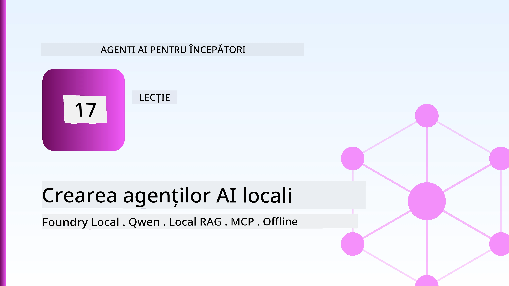
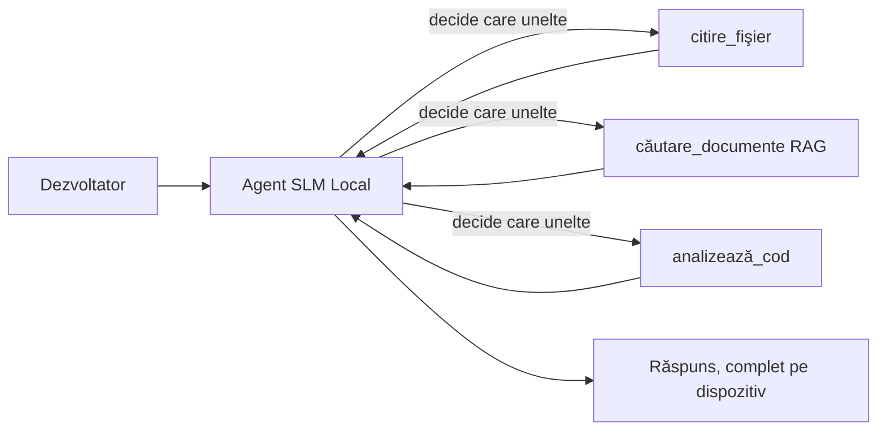
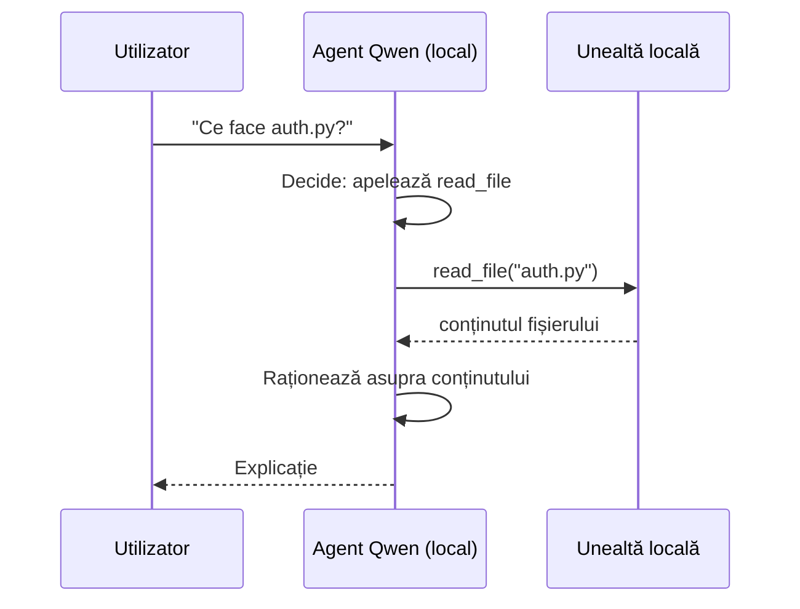
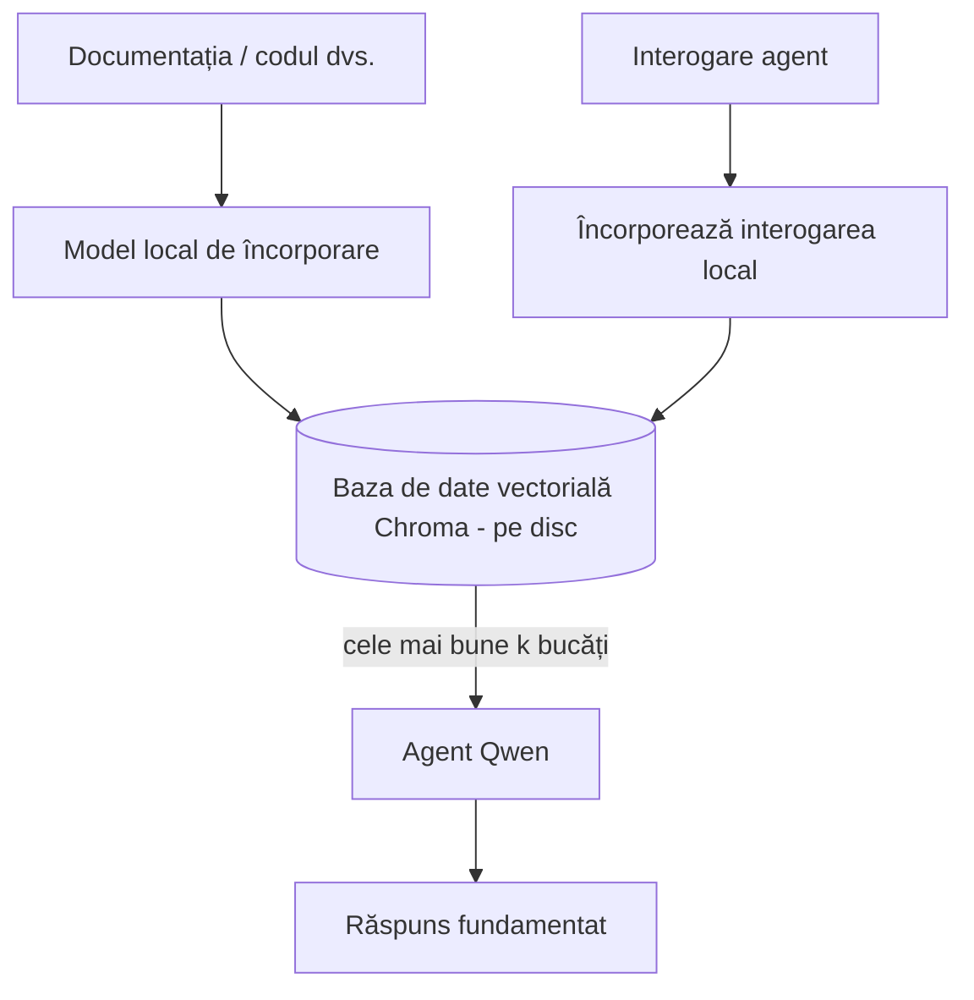
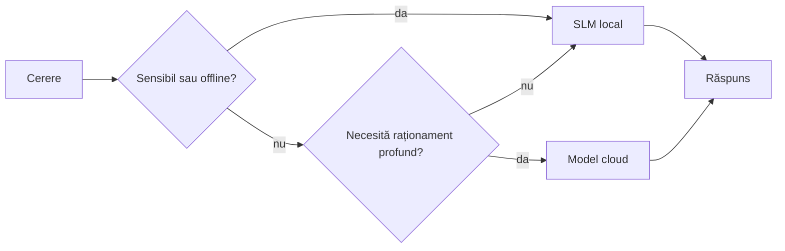

# Crearea agenților AI locali folosind Microsoft Foundry Local și Qwen



Lecția precedentă a scalat agenții *în sus*, către cloud. Aceasta îi aduce *în jos* pe o singură mașină. La final, vei avea un asistent ingineresc funcțional care raționează, apelează unelte, citește fișierele tale și caută în documentația ta — **fără niciun apel de inferență în cloud.**

De ce ai vrea asta? Trei motive care apar constant în munca ingineriei reale:

- **Confidențialitate.** Codul și documentele nu părăsesc niciodată mașina. Niciun prompt, fragment sau date ale clientului nu trec granița rețelei.
- **Cost.** Inferența locală nu are facturare per token. Poți itera toată ziua la prețul electricității.
- **Offline.** Pe un avion, într-o facilitate securizată sau în timpul unei pene, agentul funcționează în continuare.

Dezavantajul este că faci un schimb: un model frontieră în cloud pentru un **Model Mic de Limbaj (SLM)** care rulează pe CPU-ul, GPU-ul sau NPU-ul tău. Această lecție este despre construirea de agenți care sunt *buni* în acestă constrângere, în loc să pretindem că ea nu există.

## Introducere

Această lecție va acoperi:

- **Modele Mici de Limbaj (SLM-uri)** — ce sunt, unde excelează și unde nu.
- **Microsoft Foundry Local** — un runtime care descarcă și servește modele local printr-un **API compatibil OpenAI**.
- **Modelele Qwen de apelare a funcțiilor** — SLM-uri care produc în mod fiabil apeluri către unelte, ceea ce face posibili agenții locali (nu doar chat local).
- **Unelte locale, RAG local și MCP local** — oferind agentului capacitate fără cloud.
- **Pattern-uri hibride** — când să păstrezi lucrurile locale și când să apelezi cloud-ul.

## Obiective de învățare

După finalizarea acestei lecții, vei ști să:

- Explici compromisurile SLM-urilor și alegi cazurile adecvate pentru agenții locali.
- Servești un model Qwen local cu Foundry Local și să te conectezi la el prin endpoint-ul compatibil OpenAI.
- Construiești un agent care apelează unelte ce rulează integral pe stația ta de lucru.
- Adaugi RAG local peste propriile documente folosind o bază de date vectorială locală (Chroma).
- Conectezi agentul la un server MCP local și raționezi despre arhitecturi hibride local/cloud.

## Precondiții

Această lecție presupune că ai finalizat lecțiile anterioare și te simți confortabil cu:

- [Utilizarea uneltelor](../04-tool-use/README.md) (Lecția 4) și [RAG agentic](../05-agentic-rag/README.md) (Lecția 5).
- [Protocoale agentice / MCP](../11-agentic-protocols/README.md) (Lecția 11).
- [Cadru agent Microsoft](../14-microsoft-agent-framework/README.md) (Lecția 14).

De asemenea, vei avea nevoie de:

- O stație de lucru pentru dezvoltatori. **8 GB RAM este minimul realist**; 16 GB+ este confortabil. Un GPU sau NPU ajută, dar nu este necesar.
- Instalarea **Microsoft Foundry Local** (vezi secțiunea de configurare mai jos).
- Python 3.12+ și pachetele din fișierul [`requirements.txt`](../../../requirements.txt) al depozitului, plus `foundry-local-sdk`, `openai` și `chromadb` pentru această lecție.

## Modele Mici de Limbaj: Unealta potrivită pentru munca locală

Un model frontieră în cloud are sute de miliarde de parametri și un centru de date în spate. Un SLM are câteva miliarde de parametri și trebuie să încapă în RAM-ul laptopului tău. Această diferență stabilește așteptări clare.

**SLM-urile sunt bune la:**

- Sarcini structurate, delimitate — clasificare, extracție, sumarizare a unui document cunoscut.
- **Apelarea uneltelor** — decizia asupra funcției de apelat și cu ce argumente.
- Iterații rapide, ieftine și private pe propriile tale date.

**SLM-urile sunt mai slabe la:**

- Raționamente deschise, multi-hop pe contexte mari.
- Cunoștințe mondiale vaste (au văzut mai puțin și uită mai mult).

Strategia câștigătoare pentru agenții locali este așadar: **lasă SLM-ul să orchestreze și uneltele să facă treaba grea.** Modelul nu trebuie să *cunoască* baza ta de cod — trebuie să știe când să apeleze `read_file` și `search_docs`. Acesta țintește direct punctele forte ale SLM-ului.



## Microsoft Foundry Local

**Microsoft Foundry Local** este un runtime ușor care descarcă, gestionează și servește modele integral pe mașina ta. Caracteristica cea mai importantă pentru noi este că expune un **endpoint HTTP compatibil OpenAI** — ceea ce înseamnă că SDK-ul OpenAI și clientul OpenAI din Microsoft Agent Framework lucrează cu el doar schimbând `base_url`. Tot ceea ce ai învățat despre construirea agenților se transferă direct; singura schimbare este că endpoint-ul se mută din cloud pe `localhost`.

Foundry Local selectează automat cea mai bună construcție a modelului pentru hardware-ul tău — o construcție CPU, CUDA/GPU sau NPU — astfel încât să nu faci optimizare manuală pe mașină.

### Configurare

Instalează Foundry Local (vezi [documentația](https://learn.microsoft.com/azure/ai-foundry/foundry-local/) pentru sistemul tău de operare), apoi confirmă că funcționează:

```bash
# Instalează (exemplu; urmează documentația pentru platforma ta)
winget install Microsoft.FoundryLocal      # Windows
# brew install microsoft/foundrylocal/foundrylocal   # macOS

# Descarcă și rulează un model Qwen, apoi pornește serviciul local
foundry model run qwen2.5-7b-instruct
foundry service status
```

Odată ce serviciul rulează, ai un endpoint local compatibil OpenAI (de obicei `http://localhost:PORT/v1`). Notebook-ul folosește `foundry-local-sdk` ca să descopere endpoint-ul automat, deci nu trebuie să codifici portul manual.

## Apelarea funcțiilor Qwen: De ce contează

Un agent este agent doar dacă poate apela unelte. Multe SLM-uri pot conversa, dar produc apeluri către unelte nesigure și neformate corect. Modelele **Qwen** sunt antrenate pentru apelarea funcțiilor și emit structuri de apel de unelte bine formate în mod consistent — ceea ce transformă un model de chat local într-un *agent* local.

Fluxul este bucla standard de apelare a uneltelor pe care o cunoști deja, doar că rulează pe dispozitiv:



## RAG local

Căutarea în documentație este locul unde agenții locali își câștigă valoarea. În loc să speri că SLM-ul a memorat documentația framework-ului tău, îi încorporezi acele documente într-o **bază de date vectorială locală** și lași agentul să recupereze fragmentele relevante la cerere.

Folosim **Chroma**, un depozit vectorial încorporat care rulează în proces fără server de gestionat. Pipeline-ul este complet local: model de embedding local → vectori locali → regăsire locală → SLM local.



Acesta este același pattern Agentic RAG din Lecția 5 — singura schimbare e că fiecare componentă rulează pe mașina ta.

## Servere MCP locale

[MCP](../11-agentic-protocols/README.md) este un transport, nu un serviciu cloud. Un server MCP poate rula ca proces local pe `stdio`, expunând unelte către agentul tău prin protocolul standard. Asta îți permite să reutilizezi ecosistemul în creștere de servere MCP — acces la sistemul de fișiere, operațiuni git, interogări baze de date — complet offline.

Postura de securitate este diferită față de cloud, dar nu absentă: un server MCP local rulează tot cu permisiunile utilizatorului tău, așa că limitează ce poate avea acces (un director de proiect, nu întregul folder home) și tratează rezultatele sale ca input-uri ce trebuie validate.

## Modele hibride local-cloud

Local-first nu înseamnă local-only. Sistemele mature direcționează în funcție de sensibilitate și dificultate:

| Situație | Unde rulează |
| --- | --- |
| Cod / date sensibile, sau offline | **SLM local** |
| Sarcină simplă, delimitată | **SLM local** (ieftin, rapid) |
| Raționament multi-hop dificil pe date nesensibile | **Model cloud** |
| Totul, în timpul unei pene | **SLM local** (degradare grațioasă) |

Asemănător cu ideea de **rutare a modelului** din Lecția 16 — cu excepția faptului că unul dintre „modele” este acum propria ta mașină. Un design robust cade pe local când cloud-ul nu e disponibil, așa că agentul degradează calitatea în loc să eșueze complet.



## Laborator practic: Un asistent ingineresc local

Deschide [`code_samples/17-local-agent-foundry-local.ipynb`](./code_samples/17-local-agent-foundry-local.ipynb) și parcurge-l. Vei construi un **asistent ingineresc local** care rulează integral pe stația ta de lucru și poate:

1. **Apela unelte** — prin apelare de funcții Qwen via Foundry Local.
2. **Executa operațiuni pe fișiere local** — lista și citirea fișierelor dintr-un director de proiect.
3. **Analiza codului** — raportează metrici de bază pe un fișier sursă.
4. **Căuta documentația** — RAG local pe un folder de docuri cu Chroma.
5. **Folosi MCP** — conectează la un server MCP local (sări grațios dacă nu este configurat niciunul).

Nu este folosită nicio inferență în cloud la niciun pas.

### Parcurgere

Asistentul se conectează la Foundry Local prin endpoint-ul compatibil OpenAI, deci codul agentului arată aproape identic cu lecțiile din cloud — schimbă doar clientul:

```python
from foundry_local import FoundryLocalManager
from openai import OpenAI

# Foundry Local descoperă/încărcă modelul și ne oferă un punct de acces local.
manager = FoundryLocalManager(\"qwen2.5-7b-instruct\")
client = OpenAI(base_url=manager.endpoint, api_key=manager.api_key)  # api_key este un substituent local
```

Uneltele sunt funcții obișnuite Python limitate la un director de proiect:

```python
def read_file(path: str) -> str:
    \"\"\"Read a file, but only inside the sandboxed project directory.\"\"\"
    full = (PROJECT_ROOT / path).resolve()
    if PROJECT_ROOT not in full.parents and full != PROJECT_ROOT:
        return \"Access denied: path is outside the project directory.\"
    return full.read_text(encoding=\"utf-8\")
```

Observă verificarea sandbox-ului — chiar și local, o unealtă care citește căi arbitrare este o potențială vulnerabilitate. Notebook-ul limitează fiecare unealtă la o singură rădăcină de proiect.

## Verificare cunoștințe

Verifică-ți înțelegerea înainte de a merge la temă.

**1. Dă două motive concrete pentru a rula un agent local în loc de cloud.**

<details>
<summary>Răspuns</summary>

Oricare două dintre: **confidențialitate** (codul și datele nu părăsesc mașina), **cost** (fără factură pe token) și **capacitate offline** (funcționează fără rețea — pe avion, în facilitate securizată sau în timpul unei pene). Constrângerile de reglementare/compliance care interzic trimiterea datelor în afara dispozitivului sunt un motiv comun pentru confidențialitate.
</details>

**2. Care este repartizarea recomandată a muncii dintre un SLM și uneltele sale într-un agent local și de ce?**

<details>
<summary>Răspuns</summary>

Lasă SLM-ul să **orchestreze** (să decidă ce unealtă să apeleze și cu ce argumente) și lasă **uneltele să facă treaba grea** (citirea fișierelor, extragerea documentelor, calcularea rezultatelor). SLM-urile sunt puternice la decizii delimitate precum selecția uneltelor, dar mai slabe la cunoștințe largi și raționament multi-hop lung, așa că sprijinul pe unelte joacă pe punctele lor forte.
</details>

**3. Ce face posibilă reutilizarea codului agentului cloud cu Foundry Local?**

<details>
<summary>Răspuns</summary>

Foundry Local expune un **endpoint HTTP compatibil OpenAI**. SDK-ul OpenAI și clientul OpenAI din Agent Framework lucrează cu el schimbând doar `base_url` (și folosind o cheie API locală de substituție). Restul codului agentului rămâne neschimbat.
</details>

**4. De ce folosim anume un model Qwen de apelare a funcțiilor, nu orice SLM?**

<details>
<summary>Răspuns</summary>

Pentru că un agent trebuie să producă apeluri de unelte **fiabile și bine formate**. Multe SLM-uri pot conversa, dar emit structuri de apel de unelte neformate sau inconsistente. Modelele Qwen sunt antrenate pentru apelarea funcțiilor și produc apeluri consistente, ceea ce transformă un model de chat local într-un agent local funcțional.
</details>

**5. În pipeline-ul RAG local, care componente rulează pe mașină?**

<details>
<summary>Răspuns</summary>

Toate: modelul de embedding, baza de date vectorială (Chroma, pe disc), pasul de regăsire și SLM-ul. Documentele sunt încorporate local, stocate local, regăsite local și raționate de un model local — nicio componentă nu atinge cloud-ul.
</details>

**6. Un server MCP local rulează pe mașina ta. Îl face asta automat sigur? Ce precauție trebuie să iei în continuare?**

<details>
<summary>Răspuns</summary>

Nu. Un server MCP local rulează cu permisiunile utilizatorului tău, deci poate accesa orice poți accesa și tu. Limitează accesul său la ce trebuie (de exemplu, un singur director de proiect, nu întreg folderul home) și tratează rezultatele sale ca niște input-uri ce trebuie validate înainte de a acționa pe baza lor.
</details>

**7. Descrie o regulă rezonabilă de rutare hibridă care include un model local.**

<details>
<summary>Răspuns</summary>

Direcționează cererile sensibile sau offline către SLM-ul local; direcționează sarcinile simple delimitate către SLM-ul local pentru viteză și cost; direcționează raționamentul multi-hop dificil pe date nesensibile către un model cloud; iar dacă cloud-ul nu este disponibil, cade pe SLM-ul local pentru o degradare grațioasă în loc de eșec complet. Aceasta este rutarea modelului (Lecția 16) cu mașina locală ca unul dintre modele.
</details>

**8. Care este o valoare realistă minimă de RAM pentru a rula agentul local în această lecție și ce îți oferă mai mult RAM?**

<details>
<summary>Răspuns</summary>

În jur de **8 GB** este o minimă realistă; 16 GB+ este confortabil. Mai mult RAM îți permite să rulezi modele mai mari, mai capabile, și să păstrezi mai mult context în memorie. Un GPU sau NPU accelerează inferența, dar nu este obligatoriu — Foundry Local selectează o construcție CPU dacă nu este disponibil niciun accelerator.
</details>

## Tema

Extinde asistentul ingineresc local într-un **recenzor local de documentație** pentru un proiect mic ales de tine (folosește unul dintre folderele de lecții din acest repo dacă dorești).

Trimiterea ta trebuie să:

1. **Indexeze un folder real de documentație/cod** în Chroma (cel puțin cinci fișiere).
2. **Adauge o unealtă `find_todos`** care scanează proiectul pentru comentarii `TODO`/`FIXME` și le returnează cu fișierul și numărul liniei — păstrând aceeași verificare sandbox ca și `read_file`.

3. **Adresați agentului trei întrebări** care îl forțează să combine unelte: una pură RAG, una care necesită citirea unui fișier specific și una care necesită găsirea TODO-urilor.
4. **Măsurați-l**: cronometrați fiecare dintre cele trei răspunsuri și notați-le într-o celulă markdown. Comentați dacă latența este acceptabilă pentru fluxul dvs. de lucru intenționat.

Apoi scrieți un paragraf scurt despre **ce ați muta în cloud și ce ați păstra local** pentru acest evaluator, și de ce. Sunteți evaluați în funcție de dacă componentele locale sunt conectate corect și dacă raționamentul dvs. hibrid este solid — nu pe calitatea modelului.

## Rezumat

În această lecție ați construit un agent care rulează complet pe propria dvs. mașină:

- **SLM-urile** schimbă lățimea pentru confidențialitate, cost și funcționare offline — și strălucesc când **orchestrați unelte** în loc să dețineți tot cunoștința.
- **Foundry Local** oferă modele pe dispozitiv în spatele unui **endpoint compatibil OpenAI**, astfel codul dvs. pentru agentul din cloud se transferă cu o singură linie de schimbare.
- **Modelele Qwen cu funcții de apel** fac apelarea de unelte locale fiabilă — și deci *agenții* locali — posibile.
- **Local RAG** (Chroma) și **MCP local** oferă agentului capabilități fără a părăsi mașina.
- **Modelele hibride** vă permit să rutați în funcție de sensibilitate și dificultate, cu localul ca opțiune de rezervă elegantă.

Aceasta încheie arcul de implementare: Lecția 16 a scalat agenții în Microsoft Foundry, iar această lecție i-a scalat în jos pe un singur staționar. Lecția următoare se ocupă de menținerea securității agenților implementați.

## Resurse suplimentare

- <a href="https://learn.microsoft.com/azure/ai-foundry/foundry-local/" target="_blank">Documentația Microsoft Foundry Local</a>
- <a href="https://learn.microsoft.com/azure/ai-foundry/what-is-azure-ai-foundry" target="_blank">Documentația Microsoft Foundry</a>
- <a href="https://learn.microsoft.com/en-us/agent-framework/overview/?wt.mc_id=youtube_26688_organicsocial_reactor&pivots=programming-language-python" target="_blank">Microsoft Agent Framework</a>
- <a href="https://qwen.readthedocs.io/en/latest/framework/function_call.html" target="_blank">Documentația apelului de funcții Qwen</a>
- <a href="https://modelcontextprotocol.io/" target="_blank">Model Context Protocol (MCP)</a>
- <a href="https://docs.trychroma.com/" target="_blank">Baza de date vectorială Chroma</a>

## Lecția anterioară

[Implementarea agenților scalabili](../16-deploying-scalable-agents/README.md)

## Lecția următoare

[Asigurarea agenților AI](../18-securing-ai-agents/README.md)

---

<!-- CO-OP TRANSLATOR DISCLAIMER START -->
**Declinare a responsabilității**:
Acest document a fost tradus folosind serviciul de traducere AI [Co-op Translator](https://github.com/Azure/co-op-translator). În timp ce ne străduim pentru acuratețe, vă rugăm să rețineți că traducerile automate pot conține erori sau inexactități. Documentul original în limba sa nativă trebuie considerat sursa autorizată. Pentru informații critice, se recomandă traducerea profesională realizată de un om. Nu ne asumăm responsabilitatea pentru eventualele neînțelegeri sau interpretări greșite care decurg din utilizarea acestei traduceri.
<!-- CO-OP TRANSLATOR DISCLAIMER END -->