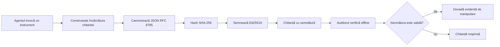

[Urmăriți videoclipul lecției: Securizarea agenților AI cu chitanțe criptografice](https://youtu.be/PLACEHOLDER_VIDEO_ID)

> _(Videoclipul lecției și miniatura vor fi adăugate de echipa Microsoft de conținut după îmbinare, potrivindu-se cu modelul lecțiilor 14 / 15.)_

# Securizarea agenților AI cu chitanțe criptografice

## Introducere

Această lecție va acoperi:

- De ce traseele de audit pentru agenții AI contează pentru conformitate, depanare și încredere.
- Ce este o chitanță criptografică și cum diferă de o linie nesemnată din jurnal.
- Cum să produci o chitanță semnată pentru apelul unui instrument al agentului în Python simplu.
- Cum să verifici o chitanță offline și să detectezi modificările neautorizate.
- Cum să lanțuiești chitanțele astfel încât ștergerea sau reordonarea uneia să rupă lanțul.
- Ce dovedesc chitanțele și ce nu dovedesc în mod explicit.

## Obiectivele de învățare

După ce parcurgeți această lecție, veți ști cum să:

- Identificați modurile de eșec care motivează proveniența criptografică pentru acțiunile agentului.
- Produceți o chitanță semnată Ed25519 peste un payload JSON canonic.
- Verificați o chitanță independent doar folosind cheia publică a semnatarului.
- Detectați modificările rerulând verificarea pe o chitanță modificată.
- Construiți o secvență de chitanțe lanțuite prin hash și explicați de ce lanțul contează.
- Recunoașteți limita dintre ceea ce dovedesc chitanțele (atribuire, integritate, ordonare) și ceea ce nu dovedesc (corectitudinea acțiunii, soliditatea politicii).

## Problema: Traseul de audit al agentului dvs.

Imaginați-vă că ați implementat un agent AI pentru Contoso Travel. Agentul citește solicitările clienților, apelează un API de zboruri pentru a căuta opțiuni și rezervă locuri în numele clientului. În ultimul trimestru, agentul a procesat 50.000 de rezervări.

Astăzi sosește un auditor. El pune o întrebare simplă: "Arătați-mi ce a făcut agentul dvs."

Îi oferiți fișierele dvs. de jurnal. Auditorul le analizează și pune o întrebare mai dificilă: "Cum știu că aceste jurnale nu au fost modificate?"

Aceasta este problema traseului de audit. Majoritatea implementărilor agenților astăzi se bazează pe:

- **Jurnale de aplicație**: scrise chiar de agent, editabile de oricine are acces la sistemul de fișiere.
- **Servicii cloud de logging**: cu evidență de modificări la nivel de platformă, dar doar dacă auditorul are încredere în operatorul platformei.
- **Jurnale de tranzacție ale bazei de date**: bine adaptate pentru modificările bazei, dar nu pentru apeluri arbitrare de instrumente.

Niciuna dintre acestea nu poate răspunde la întrebarea auditorului fără ca auditorul să aibă încredere în cineva (dumneavoastră, furnizorul cloud, un furnizor de baze de date). Pentru uz intern, această încredere este adesea acceptabilă. Pentru sarcini reglementate (finanțe, sănătate, orice supus Regulamentului AI al UE), nu este.

Chitanțele criptografice rezolvă această problemă făcând fiecare acțiune a agentului verificabilă independent. Auditorul nu trebuie să aibă încredere în dumneavoastră. Are nevoie doar de cheia dvs. publică și de chitanță.

## Ce este o chitanță criptografică?

O chitanță este un obiect JSON care înregistrează ce a făcut agentul, semnat cu o semnătură digitală.



O chitanță minimală arată astfel:

```json
{
  "type": "agent.tool_call.v1",
  "agent_id": "contoso-travel-bot",
  "tool_name": "lookup_flights",
  "tool_args_hash": "sha256:a3f9c1...",
  "result_hash": "sha256:7b2e1d...",
  "policy_id": "contoso-travel-policy-v3",
  "timestamp": "2026-04-25T14:30:00Z",
  "sequence": 47,
  "previous_receipt_hash": "sha256:9d4e6a...",
  "signature": {
    "alg": "EdDSA",
    "sig": "c5af83...",
    "public_key": "8f3b2c..."
  }
}
```

Trei proprietăți fac întreaga muncă:

1. **Semnătura**. Chitanța este semnată de gateway-ul agentului folosind o cheie privată Ed25519. Oricine are cheia publică corespunzătoare poate verifica semnătura offline. Orice modificare a unui câmp invalidă semnătura.

2. **Codificare canonică**. Înainte de semnare, chitanța este serializată folosind JSON Canonicalization Scheme (JCS, RFC 8785). Acest lucru asigură că două implementări care produc aceeași chitanță logică produc ieșire identică la nivel de octeți. Fără canonicizare, diferite serializatoare JSON ar produce semnături diferite pentru același conținut.

3. **Lanțuire prin hash**. Câmpul `previous_receipt_hash` leagă fiecare chitanță de cea precedentă. Ștergerea sau reordonarea unei chitanțe rupe toate chitanțele care vin după ea. Modificările neautorizate devin vizibile la nivel de lanț chiar dacă semnăturile individuale sunt ocolite.

Împreună, aceste proprietăți oferă trei garanții:

- **Atribuire**: această cheie a semnat acest conținut.
- **Integritate**: conținutul nu a fost modificat după semnare.
- **Ordonare**: această chitanță a venit după acea chitanță în lanț.

## Producerea unei chitanțe în Python

Nu aveți nevoie de o bibliotecă specială pentru a produce o chitanță. Primitivele criptografice sunt larg disponibile, iar logica este doar câteva zeci de linii de Python.

Exercițiile practice din `code_samples/18-signed-receipts.ipynb` parcurg întregul flux. Versiunea rezumată:

```python
import json
import hashlib
import base64
from nacl import signing
from jcs import canonicalize  # JSON canonic RFC 8785

def b64url_nopad(data: bytes) -> str:
    return base64.urlsafe_b64encode(data).decode("ascii").rstrip("=")

def sha256_canonical(obj) -> str:
    """SHA-256 of a Python object's JCS-canonical JSON form."""
    return f"sha256:{hashlib.sha256(canonicalize(obj)).hexdigest()}"

# Generează sau încarcă o cheie de semnare (în producție, stochează într-un seif pentru chei)
signing_key = signing.SigningKey.generate()
verify_key = signing_key.verify_key

# Construiește sarcina utilă a chitanței (încă fără semnătură)
tool_args = {"origin": "SYD", "destination": "LAX"}
tool_result = [{"flight": "QF11", "price": 1850, "stops": 0}]

payload = {
    "type": "agent.tool_call.v1",
    "agent_id": "contoso-travel-bot",
    "tool_name": "lookup_flights",
    "tool_args_hash": sha256_canonical(tool_args),
    "result_hash": sha256_canonical(tool_result),
    "policy_id": "contoso-travel-policy-v3",
    "timestamp": "2026-04-25T14:30:00Z",
    "sequence": 0,
    "previous_receipt_hash": None,
}

# Canonicalizează, aplică hash, semnează.
canonical_bytes = canonicalize(payload)
message_hash = hashlib.sha256(canonical_bytes).digest()
signature_bytes = signing_key.sign(message_hash).signature

# Atașează un obiect de semnătură structurat.
receipt = {
    **payload,
    "signature": {
        "alg": "EdDSA",
        "sig": b64url_nopad(signature_bytes),
        "public_key": b64url_nopad(bytes(verify_key)),
    },
}
```

Aceasta este întreaga linie de semnare. Exercițiile din notebook parcurg fiecare pas.

## Verificarea unei chitanțe și detectarea modificărilor neautorizate

Verificarea este operația inversă:

```python
import base64
import hashlib
from nacl import signing
from nacl.exceptions import BadSignatureError
from jcs import canonicalize

def b64url_decode(s: str) -> bytes:
    padding = "=" * ((4 - len(s) % 4) % 4)
    return base64.urlsafe_b64decode(s + padding)

def verify_receipt(receipt: dict) -> bool:
    # Semnătura este un obiect structurat: {"alg", "sig", "public_key"}.
    sig_obj = receipt.get("signature")
    if not sig_obj or sig_obj.get("alg") != "EdDSA":
        return False

    # Reconstruiește sarcina utilă care a fost de fapt semnată (totul în afară de semnătură).
    payload = {k: v for k, v in receipt.items() if k != "signature"}

    canonical_bytes = canonicalize(payload)
    message_hash = hashlib.sha256(canonical_bytes).digest()

    try:
        verify_key = signing.VerifyKey(b64url_decode(sig_obj["public_key"]))
        verify_key.verify(message_hash, b64url_decode(sig_obj["sig"]))
        return True
    except BadSignatureError:
        return False
```

Această funcție primește o chitanță și returnează `True` dacă semnătura este validă, `False` altfel. Fără apel rețea, fără dependență de serviciu, fără nevoie de încredere într-o terță parte.

Pentru a vedea detectarea modificărilor în acțiune, notebook-ul parcurge:

1. Producerea unei chitanțe valide și confirmarea verificării.
2. Modificarea unui octet în câmpul `tool_args_hash`.
3. Rerularea verificării și observarea eșecului.

Aceasta este demonstrația practică că chitanțele sunt evidente pentru modificări: orice modificare, oricât de mică, rupe semnătura.

## Lanțuirea chitanțelor pentru agenți multi-etapă

O singură chitanță semnată protejează o singură acțiune. Un lanț de chitanțe protejează o secvență.


Fiecare chitanță înregistrează hashul chitanței anterioare. Pentru a elimina silențios chitanța 2, un atacator ar trebui să:

- Modifice câmpul `previous_receipt_hash` al chitanței 3 (care rupe semnătura chitanței 3), SAU
- Falsifice o semnătură nouă pe o chitanță 3 modificată (ceea ce necesită cheia privată a agentului).

Dacă cheia privată este stocată într-un hardware key vault și publicați cheia publică cu fiecare chitanță, niciunul dintre atacuri nu este fezabil fără detectare.

Notebook-ul parcurge:

1. Construirea unui lanț de trei chitanțe.
2. Verificarea că `previous_receipt_hash` al fiecărei chitanțe corespunde cu hashul real al chitanței anterioare.
3. Modificarea unei chitanțe din mijloc și observarea ruperii lanțului exact în acel punct.

Așa produceți un traseu de audit pe care un auditor extern îl poate verifica fără să aibă încredere în dumneavoastră.

## Ce dovedesc chitanțele (și ce nu dovedesc)

Aceasta este cea mai importantă secțiune a lecției. Chitanțele sunt puternice, dar puterea lor este limitată.

**Chitanțele dovedesc trei lucruri:**

1. **Atribuirea**: o cheie specifică a semnat un payload specific.
2. **Integritatea**: payload-ul nu a fost modificat după semnare.
3. **Ordonarea**: această chitanță a venit după acea chitanță în lanțul de hash-uri.

**Chitanțele NU dovedesc:**

1. **Corectitudinea**: că acțiunea agentului a fost acțiunea corectă. O chitanță poate fi semnată pentru un răspuns greșit la fel de bine ca pentru unul corect.
2. **Conformitatea cu politica**: că politica indicată în `policy_id` a fost evaluată sau că ar fi permis această acțiune dacă ar fi fost verificată. Chitanța înregistrează ce s-a pretins, nu ce a fost aplicat.
3. **Identitatea dincolo de cheia criptografică**: chitanța spune "această cheie a semnat acest conținut." Nu spune "această persoană a autorizat acest lucru." Conectarea unei chei la o persoană sau organizație necesită infrastructură de identitate separată (director, registru de chei publice etc.).
4. **Adevărul intrărilor**: dacă agentul primește un prompt manipulat și acționează pe baza lui, chitanța înregistrează acțiunea fidel. Chitanțele sunt în aval față de validarea intrărilor, nu un substitut pentru aceasta.

Această limită contează din două motive:

- Vă spune pentru ce sunt utile chitanțele: pentru a face comportamentul agentului auditat și evident modificărilor neautorizate, chiar și peste limite organizaționale.
- Vă spune ce straturi suplimentare încă aveți nevoie: validarea intrărilor (Lecția 6), aplicarea politicilor (acoperită sumar mai jos) și infrastructura de identitate (în afara scopului acestei lecții).

O greșeală frecventă este să asumați că "avem chitanțe" înseamnă "suntem guvernați." Nu este așa. Chitanțele sunt o fundație. Guvernanța este sistemul pe care îl construiți deasupra.

## Referințe de producție

Codul Python din această lecție este intenționat minimal pentru ca să puteți citi fiecare linie și să înțelegeți exact ce se întâmplă. În producție, aveți două opțiuni:

1. **Construiți direct pe primitivele criptografice.** Cele 50 de linii pe care le-ați văzut mai sus sunt suficiente pentru multe cazuri de utilizare. PyNaCl (Ed25519) și pachetul `jcs` (JSON canonic) sunt biblioteci bine întreținute și auditate.

2. **Folosiți o bibliotecă de producție pentru chitanțe.** Mai multe proiecte open-source implementează același model cu funcționalități suplimentare (rotirea cheilor, verificare în batch, distribuție JWK Set, integrare cu motoare de politici):
   - Formatul chitanței folosit în această lecție urmează un Internet-Draft IETF (`draft-farley-acta-signed-receipts`) aflat în proces de standardizare.
   - Microsoft Agent Governance Toolkit compune chitanțele cu decizii de politică bazate pe Cedar; vedeți Tutorialul 33 din acel depozit pentru un exemplu de la cap la coadă.
   - Pachetele `protect-mcp` (npm) și `@veritasacta/verify` (npm) oferă o implementare Node de semnare a chitanțelor și verificare offline, destinată să învăluie orice server MCP cu un traseu de audit evident modificărilor.

Decizia între a vă face singur și a folosi o bibliotecă seamănă cu decizia de a scrie propria bibliotecă JWT sau de a folosi una testată: ambele sunt rezonabile; biblioteca economisește timp și reduce suprafața de audit; abordarea from-scratch vă forțează să înțelegeți fiecare primitiv. Această lecție predă calea from-scratch astfel încât să aveți baza pentru oricare alegere.

## Verificarea cunoștințelor

Testați-vă înțelegerea înainte de a trece la exercițiul practic.

**1. O chitanță este semnată cu cheia privată Ed25519 a agentului. Auditorul are doar cheia publică. Poate auditorul să verifice chitanța offline?**

<details>
<summary>Răspuns</summary>

Da. Verificarea Ed25519 necesită doar cheia publică și octeții semnați. Fără apel de rețea, fără dependență de serviciu. Aceasta este proprietatea care face chitanțele utile în medii izolate (air-gapped), multi-organizaționale sau cu încredere redusă în audituri.
</details>

**2. Un atacator modifică câmpul `policy_id` al unei chitanțe pentru a pretinde că a fost guvernat de o politică mai permisivă. Semnătura a fost făcută peste payload-ul original. Ce se întâmplă la verificare?**

<details>
<summary>Răspuns</summary>

Verificarea eșuează. Semnătura a fost calculată peste octeții canonici ai payload-ului original; modificarea oricărui câmp schimbă octeții canonici, schimbă hash-ul SHA-256, ceea ce face semnătura invalidă. Atacatorul ar avea nevoie de cheia privată pentru a produce o semnătură nouă validă, care nu o are.
</details>

**3. De ce include chitanța un `tool_args_hash` și un `result_hash` în loc să conțină argumentele și rezultatul brute?**

<details>
<summary>Răspuns</summary>

Două motive. Primul, chitanța poate trebui arhivată sau transmisă în medii unde divulgarea conținutului brut (informații personale, date de business) este o problemă. Hash-urile mențin chitanța mică și conținutul privat; auditorul verifică că hash-ul corespunde unei copii stocate separat. Al doilea, hash-urile au o dimensiune fixă; o chitanță cu hash-uri are o dimensiune limitată indiferent cât de mari au fost intrările și ieșirile.
</details>

**4. Câmpul `previous_receipt_hash` leagă fiecare chitanță de precedenta sa. Dacă un atacator șterge silențios o chitanță din mijlocul lanțului, ce devine invalid?**

<details>
<summary>Răspuns</summary>

Toate chitanțele care au venit după cea ștearsă. Câmpurile lor `previous_receipt_hash` nu mai corespund lanțului real (pentru că chitanța referențiată nu mai există sau lanțul face acum referire la un alt precedent). Pentru a ascunde ștergerea, atacatorul ar trebui să resemneze fiecare chitanță ulterioară, ceea ce necesită cheia privată.
</details>

**5. O chitanță se verifică corect. Dovedește asta că acțiunea agentului a fost corectă, solidă sau conformă cu politica?**

<details>
<summary>Răspuns</summary>

Nu. O chitanță validă dovedește trei lucruri: atribuirea (această cheie a semnat acest conținut), integritatea (conținutul nu s-a schimbat) și ordonarea (această chitanță a venit după acea chitanță). NU dovedește că acțiunea a fost corectă, că politica din `policy_id` a fost evaluată sau că agentul a respectat toate regulile. Chitanțele fac comportamentul agentului auditat, nu neapărat corect. Aceasta este limita cea mai importantă în lecție.
</details>

## Exercițiu practic

Deschideți `code_samples/18-signed-receipts.ipynb` și finalizați toate cele patru secțiuni:

1. **Secțiunea 1**: Semnează prima ta chitanță și verifică-o.
2. **Secțiunea 2**: Modifică chitanța și observă eșecul verificării.
3. **Secțiunea 3**: Construiește un lanț de trei chitanțe și verifică integritatea lanțului.
4. **Secțiunea 4**: Aplică modelul unui agent construit cu Microsoft Agent Framework: învăluie un apel de instrument în semnarea chitanței, apoi verifică chitanța independent.

**Provocare suplimentară 1:** extinde schema chitanței cu un câmp suplimentar ales de tine (de exemplu, un ID de solicitare pentru trasabilitate), actualizează logica canonică de semnare să îl includă și confirmă că chitanța încă trece prin verificare. Apoi modifică câmpul după semnare și confirmă că verificarea eșuează. Aceasta te forțează să înțelegi cum contribuie fiecare octet din codificarea canonică la semnătură.
**Provocare extinsă 2:** Aplicați SHA-256 la două dintre chitanțele dvs. împreună (concatenați octeții canonici într-o ordine deterministă) și încorporați digestul rezultat ca un câmp nou pe o a treia chitanță înainte de a o semna. Verificați că toate cele trei chitanțe se pot verifica printr-un proces round-trip. Tocmai ați construit o probă de includere într-un singur pas: oricine deține a treia chitanță poate demonstra că primele două existau la momentul semnării, fără a fi nevoie să divulge conținutul lor. Acesta este modelul pe care îl folosesc chitanțele cu dezvăluire selectivă la scară (angajamente Merkle, RFC 6962).

## Concluzie

Chitanțele criptografice oferă agenților AI un traseu de audit care este:

- **Verificabil independent**: orice parte cu cheia publică poate verifica, fără dependență de servicii.
- **Evident falsificabil**: orice modificare invalidează semnătura.
- **Portabil**: o chitanță este un fișier JSON mic; poate fi arhivată, transmisă și verificată oriunde.
- **Aliniat la standarde**: bazat pe Ed25519 (RFC 8032), JCS (RFC 8785) și SHA-256, toate fiind primitive larg utilizate.

Ele nu sunt un substitut pentru validarea inputului, aplicarea politicii sau infrastructura de identitate. Ele sunt o bază pentru aceste straturi. Când implementați agenți în sarcini reglementate, fluxuri de lucru multi-organizaționale sau orice mediu în care un auditor viitor nu poate presupune că vă are încredere, chitanțele sunt modul în care faceți traseul de audit onest.

Cel mai important aspect: chitanțele dovedesc cine a spus ce și când. Ele nu demonstrează că ceea ce s-a spus este adevărat sau corect. Păstrați această distincție strictă. Este diferența dintre un sistem de proveniență onest și unul înșelător.

## Lista de verificare pentru producție

Când sunteți gata să treceți de la această lecție la implementarea agenților semnați cu chitanțe într-un mediu real:

- [ ] **Mutați cheia de semnare de pe laptopul dezvoltatorului.** Utilizați Azure Key Vault, AWS KMS sau un modul hardware de securitate. Cheia privată care semnează chitanțele dvs. nu trebuie să existe niciodată în controlul sursei sau în formă clară pe mașinile aplicației.
- [ ] **Publicați cheia publică pentru verificare.** Auditorii au nevoie de ea pentru a verifica offline. Modelul standard este un set JWK la o adresă URL cunoscută (RFC 7517), de exemplu, `https://your-org.example.com/.well-known/agent-keys.json`.
- [ ] **Ancorează lanțul extern.** Periodic scrieți hash-ul celei mai recente capete a lanțului într-un jurnal de transparență (Sigstore Rekor, o autoritate de timestamp RFC 3161 sau un sistem intern secundar) astfel încât o parte externă să poată confirma „acest lanț a existat la acest moment.”
- [ ] **Stocați chitanțele imuabil.** Stocarea de tip append-only blob (Azure Storage cu politici de imuabilitate, AWS S3 Object Lock) împiedică un insider să rescrie istoria la nivelul stocării.
- [ ] **Decideți asupra păstrării.** Multe regimuri de conformitate cer păstrarea pe mai mulți ani. Planificați creșterea chitanțelor (fiecare chitanță are ~500 de octeți; un agent care face 10K apeluri pe zi produce ~1,8 GB pe an).
- [ ] **Documentați ce nu acoperă chitanțele.** Chitanțele dovedesc atribuirea, integritatea și ordonarea. Manualul dvs. de proceduri trebuie să listeze explicit ce controale suplimentare (validarea inputului, aplicarea politicii, limitarea ratei, infrastructura de identitate) se regăsesc alături de chitanțe în postura dvs. de guvernanță.

### Mai aveți întrebări despre securizarea agenților AI?

Alăturați-vă serverului [Microsoft Foundry Discord](https://aka.ms/ai-agents/discord) pentru a întâlni alți cursanți, a participa la ore de consultanță și a vă clarifica întrebările despre Agenții AI.

## Dincolo de această lecție

Această lecție acoperă semnarea cu o singură chitanță și secvențe cu lanț hash. Aceleași primitive compun mai multe modele avansate pe care le puteți întâlni pe măsură ce postura dvs. de guvernanță se maturizează:

- **Dezvăluire selectivă.** Când câmpurile unei chitanțe sunt angajate independent (arbore Merkle în stil RFC 6962), puteți revela câmpuri specifice unor auditori specifici și demonstra că restul au rămas neschimbate fără a le expune. Util atunci când aceeași chitanță trebuie să satisfacă simultan un audit cuprinzător (care dorește completitudine) și reglementări de minimalizare a datelor precum GDPR (care doresc ca auditorul să vadă cât mai puțin posibil).
- **Revocarea chitanțelor.** Dacă o cheie de semnare a fost compromisă, aveți nevoie de o modalitate de a marca toate chitanțele semnate cu acea cheie ca neîncredibile începând de la un anumit moment. Modele standard: chei de semnare cu durată scurtă plus o listă publicată de revocare sau un jurnal de transparență cu intrări de revocare.
- **Chitanțe bilaterale / cu semnătură divizată.** Unele implementări împart încărcătura semnată în jumătăți pre-execuție (`authorization_*`) și post-execuție (`result_*`) cu semnături independente, utile când decizia de autorizare și rezultatul observat sunt produse de actori diferiți sau în momente diferite. Aceasta se adaugă peste formatul de chitanță predat în această lecție.
- **Compoziția încărcăturii.** O chitanță sigilează oricare octeți pe care îi puneți în `result_hash`. Încărcăturile din lumea reală sunt adesea mai bogate decât un simplu rezultat de apel: raționamente pre-decisionale (predicția modelului, opțiunile considerate, dovezile și gradul lor de completitudine, postura de risc, lanțul de responsabilitate, rezultatul blocajului) pot trăi toate în încărcătură, sigilate de o singură chitanță. Aceasta păstrează formatul chitanței minimal în timp ce permite evoluții ale schemelor de încărcătură pe domenii.
- **Conformitate cross-implementare.** Multiple implementări independente ale aceluiași format de chitanță (Python, TypeScript, Rust, Go) verifică reciproc vectori de test comuni. Dacă vă construiți propria implementare, validarea față de vectori publicați confirmă compatibilitatea la nivel de fir de date.
- **Migrarea post-cuantică.** Ed25519 este larg implementat astăzi, dar nu este rezistent la computere cuantice. Formatul chitanței este agil din punct de vedere algoritmic: câmpul `signature.alg` poate purta `ML-DSA-65` (standardul NIST pentru semnături post-cuantic) când trebuie să migrați. Planificați o perioadă de tranziție în care chitanțele sunt semnate dublu.

## Resurse suplimentare

- <a href="https://datatracker.ietf.org/doc/draft-farley-acta-signed-receipts/" target="_blank">IETF Internet-Draft: Chitanțe de decizie semnate pentru control acces mașină-la-mașină</a>
- <a href="https://learn.microsoft.com/azure/ai-studio/responsible-use-of-ai-overview" target="_blank">Prezentare generală AI responsabilă (Azure AI)</a>
- <a href="https://datatracker.ietf.org/doc/html/rfc8032" target="_blank">RFC 8032: Algoritmul de semnătură digitală Edwards-Curve (EdDSA)</a>
- <a href="https://datatracker.ietf.org/doc/html/rfc8785" target="_blank">RFC 8785: Schematizarea canonică JSON (JCS)</a>
- <a href="https://datatracker.ietf.org/doc/html/rfc6962" target="_blank">RFC 6962: Transparența certificatelor</a> (construcția arborelui Merkle folosită de chitanțele cu dezvăluire selectivă)
- <a href="https://github.com/microsoft/agent-governance-toolkit/blob/main/docs/tutorials/33-offline-verifiable-receipts.md" target="_blank">Microsoft Agent Governance Toolkit, Tutorial 33: Chitanțe de decizie verificabile offline</a>
- <a href="https://github.com/ScopeBlind/agent-governance-testvectors" target="_blank">Vectori de test de conformitate cross-implementare</a> pentru formatul chitanței folosit în această lecție (Apache-2.0)
- <a href="https://pynacl.readthedocs.io/" target="_blank">Documentația PyNaCl</a> (Ed25519 în Python)

## Lecția anterioară

[Construirea agenților pentru utilizarea calculatorului (CUA)](../15-browser-use/README.md)

## Lecția următoare

_(Va fi decisă de administratorii curricula)_

---

<!-- CO-OP TRANSLATOR DISCLAIMER START -->
**Declinare a responsabilității**:
Acest document a fost tradus folosind serviciul de traducere AI [Co-op Translator](https://github.com/Azure/co-op-translator). În timp ce ne străduim pentru acuratețe, vă rugăm să rețineți că traducerile automate pot conține erori sau inexactități. Documentul original în limba sa nativă trebuie considerat sursa autorizată. Pentru informații critice, se recomandă traducerea profesională realizată de un om. Nu ne asumăm responsabilitatea pentru eventualele neînțelegeri sau interpretări greșite care decurg din utilizarea acestei traduceri.
<!-- CO-OP TRANSLATOR DISCLAIMER END -->