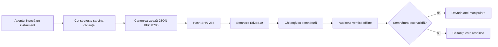
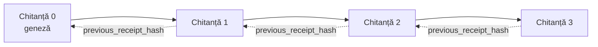

[Urmăriți videoclipul lecției: Asigurarea agenților AI cu chitanțe criptografice](https://youtu.be/PLACEHOLDER_VIDEO_ID)

> _(Videoclipul lecției și miniatura vor fi adăugate de echipa de conținut Microsoft după fuziune, respectând modelul lecției 14 / 15.)_

# Asigurarea agenților AI cu chitanțe criptografice

## Introducere

Această lecție va acoperi:

- De ce sunt importante traseele de audit pentru agenții AI în scopuri de conformitate, depanare și încredere.
- Ce este o chitanță criptografică și cum diferă de o linie de jurnal nesemnată.
- Cum să produci o chitanță semnată pentru un apel de unealtă al agentului folosind Python simplu.
- Cum să verifici o chitanță offline și să detectezi modificări neautorizate.
- Cum să conectezi chitanțele astfel încât ștergerea sau reordonarea uneia să rupă lanțul.
- Ce dovedesc chitanțele și ce nu dovedesc în mod explicit.

## Obiective de învățare

După finalizarea acestei lecții, veți ști să:

- Identificați modurile de eșec care motivează proveniența criptografică pentru acțiunile agentului.
- Produceți o chitanță semnată Ed25519 peste o încărcătură JSON canonică.
- Verificați o chitanță independent folosind doar cheia publică a semnatarului.
- Detectați modificările prin reexecutarea verificării pe o chitanță modificată.
- Construiți o secvență de chitanțe conectate prin hash și explicați de ce lanțul contează.
- Recunoașteți limita dintre ceea ce dovedesc chitanțele (atribuirea, integritatea, ordonarea) și ceea ce nu dovedesc (corectitudinea acțiunii, soliditatea politicii).

## Problema: Traseul de audit al agentului dvs.

Imaginați-vă că ați implementat un agent AI pentru Contoso Travel. Agentul citește cererile clienților, apelează un API pentru zboruri pentru a căuta opțiuni și rezervă locuri în numele clientului. În ultimul trimestru, agentul a procesat 50.000 de rezervări.

Astăzi sosește un auditor. Întrebarea lor este simplă: „Arată-mi ce a făcut agentul tău.”

I-ați furnizat fișierele de jurnal. Auditorul le privește și pune întrebarea mai dificilă: „Cum știu că aceste jurnale nu au fost editate?”

Aceasta este problema traseului de audit. Majoritatea implementărilor de agenți se bazează astăzi pe:

- **Jurnale de aplicație**: scrise chiar de agent, editabile de oricine are acces la sistemul de fișiere.
- **Servicii de jurnalizare în cloud**: evidențiază modificările la nivel de platformă doar dacă auditorul are încredere în operatorul platformei.
- **Jurnale de tranzacții din baze de date**: potrivite pentru modificările bazei de date, dar nu pentru apeluri arbitrare de unelte.

Niciunul dintre acestea nu poate răspunde întrebării auditorului fără ca acesta să aibă încredere în cineva (în dvs., în furnizorul dvs. de cloud sau în producătorul bazei de date). Pentru uz intern, această încredere este adesea acceptabilă. Pentru sarcini reglementate (finanțe, sănătate, orice este supus Regulamentului UE AI), nu este.

Chitanțele criptografice rezolvă această problemă făcând fiecare acțiune a agentului verificabilă independent. Auditorul nu trebuie să aibă încredere în dvs. Are nevoie doar de cheia dvs. publică și de chitanță însăși.

## Ce este o chitanță criptografică?

O chitanță este un obiect JSON care înregistrează ce a făcut agentul, semnat cu o semnătură digitală.


  
O chitanță minimală arată astfel:

```json
{
  "type": "agent.tool_call.v1",
  "agent_id": "contoso-travel-bot",
  "tool_name": "lookup_flights",
  "tool_args_hash": "sha256:a3f9c1...",
  "result_hash": "sha256:7b2e1d...",
  "policy_id": "contoso-travel-policy-v3",
  "timestamp": "2026-04-25T14:30:00Z",
  "sequence": 47,
  "previous_receipt_hash": "sha256:9d4e6a...",
  "signature": {
    "alg": "EdDSA",
    "sig": "c5af83...",
    "public_key": "8f3b2c..."
  }
}
```
  
Trei proprietăți fac toată treaba:

1. **Semnătura**. Chitanța este semnată de gateway-ul agentului folosind o cheie privată Ed25519. Oricine are cheia publică corespunzătoare poate verifica semnătura offline. Orice modificare a unui câmp invalidează semnătura.

2. **Codificare canonică**. Înainte de semnare, chitanța este serializată folosind JSON Canonicalization Scheme (JCS, RFC 8785). Acest lucru asigură că două implementări care produc aceeași chitanță logică produc ieșire identică la nivel de octeți. Fără canonicalizare, diverși serializeri JSON ar produce semnături diferite pentru același conținut.

3. **Lanț de hash-uri**. Câmpul `previous_receipt_hash` leagă fiecare chitanță cu cea anterioară. Eliminarea sau reordonarea unei chitanțe rupe toate chitanțele care au urmat după aceea. Modificările devin vizibile la nivel de lanț chiar dacă semnăturile individuale sunt ocolite.

Împreună, aceste proprietăți oferă trei garanții:

- **Atribuire**: această cheie a semnat acest conținut.
- **Integritate**: conținutul nu a fost modificat după semnare.
- **Ordonare**: această chitanță a fost generată după cealaltă din lanț.

## Producerea unei chitanțe în Python

Nu aveți nevoie de o bibliotecă specială pentru a produce o chitanță. Primitivele criptografice sunt larg disponibile, iar logica este de câteva zeci de linii de Python.

Exercițiile practice din `code_samples/18-signed-receipts.ipynb` parcurg fluxul complet. Varianta rezumată:

```python
import json
import hashlib
import base64
from nacl import signing
from jcs import canonicalize  # JSON canonic RFC 8785

def b64url_nopad(data: bytes) -> str:
    return base64.urlsafe_b64encode(data).decode("ascii").rstrip("=")

def sha256_canonical(obj) -> str:
    """SHA-256 of a Python object's JCS-canonical JSON form."""
    return f"sha256:{hashlib.sha256(canonicalize(obj)).hexdigest()}"

# Generează sau încarcă o cheie de semnare (în producție, stochează într-un seif de chei)
signing_key = signing.SigningKey.generate()
verify_key = signing_key.verify_key

# Construiește conținutul chitanței (fără semnătură încă)
tool_args = {"origin": "SYD", "destination": "LAX"}
tool_result = [{"flight": "QF11", "price": 1850, "stops": 0}]

payload = {
    "type": "agent.tool_call.v1",
    "agent_id": "contoso-travel-bot",
    "tool_name": "lookup_flights",
    "tool_args_hash": sha256_canonical(tool_args),
    "result_hash": sha256_canonical(tool_result),
    "policy_id": "contoso-travel-policy-v3",
    "timestamp": "2026-04-25T14:30:00Z",
    "sequence": 0,
    "previous_receipt_hash": None,
}

# Canonicalizează, hash-uiește, semnează.
canonical_bytes = canonicalize(payload)
message_hash = hashlib.sha256(canonical_bytes).digest()
signature_bytes = signing_key.sign(message_hash).signature

# Atașează un obiect de semnătură structurat.
receipt = {
    **payload,
    "signature": {
        "alg": "EdDSA",
        "sig": b64url_nopad(signature_bytes),
        "public_key": b64url_nopad(bytes(verify_key)),
    },
}
```
  
Aceasta este întreaga conductă de semnare. Exercițiile din notebook parcurg fiecare pas.

## Verificarea unei chitanțe și detectarea modificărilor

Verificarea este operația inversă:

```python
import base64
import hashlib
from nacl import signing
from nacl.exceptions import BadSignatureError
from jcs import canonicalize

def b64url_decode(s: str) -> bytes:
    padding = "=" * ((4 - len(s) % 4) % 4)
    return base64.urlsafe_b64decode(s + padding)

def verify_receipt(receipt: dict) -> bool:
    # Semnătura este un obiect structurat: {"alg", "sig", "public_key"}.
    sig_obj = receipt.get("signature")
    if not sig_obj or sig_obj.get("alg") != "EdDSA":
        return False

    # Reconstruiește încărcătura care a fost de fapt semnată (totul în afară de semnătură).
    payload = {k: v for k, v in receipt.items() if k != "signature"}

    canonical_bytes = canonicalize(payload)
    message_hash = hashlib.sha256(canonical_bytes).digest()

    try:
        verify_key = signing.VerifyKey(b64url_decode(sig_obj["public_key"]))
        verify_key.verify(message_hash, b64url_decode(sig_obj["sig"]))
        return True
    except BadSignatureError:
        return False
```
  
Această funcție primește o chitanță și returnează `True` dacă semnătura este validă, `False` altfel. Nu există apeluri de rețea, nicio dependență de serviciu, nicio încredere necesară într-o terță parte.

Pentru a vedea detectarea modificărilor în acțiune, notebook-ul parcurge:

1. Producerea unei chitanțe valide și confirmarea verificării sale.
2. Modificarea unui octet din câmpul `tool_args_hash`.
3. Reexecutarea verificării și observarea eșecului.

Aceasta este demonstrația practică că chitanțele sunt evidente la modificări: orice modificare, oricât de mică, rupe semnătura.

## Conectarea chitanțelor pentru agenții cu mai mulți pași

O singură chitanță semnată protejează o acțiune. Un lanț de chitanțe protejează o secvență.


  
Fiecare chitanță înregistrează hash-ul chitanței precedente. Pentru a elimina silențios chitanța 2, un atacator ar trebui fie să:

- Modifice câmpul `previous_receipt_hash` al chitanței 3 (rupe semnătura chitanței 3), SAU
- Forgeze o semnătură nouă pe o chitanță 3 modificată (necesită cheia privată a agentului).

Dacă cheia privată este într-un seif hardware și publicați cheia publică cu fiecare chitanță, niciunul dintre aceste atacuri nu este fezabil fără detectare.

Notebook-ul parcurge:

1. Construirea unui lanț de trei chitanțe.
2. Verificarea faptului că `previous_receipt_hash` al fiecărei chitanțe corespunde hash-ului real al chitanței anterioare.
3. Modificarea unei chitanțe din mijloc și observarea ruperii lanțului exact în acel punct.

Așa produceți un traseu de audit pe care un auditor extern îl poate verifica fără a avea încredere în dvs.

## Ce dovedesc chitanțele (și ce nu dovedesc)

Aceasta este cea mai importantă secțiune a lecției. Chitanțele sunt puternice, dar puterea lor este limitată.

**Chitanțele dovedesc trei lucruri:**

1. **Atribuire**: o cheie specifică a semnat o încărcătură specifică.
2. **Integritate**: încărcătura nu s-a schimbat de la semnare.
3. **Ordonare**: această chitanță a fost generată după cealaltă în lanțul de hash.

**Chitanțele NU dovedesc:**

1. **Corectitudinea**: că acțiunea agentului a fost cea corectă. O chitanță poate fi semnată pentru un răspuns greșit la fel de bine ca pentru unul corect.
2. **Conformitatea cu politica**: că politica referențiată în `policy_id` a fost evaluată sau că ar fi permis această acțiune în cazul verificării. Chitanța înregistrează ceea ce s-a pretins, nu ce a fost aplicat.
3. **Identitatea dincolo de cheie**: chitanța spune „această cheie a semnat acest conținut.” Nu spune „această persoană a autorizat acest lucru.” Legătura dintre o cheie și o persoană sau organizație necesită infrastructură de identitate separată (un director, un registru de chei publice etc.).
4. **Veridicitatea inputurilor**: dacă agentul primește un prompt manipulat și acționează pe baza acestuia, chitanța înregistrează acțiunea fidel. Chitanțele sunt în aval față de validarea inputurilor, nu un substitut pentru aceasta.

Această limită contează din două motive:

- Vă spune pentru ce sunt utile chitanțele: pentru a face comportamentul agentului auditat și evident la modificări, chiar și peste granițele organizaționale.
- Vă spune ce straturi suplimentare încă aveți nevoie: validarea inputurilor (Lecția 6), aplicarea politicii (acoperită sumar mai jos) și infrastructura de identitate (în afara domeniului acestei lecții).

O greșeală comună este să presupunem că „avem chitanțe” înseamnă „suntem guvernați.” Nu este așa. Chitanțele sunt o fundație. Guvernanța este sistemul pe care îl construiți deasupra.

## Referințe pentru producție

Codul Python din această lecție este intenționat minimal pentru a putea citi fiecare linie și a înțelege exact ce se întâmplă. În producție, aveți două opțiuni:

1. **Construiți direct pe primitivele criptografice.** Cele 50 de linii văzute mai sus sunt suficiente pentru multe cazuri de utilizare. PyNaCl (Ed25519) și pachetul `jcs` (JSON canonic) sunt biblioteci bine întreținute și auditate.

2. **Folosiți o bibliotecă de chitanțe de producție.** Mai multe proiecte open-source implementează același tipar cu funcționalități suplimentare (rotația cheilor, verificarea în lot, distribuirea setului JWK, integrare cu motoare de politică):
   - Formatul chitanței folosit în această lecție urmează un Internet-Draft IETF (`draft-farley-acta-signed-receipts`) aflat în proces de standardizare.
   - Microsoft Agent Governance Toolkit combină chitanțele cu decizii de politică bazate pe Cedar; vezi Tutorialul 33 din acel depozit pentru un exemplu complet.
   - Pachetele `protect-mcp` (npm) și `@veritasacta/verify` (npm) oferă o implementare Node pentru semnarea și verificarea offline a chitanțelor, destinată învelirii oricărui server MCP cu un traseu de audit evident la modificări.
   - SDK-ul Python **[nobulex](https://github.com/arian-gogani/nobulex)** (`pip install nobulex`) oferă același tipar de semnare Ed25519 + JCS în Python cu integrări LangChain și CrewAI, incluzând vectori de testare publicați pentru validare încrucișată și o mapare pentru conformitate oferită prin [PR OWASP #2210](https://github.com/OWASP/CheatSheetSeries/pull/2210).

Decizia între a scrie propria soluție și a folosi o bibliotecă reflectă decizia dintre scrierea propriei biblioteci JWT și utilizarea uneia testate: ambele sunt rezonabile; biblioteca economisește timp și reduce suprafața de audit; abordarea de la zero vă forțează să înțelegeți fiecare primitiv. Această lecție vă învață calea de la zero pentru a avea fundația pentru oricare dintre alegeri.

## Verificare a cunoștințelor

Testați-vă înțelegerea înainte de a trece la exercițiul practic.

**1. O chitanță este semnată cu cheia privată Ed25519 a agentului. Auditorul are doar cheia publică. Poate auditorul verifica chitanța offline?**

<details>
<summary>Răspuns</summary>

Da. Verificarea Ed25519 necesită doar cheia publică și octeții semnați. Niciun apel de rețea, nicio dependență de serviciu. Aceasta este proprietatea care face chitanțele utile în medii izolate, multi-organizaționale sau cu încredere scăzută.
</details>

**2. Un atacator modifică câmpul `policy_id` al unei chitanțe pentru a pretinde că a fost guvernată de o politică mai permisivă. Semnătura fusese calculată pe încărcătura originală. Ce se întâmplă la verificare?**

<details>
<summary>Răspuns</summary>

Verificarea eșuează. Semnătura a fost calculată peste octeții canonici ai încărcăturii originale; modificarea oricărui câmp schimbă octeții canonici, ceea ce schimbă hash-ul SHA-256, ceea ce face semnătura invalidă. Atacatorul ar avea nevoie de cheia privată pentru a produce o semnătură nouă validă, pe care nu o deține.
</details>

**3. De ce chitanța include un `tool_args_hash` și un `result_hash` în loc să conțină argumentele și rezultatul brut?**

<details>
<summary>Răspuns</summary>

Din două motive. În primul rând, chitanța poate trebui arhivată sau transmisă în medii în care dezvăluirea conținutului brut (date personale, date de afaceri) este o problemă. Hash-urile mențin chitanța mică și conținutul privat; auditorul verifică că hash-ul corespunde unei copii separate stocate a conținutului real. În al doilea rând, hash-urile au o dimensiune fixă; o chitanță cu hash-uri are o dimensiune limitată indiferent de cât de mari au fost intrările și ieșirile.
</details>

**4. Câmpul `previous_receipt_hash` leagă fiecare chitanță de cea anterioară. Dacă un atacator șterge silențios o chitanță din mijlocul lanțului, ce devine invalid?**

<details>
<summary>Răspuns</summary>

Fiecare chitanță care a urmat după cea ștearsă. Câmpurile lor `previous_receipt_hash` nu mai corespund lanțului real (pentru că chitanța la care făceau referire nu mai există sau lanțul indică acum un predecesor diferit). Pentru a ascunde ștergerea, atacatorul ar trebui să resemneze fiecare chitanță ulterioară, ceea ce necesită cheia privată.
</details>

**5. O chitanță este verificată corect. Aceasta dovedește că acțiunea agentului a fost corectă, solidă sau conformă cu politica?**

<details>
<summary>Răspuns</summary>

Nu. O chitanță validă dovedește trei lucruri: atribuirea (această cheie a semnat acest conținut), integritatea (conținutul nu s-a schimbat) și ordonarea (această chitanță a venit după cealaltă). NU dovedește că acțiunea a fost corectă, că politica indicată în `policy_id` a fost evaluată sau că agentul a respectat toate regulile. Chitanțele fac comportamentul agentului auditat, nu neapărat corect. Aceasta este cea mai importantă limită din lecție.
</details>

## Exercițiu practic

Deschideți `code_samples/18-signed-receipts.ipynb` și finalizați toate cele patru secțiuni:

1. **Secțiunea 1**: Semnați prima chitanță și verificați-o.
2. **Secțiunea 2**: Modificați chitanța și observați că verificarea eșuează.
3. **Secțiunea 3**: Construiți un lanț de trei chitanțe și verificați integritatea lanțului.
4. **Secțiunea 4**: Aplicați modelul unui agent construit cu Microsoft Agent Framework: înveliți un apel de unealtă în semnarea chitanței, apoi verificați chitanța independent.
**Provocare suplimentară 1:** extinde schema chitanței cu un câmp suplimentar ales de tine (de exemplu, un ID de cerere pentru trasabilitate), actualizează logica canonică de semnare pentru a-l include și confirmă că chitanța trece în continuare verificarea în ambele sensuri. Apoi modifică câmpul după semnare și confirmă că verificarea eșuează. Aceasta te forțează să înțelegi cum fiecare octet al codificării canonice contribuie la semnătură.

**Provocare suplimentară 2:** aplică un hash SHA-256 asupra a două dintre chitanțele tale împreună (concatenează octeții canonici într-o ordine deterministă) și încorporează digestul rezultat ca un câmp nou pe o a treia chitanță înainte de a o semna. Verifică că toate cele trei chitanțe trec în continuare verificarea în ambele sensuri. Tocmai ai construit o probă de includere într-un singur pas: oricine deține a treia chitanță poate dovedi că primele două existau în momentul semnării, fără a fi nevoie să dezvăluie conținutul lor. Acesta este modelul pe care chitanțele cu dezvăluire selectivă îl folosesc la scară largă (angajamente Merkle, RFC 6962).

## Concluzie

Chitanțele criptografice oferă agenților AI o pistă de audit care este:

- **Verificabilă independent**: orice parte cu cheia publică poate verifica, fără dependență de serviciu.
- **Evident împotriva modificărilor**: orice modificare invalidează semnătura.
- **Portabilă**: o chitanță este un fișier JSON mic; poate fi arhivată, transmisă și verificată oriunde.
- **Aliniată la standarde**: construită pe Ed25519 (RFC 8032), JCS (RFC 8785) și SHA-256, toate primitive larg utilizate.

Ele nu înlocuiesc validarea inputului, aplicarea politicilor sau infrastructura de identitate. Sunt o fundație pentru aceste straturi. Când implementezi agenți în sarcini reglementate, fluxuri de lucru multi-organizaționale sau orice mediu în care un auditor viitor nu poate fi presupus a avea încredere în tine, chitanțele sunt modul în care faci pista de audit onestă.

Cea mai importantă concluzie: chitanțele dovedesc cine a spus ce și când. Nu dovedesc că ceea ce s-a spus era adevărat sau corect. Ține ferm această distincție. Este diferența între un sistem de proveniență onest și unul înșelător.

## Listă de verificare pentru producție

Când ești gata să treci de la această lecție la implementarea agenților semnați cu chitanțe într-un mediu real:

- [ ] **Mută cheia de semnare de pe laptopul dezvoltatorului.** Folosește Azure Key Vault, AWS KMS sau un modul hardware de securitate. Cheia privată care semnează chitanțele tale nu trebuie să fie niciodată în controlul sursei sau în text clar pe mașinile aplicației.
- [ ] **Publică cheia publică de verificare.** Auditorii au nevoie de ea pentru verificare offline. Modelul standard este un Set JWK la o adresă URL bine cunoscută (RFC 7517), de ex. `https://your-org.example.com/.well-known/agent-keys.json`.
- [ ] **Ancorează lanțul extern.** Periodic scrie hash-ul capului de lanț într-un jurnal de transparență (Sigstore Rekor, autoritate de timestamp RFC 3161 sau un al doilea sistem intern) astfel încât o parte externă să poată confirma „acest lanț exista în acest moment.”
- [ ] **Stochează chitanțele imuabil.** Stocare blob doar de tip append (Azure Storage cu politici de imuabilitate, AWS S3 Object Lock) previne rescrierea istoriei de către un insider la nivelul stocării.
- [ ] **Decide politica de retenție.** Multe regimuri de conformitate cer păstrare pe mai mulți ani. Planifică creșterea volumului de chitanțe (fiecare chitanță are ~500 de octeți; un agent care face 10.000 de apeluri pe zi produce ~1,8 GB pe an).
- [ ] **Documentează ce nu acoperă chitanțele.** Chitanțele dovedesc atribuirea, integritatea și ordonarea. Manualul tău de operare trebuie să listeze explicit ce controale suplimentare (validare input, aplicare politică, limitare rată, infrastructură de identitate) sunt complementare cu chitanțele în postura ta de guvernanță.

### Ai mai multe întrebări despre securizarea agenților AI?

Alătură-te pe [Microsoft Foundry Discord](https://aka.ms/ai-agents/discord) pentru a întâlni alți cursanți, a participa la ore de birou și a primi răspunsuri la întrebările tale despre AI Agents.

## Dincolo de această lecție

Această lecție acoperă semnarea unei singure chitanțe și secvențe cu hash în lanț. Aceleași primitive compun mai multe modele avansate pe care s-ar putea să le întâlnești pe măsură ce postura ta de guvernanță evoluează:

- **Dezvăluire selectivă.** Când câmpurile unei chitanțe sunt angajate independent (tip arbore Merkle în stil RFC 6962), poți dezvălui câmpuri specifice unor anumiți auditori și demonstra că restul sunt nemodificate fără a le expune. Util când aceeași chitanță trebuie să satisfacă atât un audit cuprinzător (care vrea completitudine), cât și reglementări de minimizare a datelor precum GDPR (care vor ca auditorul să vadă cât mai puțin posibil).
- **Revocarea chitanțelor.** Dacă o cheie de semnare este compromisă, ai nevoie de o metodă de a marca toate chitanțele semnate cu acea cheie ca nefiabile de la un anumit moment încolo. Modele standard: chei de semnare cu viață scurtă plus o listă publicată de revocare, sau un jurnal de transparență cu intrări de revocare.
- **Chitanțe bilaterale / cu semnătură splitată.** Unele implementări împart payload-ul semnat în două jumătăți pre-execuție (`authorization_*`) și post-execuție (`result_*`) cu semnături independente, util când decizia de autorizare și rezultatul observat sunt produse de actori diferiți sau în momente diferite. Aceasta se adaugă peste formatul chitanței din această lecție.
- **Compoziția payload-ului.** O chitanță securizează orice octeți pui în `result_hash`. Payload-urile reale sunt adesea mai bogate decât un simplu rezultat al unui apel: raționamentul pre-decisional (predicția modelului, opțiuni considerate, dovezi și completitudinea lor, postura de risc, lanțul de responsabilitate, rezultatul unui filtru) poate trăi toate în payload, securizate de o singură chitanță. Aceasta păstrează formatul chitanței minimal, lăsând spațiu pentru evoluții schema domain-specific.
- **Conformitatea între implementări.** Mai multe implementări independente ale aceluiași format de chitanță (Python, TypeScript, Rust, Go) se verifică reciproc pe teste comune. Dacă construiești o implementare proprie, validarea față de vectori de test publicați confirmă compatibilitatea pe fir.
- **Migrarea post-cuantică.** Ed25519 este larg folosit azi dar nu este rezistent la atacuri cuantice. Formatul chitanței este agil din punct de vedere al algoritmului: câmpul `signature.alg` poate purta `ML-DSA-65` (standardul de semnătură post-cuantic NIST) când trebuie să migrezi. Planifică o perioadă de tranziție în care chitanțele sunt semnate dublu.

## Resurse suplimentare

- <a href="https://datatracker.ietf.org/doc/draft-farley-acta-signed-receipts/" target="_blank">IETF Internet-Draft: Chitanțe semnate pentru decizii în controlul accesului mașină-la-mașină</a>
- <a href="https://learn.microsoft.com/azure/ai-studio/responsible-use-of-ai-overview" target="_blank">Prezentare generală AI responsabil (Azure AI)</a>
- <a href="https://datatracker.ietf.org/doc/html/rfc8032" target="_blank">RFC 8032: Algoritm de semnătură digitală curbură Edwards (EdDSA)</a>
- <a href="https://datatracker.ietf.org/doc/html/rfc8785" target="_blank">RFC 8785: Schema de canonicalizare JSON (JCS)</a>
- <a href="https://datatracker.ietf.org/doc/html/rfc6962" target="_blank">RFC 6962: Transparență certificat</a> (construcția arborelui Merkle folosită de chitanțele cu dezvăluire selectivă)
- <a href="https://github.com/microsoft/agent-governance-toolkit/blob/main/docs/tutorials/33-offline-verifiable-receipts.md" target="_blank">Microsoft Agent Governance Toolkit, Tutorial 33: Chitanțe de decizie verificabile offline</a>
- <a href="https://github.com/ScopeBlind/agent-governance-testvectors" target="_blank">Vectori de test conformitate între implementări</a> pentru formatul de chitanță folosit în această lecție (Apache-2.0)
- <a href="https://pynacl.readthedocs.io/" target="_blank">Documentația PyNaCl</a> (Ed25519 în Python)

## Lecția precedentă

[Construirea agenților de utilizare a calculatorului (CUA)](../15-browser-use/README.md)

## Lecția următoare

_(A fi stabilită de administratorii curriculumului)_

---

<!-- CO-OP TRANSLATOR DISCLAIMER START -->
**Declinare a responsabilității**:
Acest document a fost tradus folosind serviciul de traducere AI [Co-op Translator](https://github.com/Azure/co-op-translator). În timp ce ne străduim pentru acuratețe, vă rugăm să rețineți că traducerile automate pot conține erori sau inexactități. Documentul original în limba sa nativă trebuie considerat sursa autorizată. Pentru informații critice, se recomandă traducerea profesională realizată de un om. Nu ne asumăm responsabilitatea pentru eventualele neînțelegeri sau interpretări greșite care decurg din utilizarea acestei traduceri.
<!-- CO-OP TRANSLATOR DISCLAIMER END -->