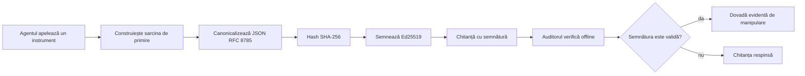
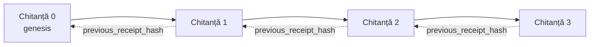

[Urmărește videoclipul lecției: Securizarea agenților AI cu chitanțe criptografice](https://youtu.be/PLACEHOLDER_VIDEO_ID)

> _(Videoclipul lecției și miniatura vor fi adăugate de echipa de conținut Microsoft după fuziune, în conformitate cu modelul lecției 14 / 15.)_

# Securizarea agenților AI cu chitanțe criptografice

## Introducere

Această lecție va acoperi:

- De ce jurnalele de audit pentru agenții AI sunt importante pentru conformitate, depanare și încredere.
- Ce este o chitanță criptografică și cum diferă de o linie de jurnal nesemnată.
- Cum să produci o chitanță semnată pentru apelul unui instrument de către agent în Python simplu.
- Cum să verifici offline o chitanță și să detectezi modificările neautorizate.
- Cum să legi chitanțele astfel încât eliminarea sau reordonarea uneia să rupă lanțul.
- Ce dovedesc chitanțele și ce nu dovedesc în mod explicit.

## Obiective de învățare

După finalizarea acestei lecții, vei ști să:

- Identifici modurile de eșec care motivează proveniența criptografică pentru acțiunile agentului.
- Produci o chitanță semnată Ed25519 peste un payload JSON canonic.
- Verifici o chitanță independent folosind doar cheia publică a semnatarului.
- Detectezi modificările prin re-verificarea unei chitanțe modificate.
- Construiești o secvență de chitanțe legate prin hash și să explici de ce contează lanțul.
- Recunoști limita între ceea ce dovedesc chitanțele (atributie, integritate, ordonare) și ceea ce nu dovedesc (corectitudinea acțiunii, rigurozitatea politicii).

## Problema: Jurnalul de audit al agentului tău

Imaginează-ți că ai implementat un agent AI pentru Contoso Travel. Agentul citește solicitările clienților, apelează un API de zboruri pentru a căuta opțiuni și rezervă locuri în numele clientului. În ultimul trimestru, agentul a procesat 50.000 de rezervări.

Astăzi sosește un auditor. El pune o întrebare simplă: „Arată-mi ce a făcut agentul tău.”

Îi dai fișierele tale de jurnal. Auditorul le examinează și pune o întrebare mai dificilă: „Cum știu că aceste jurnale nu au fost modificate?”

Aceasta este problema jurnalului de audit. Majoritatea implementărilor de agenți de astăzi se bazează pe:

- **Jurnale de aplicație**: scrise de agent însuși, editabile de oricine are acces la sistemul de fișiere.
- **Servicii de logare în cloud**: evidentiate la nivel de platformă pentru modificări, dar numai dacă auditorul are încredere în operatorul platformei.
- **Jurnale de tranzacții de bază de date**: potrivite pentru modificări în baza de date, dar nu pentru apeluri arbitrare de instrumente.

Niciuna dintre acestea nu poate răspunde la întrebarea auditorului fără ca auditorul să trebuiască să aibă încredere în cineva (în tine, în furnizorul tău cloud, în vendor-ul bazei de date). Pentru utilizarea internă, această încredere este adesea acceptabilă. Pentru sarcini reglementate (financiar, sănătate, orice subiect la EU AI Act), nu este acceptabil.

Chitanțele criptografice rezolvă această problemă făcând fiecare acțiune a agentului verificabilă independent. Auditorul nu trebuie să aibă încredere în tine. Are nevoie doar de cheia ta publică și chitanța însăși.

## Ce este o chitanță criptografică?

O chitanță este un obiect JSON care înregistrează ce a făcut un agent, semnată cu o semnătură digitală.


```mermaid
flowchart LR
    A[Agentul apelează un instrument] --> B[Construiește sarcina de primire]
    B --> C[Canonicalizează JSON RFC 8785]
    C --> D[Hash SHA-256]
    D --> E[Semnează Ed25519]
    E --> F[Chitanță cu semnătură]
    F --> G[Auditorul verifică offline]
    G --> H{Semnătura este validă?}
    H -- da --> I[Dovadă evidentă de manipulare]
    H -- nu --> J[Chitanța respinsă]
```

O chitanță minimală arată astfel:

```json
{
  "type": "agent.tool_call.v1",
  "agent_id": "contoso-travel-bot",
  "tool_name": "lookup_flights",
  "tool_args_hash": "sha256:a3f9c1...",
  "result_hash": "sha256:7b2e1d...",
  "policy_id": "contoso-travel-policy-v3",
  "timestamp": "2026-04-25T14:30:00Z",
  "sequence": 47,
  "previous_receipt_hash": "sha256:9d4e6a...",
  "signature": {
    "alg": "EdDSA",
    "sig": "c5af83...",
    "public_key": "8f3b2c..."
  }
}
```

Trei proprietăți fac munca:

1. **Semnătura**. Chitanța este semnată de gateway-ul agentului folosind o cheie privată Ed25519. Oricine are cheia publică corespunzătoare poate verifica semnătura offline. Modificarea oricărui câmp invalidează semnătura.

2. **Codificarea canonică**. Înainte de semnare, chitanța este serializată folosind JSON Canonicalization Scheme (JCS, RFC 8785). Aceasta asigură că două implementări care produc aceeași chitanță logică produc o ieșire identică în octeți. Fără canonicizare, diferite serializatoare JSON ar produce semnături diferite pentru același conținut.

3. **Lanțul de hash-uri**. Câmpul `previous_receipt_hash` leagă fiecare chitanță de cea anterioară. Eliminarea sau reordonarea unei chitanțe rupe fiecare chitanță care a urmat. Modificările devin vizibile la nivelul lanțului chiar dacă semnăturile individuale sunt ignorate.

Împreună aceste proprietăți oferă trei garanții:

- **Atribuire**: această cheie a semnat acest conținut.
- **Integritate**: conținutul nu a fost modificat din momentul semnării.
- **Ordonare**: această chitanță a venit după acea chitanță în lanț.

## Producerea unei chitanțe în Python

Nu ai nevoie de o bibliotecă specială pentru a produce o chitanță. Primitivele criptografice sunt larg disponibile și logica este doar câteva zeci de linii de Python.

Exercițiile practice din `code_samples/18-signed-receipts.ipynb` parcurg întregul flux. Versiunea sumar:

```python
import json
import hashlib
import base64
from nacl import signing
from jcs import canonicalize  # JSON canonic RFC 8785

def b64url_nopad(data: bytes) -> str:
    return base64.urlsafe_b64encode(data).decode("ascii").rstrip("=")

def sha256_canonical(obj) -> str:
    """SHA-256 of a Python object's JCS-canonical JSON form."""
    return f"sha256:{hashlib.sha256(canonicalize(obj)).hexdigest()}"

# Generează sau încarcă o cheie de semnare (în producție, stochează într-un seif pentru chei)
signing_key = signing.SigningKey.generate()
verify_key = signing_key.verify_key

# Construiește sarcina utilă a chitantei (încă fără semnătură)
tool_args = {"origin": "SYD", "destination": "LAX"}
tool_result = [{"flight": "QF11", "price": 1850, "stops": 0}]

payload = {
    "type": "agent.tool_call.v1",
    "agent_id": "contoso-travel-bot",
    "tool_name": "lookup_flights",
    "tool_args_hash": sha256_canonical(tool_args),
    "result_hash": sha256_canonical(tool_result),
    "policy_id": "contoso-travel-policy-v3",
    "timestamp": "2026-04-25T14:30:00Z",
    "sequence": 0,
    "previous_receipt_hash": None,
}

# Canonicalizează, hash-uiește, semnează.
canonical_bytes = canonicalize(payload)
message_hash = hashlib.sha256(canonical_bytes).digest()
signature_bytes = signing_key.sign(message_hash).signature

# Atașează un obiect de semnătură structurat.
receipt = {
    **payload,
    "signature": {
        "alg": "EdDSA",
        "sig": b64url_nopad(signature_bytes),
        "public_key": b64url_nopad(bytes(verify_key)),
    },
}
```

Aceasta este întreaga conductă de semnare. Exercițiile din notebook parcurg fiecare pas.

## Verificarea unei chitanțe și detectarea modificărilor

Verificarea este operația inversă:

```python
import base64
import hashlib
from nacl import signing
from nacl.exceptions import BadSignatureError
from jcs import canonicalize

def b64url_decode(s: str) -> bytes:
    padding = "=" * ((4 - len(s) % 4) % 4)
    return base64.urlsafe_b64decode(s + padding)

def verify_receipt(receipt: dict) -> bool:
    # Semnătura este un obiect structurat: {"alg", "sig", "public_key"}.
    sig_obj = receipt.get("signature")
    if not sig_obj or sig_obj.get("alg") != "EdDSA":
        return False

    # Reconstruiți încărcătura care a fost efectiv semnată (totul în afară de semnătură).
    payload = {k: v for k, v in receipt.items() if k != "signature"}

    canonical_bytes = canonicalize(payload)
    message_hash = hashlib.sha256(canonical_bytes).digest()

    try:
        verify_key = signing.VerifyKey(b64url_decode(sig_obj["public_key"]))
        verify_key.verify(message_hash, b64url_decode(sig_obj["sig"]))
        return True
    except BadSignatureError:
        return False
```

Această funcție primește o chitanță și returnează `True` dacă semnătura este validă, `False` în caz contrar. Fără apeluri în rețea, fără dependențe de servicii, fără încredere în terți.

Pentru a vedea detectarea modificărilor în acțiune, notebook-ul parcurge:

1. Producerea unei chitanțe valide și confirmarea că se verifică corect.
2. Modificarea unui octet din câmpul `tool_args_hash`.
3. Re-verificarea și observarea eșecului.

Aceasta este demonstrația practică că chitanțele sunt evidentiate la modificări neautorizate: orice modificare, oricât de mică, rupe semnătura.

## Legarea chitanțelor pentru agenți multi-pas

O singură chitanță semnată protejează o acțiune. Un lanț de chitanțe protejează o secvență.


```mermaid
flowchart LR
    R0[Chitanță 0<br/>genesis] --> R1[Chitanță 1]
    R1 --> R2[Chitanță 2]
    R2 --> R3[Chitanță 3]
    R1 -. previous_receipt_hash .-> R0
    R2 -. previous_receipt_hash .-> R1
    R3 -. previous_receipt_hash .-> R2
```

Fiecare chitanță înregistrează hash-ul chitanței precedente. Pentru a elimina tăcut chitanța 2, un atacator ar trebui să:

- Modifice câmpul `previous_receipt_hash` al chitanței 3 (rupe semnătura chitanței 3), SAU
- Fabrică o nouă semnătură pentru o chitanță 3 modificată (necesită cheia privată a agentului).

Dacă cheia privată este într-un seif hardware și publici cheia publică cu fiecare chitanță, niciunul dintre atacuri nu este fezabil fără detectare.

Notebook-ul parcurge:

1. Construirea unui lanț de trei chitanțe.
2. Verificarea faptului că `previous_receipt_hash` al fiecărei chitanțe corespunde hash-ului real al chitanței anterioare.
3. Modificarea unei chitanțe din mijloc și observarea ruperii lanțului exact în acel punct.

Astfel produci un jurnal de audit pe care un auditor extern îl poate verifica fără să aibă încredere în tine.

## Ce dovedesc chitanțele (și ce nu dovedesc)

Aceasta este cea mai importantă secțiune a lecției. Chitanțele sunt puternice, dar puterea lor este limitată.

**Chitanțele dovedesc trei lucruri:**

1. **Atribuirea**: o cheie specifică a semnat un payload specific.
2. **Integritatea**: payload-ul nu a fost modificat din momentul semnării.
3. **Ordonarea**: această chitanță a venit după acea chitanță în lanțul de hash-uri.

**Chitanțele NU dovedesc:**

1. **Corectitudinea**: că acțiunea agentului a fost cea corectă. O chitanță poate fi semnată pentru un răspuns greșit la fel de bine ca pentru unul corect.
2. **Conformitatea cu politica**: că politica referențiată în `policy_id` a fost evaluată efectiv sau că ar fi permis acea acțiune dacă ar fi fost verificată. Chitanța înregistrează ceea ce s-a pretins, nu ceea ce s-a aplicat.
3. **Identitatea dincolo de cheie**: chitanța spune „această cheie a semnat acest conținut.” Nu spune „acest om a autorizat asta.” Conectarea unei chei la o persoană sau organizație necesită infrastructură separată de identitate (un director, un registru de chei publice etc.).
4. **Adevărul inputurilor**: dacă agentul primește un prompt manipulat și acționează pe baza lui, chitanța înregistrează fidel acțiunea. Chitanțele sunt downstream față de validarea inputurilor, nu un substitut pentru aceasta.

Această limită contează din două motive:

- Îți spune pentru ce sunt utile chitanțele: pentru a face comportamentul agentului auditat și evident la modificări, chiar și peste granițe organizaționale.
- Îți spune ce alte straturi ai nevoie: validarea inputurilor (Lecția 6), aplicarea politicilor (acoperită sumar mai jos) și infrastructura de identitate (în afara scopului acestei lecții).

O greșeală comună este să presupui că „avem chitanțe” înseamnă „suntem guvernați.” Nu este așa. Chitanțele sunt fundația. Guvernanța este sistemul pe care îl construiești deasupra.

## Referințe pentru producție

Codul Python din această lecție este intenționat minimal pentru a putea citi fiecare linie și înțelege exact ce se întâmplă. În producție, ai două opțiuni:

1. **Construi direct pe primitivele criptografice.** Cele 50 de linii de mai sus sunt suficiente pentru multe cazuri de utilizare. PyNaCl (Ed25519) și pachetul `jcs` (JSON canonic) sunt biblioteci bine întreținute și auditate.

2. **Folosește o bibliotecă de chitanțe pentru producție.** Mai multe proiecte open-source implementează același model cu funcții suplimentare (rotația cheilor, verificarea în lot, distribuția JWK Set, integrarea cu motoare de politici):
   - Formatul chitanței folosit în această lecție urmează un Internet-Draft IETF (`draft-farley-acta-signed-receipts`) aflat în proces de standardizare.
   - Microsoft Agent Governance Toolkit combină chitanțe cu decizii de politici pe bază de Cedar; vezi Tutorialul 33 din acel repository pentru un exemplu complet.
   - Pachetele `protect-mcp` (npm) și `@veritasacta/verify` (npm) oferă o implementare Node pentru semnarea și verificarea offline a chitanțelor, destinat pentru a înveli orice server MCP cu un jurnal de audit evident la modificări.
   - SDK-ul Python **[nobulex](https://github.com/arian-gogani/nobulex)** (`pip install nobulex`) oferă același model Ed25519 + JCS în Python cu integrări LangChain și CrewAI, inclusiv vectori cross-validation publicati și un mapping de conformitate contribuït prin [OWASP PR #2210](https://github.com/OWASP/CheatSheetSeries/pull/2210).

Decizia între a-ți construi propriul sistem și a folosi o bibliotecă reflectă decizia între a scrie propria bibliotecă JWT și a folosi una testată: ambele sunt rezonabile; biblioteca economisește timp și reduce suprafața de audit; abordarea from-scratch te forțează să înțelegi fiecare primitiv. Această lecție predă calea from-scratch ca să ai fundația pentru oricare alegere.

## Testarea cunoștințelor

Testează-ți înțelegerea înainte să treci la exercițiul practic.

**1. O chitanță este semnată cu cheia privată Ed25519 a agentului. Auditorul are doar cheia publică. Poate auditorul verifica chitanța offline?**

<details>
<summary>Răspuns</summary>

Da. Verificarea Ed25519 necesită doar cheia publică și octeții semnați. Nu sunt apeluri în rețea, nici dependențe de servicii. Aceasta este proprietatea care face chitanțele utile în medii izolate de rețea, multi-organizaționale sau cu încredere scăzută.
</details>

**2. Un atacator modifică câmpul `policy_id` al unei chitanțe pentru a pretinde că a fost guvernată de o politică mai permisivă. Semnătura a fost făcută peste payload-ul original. Ce se întâmplă la verificare?**

<details>
<summary>Răspuns</summary>

Verificarea eșuează. Semnătura a fost calculată peste octeții canonici ai payload-ului original; modificarea oricărui câmp schimbă octeții canonici, schimbă hash-ul SHA-256 și face semnătura invalidă. Atacatorul ar avea nevoie de cheia privată pentru a produce o semnătură validă nouă, ceea ce nu are.
</details>

**3. De ce chitanța include `tool_args_hash` și `result_hash` în loc de argumentele și rezultatul brute?**

<details>
<summary>Răspuns</summary>

Două motive. Primul, chitanța poate trebui arhivată sau transmisă în medii unde dezvăluirea conținutului brut (PII, date de business) este o problemă. Hash-ul menține chitanța mică și conținutul privat; auditorul verifică că hash-ul corespunde unei copii stocate separat a conținutului real. Al doilea, hash-urile au dimensiune fixă; o chitanță cu hash-uri este limitată în dimensiune indiferent cât de mari au fost inputurile și outputurile.
</details>

**4. Câmpul `previous_receipt_hash` leagă fiecare chitanță de predecesoarea sa. Dacă un atacator șterge în tăcere o chitanță din mijlocul lanțului, ce devine invalid?**

<details>
<summary>Răspuns</summary>

Fiecare chitanță care a urmat după cea ștearsă. Câmpurile lor `previous_receipt_hash` nu mai corespund lanțului real (pentru că chitanța la care făceau referire nu mai există sau lanțul acum arată spre un alt predecesor). Pentru a ascunde ștergerea, atacatorul ar trebui să re-semneze fiecare chitanță ulterioară, ceea ce necesită cheia privată.
</details>

**5. O chitanță se verifică corect. Aceasta dovedește că acțiunea agentului a fost corectă, sound sau conformă cu politica?**

<details>
<summary>Răspuns</summary>

Nu. O chitanță validă dovedește trei lucruri: atribuirea (această cheie a semnat acest conținut), integritatea (conținutul nu s-a schimbat) și ordonarea (această chitanță a venit după cealaltă). NU dovedește că acțiunea a fost corectă, că politica menționată în `policy_id` a fost evaluată sau că agentul a urmat toate regulile. Chitanțele fac comportamentul agentului auditat, nu neapărat corect. Aceasta este limita cea mai importantă din lecție.
</details>

## Exercițiu practic

Deschide `code_samples/18-signed-receipts.ipynb` și completează toate cele patru secțiuni:

1. **Secțiunea 1**: Semnează prima ta chitanță și verific-o.
2. **Secțiunea 2**: Modifică chitanța și observă eșecul la verificare.
3. **Secțiunea 3**: Construiește un lanț de trei chitanțe și verifică integritatea lanțului.
4. **Secțiunea 4**: Aplică modelul la un agent construit cu Microsoft Agent Framework: învelește un apel de instrument în semnarea unei chitanțe, apoi verifică chitanța independent.
**Provocare suplimentară 1:** extinde schema chitanței cu un câmp suplimentar ales de tine (de exemplu, un ID de cerere pentru urmărire), actualizează logica de semnare canonică pentru a-l include și confirmă că chitanța poate fi încă verificată corect. Apoi modifică câmpul după semnare și confirmă că verificarea eșuează. Aceasta te forțează să înțelegi cum contribuie fiecare octet al codificării canonice la semnătură.

**Provocare suplimentară 2:** aplică hash SHA-256 asupra a două dintre chitanțele tale (concatenează octeții canonicii într-o ordine deterministă) și inserează digestul rezultat ca un câmp nou pe o a treia chitanță înainte de a o semna. Verifică că toate cele trei chitanțe pot fi încă verificate corect. Tocmai ai construit o dovadă de includere în un singur pas: oricine deține a treia chitanță poate demonstra că primele două existau la momentul semnării, fără a fi nevoie să le dezvăluie conținutul. Acesta este tiparul folosit de chitanțele cu dezvăluire selectivă pe scară largă (angajamente Merkle, RFC 6962).

## Concluzie

Chitanțele criptografice oferă agenților AI un traseu de audit care este:

- **Verificabil independent**: orice parte cu cheia publică poate verifica, fără dependență de servicii.
- **Evident împotriva modificărilor**: orice modificare invalidează semnătura.
- **Portabil**: o chitanță este un fișier JSON mic; poate fi arhivată, transmisă și verificată oriunde.
- **Aliniat la standarde**: construit pe Ed25519 (RFC 8032), JCS (RFC 8785) și SHA-256, toate primitive larg utilizate.

Nu înlocuiesc validarea de intrare, aplicarea politicilor sau infrastructura de identitate. Sunt o fundație pentru aceste straturi. Când implementezi agenți în fluxuri de lucru reglementate, multiorganizaționale sau în orice context în care un auditor viitor nu poate fi considerat de încredere, chitanțele sunt modul în care faci traseul de audit onest.

Cel mai important mesaj: chitanțele dovedesc cine a spus ce și când. Nu dovedesc că ceea ce s-a spus este adevărat sau corect. Ține ferm această distincție. Este diferența dintre un sistem de proveniență onest și unul înșelător.

## Lista de verificare pentru producție

Când ești gata să treci de la această lecție la implementarea agenților semnați cu chitanțe într-un mediu real:

- [ ] **Mută cheia de semnare de pe laptopul dezvoltatorului.** Folosește Azure Key Vault, AWS KMS sau un modul hardware de securitate. Cheia privată care semnează chitanțele tale nu trebuie să fie niciodată în controlul surselor sau în clar pe mașinile aplicației.
- [ ] **Publică cheia publică de verificare.** Auditorii au nevoie de ea pentru verificare offline. Modelul standard este un JWK Set la o adresă URL cunoscută (RFC 7517), ex. `https://your-org.example.com/.well-known/agent-keys.json`.
- [ ] **Ancorează lanțul extern.** La intervale regulate salvează hash-ul capului lanțului într-un jurnal de transparență (Sigstore Rekor, autoritate de marcă temporală RFC 3161 sau un al doilea sistem intern) pentru ca o terță parte să confirme „acest lanț exista la acest moment”.
- [ ] **Stochează chitanțele imuabil.** Stocare doar adăugată (blob storage cu politici de imuabilitate Azure, AWS S3 Object Lock) previne rescrierea istoriei la nivelul stocării de către o persoană din interior.
- [ ] **Decide asupra retenției.** Multe regimuri de conformitate cer păstrare pe mai mulți ani. Planifică creșterea chitanțelor (fiecare are ~500 bytes; un agent care face 10K apeluri pe zi produce ~1.8 GB pe an).
- [ ] **Documentează ce nu acoperă chitanțele.** Chitanțele dovedesc atribuire, integritate și ordonare. Manualul tău ar trebui să listeze explicit ce alte controale (validare de intrare, aplicarea politicilor, limitarea ratei, infrastructura de identitate) sunt alături de chitanțe în postura ta de guvernanță.

### Mai ai întrebări despre securizarea agenților AI?

Alătură-te [Microsoft Foundry Discord](https://aka.ms/ai-agents/discord) pentru a întâlni alți cursanți, a participa la orele de consultanță și a primi răspunsuri la întrebările tale despre agenții AI.

## Dincolo de această lecție

Această lecție acoperă semnarea cu o singură chitanță și secvențe înlănțuite prin hash. Aceleași primitive compun mai multe tipare avansate pe care le-ai putea întâlni pe măsură ce postura ta de guvernanță evoluează:

- **Dezvăluire selectivă.** Când câmpurile unei chitanțe sunt angajate independent (arbore Merkle în stil RFC 6962), poți dezvălui câmpuri specifice anumitor auditori și să demonstrezi că restul nu s-au schimbat fără a le expune. Util când aceeași chitanță trebuie să satisfacă un audit complet (care vrea completitudine) și reglementări precum GDPR (care vor ca auditorul să vadă cât mai puțin necesar).
- **Revocarea chitanțelor.** Dacă o cheie de semnare este compromisă, trebuie un mod de a marca toate chitanțele semnate cu acea cheie ca nesigure de la un anumit moment încolo. Modele standard: chei scurte cu o listă publicată de revocare sau un jurnal de transparență cu înregistrări de revocare.
- **Chitanțe cu semnătură bilaterală / split.** Unele implementări împart payload-ul semnat în jumătăți pre-execuție (`authorization_*`) și post-execuție (`result_*`) cu semnături independente, utile când decizia de autorizare și rezultatul observat sunt produși de actori diferiți sau în momente diferite. Se compune aditiv peste formatul chitanței prezentat în această lecție.
- **Compoziția payload-ului.** O chitanță sigilează orice octeți pui în `result_hash`. Payload-urile din viața reală sunt adesea mai bogate decât un simplu rezultat al unei apelări de instrument: raționamentul predecizional (predicția modelului, opțiunile considerate, dovezile și completitudinea lor, postura de risc, lanțul de responsabilitate, rezultatul evaluării) pot fi toate în interiorul payload-ului, sigilate printr-o singură chitanță. Aceasta menține formatul minimal al chitanței în timp ce schema payload-ului evoluează domeniu cu domeniu.
- **Conformitate între implementări.** Mai multe implementări independente ale aceluiași format de chitanță (Python, TypeScript, Rust, Go) se verifică reciproc pe baza vectorilor de test partajați. Dacă îți creezi propria implementare, validarea prin vectori publicați confirmă compatibilitatea la nivel de rețea.
- **Migrarea post-cuantum.** Ed25519 este larg folosit astăzi, dar nu este rezistent la calcul cuantic. Formatul chitanței este agil din punct de vedere al algoritmului: câmpul `signature.alg` poate conține `ML-DSA-65` (standardul post-cuantum de semnătură NIST) când va trebui să migrezi. Planifică o perioadă de tranziție în care chitanțele sunt semnate dublu.

## Resurse suplimentare

- <a href="https://datatracker.ietf.org/doc/draft-farley-acta-signed-receipts/" target="_blank">IETF Internet-Draft: Chitanțe de decizie semnate pentru controlul accesului între mașini</a>
- <a href="https://learn.microsoft.com/azure/ai-studio/responsible-use-of-ai-overview" target="_blank">Prezentare generală AI responsabil (Azure AI)</a>
- <a href="https://datatracker.ietf.org/doc/html/rfc8032" target="_blank">RFC 8032: Algoritmul de semnătură digitală pe curba Edwards (EdDSA)</a>
- <a href="https://datatracker.ietf.org/doc/html/rfc8785" target="_blank">RFC 8785: Schema de canonicalizare JSON (JCS)</a>
- <a href="https://datatracker.ietf.org/doc/html/rfc6962" target="_blank">RFC 6962: Transparența certificatelor</a> (construcție arbore Merkle folosită de chitanțele cu dezvăluire selectivă)
- <a href="https://github.com/microsoft/agent-governance-toolkit/blob/main/docs/tutorials/33-offline-verifiable-receipts.md" target="_blank">Microsoft Agent Governance Toolkit, Tutorial 33: Chitanțe de decizie verificabile offline</a>
- <a href="https://github.com/ScopeBlind/agent-governance-testvectors" target="_blank">Vectori de test pentru conformitate între implementări</a> pentru formatul de chitanță folosit în această lecție (Apache-2.0)
- <a href="https://pynacl.readthedocs.io/" target="_blank">Documentație PyNaCl</a> (Ed25519 în Python)

## Lecția anterioară

[Crearea agenților de utilizare a calculatorului (CUA)](../15-browser-use/README.md)

---

<!-- CO-OP TRANSLATOR DISCLAIMER START -->
**Declinare a responsabilității**:
Acest document a fost tradus folosind serviciul de traducere AI [Co-op Translator](https://github.com/Azure/co-op-translator). În timp ce ne străduim pentru acuratețe, vă rugăm să rețineți că traducerile automate pot conține erori sau inexactități. Documentul original în limba sa nativă trebuie considerat sursa autorizată. Pentru informații critice, se recomandă traducerea profesională realizată de un om. Nu ne asumăm responsabilitatea pentru eventualele neînțelegeri sau interpretări greșite care decurg din utilizarea acestei traduceri.
<!-- CO-OP TRANSLATOR DISCLAIMER END -->