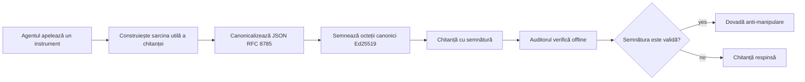
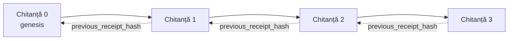

[Vizionați videoclipul lecției: Asigurarea agenților AI cu chitanțe criptografice](https://youtu.be/PLACEHOLDER_VIDEO_ID)

> _(Videoclipul lecției și miniatura vor fi adăugate de echipa de conținut Microsoft după îmbinare, respectând modelul lecției 14 / 15.)_

# Asigurarea agenților AI cu chitanțe criptografice

## Introducere

Această lecție va acoperi:

- De ce traseele de audit pentru agenții AI sunt importante pentru conformitate, depanare și încredere.
- Ce este o chitanță criptografică și cum se diferențiază de o linie de jurnal nesemnată.
- Cum să produci o chitanță semnată pentru apelul unui instrument al agentului în Python simplu.
- Cum să verifici o chitanță offline și să detectezi modificările neautorizate.
- Cum să legezi chitanțele astfel încât eliminarea sau reordonarea uneia să strice lanțul.
- Ce dovedesc chitanțele și ce NU dovedesc în mod explicit.

## Obiective de învățare

După finalizarea acestei lecții, veți ști cum să:

- Identifica modurile de eșec care motivează proveniența criptografică pentru acțiunile agentului.
- Produce o chitanță semnată Ed25519 peste un payload JSON canonic.
- Verifica o chitanță independent folosind doar cheia publică a semnatarului.
- Detecta modificările neautorizate prin reexecutarea verificării asupra unei chitanțe modificate.
- Construi un șir legat de chitanțe prin hash și să explici de ce acest lanț contează.
- Recunoaște granița între ceea ce dovedesc chitanțele (atribut, integritate, ordonare) și ceea ce nu dovedesc (corectitudinea acțiunii, validitatea politicii).

## Problema: Traseul de Audit al Agentului Tău

Imaginează-ți că ai implementat un agent AI pentru Contoso Travel. Agentul citește cererile clienților, apelează un API de zboruri pentru a căuta opțiuni și rezervă locuri în numele clienților. În ultimul trimestru, agentul a procesat 50.000 de rezervări.

Astăzi sosește un auditor. Pune o întrebare simplă: "Arată-mi ce a făcut agentul tău."

Îi predai fișierele de jurnal. Auditorul le examinează și pune o întrebare dificilă: "Cum știu că aceste jurnale nu au fost editate?"

Aceasta este problema traseului de audit. Majoritatea implementărilor agentului de azi se bazează pe:

- **Jurnale de aplicație**: scrise de agent însuși, editabile de oricine are acces la sistemul de fișiere.
- **Servicii cloud de logare**: cu detectare a modificărilor la nivel de platformă, dar doar dacă auditorul are încredere în operatorul platformei.
- **Jurnale de tranzacții din baze de date**: potrivite pentru schimbări în baze de date, dar nu pentru apeluri arbitrare de instrumente.

Niciuna dintre acestea nu poate răspunde întrebării auditorului fără a-i cere auditorului să aibă încredere în cineva (în tine, în furnizorul tău cloud, în vânzătorul bazei de date). Pentru uz intern, acea încredere este adesea acceptabilă. Pentru sarcini reglementate (financiar, sănătate, tot ce ține de Legea AI a UE), nu este.

Chitanțele criptografice rezolvă această problemă făcând fiecare acțiune a agentului independent verificabilă. Auditorul nu trebuie să aibă încredere în tine. Are nevoie doar de cheia ta publică și de chitanță în sine.

## Ce este o chitanță criptografică?

O chitanță este un obiect JSON care înregistrează ce a făcut un agent, semnat cu o semnătură digitală.


```mermaid
flowchart LR
    A[Agentul apelează un instrument] --> B[Construiește sarcina utilă a chitanței]
    B --> C[Canonicalizează JSON RFC 8785]
    C --> E[Semnează octeții canonici Ed25519]
    E --> F[Chitanță cu semnătură]
    F --> G[Auditorul verifică offline]
    G --> H{Semnătura este validă?}
    H -- yes --> I[Dovadă anti-manipulare]
    H -- no --> J[Chitanță respinsă]
```

O chitanță minimală arată astfel:

```json
{
  "type": "agent.tool_call.v1",
  "agent_id": "contoso-travel-bot",
  "tool_name": "lookup_flights",
  "tool_args_hash": "sha256:a3f9c1...",
  "result_hash": "sha256:7b2e1d...",
  "policy_id": "contoso-travel-policy-v3",
  "timestamp": "2026-04-25T14:30:00Z",
  "sequence": 47,
  "previous_receipt_hash": "sha256:9d4e6a...",
  "signature": {
    "alg": "EdDSA",
    "sig": "c5af83...",
    "public_key": "8f3b2c..."
  }
}
```

Trei proprietăți fac toată treaba:

1. **Semnătura**. Chitanța este semnată de poarta agentului folosind o cheie privată Ed25519. Oricine are cheia publică corespunzătoare poate verifica semnătura offline. Modificarea oricărui câmp invalidează semnătura.

2. **Codificare canonică**. Înainte de semnare, chitanța este serializată folosind JSON Canonicalization Scheme (JCS, RFC 8785). Aceasta asigură că două implementări care produc aceeași chitanță logică produc ieșire identică bit cu bit. Fără canonizare, diverși serializeri JSON ar produce semnături diferite pentru același conținut.

3. **Legarea prin hash**. Câmpul `previous_receipt_hash` leagă fiecare chitanță de cea anterioară. Eliminarea sau reordonarea unei chitanțe strică fiecare chitanță ulterioară. Modificările neautorizate devin vizibile la nivel de lanț, chiar dacă semnăturile individuale sunt ocolite.

Împreună, aceste proprietăți oferă trei garanții:

- **Atribuire**: această cheie a semnat acest conținut.
- **Integritate**: conținutul nu s-a schimbat de la semnare.
- **Ordonare**: această chitanță a venit după cealaltă în lanț.

## Producerea unei chitanțe în Python

Nu ai nevoie de o bibliotecă specială pentru a produce o chitanță. Primitivele criptografice sunt larg disponibile iar logica este câteva zeci de linii de Python.

Exercițiile practice din `code_samples/18-signed-receipts.ipynb` parcurg fluxul complet. Varianta sumarizată:

```python
import json
import hashlib
import base64
from nacl import signing
from jcs import canonicalize  # JSON canonic RFC 8785

def b64url_nopad(data: bytes) -> str:
    return base64.urlsafe_b64encode(data).decode("ascii").rstrip("=")

def sha256_canonical(obj) -> str:
    """SHA-256 of a Python object's JCS-canonical JSON form."""
    return f"sha256:{hashlib.sha256(canonicalize(obj)).hexdigest()}"

# Generează sau încarcă o cheie de semnare (în producție, stochează într-un seif de chei)
signing_key = signing.SigningKey.generate()
verify_key = signing_key.verify_key

# Construiește conținutul chitanței (fără semnătură încă)
tool_args = {"origin": "SYD", "destination": "LAX"}
tool_result = [{"flight": "QF11", "price": 1850, "stops": 0}]

payload = {
    "type": "agent.tool_call.v1",
    "agent_id": "contoso-travel-bot",
    "tool_name": "lookup_flights",
    "tool_args_hash": sha256_canonical(tool_args),
    "result_hash": sha256_canonical(tool_result),
    "policy_id": "contoso-travel-policy-v3",
    "timestamp": "2026-04-25T14:30:00Z",
    "sequence": 0,
    "previous_receipt_hash": None,
}

# Canonicalizează și semnează direct octeții JCS. PureEdDSA face hash intern.
canonical_bytes = canonicalize(payload)
signature_bytes = signing_key.sign(canonical_bytes).signature

# Atașează un obiect de semnătură structurat.
receipt = {
    **payload,
    "signature": {
        "alg": "EdDSA",
        "sig": b64url_nopad(signature_bytes),
        "public_key": b64url_nopad(bytes(verify_key)),
    },
}
```

Aceasta este întreaga conductă de semnare. Exercițiile din notebook explică fiecare pas.

## Verificarea unei chitanțe și detectarea modificărilor neautorizate

Verificarea este operația inversă:

```python
import base64
import hashlib
from nacl import signing
from nacl.exceptions import BadSignatureError
from jcs import canonicalize

def b64url_decode(s: str) -> bytes:
    padding = "=" * ((4 - len(s) % 4) % 4)
    return base64.urlsafe_b64decode(s + padding)

def verify_receipt(receipt: dict) -> bool:
    # Semnătura este un obiect structurat: {"alg", "sig", "public_key"}.
    sig_obj = receipt.get("signature")
    if not sig_obj or sig_obj.get("alg") != "EdDSA":
        return False

    # Reconstruiește încărcătura care a fost de fapt semnată (totul în afară de semnătură).
    payload = {k: v for k, v in receipt.items() if k != "signature"}

    canonical_bytes = canonicalize(payload)

    try:
        verify_key = signing.VerifyKey(b64url_decode(sig_obj["public_key"]))
        verify_key.verify(canonical_bytes, b64url_decode(sig_obj["sig"]))
        return True
    except BadSignatureError:
        return False
```

Această funcție primește o chitanță și returnează `True` dacă semnătura este validă, `False` altfel. Fără apeluri la rețea, fără dependență de servicii, fără încredere în terți.

Pentru a vedea în practică detectarea modificărilor, notebook-ul parcurge:

1. Producerea unei chitanțe valide și confirmarea că aceasta se validează.
2. Modificarea unui octet din câmpul `tool_args_hash`.
3. Reexecutarea verificării și observarea eșecului.

Aceasta este demonstrația practică că chitanțele sunt evidente la modificări: orice modificare, oricât de mică, rupe semnătura.

## Legarea chitanțelor pentru agenți cu mai mulți pași

O singură chitanță semnată protejează o acțiune. Un lanț de chitanțe protejează o secvență.


```mermaid
flowchart LR
    R0[Chitanță 0<br/>genesis] --> R1[Chitanță 1]
    R1 --> R2[Chitanță 2]
    R2 --> R3[Chitanță 3]
    R1 -. previous_receipt_hash .-> R0
    R2 -. previous_receipt_hash .-> R1
    R3 -. previous_receipt_hash .-> R2
```

Fiecare chitanță înregistrează hash-ul chitanței anterioare. Pentru a elimina silențios chitanța 2, un atacator ar trebui fie să:

- Modifice câmpul `previous_receipt_hash` al chitanței 3 (rupe semnătura chitanței 3), SAU
- Falsifice o nouă semnătură asupra unei chitanțe 3 modificate (necesită cheia privată a agentului).

Dacă cheia privată este într-un spațiu hardware sigur și publici cheia publică cu fiecare chitanță, niciun atac nu este fezabil fără a fi detectat.

Notebook-ul parcurge:

1. Construirea unui lanț de trei chitanțe.
2. Verificarea că `previous_receipt_hash` al fiecărei chitanțe corespunde hash-ului real al chitanței anterioare.
3. Modificarea unei chitanțe din mijloc și observarea întreruperii lanțului exact în acel punct.

Aceasta este modalitatea de a produce un traseu de audit pe care un auditor extern îl poate verifica fără să aibă încredere în tine.

## Ce Dovedesc Chitanțele (și Ce NU Dovedesc)

Aceasta este cea mai importantă secțiune a acestei lecții. Chitanțele sunt puternice, dar puterea lor este limitată.

**Chitanțele dovedesc trei lucruri:**

1. **Atribuire**: o cheie specifică a semnat un payload specific.
2. **Integritate**: payload-ul nu s-a schimbat de la semnare.
3. **Ordonare**: această chitanță a venit după cea precedenta în lanțul hash.

**Chitanțele NU dovedesc:**

1. **Corectitudine**: că acțiunea agentului a fost cea corectă. O chitanță poate fi semnată pentru un răspuns greșit la fel de curat ca pentru unul corect.
2. **Conformitatea politicii**: că politica referențiată în `policy_id` a fost evaluată efectiv, sau că ar fi permis această acțiune dacă ar fi fost verificată. Chitanța înregistrează ce s-a declarat, nu ce s-a aplicat.
3. **Identitatea dincolo de cheie**: chitanța spune „această cheie a semnat acest conținut.” Nu spune „acest om a autorizat aceasta.” Conectarea unei chei la o persoană sau organizație necesită infrastructură de identitate separată (un director, un registru de chei publice, etc.).
4. **Adevărul intrărilor**: dacă agentul primește un prompt manipulat și acționează pe baza lui, chitanța înregistrează fidel acțiunea. Chitanțele stau în aval față de validarea intrărilor, nu sunt un substitut pentru aceasta.

Această graniță contează din două motive:

- Îți spune pentru ce sunt utile chitanțele: pentru a face comportamentul agentului auditat și evident la modificări, chiar și între organizații.
- Îți spune ce straturi suplimentare ai nevoie încă: validare a intrărilor (Lecția 6), aplicarea politicii (acoperită succint mai jos), și infrastructură de identitate (în afara scopului acestei lecții).

O greșeală frecventă este a presupune că „avem chitanțe” înseamnă „suntem guvernați.” Nu înseamnă asta. Chitanțele sunt o fundație. Guvernanța este sistemul pe care îl construiești peste ele.

## Dovada că un om a Aprobat Exact Această Acțiune

Punctul 3 de mai sus merită o secțiune proprie: o chitanță de acțiune spune „această cheie a semnat acest conținut,” niciodată „un om a autorizat aceasta.” Pentru acțiuni de risc ridicat (returnări, ștergeri, transferuri bancare), cadrele de guvernanță cer tot mai des chiar această declarație lipsă, care poate fi produsă cu aceleași primitive construite în această lecție.

Notebook-ul următor `code_samples/human-authorization-receipts.ipynb` adaugă un al doilea tip de chitanță, `human.approval.v1`, în aceeași formă de plic ca și chitanțele lecției (un payload tipizat semnat cu Ed25519 peste octeții săi canonici JCS, cu obiectul `signature` în afara octeților semnați). Un aprobator numit semnează **acțiunea canonică completă și digestul ei** înainte de executare; chitanța acțiunii agentului poartă **același digest de acțiune** și un `parent_approval_ref`, hash-ul chitanței aprobării, aceeași convenție ca `previous_receipt_hash` din lanțul construit mai sus. O singură `verify_chain` parcurge ambele artifacte sub **registre separate de chei fixate** (cheile aprobatorilor vs cheile agenților), deci calea codului este comună, dar autoritățile nu.

Proprietatea obținută, afirmată cu atenție: *omul a aprobat această acțiune exactă, iar agentul a executat exact acea acțiune aprobată.* Fixture-urile de refuz din notebook fac proprietatea reală, nu doar afirmată:

- setul clasic: modificări neautorizate, „deputat confuz”, reluare, chei falsificate pe ambele părți, intrare necorespunzătoare;
- **autoritate expirat**: o semnătură care încă verifică, respinsă oricum pentru că versiunea politicii s-a mutat, cheia aprobatorului a fost rotită din registrul fixat, sau aprobarea a expirat înainte de execuție;
- **substituirea digestului**: o chitanță de acțiune semnată valid care indică o aprobare *reală* ce leagă o acțiune canonică *diferită*.

Fiecare eșec refuză cu un motiv distinct, astfel un auditor care citește un refuz poate spune dacă autoritatea a expirat sau acțiunea executată s-a schimbat. Regula predată de notebook: o aprobare semnată nu este autoritate de una singură. Autoritatea există doar dacă ambele chitanțe încă leagă aceeași acțiune canonică în momentul execuției. Chitanța de aprobare umană este o compoziție educațională definită de această lecție, nu un tip de chitanță definit de `draft-farley-acta-signed-receipts`.

## Referințe pentru producție

Codul Python din această lecție este intenționat minimal pentru a putea citi fiecare linie și a înțelege exact ce se întâmplă. În producție, ai două opțiuni:

1. **Construiește direct pe primitivele criptografice.** Cele 50 de linii văzute mai sus sunt suficiente pentru multe cazuri de utilizare. PyNaCl (Ed25519) și pachetul `jcs` (JSON canonic) sunt biblioteci bine întreținute și auditate.

2. **Folosește o bibliotecă de chitanțe pentru producție.** Mai multe proiecte open-source implementează același model cu funcții suplimentare (rotație de chei, verificare în grup, distribuire JWK Set, integrare cu motoare de politici):
   - Conducta de semnare folosește convențiile JCS și scope-ului semnăturii dintr-un Internet-Draft IETF independent ([`draft-farley-acta-signed-receipts`](https://datatracker.ietf.org/doc/draft-farley-acta-signed-receipts/), revizia 02). Chitanța plată educațională a lecției diferă de plicul `{payload, signature}` al draftului și nu este prezentată ca o implementare conformă. Draftul publică o suită comună de conformitate ([agent-governance-testvectors](https://github.com/ScopeBlind/agent-governance-testvectors)) pentru implementări care țintesc formatul său de transmisie.
   - Microsoft Agent Governance Toolkit compune chitanțe cu decizii politice bazate pe Cedar; vezi Tutorialul 33 din acel depozit pentru un exemplu end-to-end.
   - Pachetele `protect-mcp` (npm) și `@veritasacta/verify` (npm) oferă o implementare Node pentru semnarea chitanțelor și verificarea offline, destinată să împacheteze orice server MCP cu un traseu de audit evident la modificare, inclusiv un flux de co-semnat ținut în așteptare în care o acțiune pusă pe pauză emite o chitanță de aprobare legată de digestul acțiunii (susținută de WebAuthn în fluxul desktop), același model de chitanță de aprobare ca în notebook-ul de autorizare umană de mai sus.
   - SDK Python **[nobulex](https://github.com/arian-gogani/nobulex)** (`pip install nobulex`) oferă același model de semnare Ed25519 + JCS în Python cu integrări LangChain și CrewAI, inclusiv vectori de testare pentru validare încrucișată publicați și un mapare pentru conformitate oferită prin [OWASP PR #2210](https://github.com/OWASP/CheatSheetSeries/pull/2210).

Decizia între a-ți scrie propriul cod și a folosi o bibliotecă reflectă decizia între a scrie propria bibliotecă JWT și a folosi una testată: ambele sunt rezonabile; biblioteca economisește timp și reduce suprafața de audit; abordarea de la zero te forțează să înțelegi fiecare primitiv. Această lecție învață calea de la zero astfel încât să ai fundamentele pentru oricare variantă.

## Verificare a cunoștințelor

Testează-ți înțelegerea înainte de a trece la exercițiul practic.

**1. O chitanță este semnată cu cheia privată Ed25519 a agentului. Auditorul are doar cheia publică. Poate auditorul să verifice chitanța offline?**

<details>
<summary>Răspuns</summary>

Da. Verificarea Ed25519 necesită doar cheia publică și octeții semnați. Fără apeluri la rețea, fără dependență de servicii. Aceasta este proprietatea care face chitanțele utile în medii air-gapped, multi-organizație sau cu încredere scăzută pentru audit.
</details>

**2. Un atacator modifică câmpul `policy_id` al unei chitanțe pentru a pretinde că a fost guvernată de o politică mai permisivă. Semnătura a fost făcută peste payload-ul inițial. Ce se întâmplă la verificare?**

<details>
<summary>Răspuns</summary>


Verificarea eșuează. Semnătura a fost calculată peste octeții canonici ai încărcăturii originale; modificarea oricărui câmp schimbă acei octeți, ceea ce face semnătura invalidă. Atacatorul ar avea nevoie de cheia privată pentru a produce o semnătură validă proaspătă, pe care nu o are.
</details>

**3. De ce include chitanța un `tool_args_hash` și `result_hash` în loc de argumentele brute și rezultatul efectiv?**

<details>
<summary>Răspuns</summary>

Două motive. În primul rând, chitanța poate trebui arhivată sau transmisă în medii unde divulgarea conținutului brut (PII, date de afaceri) este o problemă. Hash-urile păstrează chitanța mică și conținutul privat; auditorul verifică că hash-ul corespunde cu o copie stocată separat a conținutului real. În al doilea rând, hash-urile au o dimensiune fixă; o chitanță cu hash-uri are dimensiune limitată indiferent cât de mari au fost inputurile și outputurile.
</details>

**4. Câmpul `previous_receipt_hash` leagă fiecare chitanță de predecesoarea sa. Dacă un atacator șterge în mod silențios o chitanță din mijlocul lanțului, ce devine invalid?**

<details>
<summary>Răspuns</summary>

Fiecare chitanță care a venit după cea ștearsă. Câmpurile lor `previous_receipt_hash` nu mai corespund lanțului real (pentru că chitanța la care făceau referire nu mai există sau lanțul indică acum spre un alt predecesor). Pentru a ascunde ștergerea, atacatorul ar trebui să re-semneze fiecare chitanță ulterioară, ceea ce necesită cheia privată.
</details>

**5. O chitanță verifică curat. Asta dovedește că acțiunea agentului a fost corectă, solidă sau conformă politicii?**

<details>
<summary>Răspuns</summary>

Nu. O chitanță validă dovedește trei lucruri: atribuirea (această cheie a semnat acest conținut), integritatea (conținutul nu s-a schimbat) și ordinea (această chitanță a venit după acea chitanță). Nu dovedește că acțiunea a fost corectă, că politica indicată în `policy_id` a fost evaluată efectiv sau că agentul a respectat fiecare regulă. Chitanțele fac comportamentul agentului auditat, nu neapărat corect. Aceasta este cea mai importantă limită a lecției.
</details>

## Exercițiu practic

Deschide `code_samples/18-signed-receipts.ipynb` și completează toate cele patru secțiuni:

1. **Secțiunea 1**: Semnează prima ta chitanță și verific-o.
2. **Secțiunea 2**: Modifică chitanța și observă eșecul verificării.
3. **Secțiunea 3**: Construiește un lanț de trei chitanțe și verifică integritatea lanțului.
4. **Secțiunea 4**: Aplică modelul pe un agent construit cu Microsoft Agent Framework: înfășoară un apel de instrument în semnarea unei chitanțe, apoi verifică chitanța independent.

**Provocare suplimentară 1:** extinde schema chitanței cu un câmp suplimentar ales de tine (de exemplu, un ID de cerere pentru trasabilitate), actualizează logica canonica de semnare să-l includă și confirmă că chitanța trece încă verificarea. Apoi modifică câmpul după semnare și confirmă că verificarea eșuează. Aceasta te forțează să înțelegi cum fiecare octet al codificării canonice contribuie la semnătură.

**Provocare suplimentară 2:** Aplică SHA-256 pe două dintre chitanțele tale împreună (concatenează octeții lor canonici într-o ordine deterministă) și inserează digestul rezultat ca un nou câmp pe o a treia chitanță înainte de semnare. Verifică că toate cele trei chitanțe mai trec testul. Tocmai ai construit o dovadă de includere cu un pas: oricine are a treia chitanță poate dovedi că primele două existau când a fost semnată, fără a fi nevoie să dezvăluie conținutul acestora. Acesta este modelul folosit la scară largă de chitanțele cu divulgare selectivă (angajamente Merkle, RFC 6962).

## Concluzie

Chitanțele criptografice oferă agenților AI o pistă de audit care este:

- **Verificabilă independent**: orice parte cu cheia publică poate verifica, fără dependență de serviciu.
- **Vizibilă la modificare**: orice modificare face semnătura invalidă.
- **Portabilă**: o chitanță este un fișier JSON mic; poate fi arhivată, transmisă și verificată oriunde.
- **Aliniată la standarde**: construită pe Ed25519 (RFC 8032), JCS (RFC 8785) și SHA-256, toate primitive larg folosite.

Nu sunt un substitut pentru validarea inputului, aplicarea politicilor sau infrastructura de identitate. Sunt o bază pentru acele straturi. Când implementezi agenți în sarcini reglementate, fluxuri multi-organizații sau orice mediu în care un auditor viitor nu poate fi presupus a avea încredere în tine, chitanțele sunt cum faci ca pista de audit să fie onestă.

Cea mai importantă concluzie: chitanțele dovedesc cine a spus ce și când. Nu dovedesc că ceea ce s-a spus a fost adevărat sau corect. Ține ferm această diferență. Este diferența între un sistem onest de proveniență și unul înșelător.

## Lista de verificare pentru producție

Când ești gata să treci de la lecție la implementarea agenților semnați cu chitanțe într-un mediu real:

- [ ] **Mută cheia de semnare de pe laptopul dezvoltatorului.** Folosește Azure Key Vault, AWS KMS sau un modul hardware de securitate. Cheia privată care semnează chitanțele nu trebuie să stea niciodată în controlul versiunilor sau în text clar pe mașinile aplicației.
- [ ] **Publică cheia publică pentru verificare.** Auditorii au nevoie de ea pentru verificare offline. Modelul standard este un JWK Set la o adresă URL bine cunoscută (RFC 7517), de ex., `https://your-org.example.com/.well-known/agent-keys.json`.
- [ ] **Ancorează lanțul extern.** Periodic scrie hash-ul capului lanțului într-un jurnal de transparență (Sigstore Rekor, autoritatea de timestamp RFC 3161 sau un al doilea sistem intern) ca o parte externă să poată confirma „acest lanț a existat la acest moment.”
- [ ] **Stochează chitanțele imuabil.** Stocarea unidirecțională (Azure Storage cu politici de imutabilitate, AWS S3 Object Lock) previne rescrierea istoriei în stratul de stocare.
- [ ] **Decide politica de retenție.** Multe regimuri de conformitate cer păstrare multi-anuală. Planifică creșterea chitanțelor (fiecare chitanță are ~500 bytes; un agent care face 10.000 de apeluri pe zi produce ~1,8 GB anual).
- [ ] **Documentează ce nu acoperă chitanțele.** Chitanțele dovedesc atribuirea, integritatea și ordinea. Procedurile tale ar trebui să listeze explicit ce controale suplimentare (validarea inputului, aplicarea politicii, limitarea ratei, infrastructura de identitate) sunt alături de chitanțe în postura ta de guvernanță.

### Mai ai întrebări despre securizarea agenților AI?

Alătură-te Discord-ului [Microsoft Foundry](https://aka.ms/ai-agents/discord) pentru a întâlni alți cursanți, a participa la ore de consultanță și a primi răspunsuri la întrebările despre Agenți AI.

## Dincolo de această lecție

Această lecție acoperă semnarea cu o singură chitanță și secvențe legate prin hash. Aceleași primitive se compun în mai multe modele mai avansate pe care le poți întâlni pe măsură ce postura ta de guvernanță se maturizează:

- **Divulgare selectivă.** Când câmpurile unei chitanțe sunt angajate independent (arbore Merkle în stil RFC 6962), poți dezvălui anumite câmpuri auditorilor specifici și poți demonstra că restul nu s-au schimbat fără să le expui. Util când aceeași chitanță trebuie să satisfacă atât un audit cuprinzător (care cere completitudine), cât și reglementări de minimizare a datelor ca GDPR (care vor ca auditorul să vadă cât mai puțin posibil).
- **Revocarea chitanțelor.** Dacă o cheie de semnare este compromisă, ai nevoie de o metodă de a marca toate chitanțele semnate cu acea cheie ca neîncredere, de la un anumit moment încolo. Modele standard: chei de semnare cu durată scurtă + listă publicată de revocare, sau jurnal de transparență cu intrări de revocare.
- **Chitanțe bilaterale / cu semnătură împărțită.** Unele implementări împart încărcătura semnată în jumătăți pre-execuție (`authorization_*`) și post-execuție (`result_*`) cu semnături independente, util când decizia de autorizare și rezultatul observat sunt produse de actori sau în momente diferite. Acestea se compun aditiv peste formatul de chitanță învățat în această lecție.
- **Compoziția încărcăturii.** O chitanță sigilează orice octeți pui în `result_hash`. Încărcăturile din lumea reală sunt adesea mai bogate decât un simplu rezultat de apel de instrument: raționamente pre-decisie (predicție model, opțiuni considerate, dovezi și completețea lor, postura de risc, lanț de responsabilitate, rezultatul unei bariere) pot fi toate în încărcătură, sigilate de o singură chitanță. Aceasta păstrează formatul chitanței minimal în timp ce permite schemelor de încărcătură să evolueze domeniu cu domeniu.
- **Conformitate între implementări.** Mai multe implementări independente ale aceluiași format de chitanță (Python, TypeScript, Rust, Go) se verifică reciproc împotriva vectorilor de test comuni. Dacă îți construiești propria implementare, validarea cu vectori publicați confirmă compatibilitatea la nivel de protocol.
- **Migrarea post-cuantică.** Ed25519 e larg folosit astăzi dar nu este rezistent la carnețele cuantice. Formatul chitanței este algoritmic flexibil: câmpul `signature.alg` poate purta `ML-DSA-65` (standardul NIST de semnătură post-cuantică) când ai nevoie să migrezi. Planifică o perioadă de tranziție în care chitanțele sunt semnate dublu.

## Resurse suplimentare

- <a href="https://datatracker.ietf.org/doc/draft-farley-acta-signed-receipts/" target="_blank">IETF Internet-Draft: Chitanțe de decizie semnate pentru controlul accesului machine-to-machine</a>
- <a href="https://learn.microsoft.com/azure/ai-studio/responsible-use-of-ai-overview" target="_blank">Prezentare generală AI responsabil (Azure AI)</a>
- <a href="https://datatracker.ietf.org/doc/html/rfc8032" target="_blank">RFC 8032: Algoritmul de semnătură digitală cu curbă Edwards (EdDSA)</a>
- <a href="https://datatracker.ietf.org/doc/html/rfc8785" target="_blank">RFC 8785: Schema de canonicalizare JSON (JCS)</a>
- <a href="https://datatracker.ietf.org/doc/html/rfc6962" target="_blank">RFC 6962: Transparența certificatului</a> (construcția arborelui Merkle folosită de chitanțele cu divulgare selectivă)
- <a href="https://github.com/microsoft/agent-governance-toolkit/blob/main/docs/tutorials/33-offline-verifiable-receipts.md" target="_blank">Microsoft Agent Governance Toolkit, Tutorial 33: Chitanțe de Decizie Verificabile Offline</a>
- <a href="https://github.com/ScopeBlind/agent-governance-testvectors" target="_blank">Vectori de test pentru conformitatea între implementări</a> pentru formatul de chitanță folosit în această lecție (Apache-2.0)
- <a href="https://pynacl.readthedocs.io/" target="_blank">Documentația PyNaCl</a> (Ed25519 în Python)

## Lecția anterioară

[Crearea agenților AI locali](../17-creating-local-ai-agents/README.md)

---

<!-- CO-OP TRANSLATOR DISCLAIMER START -->
**Declinare a responsabilității**:
Acest document a fost tradus folosind serviciul de traducere AI [Co-op Translator](https://github.com/Azure/co-op-translator). În timp ce ne străduim pentru acuratețe, vă rugăm să rețineți că traducerile automate pot conține erori sau inexactități. Documentul original în limba sa nativă trebuie considerat sursa autorizată. Pentru informații critice, se recomandă traducerea profesională realizată de un om. Nu ne asumăm responsabilitatea pentru eventualele neînțelegeri sau interpretări greșite care decurg din utilizarea acestei traduceri.
<!-- CO-OP TRANSLATOR DISCLAIMER END -->