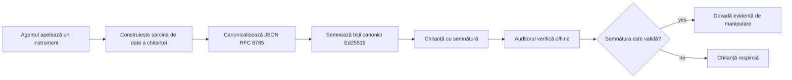
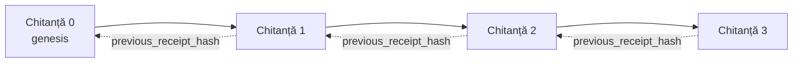

[Urmărește videoclipul lecției: Asigurarea agenților AI cu chitanțe criptografice](https://youtu.be/PLACEHOLDER_VIDEO_ID)

> _(Videoclipul lecției și miniatura vor fi adăugate de echipa de conținut Microsoft după fuziune, în conformitate cu modelul lecției 14 / 15.)_

# Asigurarea agenților AI cu chitanțe criptografice

## Introducere

Această lecție va acoperi:

- De ce sunt importante urmele de audit pentru agenții AI în conformitate, depanare și încredere.
- Ce este o chitanță criptografică și cum diferă de o linie de jurnal nesemnată.
- Cum să produci o chitanță semnată pentru un apel instrument al unui agent în Python simplu.
- Cum să verifici o chitanță offline și să detectezi modificările neautorizate.
- Cum să legi chitanțele astfel încât eliminarea sau reordonarea uneia să strice șirul.
- Ce demonstrează chitanțele și ce NU demonstrează în mod explicit.

## Obiective de învățare

După ce parcurgi această lecție, vei ști cum să:

- Identifici modurile de defectare care motivează proveniența criptografică pentru acțiunile agentului.
- Produci o chitanță semnată Ed25519 peste un payload JSON canonic.
- Verifici o chitanță independent folosind doar cheia publică a semnatarului.
- Detectezi modificările neautorizate reexecutând verificarea asupra unei chitanțe modificate.
- Construiești o secvență de chitanțe legate prin hash și explici de ce șirul contează.
- Recunoști granița dintre ceea ce demonstrează chitanțele (atribuirea, integritatea, ordinea) și ceea ce NU demonstrează (corectitudinea acțiunii, validitatea politicii).

## Problema: Urma de audit a agentului tău

Imaginează-ți că ai implementat un agent AI pentru Contoso Travel. Agentul citește cererile clienților, apelează un API de zboruri pentru a căuta opțiuni și rezervă locuri în numele clientului. În ultimul trimestru, agentul a procesat 50.000 de rezervări.

Astăzi sosește un auditor. El pune o întrebare simplă: "Arată-mi ce a făcut agentul tău."

Îi dai fișierele tale jurnal. Auditorul le privește și pune o întrebare mai dificilă: "Cum știu că aceste jurnale nu au fost editate?"

Aceasta este problema urmei de audit. Majoritatea implementărilor de agenți din prezent se bazează pe:

- **Jurnale de aplicație**: scrise de agent însuși, editabile de oricine are acces la sistemul de fișiere.
- **Servicii de jurnalizare în cloud**: evidențiază modificările la nivel de platformă, dar doar dacă auditorul are încredere în operatorul platformei.
- **Jurnale de tranzacții în baza de date**: bine adaptate pentru modificările bazei de date, dar nu pentru apeluri arbitrare ale instrumentelor.

Niciunul dintre acestea nu poate răspunde întrebării auditorului fără ca auditorul să aibă încredere în cineva (în tine, furnizorul tău de cloud, vânzătorul bazei de date). Pentru utilizarea internă, această încredere este adesea acceptabilă. Pentru sarcinile reglementate (finanțe, sănătate, orice subiect al Regulamentului UE privind AI), nu este.

Chitanțele criptografice rezolvă această problemă făcând ca fiecare acțiune a agentului să fie verificabilă independent. Auditorul nu trebuie să aibă încredere în tine. Are nevoie doar de cheia ta publică și de chitanța în sine.

## Ce este o chitanță criptografică?

O chitanță este un obiect JSON care înregistrează ce a făcut un agent, semnat cu o semnătură digitală.


```mermaid
flowchart LR
    A[Agentul apelează un instrument] --> B[Construiește sarcina de date a chitanței]
    B --> C[Canonicalizează JSON RFC 8785]
    C --> E[Semnează biții canonici Ed25519]
    E --> F[Chitanță cu semnătură]
    F --> G[Auditorul verifică offline]
    G --> H{Semnătura este validă?}
    H -- yes --> I[Dovadă evidentă de manipulare]
    H -- no --> J[Chitanță respinsă]
```

O chitanță minimală arată astfel:

```json
{
  "type": "agent.tool_call.v1",
  "agent_id": "contoso-travel-bot",
  "tool_name": "lookup_flights",
  "tool_args_hash": "sha256:a3f9c1...",
  "result_hash": "sha256:7b2e1d...",
  "policy_id": "contoso-travel-policy-v3",
  "timestamp": "2026-04-25T14:30:00Z",
  "sequence": 47,
  "previous_receipt_hash": "sha256:9d4e6a...",
  "signature": {
    "alg": "EdDSA",
    "sig": "c5af83...",
    "public_key": "8f3b2c..."
  }
}
```

Trei proprietăți fac toată treaba:

1. **Semnătura**. Chitanța este semnată de gateway-ul agentului folosind o cheie privată Ed25519. Oricine are cheia publică corespunzătoare poate verifica semnătura offline. Orice modificare a unui câmp invalidează semnătura.

2. **Codificare canonică**. Înainte de semnare, chitanța este serializată folosind Schema de Canonicalizare JSON (JCS, RFC 8785). Acest lucru asigură că două implementări care produc aceeași chitanță logică produc ieșire identică la nivel de byte. Fără canonicalizare, diverși serializatori JSON ar produce semnături diferite pentru același conținut.

3. **Lanț de hash-uri**. Câmpul `previous_receipt_hash` leagă fiecare chitanță de cea anterioară. Eliminarea sau reordonarea unei chitanțe strică fiecare chitanță care a urmat după. Modificările devin vizibile la nivelul lanțului chiar dacă semnăturile individuale sunt ocolite.

Împreună, aceste proprietăți oferă trei garanții:

- **Atribuire**: această cheie a semnat acest conținut.
- **Integritate**: conținutul nu s-a schimbat de la semnare.
- **Ordine**: această chitanță a venit după acea chitanță în lanț.

## Producerea unei chitanțe în Python

Nu ai nevoie de o bibliotecă specială pentru a produce o chitanță. Primitivele criptografice sunt disponibile pe scară largă iar logica este de câteva zeci de linii de Python.

Exercițiile practice din `code_samples/18-signed-receipts.ipynb` parcurg fluxul complet. Varianta rezumat:

```python
import json
import hashlib
import base64
from nacl import signing
from jcs import canonicalize  # JSON canonic RFC 8785

def b64url_nopad(data: bytes) -> str:
    return base64.urlsafe_b64encode(data).decode("ascii").rstrip("=")

def sha256_canonical(obj) -> str:
    """SHA-256 of a Python object's JCS-canonical JSON form."""
    return f"sha256:{hashlib.sha256(canonicalize(obj)).hexdigest()}"

# Generează sau încarcă o cheie de semnare (în producție, stochează într-un seif de chei)
signing_key = signing.SigningKey.generate()
verify_key = signing_key.verify_key

# Construiește sarcina de date a chitanței (fără semnătură încă)
tool_args = {"origin": "SYD", "destination": "LAX"}
tool_result = [{"flight": "QF11", "price": 1850, "stops": 0}]

payload = {
    "type": "agent.tool_call.v1",
    "agent_id": "contoso-travel-bot",
    "tool_name": "lookup_flights",
    "tool_args_hash": sha256_canonical(tool_args),
    "result_hash": sha256_canonical(tool_result),
    "policy_id": "contoso-travel-policy-v3",
    "timestamp": "2026-04-25T14:30:00Z",
    "sequence": 0,
    "previous_receipt_hash": None,
}

# Canonicizează și semnează direct octeții JCS. PureEdDSA realizează intern hashing.
canonical_bytes = canonicalize(payload)
signature_bytes = signing_key.sign(canonical_bytes).signature

# Atașează un obiect de semnătură structurat.
receipt = {
    **payload,
    "signature": {
        "alg": "EdDSA",
        "sig": b64url_nopad(signature_bytes),
        "public_key": b64url_nopad(bytes(verify_key)),
    },
}
```

Acesta este întregul flux de semnare. Exercițiile din notebook explică fiecare pas.

## Verificarea unei chitanțe și detectarea modificărilor neautorizate

Verificarea este operația inversă:

```python
import base64
import hashlib
from nacl import signing
from nacl.exceptions import BadSignatureError
from jcs import canonicalize

def b64url_decode(s: str) -> bytes:
    padding = "=" * ((4 - len(s) % 4) % 4)
    return base64.urlsafe_b64decode(s + padding)

def verify_receipt(receipt: dict) -> bool:
    # Semnătura este un obiect structurat: {"alg", "sig", "public_key"}.
    sig_obj = receipt.get("signature")
    if not sig_obj or sig_obj.get("alg") != "EdDSA":
        return False

    # Reconstruiește payload-ul care a fost de fapt semnat (totul în afară de semnătură).
    payload = {k: v for k, v in receipt.items() if k != "signature"}

    canonical_bytes = canonicalize(payload)

    try:
        verify_key = signing.VerifyKey(b64url_decode(sig_obj["public_key"]))
        verify_key.verify(canonical_bytes, b64url_decode(sig_obj["sig"]))
        return True
    except BadSignatureError:
        return False
```

Această funcție primește o chitanță și returnează `True` dacă semnătura este validă, `False` altfel. Fără apeluri de rețea, fără dependențe de servicii, fără încredere în terți.

Pentru a vedea detectarea modificărilor în acțiune, notebook-ul parcurge:

1. Producerea unei chitanțe valide și confirmarea verificării acesteia.
2. Modificarea unui octet din câmpul `tool_args_hash`.
3. Reexecutarea verificării și vizualizarea eșecului.

Aceasta este demonstrația practică că chitanțele sunt evidente la modificări neautorizate: orice modificare, oricât de mică, strică semnătura.

## Legarea chitanțelor pentru agenți cu mai mulți pași

O singură chitanță semnată protejează o acțiune. Un lanț de chitanțe protejează o secvență.


```mermaid
flowchart LR
    R0[Chitanță 0<br/>genesis] --> R1[Chitanță 1]
    R1 --> R2[Chitanță 2]
    R2 --> R3[Chitanță 3]
    R1 -. previous_receipt_hash .-> R0
    R2 -. previous_receipt_hash .-> R1
    R3 -. previous_receipt_hash .-> R2
```

Fiecare chitanță înregistrează hash-ul chitanței anterioare. Pentru a elimina chitanța 2 fără urmă, un atacator ar trebui să:

- Modifice câmpul `previous_receipt_hash` din chitanța 3 (strică semnătura chitanței 3), SAU
- Forgeze o semnătură nouă pe o chitanță 3 modificată (necesită cheia privată a agentului).

Dacă cheia privată este într-un seif hardware și publici cheia publică cu fiecare chitanță, niciunul dintre aceste atacuri nu este fezabil fără a fi detectat.

Notebook-ul parcurge:

1. Construirea unui lanț de trei chitanțe.
2. Verificarea că `previous_receipt_hash` a fiecărei chitanțe corespunde hash-ului real al chitanței anterioare.
3. Modificarea unei chitanțe din mijloc și vizualizarea opririi lanțului exact în acel punct.

Așa produci o urmă de audit pe care un auditor extern o poate verifica fără să aibă încredere în tine.

## Ce demonstrează chitanțele (și ce NU demonstrează)

Aceasta este secțiunea cea mai importantă a acestei lecții. Chitanțele sunt puternice, dar puterea lor este limitată.

**Chitanțele demonstrează trei lucruri:**

1. **Atribuire**: o anumită cheie a semnat un payload specific.
2. **Integritate**: payload-ul nu s-a schimbat de la semnare.
3. **Ordine**: această chitanță a venit după acea chitanță în lanțul de hash-uri.

**Chitanțele NU demonstrează:**

1. **Corectitudinea**: că acțiunea agentului a fost corectă. O chitanță poate fi semnată atât pentru un răspuns greșit, cât și pentru unul corect.
2. **Conformitatea cu politica**: că politica indicată în `policy_id` a fost efectiv evaluată sau că ar fi permis această acțiune dacă ar fi fost verificată. Chitanța înregistrează ceea ce s-a afirmat, nu ceea ce a fost impus.
3. **Identitatea dincolo de cheie**: chitanța spune "această cheie a semnat acest conținut." Nu spune "această persoană a autorizat asta." Legarea unei chei de o persoană sau organizație necesită o infrastructură separată de identitate (un director, un registru de chei publice etc.).
4. **Adevărul datelor de intrare**: dacă agentul primește un prompt manipulat și acționează conform lui, chitanța înregistrează acțiunea fidel. Chitanțele sunt în aval de validarea intrărilor, nu un substitut pentru aceasta.

Această graniță este importantă din două motive:

- Îți spune pentru ce sunt utile chitanțele: pentru a face comportamentul agentului auditabil și evident modificărilor neautorizate, chiar și peste granițele organizaționale.
- Îți spune ce straturi suplimentare ai nevoie: validarea intrărilor (Lecția 6), aplicarea politicilor (acoperită pe scurt mai jos) și infrastructura de identitate (în afara scopului acestei lecții).

O greșeală frecventă este să presupui că "avem chitanțe" înseamnă "suntem guvernați." Nu este așa. Chitanțele sunt o bază. Guvernanța este sistemul pe care îl construiești peste această bază.

## Demonstrând că un om a aprobat acțiunea exactă

Punctul 3 de mai sus merită propria secțiune: o chitanță de acțiune spune "această cheie a semnat acest conținut," niciodată "un om a autorizat asta." Pentru acțiuni cu risc ridicat (returnări, ștergeri, transferuri bancare), cadrele de guvernanță cer din ce în ce mai mult această afirmație lipsă, iar ea poate fi produsă cu aceleași primitive pe care le-ai construit în această lecție.

Notebook-ul următor `code_samples/human-authorization-receipts.ipynb` adaugă un al doilea tip de chitanță, `human.approval.v1`, în aceeași formă de plic ca și chitanțele lecției (un payload tipizat semnat Ed25519 peste octeții săi JCS canonici, cu obiectul `signature` în afara octeților semnați). Un semnatar numit semnează **acțiunea canonică completă și digestul acesteia** înainte de execuție; chitanța de acțiune a agentului poartă **același digest de acțiune** și o referință `parent_approval_ref`, hash-ul chitanței aprobării, aceeași convenție ca `previous_receipt_hash` în lanțul construit anterior. O singură funcție `verify_chain` verifică ambele artefacte sub **registre separate de chei fixate** (cheile aprobatorului vs cheile agentului), deci drumul codului este comun, dar autoritățile nu sunt.

Proprietatea obținută, exprimată cu atenție: *omul a aprobat această acțiune exactă, iar agentul a executat exact acea acțiune aprobată.* Facilitățile de refuz din notebook sunt ceea ce face această proprietate reală și nu doar afirmată:

- setul clasic: manipulare, reprezentant confuz, redare (replay), chei false pe oricare parte, intrare malformată;
- **autoritate expirată**: o semnătură care încă verifică, dar este totuși refuzată deoarece versiunea politicii s-a schimbat, cheia aprobatorului a fost rotită în afara registrului fixat, sau aprobarea a expirat înainte de execuție;
- **substituție de digest**: o chitanță de acțiune valid semnată indicând o aprobare *reală* care leagă o acțiune canonică *diferită*.

Fiecare eșec refuză cu un motiv distinct, astfel că un auditor care citește refuzul poate spune dacă autoritatea a expirat sau acțiunea executată s-a schimbat. Regula pe care o predă notebook-ul: o aprobare semnată nu este autoritate de una singură. Autoritatea există numai dacă ambele chitanțe încă leagă aceeași acțiune canonică la momentul execuției. Chitanța de aprobare umană este o compoziție educațională definită de această lecție, nu un tip de chitanță definit de `draft-farley-acta-signed-receipts`.

## Referințe pentru producție

Codul Python din această lecție este intenționat minim pentru a putea citi fiecare linie și a înțelege exact ce se întâmplă. În producție, ai două opțiuni:

1. **Construiește direct pe primitivele criptografice.** Cele 50 de linii pe care le-ai văzut mai sus sunt suficiente pentru multe cazuri de utilizare. PyNaCl (Ed25519) și pachetul `jcs` (JSON canonic) sunt biblioteci bine întreținute și auditate.

2. **Folosește o bibliotecă de chitanțe pentru producție.** Mai multe proiecte open-source implementează același model cu funcționalități suplimentare (rotația cheilor, verificare în lot, distribuția setului JWK, integrare cu motoare de politici):
   - Fluxul de semnare folosește convențiile JCS și de domeniu al semnăturii într-un Internet-Draft IETF independent ([`draft-farley-acta-signed-receipts`](https://datatracker.ietf.org/doc/draft-farley-acta-signed-receipts/), revizia 02). Chitanța educațională plată a lecției diferă de plicul `{payload, signature}` al draftului și nu este prezentată ca o implementare conformă. Draftul publică un set de conformitate comun ([agent-governance-testvectors](https://github.com/ScopeBlind/agent-governance-testvectors)) pentru implementările care vizează formatul său de interschimb.
   - Microsoft Agent Governance Toolkit compune chitanțele cu decizii bazate pe politică Cedar; vezi Tutorialul 33 din acel depozit pentru un exemplu complet de la un capăt la altul.
   - Pachetele `protect-mcp` (npm) și `@veritasacta/verify` (npm) oferă o implementare bazată pe Node pentru semnarea chitanțelor și verificarea offline, concepută pentru a înveli orice server MCP cu o urmă de audit evidentă pentru modificări, inclusiv un flux de co-semnare în care o acțiune pusă pe pauză emite o chitanță de aprobare legată de digestul acțiunii (susținută WebAuthn în fluxul desktop), același model de chitanță de aprobare ca în notebook-ul de autorizare umană de mai sus.
   - SDK-ul Python **[nobulex](https://github.com/arian-gogani/nobulex)** (`pip install nobulex`) oferă același model Ed25519 + JCS în Python cu integrări LangChain și CrewAI, inclusiv vectori de testare pentru validare încrucișată publicați și o mapare de conformitate contribuită prin [OWASP PR #2210](https://github.com/OWASP/CheatSheetSeries/pull/2210).

Decizia dintre a scrie propriul cod și a folosi o bibliotecă reflectă decizia dintre a scrie propria bibliotecă JWT și a folosi una testată: ambele sunt rezonabile; biblioteca economisește timp și reduce suprafața de audit; abordarea de la zero te obligă să înțelegi fiecare primitiv. Această lecție predă drumul de la zero pentru a avea fundația pentru oricare opțiune.

## Verificare a cunoștințelor

Testează-ți înțelegerea înainte de a trece la exercițiul practic.

**1. O chitanță este semnată cu cheia privată Ed25519 a agentului. Auditorul are doar cheia publică. Poate auditorul verifica chitanța offline?**

<details>
<summary>Răspuns</summary>

Da. Verificarea Ed25519 necesită doar cheia publică și octeții semnați. Fără apeluri de rețea, fără dependențe de servicii. Aceasta este proprietatea care face chitanțele utile în mediile izolate (air-gapped), cu mai multe organizații sau în audituri cu încredere redusă.
</details>

**2. Un atacator modifică câmpul `policy_id` al unei chitanțe pentru a susține că a fost guvernată de o politică mai permisivă. Semnătura a fost făcută peste payload-ul original. Ce se întâmplă în timpul verificării?**

<details>
<summary>Răspuns</summary>


Verificarea eșuează. Semnătura a fost calculată peste octeții canonici ai încărcăturii originale; modificarea oricărui câmp schimbă acei octeți, ceea ce face ca semnătura să fie invalidă. Atacatorul ar avea nevoie de cheia privată pentru a produce o semnătură validă nouă, pe care nu o deține.
</details>

**3. De ce chitanța include un `tool_args_hash` și `result_hash` în loc de argumentele brute și rezultatul brut?**

<details>
<summary>Răspuns</summary>

Două motive. În primul rând, chitanța poate trebui arhivată sau transmisă în medii în care scurgerea conținutului brut (PII, date de afaceri) este o problemă. Hash-ul păstrează chitanța mică și conținutul privat; auditorul verifică că hash-ul corespunde unei copii stocate separat a conținutului actual. În al doilea rând, hash-urile au o dimensiune fixă; o chitanță cu hash-uri are o dimensiune limitată indiferent cât de mari au fost intrările și ieșirile.
</details>

**4. Câmpul `previous_receipt_hash` leagă fiecare chitanță de cea precedentă. Dacă un atacator șterge în liniște o chitanță din mijlocul lanțului, ce devine invalid?**

<details>
<summary>Răspuns</summary>

Fiecare chitanță care a venit după cea ștearsă. Câmpurile lor `previous_receipt_hash` nu mai corespund lanțului real (pentru că chitanța la care făceau referire nu mai există sau lanțul acum indică un alt precedent). Pentru a ascunde ștergerea, atacatorul ar trebui să re-semneze fiecare chitanță ulterioară, ceea ce necesită cheia privată.
</details>

**5. O chitanță este verificată cu succes. Asta dovedește că acțiunea agentului a fost corectă, solidă sau conformă cu politica?**

<details>
<summary>Răspuns</summary>

Nu. O chitanță validă dovedește trei lucruri: atribuirea (această cheie a semnat acest conținut), integritatea (conținutul nu s-a schimbat) și ordonarea (această chitanță a venit după acea chitanță). NU dovedește că acțiunea a fost corectă, că politica indicată în `policy_id` a fost efectiv evaluată sau că agentul a respectat fiecare regulă. Chitanțele fac comportamentul agentului auditable, nu neapărat corect. Aceasta este cea mai importantă delimitare din lecție.
</details>

## Exercițiu Practic

Deschide `code_samples/18-signed-receipts.ipynb` și completează toate cele patru secțiuni:

1. **Secțiunea 1**: Semnează prima ta chitanță și verific-o.
2. **Secțiunea 2**: Modifică chitanța și observă eșecul verificării.
3. **Secțiunea 3**: Construiește un lanț de trei chitanțe și verifică integritatea lanțului.
4. **Secțiunea 4**: Aplică modelul unui agent construit cu Microsoft Agent Framework: înfășoară un apel de tool în semnarea chitanței, apoi verifică chitanța independent.

**Provocare suplimentară 1:** extinde schema chitanței cu un câmp suplimentar ales de tine (de exemplu, un ID de cerere pentru trasabilitate), actualizează logica canonicală de semnare pentru a-l include și confirmă că chitanța încă trece verificarea. Apoi modifică câmpul după semnare și confirmă că verificarea eșuează. Acest lucru te forțează să înțelegi cum contribuie fiecare octet din codificarea canonică la semnătură.

**Provocare suplimentară 2:** Aplică SHA-256 pe două dintre chitanțele tale concatenate în ordine deterministă și încorporează digestul obținut ca un câmp nou pe o a treia chitanță înainte de semnare. Verifică că toate cele trei chitanțe trec verificarea. Tocmai ai construit o dovadă de includere într-un pas: oricine deține a treia chitanță poate demonstra că primele două existau la momentul semnării, fără a dezvălui conținutul lor. Acesta este modelul folosit la scară largă de chitanțele cu dezvăluire selectivă (angajamente Merkle, RFC 6962).

## Concluzie

Chitanțele criptografice oferă agenților AI o pistă de audit care este:

- **Verificabilă independent**: orice parte cu cheia publică poate verifica, fără dependență de serviciu.
- **Evidențiere a modificărilor**: orice modificare invalidează semnătura.
- **Portabilă**: o chitanță este un fișier JSON mic; poate fi arhivată, transmisă și verificată oriunde.
- **Aliniată la standarde**: construită pe Ed25519 (RFC 8032), JCS (RFC 8785) și SHA-256, toate primitive larg implementate.

Nu sunt un substitut pentru validarea intrărilor, aplicarea politicilor sau infrastructura de identitate. Sunt o fundație pentru aceste nivele. Când implementezi agenți în sarcini reglementate, în fluxuri multi-organizaționale sau orice context în care un auditor viitor nu poate fi presupus să aibă încredere în tine, chitanțele sunt modul prin care faci pista de audit onestă.

Cel mai important mesaj: chitanțele dovedesc cine a spus ce și când. Nu dovedesc că ceea ce a fost spus este adevărat sau corect. Păstrează această distincție strâns. Este diferența dintre un sistem de proveniență onest și unul înșelător.

## Lista de verificare pentru producție

Când ești gata să treci de la această lecție la implementarea agenților cu chitanțe semnate într-un mediu real:

- [ ] **Mută cheia de semnare de pe laptopul dezvoltatorului.** Folosește Azure Key Vault, AWS KMS sau un modul hardware de securitate. Cheia privată care semnează chitanțele tale nu trebuie să existe niciodată în controlul sursei sau în clar pe mașinile aplicației.
- [ ] **Publică cheia publică de verificare.** Auditorii au nevoie să verifice offline. Modelul standard este un JWK Set la un URL binecunoscut (RFC 7517), de ex., `https://your-org.example.com/.well-known/agent-keys.json`.
- [ ] **Ancorează lanțul extern.** Periodic scrie hash-ul capului lanțului într-un jurnal de transparență (Sigstore Rekor, autoritate de timestamp RFC 3161 sau un al doilea sistem intern) pentru ca o parte externă să poată confirma „acest lanț a existat la acest moment.”
- [ ] **Stochează chitanțele imuabil.** Stocarea tip append-only (Azure Storage cu politici de imuabilitate, AWS S3 Object Lock) împiedică un insider să rescrie istoricul la nivel de stocare.
- [ ] **Decide păstrarea.** Multe regimuri de conformitate cer păstrare pe mai mulți ani. Planifică creșterea volumului de chitanțe (fiecare chitanță are ~500 de octeți; un agent care face 10K apeluri pe zi produce ~1.8 GB pe an).
- [ ] **Documentează ce nu acoperă chitanțele.** Chitanțele dovedesc atribuirea, integritatea și ordonarea. Manualul tău de proceduri trebuie să listeze explicit ce controale suplimentare (validarea intrărilor, aplicarea politicilor, limitarea ratei, infrastructura de identitate) funcționează împreună cu chitanțele în postura ta de guvernanță.

### Mai ai întrebări despre securizarea agenților AI?

Alătură-te [Microsoft Foundry Discord](https://aka.ms/ai-agents/discord) pentru a întâlni alți învățăcei, a participa la ore de consultanță și a primi răspunsuri la întrebările tale despre agenții AI.

## Dincolo de această lecție

Această lecție acoperă semnarea unei singure chitanțe și secvențe înlănțuite prin hash. Aceleași primitive formează mai multe modele avansate pe care le poți întâlni pe măsură ce postura ta de guvernanță se maturizează:

- **Dezvăluire selectivă.** Când câmpurile unei chitanțe sunt angajate independent (arbore Merkle stil RFC 6962), poți dezvălui câmpuri specifice auditorilor specifici și dovedi că celelalte nu s-au schimbat fără a le expune. Util când aceeași chitanță trebuie să satisfacă atât un audit cuprinzător (care vrea completitudine), cât și reglementări de minimizare a datelor ca GDPR (care vor ca auditorul să vadă cât mai puțin posibil).
- **Revocarea chitanțelor.** Dacă o cheie de semnare este compromisă, ai nevoie de o modalitate de a marca toate chitanțele semnate cu acea cheie ca neîncredere de la un anumit punct în timp încolo. Modele standard: chei de semnare temporare plus o listă de revocare publicată, sau un jurnal de transparență cu intrări de revocare.
- **Chitanțe bilaterale / cu semnătură divizată.** Unele implementări împart încărcătura semnată în jumătățile pre-execuție (`authorization_*`) și post-execuție (`result_*`) cu semnături independente, utile când decizia de autorizare și rezultatul observat sunt produse de actori diferiți sau la momente diferite. Acest model se adaugă peste formatul chitanței predat în această lecție.
- **Compunerea încărcăturii.** O chitanță sigilează orice octeți pui în `result_hash`. Încărcăturile din lumea reală sunt adesea mai bogate decât un simplu rezultat apel tool: raționamentul pre-decidere (predicția modelului, opțiunile considerate, dovezile și cât de complete sunt, postura de risc, lanțul de responsabilitate, rezultatul porții) pot trăi toate în încărcătură, sigilate de o singură chitanță. Aceasta păstrează formatul chitanței minimal, permițând totodată evoluția schemelor specifice domeniului.
- **Conformitate cross-implementare.** Mai multe implementări independente ale aceluiași format de chitanță (Python, TypeScript, Rust, Go) verifică transversal vectori de test comuni. Dacă construiești propria implementare, validarea cu vectori publicați confirmă compatibilitatea la nivel de protocol.
- **Migrarea post-cuantică.** Ed25519 este larg folosit azi, dar nu este rezistent la computere cuantice. Formatul chitanței este agil față de algoritmi: câmpul `signature.alg` poate purta `ML-DSA-65` (standardul NIST de semnătură post-cuantică) când ai nevoie să migrezi. Planifică o perioadă de tranziție în care chitanțele sunt semnate dual.

## Resurse suplimentare

- <a href="https://datatracker.ietf.org/doc/draft-farley-acta-signed-receipts/" target="_blank">IETF Internet-Draft: Chitanțe semnate pentru controlul accesului machine-to-machine</a>
- <a href="https://learn.microsoft.com/azure/ai-studio/responsible-use-of-ai-overview" target="_blank">Prezentare generală AI responsabil (Azure AI)</a>
- <a href="https://datatracker.ietf.org/doc/html/rfc8032" target="_blank">RFC 8032: Algoritmul de semnătură digitală Edwards-Curve (EdDSA)</a>
- <a href="https://datatracker.ietf.org/doc/html/rfc8785" target="_blank">RFC 8785: Schema de Canonicalizare JSON (JCS)</a>
- <a href="https://datatracker.ietf.org/doc/html/rfc6962" target="_blank">RFC 6962: Transparența Certificatelor</a> (construcție arbore Merkle folosită de chitanțele cu dezvăluire selectivă)
- <a href="https://github.com/microsoft/agent-governance-toolkit/blob/main/docs/tutorials/33-offline-verifiable-receipts.md" target="_blank">Microsoft Agent Governance Toolkit, Tutorial 33: Chitanțe de decizie verificabile offline</a>
- <a href="https://github.com/ScopeBlind/agent-governance-testvectors" target="_blank">Vectori de test pentru conformitatea cross-implementare</a> pentru formatul chitanței folosit în această lecție (Apache-2.0)
- <a href="https://pynacl.readthedocs.io/" target="_blank">Documentația PyNaCl</a> (Ed25519 în Python)

## Lecția Anterioară

[Crearea agenților AI locali](../17-creating-local-ai-agents/README.md)

---

<!-- CO-OP TRANSLATOR DISCLAIMER START -->
**Declinare a responsabilității**:
Acest document a fost tradus folosind serviciul de traducere AI [Co-op Translator](https://github.com/Azure/co-op-translator). În timp ce ne străduim pentru acuratețe, vă rugăm să rețineți că traducerile automate pot conține erori sau inexactități. Documentul original în limba sa nativă trebuie considerat sursa autorizată. Pentru informații critice, se recomandă traducerea profesională realizată de un om. Nu ne asumăm responsabilitatea pentru eventualele neînțelegeri sau interpretări greșite care decurg din utilizarea acestei traduceri.
<!-- CO-OP TRANSLATOR DISCLAIMER END -->